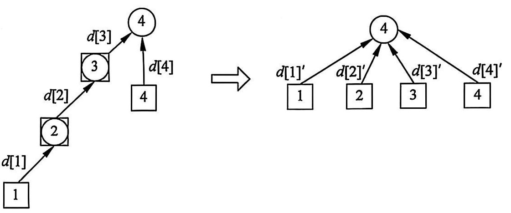
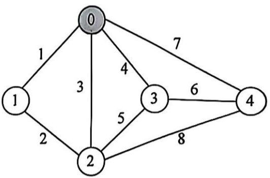
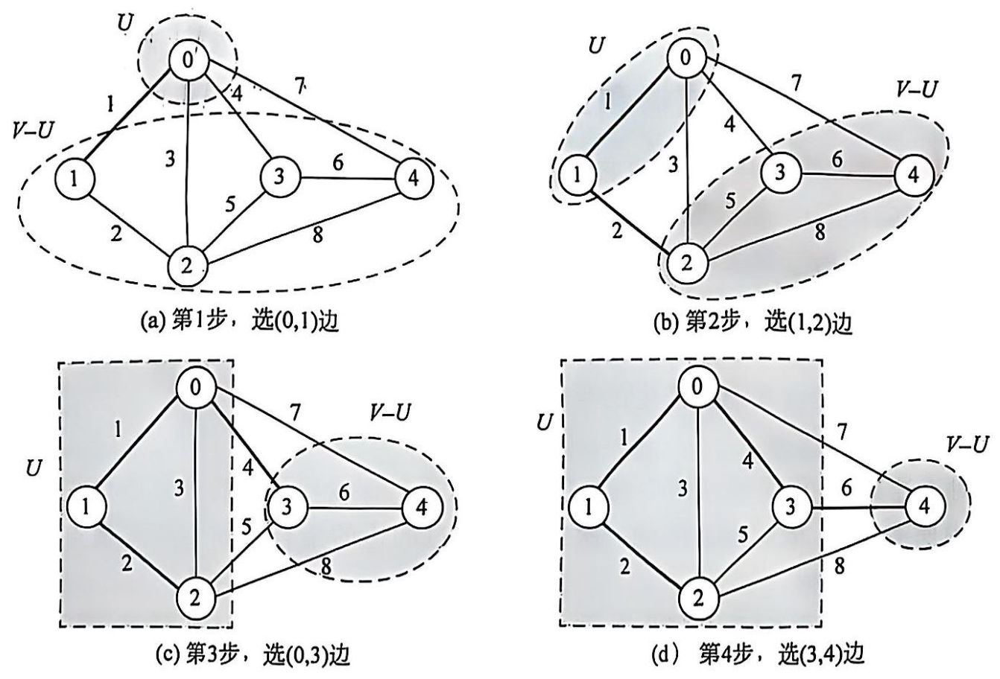
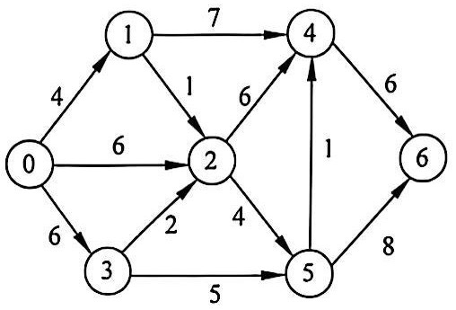
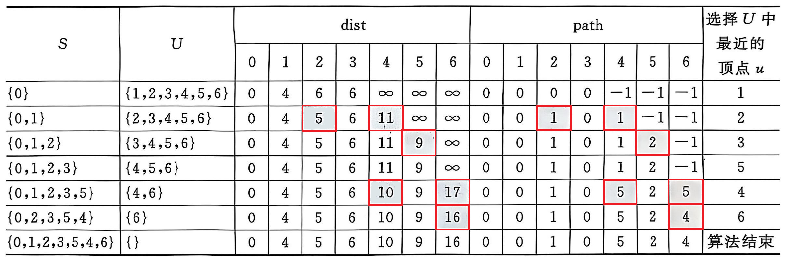

# 数据结构

## 1 线性表


## 2 树


## 3 图

### 3.0 定义

任何图都是由==顶点和边==构成的

图 G 由两个集合 V 和 E 组成，记为 `G=(V,E)`

* V 是顶点的有限集合，记为 `V(G)`

* E 是连接V中两个不同顶点（顶点对）的边的有限集合，记为 `E(G)`

    E(G)确定了图中的数据元素的关系，它可以为空集 （当 `E(G)` 为空集时，图 G 只有顶点而没有边）


#### 3.0.1 相关术语

1. 无向边和有向图

    * 无向图：图中边是无方向的， `E(G)` 为无向边的集合（无向图两点连线叫边）

     

    * 有向图：图中边是有方向的， `E(G)` 为有向边的集合（有向图两点连线叫弧）

     


2. 端点和相邻点

在无向图中，若存在一条边 `(i,j)`，则称顶点 i、j 为该边的两个端点，并称它们互为相邻点（邻接点）

在有向图中，若存在一条边 `<i,j>`，则称此边是顶点 i 的一条出边，是顶点 j 的一条入边，称顶点 i 和 j 分别为此边的起始端点（起点）和终止端点（终点）


3. 度，入度和出度

对于无向图，每个顶点的度定义为以该顶点为一个端点的边数

对于有向图，顶点 v 的度分为入度和出度，入度是以该顶点为终点的入边数目；出度是以该顶点为起点的出边数目,该顶点的度等于其入度和出度之和

------------------------------------

度记为 `D(v)`，入度记为 `ID(v)`，出度记为 `OD(v)`

当一个图有 n 个顶点和 e 条边时，每个顶点的度为 d~i~ 时，则有 $\large{\large{\large{e=\frac{1}{2}\sum\limits_{i=0}^{n-1}d{_i}}}}$


4. 连通、连通图、强连通图

若从顶点 i 到顶点 j 有路径，则称顶点 i 和 j 是连通的

在无向图中，若任意两个顶点 i 和 j 都是连通的，即任何两个节点都是可以到达的，则称该图是连通图

  			  

----------------------------------------

在有向图中，从顶点 i 到 j 和从顶点 j 到 i 都存在路径，即任何两个节点是可以相互到达的，则称该图是强连通图

 			 


5. 子图、连通分量、强连通分量

无向图 G 中极大连通子图称为 G 的连通分量

有向图 G 中极大强连通子图称为 G 的强连通分量

----------------------------------

子图：在图 `G=(V,E)`，`G'=(V',E')` 中，`V'` 是 `V` 的子集，`E'` 是 `E` 的子集，则 `G'` 是 `G` 的子图

极大：将 G 的任何不在该子图中的顶点加入，该子图不在连通（强连通）

极小：将该子图中的任意一条边删除，该子图不在连通（强连通）


6. 权和网

在一个图中，每条边可以标上具有某种含义的数值，该数值称为该边的权

边上带权的图称为带权图，也称为网


#### 3.0.2 邻接矩阵

邻接矩阵是一种**二维数组**，用于表示图的顶点和边的关系

如果图有 n 个顶点，则邻接矩阵是一个 n *n 的矩阵 A


- 对于无向图
    - 如果顶点 i 和顶点 j 之间有一条边，则 `A[i][j] = A[i][j] = A[i][j]=1`（或权值 w）
    - 由于是**无向**的，`A[i][j] = A[j][i]`
    - 若无边，则 `A[i][j] = 0`
    - 无向图的邻接矩阵沿对角线对称
- 对于有向图
    - 如果**有**一条从顶点 i 指向顶点 j 的有向边，则 `A[i][j] = 1`（或权值 w）
    - 由于是**有向**的，`A[i][j] 不一定等于 A[j][i]`
    - 若无边，则 `A[i][j] = 0`


优点：

* 直观，简单，好理解
* 方便查找，检查和计算（时间复杂度为 O(1)）

缺点：

* 不便于增加和删除顶点
* 若图是稀疏图会浪费空间（空间复杂度为 O(n^2^)）


#### 3.0.3 邻接表

邻接表是一种链式和顺序相结合的存储结构

对每个顶点建立一个带头结点的单链表，顺序连接该顶点的所有相邻点，其中每个结点对应一条边，称为边结点

所有的头结点构成一个数组，称为头结点数组

每个单链表中的结点由三个域组成：

顶点域 adjvex（用以指示该相邻点在头结点数组中的下标或相邻点的编号）

权值域 weight（存放对应边的权值）

指针域 nextarc（用以指向依附于顶点i的下一条边所对应的结点）


- 无向图：若 i 和 j 相连，则在 **i 的链表** 和 **j 的链表** 都加上对方
- 有向图：若有一条从 i 指向 j 的边，则仅在 **i 的链表** 中添加 j


- 优点：节省空间，仅存储实际存在的边，适用于稀疏图
- 缺点：查询某两点是否直接相连的时间复杂度为 O(出度)


### 3.1 图的遍历

#### 3.1.1 深度优先搜索

深度优先搜索（DFS）是一种用于遍历或搜索图的算法

特点是沿着一个分支尽可能深入，直到无法继续时再回溯

该算法类似于树的先根遍历


使用步骤：

1. 从某个起点开始访问，标记该节点已访问
2. 访问该节点的所有未访问邻居，按**递归**方式继续深入
3. 如果某个节点的所有邻居都已访问，则回溯到上一个节点，继续搜索其他未访问的路径
4. 直到所有可达节点都访问过，搜索结束


DFS 可以使用**递归**或**栈**来实现


样例：

```cpp
int dir[4][2] = { {-1,0}, {1,0}, {0,-1}, {0,1} }; 
// 定义四个方向：上、下、左、右 (按 (x, y) 坐标偏移)
int n, m;
// n: 行数, m: 列数

// map  二维矩阵
// x    当前所在的行索引
// y    当前所在的列索引
void DFS(vector<vector<int>>& map, int x, int y)
{
    // 标记当前位置为 0，表示已访问，避免重复搜索
    map[x][y] = 0;

    // 遍历四个方向：右、左、下、上
    for (int i = 0; i < 4; ++i)
    {
        int u = x + dir[i][0];
        int v = y + dir[i][1];

        // 检查新位置是否在边界内, 并且未访问
        if (u >= 0 && v >= 0 && u < n && v < m && map[u][v])
            DFS(map, u, v);
    }
}
```


#### 3.1.2 广度优先搜索

广度优先搜索（BFS）是也一种用于遍历或搜索图的算法

特点是按层次逐步扩展搜索范围，即先访问当前节点的所有邻居，再访问邻居的邻居，以此类推


使用步骤：

1. 使用**队列**存储待访问的节点，从起点开始
2. 标记已访问的节点，避免重复访问
3. 从队列中取出一个节点，访问它的所有未访问邻居，并将邻居加入队列
4. 重复以上步骤，直到队列为空，搜索结束


BFS 是**逐层扩展**，不像 DFS 那样深入到底再回溯


样例：

```cpp
int dir[4][2] = { {-1,0}, {1,0}, {0,-1}, {0,1} }; 
// 定义四个方向：上、下、左、右 (按 (x, y) 坐标偏移)
int n, m;
// n: 行数, m: 列数

// map  二维矩阵
// x    当前所在的行索引
// y    当前所在的列索引
void BFS(vector<vector<int>>& map, int x, int y)
{
    queue<pair<int, int>> qu;
    qu.push({ x, y });	// 起点入队
    map[x][y] = 0;	// 标记为已访问

    while (!qu.empty())	// 当队列不为空时继续搜索
    {
        pair<int, int> pa = qu.front();
        qu.pop();
        x = pa.first;
        y = pa.second;

        for (int i = 0; i < 4; ++i)
        {
            int u = x + dir[i][0];
            int v = y + dir[i][1];

            if (u >= 0 && v >= 0 && u < n && v < m && map[u][v])
                qu.push({ u, v }), map[u][v] = 0;     // 加入队列, 标记为已访问
        }
    }
}
```


### 3.2 并查集

#### 3.2.1 基础并查集

并查集（DSU）是一种用于 **处理不相交集合的合并与查询问题** 的数据结构

常用于 **将两个元素添加到一个集合中** 和 **判断两个元素在不在同一个集合**


主要操作：

1. 查找（Find）：查询元素属于哪个集合，并返回该集合的代表（根）
2. 合并（Union）：将两个集合合并，使它们共享相同的代表（根）


路径压缩：在 `find(x)` 过程中，把 `x` 的所有祖先都直接连到根节点，加速后续查询


时间复杂度：复杂度降低至 **近似 O(1)（O(α(n))）**，其中 `α(n)` 是 **阿克曼函数的逆函数**，增长极慢


样例：

```cpp
vector<int> father; // 存储每个节点的父节点
int n;	// 节点总数

// 并查集初始化
void init()
{
    father.clear();
    father.resize(n);
    for (int i = 0; i < n; ++i)
        father[i] = i; // 初始时，每个节点的父节点指向自己
}

// 寻找根结点(路径压缩)
int find(int u)
{
    // 如果 u 是自己的父亲, 则说明它是根节点, 直接返回
    // 否则递归查找 u 的根, 并将其直接连接到根, 用三目运算符简化代码
    return u == father[u] ? u : father[u] = find(father[u]);
}

// 判断 u 和 v 是否属于同一个集合
bool isSame(int u, int v)
{
    u = find(u);
    v = find(v);
    return u == v; // 如果根相同, 则说明在同一个集合
}

// 合并 u 和 v 所在的集合
void join(int u, int v)
{
    u = find(u);
    v = find(v);
    if (u == v) return; // 如果根相同, 说明它们已经在同一个集合, 直接返回

    father[v] = u; // 将 v 的根指向 u, 即合并集合
}
```


#### 3.2.2 带权并查集

带权并查集（Weighted Union-Find）是在并查集的基础上，增加一个额外的“权值”信息，用于解决带权关系的动态连通性问题

例如，可以用于解决「关系传递」问题，如判断某两点之间的相对位置、距离、权重关系等


实现思路：

定义一个权值数组 `d`，把节点 `i` 到父节点的权值记为 `d[i]`

原来的权值 `d[i]`，压缩后记为 `d[i]'`

例：`d[1]' = d[1] + d[2] + d[3]`

注意：该例子中，权值是相加的关系，比较简单；在具体的题目的中，可能有相乘、异或等符合题意的操作




样例：

```cpp
vector<int> s;  // 根节点
vector<int> d;  // 到根结点的权值

void init(int n)     // 初始化
{
    s = vector<int>(n + 1);
    d = vector<int>(n + 1, 0);
    for (int i = 0; i <= n; i++) s[i] = i;
}

int find(int x)     // 带权值的路径压缩
{
    if (x != s[x])
    {
        int t = s[x];
        s[x] = find(s[x]);  // 路径压缩
        d[x] += d[t];       // 权值更新为x到根结点的权值
        // d[x] 原本的值是 x 到 t 的权值
        // 将 t 挂到根结点上后, d[t] 为 t 到根结点的权值
    }
    return s[x];
}

void merge(int a, int b, int v)     // 集合合并
{
    int roota = find(a), rootb = find(b);
    if (roota != rootb)
    {
        s[roota] = rootb;
        d[roota] = d[b] - d[a] + v;
        // b 到其根的权值减 a 到其根的权值加上 b 到 a 的权值
    }
}
```


#### 3.2.3 扩展域并查集

扩展域并查集（Extended Disjoint Set Union, Extended DSU）是一种在传统并查集的基础上进行扩展的数据结构

通常用于解决涉及 **关系推断** 或 **带有额外约束的集合合并** 问题


通常我们会用额外的存储空间，将每个元素的不同状态映射到一个更大的集合空间中

这样，我们可以通过普通的并查集操作来管理复杂的关系


以扩展两倍集合大小举例说明


如果要维护 `n` 个元素的==两种==状态：

- **正常状态**：`x` 代表 `x` 本身的身份（朋友身份）
- **对立状态**：`x + n` 代表 `x` 的敌人身份

以此扩展数组的大小为 **`2n`**，使得：

- `father[x]` 代表 `x` 的父节点，即 `x` 属于哪个集合
- `father[x + n]` 代表 `x` 的敌人属于哪个集合

使用用并查集操作，在 `x` 和 `x+n` 之间维护敌对关系


关系维护：

*  `x` 和 `y` 是朋友
    * `merge(x, y)`：把 `x` 和 `y` 合并到同一集合
    * `merge(x + n, y + n)`：`x` 的敌人 和 `y` 的敌人也要合并（敌人的敌人是朋友）
*  `x` 和 `y` 是敌人（敌人的敌人是朋友）
    * `merge(x, y + n)`：`x` 和 `y` 的敌人是同一组
    * `merge(y, x + n)`：`y` 和 `x` 的敌人是同一组


关系查询：

* `find(x) == find(y)`，`x` 和 `y` 是朋友
* `find(x) == find(y + n)`，`x` 和 `y` 是敌人


样例：

```cpp
vector<int> f;
void init(int n)
{
    f.resize(2 * n + 1);
    for (int i = 0; i <= 2 * n; i++) f[i] = i;
}

int find(int x)
{
    return f[x] == x ? x : f[x] = find(f[x]);
}

void merge(int x, int y)
{
    int fx = find(x), fy = find(y);
    if (fx != fy) f[fx] = fy;
}

// 处理朋友和敌人关系, 返回 false 代表与上述关系矛盾
bool Union(int x, int y, int type, int n)
{
    if (type == 1)  // 朋友关系
    {
        if (find(x) == find(y + n)) return false;
        merge(x, y);
        merge(x + n, y + n);
    }
    else // 敌人关系 
    {
        if (find(x) == find(y)) return false;
        merge(x, y + n);
        merge(y, x + n);
    }
    return true;
}
```


### 3.3 最小生成树

最小生成树（Minimum Spanning Tree，MST）是指在一个无向连通带权图中，选取若干条边，使得==所有顶点都连通==

要求所选边的==总权值最小==，同时==不形成回路==

性质：

1. 连通性：最小生成树包含图中的所有顶点，使图仍然保持连通
2. 无环性：最小生成树不能形成回路，否则可以去掉某些边使权值更小
3. 边数：对于 `n` 个顶点的图，最小生成树的边数一定是 `n - 1`
4. 最优性：最小生成树是所有可能的生成树中，总权值最小的


#### 3.3.1 prim

prim 算法是从==选节点==的角度采用贪心的策略，每次寻找距离生成树最近的节点并加入到生成树中


算法流程：

1. 从任意一个顶点开始，初始化生成树（将该点加入生成树中）

2. 在所有未连接生成树 **外部顶点** 的边中，选择离最小生成树的任意结点 **权值最小**（距离生成树最近）的一条边，并将该边的另一个顶点加入生成树

3. 重复步骤 2，直到所有顶点都加入生成树

                 

**步骤1，将 `0` 结点加入生成树													步骤2，寻找最近边加入生成树（用 `U` 表示生成树的顶点集，用 `V-U` 表示候选顶点）**


时间复杂度：

- 使用邻接矩阵 + 线性查找最小值：$$O(n^2)$$
- 使用优先队列：$$O(mlog⁡n)$$


算法需求：

假设有一个 n 个顶点的无向加权图 G，其**邻接矩阵**存储了顶点间的边权值：

1. 维护一个数组 `dist[]`，存储当前生成树到其他顶点的最小边权值，初始化 `dist[i] = INT_MAX - 1`（不设置 `INT_MAX` 为了方便确定初始点）
2. 维护一个 `inTree[]` 数组，标记哪些顶点已加入生成树
3. 循环 `n-1` 次：
    - 在未加入生成树的顶点中，找到 `minDist[]` 值最小的顶点
    - 将该顶点加入生成树，并更新其他顶点的 `minDist[]` 值（如果有更小的边，则更新）
4. 最终 `minDist[]` 中的值之和就是最小生成树的权值


示例：

```cpp
// map 邻接矩阵, v 代表顶点数
int prim(vector<vector<int>> &map, int v)
{
    vector<int> dist(v + 1, INT_MAX - 1);    // 初始点到每个顶点的最短距离
    vector<bool> inTree(v + 1, false);        // 该顶点是否被包含

    for (int i = 1; i < v; i++)     // 循环 v - 1 次，每次选择一个新的顶点加入最小生成树
    {
        int cur = -1;
        int minVal = INT_MAX;
        for (int j = 1; j <= v; j++)    // 寻找当前未加入生成树的且 minDist 值最小的顶点 cur
        {
            if (!inTree[j] && dist[j] < minVal)    // 如果是初始点, 将第一个点加入生成树
            {
                minVal = dist[j];
                cur = j;
            }
        }

        inTree[cur] = true;
        for (int j = 1; j <= v; j++)    // cur 到 j 的距离 map[cur][j] 小于 dist[j], 就更新 dist[j]
            if (!inTree[j] && map[cur][j] < dist[j])
                dist[j] = map[cur][j];
    }

    int ans = 0;
    for (int i = 2; i <= v; i++)    // 不统计第一个顶点, 第一个顶点到生成树的权值为 0
        ans += dist[i];

    return ans;
}
```


#### 3.3.2 kruskal

prim 算法是维护节点的集合，而 kruskal 是维护边的集合

kruskal 算法的基本思想是按照边的权值从小到大排序，并逐步选择权值最小的边加入生成树，同时避免形成环，直到生成树包含 `n−1` 条边


算法实现：

1. 排序：按边的权值从小到大排序
2. 初始化：每个顶点自成一个集合（使用并查集进行管理）
3. 遍历边：
    - 选取当前权值最小的边，判断其两个顶点是否属于同一个连通分量
    - 若不在同一集合，加入最小生成树，并合并这两个集合，否则跳过该边（避免成环）
4. 终止条件：当最小生成树中包含 `n−1` 条边时，算法结束


原理：

* 切分定理：在一个连通图中，若将顶点划分为两个不相交的集合 `S` 和 `V−S`，则在这些跨越该切分的所有边中，权值最小的那条边一定属于最小生成树
* 由于边已经排序，每次选择的边是当前最优的，且切分定理确保最小的边是安全的，不会错过生成树的必选边
* 所以，贪就完事了!!!


示例：

```cpp
class edge
{
public:
    int l, r, k;
    edge(int L, int R, int K) :l(R), r(R), k(K) {}
};

int kruskal(vector<edge>& edges, int v)
{
    vector<int> father(v + 1, -1);
    for (int i = 1; i <= v; ++i) father[i] = i;
    
    function<int(int)> find = [&](int u) { return u == father[u] ? u : father[u] = find(father[u]); };
    // lambda 表达式构造并查集的 find 函数

    sort(edges.begin(), edges.end(), [](const edge& a, const edge& b) {return a.k < b.k; });
    // 对边按照权值排序

    int ans = 0;
    for (edge edge : edges)
    {
        int x = find(edge.l);
        int y = find(edge.r);
        
        // 如果这两个顶点都已经加入生成树, 跳过该边
        if (x != y)
        {
            ans += edge.k;
            father[x] = y;
        }
    }
    return ans;
}
```

时间复杂度：$O(ElogE)$


### 3.4 拓扑排序

拓扑排序（Topological Sorting）是针对==有向无环图==的一种线性排序

使得对于图中的每一条有向边 $u→v$，顶点 $u$ 在排序结果中都出现在顶点 $v$ 之前

简单来说，它是一种对依赖关系进行排序的方法


应用场景：

1. 任务调度：如果任务 $A$ 依赖于任务 $B$，那么 $B$ 必须在 $A$ 之前完成，用拓扑排序生成任务的完成顺序
2. 判断环：可以用来判断一个有向图中是否有环


实现方法：

1. `Kahn` 算法（基于入度的 BFS）
    * 计算每个节点的入度（指向该节点的边的数量）
    * 将所有入度为 0 的节点加入队列
    * 依次从队列中取出节点，将其加入拓扑序列，并移除它的所有出边（更新相邻节点的入度）
    * 若相邻节点入度变为 0，则加入队列，重复步骤 3
    * 如果所有节点都被处理，则排序成功；否则，说明图中存在环

2. 深度优先搜索（DFS + 逆后序）
    * 依次对每个未访问的节点执行 DFS
    * 在递归返回时，将当前节点加入栈（即完成遍历后入栈）
    * 最终，栈中节点的出栈顺序即为拓扑排序。

时间复杂度： $O(V+E)$（遍历所有顶点和边）


注意事项：

- 只有有向无环图才有拓扑排序，如果图中有环，则无法进行拓扑排序
- 拓扑排序结果可能不唯一，不同的遍历顺序可能会得到不同的合法排序


例：

```cpp
void Topo(vector<vector<int>> &map, vector<int> &in)
{
    int n = map.size(); // 结点数量
    vector<int> res;	// 记录排序路径
    queue<int> que;
    for (int i = 0; i < n; i++)
        if (!in[i]) que.push(i);	// 让入度为 0 的结点加入队列

    while (que.size())
    {
        int i = que.front();	// 当前选中的结点
        que.pop();
        res.push_back(i);

        for (int j : map[i])
            if (--in[j] == 0)	// i 的指向的结点入度 -1, 若入度已经为 0 则加入队列
                que.push(j);
    }

    if (res.size() == n)	// 若已经排序的点的数量为 n, 则该图无环, 否则有环
    {
        for (int i = 0; i < n; i++)
            cout << res[i] << " ";
    }
    else
        cout << -1 << endl;
}
```


### 3.5 最短路径

最短路径是图论中的一个经典问题，指的是在加权图（权值可以代表距离、时间、花费等）中，找到从一个起点到某个终点的最小权重路径

主要分为：**单源最短路径** 和 **多源最短路径**


#### 3.5.1 dijkstra 

dijkstra 算法是一种 **单源最短路径算法**，用于计算==从起点到所有其他点==的最短路径，适用于==无负权边==的图

思路和 prim 算法相似，同样是贪心的思路，不断寻找距离源点最近的没有访问过的节点

区别为 prim 是求非访问节点到最小生成树的最小距离，而 dijkstra 是求非访问节点到源点的最小距离


原理：

* 每次贪心地选择 **当前未访问的最短路径节点** 进行扩展

    这样确保了从 **起点到这个节点的路径已经是最短的**，不会再被更新

- 一旦某个节点的最短路径确定后，该路径不会被更优的路径替换（最优子结构）

    这样保证了算法每一步的最优性，可以正确地扩展最短路径


实现步骤：

0. 使用 `dist` 数组，用来记录每一个节点距离源点的最小距离，初始化位每个点到起点的距离（不能直接到达设置为 `INT_MAX`）
1. 从起点开始，每次取出当前距离起点==路径最短==且==没有被选过==的节点 `u`
2. 遍历 `u` 的所有邻居 `v`，如果 `dist[u] + weight < dist[v]`，就更新 `dist[v]`，并标记 `v` 已经访问
3. 重复步骤 2，直到所有节点都被处理



`S` 代表已经访问过的点，`U` 代表未被访问的点，`u` 代表当前未被选过且离起点最近的点（下一轮以此点进行查找）

红框是这一轮需要修改的 `dist` 的值



该方法的时间复杂度和空间复杂度都为：`O(n^2)`，当 `n` 非常大的时候可以使用堆进行优化，可以使用到优先队列，时间复杂度 `O((n+m)logn)`


示例：

```cpp
struct Edge
{
    int v;
    int w;
};

// 堆优化 Dijkstra 实现
vector<int> dijkstra(int n, vector<vector<Edge>>& graph, int start)
{
    vector<int> dist(n, INT_MAX);  // 记录最短路径
    // 最小堆负责弹出当前 dist 最小的节点
    priority_queue<pair<int, int>, vector<pair<int, int>>, greater<>> pq;

    dist[start] = 0;
    pq.push({0, start});

    while (!pq.empty())
    {
        auto [d, u] = pq.top();
        pq.pop();
        // 取出队列顶端元素 {d, u}, 其中 u 是当前最近的未访问节点, d 是其当前最短路径
        
        if (d > dist[u]) continue;	// 不是最优结点, 跳过

        for (auto& edge : graph[u])
        {
            int v = edge.v;
            int w = edge.w;
            if (dist[u] + w < dist[v])
            {
                dist[v] = dist[u] + w;
                pq.push({dist[v], v});	// 当一个结点多次访问时, 最优的路径会自动排序在最前面
            }
        }
    }
    return dist;
}
```


#### 3.5.2 Floyd

Floyd 算法是一种用于计算加权图中所有顶点对之间的最短路径的算法，适用于==有向图或无向图==，==可以处理带有负权边==的情况（但==不适用于负权环==）

因为 Floyd 不依赖贪心思想，而是基于动态规划，只要路径可以被更新，就会迭代计算，最终收敛到最短路径

==负权环==指的是图中存在一个环，使得环内的边权和小于 0，如果一个路径可以不断通过负权环，它的路径长度会无限变小（趋近于负无穷），算法无法收敛


原理：

Floyd 算法基于**动态规划**思想，设 `dist[i][j]` 表示从顶点 `i` 到 `j` 的最短路径长度

并尝试用每一个点 `k` 作为中间点，来更新所有 `i → j` 之间的最短路径


状态转移方程：
$$
\large{\text{dist}[i][j] = \min(\text{dist}[i][j], \text{dist}[i][k] + \text{dist}[k][j])}
$$
其中 `dist[i][j]` 表示直接从 `i` 到 `j` 的最短路径长度，`dist[i][k] + dist[k][j]` 代表 `i` 经过 `k` 到达 `j` 的路径长度

如果 `dist[i][k] + dist[k][j]` 小于 `dist[i][j]`，说明经过 `k` 会更短，更新 `dist[i][j]`


遍历流程：

1. 先枚举中间节点 `k`（外层循环）

2. 再遍历起点 `i`（中间层循环）

3. 最后遍历终点 `j`（内层循环）

若将 `i` 或 `j` 放在外层，当 `k` 的索引大于当前 `i` 或 `j` 时，`d[i][k]` 和 `d[k][j]` 尚未被优化

但将 `k` 放在外层，`i→k` 和 `k→j` 的路径必须已经通过 `1~(k-1)` 中间节点优化过

好比是一个三维坐标，`i` 和 `j` 是平层，而 `k` 是垂直向上的

遍历的顺序是从底向上一层一层去遍历

所以遍历 `k` 的 `for` 循环一定是在最外面，这样才能一层一层去遍历

 


时间复杂度：

Floyd算法有三重循环，时间复杂度为 `O(n^3)`，其中 `n` 是图的顶点数

因此，Floyd 适用于顶点数较少但边数较多的图


示例：

```cpp
// dist 存储 i 到 j 的最近距离, 若 i 到 j 有连线则初始值为路径的权值, 否则为 INT_MAX
void floyd(vector<vector<int>>& dist)
{
    int n = dist.size();

    for (int k = 0; k < n; k++)    // 选取中间点 k
        for (int i = 0; i < n; i++)    // 遍历起点 i
            for (int j = 0; j < n; j++)    // 遍历终点 j
                if (dist[i][k] < INT_MAX && dist[k][j] < INT_MAX)    // 避免溢出
                    dist[i][j] = min(dist[i][j], dist[i][k] + dist[k][j]);
}
```


## 4 其他

### 4.1 ST表

ST 表（Sparse Table）是一种用于**静态区间查询**的数据结构，能够在**O(1)** 时间内查询出某个区间的 **最值（最大值、最小值）**

其的构建需要 **O(n log n)** 的预处理时间


特点：

1. 适用于静态数组

    **ST 表不支持修改数组**，但能高效查询区间最大/最小值、gcd、或按位与/或等

2. 预处理时间 O(n log n)，查询 O(1)

    预处理时使用 **动态规划**，构建 `Max[i][j]` 数组，使得查询变为 `O(1)`

3. 仅适用于满足 **"幺半群性质"** 的操作：

    例如 **最大值（max）、最小值（min）、gcd**，但不适用于 **求区间和（sum）**，因为 `a + b ≠ min(a, b) 或 max(a, b)`


构造：

ST 表用二维数组存储

$\large{Max[i][j]}$ 表示从 `i` 开始，长度为 `2^j` 的区间  $\large{[i, i + 2^{j} - 1]}$ 内的最大值

$\large{Max[i][0]}$ 表示从 `i` 到 `i` 范围的最大值，即自身的大小，初始条件下进行赋值


递推：
$$
\large{Max[i][j]=max⁡(Max[i][j−1],Max[i+2^{j−1}][j−1])}
$$
$\large{Max[i][j-1]}$ 表示 $\large{[i, i + 2^{j-1} - 1]}$ 的最大值

$\large{Max[i + 2^{j-1}][j-1]}$ 表示 $\large{[i + 2^{j-1}, i + 2^j - 1]}$ 的最大值

两者最大值的较大者即为两者并集 $\large{[i, i + 2^j - 1]}$ 的最大值


查询：

查询 `[L, R]` 之间的最大值：

1. 计算 `s = log2(R - L + 1)`，找到最大 `2^s` 的区间
2. 由于 ST 表存储的是 `2^s` 形式的区间，可以用两个连续的 `2^s` 区间覆盖 `[L, R]`

$$
\large{max(Max[L][s],Max[R−2^{s} + 1][s])}
$$


例：

```cpp
// 二维数组, 用于存储区间 [i, i + 2 ^ j - 1] 内的 最大/最小值
// 180000 是本样例的数值上限
// 18 是 log2(180000)
int Max[180001][19], Min[180001][19];

// 查询
int ST(int l, int r)
{
	int s = log2(r - l + 1);
	return max(Max[l][s], Max[r - (1 << s) + 1][s]) - min(Min[l][s], Min[r - (1 << s) + 1][s]);
}

int main()
{
	int n, m;
	cin >> n >> m;
    
    // 构造
	for (int i = 1; i <= n; ++i)
		cin >> Max[i][0], Min[i][0] = Max[i][0];
	for (int j = 1; j <= 18; ++j)
	{
		for (int i = 1, k = 1 << j; i + k <= n + 1; ++i)
		{
			Max[i][j] = max(Max[i][j - 1], Max[i + (1 << (j - 1))][j - 1]);
			Min[i][j] = min(Min[i][j - 1], Min[i + (1 << (j - 1))][j - 1]);
		}
	}

	int l, r;
	while (m--)
	{
		cin >> l >> r;
		cout << ST(l, r) << endl;
	}
}
```


# 算法分析

## 0 概论


## 1 查找排序

### 1.1 查找

#### 1.1.1 二分查找

二分查找 是一种在 **有序数组** 或 **有序区间** 中查找某个目标值的高效算法，时间复杂度为 **O(log n)**

不断将查找区间**对半分割**，每次比较中间元素和目标值的关系，**缩小查找范围**


**例：**

```cpp
int lower_bound(vector<int>& nums, int tag)
{
    int l = 0, r = nums.size() - 1;
    while (l < r) {
        int mid = (l + r) >> 1;
        if (nums[mid] >= tag)
            r = mid;
        else
            l = mid + 1;
    }
    return l;
}
```


注意：

* 循环条件

    * `l <= r` 用于左闭右闭区间 `[l, r]`，能确保每次取到中点都在区间内
    * `l < r` 用于左闭右开 `[l, r)` 或其他变种，不需要遍历到最后一个元素

* 计算中值

    * `mid = (l + r) >> 1` 用于向下取整，用于寻找 **最左边的解**
    * `mid = (l + r + 1) >> 1` 用于向上取整，用于寻找 **最右边的解** 避免死循环

* 边界更新

    * 寻找左边界 `r = mid;` 和 `l = mid + 1; `
    * 寻找右边界 `l = mid;` 和 `r = mid - 1;`

* 避免死循环

    每次循环都要让区间 **真正缩小**

    如果 `l = mid`，那 `mid` 必须严格大于 `l`，否则 `l` 不变，会死循环

    如果 `r = mid`，那 `mid` 必须严格小于 `r`，否则 `r` 不变，也会死循环


## 2 计算几何


## 3 动态规划

### 3.1 dp 基础

 动态规划（Dynamic Programming）简称 `dp` 是一种通过将复杂问题分解为重叠子问题并利用这些子问题的解来高效求解全局最优解的方法


**概念：**

- **与贪心的区别**：动态规划通过状态转移推导全局最优，贪心仅选择局部最优，无状态转移
- **适用场景**：存在重叠子问题和最优子结构的问题，如背包问题、最短路径等


**步骤：**

1. **确定dp数组及下标含义**
    - 明确 `dp[i]` 或 `dp[i][j]` 所代表的实际意义，例如斐波那契数列中 `dp[i]` 表示第 `i` 项的值
2. **推导状态转移方程**
    - 找出递推关系，如斐波那契数列的 `dp[i] = dp[i-1] + dp[i-2]`，背包问题的 `dp[j] = max(dp[j], dp[j-w] + v)`
3. **初始化dp数组**
    - 根据递推公式确定初始值，例如斐波那契数列需初始化 `dp[0] = 0`，`dp[1] = 1`
4. **确定遍历顺序**
    - 确保在计算当前状态时，所需的前置状态已计算（例如，01背包使用一维数组时需逆序遍历容量）
5. **举例验证dp数组**
    - 手动模拟计算过程，验证各步骤是否正确，避免逻辑错误


**编程方法：**

* 自顶向下 + 记忆化
    * 基于递归的，它从问题的最大规模开始，逐步递归求解较小的子问题，并使用“记忆化”技术来避免重复计算
    * 直接按照数学定义递归求解问题，**适用于问题具有天然的递归结构**，例如斐波那契数列、背包问题等
* 自底向上 + 制表法
    * 通过迭代从最小子问题开始，一步步推导出更大的问题的解，通常使用表格存储中间计算结果
    * 直接从最小的子问题开始构建解，**适用于所有DP问题**，特别是那些递归调用深度较大的问题，如最长公共子序列、背包问题等


### 3.2 背包问题

背包问题（Knapsack Problem）是一类经典的组合优化问题，通常用于研究资源的最优分配


描述：

给定 `n` 个物品，每个物品有一定的重量和价值，以及一个容量为 `W` 的背包，要求在不超过背包承载能力的情况下，选择物品使得总价值最大


分类：

1. **0-1 背包：每个物品**只能选择一次，要么放入背包，要么不放
2. **完全背包**：每个物品**可以无限次选择**
3. **分数背包**：每个物品**可以分割**，即可以选择物品的一部分放入背包
4. **多重背包**：每个物品有**有限个副本**，即可以选取一定数量，但不能超过上限
5. **多维背包**：除了重量限制，还有多个资源（如体积、功率等）限制


#### 3.2.1 0-1背包

0-1 背包问题（0/1 Knapsack Problem）是经典的动态规划问题之一，属于组合优化问题


思想：

给定 n 件物品，每件物品有一个重量 $w_i$ 和价值 $v_i$，以及一个容量为 $W$ 的背包

求如何选择物品使得在不超过背包容量的情况下，获得的总价值最大 ?


特点：

1. 每个物品==只能选择一次（即 0 或 1）==，因此称为 0/1 背包
2. 不能将物品拆分，必须要么全部放入，要么不放
3. 目标是最大化背包中的总价值，同时满足总重量不超过 $W$


步骤：

1. 状态定义

设 `dp[i][j]` 表示前 `i` 件物品在容量为 `j` 的背包中的最大价值

2. 状态转移方程

对于第 `i` 件物品：

- 不选该物品：`dp[i][j] = dp[i-1][j]`
- 选该物品（前提是 $j \geq w_i$）：`dp[i][j] = dp[i-1][j - w_i] + v_i`

所以，状态转移方程为：
$$
\large{dp[i][j]=max⁡(dp[i−1][j],dp[i−1][j−wi]+vi)}
$$
 3. 初始化

- `dp[0][j] = 0`（当没有物品时，价值都是 0）
- `dp[i][0] = 0`（背包容量为 0 时，价值也是 0）


例：

1. 二维数组

```cpp
// W 背包容量
// weights 物品重量
// values  物品价值
int knapsack(int W, vector<int>& weights, vector<int>& values, int n)
{
    vector<vector<int>> dp(n + 1, vector<int>(W + 1, 0));
    for (int i = 1; i <= n; i++)
    {
        for (int j = W; j >= 0; j--)
        {
            if (j >= weights[i - 1])
                dp[i][j] = max(dp[i - 1][j], dp[i - 1][j - weights[i - 1]] + values[i - 1]);
            else
                dp[i][j] = dp[i - 1][j];
        }
    }
    return dp[n][W];	// 背包能装下物品的最大价值
}
```


2. 滚动数组（空间优化）

因为 `dp[i][j]` 只依赖于 `dp[i-1][j]`，所以可以用==一维数组优化==
$$
\large{dp[j] = \max(dp[j], dp[j - w_i] + v_i)}
$$

```cpp
int knapsack(int W, vector<int>& weights, vector<int>& values, int n)
{
    vector<int> dp(W + 1, 0);

    for (int i = 0; i < n; i++)
        for (int j = W; j >= weights[i]; j--)
            dp[j] = max(dp[j], dp[j - weights[i]] + values[i]);
    return dp[W];
}
```

注意：

* 遍历 `j` 时==要倒序==（从 `W` 到 `w_i`），防止使用已更新的数据
* 0-1 背包的必须先遍历背包容量，再遍历物品，否则`dp[j]` 在更新时会错误地**使用已经被修改的 `dp[j - v[i]]`**，导致物品被多次选择


**时间复杂度**：`O(nW)`

**空间复杂度**：

- **二维 DP**：`O(nW)`
- **滚动数组**：`O(W)`


#### 3.2.2 完全背包

完全背包（Complete Knapsack）是背包问题的一种变体

它的特点是每种物品可以==选择无限次==，即一个物品可以被多次放入背包


与 0-1 背包的区别：

- 0-1 背包：每种物品只能选一次（要么选，要么不选）
- 完全背包：每种物品可以选任意次（即选 0 次、1 次、2 次……直到容量装不下）


解法：

* 状态定义：
     令 $dp[j]$ 表示容量为 $j$ 的背包所能获得的最大价值

* 状态转移方程：

    其中，$v_i$ 是物品的体积，$w_i$ 是物品的价值

$$
\large{dp[j] = \max(dp[j], dp[j - v_i] + w_i)}
$$

* 遍历顺序：

    在完全背包问题中，遍历顺序采用==正序遍历背包容量==，无需在意物品和背包的遍历顺序（先物品还是先背包都可以）

    正序遍历背包时已遍历的量是考虑了容纳新物品后的最大价值，故在 `j` 时容纳已经是多次容纳的结果

    


例：

```cpp
int completeKnapsack(int m, vector<int>& v, vector<int>& w)
{
    int n = v.size();
    vector<int> dp(m + 1, 0);
    
    for (int i = 0; i < n; i++)
        for (int j = v[i]; j <= m; j++)
            dp[j] = max(dp[j], dp[j - v[i]] + w[i]);
    
    return dp[m];
}
```

**时间＼空间复杂度** 同 0-1 背包


#### 3.2.3 分组背包

廉价的0-1背包扩展，出给脑残写的（


#### 3.2.4 多重背包

多重背包（Multiple Knapsack Problem, MKP）是 0/1 背包问题和完全背包问题的结合


它的特点是每种物品有一个最大可选数量（不像 0/1 背包只能选 0 或 1 次，也不像完全背包能选无限次）


解法：

设 `dp[j]` 表示容量为 `j` 时的最大价值，设 `i` 为遍历到的物品序号，`k` 为遍历到的第 `i` 种物品所选的数量

- `v[i]` 为物品的价值
- `w[i]` 为物品的重量
- `m[i]` 为物品的最多可选数量


如果物品数量无限，就是**完全背包**

如果 `m[i] = 1`，就是**0/1 背包**

核心状态转移方程为：
$$
\large{dp[j] = \max(dp[j], dp[j-k \times w[i]] + k \times v[i]) \quad (0 \leq k \leq m[i])}
$$


遍历顺序：

遍历物品 `i`，遍历背包容量 `j`，遍历选取当前物品的个数 `k`（从 `1` 到 `m[i]`，不需要遍历 `0`）


**例：**

```cpp
int MKP(int C, vector<int>& v, vector<int>& w, vector<int>& m)
{
    int n = v.size();
    vector<int> dp(C + 1, 0);
    for (int i = 0; i < n; i++)
        for (int j = C; j >= 0; j--)
            for (int k = 1; k <= m[i] && k * w[i] <= j; k++)
                dp[j] = max(dp[j], dp[j - k * w[i]] + k * v[i]);

    return dp[C];
}
```

时间复杂度：`O(nCm)`


#### 3.2.5 二进制拆分优化

二进制拆分（Binary Optimization for Multiple Knapsack）是一种多重背包的优化方法

可以将时间复杂度 从 `O(nCm)` 降低到 `O(n*C*logm)`

适用于物品数量大且每个物品可选数量较大 的情况


任何整数 `m[i]` 都可以拆分成若干个 `2` 的幂次，这样我们可以用 `log(m[i])` 个 0/1 背包问题替代 `m[i]` 次计算

这样，我们的原始问题变成 多个 0/1 背包问题，从而减少了循环次数


例子：

如果 `m[i] = 13`，我们拆分为 `1, 2, 4, 6`（可以表示 `13 = 1 + 2 + 4 + 6`）

`3 = 1 + 2`，`5 = 1 + 4`，`6 = 2 + 4`......

装任意数量的该物品，都可以通过一个或多个分割后的子物品来实现


例：

```cpp
int MKP(int C, vector<int>& v, vector<int>& w, vector<int>& m)
{
    int n = v.size();
    vector<int> dp(C + 1, 0);
    vector<int> new_w, new_v;

    for (int i = 0; i < n; i++)
    {
        int num = m[i];
        for (int k = 1; k <= num; k <<= 1)
        {
            new_w.push_back(w[i] * k);
            new_v.push_back(v[i] * k);
            num -= k;
        }
        if (num > 0)    // 处理剩余部分
        {
            new_w.push_back(w[i] * num);
            new_v.push_back(v[i] * num);
        }
    }

    for (int i = 0; i < new_w.size(); i++)
        for (int j = C; j >= new_w[i]; j--)
            dp[j] = max(dp[j], dp[j - new_w[i]] + new_v[i]);

    return dp[C];
}
```


## 4 基础数论

### 4.1 素数

#### 4.1.1 埃式质数筛

埃拉托色尼筛法（Sieve of Eratosthenes）（又称埃氏筛法）是一种通过逐步筛除合数来筛选素数的经典算法

它的时间复杂度为 $O(nlog⁡log⁡n)$，适用于大规模质数筛选（当 `n` 小于 10^7^ 时可用）


1. 假设所有数都是质数，然后逐步筛去质数的倍数（非质数）
2. 从 2 开始，如果某个数是质数，则它的所有倍数一定不是质数，直接标记为合数
3. 继续寻找下一个未被标记的数，重复上述步骤，直到遍历到 $n$ 或者 $\sqrt{n}$
4. 最终所有未被标记的数就是质数，可以用一个额外的数组来存储

```cpp
vector<bool> is_prime;	// 判断一个数是不是质数
vector<int> prime;
void sieve(int n)
{
    is_prime.assign(n + 1, true);	// 初始化所有数为质数
    prime.clear();

    for (int i = 2; i <= n; ++i)
    {
        if (is_prime[i])	// 若当前数为质数
        {
            prime.push_back(i);
            for (int j = i * i; j <= n; j += i)		// 小于 i 的倍数都已经被标记过了, 故从 i^2 开始筛查
                is_prime[j] = false;	// 标记其所有倍数为非质数
        }
    }
}
```


#### 4.1.2 欧拉筛

欧拉筛（又称线性筛法）其核心思想是**确保每个合数仅被其最小的质因数筛除一次**，从而将时间复杂度优化至线性级别 $O(n)$

由于它避免了重复标记合数，因此在内存和计算效率上优于传统的埃拉托斯特尼筛法


1. 创建一个标记数组，用于存放每个数的最小质因数，初始将所有数标记为素数（最小质因数标记为 0）
2. 外层循环从 2 开始，逐个检查每个数 `i` 到目标范围 `n`，若 `i` 未被标记为非素数，将其加入 `primes` 数组
3. 对当前数 `i`，用内层循环遍历 `primes` 数组中的每个素数 `p`，将 `i * p` 标记为非素数
4. 若发现 `p` 是当前 `i` 的最小质因数，立即终止内层循环，确保每个合数只被其最小质因数筛除一次

```cpp
vector<int> minp;	// 存储一个数的最小质因数
vector<int> prime;
void sieve(int n)
{
    minp.assign(n + 1, 0);	// 初始化所有数的最小质因数
    prime.clear();
    for (int i = 2; i <= n; i++)
    {
        if (!minp[i])	// 最小质因数为0, 代表其没有小于自身的质因数, 其为质数
            minp[i] = i, prime.push_back(i);

        for (auto p : prime)
        {
            if (i * p > n) break;	// 超过界限
            minp[i * p] = p;	// 用当前 i 与所有已知质数 p 相乘

            if (p == minp[i]) break;
            // 说明 p 已是 i 的最小质因数, i 的倍数中不会有超过 p 的最小质因数
            // 若继续用更大的质数 p 标记 i×p, 会导致这些合数的最小质因数被错误覆盖, 从而破坏唯一性
        }
    }
}
```


#### 4.1.3 辗转相除

辗转相除一般用来寻找两个数的最大公因数，但可以使用内置的 `gcd` 函数代替

原理是如果两个正整数 `a` 和 `b` （假设 `a > b`），它们的最大公约数记为 `gcd(a, b)`，那么：`gcd(a, b) = gcd(b, a % b)`

如果 `a < b`，则会有 `a = a % b`，因此无影响

```cpp
int myGcd(int a, int b)
{
    while (b != 0)
    {
        int temp = b;
        b = a % b;
        a = temp;
    }
    return a;
}
```


#### 4.1.4 欧拉函数

欧拉函数，通常指 *φ* 函数，记作 $\varphi(n)$，它的定义是：

对于一个正整数 *n*，$\varphi(n)$ 表示小于等于 *n* 的正整数中，与 *n* 互质的数的个数


公式：

对 *n* 的质因数分解
$$
\large n = p_1^{k_1} p_2^{k_2} \cdots p_m^{k_m}
$$

$$
\large\varphi(n) = n \left(1 - \frac{1}{p_1}\right)\left(1 - \frac{1}{p_2}\right)\cdots\left(1 - \frac{1}{p_m}\right)
$$

```cpp
vector<int> prime;
int euler(int x)
{
    int ans = x;
    for (int p : prime)
    {
        if (p * p > x) break;
        if (x % p) continue;
        ans = ans / p * (p - 1);
        while (x % p == 0) x /= p;
    }
    if (x > 1) ans = ans / x * (x - 1);
    return ans;
}

// 在没有 prime 数组的情况下判断
int euler(int n)
{
    int phi = 1;
    for (int i = 2; i * i <= n; i++)
    {
        if (n % i == 0)
        {
            phi *= i - 1, n /= i;
            while (n % i == 0) phi *= i, n /= i;
        }
    }
    if (n > 1) phi *= n - 1;
    return phi;
}
```

注意：若 *i* 是质数则 $\varphi(i) = i - 1$ 


#### 4.1.5 欧拉拓展

1. 计算小于 *m* 的 **互质有序对** 的数量 *n*

$$
\large n = \sum_{i=1}^m \sum_{j=1}^m [\text{gcd}(i, j) = 1]
$$

对于固定的 *i*，满足 $\text{gcd}(i, j) = 1$ 的 *j* 的个数由欧拉函数 $\phi(i)$ 给出

因此，对于每个 $i$，有 $\phi(i)$ 个 *j* 使得 $\text{gcd}(i, j) = 1$

由于互质对是对称的（即 $(i, j)$ 和 $(j, i)$ 是等价的），所以需要乘以 *2*
$$
\large 2 \sum_{i=1}^m \phi(i)
$$
在上述计算中，将对角线上的点 $(i, i)$ 计数了两次，但只有 $(1, 1)$ 满足 $\text{gcd}(1, 1) = 1$，故减去 *1*
$$
\large n = 2 \sum_{i=1}^m \phi(i) - 1
$$


2. 当 *a* 与 *n* 互质时有：
    $$
    \large a^{\varphi(n)} \equiv 1 \pmod{n}
    $$


3. 如果 $\gcd(a, b) = 1$，则有：
    $$
    \large\varphi(ab) = \varphi(a) \cdot \varphi(b)
    $$
    


4.当 $a, m \in \mathbb{Z}$ 时有：
$$
\Large a^b \equiv
\begin{cases}
a^b, & b < \varphi(m) \\\\
a^{b \bmod \varphi(m)}, & \gcd(a, m) = 1 \\\\
a^{b \bmod \varphi(m) + \varphi(m)}, & b \geq \varphi(m) 
\end{cases}
\pmod{m}
$$


### 4.2 高精度

高精度算法用于处理大整数运算，适用于超出内置数据类型范围的数值的四则运算

以下模板都为不考虑负数的情况，涉及负数需额外考虑

且需要将输入的字符串进行处理（将字符串==逆序==转换为 `int` 数组并去除前导 0），且输出的结果是逆序的，需要反向输出


字符串处理：

```cpp
auto shift = [](vector<int>& c, string& str)
{
	int i = 0;
	while (i < str.length() && str[i] == '0') ++i;
	if (i == str.length())
		c.push_back(0);
	else for (int j = str.length() - 1; j >= i; --j)
		c.push_back(str[j] - '0');
};
```


#### 4.2.1 加

将处理好的数组（将字符串==逆序==转换为 `int` 数组并去除前导 0）进行以下步骤：

1. 预处理： 确保 `A` 是较长的数，简化后续处理

2. 逐位相加： 从低位（数组首部）到高位遍历，对应位相加并累加上进位 `t`

3. 处理进位： 当前位取模 10 得到该位结果，整除 10 得到新进位
4. 最高位进位： 若最后进位不为零，添加到结果末尾

```cpp
vector<int> add(vector<int>& A, vector<int>& B)
{
	if (A.size() < B.size()) return add(B, A);
	vector<int> C;

	int t = 0;
	for (int i = 0; i < A.size(); i++)
	{
		t += A[i];
		if (i < B.size())
			t += B[i];
		C.push_back(t % 10);
		t /= 10;
	}
	if (t) C.push_back(t);
	return C;
}
```


#### 4.2.2 乘

将处理好的数组（）进行以下步骤：

1. 初始化数组：大小为 `A.size() + B.size()`（乘积的最大位数），初始化为 0
2. 逐位相乘：双重循环遍历 `A` 和 `B` 的每一位，乘积累加到 `C[i+j]`
3. 处理进位：立即将 `C[i+j]` 的进位部分传递到 `C[i+j+1]`，确保每位存单个数字
4. 去除前导零：删除结果高位的多余零，保留至少一位

```cpp
vector<int> mul(vector <int>& A, vector <int>& B)
{
	vector <int> C(A.size() + B.size(), 0);
	for (int i = 0; i < A.size(); i++)
	{
		for (int j = 0; j < B.size(); j++)
		{
			C[i + j] += A[i] * B[j];
			C[i + j + 1] += C[i + j] / 10;
			C[i + j] %= 10;
		}
	}
	while (C.size() > 1 && C.back() == 0) C.pop_back();
	return C;
}
```


#### 4.2.3 减

步骤：

0. 前置要求：在进入函数前需要先判断该结果的正负，去除前导 0 后可以进行字符串的字典序列比较来判断

1. 逐位相减：从低位（数组头部）到高位依次计算 `A[i] - B[i]`，并处理借位 `t`

2. 计算当前位：`A` 的当前位减去上一位的借位和 `B` 的当前位
3. 更新借位：且保证该值在 `(0-9)` 之间，否则向高位借位， `t < 0`，说明需要向高位借位，否则无需借位

4. 去除前导零：结果可能有多余的前导零（逆序存储时位于数组末尾），需删除

```cpp
vector<int> sub(vector<int> &A,vector<int> &B)
{
    vector <int> C;
    int t = 0;
    for(int i = 0; i < A.size(); i++)
    {
        t = A[i] - t;
        if(i < B.size()) t -= B[i];
        C.push_back((t + 10) % 10);
        if(t < 0) t = 1;
        else t = 0;
    }
    while(C.size() > 1 && C.back() == 0) C.pop_back();
    return C;
}
```


#### 4.2.4 除

阿巴阿巴...


### 4.3 逆元

逆元是数论中的重要概念，通俗来说可以理解为==模运算中的倒数==

在取模运算中，加减乘都能直接取模，但除法无法直接取模（如 `(a / b) % p` 不能直接计算），这时需要用逆元将除法转化为乘法

其作用类似于倒数，通过将除法转化为乘法（如 `(a / b) % p = (a * x) % p`）来避免精度问题，其中 ==*x* 是 *b* 在模 *p* 意义下的逆元==

可以用该式来表示 `a * x ≡ 1 (mod p)` *a* 在模 *p* 意义下的逆元 *x*

注意：

只有当 *a* 和模数 *p* 互质（即最大公约数为1）时，*a* 在模 *p* 下才有逆元

若 `p = 6`（非质数），`a = 2`，因为 2 和 6 不互质，所以 2 在模 6 下没有逆元


#### 4.3.1 扩展欧几里得

**扩展欧几里得算法** 是欧几里得算法（辗转相除）的一个扩展版本

不仅用于求两个整数的最大公约数（gcd），还可以求出一组整数系数 *x* 和 *y*，使得它们满足 **贝祖等式**


贝祖定理：

对于任意两个 **非零整数** *a* 和 *b*，存在整数 *x* 和 *y*，使得 `a * x + b * y = gcd(a, b)` （贝祖等式）成立

其中，*x* 和 *y* 称为**贝祖系数**


求逆元：

当 *a* 和模数 *p* 互质时（即 `d = 1`），方程变为 `a * x + p * y = 1`

此时，模 *p* 后方程简化为 `a * x ≡ 1 (mod p)`，因此 *x* 的值即为 *a* 在模 *p* 下的逆元


方程推导：
$$
\large a \cdot x + b \cdot y = \gcd(a, b)
$$

$$
\large b \cdot x' + (a \% b) \cdot y' = \gcd(a, b)
$$

$$
\large a \% b = a - \left\lfloor \frac{a}{b} \right\rfloor \cdot b
$$

$$
\LARGE\downarrow
$$

$$
\large a \cdot \underbrace{y'}_{x} + b \cdot \underbrace{\bigg(x' - \left\lfloor \frac{a}{b} \right\rfloor \cdot y'\bigg)}_{y} = \gcd(a, b)
$$

$$
\large x = y' \quad　y = x' - \left\lfloor \frac{a}{b} \right\rfloor \cdot y'
$$


通过递归求该解方程，当递归到 `p = 0` 时，返回 `x = 1`（此时 `gcd(a, 0) = a`），然后逐步回推调整 *x* 和 *y* 的值（贝祖定理）

```cpp
#define ll long long
ll exgcd(ll a, ll b, ll &x, ll &y)
{
    if (!b) { x = 1, y = 0; return a; }
    ll d = exgcd(b, a % b, x, y), t = x;
    x = y;
    y = t - a / b * y;
    return d;
}

ll inv(ll a, ll p)
{
    ll x, y;
    exgcd(a, p, x, y);
    return (x % p + p) % p; // 保证结果为正数
}
```


#### 4.3.2 快速幂

快速幂，又称二进制取幂法，是一种高效计算大数幂运算的算法，尤其适用于模幂运算（如 a^b^ % p）

将**指数分解为二进制形式**，通过平方和乘法逐步减少计算次数，将时间复杂度从传统方法的 `O(n)` 优化至 `O(log⁡n)`


遍历指数的二进制位（从最低位到最高位）：

* 若当前位为 `1`，将当前底数乘入结果

- 平方更新底数
- 右移指数，处理下一位

```cpp
#define mod 1000000007
int qpow(int m, int n)
{
	int ans = 1;
	while (n > 0)
	{
		if (n & 1)
			ans = ans * m % mod;
		m = m * m % mod;
		n = n >> 1;
	}
	return ans % mod;
}
```

注意：`mod` 的作用是防止超过 `int` 上限给出的题目条件


#### 4.3.3 费马小定理

若模数 *p* 是质数，且整数 *a* 满足 *a* 互质 *p*，则：

$\large a^{p-1} ≡ 1 \pmod{m}$

将此式变形可得：

$\large a ⋅ a^{p-2} ≡ 1\pmod{m}$

即为 *a* 在模 *p* 下的逆元 *a^−1^*

C^3^~5~ 能不能化简为A^5^~5~ /A^3^~3~ 

使用条件：

- *p* 必须是质数
- *a* 与 *p* 必须互质，即 `gcd(a, p) = 1`

```cpp
int qpow(int a, int b, int p)
{
    int res = 1;
    while (b)
    {
        if (b & 1)
            res = res * a % p;
        a = a * a % p;
        b >>= 1;
    }
    return res;
}

int inv(int a, int p)
{
    return qpow(a, p-2, p);
}
```


#### 4.3.4 线性递推法

用于批量求逆元，其核心思想是利用已知的逆元结果推导后续逆元

递推公式：
$$
\large{inv[i]=(p−⌊\frac{p}{i}⌋)⋅inv[p{\small\%}i]{\small\%}p}
$$

```cpp
void linear_inv(int n, int p)
{
    vector<int> inv(n + 1);
    inv[1] = 1;
    for (int i = 2; i <= n; i++) {
        inv[i] = (p - p / i) * inv[p % i] % p;
    }
}
```


#### 4.3.5 中国剩余定理

**中国剩余定理**（CRT）是一个关于整数同余方程组的定理，它说明了在模数互质的情况下，一个同余方程组有唯一解（模乘积意义下）


设有一组模数两两互质的正整数 $m_1, m_2, \ldots, m_k$，即：$\gcd(m_i, m_j) = 1 \quad \text{且 } i \ne j$

给定一组整数余数 $a_1, a_2, \ldots, a_k$，则同余方程组：
$$
\large\begin{cases} x \equiv a_1 \pmod{m_1} \\ x \equiv a_2 \pmod{m_2} \\ \quad \vdots \\ x \equiv a_k \pmod{m_k} \end{cases}
$$


在模 $M = m_1 \cdot m_2 \cdots m_k$ 意义下有唯一解，即存在唯一的 $x \in [0, M)$，满足上述所有同余式


解法步骤：

1. 计算总模 $\large M = m_1 \cdot m_2 \cdots m_k$

2. 对每一个 *i*，计算：

    - $\large M_i = \frac{M}{m_i}$
    - $\large y_i \equiv M_i^{-1} \pmod{m_i}$，即求 $M_i$ 在模 $m_i$ 下的逆元

3. 最终解为：

    $\large x \equiv \sum_{i=1}^{k} a_i \cdot M_i \cdot y_i \pmod{M}$


举例说明：

求解：
$$
\large\begin{cases} x \equiv 2 \pmod{3} \\ x \equiv 3 \pmod{5} \\ x \equiv 2 \pmod{7} \end{cases}
$$


- $M = 3 \cdot 5 \cdot 7 = 105$
- $M_1 = 105 / 3 = 35$，$M_2 = 105 / 21$，$M_3 = 105 / 15$
- 计算模逆元：
    - $y_1 = 35^{-1} \mod 3 = 2$（因为 $35 \cdot 2 = 70 \equiv 1 \mod 3$）
    - $y_2 = 21^{-1} \mod 5 = 1$
    - $y_3 = 15^{-1} \mod 7 = 1$
- 得：

$$
x \equiv 2 \cdot 35 \cdot 2 + 3 \cdot 21 \cdot 1 + 2 \cdot 15 \cdot 1 = 140 + 63 + 30 = 233
$$


- 所以最终结果是：

$$
x \equiv 233 \mod 105 \Rightarrow x \equiv 23 \mod 105
$$

```cpp
#define ll long long
vector<ll> W, B;
ll CRT()
{
    ll n = 1;
    for (int i = 0; i < W.size(); i++) n *= W[i];

    ll ans = 0;
    for (int i = 0; i < W.size(); i++)
    {
        ll t = n / W[i];
        ans = (ans + inv(W[i], t) * t * B[i]) % n;
    }
    return ans > 0 ? ans : ans + n;
}
```


### 4.4 组合数学

#### 4.4.1 容斥定理

容斥定理是组合数学中的一个基本原理，用于计算多个集合并集的元素个数，尤其适用于存在交集的情况

当我们想求多个集合的**并集**大小时，不能简单地把每个集合的大小直接相加，因为其中的**重叠部分**会被重复计算


有 **A**、**B** 两个集合：
$$
|A \cup B| = |A| + |B| - |A \cap B|
$$
有 **A**、**B**、**C** 三个集合：
$$
|A \cup B \cup C| = |A| + |B| + |C| - |A \cap B| - |A \cap C| - |B \cap C| + |A \cap B \cap C|
$$
有 $A_1, A_2, \dots, A_n$ 共 *n* 个集合：
$$
∣\left|\bigcup_{i=1}^n A_i\right| = \sum_{i} |A_i| - \sum_{i<j} |A_i \cap A_j| + \sum_{i<j<k} |A_i \cap A_j \cap A_k| - \cdots + (-1)^{n+1} |A_1 \cap A_2 \cap \cdots \cap A_n|
$$


可以理解为：**n 个球，m 个盒子**，每个球必须放到一个盒子里，而且盒子是编号的（比如 1 号、2 号、……、m 号盒子）

想知道有多少种方法，把这些球放进盒子里，使得每个盒子至少有一个球 （**不能有空盒子**）


每个球有 *m* 种选择（可以放到任意一个盒子里），所以总共有 $m^n$ 种方法

但是我们只想要那些**没有空盒子**的方案，所以我们要 **减去** 那些不满足条件的放法（也就是有盒子是空的）

我们可以先把所有放法都算上，然后再减掉那些有一个盒子是空的，再加上那些有两个盒子空的……反复加减
$$
\large\sum_{i=0}^{m} (-1)^{i}\text{ }C{^i_m}\text{ }(m-i)^n
$$


==为什么要反复加减？==

有些分法不只让 **一个盒子空**，可能让 **两个盒子都空**了，该情况被计算了两遍

当 **A**、**B** 两个盒子都是空的，只用了盒子 **C**，将 **空A** 和 **空B** 的情况分别算过一次，所以这类情况被**减了两次**，但实际上应该**只减一次**

所以减掉所有 **空一个盒子** 的情况，再加回来那些 **空两个盒子** 的情况，避免减重

如果还有 **空三个盒子** 的情况，那又被重复加了，所以再减回去……

```c++
// 计算组合数 C(m, k)
int comb(int m, int k)
{
    int res = 1;
    for (int i = 1; i <= k; ++i)
    {
        res *= (m - i + 1);
        res /= i;
    }
    return res;
}

// 将 n 个球放入 m 个盒子，每个盒子至少一个球
int in_ex(int m, int n)
{
    int total = 0;

    for (int i = 0; i < m; ++i)
    {
        if (i & 1) total -= comb(m, i) * pow(m - i, n);
        else total += comb(m, i) * pow(m - i, n);
    }

    return total;
}
```


#### 4.4.2 错排递推

错排递推公式，用于计算 *n* 个元素的完全错位排列数，即所有元素都不在其原始位置上的排列方式数

其公式为：
$$
\large D{_n} = (n−1)(D{_{n-1}} + D{_{n-2}})
$$


推导：

1. 放置第 *n* 个元素
    第 *n* 个元素不能放在原位，因此有 $n − 1$​​ 种选择（例如放入位置 *k*，其中 $1 ≤ k ≤ n−1$）

2. 放置第 *k* 个元素
    * 情况 1：第 *k* 个元素放入位置 *n* 
        此时剩余 $n − 2$ 个元素（排除第 *n* 和第 *k* 个元素）需要全错位排列，对应方式数为$D{_{n-2}}$
    * 情况 2：第 *k* 个元素不放入位置 *n* 
        此时剩余 $n − 1$ 个元素（排除第 *n* 个元素）需要全错位排列，对应方式数为$D{_{n-1}}$


```cpp
int misplace(int n)
{
    vector<int> dp(n + 1);
    dp[2] = 1;
    for (int i = 3; i <= n; i++)
        dp[i] = (i - 1) * (dp[i - 1] + dp[i - 2]);
    return dp[n];
}
```


#### 4.4.3 卡特兰数

卡特兰数（Catalan numbers）是组合数学中一类重要的数列，满足特定递推关系，前几项为：1, 1, 2, 5, 14, 42, 132, 429, ...

其递推关系有两种形式：

- 经典递推式：

  $$
  h(n) = h(0)h(n-1) + h(1)h(n-2) + \cdots + h(n-1)h(0) \quad (n \ge 2)
  $$

- 优化递推式：

  $$
  h(n) = \frac{4n - 2}{n + 1} h(n - 1) \quad (h(0) = 1)
  $$


可以用于处理 **括号匹配问题**，**出栈序列问题**，**二叉树计数** 等问题

```cpp
int catalan(int n)
{
    int ans = 1;
    for (int i = 2; i <= n; ++i)
        ans = (4 * i - 2) * ans / (i + 1);
    return ans;
}
```


