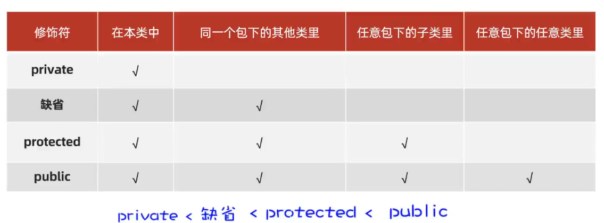
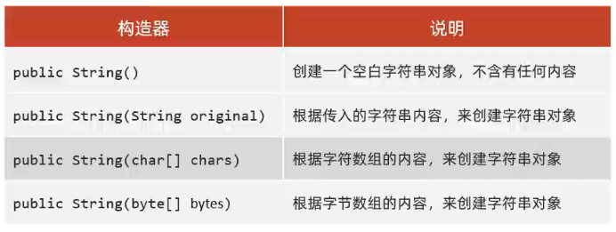
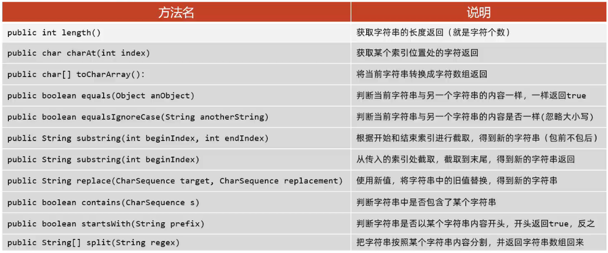
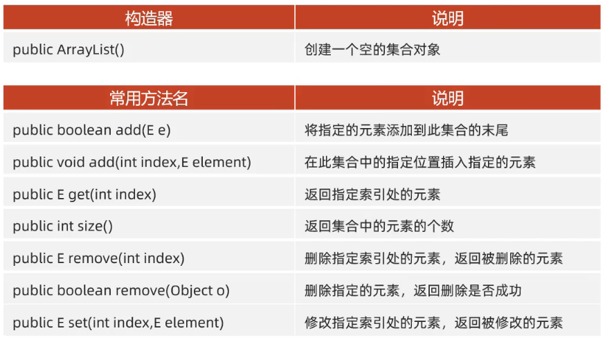
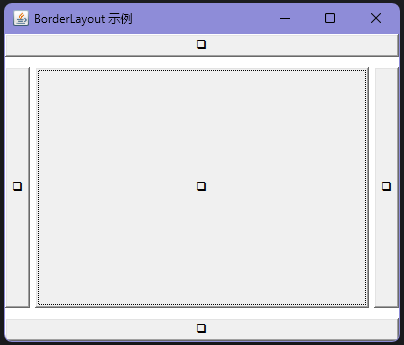
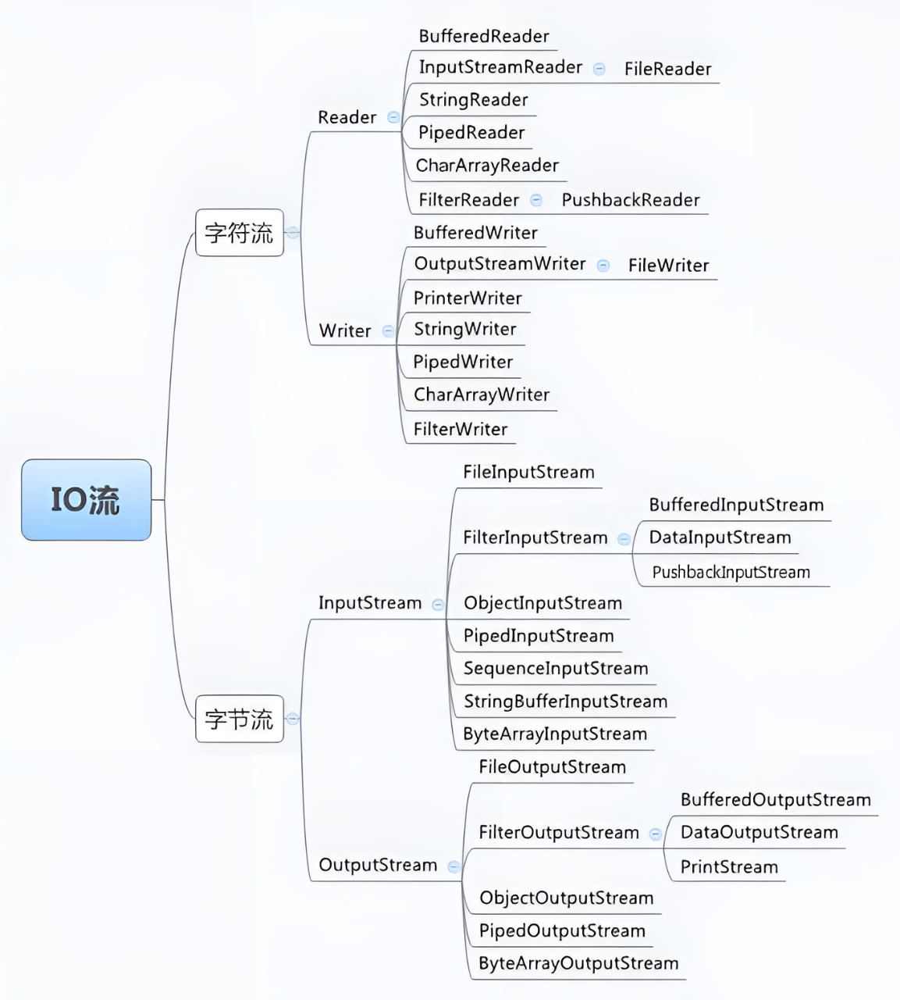

# Java 基础语法

Java语法基础语法基本上和c/c++类似，只需要了解其与c++的不同之处即可


## 0 创建项目

1. project	  先用IDEA创建一个`empty project`，一个空的项目或者工程

2. module	 然后再在该项目中创建一个 `module`，一个模块，用来表示项目的不同组成

3. package	在模块的 `src` 文件夹中创建不同功能的 `package` ，表示不同的包，一般用项目域名的倒写来充当包名

4. class	      在包中创建 `java class`，类名必须和java文件名一样，首字母大写
    * 包类的每个java文件都需要在最开始声明当前类所在的包名，相当于c++中的命名空间
    * 每个java文件中都可以调用同一个包中的公共类，每个包中只能有一个公共类

```java
package my_package;

public class hello {
    public static void main(String[] args) {
        System.out.println("Hello World");
    }
}
```


 


## 2 输入输出

输出：

```java
public class test {
    public static void main(String[] args) {
        String msg = "Hello World";
        char ch = '!';
        System.out.println(msg);		//输出一个字符串并换行
        System.out.print(msg);			//输出一个字符串不换行
        System.out.println(msg+ch);		//输出一个字符串加上一个字符
    }
}
```


输入：

```java
import java.util.Scanner;                       //导入util包,其包含了Scanner类

public class test {
    public static void main(String[] args) {
        Scanner sc = new Scanner(System.in);    //创建一个输入类对象
        String name1 = sc.next();               //获取第一个有效字符到回车之间的字符串
        sc.nextLine();                          //消耗掉输入缓冲区中的换行符
        String name2 = sc.nextLine();           //获取回车之前的所有字符串
        int age = sc.nextInt();                 //从键盘输入一个数字
        System.out.println("我叫"+name1+name2);
        System.out.println("已经"+age+"岁了");
        sc.close();                             //注意,要记得调用关闭方法,否则会一直占用资源
    }
}
```


## 2 关键字

Java中有51＋2（保留字）个关键字（Java的关键字都是小写的）

- 保留字：`goto`（已经被删除的跳转语句） 和 `const`（`c/c++` 中的修饰符，已被 `final` 替代）


*   访问修饰符关键字

| 关键字    | 含义     | 备注               |
| --------- | -------- | ------------------ |
| public    | 公有的   | 可跨包（默认选择） |
| protected | 受保护的 | 当前包内可用       |
| private   | 私有的   | 仅当前类可用       |


*   类、接口、抽象类和实现、继承的关键字

| 关键字     | 含义       | 备注                                     |
| ---------- | ---------- | ---------------------------------------- |
| class      | 类         | `public class A(){}`，类名需与文件名相同 |
| interface  | 接口       | `public interface B(){}`                 |
| abstract   | 抽象类     | `public abstract class C(){}`            |
| implements | 实现接口   | 用于类或接口实现接口                     |
| extends    | 继承       | 用于类继承类                             |
| new        | 实例化对象 | `A a = new A();`                         |
| enum       | 枚举类型   | 定义一组常用常量                         |


*   包相关关键字

| 关键字  | 含义   | 备注                                       |
| ------- | ------ | ------------------------------------------ |
| import  | 引入包 | 快捷键 `ctrl+shift+o` 自动引入             |
| package | 定义包 | 用于管理类，例如 `package javake.draw002;` |


*   数据类型关键字

| 关键字  | 含义   | 备注     |
| ------- | ------ | -------- |
| byte    | 字节型 | 8bit     |
| char    | 字符型 | 16bit    |
| boolean | 布尔型 | -        |
| short   | 短整型 | 16bit    |
| int     | 整型   | 32bit    |
| float   | 浮点型 | 32bit    |
| long    | 长整型 | 64bit    |
| double  | 双精度 | 64bit    |
| void    | 无返回 | -        |
| null    | 空值   | 变量为空 |
| true    | 真     | 变量为真 |
| false   | 假     | 变量为假 |


*   流程控制关键字

| 关键字     | 含义     | 备注                       |
| ---------- | -------- | -------------------------- |
| if         | 如果     | 条件判断                   |
| else       | 否则     | 与 `if` 连用               |
| while      | 当……时   | 循环条件                   |
| for        | 条件循环 | `for( ; ; ) { }`           |
| switch     | 开关     | `switch`语句               |
| case       | 返回结果 | 用于 `switch` 中匹配       |
| default    | 默认值   | 用于 `switch` 没匹配项     |
| do         | 执行     | 常与 `while` 连用          |
| break      | 跳出循环 | 跳出循环结构               |
| continue   | 继续     | 跳过当前循环并进入下次循环 |
| return     | 返回     | 返回方法的值               |
| instanceof | 判断实例 | 测试对象是否为类的实例     |


*   修饰方法、类、变量关键字

| 关键字       | 含义       | 备注               |
| ------------ | ---------- | ------------------ |
| static       | 静态的     | 修饰属性和方法     |
| final        | 最终的     | 不可更改           |
| super        | 调用父类   | `super.paint(g);`  |
| this         | 当前实例   | 调用当前类中的方法 |
| native       | 本地方法   | -                  |
| strictfp     | 严格、精准 | -                  |
| synchronized | 同步       | 多线程控制         |
| transient    | 短暂       | 不参与序列化       |
| volatile     | 易失       | 保证变量的可见性   |

**注意**：

1.   修饰类	：该类被称为最终类，特点是不能被继承了

     修饰方法：该方法被称为最终方法，特点是不能被重写了

     修饰变量：该变量只能被赋值一次，且不可被修改

2.   `static+final` 变量名：不可修改且必须在开始时初始化

3.   `final` 修饰基本类型的变量，变量存储的数据不能被改变

     `final` 修饰引用类型的变量，变量存储的地址不能被改变，但地址所指向对象的内容是可以被改变的

```java
final int num1;
num1 = 0;
static final int num2 = 2;
```


*   异常处理关键字

| 关键字  | 含义         | 备注                             |
| ------- | ------------ | -------------------------------- |
| catch   | 捕获异常     | `try-catch-finally` 异常处理结构 |
| try     | 尝试处理异常 | 常用于异常捕获结构               |
| finally | 总是执行     | 不论异常是否发生均执行           |
| throw   | 抛出异常     | 抛出具体异常实例                 |
| throws  | 声明异常     | 声明方法会抛出异常               |
| assert  | 断言         |                                  |


## 3 标识符

标识符命名规则：

-   **可以使用的符号：** 标识符可以使用大小写英文字母（包括中文汉字），数字（不能数字开头），`_` 以及 `$` 来命名
-   **避免关键字：** 不要使用 Java 关键字（例如，class、int、boolean等）作为标识符
-   **区分大小写：** Java 是大小写敏感的，因此标识符中的大小写字母被视为不同的符号（`myVariable` 和 `myvariable` 是两个不同的变量）


## 4 数组

Java中通过在变量类型后面添加 `[]` 来声名数组，可以将 `[]` 放在标识符后面，但这样降低了可读性

数组的初始化需要通过new来实现，且分为静态初始化和动态初始化

```java
//静态初始化
//手动指定数据元素，系统会根据元素个数，计算出数组的长度

//初始化方式1
int[] age1=new int[]{1,2,3};

//初始化方式2
int[] age2={1,2,3};

//初始化方式3
int age3[]={1,2,3};


//动态初始化
//手动指定数组长度，由系统给出默认初始化值
int[] age0=new int[3];	//int[] age0=new int[3]{1,2,3};不能同时动态和静态初始化数组
//初始化的所有值在未赋值前都为该类型默认值
/*
	整数类型,默认初始值0
	小数类型,默认初始值0.0
	字符类型,默认初始值'/u0000' (即空格)
	布尔类型,默认初始值false
	引用数据类型,默认初始值null
*/
```


## 5 方法

Java中的方法就是c/c++中的函数，但 `Java` 中的方法全部定义在类中，需要设置访问权限

```java
public static void helloWorld() {
    System.out.println("Hello World!");
}
```


## 6 Lambda

`Lambda` 表达式是 `Java 8` 引入的一种简洁的函数式编程方式，用来简化代码的书写

它主要用于实现**函数式接口**的实例化（一个包含且仅包含一个抽象方法的接口），可以让代码更加简洁，特别是在处理简短逻辑时


基本语法：

```java
(参数列表) -> { 方法体 }
```

1. **参数列表**：包含一个或多个参数，与接口的抽象方法参数一致（参数类型可以省略，编译器会进行类型推断）
2. **箭头符号**：使用 `->` 将参数列表和方法体分隔开
3. **方法体**：实现接口的抽象方法（可以是单行或多行语句）
4. 只能用于**函数式接口**


例：

假设有一个简单的函数式接口 `MyFunctionalInterface`，其包含一个抽象方法 `doSomething`：

```java
@FunctionalInterface
interface MyFunctionalInterface {
    void doSomething(String message);
}
```


我们可以使用Lambda表达式来实现这个接口

```java
public class Main {
    public static void main(String[] args) {
        // 使用Lambda表达式实现接口
        MyFunctionalInterface obj = (message) -> {
            System.out.println("消息: " + message);
        };

        // 调用接口方法
        obj.doSomething("Hello, Lambda!");
    }
}
```


注意事项：

1. **简化语法**：`Lambda` 表达式省略了很多样板代码，比如不需要声明类名、方法名、返回类型等，只关注方法的逻辑

2. **单行方法体简化**：如果方法体只有一行代码，花括号可以省略

例：

   ```java
   MyFunctionalInterface obj = message -> System.out.println("消息: " + message);
   ```


使用场景：

Lambda表达式主要用于处理简短的逻辑，典型场景包括：

1.   **集合的遍历和操作**：结合 `forEach` 和 `stream` API，可以用Lambda简洁地操作集合。

```java
List<String> names = Arrays.asList("Alice", "Bob", "Charlie");
names.forEach(name -> System.out.println(name));
```


2.   **多线程编程**：简化线程的创建和运行

```java
new Thread(() -> System.out.println("线程运行中...")).start();
```


## 7 正则表达式

正则表达式是一种用于匹配和操作文本的强大工具，它是由一系列字符和特殊字符组成的模式，用于描述要匹配的文本模式


在Java中，`String` 类中的 `matches` 的方法可以对指定正则表达式进行匹配或用 `Pattern` 类中，`matches()` 方法

```java
//使用格式

boolean result1 = String.matches(String regex);
// regex 正则表达式字符串,用于定义需要匹配的模式
// 返回 true 表示整个字符串完全符合正则表达式,返回 false 表示不匹配

boolean result2 = Pattern.matches(String regex, CharSequence input);
// regex 正则表达式字符串,用于定义需要匹配的模式
// input 要进行匹配的字符串
```


正则表达式的使用规范：

在Java中，正则表达式是一种用于描述和匹配字符串的模式。使用正则表达式可以灵活地查找、替换和验证字符串。以下是Java中常用的正则表达式语法：

1.   基本字符匹配

- **`.`**：匹配任意一个字符（不包括换行符）
- **`\\d`**：匹配一个数字，等价于 `[0-9]`
- **`\\D`**：匹配非数字字符，等价于 `[^0-9]`
- **`\\w`**：匹配字母、数字或下划线，等价于 `[a-zA-Z_0-9]`
- **`\\W`**：匹配非字母、数字或下划线字符，等价于 `[^a-zA-Z_0-9]`
- **`\\s`**：匹配空白字符，包括空格、制表符、换页符等
- **`\\S`**：匹配非空白字符


2.   量词（匹配次数）

- **`*`**：匹配前面的字符0次或多次，例如 `a*` 可以匹配 `""`，`"a"`，`"aa"`
- **`+`**：匹配前面的字符1次或多次，例如 `a+` 可以匹配 `"a"`，`"aa"`
- **`?`**：匹配前面的字符0次或1次，例如 `a?` 可以匹配 `""` 或 `"a"`
- **`{n}`**：匹配前面的字符恰好 n 次，例如 `a{3}` 匹配 `"aaa"`
- **`{n,}`**：匹配前面的字符至少 n 次，例如 `a{2,}` 匹配 `"aa"`，`"aaa"` 等
- **`{n,m}`**：匹配前面的字符 n 到 m 次，例如 `a{1,3}` 匹配 `"a"`，`"aa"`，`"aaa"`


3.   位置匹配

- **`^`**：匹配字符串的开始位置（例如 `^a` 表示以 `"a"` 开头的字符串）
- **`$`**：匹配字符串的结束位置（例如 `a$` 表示以 `"a"` 结尾的字符串）
- **`\\b`**：匹配一个单词边界（例如 `\\bword\\b` 匹配独立的单词 `"word"`）
- **`\\B`**：匹配非单词边界


4.   字符类（Character Class）

- **`[abc]`**：匹配方括号内任意一个字符，例如 `[abc]` 可以匹配 `"a"`，`"b"` 或 `"c"`
- **`[^abc]`**：匹配不在方括号内的字符，例如 `[^abc]` 可以匹配除 `"a"`，`"b"`，`"c"` 以外的任意字符
- **`[a-z]`**：匹配指定范围内的字符，例如 `[a-z]` 匹配任意小写字母
- **`[A-Z]`**：匹配任意大写字母
- **`[0-9]`**：匹配任意数字


5.   分组和捕获

- **`(pattern)`**：用于定义分组，匹配 `pattern` 并捕获它（例如，`(abc)` 匹配并捕获 `"abc"`）
- **`(?:pattern)`**：定义一个非捕获组，不会保存匹配的结果（例如 `(?:abc)` 匹配 `"abc"`，但不会保存它）
- **`\\n`**：引用之前的捕获组，其中 `n` 是组的编号（例如 `(\\d)\\1` 表示重复匹配相同的数字）


6.   常用的预定义字符类

- **`\\d`**：匹配数字，等价于 `[0-9]`
- **`\\D`**：匹配非数字字符
- **`\\w`**：匹配字母、数字或下划线
- **`\\W`**：匹配非字母、数字或下划线
- **`\\s`**：匹配空白字符
- **`\\S`**：匹配非空白字符


7.   或运算符

- **`pattern1|pattern2`**：匹配 `pattern1` 或 `pattern2` 中的任意一个（例如 `a|b` 匹配 `"a"` 或 `"b"`）


例：

假设我们需要匹配一个以字母开头，后面可以跟数字或字母的字符串，且长度在3到8位之间，可以使用以下正则表达式

```java
String regex = "^[a-zA-Z]\\w{2,7}$";
String input = "a12345";

boolean isMatch = input.matches(regex);
System.out.println("是否匹配: " + isMatch);
```


## 8 异常处理

在 Java 中，异常处理是一种重要的编程概念，用于处理程序执行过程中可能出现的错误或异常情况。

异常是程序中的一些错误，但并不是所有的错误都是异常，并且错误有时候是可以避免的

比如说，你的代码少了一个分号，那么运行出来结果是提示是错误 **java.lang.Error**

如果你用 **System.out.println(11/0)**，那么你是因为你用 **0** 做了除数，会抛出 **java.lang.ArithmeticException** 的异常


异常发生的原因有很多，通常包含以下几大类：

-   用户输入了非法数据
-   要打开的文件不存在
-   网络通信时连接中断，或者 `JVM` 内存溢出


这些异常有的是因为用户错误引起，有的是程序错误引起的，还有其它一些是因为物理错误引起的

要理解 Java 异常处理是如何工作的，你需要掌握以下三种类型的异常：

-   **检查性异常：**

    最具代表的检查性异常是用户错误或问题引起的异常，这些异常在编译时强制要求程序员处理

    例如要打开一个不存在文件时，一个异常就发生了，这些异常在编译时不能被简单地忽略

    这类异常通常使用 **try-catch** 块来捕获并处理异常，或者在方法声明中使用 **throws** 子句声明方法可能抛出的异常


```java
try {
    // 可能会抛出异常的代码
} catch (IOException e) {
    // 处理异常的代码
}
```


或者：


```java
public void readFile() throws IOException {
    // 可能会抛出IOException的代码
}
```


-   **运行时异常：** 

    这些异常在编译时不强制要求处理，通常是由程序中的错误引起的，例如 `NullPointerException`、`ArrayIndexOutOfBoundsException `等

    （这类异常可以选择处理，但并非强制要求）


```java
try {
    // 可能会抛出异常的代码
} catch (NullPointerException e) {
    // 处理异常的代码
}
```


​    

-   **错误：** 错误不是异常，而是脱离程序员控制的问题，错误在代码中通常被忽略

    （例如，当栈溢出时，一个错误就发生了，它们在编译也检查不到的）


### 8.1 try-catch-finally

-   **try**：用于包裹可能会抛出异常的代码块
-   **catch**：用于捕获异常并处理异常的代码块
-   **finally**：用于包含无论是否发生异常都需要执行的代码块

如果 `try` 块中出现异常，会跳转到对应的 `catch` 块进行处理，从而防止程序崩溃

```java
try {
    // 可能产生异常的代码
} catch (ExceptionType1 e1) {
    // 捕获并处理 ExceptionType1 类型的异常
} catch (ExceptionType2 e2) {
    // 捕获并处理 ExceptionType2 类型的异常
} finally {
    // 可选：无论是否发生异常，都会执行的代码
}
```

**例：**

以下代码示例演示了 `try-catch` 的基本使用：

```java
public class TryCatchExample {
    public static void main(String[] args) {
        try {
            int result = 10 / 0; // 可能产生 ArithmeticException
        } catch (ArithmeticException e) {
            System.out.println("捕获到异常: 除数不能为零");
        } finally {
            System.out.println("无论是否发生异常，这段代码都会执行");
        }
    }
}
```


### 8.2 throw

手动抛出异常，通常用于在特定条件下终止方法并向调用者报告异常

```java
throw new ExceptionType("异常描述信息");
```

- `ExceptionType`：要抛出的异常类型

    常用的异常类包括 `IllegalArgumentException`、`NullPointerException`、`IOException` 等

- `异常描述信息`：用于描述异常原因的字符串

**例：**

在以下示例中，`throw` 用于在特定条件下手动抛出一个异常：

```java
public class ThrowExample {
    public static void main(String[] args) {
        try {
            checkAge(15); // 调用方法并传递不符合条件的年龄
        } catch (IllegalArgumentException e) {
            System.out.println("捕获到异常: " + e.getMessage());	// getMessage 返回 IllegalArgumentException类 构造时传入的字符串
        }
    }

    public static void checkAge(int age) {
        if (age < 18) {
            throw new IllegalArgumentException("年龄必须至少为 18 岁"); // 手动抛出异常
        }
        System.out.println("年龄符合要求");
    }
}
```


### 8.3 throws

用于声明方法可能抛出的异常类型，要求调用者处理这些异常

`throws` 关键字放在方法声明后面，用来告知调用者该方法可能会抛出哪些异常，调用者需要处理这些异常

```java
public void methodName() throws ExceptionType1, ExceptionType2 {
    // 可能抛出异常的代码
}
```

- `ExceptionType1`、`ExceptionType2`：方法可能抛出的异常类型，多个异常类型之间用逗号分隔

**例：**

以下代码示例演示了 `throws` 的用法：

```java
import java.io.File;
import java.io.FileNotFoundException;
import java.util.Scanner;

public class ThrowsExample {
    public static void main(String[] args) {
        try {
            readFile("file.txt"); // 调用可能抛出异常的方法
        } catch (FileNotFoundException e) {
            System.out.println("捕获到异常: 文件未找到");
        }
    }

    public static void readFile(String fileName) throws FileNotFoundException {
        File file = new File(fileName);
        Scanner scanner = new Scanner(file); // 可能抛出 FileNotFoundException
        // 读取文件内容
    }
}
```


### 8.4 Exception

所有的异常类是从 `java.lang.Exception` 类继承的子类

`Exception` 类是 `Throwable` 类的子类

除了 `Exception` 类外，`Throwable` 还有一个子类 `Error`  

Java 程序通常不捕获错误，错误一般发生在严重故障时，它们在 Java 程序处理的范畴之外

`Error` 用来指示运行时环境发生的错误（例如，`JVM` 内存溢出，一般地，程序不会从错误中恢复）

异常类有两个主要的子类：`IOException` 类和` RuntimeException` 类


**常用异常类：**

| 异常类                           | 描述                                                   |
| -------------------------------- | ------------------------------------------------------ |
| `Exception`                      | 所有异常的基类，表示程序可以捕获的异常                 |
| `RuntimeException`               | 运行时异常的基类，表示程序逻辑或代码错误，无需强制捕获 |
| `NullPointerException`           | 当引用空对象或变量时抛出该异常                         |
| `IndexOutOfBoundsException`      | 当访问数组、列表等的非法索引时抛出该异常               |
| `ArrayIndexOutOfBoundsException` | 当访问数组的非法索引时抛出该异常                       |
| `ClassCastException`             | 当对象无法强制转换为指定类时抛出该异常                 |
| `IllegalArgumentException`       | 当向方法传递了非法或不合适的参数时抛出该异常           |
| `NumberFormatException`          | 当尝试将字符串转换为数字格式失败时抛出该异常           |
| `ArithmeticException`            | 当发生算术错误（如除以零）时抛出该异常                 |
| `IOException`                    | 输入/输出异常的基类，表示在文件或流的读写时出现问题    |
| `FileNotFoundException`          | 当尝试打开文件失败时抛出该异常                         |
| `EOFException`                   | 当到达文件或输入流的末尾而未预期到时抛出该异常         |
| `ClassNotFoundException`         | 当无法找到指定的类时抛出该异常                         |
| `NoSuchMethodException`          | 当无法找到方法时抛出该异常                             |
| `InterruptedException`           | 当线程在睡眠、等待或其他阻塞操作中被中断时抛出该异常   |
| `IllegalStateException`          | 表示方法在不适当的状态下被调用时抛出该异常             |


**异常方法：**

下面的列表是 Throwable 类的主要方法:

| 方法                                            |**说明**|
| :---------------------------------------------- | :----------------------------------------------------------- |
| **public String getMessage()**                  | 返回关于发生的异常的详细信息（这个消息在Throwable 类的构造函数中初始化了） |
| **public Throwable getCause()**                 | 返回一个 Throwable 对象代表异常原因                          |
| **public String toString()**                    | 返回此 Throwable 的简短描述                                  |
| **public void printStackTrace()**               | 将此 Throwable 及其回溯打印到标准错误流                      |


### 8.5 自定义异常


# Java 面向对象

## 1 new，this

**概念：**

new 关键字和c++中的用法一致，但Java中程序员不能操作地址，new创建的对象访问成员时必须使用 `.` 来访问而不是 `->`

this 也同样如此，其表示类对象的地址，但访问成员时也必须使用 `.` 来访问而不是 `->`


**注意事项：**

我们可以通过对象给对象赋值，但对象都是通过 `new` 创建的，新对象只是获得了旧对象的地址，除非是拷贝构造

当我们改变其中一个对象的成员会让另一个对象的成员一起改变

我们也可以让对象指向 `NULL` ，当一块地址没有对象访问时，编译器会自动回收该地址的内存


## 2 构造器

c++中的构造函数，用法和概念一摸一样，但必须设置访问权限 ，如 `public` 或 `private` 

在没有自定义构造器时，编译器会默认创建一个无参构造器

若自定义了构造器后，编译器不会提供任何构造器


## 3 实体类

和c++中的抽象类类似


例：

```java
public class Student {
    // 成员变量
    private String name;   // 学生姓名
    private double grade;  // 学生成绩

    public Student() {}

    public Student(String name, double grade) {
        this.name = name;
        this.grade = grade;
    }

    public String getName() {
        return name;
    }// 获取学生姓名

    public void setName(String name) {
        this.name = name;
    }// 设置学生姓名

    public double getGrade() {
        return grade;
    }// 获取学生成绩

    public void setGrade(double grade) {
        if (grade >= 0 && grade <= 100) { // 保证成绩在合理范围
            this.grade = grade;
        } else {
            System.out.println("成绩应在0到100之间");
        }
    }// 设置学生成绩

    public void printStudentInfo() {
        System.out.println("姓名: " + name + ", 成绩: " + grade);
    }// 打印学生信息

    public static void main(String[] args) {
        // 使用默认构造器创建学生对象
        Student student1 = new Student();
        student1.printStudentInfo();

        // 使用带参数的构造器创建学生对象
        Student student2 = new Student("张三", 85.5);
        student2.printStudentInfo();

        // 设置学生姓名和成绩
        student1.setName("李四");
        student1.setGrade(92.0);
        student1.printStudentInfo();
    }
}
```


## 4 静态

`static` 又称作静态，可以修饰成员变量、成员方法

*   `static` 修饰的成员变量叫类变量（静态成员变量）
    *   属于类，与类一起加载一次，在内存中只有一份，会被类的所有对象共享
*   无 `static` 修饰的成员变量叫实例变量（对象变量）
    *   属于对象，每个对象中都有一份
*   `static` 修饰的成员方法叫类方法（静态方法）
    *   属于类，可以直接用类名访问，也可以用对象访问
*   无 `static` 修饰的成员方法叫实例方法（对象的方法）
    *   属于对象，只能用对象访问


类方法的运用场景：**工具类**

原因：

*   实例方法需要创建对象来调用，此时对象只是为了调用方法，对象占内存，这样会浪费内存
*   类方法，直接用类名调用即可，调用方便，也能节省内存

另外，工具类没有创建对象的需求，建议将工具类的构造器进行私有


类方法注意事项：

*   类方法中可以直接访问类的成员，不可以直接访问实例成员
    *   实例方法中既可以直接访问类成员，也可以直接访问实例成员
*   实例方法中可以出现this关键字，类方法中不可以出现this关键字的


**代码块的运用**

静态代码块：

格式：`static{}`

特点：类加载时自动执行，由于类只会加载一次，所以静态代码块也只会执行一次

作用：完成类的初始化，例如:对类变量的初始化赋值

实例代码块：

格式：`{}`

特点：每次创建对象时，执行实例代码块，并在构造器前执行

作用：和构造器一样，都是用来完成对象的初始化的，例如：对实例变量进行初始化赋值

```java
class Example {
    // 静态代码块 (static block)，只会在类加载时执行一次
    static {
        System.out.println("静态代码块被执行");
    }

    // 实例代码块 (instance block)，每次创建对象时都会执行
    {
        System.out.println("实例代码块被执行");
    }

    // 构造器
    public Example() {
        System.out.println("构造器被调用");
    }
}

public class Main {
    public static void main(String[] args) {
        System.out.println("第一次创建对象：");
        Example ex1 = new Example();

        System.out.println("\n第二次创建对象：");
        Example ex2 = new Example();
    }
}

/*
	静态代码块被执行
    第一次创建对象：
    实例代码块被执行
    构造器被调用

    第二次创建对象：
    实例代码块被执行
    构造器被调用
*/
```


`static` 的运用（单例类）：

单例设计模式：
确保一个类只有一个对象

```java
//饿汉式	(频繁使用时,一开始就创建)
public class A{
	private static A a=new A();		//定义一个类变量记住类的一个对象

    private A(){}					//私有构造器

    public static A getobject(){
        return a;
    }								//定义一个类方法返回对象
}

A a = A.getobject();				//定义一个单例类

//懒汉式	(用的少,等到用的时候在创建)
public class B{
	private static B b;				//定义一个类变量,用于存储这个类的一个对象

	private B(){}					//把类的构造器私有

	public static B getInstance(){
		if(b == null){
			b = new B();
        }
		return b;
    }								//定义一个类方法,这个方法要保证第一次调用时才创建一个对象
}

B b = B.getInstance();				//定义一个单例类
```


## 5 继承

Java中提供了一个关键字extends，用这个关键字，可以让一个类和另一个类建立起父子关系，子类能继承父类的非私有成员（成员变量、成员方法）

注意：私有成员并非不继承，只是子类不能直接访问

```java
public class B extends A{
    //A类称为父类(基类或超类)
    //B类称为子类(派生类)
}
```


权限修饰符：

权限修饰符是用来限制类中的成员（成员变量、成员方法、构造器、代码块）能够被访问的范围



*   private：私有权限，本类能用==（常用）==
*   缺省：省略修饰符，同一个包且非子类能用
*   protected：保护权限，在其他包中的非子类不能使用
*   public：公共权限，都能用==（常用）==


注意事项：

*   Java是单继承的，Java中的类不支持多继承，但是支持多层继承
*   `object` 类是java所有类的祖宗类，我们写的任何一个类，其实都是object的子类或子孙类
    *   若一个类没有父类则默认继承 `object` 类
*   ==在一个java文件中，只能有一个public的类或接口，且必须与它所在的文件名称相同==


重写：

*   当子类觉得父类中的某个方法不好用，或者无法满足自己的需求时，子类可以重写一个方法名称、参数列表一样的方法，去覆盖父类方法
    *   重写后，方法的访问，Java会遵循就近原则

*   进行重写时可以使用 `@Override注解`，他可以指定java编译器，检查我们方法重写的格式是否正确，代码可读性也会更好
*   注意事项：
    *   子类重写父类方法时，访问权限必须大于或者等于父类该方法的权限（public>protected>缺省）
    *   重写的方法返回值类型，必须与被重写方法的返回值类型一样，或者范围更小
    *   私有方法、静态方法不能被重写，如果重写会报错的

```java
class Animal {
    public void makeSound() {
        System.out.println("动物发出声音");
    }
}

class Dog extends Animal {
    @Override
    public void makeSound() {
        System.out.println("狗叫：汪汪");
    }
}
```


*   Java就近原则：
    *   先子类局部范围找
    *   然后子类成员范围找
    *   然后父类成员范围找，如果父类范围还没有找到则报错
*   重名访问：可以通过super关键字，指定访问父类的成员：`super.父类成员变量/父类成员方法`

*   构造器补充：

    *   子类的全部构造器，都会先调用父类的构造器，再执行自己

        默认情况下，子类全部构造器的第一行代码都是 `super()` （写不写都有），它会调用父类的无参数构造器

        如果父类没有无参数构造器，则我们必须在子类构造器的第一行手写 `super.()`，指定去调用父类的有参数构造器

    *   任意类的构造器中，是可以通过 `this(...)` 去调用该类的其他构造器的

        `this(...)`、`super(...)`都只能放在构造器的第一行，因此，有了 `this(...)` 就不能写 `super(...)` 了，反之亦然

```java
class Animal {
    String name;

    public Animal(String name) {
        this.name = name;
        System.out.println("Animal类的构造器被调用，动物名为: " + name);
    }
}

class Dog extends Animal {
    int age;

    public Dog(String name) {
        super(name);
        System.out.println("Dog类的构造器1被调用");
    }

    public Dog(String name, int age) {
        this(name);
        this.age = age;
        System.out.println("Dog类的构造器2被调用，年龄为: " + age);
    }
}
```


## 6 多态

用法和c++一样，不在赘述


注意事项：

*   类型转换：
    *   自动类型转换：`父类 变量名=new 子类();`
        例如：`People p=new Teacher();`
    *   强制类型转换：`子类 变量名=(子类)父类变量`
        例如：`Teacher t=(Teacher)p;`
    *   存在继承/实现关系就可以在编译阶段进行强制类型转换，编译阶段不会报错
        但运行时，如果发现对象的真实类型与强转后的类型不同，就会报类型转换异常（ClassCastException）的错误出来
    *   建议在强转前，使用 `instanceof` 关键字，判断当前对象的真实类型，再进行强转

```java
class Person {
    String name;

    public Person(String name) {
        this.name = name;
    }

    public void introduce() {
        System.out.println("我是 " + name);
    }
}

class Teacher extends Person {
    public Teacher(String name) {
        super(name);
    }

    public void teach() {
        System.out.println(name + " 在教书");
    }
}

class Student extends Person {
    public Student(String name) {
        super(name);
    }

    public void study() {
        System.out.println(name + " 在学习");
    }
}

public class Main {
    public static void main(String[] args) {
        Person p1 = new Teacher("张三");
        Person p2 = new Student("李四");

        // 使用 instanceof 判断类型
        if (p1 instanceof Teacher) {
            Teacher teacher = (Teacher) p1;
            teacher.teach();
        }	//张三在教书

        if (p2 instanceof Student) {
            Student student = (Student) p2;
            student.study();
        }	//李四在学习
    }
}
```


 ## 7 抽象

在java中有一个关键字叫：`abstract`，它就是抽象的意思，可以用它修饰类、成员方法（类似c++中的 `virtual`）

`abstract` 修饰类，这个类就是抽象类；修饰方法，这个方法就是抽象方法

*   抽象方法只有方法签名（声名），不能写方法体（定义）
*   抽象类中可以不写抽象方法，但有抽象方法的类一定是抽象类
*   抽象类不能创建对象，仅作为一种特殊的父类，让子类继承并实现
    *   一个类继承抽象类，必须重写完抽象类的全部抽象方法，否则这个类也必须定义成抽象类


抽象类的运用场景：

*   父类知道每个子类都要做某个行为，但每个子类要做的情况不一样，父类就定义成抽象方法，交给子类去重写实现

    我们抽出这样的抽象类，就是为了更好的支持多态（为了在父类中调用子类的函数）

*   创建父类模板给子类调用，建议使用 `final` 关键字修饰模板方法

    *   模板方法是给对象直接使用的，不能被子类重写，一旦子类重写了模板方法，模板方法就失效了

```java
// 抽象类
abstract class Vehicle {
    public void operate() {
        start();
        drive();
        stop();
    }	// 模板方法，定义一个完整的步骤流程
    
    public abstract void start();
    	// 抽象方法（没有方法体，必须在子类中实现）

    public void drive() {
        System.out.println("Vehicle is driving...");
    }	// 具体方法（子类可以直接使用）

    public void stop() {
        System.out.println("Vehicle is stopping...");
    }	// 具体方法（子类可以直接使用）
}

// 具体子类，继承自抽象类并实现抽象方法
class Car extends Vehicle {
    @Override
    public void start() {
        System.out.println("Car is starting...");
    }	// 重写父类中的抽象方法
}

public class Main {
    public static void main(String[] args) {
        Vehicle myCar = new Car();
        myCar.operate();  // 使用模板方法操作汽车
    }
}
```


## 8 接口

Java提供了一个关键字 `interface`，用这个关键字我们可以定义出一个特殊的结构：接口

-   接口中的成员变量默认是 `public static final`，可以在同一个包下的类中直接调用
-   接口中的方法默认是 `public abstract`，重写后可以调用0

```java
package mypackage;

public interface MyInterface {
    int CONSTANT_VALUE = 12;
    void method1();
}	// 自定义的接口

public class MyClass implements MyInterface {
    @Override
    public void method1() {
        System.out.println("Method 1 implemented");
        System.out.println("Constant value: " + CONSTANT_VALUE); // 直接使用接口中的常量
    }	// 重写函数
    
    public void method2() {
        System.out.println("Method 2 mymethod");
        System.out.println("Accessing constant: " + MyInterface.CONSTANT_VALUE); // 直接调用接口中的常量
    }

    public void callMethod() {
        method1();
        method2();
    }
}
```


注意：

*   接口不能创建对象
*   接口是用来被类实现（`implements`）的，实现接口的类称为实现类
*   一个类可以实现多个接口（接口可以理解成干爹），实现类实现多个接口，必须重写完全部接口的全部抽象方法，否则实现类需要定义成抽象类
*   ==接口必须在父类继承后再继承==

```java
public class myClass extends myAncestor implements myInterface {}

/*
	public class myClass implements myInterface extends myAncestor {}
	Java 不允许一个类在 implements 和 extends 关键字后面同时继承父类和实现接口
*/
```


JDK8新特性：

​	这些新特性衍生的方法可以在**方法签名**（声名）后写**方法体**（定义）

*   默认方法：使用 `default` 修饰，使用实现类的对象调用
*   静态方法：`static` 修饰，必须用当前接口名调用
*   私有方法：`private` 修饰，idk9开始才有的，只能在接口内部被调用他们都会默认被 `public` 修饰
*   抽象方法（public abstract 方法）：抽象方法是接口的默认方法，它们没有方法体，必须由实现类提供实现

```java
interface MyInterface {

    // 默认方法 - 实现类的对象可以调用
    default void defaultMethod() {
        System.out.println("这是default方法");
        privateMethod();  // 默认方法可以调用私有方法
    }

    // 静态方法 - 必须用接口名调用
    static void staticMethod() {
        System.out.println("这是static方法");
    }

    // 私有方法 - 只能在接口内部被调用 (JDK9+)
    private void privateMethod() {
        System.out.println("这是private方法");
    }

    // 抽象方法 (public abstract 可省略)
    void abstractMethod();
}

class MyClass implements MyInterface {

    // 必须实现抽象方法
    @Override
    public void abstractMethod() {
        System.out.println("这是abstract方法");
    }
}

public class Main {
    public static void main(String[] args) {
        MyClass myClass = new MyClass();

        // 调用默认方法
        myClass.defaultMethod();

        // 调用静态方法
        MyInterface.staticMethod();

        // 调用实现的抽象方法
        myClass.abstractMethod();
    }
}


/*
    这是default方法
    这是private方法
    这是static方法
    这是abstract方法
*/
```


多接口注意事项：

*   接口不能继承对象

*   一个接口继承多个接口，如果多个接口中存在方法签名冲突，则此时不支持多继承
*   一个类实现多个接口，如果多个接口中存在方法签名冲突，则此时不支持多实现
*   一个类继承了父类，又同时实现了接口，父类中和接口中有同名的默认方法，实现类会优先用父类的
*   一个类实现了多个接口，多个接口中存在同名的默认方法，可以不冲突，这个类重写该方法即可


## 9 内部类

内部类是类中的五大成分之一（成员变量、方法、构造器、内部类、代码块），如果一个类定义在另一个类的内部，这个类就是内部类


内部类分四种：

*   成员内部类：就是类中的一个普通成员，类似前面我们学过的普通的成员变量、成员方法

    创建格式：`外部类名.内部类名 对象名 = new 外部类(...).new 内部类(...);`

    ​				   `Outer.Inner in=new Outer().new Inner();`
    特点：

    *   和前面学过的实例方法一样，成员内部类的实例方法中，同样可以直接访问外部类的实例成员、静态成员
    *   可以在成员内部类的实例方法中，拿到当前外部类对象，格式是：`外部类名.this`

*   静态内部类：有static修饰的内部类，属于外部类自己持有

    创建格式：`外部类名.内部类名 对象名 = new 外部类(...).new 内部类(...);`

    ​				   `Outer.Inner in=new Outer().new Inner();`
    特点：可以直接访问外部类的静态成员，不可以直接访问外部类的实例成员

*   局部内部类：和局部变量一样，鸡肋语法，直接过...

*   匿名内部类：就是一种特殊的局部内部类；所谓匿名，就是指的是程序员==不需要为这个类声明名字==

    特点：匿名内部类本质就是一个子类，并会立即创建出一个子类对象

    作用：

    *   用于更方便的创建一个**子类对象去重写父类对象**的方法
    *   匿名内部类通常作为一个参数传输给方法

```java
class Animal {
    // 定义一个父类方法
    public abstract void makeSound();
}

public class Main {
    public static void main(String[] args) {
        // 创建匿名内部类的子类对象，重写父类方法
        Animal myAnimal = new Animal() {
            @Override
            public void makeSound() {
                System.out.println("小狗汪汪叫");
            }
        };

        // 直接调用匿名内部类的方法
        myAnimal.makeSound();

        // 匿名内部类作为参数传递给方法
        passAnimal(new Animal() {
            @Override
            public void makeSound() {
                System.out.println("小猫喵喵叫");
            }
        });
    }

    // 接收Animal类型参数的方法
    public static void passAnimal(Animal animal) {
        animal.makeSound();  // 调用传入的匿名内部类方法
    }
}

/*
	小狗汪汪叫
	小猫喵喵叫
*/
```


**匿名内部类直接实例化接口**：可以使用匿名内部类来实现接口，然后直接实例化（适用于接口的实现非常简单或只需要一次性使用的情况）

```java
// 定义接口
interface MyInterface {
    void myMethod();  // 定义一个抽象方法
}

// 使用匿名内部类实现接口并实例化
public class Main {
    public static void main(String[] args) {
        // 通过匿名内部类实现接口
        MyInterface obj = new MyInterface() {
            @Override
            public void myMethod() {
                System.out.println("接口方法的实现");
            }
        };

        // 调用接口方法
        obj.myMethod();
    }
}

```


## a enum

在Java中，`enum` 是一种特殊的类，用于表示一组固定的常量


Java `enum` 的特点：

*   **固定的常量集**：
    *   `enum` 定义的常量是预定义的一组值，这些值是不可变的
    *   枚举常量是隐式 `public static final` 的，因此可以像常量一样直接使用

*   **类型安全**：
    *   `enum` 提供了类型安全，确保只能使用定义的枚举常量，避免了使用普通整数或字符串表示常量时可能产生的错误

*   **可以包含成员变量、构造函数和方法**：
    *   `enum` 不仅仅是常量集合，还可以包含成员变量、构造函数、方法以及重写方法，使其功能更加丰富

*   **自动继承 `java.lang.Enum`**：
    *   所有枚举都继承自 `java.lang.Enum` 类，因此不能继承其他类，但可以实现接口

*   **常见方法**：
    *   `values()`：返回包含所有枚举常量的数组
    *   `ordinal()`：返回枚举常量的序号，从 0 开始
    *   `name()`：返回枚举常量的名称（字符串形式）
    *   `valueOf(String name)`：根据名称返回对应的枚举常量

*   **可以用于 switch 语句**：
    *   枚举常量可以直接用于 `switch` 语句，简化了代码编写

```java
public class EnumExample {
    // 定义带有成员变量的枚举类型
    public enum Day {
        MONDAY("Start of the work week"),
        FRIDAY("End of the work week"),
        SUNDAY("Rest day");

        // 每个枚举常量对应的描述
        private String description;

        // 构造函数
        Day(String description) {
            this.description = description;
        }

        // 获取描述的方法
        public String getDescription() {
            return description;
        }
    }

    public static void main(String[] args) {
        // 输出每个枚举常量及其对应的描述
        Day day = Day.MONDAY;
        switch (day) {
            case MONDAY:
                System.out.println(day + ": " + day.getDescription());
                break;
            case FRIDAY:
                System.out.println(day + ": " + day.getDescription());
                break;
            case SUNDAY:
                System.out.println(day + ": " + day.getDescription());
                break;
        }
    }
}

```


## b 泛型

Java 中的泛型是一种在类、接口和方法定义时通过参数化类型进行操作的机制

它允许你编写能够处理任意类型的代码，而不需要指定具体的类型，从而提高了代码的复用性和类型安全性


**Java 泛型的特点：**

1. **类型安全**：
    *   泛型确保在编译时检测类型错误
    *   例如，如果你将 `List<String>` 中添加了一个 `Integer`，编译器会报错，而不是在运行时才发现
2. **重用性强**：
    *   泛型使得相同代码可以被多次复用，且支持不同的类型
    *   例如，你可以创建一个通用的 `List` 类来处理 `String`、`Integer` 或自定义类型等
3. **编译时类型检查**：
    *   在编译时就能进行类型检查，从而减少了运行时的类型转换错误
4. **类型擦除（Type Erasure）**：
    *   Java 的泛型在运行时会被＂擦除＂，即泛型信息仅在编译时保留，编译后会被替换为原始类型
    *   这也是为了兼容 Java 1.4 之前的代码


**如何使用泛型：**

1. **泛型类**

泛型类可以定义带有类型参数的类，允许该类处理多种类型的数据

```java
public class Box<T> {
    private T item;
    
    public void setItem(T item) {
        this.item = item;
    }
    
    public T getItem() {
        return this.item;
    }
}
```

可以创建 `Box` 类的不同类型实例：

```java
Box<String> stringBox = new Box<>();
stringBox.setItem("Hello");

Box<Integer> intBox = new Box<>();
intBox.setItem(123);
```


2. **泛型方法**

泛型方法可以在方法中使用类型参数

```java
public class GenericMethodTest {
    // 泛型方法
    public static <T> void printArray(T[] inputArray) {
        for (T element : inputArray) {
            System.out.print(element + " ");
        }
        System.out.println();
    }
}
```

调用时：

```java
Integer[] intArray = {1, 2, 3};
String[] stringArray = {"A", "B", "C"};
GenericMethodTest.printArray(intArray);
GenericMethodTest.printArray(stringArray);
```


3. **泛型接口**

泛型接口允许在接口中使用类型参数

```java
public interface GenericInterface<T> {
    void set(T t);
    T get();
}
```


4. **泛型中的通配符**

- **`?` 通配符**：表示未知类型，用于在泛型中不确定具体类型的情况下使用
  
    ```java
    import java.util.ArrayList;
    import java.util.List;
    
    public class WildcardExample {
        public static void printList(List<?> list) {	//使用通配符确定List只能存放一种类型的变量
            for (Object element : list) {
                System.out.println(element);
            }
        }
    
        public static void main(String[] args) {
            List<String> stringList = new ArrayList<>();
            stringList.add("Hello");	//传入Sting类型之后,List的储存类型修改为String
            stringList.add("World");	//List的储存类型确定后,将只能传入String类型的变量
    
            List<Integer> intList = new ArrayList<>();
            intList.add(1);
            intList.add(2);
    
            // 可以传入任何类型的列表
            printList(stringList);
            printList(intList);
        }
    }
    ```
    
- **有界通配符**：
  
  - `<? extends T>`：T 的子类型，可以读取数据但不能写入
  - `<? super T>`：T 的父类型，可以写入数据但不能读取具体的对象类型
  
    用的很少，懒的管了


5. **类型擦除**

Java 的泛型在编译后会进行类型擦除，例如 `List<T>` 在编译后会变为 `List<Object>`，这意味着在运行时泛型信息无法获取


总结：

Java 的泛型提供了类型安全性和代码的重用性，但由于类型擦除的存在，也有一定的局限性

在使用泛型时，理解类型参数、通配符和有界类型是非常重要的


# Java API使用

## 0 包 (package)

什么是包？
包是用来分门别类的管理各种不同程序的，类似于文件夹，建包有利于程序的管理和维护


建包的语法格式 :

```java
package 包的名字;
public class student{
    /* code; */
}
```


调用包下的程序的注意事项：

*   要调用自己所在包下的其他程序，可以直接调用
    *   同一个包下的类，互相可以直接调用
*   要调用其他包下的程序，则必须在当前程序中导包，才可以访问
    *   导包格式 `import 包名.类名`

```java
import java.util.Scanner;	//输入类
import java.util.Random;	//随机数类

import javax.swing.*;		//获取包下的所有API
// import javax.swing.JFrame;	窗口类
// import javax.swing.JLabel;	标签类
```


*   要调用ava提供的程序，也需要先导包才可以使用
    *   但是 `Java.lang` 包下的程序（如 **Scanner** 或 **String**）是不需要我们导包的，可以直接使用
*   要调用多个不同包下的程序，而这些程序名正好一样，此时默认只能导入一个程序，另一个程序必须带包名访问


## 1 Object

在Java中，`Object`类是所有类的父类

每一个类（无论是系统类还是用户定义的类）都直接或间接地继承自`Object`类

如果一个类没有显式声明继承某个父类，那么它默认继承`Object`类


**主要特点和作用：**

*   **作为所有类的父类**：任何类的对象都可以赋值给`Object`类型的变量，体现了Java的多态性

*   **常用方法**： `Object` 类提供了一些所有类都会继承的通用方法，如：
    *   `toString()`：方法默认返回对象的 `“类名@哈希码”` 的字符串形式
    *   `equals(Object obj)`：判断两个对象是否相等，也就是判断两个引用是否指向同一个对象
    *   `hashCode()`：返回根据对象的内存地址生成哈希码（两个不同的对象即使内容相同，它们的哈希码也不同，除非它们引用相同的对象）
    *   `getClass()`：返回对象运行时的类类型
    *   `clone()`：创建并返回对象的副本，用于对象的浅拷贝（需要实现 `Cloneable` 接口）
    *   `finalize()`：用于对象在垃圾回收之前执行清理操作（不过，该方法默认不执行任何操作，且在现代Java中已经不推荐使用）
    *   `wait()`， `notify()`， `notifyAll()`：用于线程间的通信，配合 `同步` 机制使用


**示例：展示Object类的多态性和常用方法**

```java
class Animal {
    private String name;

    public Animal(String name) {
        this.name = name;
    }

    @Override
    public String toString() {
        return "Animal Name: " + name;
    }

    @Override
    public boolean equals(Object obj) {
        if (this == obj) {
            return true;
        }
        if (obj == null || getClass() != obj.getClass()) {
            return false;
        }
        Animal other = (Animal) obj;
        return name.equals(other.name);
    }

    @Override
    public int hashCode() {
        return name.hashCode();
    }
}

public class ObjectClassExample {
    public static void main(String[] args) {
        // 创建 Animal 对象
        Animal dog = new Animal("Dog");
        Animal cat = new Animal("Cat");

        // Object 类的 toString 方法
        System.out.println(dog.toString());  // 输出: Animal Name: Dog
        System.out.println(cat.toString());  // 输出: Animal Name: Cat

        // Object 类的 equals 方法
        Animal anotherDog = new Animal("Dog");
        System.out.println(dog.equals(anotherDog)); // 输出: true
        System.out.println(dog.equals(cat));        // 输出: false

        // Object 类的 hashCode 方法
        System.out.println(dog.hashCode());  // 根据 name 生成的 hashCode
        System.out.println(anotherDog.hashCode()); // hashCode 相同
        System.out.println(cat.hashCode());  // 不同的 hashCode
    }
}
```


**解释：**

*   **多态性**：`Object`类是所有类的父类，因此可以将`Animal`类的实例赋值给`Object`类型的变量，像这样：

```java
Object obj = new Animal("Dog");
```

*   **`toString()` 方法**：

    重写了 `Object` 类的 `toString()` 方法，用于提供对象的字符串表示

    默认情况下，`toString()` 返回对象的哈希码，通常会重写此方法使其返回更有意义的内容

*   **`equals()` 和 `hashCode()`**：

    通过重写 `equals()` 和 `hashCode()`，我们可以自定义对象的相等性比较标准和哈希值计算

    通常如果两个对象的 `equals()` 方法返回 `true`，它们的 `hashCode()` 值也应该相等


**`Object`类的作用总结：**

- **统一接口**：`Object` 类为所有Java对象提供了一些基础功能，如相等性比较、字符串表示、哈希码计算等
- **多态性**：通过 `Object` 类，任何对象都可以被赋值为 `Object` 类型，便于处理不同类型的对象
- **线程控制**：通过 `Object` 类的 `wait()`， `notify()`，`notifyAll()`，可以在多线程环境下实现线程间通信


## 2 Objects

`Objects` 类是 `Java 7` 引入的一个实用工具类，位于 `java.util` 包中

它提供了许多静态方法，用于操作对象，特别是针对**空引用（null）**的检查、比较、哈希码生成等操作，简化了编码过程


*   `Objects`类的主要作用：
    *   **null安全检查**：提供了一些用于处理 `null` 的工具方法，避免手动编写 `null` 检查的代码
    *   **对象比较**：提供了简便的方式来比较对象，包括处理 `null` 的情况
    *   **哈希码生成**：提供了生成多个字段哈希码的方便方法，简化了编写 `hashCode()` 的过程
    *   **空指针异常处理**：可以用于在出现 `null` 时抛出定制的异常信息


*   常用方法：

    *   `Objects.equals(Object a, Object b)`：比较两个对象是否相等，自动处理 `null` 情况

    *   `Objects.hash(Object... values)`：生成一组对象的哈希码，通常用于重写 `hashCode()` 方法
    *   `Objects.requireNonNull(T obj)`：确保对象不为 `null`，否则抛出 `NullPointerException`
    *   `Objects.toString(Object obj)`：返回对象的字符串表示，如果对象为 `null`，返回字符串 `"null"`
    *   `Objects.compare(T a, T b, Comparator<? super T> c)`：使用比较器比较两个对象


**示例：展示Objects类的使用**

```java
import java.util.Objects;

class Person {
    private String name;
    private int age;

    public Person(String name, int age) {
        this.name = name;
        this.age = age;
    }

    // 以下重写的方法都是继承自 Object类,并非 Objects类
    // 重写 equals 方法
    @Override
    public boolean equals(Object obj) {
        if (this == obj) {
            return true;
        }
        if (obj == null || getClass() != obj.getClass()) {
            return false;
        }
        Person person = (Person) obj;
        return age == person.age && Objects.equals(name, person.name);  // 使用 Objects.equals 比较是否相等
    }

    // 重写 hashCode 方法
    @Override
    public int hashCode() {
        return Objects.hash(name, age);  // 使用 Objects.hash 生成哈希值
    }

    // 重写 toString 方法
    @Override
    public String toString() {
        return Objects.toString(name) + ", age: " + age;  // 使用 Objects.toString 处理 null 值
    }
}

public class ObjectsExample {
    public static void main(String[] args) {
        Person person1 = new Person("Alice", 30);
        Person person2 = new Person("Alice", 30);
        Person person3 = null;

        // 1. 使用 Objects.equals 比较对象
        System.out.println(Objects.equals(person1, person2));  // 输出: true
        System.out.println(Objects.equals(person1, person3));  // 输出: false

        // 2. 使用 Objects.requireNonNull 检查 null
        try {
            Objects.requireNonNull(person3, "Person object cannot be null");
        } catch (NullPointerException e) {
            System.out.println(e.getMessage());  // 输出: Person object cannot be null
        }

        // 3. 使用 Objects.hash 生成哈希码
        System.out.println(person1.hashCode());  // 输出：根据 name 和 age 生成的哈希值

        // 4. 使用 Objects.toString 处理对象的字符串表示
        System.out.println(person1.toString());  // 输出: Alice, age: 30
        System.out.println(Objects.toString(person3, "Unknown"));  // 输出: Unknown
    }
}
```


**解释：**

*   **`Objects.equals()`**：

    - 这个方法在比较两个对象时，可以安全地处理`null`，避免空指针异常（NullPointerException）

        `Objects.equals(person1, person2)` 直接比较了 `person1` 和 `person2`，即使其中之一为`null`也不会抛出异常

        但依然只比较地址

    **结果**：

    ```
    true
    false
    ```


*   **`Objects.requireNonNull()`**：

    *   确保对象不为 `null`，否则会抛出带有指定错误信息的 `NullPointerException`

        当`person3`为`null`时，抛出了异常并显示错误信息

**结果**：

```
Person object cannot be null
```


*   **`Objects.hash()`**：
    *   使用`Objects.hash()`可以生成基于多个字段的哈希码，简化了`hashCode()`的实现，确保多个属性的哈希值都被考虑进来

**结果**：

```
根据name和age生成的哈希值（一个整数）
```


*   **`Objects.toString()`**：
    *   `Objects.toString()`可以安全地将对象转换为字符串，如果对象为`null`，则返回 `"null"`，或者提供一个默认值（如示例中的 `"Unknown"`）

**结果**：

```
Alice, age: 30
Unknown
```


**`Objects`类的特点总结：**

1. **简化代码**：`Objects` 类提供的静态方法极大地简化了处理`null`和比较对象的常见操作，减少了空指针异常的风险。
2. **提高代码可读性**：通过使用 `Objects.equals()`、`Objects.hash()` 等方法，可以编写出更加简洁和易读的代码。
3. **增强安全性**：`Objects.requireNonNull()` 确保对象不会为 `null`，可以用作输入参数的验证，防止程序在后续运行时遇到 `NullPointerException`

总之，`Objects` 类在Java中是一个非常有用的工具类，特别是在处理空值和对象比较时，它能显著减少错误并提高代码质量


## 3 String

String的构造器：



```java
//不用构造器
String str1 ="str1";

//public string()
String str2 = new string();			//创建一个空白字符串对象,不含有任何内容

//public string(string original)
String str3 = new String("str3");	//根据传入的字符串内容,来创建字符串对象

//public string(char[]chars)
char[] chars ={'s','t','r’,'4'};
String str4 =new string(chars);		//根据字符数组的内容,来创建字符串对象

//public string(byte[] bytes)
byte[] bytes ={97,98,99};
String str5 = new string(bytes);	//根据字节数组的内容,来创建字符串对象
```


String的API：




String的注意事项：

*   String是不可变字符串对象（对字符串修改后会将新字符串地址存到 String 对象中）
*   只要是以 “…” 方式写出的字符串对象，会存储到字符串常量池，且相同内容的字符串只存储一份;
    *   但通过new方式创建字符串对象，每new一次都会产生一个新的对象放在堆内存中


## 4 String的敷生类

在 Java 中，`StringBuilder`、`StringBuffer` 和 `StringJoiner` 都用于操作字符串，但它们的作用和特点各有不同


### 4.1 StringBuilder

*   作用：

`StringBuilder` 用于在不创建新的字符串对象的情况下高效地修改、追加、插入或删除字符串内容

它是**非线程安全**的，适合单线程环境下使用

*   特点：
    *   **非线程安全**，因为没有同步机制，但因此性能更高
    *   适合频繁操作字符串的场景，如拼接或修改字符串
    *   类似于可变的 `String`，不会像 `String` 一样在每次修改时都创建新的对象

*   示例：

```java
public class StringBuilderExample {
    public static void main(String[] args) {
        StringBuilder sb = new StringBuilder("Hello");
        sb.append(" World!");	// 追加字符串
        sb.insert(6, "Java ");	// 在指定位置插入
        sb.replace(0, 5, "Hi"); // 替换子字符串
        sb.delete(3, 8);  		// 删除子字符串
        System.out.println(sb.toString());  // 输出结果
    }
}
```

*   输出：

```
Hi World!
```


### 4.2 StringBuffer

*   作用：

`StringBuffer` 类似于 `StringBuilder`，也是用于修改字符串的可变类，但它是**线程安全**的，适合在多线程环境下使用

*   特点：
    *   **线程安全**，因为它的所有方法都是同步的，这确保了在多线程环境中操作字符串时的安全性
    *   相比 `StringBuilder`，由于同步机制，性能略低
    *   适合在多线程环境中频繁修改字符串的场景

*   示例：

```java
public class StringBufferExample {
    public static void main(String[] args) {
        StringBuffer sb = new StringBuffer("Hello");
        sb.append(" World!");  	// 追加字符串
        sb.insert(6, "Java "); 	// 在指定位置插入
        sb.replace(0, 5, "Hi"); // 替换子字符串
        sb.delete(3, 8);  		// 删除子字符串
        System.out.println(sb.toString());  // 输出结果
    }
}
```

*   输出：

```
Hi World!
```

> `StringBuffer` 和 `StringBuilder` 的用法非常相似，唯一不同点是 `StringBuffer` 在多线程环境中更加安全


### 4.3 StringJoiner

*   作用：
    *   `StringJoiner` 用于将多个字符串连接在一起，同时可以通过指定的分隔符、前缀和后缀对结果进行格式化
    *   它适合用于合并一组字符串，尤其是在生成 CSV 或组合字符串时

*   特点：
    *   提供了**分隔符**、**前缀**和**后缀**功能，可以方便地格式化字符串的连接
    *   主要用于连接字符串，而不是修改字符串内容

*   示例：

```java
import java.util.StringJoiner;

public class StringJoinerExample {
    public static void main(String[] args) {
        // 创建一个 StringJoiner,指定分隔符,前缀和后缀
        StringJoiner sj = new StringJoiner(", ", "[", "]");
        sj.add("Java");
        sj.add("Python");
        sj.add("C++");
        sj.add("JavaScript");

        System.out.println(sj.toString());  // 输出结果
    }
}
```

*   输出：

```
[Java, Python, C++, JavaScript]
```


*   总结：

| 类别              | 特点                                       | 线程安全性 | 适用场景                   |
| ----------------- | ------------------------------------------ | ---------- | -------------------------- |
| **StringBuilder** | 高效修改字符串，非线程安全                 | 否         | 单线程环境下频繁修改字符串 |
| **StringBuffer**  | 线程安全的可变字符串类，性能略低           | 是         | 多线程环境下频繁修改字符串 |
| **StringJoiner**  | 用于字符串连接，提供分隔符、前缀和后缀支持 | 否         | 格式化连接多个字符串       |

每个类都有各自的应用场景，选择时需要根据是否需要线程安全、性能要求以及是否需要格式化字符串的功能来决定


## 5 ArrayList

### 5.1 ArrayList的基本使用

`ArrayList` 在 `java.util.ArrayList` 包中

`ArrayList` 相当于c++中的 `vector`，相当于一个集合或者向量，用法和 `vector`一样，会根据加入的数据使集合变长

如果使用了无参构造器会创建一个初始长度为10的集合




`ArrayList` 在使用时需要确定其的泛型，不然所有类型的变量都可以加入 `ArrayList` 中

```java
package hello;
import java.util.ArrayList;

public class Hello {
        public static void main(String[] args) {
            // ArrayList list = new ArrayList();	没有确定泛型,所有类型都可以添加
            ArrayList<String> list = new ArrayList<>();
            // list.add(0);		//不能添加非String类型的变量
            list.add("1");
            list.add("22");
            list.add("333");
            System.out.println(list);
        }
}
```


### 5.2 ArrayList的排序

1. 使用 `Collections.sort()`

```java
import java.util.*;

public class Main {
    public static void main(String[] args) {
        ArrayList<Integer> list = new ArrayList<>(Arrays.asList(5, 1, 3, 7, 2));
        
        // 按照升序排序
        Collections.sort(list);
        System.out.println("升序排序后的结果：" + list);

        // 自定义降序排序
        Collections.sort(list, (a, b) -> b - a); // 使用 Lambda 表达式, b - a 表示为降序排序
        System.out.println("降序排序后的结果：" + list);
    }
}
```

1. **`Collections.sort(list)`：默认对列表中的元素进行升序排序**
2. **`Collections.sort(list, comparator)`：通过传递一个自定义的 `Comparator` 对象，指定排序规则**


2.   使用 `ArrayList.sort()`

```java
import java.util.*;

public class Main {
    public static void main(String[] args) {
        ArrayList<String> list = new ArrayList<>(Arrays.asList("apple", "banana", "orange", "grape"));

        // 使用默认的自然顺序(升序排序)
        list.sort(Comparator.naturalOrder());
        System.out.println("升序排序后的结果：" + list);

        // 使用默认的反转顺序(降序排序)
        list.sort(Comparator.reverseOrder());
        System.out.println("降序排序后的结果：" + list);
    }
}
```

**解释**：
1. **`list.sort(Comparator.naturalOrder())`：使用默认的自然顺序（升序）**
2. **`list.sort(Comparator.reverseOrder())`：使用默认的反转顺序（降序）**


3. 自定义排序（基于对象属性）

如果 `ArrayList` 存储的是对象，可以通过自定义 `Comparator` 来实现基于对象属性的排序：

```java
import java.util.*;

class Person {
    String name;
    int age;

    Person(String name, int age) {
        this.name = name;
        this.age = age;
    }

    @Override
    public String toString() {
        return name + " (" + age + ")";
    }
}

public class Main {
    public static void main(String[] args) {
        ArrayList<Person> people = new ArrayList<>();
        people.add(new Person("Alice", 25));
        people.add(new Person("Bob", 20));
        people.add(new Person("Charlie", 23));

        // 按年龄升序排序
        people.sort((p1, p2) -> p1.age - p2.age);
        System.out.println("按年龄升序排序：" + people);

        // 按名字字典序排序
        people.sort(Comparator.comparing(p -> p.name));
        System.out.println("按名字字典序排序：" + people);
    }
}
```

**解释**：
1. `people.sort((p1, p2) -> p1.age - p2.age)`：通过 `Lambda` 表达式按年龄排序
2. `Comparator.comparing()`：更直观的写法，用于按对象某个属性排序


## 6 包装类

在Java中，**包装类（Wrapper Class）** 是为基本数据类型提供面向对象特性的一种类

Java有八种基本数据类型，每种基本类型都有对应的包装类

| 基本数据类型 | 包装类        |
| ------------ | ------------- |
| ==int==      | ==Integer==   |
| ==char==     | ==Character== |
| byte         | Byte          |
| short        | Short         |
| long         | Long          |
| float        | Float         |
| double       | Double        |
| boolean      | Boolean       |

除了 `int` 和 `char`，其他包装类都是对应基本类型将首字母大写


**包装类的特点：**

*   **对象化**：包装类将基本数据类型包装成对象，使得它们可以作为对象进行处理。可以使用面向对象的特性（如类的方法）对其进行操作。

*   **自动装箱和拆箱**：

    *   **自动装箱（Autoboxing）**：Java会自动将基本数据类型转换为对应的包装类对象

        ​												例如，当需要 `Integer` 类型时，Java会自动将 `int` 转换为 `Integer`

    *   **自动拆箱（Unboxing）**：Java会自动将包装类对象转换为基本数据类型

示例：
```java
Integer intObj = 10; // 自动装箱
int num = intObj;    // 自动拆箱
```

*   **不可变性**：包装类对象是不可变的，一旦创建就不能更改其值（例如 `Integer` 一旦赋值，则不能更改该值）

*   **提供有用的方法**：包装类提供了一些静态方法，可以方便地进行类型转换和其他操作

    ​								例如，`Integer.parseInt(String s)` 用于将字符串转换为 `int`


**注意事项：**

*   `ArrayList` 集合中设置类型，不能指定基本数据类型，只能设置包装类为集合类型

```java
ArrayList<Integer> list =new ArrayList<>();
list.add(0);
list.add(1);
```


**如何使用包装类：**

*   **创建包装类对象**：
    可以使用构造函数或静态方法来创建包装类对象

```java
Integer intObj1 = new Integer(100); // 构造函数（不推荐，Java 9 开始弃用）
Integer intObj2 = Integer.valueOf(100); // 静态方法，推荐
```


*   **使用包装类中的方法**：
    包装类提供了一些常用的方法，比如比较、类型转换等

```java
Integer intObj = 100;
int intValue = intObj.intValue();  // 获取基本类型的值
String str = intObj.toString();    // 转换为字符串
```


*   **自动装箱与拆箱**：
    自动装箱和拆箱机制简化了基本类型与包装类之间的转换

```java
Integer intObj = 100;  // 自动装箱
int num = intObj;      // 自动拆箱
```


*   **常用方法示例**：

```java
String str = "123";
int num = Integer.parseInt(str); // 将字符串转换为int类型
```

包装类的使用可以使得基本数据类型更加灵活，尤其是在需要对象类型（例如集合类中）的情况下


## 7 Math

Java中的 `Math` 类提供了许多实用的数学函数，涵盖了基础的数值运算、三角函数、指数与对数函数等

`Math` 类位于 `java.lang` 包中，它是 Java 默认导入的类，因此不需要额外的 `import`


### 7.1 基本数学运算

- **绝对值**：`Math.abs(double a)`
  
  ```java
  double result = Math.abs(-5.5); // 返回5.5
  ```
  
- **最大值与最小值**：`Math.max(int a, int b)`，`Math.min(int a, int b)`
  
  ```java
  int maxResult = Math.max(10, 20); // 返回20
  int minResult = Math.min(10, 20); // 返回10
  ```
  
- **求幂**：`Math.pow(double a, double b)`
  ```java
  double result = Math.pow(2, 3); // 返回8.0，即2^3
  ```

- **开方**：`Math.sqrt(double a)`
  ```java
  double result = Math.sqrt(16); // 返回4.0
  ```

- **立方根**：`Math.cbrt(double a)`
  ```java
  double result = Math.cbrt(27); // 返回3.0
  ```


### 7.2 三角函数

- **正弦、余弦、正切**：`Math.sin(double a)`，`Math.cos(double a)`, `Math.tan(double a)`
  
  ```java
  double sinResult = Math.sin(Math.PI / 2); // 返回1.0
  double cosResult = Math.cos(0); // 返回1.0
  double tanResult = Math.tan(Math.PI / 4); // 返回1.0
  ```
  
- **反三角函数**：`Math.asin(double a)`，`Math.acos(double a)`，`Math.atan(double a)`
  
  ```java
  double asinResult = Math.asin(1.0); // 返回π/2
  ```
  
- **双曲函数**：`Math.sinh(double a)`，`Math.cosh(double a)`，`Math.tanh(double a)`
  
  ```java
  double sinhResult = Math.sinh(1.0); // 返回约1.175
  ```


### 7.3 指数与对数

- **指数**：`Math.exp(double a)`
  
  ```java
  double result = Math.exp(1); // 返回自然常数e的值，约为2.718
  ```
  
- **自然对数**：`Math.log(double a)`
  ```java
  double result = Math.log(Math.E); // 返回1.0
  ```

- **常用对数**：`Math.log10(double a)`
  ```java
  double result = Math.log10(100); // 返回2.0
  ```


### 7.4 随机数

- **随机数生成**：`Math.random()`（返回0.0到1.0之间的随机数）
  ```java
  double randomResult = Math.random(); // 例如0.2345234
  ```


### 7.5 取整操作

- **向上取整**：`Math.ceil(double a)`
  
  ```java
  double result = Math.ceil(2.3); // 返回3.0
  ```
  
- **向下取整**：`Math.floor(double a)`
  ```java
  double result = Math.floor(2.9); // 返回2.0
  ```

- **四舍五入**：`Math.round(double a)`
  ```java
  long result = Math.round(2.5); // 返回3
  ```


### 7.6 角度和弧度转换

- **角度转弧度**：`Math.toRadians(double angdeg)`
  
  ```java
  double radian = Math.toRadians(90); // 返回1.5708
  ```
  
- **弧度转角度**：`Math.toDegrees(double angrad)`
  ```java
  double degree = Math.toDegrees(Math.PI); // 返回180.0
  ```


### 7.7 常量

- **π（圆周率）**：`Math.PI`
- **e（自然对数的底）**：`Math.E`

  ```java
  double piValue = Math.PI; // 返回3.14159...
  double eValue = Math.E; // 返回2.718...
  ```


## 8 System

在 Java 中，`System` 类提供了很多常用的函数，用于标准输入输出、系统属性和环境变量的获取、时间获取等

`System` 类位于 `java.lang` 包中，它是 Java 默认导入的类，因此不需要额外的 `import`


以下是一些 `System` 类中常用的方法及其使用方法：

1. **`System.out.println()`** 和 **`System.out.print()`**
   
   - 功能：将信息输出到控制台。`println()` 会在输出后换行，而 `print()` 则不会
   - 用法：
     ```java
     System.out.println("Hello, World!");
     System.out.print("Hello");
     System.out.print(" World!");
     ```
   
2. **`System.err.println()`**
   - 功能：输出错误信息。输出的内容将显示在标准错误流上，通常用于调试和错误日志
   - 用法：
     ```java
     System.err.println("This is an error message.");
     ```

3. **`System.in`**
   - 功能：表示标准输入流，通常与 `Scanner` 类一起使用来接收用户输入
   - 用法：
     ```java
     import java.util.Scanner;
     Scanner scanner = new Scanner(System.in);
     System.out.println("Enter a number:");
     int number = scanner.nextInt();
     System.out.println("You entered: " + number);
     ```

4. **`System.currentTimeMillis()`** 和 **`System.nanoTime()`**
   
   - 功能：返回当前时间的==毫秒数==或==纳秒数（精确度更高）==，时间为 1970 年 1 月 1 日（UTC），适合用于计算时间差
   - 用法：
     ```java
     long start1 = System.currentTimeMillis();
     long start2 = System.nanoTime();
     /* code */
     long end1 = System.currentTimeMillis();
     long end2 = System.nanoTime();
     System.out.println("Execution time: " + (end1 - start1) + " ms");
     System.out.println("Execution time: " + (end2 - start2) + " ns");
     ```
   
6. **`System.exit(int status)`**
   
   - 功能：终止 Java 虚拟机。`status` 参数一般为 0 表示正常退出，非 0 表示异常退出。
   - 用法：
     ```java
     System.exit(0); // 正常退出
     System.exit(1); // 异常退出
     ```
   
7. **`System.gc()`**
   
   - 功能：建议 JVM 执行垃圾回收操作（通常不需要直接调用这个方法，JVM 会自动管理内存）
   
   - `System.gc()` 和 `Runtime.getRuntime().gc()` 在用法上没有区别
   
       且 `System.gc()` 只是一个调用 `Runtime.getRuntime().gc()` 的静态方法，目的是让代码使用更方便
   
   - 用法：
     ```java
     System.gc();
     ```
   
8. **`System.getProperty(String key)`**
   
   - 功能：获取系统属性值，例如操作系统名称、Java 版本等
   - 常见属性键包括：
     - `"os.name"`：操作系统名称
     - `"java.version"`：Java 版本
     - `"user.home"`：用户目录
   - 用法：
     ```java
     String osName = System.getProperty("os.name");
     System.out.println("Operating System: " + osName);
     ```
   
9. **`System.getenv(String name)`**
   - 功能：获取系统环境变量。
   - 用法：
     ```java
     String path = System.getenv("PATH");
     System.out.println("System PATH: " + path);
     ```

这些方法和字段使得 `System` 类在 Java 中处理输入输出、性能测量和系统属性获取等方面非常有用。


## 9 Runtime

`Runtime` 类是 Java 中的一个类，用于与 Java 虚拟机（JVM）交互，以获取系统资源信息、执行外部程序、控制内存管理等操作

`Runtime` 类位于 `java.lang` 包中，这是 Java 默认导入的包，所以不需要额外 `import`


以下是 `Runtime` 类的一些常用方法及其使用方法：

1. **`Runtime.getRuntime()`**
   
   - **说明**：这是一个静态方法，用于获取 `Runtime` 类的实例，因为 `Runtime` 类的构造方法是私有的，无法直接创建对象
   - **用法**：
     
     ```java
     Runtime runtime = Runtime.getRuntime();
     ```
   
2. **`availableProcessors()`**
   
   - **说明**：返回可用的处理器数量，即当前系统分配给 Java 应用程序的 CPU 核心数
   - **用法**：
     ```java
     int processors = Runtime.getRuntime().availableProcessors();
     System.out.println("Available processors: " + processors);
     ```
   
3. **`totalMemory()`**
   - **说明**：返回 Java 虚拟机中的内存总量，以字节为单位。表示 Java 程序可以使用的最大内存空间
   - **用法**：
     ```java
     long totalMemory = Runtime.getRuntime().totalMemory();
     System.out.println("Total memory: " + totalMemory + " bytes");
     ```

4. **`freeMemory()`**
   
   - **说明**：返回 Java 虚拟机中的可用内存，以字节为单位。表示当前 JVM 还可以使用的空闲内存
   - **用法**：
     ```java
     long freeMemory = Runtime.getRuntime().freeMemory();
     System.out.println("Free memory: " + freeMemory + " bytes");
     ```
   
5. **`maxMemory()`**
   - **说明**：返回 Java 虚拟机尝试使用的最大内存量，以字节为单位。这通常由 JVM 的启动参数设置（例如 `-Xmx` 参数）
   - **用法**：
     ```java
     long maxMemory = Runtime.getRuntime().maxMemory();
     System.out.println("Max memory: " + maxMemory + " bytes");
     ```

6. **`gc()`**
   
   - **说明**：建议 JVM 执行垃圾回收调用该方法时，JVM 会尽量回收不再使用的对象所占用的内存，但不能保证立即执行
   - **用法**：
     ```java
     Runtime.getRuntime().gc();
     System.out.println("Garbage collection requested.");
     ```
   
7. **`exec(String command)`**
   - **说明**：启动一个新进程来执行指定的命令，并返回表示该进程的 `Process` 对象。可以用来调用外部命令或运行其他程序
   - **用法**：
     ```java
     try {
         Process process = Runtime.getRuntime().exec("notepad.exe");
     } catch (IOException e) {
         e.printStackTrace();
     }
     ```

8. **`exec(String[] cmdArray)`**
   - **说明**：与 `exec(String command)` 类似，但此方法接受一个字符串数组，每个元素表示命令的一部分，适合传递带空格或特殊字符的命令
   - **用法**：
     ```java
     try {
         String[] cmd = {"cmd", "/c", "dir"};
         Process process = Runtime.getRuntime().exec(cmd);
     } catch (IOException e) {
         e.printStackTrace();
     }
     ```


**注意：**

- `Runtime.getRuntime()` 是获取 `Runtime` 实例的唯一方法
- `Runtime.exec()` 用于执行外部命令，但要注意跨平台兼容性以及命令的安全性
- `gc()` 仅是建议垃圾回收，JVM 会根据自身的策略执行垃圾回收，不一定会立即生效


## a BigDecimal

Java在 java.math 包中提供的 API 类 BigDecimal，用来对超过16位有效位的数进行精确的运算（双精度浮点型变量double可以处理16位有效数）

在实际应用中，需要对更大或者更小的数进行运算和处理，`float` 和 `double` 只能用来做科学计算或者是工程计算

`BigDecimal` 类位于 `java.math` 包中，因此在使用时需要 `import java.math.BigDecimal;`

以下是 `BigDecimal` 类的主要功能和一些常用函数：


1. **创建 BigDecimal 对象**

创建BigDecimal对象主要有两种

   - **使用构造函数创建**：
     
     ```java
     BigDecimal bd1 = new BigDecimal("1.34"); // 使用字符串避免精度丢失
     ```

     
     
   - **使用静态方法 `valueOf` 创建**：
     
     ```java
     BigDecimal bd3 = BigDecimal.valueOf(1.34); // 推荐使用，避免浮点精度问题
     ```


*   其中 `bd1` 也可以写成 `new BigDecimal(Double.toString(1.34))` ，也可以直接 `new BigDecimal(1.34)` ，但在精度上会出现问题

```java
BigDecimal bd1 = new BigDecimal(Double.toString(1.34));
BigDecimal bd2 = new BigDecimal(1.34); //1.3400000000000000799360577730112709105014801025390625
BigDecimal bd3 = new BigDecimal("1.34"); //1.34
```


*   除了这两种外，特殊的像 0，1，10可以这样写

```java
BigDecimal zero = BigDecimal.ZERO;
BigDecimal one = BigDecimal.ONE;
BigDecimal ten = BigDecimal.TEN;
```


2. **常用函数**

*   实现==加法运算==：**`add(BigDecimal augend)`**
    
    

*   实现==减法运算==：**`subtract(BigDecimal subtrahend)`**

    

*    实现==乘法运算==：**`multiply(BigDecimal multiplicand)`**

     

*    实现==除法运算==（可指定小数位数和舍入模式）：**`divide(BigDecimal divisor, int scale, RoundingMode roundingMode)`**

      - `scale`：结果保留的小数位数

      - `roundingMode`：舍入模式，如 `RoundingMode.HALF_UP`

        

*    实现==幂运算==（即 `BigDecimal` 的 n 次方）：**`pow(int n)`**

     

*    ==取相反数==：**`negate()`**

     

*    ==求绝对值==：**`abs()`**

     

*    设置小数点后的精度（并指定舍入模式）：**`setScale(int scale, RoundingMode roundingMode)`**

     

*    比较两个 `BigDecimal` 的大小（小于返回 `-1`，等于返回 `0`，大于返回 `1`）：**`compareTo(BigDecimal val)`**

     

*    将 `BigDecimal` 转换为字符串：**`toString()`**

**例：**

```java
import java.math.BigDecimal;
import java.math.RoundingMode;

public class BigDecimalExample {
    public static void main(String[] args) {
        BigDecimal bd1 = new BigDecimal("123.45");
        BigDecimal bd2 = new BigDecimal("10.5");

        BigDecimal sum = bd1.add(bd2); // 加法
        BigDecimal diff = bd1.subtract(bd2); // 减法
        BigDecimal product = bd1.multiply(bd2); // 乘法
        BigDecimal quotient = bd1.divide(bd2, 2, RoundingMode.HALF_UP); // 除法，保留两位小数，四舍五入

        System.out.println("Sum: " + sum);
        System.out.println("Difference: " + diff);
        System.out.println("Product: " + product);
        System.out.println("Quotient: " + quotient);
    }
}
```

**注意：**

- **避免使用浮点数来初始化 BigDecimal**，推荐使用 `String` 或 `valueOf()`，这样可以避免精度丢失
- **舍入模式**是必须指定的，尤其是进行除法运算时，否则可能会抛出 `ArithmeticException`


# Java GUI使用

## 0 Swing

`Swing` 是一个为 `Java` 设计的 `GUI` 工具包，也是 `Java` 基础类的一部分

`Swing` 包括了图形用户界面（GUI）器件如：文本框，按钮，分隔窗格和表

`Swing` 提供许多比 `AWT` 更好的屏幕显示元素，它们用纯Java写成，所以同 `Java` 本身一样可以跨平台运行，这一点不像 `AWT`

轻量级组件的缺点则是执行速度较慢，优点就是可以在所有平台上采用统一的行为

下面给出基本的 **Swing** 组件的概述，表中列举了常用的 **Swing** 组件及其含义。

| 组件名称       | 定义                                       |
| -------------- | ------------------------------------------ |
| JButton        | 按钮，可以带一些图片或文字                 |
| JCheckBox      | 复选框                                     |
| JComBox        | 下拉列表框，可以在下拉显示区域显示多个选项 |
| JFrame         | 框架类                                     |
| JDialog        | 对话框                                     |
| JLabel         | 标签组件                                   |
| JRadioButton   | 单选按钮                                   |
| JList          | 能够在用户界面中显示一系列条目的组件       |
| JTextField     | 文本框                                     |
| JPasswordField | 密码框                                     |
| JTextArea      | 文本区域                                   |
| JOptionPane    | 选项面板                                   |


## 1 JFrame

在Java中，`JFrame`类是图形界面开发中非常重要的一个类。它是`javax.swing`包的一部分，通常用来创建一个顶级窗口。简单地说，`JFrame`就是一个应用程序窗口，包含标题栏、边框以及可以添加各种组件（如按钮、文本框等）的区域


### 1.1 JFrame的作用

`JFrame`主要用来创建一个独立的窗口，可以包含其他GUI组件

`JFrame`可以理解为应用程序的主框架，通常作为Java Swing GUI程序的顶层容器使用

例如，一个窗口内可以添加按钮、标签、文本框等元素，让用户能够与程序进行交互


**创建 JFrame 对象的步骤**


例：

```java
import javax.swing.JFrame;
import javax.swing.JLabel;

public class JFrameExample {
    public static void main(String[] args) {
        // 创建JFrame对象
        JFrame frame = new JFrame("JFrame示例");	//可以通过构造函数直接设置窗口标题

        // 设置窗口大小
        frame.setSize(400, 300);

        // 设置默认关闭操作
        frame.setDefaultCloseOperation(JFrame.EXIT_ON_CLOSE);

        // 添加组件
        JLabel label = new JLabel("Hello, JFrame!");
        frame.add(label);

        // 显示窗口
        frame.setVisible(true);
    }
}
```


### 1.2 常用函数

*	`setSize(int width, int height)`：设置窗口的宽度和高度

```java
JFrame frame = new JFrame();
frame.setSize(600, 400); // 设置窗口宽600像素，高400像素
```


*   `setTitle(String title)`：设置窗口的标题，在窗口顶部显示

```java
JFrame frame = new JFrame();
frame.setTitle("我的窗口"); // 设置窗口标题为“我的窗口”
```


*   `setDefaultCloseOperation(int operation)`：设置当用户点击窗口的关闭按钮时，程序应采取的操作

```java
JFrame frame = new JFrame();
frame.setDefaultCloseOperation(JFrame.EXIT_ON_CLOSE); // 设置关闭窗口时退出程序
// JFrame.EXIT_ON_CLOSE 	关闭窗口时退出应用程序(通常设置为该项来确保关闭窗口时退出程序)
// JFrame.DISPOSE_ON_CLOSE 	关闭窗口时释放该窗口的资源，但不退出程序
// JFrame.HIDE_ON_CLOSE		关闭窗口时隐藏该窗口，但不释放资源
// JFrame.DO_NOTHING_ON_CLOSE 	关闭窗口时不执行任何操作
```


*   `setVisible(boolean visible)`：控制窗口的显示状态（`true`表示显示窗口，`false`表示隐藏窗口）

```java
JFrame frame = new JFrame();
frame.setSize(400, 300);
frame.setVisible(true); // 显示窗口,通常在完成窗口设置后调用
```


*   `setLocation(int x, int y)`：设置窗口在屏幕上的位置，以左上角为原点（0，0）

```java
JFrame frame = new JFrame();
frame.setSize(400, 300);
frame.setLocation(200, 100); // 设置窗口在屏幕位置为(200, 100)
```


*   `setLayout(LayoutManager manager)`：设置容器（如 `JFrame`、`JPanel` 等）中的布局管理器

    *   **manager**：Java 中布局管理器的基础接口

        *   **FlowLayout**（从左到右、从上到下排列），**BorderLayout（北、南、东、西、中）**，**GridLayout**（划分成大小相同的网格，均匀排列）

        *   `null` ：需用 `setBounds` 方法去手动控制组件的位置和大小，且不会自动调整组件大小

        *   不使用 `setLayout` 方法：

            `JFrame` 默认使用 `BorderLayout`

            `JPanel` 默认使用 `FlowLayout`

    ```java
    JFrame frame = new JFrame();
    frame.setLayout(null);  // 设置为绝对布局
    JLabel label = new JLabel("Label");
    label.setBounds(50, 50, 100, 30); // 必须手动设置位置和大小
    frame.add(label);
    frame.setSize(300, 200);
    frame.setVisible(true);
    ```

    

*   `add(Component comp)`：向`JFrame`窗口中添加组件（如按钮、标签等）

```java
JFrame frame = new JFrame();
JLabel label = new JLabel("欢迎使用JFrame"); // 创建一个标签
frame.add(label); // 将标签添加到JFrame中
frame.setSize(400, 300);
frame.setVisible(true);
```


### 1.3 案例：按钮被点击

```java
import javax.swing.*;
import java.awt.event.ActionEvent;
import java.awt.event.ActionListener;

public class JFrameExperiment {
    public static void main(String[] args) {
        JFrame frame = new JFrame("实验JFrame功能");
        frame.setSize(500, 400);
        frame.setDefaultCloseOperation(JFrame.EXIT_ON_CLOSE);
        frame.setLocation(300, 200);

        JPanel panel = new JPanel();
        JLabel label = new JLabel("点击按钮来更改文本");
        JButton button = new JButton("点击我");

        // 添加按钮事件
        button.addActionListener(new ActionListener() {
            @Override
            public void actionPerformed(ActionEvent e) {
                label.setText("按钮已点击！");
            }
        });

        // 添加组件
        panel.add(label);
        panel.add(button);
        frame.add(panel);

        // 显示窗口
        frame.setVisible(true);
    }
}
```


## 2 Swing的常用组件

在Java的Swing库中，`JLabel`、`JButton`、`JPanel` 和 `JTextField` 都是常用的GUI组件，每个组件都有其特定的用途和方法


### 2.1 JLabel 

`JLabel` 用来显示一段不可编辑的文本或图标，通常用于说明、标题等信息展示

*   构造方法
    *   **`JLabel(String text)`**：创建一个带有指定文本的标签
    *   **`JLabel(String text, int horizontalAlignment)`**：创建一个指定文本和对齐方式的标签

*   常用方法
    *   **`setText(String text)`**：设置标签显示的文本内容
    *   **`getText()`**：获取标签显示的文本内容
    *   **`setIcon(Icon icon)`**：设置标签显示的图标
    *   **`setHorizontalAlignment(int alignment)`**：设置水平对齐方式，如 `SwingConstants.CENTER`（水平居中对齐）

例：

```java
JLabel label = new JLabel("Hello, JLabel!"); //创建带有文本的标签
label.setHorizontalAlignment(SwingConstants.CENTER); //设置水平居中对齐
label.setText("更新后的文本内容");	//更新标签文本
label.setIcon(new ImageIcon("path/to/icon.png"));	//设置标签的图标（路径替换为实际图标路径）
```


### 2.2 JButton

`JButton` 用来创建一个按钮，可以响应用户的点击事件，用于触发特定的操作

*   构造方法
    *   **`JButton(String text)`**：创建一个带有文本的按钮
    *   **`JButton(Icon icon)`**：创建一个带有图标的按钮

*   常用方法
    *   **`addActionListener(ActionListener listener)`**：添加点击事件监听器
    *   **`setText(String text)`**：设置按钮的文本
    *   **`getText()`**：获取按钮的文本内容
    *   **`setIcon(Icon icon)`**：为按钮设置图标
    *   **`setEnabled(boolean enabled)`**：是否启动该组件（`true`，组件启用；为 `false`，组件禁用）

例：

```java
JButton button = new JButton("点击我"); //创建带有文本的按钮
button.setText("更新后的按钮文本"); //设置按钮的文本
button.setIcon(new ImageIcon("path/to/icon.png")); //设置按钮的图标（路径替换为实际图标路径）

//添加按钮点击事件监听器
button.addActionListener(new ActionListener() {
    @Override
    public void actionPerformed(ActionEvent e) {
        System.out.println("按钮被点击了！");
    }
});
```


### 2.3 JPanel

`JPanel`用来分组和组织其他组件，可以在一个 `JFrame` 中添加多个 `JPanel`，并在每个面板中添加不同的组件，使界面结构更清晰

*   构造方法
    *   **`JPanel()`**：创建一个空面板
    *   **`JPanel(LayoutManager layout)`**：使用指定的布局管理器创建面板

*   常用方法
    *   **`add(Component comp)`**：向面板中添加组件
    *   **`setLayout(LayoutManager layout)`**：设置面板的布局管理器，如 `FlowLayout`、`GridLayout` 等
    *   **`setBackground(Color bg)`**：设置面板背景颜色

例：

```java
JPanel panel = new JPanel();
panel.setLayout(new FlowLayout()); //设置布局,该布局按照加入的先后顺序按照设置的对齐方式从左向右排列,一行排满到下一行开始继续排列
panel.setBackground(Color.LIGHT_GRAY); // 设置背景色
JLabel label = new JLabel("在面板中的标签");
panel.add(label);
JButton button = new JButton("在面板中的按钮");
panel.add(button);
```


### 2.4 JTextField

`JTextField` 是一个单行的文本输入框，允许用户输入和编辑一行文本，常用于获取用户输入

`JPasswordField` 单行密码输入框，隐藏用户输入字符

`JTextArea` 多行文本输入组件，适合输入较长的、段落式的文本，且支持自动换行

两者和 `JTextField` 所使用的==监听器相同==

*   构造方法
    *   **`JTextField()`**：创建一个空的文本框
    *   **`JTextField(int columns)`**：创建一个具有指定列数的文本框
    *   **`JTextField(String text)`**：创建一个带有指定文本的文本框
*   常用方法
    *   **`setText(String text)`**：设置文本框中的文本
    *   **`setBorder(Border border)`**：接受一个 `Border` 对象作为参数，这个对象定义了边框的外观
    *   **`getText()`**：获取文本框中的文本内容
    *   **`setColumns(int columns)`**：设置文本框的列数
    *   **`setLineWrap(boolean wrap)`**：设置文本区域中的文本是否自动换行
    *   **`addActionListener(ActionListener listener)`**：添加事件监听器，通常用于处理按Enter键时的事件

例：

```java
JTextField textField = new JTextField(20); // 创建指定列数的文本框
textField.setText("默认文本"); // 设置文本框的默认文本
textField.setColumns(15); // 设置文本框的列数

// 添加文本框的事件监听器，监听Enter键按下时触发
textField.addActionListener(new ActionListener() {
    @Override
    public void actionPerformed(ActionEvent e) {
        System.out.println("输入框内容: " + textField.getText()); // 获取并打印输入内容
    }
});
```


### 2.5 JCheckBox

`JCheckBox` 是一个复选框组件，允许用户选择或取消选择

复选框可以单独使用，也可以组合成多个以实现多选功能

*	构造方法
    *   **`new JCheckBox()`**：创建一个未带有文本标签的复选框
    *   **`JCheckBox(String text)`** ：创建一个带有指定文本标签的复选框，默认状态为未选中
    *   **`JCheckBox(String text, boolean selected)`**：创建一个带有指定文本标签的复选框，并指定是否默认选中
    *   **`JCheckBox(Icon icon)`**：创建一个带有指定图标的复选框，图标显示在复选框旁边
*	常用方法
     -   **`isSelected()`**：检查复选框是否被选中，返回 `true` 或 `false`
     -   **`setSelected(boolean selected)`**：设置复选框是否选中
     -   **`addItemListener(ItemListener l)`**：为复选框添加状态变化监听器，监听用户选择与取消选择的事件

```java
JCheckBox checkBox = new JCheckBox("选项");
checkBox.addItemListener(new ItemListener() {
    @Override
    public void itemStateChanged(ItemEvent e) {
        if (checkBox.isSelected()) {
            System.out.println("选项已选择");
        } else {
            System.out.println("选项未选择");
        }
    }
});
```


### 2.6 JScrollBar

`JScrollBar` 是一个滚动条组件，通常用于控制值在某个范围内的变化，如控制窗口内容的滚动或用于设置数值范围（可以设置为垂直滚动条或水平滚动条）

*   构造方法

    *   **`JScrollBar()`** ：创建一个垂直滚动条，默认范围是从 `0` 到 `100`，初始值为 `0`

    *   **`JScrollBar(int orientation)`**：

        创建一个指定方向的滚动条，方向可以为 `JScrollBar.VERTICAL` （**垂直方向**）或 `JScrollBar.HORIZONTAL` （**水平方向**）

    *   **`JScrollBar(int orientation, int value, int extent, int min, int max)`**

        创建一个带有方向、初始值、可视范围（extent）、最小值和最大值的滚动条

*   常用方法
    -   **`getValue()`**：获取滚动条当前值
    -   **`setValue(int newValue)`**：设置滚动条当前值
    -   **`getMinimum()` / `getMaximum()`**：获取滚动条的最小值和最大值
    -   **`addAdjustmentListener(AdjustmentListener l)`**：为滚动条添加调整监听器，当滚动条的值发生变化时触发事件

```java
JScrollBar scrollBar = new JScrollBar(JScrollBar.HORIZONTAL, 50, 10, 0, 100);
scrollBar.addAdjustmentListener(new AdjustmentListener() {
    @Override
    public void adjustmentValueChanged(AdjustmentEvent e) {
        System.out.println("滚动条当前值: " + scrollBar.getValue());
    }
});
```


### 2.7 案例：创建一个简单的登录界面

```java
import javax.swing.*;
import java.awt.*;
import java.awt.event.ActionEvent;
import java.awt.event.ActionListener;

public class LoginFrame {
    public static void main(String[] args) {
        JFrame frame = new JFrame("登录界面");
        frame.setSize(300, 200);
        frame.setDefaultCloseOperation(JFrame.EXIT_ON_CLOSE);
        frame.setLocationRelativeTo(null);

        JPanel panel = new JPanel();
        panel.setLayout(new GridLayout(3, 2, 5, 5));

        // 标签和输入框
        JLabel userLabel = new JLabel("用户名:");
        JTextField userText = new JTextField(20);

        JLabel passwordLabel = new JLabel("密码:");
        JPasswordField passwordText = new JPasswordField(20);

        // 登录按钮
        JButton loginButton = new JButton("登录");
        loginButton.addActionListener(new ActionListener() {
            @Override
            public void actionPerformed(ActionEvent e) {
                String username = userText.getText();
                String password = new String(passwordText.getPassword());
                System.out.println("用户名: " + username + ", 密码: " + password);
            }
        });

        // 将组件添加到面板
        panel.add(userLabel);
        panel.add(userText);
        panel.add(passwordLabel);
        panel.add(passwordText);
        panel.add(loginButton);

        frame.add(panel);
        frame.setVisible(true);
    }
}
```


## 3 AWT

`java.awt` 包是 Java 标准库中用于构建 GUI 应用程序的核心包之一，包含许多用于创建窗口、绘图、颜色、布局管理、以及事件处理的类

但 `Swing` 作为其改进版通常使用更频繁，因为 `Swing` 提供更多组件、功能，并具有更好的跨平台兼容性

**注意：**

`AWT` 中的一些组件如 `Button`，`Label`，`TextField`，`Frame`，`Panel` 和对应的 `Swing` 中包含的类用法相似（`Swing` 中的类名多了一个 `J`），不在过多赘述


### 3.1 布局管理器

布局管理器用于管理组件在容器中的排列方式
- `FlowLayout`：按添加顺序水平排列组件
  
  ```java
  Panel panel = new Panel(new FlowLayout());
  ```
  
- `BorderLayout`：将容器分为五个区域（北、南、东、西、中），可将组件放入特定区域
  
  ```java
  Frame frame = new Frame("BorderLayout 示例");
  frame.setLayout(new BorderLayout(5, 10)); // 水平间距5像素，垂直间距10像素
  
  frame.add(new Button("北"), BorderLayout.NORTH);
  frame.add(new Button("南"), BorderLayout.SOUTH);
  frame.add(new Button("东"), BorderLayout.EAST);
  frame.add(new Button("西"), BorderLayout.WEST);
  frame.add(new Button("中"), BorderLayout.CENTER);
  ```



   - `GridLayout`：以网格形式排列组件，常用于表格布局

     ```java
     Panel panel = new Panel(new GridLayout(2, 2)); // 2x2网格
     ```


### 3.2 绘图类

`java.awt` 包中提供了绘图相关的类，如 `Graphics` 和 `Color`，可以用来创建图形界面中的基本图形
- `Graphics`：用于绘制图形，如线条、矩形、椭圆等
  
  ```java
  @Override
  public void paint(Graphics g) {
      g.drawLine(50, 50, 200, 50);       // 绘制线条
      g.drawRect(50, 80, 100, 50);       // 绘制矩形
      g.drawOval(50, 150, 100, 50);      // 绘制椭圆
      g.drawString("绘图示例", 50, 250); // 绘制字符串
  }
  
  //paint 函数用于定义组件的绘制内容,是 java.awt 中的 Component 类的一部分,且自动调用
  //重写 paint 方法的主要原因是自定义组件在屏幕上的显示内容,尤其是在使用 AWT 绘图时,比如在窗口或面板上绘制图形、文本或其他自定义的元素
  ```
- `Color`：用于设置颜色，常用于绘制图形和设置组件的前景或背景色
  
  ```java
  @Override
  public void paint(Graphics g) {
      g.setColor(Color.RED);                   // 设置颜色为红色
      g.fillRect(50, 50, 100, 50);             // 绘制填充的矩形
      g.setColor(new Color(0, 128, 0));        // 使用RGB值设置为绿色
      g.fillOval(50, 120, 100, 50);            // 绘制填充的椭圆
  }
  ```


### 3.3 事件处理类

虽然 `ActionEvent` 和 `ActionListener` 位于 `java.awt.event` 包中，但在 `java.awt` 包中也有一些常见事件处理相关的父类
- `Component`：是所有 AWT 组件的父类，包含了组件的通用功能，如设置大小、背景颜色等
  
  ```java
  component.setBackground(Color.BLUE);
  ```
- `Container`：继承自 `Component`，是包含其他组件的容器父类（如 `Panel`、`Frame` 都继承自 `Container`）


5.   **其他实用类**

   - `Dimension`：用于指定组件的宽和
     
     ```java
     Frame frame = new Frame("Dimension 示例");
     Dimension size = new Dimension(300, 200); // 定义宽300，高200
     ```
   - `Toolkit`：用于与本地系统进行交互，提供屏幕大小、图标加载等功能
     
     ```java
     Toolkit toolkit = Toolkit.getDefaultToolkit();
     Dimension screenSize = toolkit.getScreenSize(); // 获取屏幕分辨率
     ```


例：

```java
import java.awt.*;

public class AWTExample {
    public static void main(String[] args) {
        Frame frame = new Frame("AWT 示例窗口");
        frame.setSize(300, 200);
        frame.setLayout(new FlowLayout());

        Button button1 = new Button("按钮1");
        Button button2 = new Button("按钮2");

        frame.add(button1);
        frame.add(button2);

        frame.setBackground(Color.LIGHT_GRAY);
        frame.setVisible(true);
    }
}
```


## 4 Event

`java.awt.event` 包是 Java AWT（Abstract Window Toolkit）框架的一部分，专门用于处理各种用户界面事件（event）

事件通常指用户在应用程序中执行的操作，比如点击按钮、移动鼠标、键盘按键等

`java.awt.event` 包包含用于处理这些操作的类和接口，帮助开发者在应用中响应用户的交互操作


`java.awt.event` 包主要提供事件的定义、捕获、分发和处理机制，通过以下几类组件完成事件处理的整个流程：

*   **事件类（Event Classes）**：表示不同的事件类型，记录事件发生时的状态信息（如位置、键码等）
    *   **`ActionEvent`**：表示动作事件，通常由按钮、菜单项等触发
    *   **`MouseEvent`**：表示鼠标事件，包括鼠标的移动、点击、拖拽等操作
    *   **`KeyEvent`**：表示键盘事件，检测键的按下、释放以及在键盘上输入的字符
    *   **`WindowEvent`**：表示窗口事件，用于窗口的打开、关闭、最小化、激活等
    *   **`FocusEvent`**：表示焦点事件，当组件获得或失去焦点时触发
    *   **`ItemEvent`**：表示项目事件，通常用于复选框或选择项的改变
    *   **`AdjustmentEvent`**：表示调节事件，比如滚动条的移动


*   **事件监听器接口（Event Listener Interfaces）**：定义了事件处理器，开发者可以实现这些接口来自定义事件的响应
    
    *   **`ActionListener`**：用于处理动作事件，例如按钮点击
    
        *   **`actionPerformed`** 方法：
    
            当用户执行某些操作（例如点击按钮或选择菜单项）触发事件时，自动调用`actionPerformed`方法，并传入一个 `ActionEvent` 对象作为参数
            
        *   **`getSource`** 方法：获取触发事件的源对象，即事件的发起者
    
    
    
    
    *   **`MouseListener`** 和 **`MouseMotionListener`**：分别用于处理鼠标点击、进入、离开等事件以及鼠标拖动、移动等事件
    
        *   **`mouseClicked`** 方法：
    
            主要用来处理鼠标的点击动作，例如单击按钮、选中对象、双击以执行某个操作等
    
            它在鼠标按下和松开后触发，可以通过**判断点击（`getClickCount()`）**次数来区分单击和双击
    
        *   **`mousePressed`** 和 **`mouseReleased`** 方法：
    
            当鼠标按键被按下或释放时调用（`getX()`，`getY()` 获取鼠标的 `X`，`y` 坐标）
    
        *   **`mouseMoved`** 方法：当鼠标在组件内移动时持续调用，适合用于动态更新光标位置等
    
        *   **`mouseDragged`** 方法：当按住鼠标并移动时调用，通常用于拖动操作
    
    
    
    *   **`KeyListener`**：用于处理键盘事件，包括键按下、释放和输入
    
        *   **`keyPressed`** 方法：在用户按下任意键时被调用，从而捕获该键盘事件
    
            **（`getKeyCode()` 返回一个整数，表示具体按下或释放的键，`VK_UP` 上，`VK_DOWN` 下，`VK_ENTER`  Enter键）**
    
        *   **`keyReleased`** 方法：在用户松开键盘上的键时被调用（按下和松开一个键分别对应不同动作）
    
        *   **`keyTyped`** 方法：在用户按下并释放一个键时触发，即当一个==可打印字符==键被完全输入时调用**（`getKeyChar()` 获取键入的字符）**
    
            它不会对功能键（如 Shift、Ctrl、Alt 等）触发事件，因此多用于文本输入
    
    
    
    
    *   **`WindowListener`**：用于处理窗口事件，如窗口打开、关闭、激活等
    
        *   **`windowClosing`** 方法：在窗口即将关闭时触发，常用于提示保存、确认关闭等操作
        *   **`windowActivated`** 方法：当窗口从非激活状态（例如被最小化、被其他窗口覆盖）切换为激活状态时触发，适合用来刷新数据、重新聚焦等操作
    
    
    
    *   **`FocusListener`**：用于处理焦点事件，检测组件焦点状态的变化
    
    *   **`ItemListener`**：用于处理项目事件，监听复选框或组合框等项目的状态改变
    
        *   **`itemStateChanged`** 方法：对状态变化事件做出响应
    
            通过 `getStateChange()` 函数判断是选中还是取消选中状态，`ItemEvent.SELECTED` 选中 ，`ItemEvent.DESELECTED` 取消选中
    
    
    
    *   **`AdjustmentListener`**：用于处理滚动条的调节事件
        *   **`adjustmentValueChange`** 方法：检测用户是否滚动滚动条


```java
// 方案1 匿名内部接口类
Button button = new Button("点击按钮！");
button.addActionListener(new ActionListener() {
    @Override
    public void actionPerformed(ActionEvent e) {
        System.out.println("按钮被点击！");
    }
});
add(button);

// 方案2 使用Lambda表达式
// 由于 ActionListener 接口是一个函数式接口(只包含一个抽象方法 actionPerformed),所以可以直接用 Lambda 表达式简化
Button button = new Button("点击按钮！");
button.addActionListener(e -> System.out.println("按钮被点击！"));
add(button);

// 方案3 继承事件监听器接口,并在类中重写相关方法
public class test extends Frame implements ActionListener {
    test() {
        JButton button = new JButton("点击按钮！");
        Button.addActionListener(this);
    }

    @Override
    public void actionPerformed(ActionEvent e) {
        System.out.println("按钮被点击！");
    }

    public static void main(String[] args) {
        new test();
    }
}
```


例：使用上述所提到的所有监听器

```java
import java.awt.*;
import java.awt.event.*;

public class EventExample extends Frame {

    // 构造方法，设置界面布局
    public EventExample() {
        setTitle("事件处理示例");
        setSize(400, 300);
        setLayout(new FlowLayout());

        // 添加按钮并设置动作事件监听器
        Button button = new Button("点击我");
        button.addActionListener(new ActionListener() {
            @Override
            public void actionPerformed(ActionEvent e) {
                System.out.println("按钮被点击！");
            }
        });

        // 添加文本输入框并设置键盘事件监听器
        TextField textField = new TextField(20);
        textField.addKeyListener(new KeyAdapter() {
            @Override
            public void keyPressed(KeyEvent e) {
                System.out.println("按下了键：" + e.getKeyChar());
            }
        });

        // 添加复选框并设置项目事件监听器
        Checkbox checkbox = new Checkbox("同意条款");
        checkbox.addItemListener(new ItemListener() {
            @Override
            public void itemStateChanged(ItemEvent e) {
                if (e.getStateChange() == ItemEvent.SELECTED) {
                    System.out.println("复选框被选中");
                } else {
                    System.out.println("复选框被取消选中");
                }
            }
        });

        // 添加滚动条并设置调节事件监听器
        Scrollbar scrollbar = new Scrollbar(Scrollbar.HORIZONTAL, 0, 10, 0, 100);
        scrollbar.addAdjustmentListener(new AdjustmentListener() {
            @Override
            public void adjustmentValueChanged(AdjustmentEvent e) {
                System.out.println("滚动条位置：" + scrollbar.getValue());
            }
        });

        // 鼠标事件 和 窗口事件 不需要添加组件
        // 设置鼠标事件监听器
        addMouseListener(new MouseAdapter() {
            @Override
            public void mouseClicked(MouseEvent e) {
                System.out.println("鼠标被点击！位置: (" + e.getX() + ", " + e.getY() + ")");
            }
        });

        // 设置窗口事件监听器
        addWindowListener(new WindowAdapter() {
            @Override
            public void windowClosing(WindowEvent e) {
                System.out.println("窗口关闭事件");
                dispose(); // 关闭窗口
            }

            @Override
            public void windowActivated(WindowEvent e) {
                System.out.println("窗口被激活");
            }
        });

        // 将组件添加到窗口中
        add(button);
        add(textField);
        add(checkbox);
        add(scrollbar);
        
        setVisible(true);
    }

    public static void main(String[] args) {
        new EventExample();
    }
}
```


*   **适配器类（Adapter Classes）**：提供了监听器接口的空实现，简化了事件处理的实现方式


**注意：**

由于 `import java.awt.*;` 只会导入 `java.awt` 包内的类，不能自动导入 `java.awt.event` 包下的类，因此要单独 `import java.awt.event.*;`

否则在代码中使用 `ActionEvent` 和 `ActionListener` 时会报错，提示找不到这些类


# Java 其他操作

Java 中的流（Stream）、文件（File）和 IO（输入输出）是处理数据读取和写入的基础设施

它们允许程序与外部数据（如文件、网络、系统输入等）进行交互


Java 中的多线程是一种允许程序同时执行多个任务的技术

它通过在单一程序中创建多个线程，使每个线程独立执行自己的任务，从而提高程序的效率和响应速度


## 0 文件

### 0.1 File

Java 文件类以抽象的方式代表文件名和目录路径名

该类主要用于文件和目录的创建、文件的查找和文件的删除等

`File` 对象代表磁盘中实际存在的文件和目录

通过以下构造方法创建一个 `File` 对象


构造方法：

*   **`File(File parent, String child)`**

    通过给定的父抽象路径名和子路径名字符串创建一个新的 `File` 实例


*   **`File(String pathname) `**

    通过将给定路径名字符串转换成抽象路径名来创建一个新 `File` 实例


*   **`File(String parent, String child) `**

    根据 `parent` 路径名字符串和 `child` 路径名字符串创建一个新 `File` 实例


常用方法：

*   **`length()`**：获得文件的大小（字节数，如果是目录则不准确）
*   **`getName()`**：获得文件的名称（包含后缀）

*   **`createNewFile()`**：创建新文件，如果文件已存在则返回 `false`
*   **`delete()`**：删除文件或目录
*   **`isFile()`** 和 **`isDirectory()`**：判断是否为文件（目录）
*   **`mkdir()`** 和 **`mkdirs()`**：创建**单／多**层目录
*   **`list()`** 和 **`listFiles()`**：列出目录下的文件和子目录到一个**字符串／文件**数组中去

```java
File f = new File("example.txt");
Sting[] names = f.list();
File[] files = f.listFiles();
```

.png)


例：下面的实例演示了 `File` 对象的使用

```java
import java.io.File;
import java.io.IOException;

public class FileExample {
    public static void main(String[] args) {
        File file = new File("example.txt");

        // 检查文件是否存在
        if (!file.exists()) {
            try {
                // 创建新文件
                file.createNewFile();
                System.out.println("文件已创建: " + file.getName());
            } catch (IOException e) {
                e.printStackTrace();
            }
        }

        // 检查文件是否是目录
        if (file.isDirectory()) {
            System.out.println(file.getName() + " 是一个目录");
        } else if (file.isFile()) {
            System.out.println(file.getName() + " 是一个文件");
        }

        // 删除文件
        if (file.delete()) {
            System.out.println("文件已删除");
        } else {
            System.out.println("删除文件失败");
        }
    }
}

```


### 0.2 FileReader

`FileReader` 类从 `InputStreamReader` 类继承而来，该类按字符读取流中数据


构造方法：

*   **`FileReader(File file)`**

    在给定从中读取数据的 `File` 的情况下创建一个新 `FileReader`


*   **`FileReader(String fileName) `**

    在给定从中读取数据的文件名的情况下创建一个新 `FileReader`


创建 `FIleReader` 对象成功后，可以参照以下列表里的方法操作文件

| 方法                                         | 描述                                            |
| :------------------------------------------- | :---------------------------------------------- |
| **int read() throws IOException**            | 读取单个字符，返回一个int型变量代表读取到的字符 |
| **int read(char [] c, int offset, int len)** | 读取字符到c数组，返回读取到字符的个数           |
| **void close()**                             | 关闭文件流                                      |


例：

```java
import java.io.FileReader;
import java.io.IOException;

public class FileReaderExample {
    public static void main(String[] args) {
        try (FileReader reader = new FileReader("example.txt")) {
            int data;
            while ((data = reader.read()) != -1) {
                System.out.print((char) data);
            }
        } catch (IOException e) {
            e.printStackTrace();
        }
    }
}
```


### 0.3 FileWriter

`FileWriter` 类从 `OutputStreamWriter` 类继承而来，该类按字符向流中写入数据


构造方法：

*   **`FileWriter(File file)`**

    在给出 `File` 对象的情况下构造一个 `FileWriter` 对象


*   **` FileWriter(File file, boolean append)`** 和 **`FileWriter(String fileName, boolean append)`**

    在给出**File 对象／字符串地址**的情况下构造一个 `FileWriter` 对象

    如果 `append` 参数为 `true`，则将字节写入文件末尾处，相当于追加信息

    如果 append 参数为 `false`，则写入文件开始处


| 方法                                           | 描述                                              |
| :--------------------------------------------- | :------------------------------------------------ |
| **void write(int c) throws IOException**       | 写入单个字符                                      |
| **void write(char [] c, int offset, int len)** | 写入字符数组中开始为 offset 长度为 len 的某一部分 |
| **void write(String s, int offset, int len)**  | 写入字符串中开始为 offset 长度为 len 的某一部分   |
| **void write(char[] cbuf)**                    | 将字符数组写入文件                                |
| **void write(String str)**                     | 将字符串写入文件                                  |
| **void flush()**                               | 将缓冲区内容写入文件                              |
| **void close()**                               | 关闭文件流                                        |


```java
import java.io.FileWriter;
import java.io.IOException;

public class FileWriterExample {
    public static void main(String[] args) {
        try (FileWriter writer = new FileWriter("example.txt")) {
            // 写入字符
            writer.write('A');
            // 写入字符串
            writer.write("Hello, World!");
            // 写入字符数组
            char[] chars = {'J', 'a', 'v', 'a'};
            writer.write(chars);
            System.out.println("写入完成");
        } catch (IOException e) {
            e.printStackTrace();
        }
    }
}
```


## 1 IO

**IO** 是 **Input（输入）/Output（输出）** 的缩写，指的是计算机系统中数据的输入和输出操作

IO在计算机中涉及将数据传输到和从计算机的不同部件、设备或系统（如内存、硬盘、网络设备等）之间移动。IO操作通常分为两种类型：

1.  **输入（Input）**：将外部数据或信息输入到计算机中
2.  **输出（Output）**：将数据或信息从计算机输出到外部


Java的 `IO` 流可以分为字节流和字符流两大类，每一类又分为输入流和输出流

其中字节流用于处理二进制数据，适合用于读取和写入非文本类型的数据，如图片、视频等

字节流的基类为 `InputStream` 和 `OutputStream`


### 1.1 InputStream

`InputStream` 是一个用于从数据源（如文件、网络等）读取字节数据的抽象类

其常见的子类有 `FileInputStream`、`ByteArrayInputStream`、`ObjectInputStream` 等

常用方法：

*   `FileInputStream(String name)`：接受文件名作为参数，创建一个 `FileInputStream` 对象
*   `FileInputStream(File file)`：接受一个 `File` 对象作为参数


-   `int read()`：从输入流中读取一个字节，返回读取的字节值（0-255），若返回 -1 表示流结束
-   `int read(byte[] b)`：读取一定数量的字节并存储在数组 `b` 中，返回实际读取的字节数
-   `int read(byte[] b, int off, int len)`：读取 `len` 个字节存储在 `b` 中从 `off` 开始的位置，返回读取的字节数
-   `void close()`：关闭输入流，释放资源

示例代码：

```java
import java.io.FileInputStream;
import java.io.InputStream;

public class InputStreamExample {
    public static void main(String[] args) {
        try (InputStream inputStream = new FileInputStream("example.txt")) {
            int data;
            while ((data = inputStream.read()) != -1) {
                System.out.print((char) data); // 逐字节读取并输出
            }
        } catch (Exception e) {
            e.printStackTrace();
        }
    }
}
```

以上代码会从 `example.txt` 文件逐字节读取数据并打印出来


### 1.2 OutputStream

`OutputStream` 是一个用于向目标（如文件、网络等）写入字节数据的抽象类

常见的子类有 `FileOutputStream`、`ByteArrayOutputStream`、`ObjectOutputStream` 等


常用方法：

*   `FileOutputStream(String name)`：接受文件名作为参数，创建一个 `FileOutputStream` 对象
*   `FileOutputStream(File file)`：接受一个 `File` 对象作为参数


-   `void write(int b)`：将指定的字节写入输出流
-   `void write(byte[] b)`：将字节数组 `b` 中的所有字节写入输出流
-   `void write(byte[] b, int off, int len)`：从字节数组 `b` 的 `off` 位置开始写入 `len` 个字节到输出流
-   `void close()`：关闭输出流，释放资源

示例代码：

```java
import java.io.FileOutputStream;
import java.io.OutputStream;

public class OutputStreamExample {
    public static void main(String[] args) {
        String data = "Hello, OutputStream!";
        try (OutputStream outputStream = new FileOutputStream("output.txt")) {
            outputStream.write(data.getBytes()); // 将字符串转换为字节写入文件
        } catch (Exception e) {
            e.printStackTrace();
        }
    }
}
```

这段代码将字符串 `"Hello, OutputStream!"` 写入 `output.txt` 文件中


## 2 Strean

如前所述，一个流被定义为一个数据序列

输入流用于从源读取数据，输出流用于向目标写数据





*   字节流（处理二进制数据）

    字节流用于处理二进制数据，例如文件、图像、视频等

*   字符流（处理文本数据）

    字符流用于处理文本数据，例如读取和写入字符串或文件


下面将要讨论的两个重要的==字节流==（二进制文件）是 **`FileInputStream`** 和 **`FileOutputStream`**


### 2.1 FileInputStream

该流用于从文件读取数据，它的对象可以用关键字 `new` 来创建

有多种构造方法可用来创建对象

可以使用字符串类型的文件名来创建一个输入流对象来读取文件：

```java
InputStream f1 = new FileInputStream("C:/java/hello");
```

也可以使用一个文件对象来创建一个输入流对象来读取文件。我们首先得使用 `File()` 方法来创建一个文件对象：

```java
File f = new File("C:/java/hello");
InputStream in = new FileInputStream(f);
```

创建了 `InputStream` 对象，就可以使用下面的方法来读取流或者进行其他的流操作

| 方法                                   | 描述                                                         | 示例代码                                                     |
| :------------------------------------- | :----------------------------------------------------------- | :----------------------------------------------------------- |
| `int read()`                           | 读取一个字节的数据，返回值为 0 到 255 之间的整数，如果到达流的末尾，返回 -1 | `int data = inputStream.read();`                             |
| `int read(byte[] b)`                   | 从输入流中读取字节，并将其存储在字节数组 `b` 中，返回实际读取的字节数。如果到达流的末尾，返回 -1 | `byte[] buffer = new byte[1024]; int bytesRead = inputStream.read(buffer);` |
| `int read(byte[] b, int off, int len)` | 从输入流中读取最多 `len` 个字节，并将它们存储在字节数组 `b` 的 `off` 偏移位置，返回实际读取的字节数。如果到达流的末尾，返回 -1 | `byte[] buffer = new byte[1024]; int bytesRead = inputStream.read(buffer, 0, buffer.length);` |
| `long skip(long n)`                    | 跳过并丢弃输入流中的 `n` 个字节，返回实际跳过的字节数        | `long skippedBytes = inputStream.skip(100);`                 |
| `int available()`                      | 返回可以读取的字节数（不阻塞）                               | `int availableBytes = inputStream.available();`              |
| `void close()`                         | 关闭输入流并释放与该流相关的所有资源                         | `inputStream.close();`                                       |
| `void mark(int readlimit)`             | 在流中的当前位置设置标记，`readlimit` 是可以读取的字节数上限 | `inputStream.mark(1024);`                                    |
| `void reset()`                         | 将流重新定位到上次标记的位置，如果没有标记或标记失效，抛出 `IOException` | `inputStream.reset();`                                       |
| `boolean markSupported()`              | 检查当前输入流是否支持 `mark()` 和 `reset()` 操作            | `boolean isMarkSupported = inputStream.markSupported();`     |


### 2.2 FileOutputStream

该类用来创建一个文件并向文件中写数据

如果该流在打开文件进行输出前，目标文件不存在，那么该流会创建该文件

有两个构造方法可以用来创建 `FileOutputStream` 对象

使用字符串类型的文件名来创建一个输出流对象：

```java
OutputStream f = new FileOutputStream("C:/java/hello");
```

也可以使用一个文件对象来创建一个输出流来写文件

我们首先得使用File()方法来创建一个文件对象：

```java
File f = new File("C:/java/hello");
OutputStream fOut = new FileOutputStream(f);
```

创建 `OutputStream` 对象完成后，就可以使用下面的方法来写入流或者进行其他的流操作

| 方法                                     | 描述                                                         | 示例代码                                                     |
| :--------------------------------------- | :----------------------------------------------------------- | :----------------------------------------------------------- |
| `void write(int b)`                      | 将指定的字节写入输出流，`b` 的低 8 位将被写入流中。          | `outputStream.write(255);`                                   |
| `void write(byte[] b)`                   | 将字节数组 `b` 中的所有字节写入输出流。                      | `byte[] data = "Hello".getBytes(); outputStream.write(data);` |
| `void write(byte[] b, int off, int len)` | 将字节数组 `b` 中从偏移量 `off` 开始的 `len` 个字节写入输出流。 | `byte[] data = "Hello".getBytes(); outputStream.write(data, 0, data.length);` |
| `void flush()`                           | 刷新输出流并强制写出所有缓冲的数据，确保数据被立即写入目标输出。 | `outputStream.flush();`                                      |
| `void close()`                           | 关闭输出流并释放与该流相关的所有资源。关闭后不能再写入。     | `outputStream.close();`                                      |


例：

下面是一个演示 `InputStream` 和 `OutputStream` 用法的例子：

```java
import java.io.*;
 
public class fileStreamTest {
    public static void main(String[] args) {
        try {
            byte bWrite[] = { 11, 21, 3, 40, 5 };
            OutputStream os = new FileOutputStream("test.txt");
            for (int x = 0; x < bWrite.length; x++) {
                os.write(bWrite[x]); // writes the bytes
            }
            os.close();
 
            InputStream is = new FileInputStream("test.txt");
            int size = is.available();
 
            for (int i = 0; i < size; i++) {
                System.out.print((char) is.read() + "  ");
            }
            is.close();
        } catch (IOException e) {
            System.out.print("Exception");
        }
    }
}
```

上面的程序首先创建文件 `test.txt`，并把给定的数字以二进制形式写进该文件，同时输出到控制台上

以上代码由于是二进制写入，可能存在乱码，你可以使用以下代码实例来解决乱码问题：

```java
//文件名 :fileStreamTest2.java
import java.io.*;
 
public class fileStreamTest2 {
    public static void main(String[] args) throws IOException {
 
        File f = new File("a.txt");
        FileOutputStream fop = new FileOutputStream(f);
        // 构建FileOutputStream对象,文件不存在会自动新建
 
        OutputStreamWriter writer = new OutputStreamWriter(fop, "UTF-8");
        // 构建OutputStreamWriter对象,参数可以指定编码,默认为操作系统默认编码,windows上是gbk
 
        writer.append("中文输入");
        // 写入到缓冲区
 
        writer.append("\r\n");
        // 换行
 
        writer.append("English");
        // 刷新缓存冲,写入到文件,如果下面已经没有写入的内容了,直接close也会写入
 
        writer.close();
        // 关闭写入流,同时会把缓冲区内容写入文件,所以上面的注释掉
 
        fop.close();
        // 关闭输出流,释放系统资源
 
        FileInputStream fip = new FileInputStream(f);
        // 构建FileInputStream对象
 
        InputStreamReader reader = new InputStreamReader(fip, "UTF-8");
        // 构建InputStreamReader对象,编码与写入相同
 
        StringBuffer sb = new StringBuffer();
        while (reader.ready()) {
            sb.append((char) reader.read());
            // 转成char加到StringBuffer对象中
        }
        System.out.println(sb.toString());
        reader.close();
        // 关闭读取流
 
        fip.close();
        // 关闭输入流,释放系统资源
    }
}
```


## 4 net

Java的 `java.net` 包提供了与网络通信相关的类和接口，用于开发客户端-服务器应用、处理IP地址、发送和接收数据包、HTTP请求等


1. **InetAddress**  

*   用于表示IP地址和域名的映射关系

- 常用方法：
  - `getByName(String host)`：根据主机名或 `IP` 地址创建一个 `InetAddress` 对象
  - `getHostName()`：获取主机名
  - `getHostAddress()`：获取IP地址
- 例如，通过域名解析IP地址：
  ```java
  InetAddress address = InetAddress.getByName("www.example.com");
  System.out.println("IP Address: " + address.getHostAddress());
  ```


2. **Socket**

*   用于实现客户端与服务器之间的 `TCP` 连接，允许客户端向服务器发送请求并接收响应

- 常用方法：

  *   `Socket(String host, int port)`：

      *   `host`：目标主机的IP地址或域名

          例如 `"localhost"`（表示==本地主机==，也就是指运行该程序的计算机自身）或 `"192.168.1.1"`（通常是家用路由器或局域网网关的默认IP地址）

      *   `port`：目标主机的端口号

          `0-1023`：这些端口通常被标准化并预留给一些常见的服务，例如 `HTTP`（80端口）、`HTTPS`（443端口）、`FTP`（21端口）等

          `1024-49151`：这些端口通常分配给一些特定应用和公司，用于需要官方注册的服务，比如数据库服务、邮件服务等（`8080` 常用代理端口）

          `49152-65535`：这些端口没有特定用途，通常用作临时连接的端口，也可以供开发人员用于自定义服务（也称为临时端口）

  - `getInputStream()`：获取输入流，读取服务器响应
  - `getOutputStream()`：获取输出流，发送数据到服务器

- 例如，创建TCP客户端：
  ```java
  Socket socket = new Socket("localhost", 8080);	// 8080 常用的HTTP代理端口
  OutputStream os = socket.getOutputStream();
  os.write("Hello Server".getBytes());
  
  // OutputStream 不能直接读写字符串,可以使用 DataOutputStream
  DataOutputStream out = new DataInputStream(socket.getInputStream());
  out.writeUTF("Hello Server");
  
  os.close();
  socket.close();
  ```


3. **ServerSocket**  

*   用于实现服务器端的 `TCP` 连接，等待客户端连接请求，接受连接后处理客户端请求

- 常用方法：
  - `accept()`：等待客户端连接并返回一个新的 `Socket` 对象
- 例如，创建一个简单的TCP服务器：
  ```java
  ServerSocket serverSocket = new ServerSocket(8080);
  Socket clientSocket = serverSocket.accept();
  InputStream is = clientSocket.getInputStream();
  
  // InputStream 不能直接读写字符串,可以使用 DataInputStream
  DataInputStream in = new DataInputStream(socket.getInputStream());
  String message = in.readUTF();	//读取字符串信息
  
  // 读取数据，处理请求...
  clientSocket.close();
  serverSocket.close();
  ```


4. **URL** 和 **URLConnection**  

*   用于表示并操作互联网上的资源，比如 `HTTP` 和 `FTP`，`URL` 类表示资源地址，而 `URLConnection` 用于创建与资源的连接

- 常用方法：
  - `openConnection()`：打开与URL对象关联的资源连接
  - `openStream()`：以输入流的方式读取URL指向的资源内容
- 例如，获取网页内容：
  ```java
  URL url = new URL("http://www.example.com");
  InputStream is = url.openStream();
  // 读取网页内容...
  is.close();
  ```


5. **DatagramSocket** 和 **DatagramPacket**  
- 用于实现 `UDP` 连接
   - `DatagramSocket` 用于发送和接收 `DatagramPacket` 数据包
   - 常用方法：
     - `send(DatagramPacket p)`：发送数据包
     - `receive(DatagramPacket p)`：接收数据包
   - 例如，发送UDP数据包：
     ```java
     DatagramSocket socket = new DatagramSocket();
     byte[] buffer = "Hello".getBytes();
     InetAddress address = InetAddress.getByName("localhost");
     DatagramPacket packet = new DatagramPacket(buffer, buffer.length, address, 9090);
     socket.send(packet);
     socket.close();
     ```


6. **HttpURLConnection**  
   - 用于处理HTTP协议的连接，继承自`URLConnection`，支持GET和 `POST` 请求
   - 常用方法：
     - `setRequestMethod(String method)`：设置请求方法，例如 `"GET"` 或 `"POST"`
     - `getResponseCode()`：获取响应状态码
   - 例如，发送 `HTTP GET` 请求：
     ```java
     URL url = new URL("http://www.example.com");
     HttpURLConnection conn = (HttpURLConnection) url.openConnection();
     conn.setRequestMethod("GET");
     int responseCode = conn.getResponseCode();
     // 读取响应内容...
     conn.disconnect();
     ```


## 5 多线程

在Java中，多线程编程可以通过多种方式实现，以下是几种常见的方法：

### 5.1 Thread类
通过继承 `Thread` 类来创建一个线程类，并重写其 `run()` 方法

在 `run()` 方法中定义线程执行的具体任务

最后通过创建线程类的对象并调用其 `start()` 方法启动线程

例：

```java
class MyThread extends Thread {
    @Override
    public void run() {
        System.out.println("Thread is running...");
    }
}

public class Main {
    public static void main(String[] args) {
        MyThread thread = new MyThread();
        thread.start();  // 启动线程
    }
}
```


### 5.2 Runnable接口

如果不希望继承 `Thread` 类（因为 Java 只允许单继承），可以通过实现 `Runnable` 接口来创建线程

实现该接口后，需要将任务写入 `run()` 方法中，接着用 `Thread` 对象创建线程，并用该 `Runnable` 对象作参数来启动线程

例：

```java
class MyRunnable implements Runnable {
    @Override
    public void run() {
        System.out.println("Runnable is running...");
    }
}

public class Main {
    public static void main(String[] args) {
        MyRunnable runnable = new MyRunnable();
        Thread thread = new Thread(runnable);
        thread.start();  // 启动线程
    }
}
```


### 5.3 lambda表达式
如果要简化代码并且实现的`Runnable`接口逻辑较简单，可以使用lambda表达式（Java 8及以上版本）

示例如下：

```java
public class Main {
    public static void main(String[] args) {
        Thread thread = new Thread(() -> {
            System.out.println("Lambda thread is running...");
        });
        thread.start();
    }
}
```


### 5.4 常用方法

0.   构造方法

- **无参数构造函数：**`Thread()`

```java
Thread t = new Thread();
```
这种构造方式创建一个没有指定任务的线程，通常需要在之后通过重写 `run()` 方法定义具体任务


- **带 `Runnable` 接口的构造函数：**`Thread(Runnable target)`
```java
Runnable task = new MyRunnable();
Thread t = new Thread(task);
```
 如果你已经实现了 `Runnable` 接口并且定义了任务，则可以将该任务传递给 `Thread` 对象

线程启动时会执行 `Runnable` 接口的 `run()` 方法


- **带`Runnable`接口和线程名称的构造函数：**`Thread(Runnable target, String name)`
```java
Thread t = new Thread(task, "ThreadName");
```
这种构造方式不仅可以传递一个任务对象，还可以指定线程的名称，方便调试和管理线程


- **带线程名称的构造函数：**`Thread(String name)`
```java
Thread t = new Thread("ThreadName");
```
这种构造方式仅指定线程的名称，适用于需要通过重写`run()`方法来定义任务的场景


1. 线程控制方法

- **start()**：启动线程，调用 `run()` 方法，线程一旦启动，就进入就绪状态，等待CPU调度执行

```java
Thread t = new Thread();
t.start(); // 启动线程，自动调用run()
```


- **run()**：线程的执行方法，定义了线程执行的具体任务，在实际开发中，通常不直接调用 `run()`，而是调用 `start()` 来启动线程

```java
@Override
public void run() {
    System.out.println("Thread task is running...");
}
```


- **sleep(long millis)**：使线程进入休眠状态，暂停执行指定的时间（以毫秒为单位）（休眠结束后，线程重新进入就绪状态）

```java
try {
    Thread.sleep(1000); // 线程每次暂停1秒
}
catch (InterruptedException e) {
    System.out.println("Thread interrupted");
}
```


- **join()**：让调用的线程等待另一个线程完成后再继续执行，适合处理线程之间的顺序控制

```java
try {
    t.join(); // 主线程等待t1完成
}
catch (InterruptedException e) {
    e.printStackTrace();
}
```


- **interrupt()**：中断线程，并非强行终止线程，而是设置线程的中断状态，可通过 `isInterrupted()` 或 `interrupted()` 检测到

```java
try {
    Thread.sleep(2000); // 主线程暂停2秒
}
catch (InterruptedException e) {
    e.printStackTrace();
}
t.interrupt();
```


2. 线程状态方法

- **isAlive()**：判断线程是否存活（已启动但未终止）

```java
Thread t = new Thread();
System.out.println("Before start: " + t.isAlive());	//false
t.start();
System.out.println("After start: " + t.isAlive());	//true
```


- **isInterrupted()**：检查线程是否被中断（返回 `true` 表示线程被中断，`false` 则表示没有）

```java
@Override
public void run() {
    while (!isInterrupted()) {
        System.out.println("Thread is running...");
    }
    System.out.println("Thread was interrupted");
}
```


3. 线程同步与通信方法（来自于 `Object` 类，所以必须要有一个类来调用这类函数）

- **wait()**：使线程等待，释放持有的锁，直到其他线程调用 `notify()` 或 `notifyAll()` 唤醒

    （该方法需在同步块内调用，否则会抛出 `IllegalMonitorStateException`）

- **notify()**：唤醒正在等待该对象锁的一个线程

- **notifyAll()**：唤醒所有正在等待该对象锁的线程

- **synchronized关键字**：

`synchronized` 关键字用于确保多个线程在访问共享资源时，能够进行同步控制，从而避免数据不一致的问题

它可以用于方法或代码块，来控制对特定资源的访问，使得同一时间只有一个线程可以执行 `synchronized` 的代码段

```java
// synchronized方法
// 将整个方法声明为 synchronized,线程在执行该方法前会获取对象锁
// 这样可以确保在该方法执行时,其他线程无法访问该对象的任何其他 synchronized 方法

public synchronized void syncMethod() {
    // 线程安全的代码
}


// synchronized代码块
// 通过 synchronized 块来锁定代码中的特定部分,使用 this 或其他对象作为锁,减少锁的竞争

public void method() {
    synchronized(this) {
        // 需要线程安全的代码
    }
}
```


例：


```java
public class WaitNotifyExample {
    private final Object lock = new Object();
    //可以不用实例化一个锁

    public void produce() throws InterruptedException {
        synchronized (lock) {
        //synchronized (this)
            System.out.println("Producing...");
            lock.wait(); // 使生产线程等待并释放锁
            //wait();
            System.out.println("Resumed after waiting");
        }
    }

    public void consume() throws InterruptedException {
        synchronized (lock) {
        //synchronized (this)
            System.out.println("Consuming...");
            lock.notify(); // 唤醒正在等待的生产线程
            //notify();
            System.out.println("Notified");
        }
    }

    public static void main(String[] args) throws InterruptedException {
        WaitNotifyExample example = new WaitNotifyExample();

        // 创建生产者线程
        Thread producer = new Thread(() -> {
            try {
                example.produce();
            } catch (InterruptedException e) {
                e.printStackTrace();
            }
        });

        // 创建消费者线程
        Thread consumer = new Thread(() -> {
            try {
                Thread.sleep(500); // 确保生产者线程先执行
                example.consume();
            } catch (InterruptedException e) {
                e.printStackTrace();
            }
        });

        producer.start();
        consumer.start();
    }
}
```


4.   关于锁

如果你要使用 `Lock` 接口及其实现类，你需要导入以下包：

```java
import java.util.concurrent.locks.*;
```


- **创建锁：**

```java
Lock lock = new ReentrantLock();
```

- **使用`lock()`和`unlock()`方法控制访问：**

```java
lock.lock(); // 获取锁
try {
    // 执行需要加锁的代码
} finally {
    lock.unlock(); // 释放锁
}
```

这里的`try-finally`块非常重要，确保在出现异常时也能释放锁，以避免死锁


例：

下面是一个使用 `ReentrantLock` 来控制对共享资源访问的示例：

```java
import java.util.concurrent.locks.Lock;
import java.util.concurrent.locks.ReentrantLock;

public class Counter {
    private int count = 0;
    private Lock lock = new ReentrantLock();

    public void increment() {
        lock.lock();
        try {
            count++;
            System.out.println(Thread.currentThread().getName() + " - Count: " + count);
        } finally {
            lock.unlock();
        }
    }

    public static void main(String[] args) {
        Counter counter = new Counter();

        // 创建两个线程
        Thread t1 = new Thread(() -> {
            for (int i = 0; i < 5; i++) {
                counter.increment();
            }
        }, "Thread-1");

        Thread t2 = new Thread(() -> {
            for (int i = 0; i < 5; i++) {
                counter.increment();
            }
        }, "Thread-2");

        t1.start();
        t2.start();
    }
}
```


