# EasyX

参考资料：https://docs.easyx.cn/zh-cn


## 1 头文件

​	**1.1 下载EasyX插件 https://easyx.cn/easyx**


​	**1.2 创建cpp项目文件,c项目无法使用该插件**


​	**1.3 包含EasyX的头文件**

```c++
#include <graphics.h>	//老版头文件,包含了新版的所有函数
#include <easyx.h>		//新版头文件,除了定义easy的函数,还包含了 <windows.h> 和 <tchar.h> 头文件
```


## 2 窗口

### 2.1窗口设置

**2.1.1 initgraph**

​	作用：初始化绘图窗口

```c++
HWND initgraph(
	int width,
	int height,
	int flag = NULL	//有默认值
);

initgraph(1910, 1000);	//全屏窗口
```

参数：

* `width`   绘图窗口的宽度

* `height`   绘图窗口的高度

* `flag`   绘图窗口的样式，默认为 `NULL`

    

flag   可为以下值：

| 宏    ( 括号中的为老版定义 )     | 含义                         | 大小               |
| -------------------------------- | ---------------------------- | ------------------ |
| EX_DBLCLKS   ( SHOWCONSOLE )     | 在绘图窗口中支持鼠标双击事件 | 8   ( 0x00001000 ) |
| EX_NOCLOSE   ( NOCLOSE )         | 禁用绘图窗口的关闭按钮       | 2   ( 0x00000010 ) |
| EX_NOMINIMIZE   ( NOMINIMIZE )   | 禁用绘图窗口的最小化按钮     | 4   ( 0x00000100 ) |
| EX_SHOWCONSOLE   ( SHOWCONSOLE ) | 显示控制台窗口               | 1   ( 0x00000001 ) |


**2.1.2 closegraph**

用于关闭图形窗口

```c++
void closegraph();

closegraph();
```


**2.1.3 cleardevice**

用于清除屏幕内容

```c++
void cleardevice();

cleardevice();
```


**例：**

```c++
#include<graphics.h>
int main()
{
	initgraph(640, 480);
    
    cleardevice();
    
    getchar();
    
	closegraph();
	return 0;
}
```


### 2.2 窗口句柄

针对窗口的函数包含在 <windows.h> 中


#### 2.2.1 获取句柄

```c++
HWND GetHWnd();	//用于获取绘图窗口句柄

SetWindowTextA(
    _In_ HWND hWnd,
    _In_opt_ LPCSTR lpString);	//修改句柄指向窗口的名称
#define SetWindowText  SetWindowTextA

HWND hd = GetHWnd();	//使句柄类型的变量指向绘图窗口

SetWindowTextA(hd， "重命名");
SetWindowText(hd， "重命名");	//上述函数的宏定义函数,无使用上的区别
```

**参数：**

* `hWnd`	句柄指针,指向需要修改的句柄
* `lpString`	字符串,窗口的重命名


#### 2.2.2 新建窗口

```c++
HWND hd = GetHWnd();	//用于获取绘图窗口句柄

MessageBoxA(
	_In_opt_ HWND hWnd,
	_In_opt_ LPCSTR lpText,
	_In_opt_ LPCSTR lpCaption,
	_In_ UINT uType);	//创建模式对话框,并返回操作选项
#define MessageBox  MessageBoxA

int key = MessageBox(hd, "窗口名字", "窗口标语", MB_OKCANCEL);	//将操作选项返回给 key
int key = MessageBoxA(hd, "窗口名字", "窗口标语", MB_OKCANCEL);	//上述函数的宏定义函数,无使用上的区别
```

**参数：**

* hWnd	句柄指针,指向关联的句柄,对话框永远处于关联窗口的叠层上方

​							若句柄指向NULL，则没有关联的窗口

* lpText	字符串，对话框的名字
* lpCaption	字符串，对话框的提示词
* uType	对话框的样式


`uType` 可以是以下宏值：


| 值                                  | 含义                                                         |
| ----------------------------------- | ------------------------------------------------------------ |
| **MB_ABORTRETRYIGNORE** 0x00000002  | 消息框包含三个按钮： **“中止”**、**“重试”** 和 **“忽略”**    |
| **MB_CANCELTRYCONTINUE** 0x00000006 | 消息框包含三个按钮： **取消**、 **重试**、 **继续**          |
| **MB_HELP** 0x00004000              | 向消息框添加 **“帮助”** 按钮（当用户单击 **“帮助”** 按钮或按 F1 时，系统会向所有者发送 [WM_HELP](https://learn.microsoft.com/zh-cn/windows/desktop/shell/wm-help) 消息） |
| **MB_OK** 0x00000000                | 消息框包含一个按钮： **“确定”**。这是默认值                  |
| **MB_OKCANCEL** 0x00000001          | 消息框包含两个按钮： **“确定”** 和 **“取消”**                |
| **MB_RETRYCANCEL** 0x00000005       | 消息框包含两个按钮： **重试** 和 **取消**                    |
| **MB_YESNO** 0x00000004             | 消息框包含两个按钮： **“是”** 和 **“否”**                    |
| **MB_YESNOCANCEL** 0x00000003       | 消息框包含三个按钮： **“是”**、**“否”** 和 **“取消”**        |

其余宏值见 Windows文档： https://learn.microsoft.com/zh-cn/windows/win32/msi/returning-values-from-an-external-user-interface-handler


操作返回值	可以是以下宏值：

| 返回值       | 含义                                                     |
| ------------ | -------------------------------------------------------- |
| **IDOK**     | 用户按下了 **“确定”** 按钮，用户已理解消息信息           |
| **IDCANCEL** | 已按下 **“取消”** 按钮，取消安装                         |
| **IDABORT**  | 已按下 **“中止”** 按钮，中止安装                         |
| **IDRETRY**  | 已按下 **“重试”** 按钮，请稍后再尝试操作                 |
| **IDIGNORE** | 已按下 **“忽略”** 按钮，忽略错误并继续                   |
| **IDYES**    | 按下了 **“是”** 按钮，肯定响应，继续当前事件序列         |
| **IDNO**     | 已按下 **“否”** 按钮，否定响应，不会继续处理当前事件序列 |


## 3 属性

### 3.1 颜色 color

`color` 可以是以下宏值：

| 常量值       | 值       | 颜色 |
| ------------ | -------- | ---- |
| BLACK        | 0        | 黑   |
| BLUE         | 0xAA0000 | 蓝   |
| GREEN        | 0x00AA00 | 绿   |
| CYAN         | 0xAAAA00 | 青   |
| RED          | 0x0000AA | 红   |
| MAGENTA      | 0xAA00AA | 紫   |
| BROWN        | 0x0055AA | 棕   |
| LIGHTGRAY    | 0xAAAAAA | 浅灰 |
| DARKGRAY     | 0x555555 | 深灰 |
| LIGHTBLUE    | 0xFF5555 | 亮蓝 |
| LIGHTGREEN   | 0x55FF55 | 亮绿 |
| LIGHTCYAN    | 0xFFFF55 | 亮青 |
| LIGHTRED     | 0x5555FF | 亮红 |
| LIGHTMAGENTA | 0xFF55FF | 亮紫 |
| YELLOW       | 0x55FFFF | 黄   |
| WHITE        | 0xFFFFFF | 白   |

EasyX用 16 进制数字表示颜色

16 进制的颜色表示规则为：`0x bb gg rr`（bb=蓝   ( 5，6位表示蓝色 )，gg=绿   ( 3，4位表示绿色 )，rr=红   ( 1，2位表示红色 )）


调色函数

```cpp
COLORREF RGB(
	BYTE byRed,		// 颜色的红色部分
	BYTE byGreen,	// 颜色的绿色部分
	BYTE byBlue		// 颜色的蓝色部分
);//返回合成的颜色的值

RGB(255,255,255);	//白色
```

参数：

*   byRed	颜色的红色部分，取值范围：0~255
*   byGree	颜色的绿色部分，取值范围：0~255
*   byBlue	颜色的蓝色部分，取值范围：0~255


### 3.2 坐标 xy

在 EasyX 中，坐标分两种：物理坐标和逻辑坐标

*   物理坐标

​		物理坐标是描述设备的坐标体系

​		坐标原点在设备的左上角，X 轴向右为正，Y 轴向下为正，度量单位是像素

​		坐标原点，坐标轴方向，缩放比例都不能改变

*   逻辑坐标

​		暂时不管，和物理坐标无太大区别


**获取坐标：**

用于获取绘图区的长参数

```c++
int getwidth();		//获取绘图区宽度
int getheight();	//获取绘图区高度

initgraph(640, 480);
int width = getwidth();		//width 赋值为 640
int height = getheight();	//height 赋值为 480
```


### 3.3 背景 bk

针对绘图区背景的函数


设置当前的**背景颜色**：

```c++
void setbkcolor(COLORREF color);	//重新设置背景颜色
COLORREF getbkcolor();	//获取当前的背景颜色并返回

setbkcolor(BLUE);	//设置背景颜色后不会立即修改背景颜色
cleardevice();	//清空屏幕后,将会把原背景颜色替换为重新设置后的颜色
```


设置当前的**背景模式**：

```c++
void setbkmode(int mode);	//重新设置背景模式,透明和非透明
int getbkmode();	//获取当前的背景模式并返回

setbkmode(TRANSPARENT);	//透明背景模式,设置背景不需要清屏,可重叠
setbkmode(OPAQUE);	//背景用当前背景色填充（默认）
```


### 3.4 文本 text

针对绘图区文本的函数

EasyX中的所有字符串都不能用 **string** 型表示，只能用 **char []** 表示

#### 3.4.1 文本参数

设置当前的**文本颜色**：

```cpp
void settextcolor(COLORREF color);	//重新设定文本颜色
COLORREF gettextcolor();	//获取当前文本颜色并返回

settextcolor(BLUE);
```


设置当前的**文本样式**：

```cpp
void settextstyle(
	int nHeight,
	int nWidth,
	LPCTSTR lpszFace	//字符串型,但不能用string表示,只能用char[]
);//重新设定文本样式,更复杂的函数样式见官方文档

void gettextstyle(LOGFONT *font);	//获取当前文本样式并返回,LOGFONT是用来定义字体的属性的结构体

settextstyle(30, 5, "微软雅黑");	//设定文本字体为字号为 30 ,粗细为 5 ,字体为 微软雅黑
```

参数：

*   nHeight	指定高度（逻辑单位）
*   nWidth	字符的平均宽度（逻辑单位），如果为 0，则比例自适应
*   pszFace	字体名称 ( 如 " 黑体 " )


#### 3.4.2 文本输出

在指定位置输出文本：

```cpp
void outtextxy(
	int x,
	int y,
	LPCTSTR str
);//指定位置输出字符串
void outtextxy(
	int x,
	int y,
	TCHAR c
);//指定位置输出字符

outtextxy(100,100,"hello world!");	//EasyX函数中的字符串类型不匹配,都会因为字符集问题导致编译错误
/*方法1*/
outtextxy(100,100,L"hello world!");	//在字符串前加大写L字母 强制转换
/*方法2*/
outtextxy(100,100,TEXT("hello world!"));	//用TEXT()将字符串包起来 自适应转换
/*方法3*/
outtextxy(100,100,_T("hello world!"));	//用_T()将字符串包起来 自适应转换
//方法4	右键资源管理器空白位置,进入属性/高级/字符集	选择使用多字节字符集	推荐使用,本文档统一使用该方法
//方法4用完后方法1将报错,但方法2,3依然可以使用但没必要
```

**参数：**

* x	字符串输出时头字母的 x 轴的坐标值
* y	字符串输出时头字母的 y 轴的坐标值
* str	待输出的字符串的指针
* c	待输出的字符


**例：居中输出**

```cpp
int textheight(LPCTSTR str);	//获取字符串实际占用的像素高度
int textheight(TCHAR c);		//获取字符实际占用的像素高度
int textwidth(LPCTSTR str);		//获取字符串实际占用的像素宽度
int textwidth(TCHAR c);			//获取字符实际占用的像素宽度

solidrectangle(100, 100, 400, 150);
char hello[100]="hello world";
int weight=(400-100)/2-textwidth(hello);	//获取文本距离上边缘的距离
int height=(150-100)/2-textheight(hello);	//获取文本距离左边缘的距离
outtextxy(100+weight,100+height,hello);		//输出居中文本
```


### 3.5 填充 fill

针对绘画图形中心主体的函数

设置当前的**填充颜色**：

```cpp
void setfillcolor(COLORREF color);	//重新设定填充颜色
COLORREF getfillcolor();	//获取当前填充颜色并返回

setfillcolor(BLUE);
```


设置当前的**填充样式**：

```cpp
void setfillstyle(
	int style,
	long hatch = NULL,	//有默认值
	IMAGE* ppattern = NULL	//有默认值
);//重新设定填充样式

void getfillstyle(
	FILLSTYLE* pstyle	//FILLSTYLE为包含了填充样式所有成员的类
);//获取当前的填充样式并返回

setfillstyle(BS_SOLID);	//固实填充
setfillstyle(BS_HATCHED,HS_HORIZONTAL);	//图案填充
```

参数：

*    style	指定填充样式 

     

style	可以是以下宏值：

| 宏            | 值   | 含义           |
| ------------- | ---- | -------------- |
| BS_SOLID      | 0    | 固实填充       |
| BS_NULL       | 1    | 不填充         |
| BS_HATCHED    | 2    | 图案填充       |
| BS_PATTERN    | 3    | 自定义图案填充 |
| BS_DIBPATTERN | 5    | 自定义图像填充 |


*    hatch	指定填充图案，仅当 style 为 **BS_HATCHED** 时有效 


hatch	可以是以下宏或值：

| 宏            | 值   | 含义                                                  |
| ------------- | ---- | ----------------------------------------------------- |
| HS_HORIZONTAL | 0    |  |
| HS_VERTICAL   | 1    |    |
| HS_FDIAGONAL  | 2    |   |
| HS_BDIAGONAL  | 3    |   |
| HS_CROSS      | 4    |       |
| HS_DIAGCROSS  | 5    |   |

*   ppattern	指定自定义填充图案或图像，仅当 style 为 BS_PATTERN 或 BS_DIBPATTERN 时有效

    当 style 为 **BS_PATTERN **时，ppattern 指向的 IMAGE 对象表示自定义填充图案

    ​	IMAGE 中的黑色（BLACK）对应背景区域，非黑色对应图案区域。图案区域的颜色由函数 settextcolor 设置

    当 style 为 **BS_DIBPATTERN** 时，ppattern 指向的 IMAGE 对象表示自定义填充图像

    ​	以该图像为填充单元实施填充


### 3.6 画线 line

针对绘画图形边缘的函数


设置当前的**画线颜色**：

```cpp
void setlinecolor(COLORREF color);	//重新设定画线颜色
COLORREF getlinecolor();	//获取当前的画线颜色并返回

setlinecolor(BLUE);
```


设置当前的**画线样式**：

```cpp
void setlinestyle(
	int style,
	int thickness = 1,
	const DWORD *puserstyle = NULL,	//有默认值
	DWORD userstylecount = 0	//有默认值
);//重新设定画线样式

void getlinestyle(
	LINESTYLE* pstyle	//LINESTYLE为包含了画线样式所有成员的类
);//获取当前的画线样式并返回

setlinestyle(PS_SOLID);	//实线
setlinestyle(PS_DASH | PS_ENDCAP_ROUND | PS_JOIN_ROUND);	//自定义画线样式
```

参数：

*    style	画线样式

*    thickness	线的宽度，以像素为单位

*    puserstyle	用户自定义样式数组

     仅当线型为 PS_USERSTYLE 时该参数有效

     数组第一个元素指定画线的长度，第二个元素指定空白的长度，第三个元素指定画线的长度，第四个元素指定空白的长度，以此类推

*    userstylecount	用户自定义样式数组的元素数量。


参数 style 指定了画线样式，该样式由直线样式、端点样式、连接样式三类组成

​	可以是其中一类或多类的组合 , 同一类型中只能指定一个样式


*   直线样式可以是以下宏值：

| 值            | 含义                                                         |
| ------------- | ------------------------------------------------------------ |
| PS_SOLID      | 线形为实线                                                   |
| PS_DASH       | 线形为：------------                                         |
| PS_DOT        | 线形为：············                                         |
| PS_DASHDOT    | 线形为：-·-·-·-·-·-·                                         |
| PS_DASHDOTDOT | 线形为：-··-··-··-··                                         |
| PS_NULL       | 线形为不可见。                                               |
| PS_USERSTYLE  | 线形样式为用户自定义，由参数 puserstyle 和 userstylecount 指定 |

宏 PS_STYLE_MASK 是直线样式的掩码，可以通过该宏从画线样式中分离出直线样式。


*   端点样式可以是以下宏值：

| 值               | 含义       |
| ---------------- | ---------- |
| PS_ENDCAP_ROUND  | 端点为圆形 |
| PS_ENDCAP_SQUARE | 端点为方形 |
| PS_ENDCAP_FLAT   | 端点为平坦 |

宏 PS_ENDCAP_MASK 是端点样式的掩码，可以通过该宏从画线样式中分离出端点样式。


*   连接样式可以是以下宏值：

| 值            | 含义         |
| ------------- | ------------ |
| PS_JOIN_BEVEL | 连接处为斜面 |
| PS_JOIN_MITER | 连接处为斜接 |
| PS_JOIN_ROUND | 连接处为圆弧 |

宏 PS_JOIN_MASK 是连接样式的掩码，可以通过该宏从画线样式中分离出连接样式。


## 4 图像

EasyX中自定义了图像类 **IMAGE**

```cpp
class IMAGE	//只显示了一些简单的对象
{
public:
	int getwidth() const;	//获取图像的宽度
	int getheight() const;	//获取图像的高度
private:
	int width, height;	//图像的宽度和高度
public:
	IMAGE(int _width = 0, int _height = 0);	//构造函数
	IMAGE(const IMAGE &img);	//拷贝函数
	IMAGE& operator = (const IMAGE &img);	//重构'='使图像类可以直接赋值
	virtual ~IMAGE();	//析构函数
	virtual void Resize(int _width, int _height);	//调整图像大小
};	//图像的赋值和输出需要通过其他函数实现
```


### 4.1 图像类赋值

```cpp
oid loadimage(
	IMAGE* pDstImg,
	LPCTSTR pImgFile,
	int nWidth = 0,	//有默认值
	int nHeight = 0,	//有默认值
    bool bResize = false	//有默认值
);//给图像类变量赋值函数

IMAGE img;
loadimage(&img, "D:\\test.jpg");
loadimage(&img, "./test.jpg");

IMAGE img_1(img);	//拷贝函数赋值
IMAGE img_2=img;	//重载运算符赋值
```

参数：

*   pDstImg	保存图像的 IMAGE 对象指针

    ​	如果为 NULL，表示图片将读取至绘图窗口

*   pImgFile	图片文件名

    ​	支持 bmp，gif，jpg，png，tif，emf，wmf，ico 格式的图片

    ​		gif 格式的图片仅加载第一帧

    ​		gif 与 png 均不支持透明

    ​	文件名可以选择 **绝对路径** 或者 **相对路径** 

    ​		绝对路径： 路径的全部链接,包括盘号	如："C:\\Users\\10657\\Pictures\\text.png"	绝对路径的间隔需要两个  \

    ​		相对路径： ./表示当前文件夹下路径	../当前文件夹上一级目录	如："./text.png"

*   nWidth	图片的拉伸宽度

    ​	加载图片后，会拉伸至该宽度	如果为 0，表示使用原图的宽度

*   nHeight	图片的拉伸高度

​			加载图片后，会拉伸至该高度	如果为 0，表示使用原图的高度

*   bResize	是否调整 IMAGE 的大小以适应图片	( **暂时不用去了解** )


### 4.2 图像类输出

```cpp
void putimage(
	int dstX,
	int dstY,
	IMAGE *pSrcImg,
	DWORD dwRop = SRCCOPY	//有默认值,暂时用不到
);//输出图像函数

putimage(0,0,&image);
```

参数：

*   dstX	输出图像的左上角x轴坐标
*   dstY	输出图像的左上角y轴坐标
*   pSrcImg	要绘制的  IMAGE  对象指针
*   dwRop	三元光栅操作码，暂时用不到


## 5 绘制

### 5.1 绘图前置

在设备上不断进行绘图操作时，会产生闪屏现象，针对这些现象，使用双缓冲函数，可避免闪屏

双缓冲： 

*   BeginBatchDraw	设置一个和绘图窗口同样大小的缓冲区，将绘制的图案和输出的文本放置在缓冲区对应的位置
*   EndBatchDraw	用缓冲区的页面覆盖绘图区的页面

```cpp
void BeginBatchDraw();	//开始批量绘图
void EndBatchDraw();	//结束批量绘制，并执行未完成的绘制任务
void FlushBatchDraw();	//执行未完成的绘制任务
//若使用了批量绘图函数,则所有的绘图和文本必须放在 BeginBatchDraw 和 EndBatchDraw 之间

/*方法1*/
while(1)
{
    BeginBatchDraw();
    
    /* code */
    
	EndBatchDraw();
}

/*方法2*/
BeginBatchDraw();
while(1)
{
    /* code */
    FlushBatchDraw();
}
EndBatchDraw();
//BeginBatchDraw 和 EndBatchDraw 要么两个函数都放循环里,要么都放循环外
```


### 5.2 绘图函数

#### 5.2.1 绘制点

```c++
void putpixel(
	int x,
	int y,
	COLORREF color
);//绘制一个点
```

参数：

* x	点的 x 坐标
* y	点的 y 坐标
* color	点的颜色


#### 5.2.2 绘制线

```c++
void line(
	int x1,
	int y1,
	int x2,
	int y2
);//绘制一条直线
```

参数：

* x1	直线的起始点的 x 坐标
* y1	直线的起始点的 y 坐标
* x2	直线的终止点的 x 坐标
* y2	直线的终止点的 y 坐标


#### 5.2.3 绘制矩形

```c++
void rectangle(
	int left,
	int top,
	int right,
	int bottom
);//绘制无填充的矩形
```

参数：

* left	矩形左部 x 坐标
* top	矩形顶部 y 坐标
* right	矩形右部 x 坐标
* bottom	矩形底部 y 坐标


#### 5.2.4 绘制圆形

```c++
void circle(
	int x,
	int y,
	int radius
);//绘制无填充的圆形
```

参数：

* x   圆心 x 坐标
* y   圆心 y 坐标
* radius   圆的半径


#### 5.2.5 绘制椭圆

```c++
void ellipse(
	int left,
	int top,
	int right,
	int bottom
);//绘制无填充的椭圆
```

参数：

*   left	椭圆外切矩形的左上角 x 坐标

*   top	椭圆外切矩形的左上角 y 坐标

*   right	椭圆外切矩形的右下角 x 坐标

*   bottom	椭圆外切矩形的右下角 y 坐标


#### 5.2.6 绘制圆角矩形

```c++
void roundrect(
	int left,
	int top,
	int right,
	int bottom,
	int ellipsewidth,
	int ellipseheight
);//绘制无填充的圆角矩形
```

参数：

*    left	圆角矩形左部 x 坐标

*    top	圆角矩形顶部 y 坐标

*    right	圆角矩形右部 x 坐标

*    bottom	圆角矩形底部 y 坐标

*    ellipsewidth	构成圆角矩形的圆角的椭圆的宽度

*    ellipseheight	构成圆角矩形的圆角的椭圆的高度


#### 5.2.7 绘制扇形

```c++
void pie/*arc*/(
	int left,
	int top,
	int right,
	int bottom,
	double stangle,	//填写角度对应的弧度,180°== π
	double endangle
);//绘制无填充的扇形(pie)或椭圆弧(arc)
```

参数：

*    left	扇形所在椭圆的外切矩形的左上角 x 坐标

*    top	扇形所在椭圆的外切矩形的左上角 y 坐标

*    right	扇形所在椭圆的外切矩形的右下角 x 坐标

*    bottom	扇形所在椭圆的外切矩形的右下角 y 坐标

*    stangle	扇形的起始角的弧度

*    endangle	扇形的终止角的弧度


#### 5.2.8 绘制多边形

```c++
void polygon/*polyline*/(
	const POINT *points,
	int num
);//绘制无填充的多边形(polygon)或连续的多条线段(polyline)
//polygon函数会自动连接多边形首尾	polyline函数不会自动连接多边形首尾

//在<windef,h>中的POINT定义
typedef struct tagPOINT
{
    LONG  x;	//LONG是重定义的long型
    LONG  y;
} POINT;	//表示二维坐标的结构体

// 方法 1
POINT pts[] = { {50, 200}, {200, 200}, {200, 50} };
polygon(pts, 3);
//polyline(pts, 3);

// 方法 2
int pts[] = {50, 200,  200, 200,  200, 50};
polygon((POINT*)pts, 3);
//polyline((POINT*)pts, 3);
```

参数：

*    points	每个点的坐标，数组元素个数为 num

*    num	多边形顶点的个数


#### 5.2.9 函数修饰

​		在 **绘制图形** 的函数名前加上不同的修饰 ( fill,solid,clear ) ,对应不同的功能

​		不能在 **绘制点和线** 的函数名前加上修饰

以圆形为例：

```c++
void fillcircle (int x, int y, int radius);	 //绘制有外框的填充图形
void solidcircle (int x, int y, int radius);	//绘制无外框的填充图形
void clearcircle (int x, int y, int radius);	//清空图形内区域
```


## 6 鼠标

### 6.1 旧版

#### 6.1.1 MOUSEMSG

EasyX中的 **graphics.h **头文件自定义了鼠标消息的结构体 **MOUSEMSG**

```cpp
struct MOUSEMSG
{
	UINT uMsg;
	bool mkCtrl;
	bool mkShift;
	bool mkLButton;
	bool mkMButton;
	bool mkRButton;
	int x;
	int y;
	int wheel;
};
```


参数：

*   uMsg	指定鼠标消息类型
*   mkCtrl	Ctrl 键是否按下
*   mkShift	Shift 键是否按下
*   mkLButton	鼠标左键是否按下
*   mkMButton	鼠标中键是否按下
*   mkRButton	鼠标右键是否按下
*    x	当前鼠标 x 坐标（ 物理坐标 ）
*   y	当前鼠标 y 坐标（ 物理坐标 ）
*   wheel	鼠标滚轮滚动值


uMsg	可以是以下宏值：

| 值               | 含义             |
| ---------------- | ---------------- |
| WM_MOUSEMOVE     | 鼠标移动消息     |
| WM_MOUSEWHEEL    | 鼠标滚轮拨动消息 |
| WM_LBUTTONDOWN   | 左键按下消息     |
| WM_LBUTTONUP     | 左键弹起消息     |
| WM_LBUTTONDBLCLK | 左键双击消息     |
| WM_MBUTTONDOWN   | 中键按下消息     |
| WM_MBUTTONUP     | 中键弹起消息     |
| WM_MBUTTONDBLCLK | 中键双击消息     |
| WM_RBUTTONDOWN   | 右键按下消息     |
| WM_RBUTTONUP     | 右键弹起消息     |
| WM_RBUTTONDBLCLK | 右键双击消息     |


#### 6.1.2 MouseHit

MouseHit用于检验是否产生了鼠标消息

```cpp
MOUSEMSG GetMouseMsg();	//返回保存有鼠标消息的结构体
bool MouseHit();	//检测当前是否有鼠标消息,如果存在鼠标消息,返回 true,否则返回 false

if(MouseHit())
{
    MOUSEMSG msg = GetMouseMsg();
    switch(msg.uMsg)
    {
        case WM_LBUTTONDOWN： break;	//单击左键
        case WM_RBUTTONDOWN： break;	//单击右键
        default：break;
    }
}
```


### 6.2 新版

#### 6.2.1 ExMessage

EasyX中的 **easyx.h **头文件自定义了各类消息 ( 包含鼠标消息 ) 的结构体 **ExMessage**

```cpp
struct ExMessage
{
	USHORT message;	// 消息标识
	union
	{
		struct
		{
			bool ctrl：1;	// Ctrl 键是否按下
			bool shift：1;	// Shift 键是否按下
			bool lbutton：1;	// 鼠标左键是否按下
			bool mbutton：1;	// 鼠标中键是否按下
			bool rbutton：1;	// 鼠标右键
			short x;	// 鼠标的 x 坐标
			short y;	// 鼠标的 y 坐标
			short wheel;	// 鼠标滚轮滚动值，为 120 的倍数，正数为向上滑动，复数向下滑动
		};// 鼠标消息的数据
		
		struct
		{...};	// 按键消息的数据

		TCHAR ch;	// 字符消息的数据

		struct
		{...};	// 窗口消息的数据
	};
};
```

参数：

*   message	消息标识


message	可以是以下宏值： ( 和旧版相同 )

| 消息标识         | 消息类别 | 描述             |
| ---------------- | -------- | ---------------- |
| WM_MOUSEMOVE     | EX_MOUSE | 鼠标移动消息     |
| WM_MOUSEWHEEL    |          | 鼠标滚轮拨动消息 |
| WM_LBUTTONDOWN   |          | 左键按下消息     |
| WM_LBUTTONUP     |          | 左键弹起消息     |
| WM_LBUTTONDBLCLK |          | 左键双击消息     |
| WM_MBUTTONDOWN   |          | 中键按下消息     |
| WM_MBUTTONUP     |          | 中键弹起消息     |
| WM_MBUTTONDBLCLK |          | 中键双击消息     |
| WM_RBUTTONDOWN   |          | 右键按下消息     |
| WM_RBUTTONUP     |          | 右键弹起消息     |
| WM_RBUTTONDBLCLK |          | 右键双击消息     |


#### 6.2.2 peekmessage

`peekmessage()` 作用为**检测当前是否有消息**，需选择需要检查的消息种类，如果存在消息，返回 `true`，否则返回 `false`

```cpp
bool peekmessage(ExMessage *msg, BYTE filter = -1, bool removemsg = true);

ExMessage msg;
if (peekmessage(&msg, EX_MOUSE))
{
	switch (msg.message)
	{
		case WM_LBUTTONDOWN： break;	//左键单击
		case WM_RBUTTONDOWN： break;	//右键单击
		default： break;
	}
}
```

参数：

*   `msg`	指向消息结构体 ExMessage 的指针，用来保存获取到的消息
*   `filter`	指定要获取的消息范围，默认 -1 获取所有类别的消息
*   `removemsg`	在 peekmessage 处理完消息后，是否将其从消息队列中移除，默认 **true** 移除


filter	可以用以下宏值或宏值的组合获取指定类别的消息：

| 标志      | 描述     |
| --------- | -------- |
| EX_MOUSE  | 鼠标消息 |
| EX_KEY    | 按键消息 |
| EX_CHAR   | 字符消息 |
| EX_WINDOW | 窗口消息 |


## 7 键盘

### 7.1 旧版


```cpp
/*方法1*/	//头文件<conio.h>
if(_kbhit())	//判断是否获得了键盘消息，获得了键盘消息返回 ture 否则返回 false ，进程被 _getch() 阻塞
{
    char ch=_getch();	//从键盘获取一个值赋给 ch ，如果不赋值，终端将会停止在该进程
    if(ch==VK_UP);	//上建被按下
    else if(ch==VK_DOWN);	//下键被按下
}

/*方法2*/	//头文件<Windows.h> 但已经被<easy.h>包含
if(GetAsyncKeyState(VK_UP))	//判断是否获得了上建的键盘消息，获得了键盘消息返回 ture 否则返回 false
{};
if(GetAsyncKeyState(VK_DOWN))	//判断是否获得了下键的键盘消息，获得了键盘消息返回 ture 否则返回 false
{};
```


### 7.2 新版

#### 7.2.1 ExMessage

EasyX中的 **easyx.h **头文件自定义了各类消息 ( 包含键盘消息 ) 的结构体 **ExMessage**

```cpp
struct ExMessage
{
	USHORT message;					// 消息标识
	union
	{
		struct
		{...};	// 鼠标消息的数据
		
		struct
		{
			BYTE vkcode;	// 按键的虚拟键码
			BYTE scancode;	// 按键的扫描码（ 依赖于 OEM ）
			bool extended：1;	// 按键是否是扩展键
			bool prevdown：1;	// 按键的前一个状态是否按下
		};// 按键消息的数据

		TCHAR ch;	// 字符消息的数据

		struct
		{...};	// 窗口消息的数据
	};
};
```

参数：

*   message	消息标识

*   vkcode	按键的虚拟键码	仅当消息所属类别为 EX_KEY 时有效

    ​	在微软网站上列出有所有的虚拟键码：https://docs.microsoft.com/windows/win32/inputdev/virtual-key-codes


message	可以是以下宏值：

| 消息标识    | 消息类别  | 描述                 |
| ----------- | --------- | -------------------- |
| WM_KEYDOWN  | EX_KEY    | 按键按下消息         |
| WM_KEYUP    |           | 按键弹起消息         |
| WM_CHAR     | EX_CHAR   | 字符消息             |
| WM_ACTIVATE | EX_WINDOW | 窗口激活状态改变消息 |
| WM_MOVE     |           | 窗口移动消息         |
| WM_SIZE     |           | 窗口大小改变消息     |


#### 7.2.2 peekmessage

peekmessage ( ) 作用为**检测当前是否有消息**，需选择需要检查的消息种类，如果存在消息，返回 true，否则返回 false

```cpp
bool peekmessage(ExMessage *msg, BYTE filter = -1, bool removemsg = true);

ExMessage msg;
if (peekmessage(&msg, EX_MOUSE))
{
	if (msg.message == WM_KEYDOWN)
    {
        switch (msg.vkcode)	//对应按键虚值键码
        {
            case VK_UP: break;	//上键按下
            case VK_DOWN: break;	//下键按下
            case VK_LEFT: break;	//左键按下
            case VK_RIGHT: break;	//右键按下
            default: break;
        }
	}
    if (msg.message == WM_KEYUP)
    {
        switch (msg.vkcode)
        {
            case VK_UP: break;	//上键弹起
            case VK_DOWN: break;	//下键弹起
            case VK_LEFT: break;	//左键弹起
            case VK_RIGHT: break;	//右键弹起
            default: break;
        }
    }
}
```

参数：

*   msg	指向消息结构体 ExMessage 的指针，用来保存获取到的消息
*   filter	指定要获取的消息范围，默认 -1 获取所有类别的消息
*   removemsg	在 peekmessage 处理完消息后，是否将其从消息队列中移除，默认 **true** 移除


filter	可以用以下宏值或宏值的组合获取指定类别的消息：

| 标志      | 描述     |
| --------- | -------- |
| EX_MOUSE  | 鼠标消息 |
| EX_KEY    | 按键消息 |
| EX_CHAR   | 字符消息 |
| EX_WINDOW | 窗口消息 |


## 8 音乐

### 8.1 前置

**8.1.1 设置字符集为多字节字符集**


**8.1.2 包含头文件**

```cpp
#include <windows.h>	//<graphics.h> 或 <easyx.h>都可以
#include <mmsystem.h>	//<windows.h> 下面包含

#pragma comment (lib,"Winmm.lib")	//导入静态库
//在文件项目已经导入静态库的情况下，可加可不加
//如果没有导入静态库，就必须在头文件下面加上静态库
```


### 8.2 指令

mciSendString是用来播放多媒体文件的API指令，可以播放MPEG，AVI，WAV，MP3，等等

网易云和QQ音乐的下载音乐需要通过转换格式才能播放

```c++
MCIERROR mciSendString(
	LPCTSTR lpszCommand,	//命令字符串：如 open、play 、close等
	LPTSTR lpszReturnString,	//接受返回信息的字符串 ，即字符串
	UINT cchReturn,	//返回字符串的大小，sizeof
	HANDLE hwndCallback	//回调窗口句柄，一般设置为NULL
);
```

参数：

*   lpszCommand	命令字符串，如 `open`，`play`，`close` 等

*   lpszReturnString	接受返回信息的字符串，一般用不到，可以用 `NULL` 或 `0` 表示空

*   cchReturn	返回字符串的大小，`sizeof (lpszReturnString)`

    ​							若 `lpszReturnString` 为空，用 `0` 表示

*   hwndCallback	回调窗口句柄，一般设置为 `NULL`


#### 8.2.1 open 指令

用 `open` 指令打开音乐文件

最好是 `mp3` 格式文件，绝对地址和相对地址都可以，但地址中不能有空格

```cpp
//打开文件
mciSendString("open 希望有羽毛和翅膀.mp3", 0, 0, 0);

//alias 取别名
mciSendString("open 希望有羽毛和翅膀.mp3 alias music", 0, 0, 0);	//在地址后面加上 alias 和 别名，之后可以用别名替代文件名
```


#### 8.2.2 play 指令

用 `play` 指令让音乐播放

```cpp
//播放音乐
mciSendString("play music", 0, 0, 0);

//repeat 重复播放
mciSendString("play music repeat", 0, 0, 0);	//在地址或别名后加 repeat

//wait 播放完后在执行下面的语句
mciSendString("play music wait", 0, 0, 0);	//在地址或别名后加 wait
```


#### 8.2.3 close 指令

用 `close` 指令关闭音乐播放

```cpp
//关闭音乐
mciSendString("close music", 0, 0, 0);
```


#### 8.2.3 pause 指令

用 `pause` 或 `stop` 指令暂停播放音乐

用 `resume` 指令继续播放音乐

```cpp
//暂停播放
mciSendString("pause music", 0, 0, 0);
mciSendString("stop music", 0, 0, 0);
 
//继续播放
mciSendString("resume music", 0, 0, 0);
```


#### 8.2.4 setaudio 指令

用 `setaudio` 指令调节音量大小

字符串末尾的数字为音量大小，范围大小在 `0(0%) - 1000(100%)` 之间，若音量大于 `1000`，按 `1000` 处理

```cpp
//调节音量
mciSendString("setaudio music volume to 100", 0, 0, 0);

/*方案1*/
char tem[100];
mciSendString("status music volume", tem, 100, 0);
//获取此时的音量数据返回到tem，这里的100是表示tem的长度，sizeof（tem）
//其中tem是字符串，如果想把tem转换为数字，可以调用atoi函数，头文件<stdlib.h>
int num=atoi(tem);	//通过atoi函数进行字符数字串转换到int类型
int add;
cin>>add;	//设置音量变化大小
char str[100];
sprintf_s(str, "setaudio music volume to %d", num%1000+add);
//这里建议先去取模，此时获得的音量加上add，再除以1000乘上此时媒体音量就是将要播放出来的音量
sprintf(str, "setaudio music volume to %d", num%1000+add);
//在 属性->c/c++->常规 中关掉 SDL检查后可以使用 sprintf 形式
mciSendString(str, 0, 0 , 0);

/*方案2*/
int vol=0;
char ch;
char str[100];
mciSendString("open 希望有羽毛和翅膀.mp3 alias music", 0, 0, 0);
mciSendString("play music", 0, 0, 0);
while (true)
{
	ch = _getch();	//在键盘上获取一个字符，但是不打印出来，接着往下执行
    system("cls");	//清屏
    if (ch == 'w')	//如果获取的字符为w，那么音量加100
        vol += 100;
    else if(ch == 's')	//如果为s,音量减少100
        vol -=100 ;
    printf("%d",vol);	//打印此时的音量
    sprintf_s(str, "setaudio music volume to %d", vol);	//把此时的音量以及操作字符串赋给vol
    mciSendString(str, 0, 0, 0);
}
```


#### 8.2.5 seek 指令

用 `seek` 指令快进音乐

```cpp
mciSendString("seek music to 10*1000", 0, 0, 0);
mciSendString("play music", 0, 0, 0);
//这里表示把music从10秒处开始播放
//这个时间的单位是毫秒，所以我写成10*1000 比较直观表示的10秒

mciSendString("seek music to start", 0, 0, 0);	//跳转到开头
mciSendString("seek music to end", 0, 0, 0);	//跳转到结尾

char ch;
int t = 0;
char str[100], now[100];
mciSendString("open 希望有羽毛和翅膀.mp3 alias music", 0, 0, 0);
while (true)
{
	mciSendString("play music", 0, 0, 0);	
	ch = _getch();
	system("cls");
	mciSendString("status music position", now, 100, 0);	//把此时此刻已播放的时间以字符串形式返回到字符串now中
	t = atoi(now);
	if (ch == 'd')
		t += 2 * 1000;	//每次快进2秒
	else if (ch == 'a')
		t -= 2 * 1000;	//每次快退了2秒
	sprintf_s(str, "seek music to %d", t);
	mciSendString(str, 0, 0, 0);
	printf("%d\n", t / 1000);	//打印出此时快进或者快退了多少秒
}
```


### 8.3 检验

**`mciSendString`** 函数的返回结果是一个 `MCIERROR` 类型的值，通常用于表示函数执行的结果

在函数调用成功时，返回值为 `0`，表示没有错误发生

如果发生错误，返回值将是一个非零的错误代码，可以用 **`mciGetErrorString`** 函数进一步诊断和处理问题

```cpp
BOOL mciGetErrorString(
   DWORD  fdwError,
   LPTSTR lpszErrorText,
   UINT   cchErrorText
);

MCIERROR ret = mciSendString("open 希望有羽毛和翅膀.mp3 alias music", 0, 0, 0);
mciSendString("play music repeat", 0, 0, 0);
mciSendString("setaudio music volume to 100", 0, 0, 0);
if (ret != 0)
{
	char err[100];
	mciGetErrorString(ret, err, sizeof(err));
	puts(err);
}
mciSendString("close music", 0, 0, 0);
```

参数：

*   fdwError	**`mciSendString`** 函数返回的错误代码
*   lpszErrorText	指向缓冲区的指针，该缓冲区接收描述指定错误的以 `null` 结尾的字符串
*   cchErrorText	缓冲区的长度（以字符为单位），由 *`lpszErrorText`* 参数指向


# QT

Qt 是一个跨平台的 C++ 图形用户界面应用程序框架

它为应用程序开发者提供建立艺术级图形界面所需的所有功能

它是完全面向对象的，很容易扩展，并且允许真正的组件编程


## 1 初识QT

### 1.1 .pro文件

在使用 Qt 向导生成项目后，项目底下会生成 `.pro` 后缀的文件，其作用类似于 Visual Studio 中的 `.sln` 文件，通过其可以打开该项目


`.pro` 就是工程文件（project），它是 `qmake` 自动生成的用于生产  `makefile` 的配置文件

其作用是配置项目的构建参数，包括源文件、头文件、库、Qt 模块、编译选项等


一下是默认情况下产生的 `.pro` 文件

```cmake
# 指定 Qt 需要的模块
QT       += core gui  # 添加 QtCore（核心功能）和 QtGui（GUI 相关功能）模块

# 如果 Qt 版本大于 4，则添加 QtWidgets 模块（Qt5 及以上需要显式添加）
greaterThan(QT_MAJOR_VERSION, 4): QT += widgets

# 配置 C++ 版本，这里指定 C++17
CONFIG += c++17

# 你可以通过取消注释以下行，使代码在使用已弃用的 API 时无法编译
# 例如，启用后会禁用 Qt 6.0.0 之前的所有废弃 API
# DEFINES += QT_DISABLE_DEPRECATED_BEFORE=0x060000  

# 通过以下选项设置生成的可执行文件的名字
# TARGET = my_custom_app

# 通过以下选项设置生成的可执行文件的保存路径
# DESTDIR = ./bin  # 生成的可执行文件会存放在 bin/ 目录下

# 指定源文件（.cpp 文件）
SOURCES += \
    main.cpp \       # 主函数所在文件
    mainwindow.cpp   # 主窗口的实现文件

# 指定头文件（.h 文件）
HEADERS += \
    mainwindow.h     # 主窗口的头文件

# 指定 UI 设计文件（.ui 文件，由 Qt Designer 生成）
FORMS += \
    mainwindow.ui    # 主窗口的 UI 文件

# 默认的部署规则
# 在 QNX（嵌入式系统）下，目标文件放在 /tmp/$${TARGET}/bin
qnx: target.path = /tmp/$${TARGET}/bin

# 在 Unix（Linux/macOS）但不是 Android 的情况下，目标文件放在 /opt/$${TARGET}/bin
else: unix:!android: target.path = /opt/$${TARGET}/bin

# 如果 target.path 不为空，则将其添加到 INSTALLS 变量中，用于安装目标文件
!isEmpty(target.path): INSTALLS += target
```


### 1.2 main.cpp

以下是默认生成的 `main.cpp` 文件

```cpp
#include "mainwindow.h"		// 包含主窗口的类定义和相关声明

#include <QApplication>		// Qt 应用程序的核心类, 负责应用程序的初始化、事件处理和主事件循环

int main(int argc, char *argv[])
{
    QApplication a(argc, argv);		// 管理 GUI 应用程序的资源和事件循环
    MainWindow w;					// 创建 MainWindow 类的对象 w, 用于显示主窗口
    w.show();						// 显示窗口
    return a.exec();				// 进入消息阻塞
}
```


其中用到了 `show()` 函数和 `exec()` 函数：

* `show()` 源自于 `QWidget` 类，其作用是让窗口或组件显示

* `exec()` 是 `QApplication` 类的函数，令程序进入消息循环，等待对用户输入进行响应，一般可以通过关闭窗口来结束（类似于ros中的 `spin()` 函数）

    在 `exec()` 中，Qt接受并处理用户和系统的事件并且把它们传递给适当的窗口部件


### 1.3 mainwindow

`mainwindow.h` 和 `mainwindow.cpp` 是创建 `Widgets` 项目后默认生成的头文件和源文件，若


**`mainwindow.h`：**

```cpp
#ifndef MAINWINDOW_H
#define MAINWINDOW_H

#include <QMainWindow>	// 主窗口基类，用于创建应用程序的主界面

QT_BEGIN_NAMESPACE		// Qt 提供的宏, 确保 Qt 代码可以在不同的命名空
namespace Ui {
class MainWindow;
}
QT_END_NAMESPACE		// Qt 提供的宏, 确保 Qt 代码可以在不同的命名空

class MainWindow： public QMainWindow
{
    Q_OBJECT			// Qt 信号和槽 机制的必要部分

public:
    MainWindow(QWidget *parent = nullptr);
    ~MainWindow();

private:
    Ui::MainWindow *ui;	// 指向 UI 界面对象的指针
};
#endif // MAINWINDOW_H
```


 **`mainwindow.cpp`：**

```c++
#include "mainwindow.h"
#include "ui_mainwindow.h"	// mainwindow.ui 生成的头文件

MainWindow::MainWindow(QWidget *parent)
   ： QMainWindow(parent)
    , ui(new Ui::MainWindow)
{
    ui->setupUi(this);
    // 重新指定窗口大小
    // this->resize(600,400);
    // 设置窗口标题
    // this->setWindowTitle("窗口标题");
    // 限制窗口大小
    // this->setFixedSize(600,400);
}

MainWindow::~MainWindow()
{
    delete ui;
}
```

`resize`，`setWindowTitle`，`setFixedSize` 函数是 `QWidget` 的函数

* `resize(x,y)` 可以重新指定窗口大小，但窗口大小可以通过鼠标拖动而改变
* `setWindowTitle(str)` 设置窗口标题
* `setFixedSize(x,y)` 限制窗口大小，即为不可改变窗口大小


### 1.4 按钮的创建

在 `Qt` 中按钮组件由 `QPushButton` 类构建，使用该类需要包含头文件 `<QPushButton>`，其继承自 `QWidget`（窗口部件的基类），可以调用继承来的函数


实例化一个按钮类：

```c++
QPushButton * btn1 = new QPushButton;
//设置父亲
btn->setParent(this);
//设置文字
btn->setText("按钮1");
//移动位置
btn->move(100,100);

//其他构造函数
QPushButton * btn2 = new QPushButton("按钮2",this);
```


`setParent`，`setText`，`move` 函数继承是 `QPushButton` 的函数可以设置按钮的参数

* `setParent` 设置按钮的显示页面（没有设置父结点的话需要通过 `show` 显示），且重将该对象挂到对象树上由Qt自动回收
* `setText` 设置按钮显示的文字
* `move` 将对象移动，默认起点（0，0），即位于左上角


### 1.5 qDebug

`qDebug` 是 Qt 提供的一个调试输出工具，类似于 `std::cout` 或 `printf`，用于在控制台打印调试信息

使用时需要包含 `QDebug` 头文件，用法和 `std::cout` 相同，自带换行符

```cpp
std::cout << "Hello C++!" << std::endl;
qDebug() << "Hello Qt!";
```


在 Qt 中，不同的调试信息要使用不同的函数

* `qDebug()` 调试信息
* `qInfo()` 一般信息
* `qWarning()` 警告信息
* `qCritical()` 严重错误
* `qFatal()` 致命错误，立即终止程序


注意：`qDebug()` 输出 `QString` 类型是会自带引号，需要进行格式转换为 ` char *`

```cpp
QString qstr ="Hello Qt!";
qDebug() << qstr;	// "Hello Qt!"
qDebug() << qstr.toUtf8().data();	// Hello Qt!
```


### 1.6 对象树

在Qt中创建对象的时候会提供一个 `Parent` 对象指针，下面来解释这个 `parent` 到底是干什么的

`QObject` 是==以对象树的形式==组织起来的

当你创建一个 `QObject` 对象时，会看到 `QObject` 的构造函数接收一个 `QObject` 指针作为参数，这个参数就是 `parent`，也就是父对象指针

这相当于，在创建 `QObject` 对象时，可以提供一个其父对象，我们创建的这个 `QObject` 对象会自动添加到其父对象的 `children()` 列表

当父对象析构的时候，这个列表中的所有对象也会被析构（注意，这里的父对象并不是继承意义上的父类）


而像 `QWidget` 这样的继承于 `QObject` 的类也继承了这种对象树关系

因此，孩子自动地成为父组件的一个子组件

因此，它会显示在父组件的坐标系统中，被父组件的边界剪裁


且 Qt 具有 **自动内存管理** 机制，当程序结束时，会按照对象树自动回收内存


注意：Qt中如果直接在栈上实例化对象（创建类变量）可能产生一些问题，所以尽量在构造对象时就指定 `parent` 对象，并且在堆上创建（指针和地址）


### 1.7 信号和槽机制

所谓信号槽，实际就是观察者模式（当发生了感兴趣的事件，某一个操作就会被自动触发）

当某个事件发生之后，比如，按钮检测到自己被点击了一下，它就会发出一个信号（signal）

这种发出是没有目的的，类似广播


如果有对象对这个信号感兴趣，它就会使用连接（connect）函数，将想要处理的信号和自己的一个函数（称为槽（slot））绑定来处理这个信号

也就是说，当信号发出时，被连接的槽函数会自动被回调


#### 1.7.1 connect

`connect()` 函数最常用的一般形式：

```c++
connect(sender, signal, receiver, slot);
```

* sender：发出信号的对象
* signal：发送对象发出的信号
* receiver：接收信号的对象
* slot：接收对象在接收到信号之后所需要调用的函数（槽函数）


**例：点击按钮关闭窗口**

```c++
//创建按钮
QPushButton * quitBtn = new QPushButton("关闭窗口",this);

//按钮点击的信号连接窗口关闭的槽
connect(quitBtn,&QPushButton::clicked,this,&QWidget::close);
//connect(quitBtn,quitBtn->clicked(),this,this->close());
```


为什么信号和槽都是函数的指针而不是直接调用函数？


 `connect` 函数的作用是将信号和槽关联起来，以便当信号触发时，槽函数会自动被调用

在 `connect` 函数中直接调用函数会执行该函数，而不是传递指针，所以会报错

 `&QPushButton::clicked` 和 `&QWidget::close` 表示函数指针，表示这个方法的地址或者这个信号本身


 **`connect` 需要信号和槽的地址，而不是它们的返回值或执行结果**


#### 1.7.2 自定义信号和槽

`connect` 连接的发送者和接收者都需要是 `QObject` 的子类（槽函数是全局函数、Lambda表达式等无需接收者的时候除外）

* 信号
    * 只有声明的成员函数，不需要函数实现，且其的访问修饰符必须是 `signed`
    * 使用 `emit` 在恰当的位置发送信号
    * 槽函数可以为信号，即为用信号触发另一种信号
* 槽
    * 需要声明也需要实现的成员函数，会受到 `public`、`private`、`protected` 的影响
    * 槽函数的参数必须和信号的==数量，类型，顺序都一致==
* 信号和槽函数返回值都是是 `void`
* 一个信号可以连接多个槽，一个槽也可以连接多个信号
* 信号和槽有重载，直接使用函数地址 connect 无法判断函数的参数类型，因此需要声明函数指针
* 可以使用 `disconnect` 函数解除信号和槽的连接，或者对象被 `delete` 后自动取消所有连接


**例：**

```c++
S=new mySender();		//在父类中定义的 mySender 指针
R=new myReceiver();		//在父类中定义的 myReceiver 指针

void(mySender:: *qSignal1)(void) = &mySender::mySignal;
void(myReceiver:: *qSlot1)(void) = &myReceiver::mySlot;
connect(S,qSignal1,R,qSlot1);
//connect(S, &mySender::mySignal, R, &myReceiver::mySlot);
//函数重载后直接使用函数地址 connect 无法判断函数的参数类型, 因此需要声明函数指针

void(mySender:: *qSignal2)(QString) = &mySender::mySignal;
void(myReceiver:: *qSlot2)(QString) = &myReceiver::mySlot;
connect(S,qSignal2,R,qSlot2);

emit S->mySignal();					//发送空消息
emit S->mySignal("Hello world!");	//发送消息:Hello world!

disconnect(S,qSignal1,R,qSlot1);
disconnect(S,qSignal2,R,qSlot2);

/*
myReceiver.cpp
void myReceiver::mySlot()
{
    qDebug()<< "发送空消息";
}
void myReceiver::mySlot(QString qstr)
{
    qDebug() << "发送消息:" << qstr.toUtf8().data() ;
}

mySender.h
class mySender : public QObject
{
    Q_OBJECT
public:
    explicit mySender(QObject *parent = 0);

signals:
    void mySignal();
    void mySignal(QString qstr);
};
*/
```


#### 1.7.3 Lambda表达式

`connect` 函数的可以用 `Lambda表达式` 来表示


**例：**

```c++
QPushButton * myBtn = new QPushButton ("退出",this);
connect(myBtn, &QPushButton::clicked, [&]() {
    qDebug() << "退出窗口";
    this->close();
});
```

注意：在 `connect` 函数中使用 Lambda 表达式作槽函数，可以省略 receiver


## 2 窗口与控件

### 2.1 主窗口 QMainWindow

`QMainWindow` 是一个为用户提供主窗口程序的类

包含一个菜单栏（menu bar）、多个工具栏（tool bars）、多个锚接部件（dock widgets）、一个状态栏（status bar）及一个中心部件（central widget）


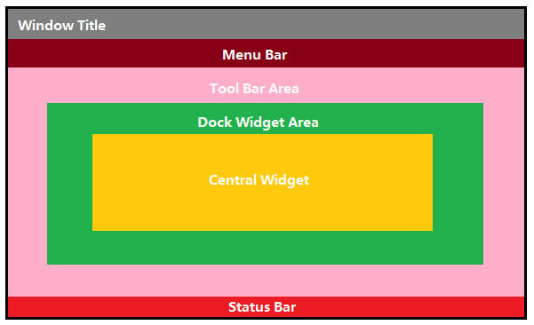


#### 2.1.1 菜单栏

一个主窗口最多只有一个菜单栏，其位于主窗口顶部、主窗口标题栏下面


为主窗口添加菜单栏需要用到 `menuBar()` 函数（`QMainWindow` 类的成员函数）来获取主窗口菜单栏指针

创建的菜单栏需要加入到主窗口，使用 `setMenuBar()` 函数

创建菜单 `QMenu` 后可以插入到菜单栏中，每个菜单中还可以创建菜单项 `QAction`


Qt 并没有专门的菜单项类，只是使用一个 `QAction` 类，抽象出公共的动作

当我们把QAction对象添加到菜单，就显示成一个菜单项，添加到工具栏，就显示成一个工具按钮

用户可以通过点击菜单项、点击工具栏按钮、点击快捷键来激活这个动作


**例：**

```c++
//创建菜单栏
QMenuBar * bar = menuBar();

//将菜单栏放入到窗口中
//setMenuBar(bar);	//可以不用添加

//创建菜单
QMenu * fileMenu = bar->addMenu("文件");
QMenu * editMenu = bar->addMenu("编辑");

//创建菜单项
QAction * newAction = fileMenu->addAction("新建");
fileMenu->addSeparator();	//添加分割线
QAction * openAction = fileMenu->addAction("打开");
```

注意：可以不用将菜单栏添加到窗口，因为我们掉用的 `menuBar` 其实是主窗口类的成员函数，故默认作用于当前窗口


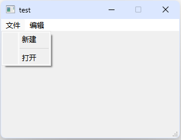


#### 2.1.2 工具栏

在 Qt 中可以用 `QToolBar` 来创建工具栏，将创建的工具栏用 `addToolBar` 函数添加到窗口上并设置停靠位置

直接调用 `QMainWindow` 类的 `addToolBar()` 函数（`QMainWindow` 类的成员函数）获取主窗口的工具条对象，每增加一个工具条都需要调用一次该函数


主窗口的工具栏上可以有多个工具条，通常采用一个菜单对应一个工具条的的方式，也可根据需要进行工具条的划分


**例：**

```cpp
//工具栏  可以有多个
QToolBar * toolBar = new QToolBar(this);
addToolBar(Qt::LeftToolBarArea,toolBar);

//后期设置 只允许 左右停靠
toolBar->setAllowedAreas( Qt::LeftToolBarArea | Qt::RightToolBarArea );

//设置浮动
toolBar->setFloatable(true);

//设置移动 (总开关)
toolBar->setMovable(true);

//工具栏中可以设置内容
//QAction * newAction = fileMenu->addAction("新建");
//QAction * openAction = fileMenu->addAction("打开");
toolBar->addAction(newAction);
toolBar->addSeparator();	//添加分割线
toolBar->addAction(openAction);

//工具栏中添加控件
QPushButton * btn = new QPushButton("保存" , this);
toolBar->addWidget(btn);
```

注意：

* 工具条是一个可移动的窗口，它的停靠区域由 `QToolBar` 的 `allowAreas` 决定，包括
    * `Qt::LeftToolBarArea` 停靠在左侧
    * `Qt::RightToolBarArea` 停靠在右侧
    * `Qt::TopToolBarArea` 停靠在顶部
    * `Qt::BottomToolBarArea` 停靠在底部
    * `Qt::AllToolBarAreas` 以上四个位置都可停靠

* 使用 `setAllowedAreas()` 函数指定停靠区域
* 使用 `setMoveable()` 函数设定工具栏的可移动性（`false` 表示工具条不可移动, 只能停靠在初始化的位置上）


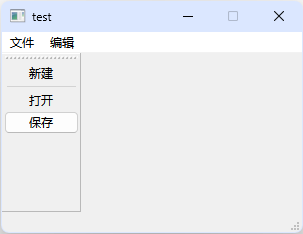    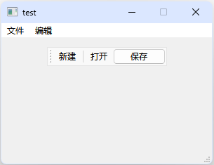    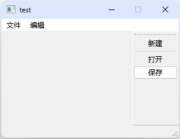


#### 2.1.3 状态栏

状态栏和菜单栏一样，也只能最多有一个，派生自 `QWidget` 类

添加状态栏需要用到 `statusBar()` 函数（`QMainWindow` 类的成员函数）来获取主窗口状态栏指针

可以在状态栏中添加其他控件


**例：**

```cpp
//状态栏 最多有一个
QStatusBar * stBar = statusBar();

//设置到窗口中
//setStatusBar(stBar);

//放标签控件
QLabel * label = new QLabel("标签1",this);
stBar->addWidget(label);

QLabel * label2 = new QLabel("标签2",this);
stBar->addWidget(label2);

QLabel * label3 = new QLabel("右标签",this);
stBar->addPermanentWidget(label3);	//在右侧添加

//放按钮控件
QPushButton * rightBtn = new QPushButton("右按钮" , this);
stBar->addPermanentWidget(rightBtn);
```


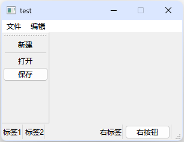


#### 2.1.4 铆接部件

铆接部件 `QDockWidget`，也称浮动窗口，可以有多个


**例：**

```cpp
//铆接部件 （浮动窗口） 可以有多个
QDockWidget * dockWidget = new QDockWidget("浮动",this);
addDockWidget(Qt::BottomDockWidgetArea,dockWidget);

//设置后期停靠区域，只允许上下
dockWidget->setAllowedAreas( Qt::TopDockWidgetArea | Qt::BottomDockWidgetArea );
```


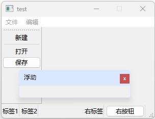     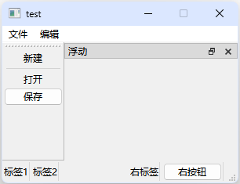    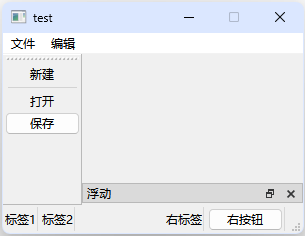


#### 2.1.5 核心部件

部件又称中心部件，除了以上几个部件，中心显示的部件都可以作为核心部件

例如一个记事本文件，可以利用 `QTextEdit` 做核心部件（`QTextEdit` 是 Qt 提供的富文本编辑控件，用于显示和编辑多行文本）


**例：**

```cpp
//设置中心部件 只能一个
QTextEdit * edit = new QTextEdit(this);
setCentralWidget(edit);
```


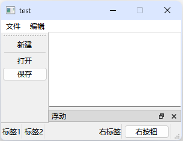


### 2.2 对话框 QDialog

对话框是 GUI 程序中不可或缺的组成部分，很多不能或者不适合放入主窗口的功能组件都必须放在对话框中设置

对话框通常会是一个顶层窗口，出现在程序最上层，用于实现短期任务或者简洁的用户交互


Qt 中使用 `QDialog` 类实现对话框，就像主窗口一样，我们通常会设计一个类继承 `QDialog`

`QDialog`（及其子类，以及所有 `Qt::Dialog` 类型的类）的对于其 `parent` 指针都有额外的解释

* 如果 parent 为 NULL，则该对话框会作为一个顶层窗口，否则则作为其父组件的子对话框（此时，其默认出现的位置是 `parent` 的中心）
* 顶层窗口与非顶层窗口的区别在于，顶层窗口在任务栏会有自己的位置，而非顶层窗口则会共享其父组件的位置


对话框分为模态对话框和非模态对话框

* 模态对话框，就是会阻塞同一应用程序中其它窗口的输入（类似于锁，会阻塞当前线程的交互，直到对话框关闭）

    当模态对话框出现时，我们是不能对除此对话框之外的窗口部分进行操作的

* 与此相反的是非模态对话框

    我们可以在显示着非模态对话框的同时，继续对其他窗口进行编辑


####  2.2.1 标准对话框

所谓标准对话框，是 Qt 内置的一系列对话框，用于简化开发

* QColorDialog 选择颜色
* QFileDialog 选择文件或者目录
* QFontDialog 选择字体
* QInputDialog 允许用户输入一个值，并将其值返回
* QMessageBox 模态对话框，用于显示信息、询问问题等
* QPageSetupDialog 为打印机提供纸张相关的选项
* QPrintDialog 打印机配置
* QPrintPreviewDialog 打印预览
* QProgressDialog 显示操作过程


**例：**

```cpp
QPushButton *btn = new QPushButton(this);

connect(btn,&QPushButton::clicked,[=](){
    QColor color = QColorDialog::getColor(
        QColor(255, 0, 0),  // 默认红色
        nullptr,    // 父窗口
        "选择颜色"    // 对话框标题
    );
    qDebug() << "r = " << color.red() << " g = " << color.green() << " b  = " << color.blue() ;
});
```

注意：`getColor()` 函数是 `QColorDialog` 颜色对话框提供的函数，用于弹出一个颜色选择窗口，每个对话框的弹出窗口函数不一样


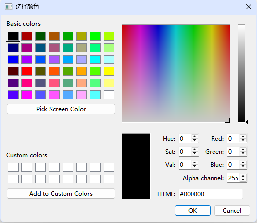


#### 2.2.2 自定义消息框

自定义消息框是指使用 `QDialog`（或`QMessageBox`）设计一个自定义的弹出框，它可以显示消息、输入框、按钮、图标等，以满足特定的需求


模态与非模态的实现：

* 使用 `QDialog::exec()` 实现应用程序级别的模态对话框（一般默认是应用程序级别的模态）
* 使用 `QDialog::open()` 实现窗口级别的模态对话框
* 使用 `QDialog::show()` 实现非模态对话框


应用程序级别的模态：

* 当该种模态的对话框出现时，用户必须首先对对话框进行交互，直到关闭对话框，然后才能访问程序中其他的窗口


窗口级别的模态：

* 该模态仅仅阻塞与对话框关联的窗口，但是依然允许用户与程序中其它窗口交互。窗口级别的模态尤其适用于多窗口模式


**例：**

```cpp
QDialog *dialog = new QDialog;

//设置窗口属性
dialog->setAttribute(Qt::WA_DeleteOnClose);

dialog->setWindowTitle("Hello world!");

//实现对话框
dialog->show();
```

注意：

* 如果使用 `show()` 则不能将该变量建立在栈上，栈上的内存会在作用域结束自动释放

    而 `show()` 不能阻塞当前线程，会导致对话框一闪而过

* 可以通过 `setAttribute()` 函数属性，来实现对话框关闭时，自动销毁对话框，避免内存泄露（或者设置父类，但设置父类后只能在一个界面类中出现）

    `Qt::WA_DeleteOnClose` 是 Qt 的窗口属性，作用是当对话框关闭时，自动释放内存（即 `delete this;`）


#### 2.2.3 消息对话框

消息对话框 `QMessageBox` 可以用于显示消息提示，消息对话框有很多种，不同的消息对话框有不同的显示函数

显示函数的返回值是对话框中选择的选项的宏


常用的消息对话框：

```cpp
//显示关于对话框
void about(QWidget * parent, const QString & title, const QString & text);

//显示红色错误符号 critical 
//显示蓝色信息图标 information
//显示黄色叹号图标 warning
StandardButton critical(QWidget * parent,
    const QString & title,
    const QString & text,
    StandardButtons buttons = Ok,
    StandardButton defaultButton = NoButton);
//默认情况下只有一个 Ok 按钮，我们可以使用StandardButtons类型指定多种按钮
//且 information 和 warning 函数除了显示的图标和 critical 不同外, 参数和用法无其他区别

//选择是否的对话框
StandardButton question(QWidget * parent,
    const QString & title,
    const QString & text,
    StandardButtons buttons = StandardButtons( Yes | No ),
    StandardButton defaultButton = NoButton);
//提供一个问号图标
```

参数：

* `parent` 父结点
* `title` 标题名
* `text` 对话框显示内容
* `buttons` 对话框按键类型，可以使用或运算符 `|` 指定多个按钮
* `defaultButton` 对话框默认选项


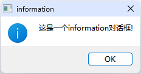   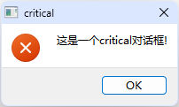   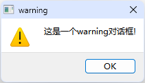   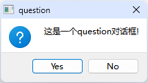


**例：**

```cpp
if (QMessageBox::Yes == QMessageBox::question(this,"Question", "Are you OK?", 
                                              QMessageBox::Yes | QMessageBox::No,QMessageBox::Yes))
{
    QMessageBox::information(this, "Emmm...","I'm glad to hear that!");
}
else
{
    QMessageBox::information(this, "Emmm...","I'm sorry!");
}
```


### 2.3 界面文件

#### 2.3.1 设计界面

在 Qt 中，界面文件（UI 文件）指的是以 `.ui` 结尾的 XML 文件，它定义了 Qt 应用程序的图形用户界面（GUI）

这些 `.ui` 文件通常是用 Qt Designer（Qt 设计器）创建的，随后由 Qt 的 `uic`（User Interface Compiler） 工具转换为 C++ 代码，并在程序中使用


可以通过拖拽的形式，在设计界面安放各种控件来实现对窗口的布局

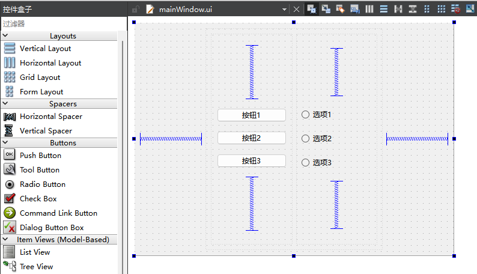


设计界面所摆放的所有控件都可以通过主窗口类中的 `Ui::mainWindow *ui;` 指针访问

通过修改控件的名称属性（objectName）后，`ui` 指针可以通过名称找到该控件，并对该控件进行操作


**例：**

```cpp
// 通过点击上述按钮1来关闭窗口
connect(ui->pushButton1,&QPushButton::clicked,this,&QWidget::close);
```

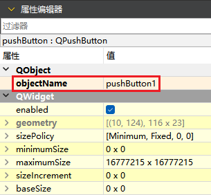


#### 2.3.2 布局管理器

Qt 提供了两种组件定位机制：绝对定位和布局定位。

* 绝对定位

    给出这个组件的坐标和长宽值，Qt 就知道该把组件放在哪里以及如何设置组件的大小

    如果改变了窗口大小（点击最大化按钮或者使用鼠标拖动窗口边缘），采用绝对定位的组件是不会有任何响应的

    因为你并没有告诉 Qt，在窗口变化时，组件是否要更新自己以及如何更新（或者直接禁止用户改变窗口大小）


* 布局定位

    将组件放入某一种布局，布局由专门的布局管理器进行管理

    当需要调整大小或者位置的时候，Qt 使用对应的布局管理器进行调整（解决了使用绝对定位的缺陷）

    可以设置布局的常见控件有 `QWidget`（窗口、容器控件），`QFrame`（带边框的容器控件），`QDialog`（对话框窗口）等


Qt 提供的布局中以下三种是我们最常用的：

* `QHBoxLayout`：按照水平方向从左到右布局
* `QVBoxLayout`：按照竖直方向从上到下布局
* `QGridLayout`：在一个网格中进行布局，类似于 HTML 的 table


可以在设计界面对上述可以设置布局的几种控件指定布局

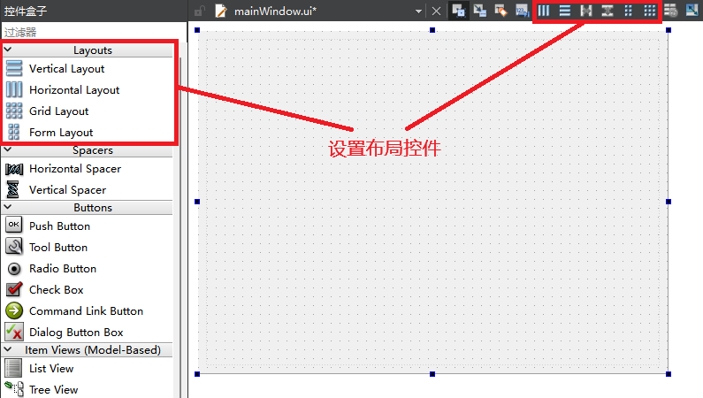


使用代码进行设置布局

```cpp
QWidget *widget = new QWidget(this);

// 创建水平布局
QHBoxLayout *hLayout = new QHBoxLayout(widget);

// 添加一些按钮到布局中
hLayout->addWidget(new QPushButton("按钮1"));
hLayout->addWidget(new QPushButton("按钮2"));
hLayout->addWidget(new QPushButton("按钮3"));

// 设置布局给 widget
widget->setLayout(hLayout);
```


### 2.4 资源文件

在qt中使用图片或视频等文件需要先添加资源文件，或使用绝对地址访问

1. 使用绝对地址访问资源文件

```cpp
QPushButton * btn = new QPushButton(this);

// 设置按钮的图片属性
btn->setIcon(QIcon("C:\\Users\\Public\\Pictures\\myphoto.png"));
```

注意：

* 绝对地址需要用 `QIcon` 类转换后才可以使用
* 地址中的所有 `\` 必须使用 `\\` 代替


2. 添加资源文件

添加新文件和设置文件名（相当于创建一个目录，但不是目录）

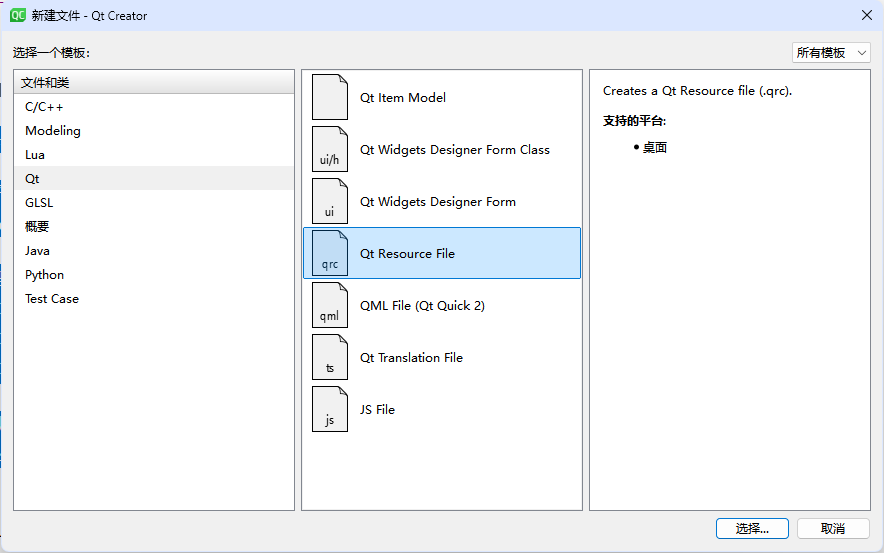 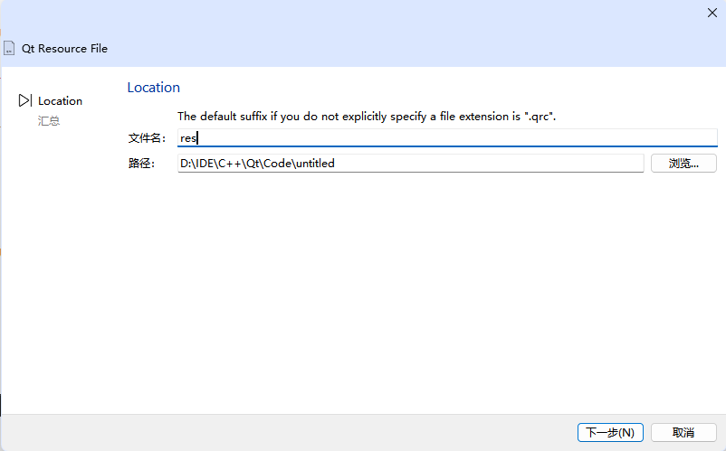 


之后修改前缀名（可以设置为最简单的 `\`），再添加需要的资源文件==（需要将文件复制到相对路径下）==

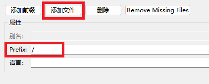 


之后便可以通过局部地址来访问资源文件

```cpp
QPushButton * btn = new QPushButton(this);

// 局部地址前为要加 :
// 无论文件在哪个资源文件中 qt 都可以找到, 所以可以省略资源文件的名字
btn->setIcon(QIcon(":/assets/timg.gif"));
```


### 2.5 常用控件

#### 2.5.1 QLabel

QLabel 的作用是显示一块标签，可以在标签上显示文本，图片和动画等


```cpp
QLabel *label = new QLabel(this);

// 显示文字
label->setText("Hello, World!");

// 显示链接
label ->setText("<h1><a href=\"https://www.baidu.com\">百度一下</a></h1>");
label ->setOpenExternalLinks(true);		// 点击后自动打开链接

// 显示图片
label->setPixmap(QPixmap(":/assets/photo.png"));		// setPixmap 只能接受 QPixmap 对象
QIcon icon(":/assets/photo.png");
label->setPixmap(icon.pixmap(100, 100));	// 或者使用 QIcon 的类型转换函数, 可以调整图片大小

// 显示动画
QMovie *movie = new QMovie(":/assets/timg.gif");
label->setMovie(movie);		// 先绑定 QLabel
movie->start();		// 再播放 QMovie
```


#### 2.5.2 QLineEdit

QLineEdit 是 Qt 提供的单行文本编辑框


```cpp
QLineEdit *lineEdit = new QLineEdit;

// 设置文本
lineEdit->setText("Hello, Qt!");

// 获取文本
QString inputText = lineEdit->text();

// 设置文本显示模式
lineEdit->setEchoMode(QLineEdit::Password);

// 设置文本边距
lineEdit->setTextMargins(10, 5, 10, 5);
// setTextMargins(int left, int top, int right, int bottom)
// left 左边距
// top 上边距
// right 右边距
// bottom 下边距
```

* `QLineEdit::Normal` 模式显示方式，按照输入的内容显示
* `QLineEdit::NoEcho` 不显示任何内容，此模式下无法看到用户的输入
* `QLineEdit::Password` 密码模式，输入的字符会根据平台转换为特殊字符
* `QLineEdit::PasswordEchoOnEdit` 编辑时显示字符否则显示字符作为密码


#### 2.5.3 自定义控件

在搭建 Qt 窗口界面的时候，在一个项目中很多窗口，或者是窗口中的某个模块会被经常性的重复使用

一般遇到这种情况我们都会将这个窗口或者模块拿出来做成一个独立的窗口类，以备以后重复使用


在项目中添加新的 Qt Widgets Designer Form Class，代码如下： 

```cpp
// mywidget.h
#ifndef MYWIDGET_H
#define MYWIDGET_H

#include <QWidget>
#include <QSpinBox>
#include <QSlider>
#include <QHBoxLayout>

namespace Ui {
class myWidget;
}

class myWidget : public QWidget
{
    Q_OBJECT

public:
    explicit myWidget(QWidget *parent = 0);
    ~myWidget();

private:
    QSpinBox* spin;
    QSlider* slider;
    Ui::myWidget *ui;
};

#endif // MYWIDGET_H


// mywidget.cpp
#include "mywidget.h"
#include "ui_mywidget.h"

myWidget::myWidget(QWidget *parent) : QWidget(parent)
{
    ui->setupUi(this);

    spin = new QSpinBox(this);
    slider = new QSlider(Qt::Horizontal, this);

    // 设置范围，确保两者一致
    spin->setRange(0, 100);
    slider->setRange(0, 100);

    // 创建布局对象
    QHBoxLayout* layout = new QHBoxLayout(this); // 直接将 this 作为 parent
    layout->addWidget(spin);
    layout->addWidget(slider);
    setLayout(layout);

    // 连接信号与槽，实现同步
    connect(spin, static_cast<void (QSpinBox::*)(int)>(&QSpinBox::valueChanged), slider, &QSlider::setValue);
    connect(slider, &QSlider::valueChanged, spin, &QSpinBox::setValue);
}

myWidget::~myWidget()
{
    delete ui;
}
```


上述代码联合了一个**数值微调框控件**和一个**滑动条控件**构造了一个自定义控件

通过 `myWidget *widget = new myWidget(this);` 实例化该组件

该控件也可以通过在设计界面将 `QWidget` 提升得到

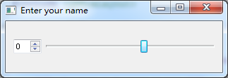                    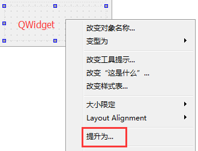


## 3 事件


