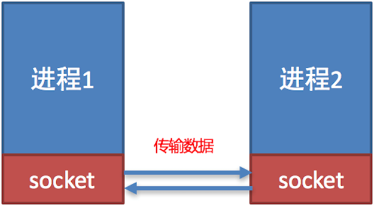

# python 基础入门

## 1 基础概要

### 1.1 数据和转换关系

#### 1.1.1 字面量和变量

字面量：在代码中，被写下来的固定的值（数据），值的常用类型为 整数（int），浮点数（float），字符串（string）

变量：用于存储程序运行时计算结果和值，==没有变量的类型，但存储的值有类型==（与c++，Java不同）

标识符（变量名，类名等）：只能由字母 `a-z, A-Z`、数字 `0-9` 和下划线 `_` 组成，且不能以数字开头，不能使用关键字，==区分大小写==


数值类型：

这些类型表示 **单个数值**，可以用于数学计算（只能存储一个数值）

| 类型            | 说明                                                    |
| --------------- | ------------------------------------------------------- |
| 整数（int）     | 如：10、-10                                             |
| 浮点数（float） | 如：13.14、-13.14                                       |
| 复数（complex） | 如：4+3j，以j结尾表示复数（j 或 J 都可以，但 j 更正规） |
| 布尔（bool）    | 表达现实生活中真和假的逻辑，True 表示真，False 表示假   |


容器类型：

这些类型可以 **存储多个元素**，并且每个元素可以是 **不同的数据类型**

| 类型               | 描述                   | 说明                                                         |
| ------------------ | ---------------------- | ------------------------------------------------------------ |
| 字符串（String）   | 描述文本的一种数据类型 | 由任意数量的字符组成，==不可修改==其中的字符内容             |
| 列表（List）       | 有序的可变序列         | 使用最频繁的数据类型，可==有序==记录一堆数据其==可以修改==元素 |
| 元组（Tuple）      | 有序的不可变序列       | 可==有序==记录一堆==不可修改且不能添加元素==的数据集合       |
| 集合（Set）        | 无序不重复集合         | 可==无序==记录一堆==不重复==的数据集合                       |
| 字典（Dictionary） | 无序Key-Value集合      | 可==无序==记录一堆 `Key-Value` （下标，值）型的数据集合      |


#### 1.1.2 type

可以使用 `type` 函数来获取变量中存储的值或单独的值的类型，返回 `type` 类型的值


**例：**

```py
# 定义值的类型并储存
int_value = 1
float_value = 1.0
str_value = "hello"

# 打印值的大小
print(int_value)
print(float_value)
print(str_value)
"""
1
1.0
hello
"""

# 打印值的类型
print(type(int_value))
print(type(float_value))
print(type(str_value))
"""
<class 'int'>
<class 'float'>
<class 'str'>
"""

# 打印 type 函数的返回类型
print(type(type(int_value)))
"""
<class 'type'>
"""
```


#### 1.1.3 强制类型转换

`str`：将变量（任何变量）转换为字符串

`int`：将只有数字的字符串转换为整数（不能对带有小数点的字符串进行转换）

`float`：将只有数字的字符串转换为浮点数，若没有小数将小数部分设置为 `0`


**例：**

```py
# 变量赋值
int_value = 1
float_value = 1.1
str1_value = "1.23"
str2_value = "1"
str3_value = "string"

# int 转 float , string
print(int_value, float(int_value))
print(int_value, str(int_value))
"""
1 1.0
1 1
"""

# float 转 int , string
print(float_value, int(float_value))
print(float_value, str(float_value))
"""
1.1 1
1.1 1.1
"""

# string 转 int , float
print(str1_value, float(str1_value))
print(str2_value, int(str2_value))
print(str2_value, float(str2_value))
"""
1.23 1.23
1 1
1 1.0
"""

# print(str1_value, int(str1_value))
# print(str3_value, float(str3_value))
# print(str3_value, int(str3_value))
```


#### 1.1.4 round

如果想让一个浮点数保留特定的小数位，可以使用内置的 `round` 函数


该函数用于将数字四舍五入到指定的小数位数

其接受两个参数

* 第一个参数 `number` 是要四舍五入的数字

* 第二个参数 `ndigits` 是要保留的小数位数（默认是 `0`）

    * 参数是正数，保留指定的小数位
    * 参数是 `0`，保留整数
    * 参数是负数，四舍五入到指定整数位

* 特殊情况

    * `round` 采用的是银行家舍入法，这意味着对于 `.5` 的情况，四舍五入到最近的偶数

    * 精度问题，如 `0.15` 的二进制近似值稍微小于 `0.15`，它实际存储的值可能类似于 `0.1499...`，所以四舍五入后结果变成了 `0.1`

        （`x.5` 的值不会出现此类问题 ）


**例：**

```py
x = 12.3456
rounded_x = round(x, 2)
print(rounded_x)
# 12.35

x = 12.3456
rounded_x = round(x)
print(rounded_x)
# 12

x = 12.3456
rounded_x = round(x, -1)  # 四舍五入到十位
print(rounded_x)
# 10

# 特殊情况1
print(round(0.5))  # 0
print(round(1.5))  # 2
print(round(2.5))  # 2
print(round(3.5))  # 4

# 特殊情况2
print(round(0.15,1))  # 0.1
print(round(1.15,1))  # 1.1
print(round(2.15,1))  # 2.1
print(round(3.15,1))  # 3.1
```


### 1.2 注释

注释是代码中 **供额外信息的文本**，它不会影响程序的运行

1. 单行注释 `#`

将本行中 `#` 之后的内容忽略

2. 多行注释 `""" ... """` 或 `''' ... '''`

相当于定义一个多行字符串，但没有变量接收


**例：**

```py
# 单行注释

"""
多
行
注
释
"""

'''
多行注释
'''
```


### 1.3 运算符

#### 1.3.1 常用运算符

**数学运算符**

执行基本的数学计算，如加法、减法、乘法等

| 运算符 | 描述   | 实例                                                         |
| ------ | ------ | ------------------------------------------------------------ |
| +      | 加     | 两个对象相加  `a + b` 输出结果  30                           |
| -      | 减     | 得到负数或是一个数减去另一个数  `a - b` 输出结果  -10        |
| *      | 乘     | 两个数相乘或是返回一个被重复若干次的字符串  `a * b` 输出结果  200 |
| /      | 除     | `b / a` 输出结果 2                                           |
| //     | 取整除 | 返回商的整数部分  `9//2` 输出结果  4 , `9.0//2.0` 输出结果  4.0 |
| %      | 取余   | 返回除法的余数  `b % a` 输出结果  0                          |
| **     | 指数   | `a**b`  为10的20次方，  输出结果 100000000000000000000       |


**赋值运算符**

用于将计算结果存储到变量中

| **运算符** | **描述**   | **实例**                                                     |
| ---------- | ---------- | ------------------------------------------------------------ |
| =          | 直接赋值   | 把 `=` 号右边的结果 赋给 左边的变量，如 `num  = 1 + 2 * 3`，结果num的值为 7 |
| +=         | 加法赋值   | `c += a` 等效于 `c = c + a`                                  |
| -=         | 减法赋值   | `c -= a` 等效于`c = c - a`                                   |
| *=         | 乘法赋值   | `c *= a` 等效于 `c = c * a`                                  |
| /=         | 除法赋值   | `c /= a` 等效于 `c = c / a`                                  |
| %=         | 取模赋值   | `c %= a` 等效于 `c = c % a`                                  |
| **=        | 幂赋值     | `c **= a` 等效于 `c = c ** a`                                |
| //=        | 取整除赋值 | `c //= a` 等效于 `c = c // a`                                |


位运算符和逻辑运算符和 c，c++，Java 一摸一样


**例：**

```py
# 变量赋值
int1 = 5
int2 = 3
float1, float2 = 3.14, 1.07
# py 可以一次给多个变量赋值

# int 之间的运算
print("int1 + int2", int1 + int2)
print("int1 - int2", int1 - int2)
print("int1 * int2", int1 * int2)
print("int1 / int2", int1 / int2)
print("int1 % int2", int1 % int2)
print("int1 // int2", int1 // int2)
print("int1 ** int2", int1 ** int2)
"""
int1 + int2 8
int1 - int2 2
int1 * int2 15
int1 / int2 1.6666666666666667
int1 % int2 2
int1 // int2 1
int1 ** int2 125
"""

# float 之间的运算
print("float1 + float2", float1 + float2)
print("float1 - float2", float1 - float2)
print("float1 * float2", float1 * float2)
print("float1 / float2", float1 / float2)
print("float1 // float2", float1 // float2)
print("float1 ** float2", float1 ** float2)
print("float1 // float2", float1 // float2)
"""
float1 + float2 4.21
float1 - float2 2.0700000000000003
float1 * float2 3.3598000000000003
float1 / float2 2.9345794392523366
float1 // float2 2.0
float1 ** float2 3.401846579862455
float1 // float2 2.0
"""
# float 没有 % 运算
# print("float1 % float2", float1%float2)
```


#### 1.3.2 优先级

运算符的优先级决定了表达式的计算顺序


运算符优先级从**高到低**如下：

| 优先级 | 运算符                                                  | 说明                   |
| ------ | ------------------------------------------------------- | ---------------------- |
| 0      | `()`                                                    | 圆括号（最高优先级）   |
| 1      | `**`                                                    | 指数运算               |
| 2      | `~`，`+/-`                                              | 按位取反、正负号       |
| 3      | `*`，`/`，`//`，`%`                                     | 乘、除、整除、取模     |
| 4      | `+`，`-`                                                | 加减                   |
| 5      | `<<`，`>>`                                              | 左移、右移             |
| 6      | `&` > `^` > `|`                                         | 位运算符               |
| 7      | `==`，`!=`，`>`，`<`，`>=`，`<=`                        | 比较运算               |
| 8      | `not` > `and` > `or`（类似于 c++ 中的 `!`，`&&`，`||`） | 逻辑运算符             |
| 9      | `=`，`+=`，`-=`，`*=`，`/=`，`%=`，`**=`，`//=`         | 赋值运算（最低优先级） |


## 2 I/O

### 2.1 输出

#### 2.1.0 print

`print` 作用是输出括号内表达式或变量的值

相关事项：

1. 但 `print` 输入出时会自动换行，因为 `print(end='\n')`，默认结束时输出 `\n`，通过修改 `end` 可以修改默认输入的最后一个字符 `print(end='')`
2. `print` 的可以输出多个参数，每个参数中用 `,` 分开，不推荐使用（每个参数之间会用 ` ` 空格隔开）


**例：**

```py
int_val = 100
float_val = 3.14
str_val = "hello"
print(int_val)
print(float_val)
print(str_val)
"""
100
3.14
hello
"""

print("Hello", end=' ')
print("world", end='!')
# Hello world!

print("Hello ", "world!")
# Hello  world!

print(100)
print(3.14)
print("hello")
"""
100
3.14
hello
"""
```


#### 2.1.2 字符串占位

字符串占位用于在字符串中预留位置，后续可以用变量或数据填充进去

三种常见的字符串占位方式：

1. `%` 格式化（旧式）

使用 `%` 来表示占位符，类似于 C 语言的 `printf`

| **占位符** | **代表数据类型** | **示例**                 |
| ---------- | ---------------- | ------------------------ |
| `%s`       | 字符串           | `"Hello, %s" % "Alice"`  |
| `%d`       | 整数             | `"Age: %d" % 25`         |
| `%f`       | 浮点数           | `"Score: %.2f" % 95.678` |


**例：**

```py
name = "Alice"
age = 25
print("Hello, %s! You are %d years old." % (name, age))
# Hello, Alice! You are 25 years old.
```


2. `str.format()` 方法

`str.format()` 提供更灵活的占位符 `{}`，并使用 `.format()` 进行填充


**例：**

```py
name = "Alice"
age = 25
print("Hello, {}! You are {} years old.".format(name, age))
# Hello, Alice! You are 25 years old.

# 索引
print("Hello, {1}! You are {0} years old.".format(age, name))
# Hello, Alice! You are 25 years old.

# 命名参数
print("Hello, {name}! You are {age} years old.".format(name="Alice", age=25))
# Hello, Alice! You are 25 years old.
```


3. f-string

f-string 直接在字符串前加 `f`，然后在 `{}` 中放变量，最简洁高效


**例：**

```py
name = "Alice"
age = 25
print(f"Hello, {name}! You are {age} years old.")
# Hello, Alice! You are 25 years old.

# 可以指定输出格式
score = 95.678
print(f"Your score is {score:.2f}")  # 保留两位小数
# Your score is 95.68
```


### 2.2 输入

#### 2.2.1 input

`iniput` 作用是从键盘获得一个==字符串==（获取一行，不会在空格处停止），括号内的内容会将等同于 `print()` 的输出


**例：**

```py
string_value = input("请输入一个字符串 ")
print(type(string_value))
print(string_value)
"""
请输入一个字符串 hello world
<class 'str'>
hello world
"""

print(input("请在输入一个字符串 "))
"""
请在输入一个字符串 hello world
hello world
"""
```


#### 2.2.2 非字符串输入

`input` 只会将变量赋值为字符串类型，想要将其赋值为其他类型必须使用强制转换函数 `int(input())`， `float(input())`


如果一行连续输入多个数据，可以使用 `split` 将数据分隔开

例：

 ```py
 int_value1 = input("请输入一个整型 ")
 print(type(int_value1))
 int_value2 = int(int_value1)
 print(type(int_value2))
 """
 <class 'str'>
 <class 'int'>
 """
 
 int_arr = input("请输入多个整型 ").split()
 print(int_arr)
 print(f"第一个数据加第二个数据的和为 {int(int_arr[0]) + int(int_arr[1])}")
 '''
 请输入多个整型 1 2 3 4 5 6
 ['1', '2', '3', '4', '5', '6']
 第一个数据加第二个数据的和为 3
 '''
 
 int_value1, int_value2 = map(int,input("请输入两个整型 ").split())
 print(int_value1 + int_value2)
 '''
 请输入两个整型 1 2
 3
 '''
 ```


## 3 字符串

### 3.1 定义与操作

#### 3.1.1 字符串赋值

Python 支持三种字符串定义方式：

1. **单引号定义**：`name = '黑马程序员'`
2. **双引号定义**：`name = "黑马程序员"`
3. **三引号定义**（支持换行）：

```py
name1 = """黑马程序员"""
name2 = '''黑马程序员'''
# 六个引号必须相同
```


**注意事项**：

- 三引号定义的字符串若未被变量接收，则视为多行注释
- 引号嵌套规则：
    - 单引号内可直接包含双引号，无需转义
    - 双引号内可直接包含单引号，无需转义
    - 相同引号嵌套时需使用 `\` 转义


**例**：

```py
# 三种定义方式
print('string')       # 输出: string
print("string")       # 输出: string
print("""string""")   # 输出: string

# 多行字符串
print("""
string""")            # 输出空行后接 string

# 引号嵌套
print('"string"')     # 输出: "string"
print("'string'")     # 输出: 'string'
print("\"string\"")   # 输出: "string"
print('\'string\'')   # 输出: 'string'
```


#### 3.1.2 字符串拼接

使用 `+` 运算符可将字符串连接：

```py
str1 = "hello "
str2 = "world!"
str3 = str1 + str2    # 结果: "hello world!"
print(str3)           # 输出: hello world!
```


#### 3.1.3 字符串占位与格式化

1. 百分号（%）占位符

通过 `%s` 占位符实现字符串格式化：

```py
str1 = "hello"
str2 = "world!"

str3 = "%s world!" % str1
str4 = "hello %s" % str2
print(str3)                   # hello world!
print(str4)                   # hello world!
```


2. f-string 格式化（推荐

使用 `f{}` 进行更简洁的字符串插值：

```py
str1 = "hello"
str2 = "world"

str5 = f"{str1} {str2}?"
print(str5)                   # hello world?
```


**注意**：

- 使用 `%` 或 `f-string` 时需确保变量类型与占位符匹配
- f-string 在 Python 3.6+ 版本支持


### 3.2 字符串常用方法详解

概览：

| **操作**                             | **说明**                                   |
| ------------------------------------ | ------------------------------------------ |
| `字符串[下标]`                       | 通过索引访问指定位置字符（支持正负索引）   |
| `字符串[i:j]`                        | 截取从i到j的子字符串（左闭右开）           |
| `字符串.index(子串)`                 | 返回子串首次出现的索引（未找到时抛出异常） |
| `字符串.replace(原串, 新串[, 次数])` | 替换指定内容并返回新字符串                 |
| `字符串.split([分隔符[, 最大分割]])` | 按分隔符切割字符串为列表                   |
| `字符串.strip([字符集])`             | 移除首尾指定字符（默认处理空白符）         |
| `字符串.count(子串)`                 | 统计子串出现次数                           |
| `len(字符串)`                        | 返回字符串字符总数                         |


#### 3.2.1 访问与切片

1. 索引访问  

支持正索引（0起始）和负索引（-1表示末位字符）

越界访问会触发 `IndexError`

```py
s = "Python编程"
print(s[0])     # P (正向索引)
print(s[1])     # y (正向索引)

print(s[-3])    # n (负向索引)
print(s[-2])    # 编 (负向索引)
print(s[-1])    # 程 (负向索引)
```


2. 切片操作  

- 语法：`[起始:结束:步长]`（结束索引不包含）
- 缺省值规则：
  - 起始默认0，结束默认字符串长度
  - 步长默认1，负值表示反向截取

```py
s = "0123456789"
print(s[2:6])   # 2345 (索引2 - 5)
print(s[2:20]) 	# 23456789 (索引2 - 9, 切片索引越界时自动取有效范围)
print(s[:3])    # 012 (索引0 - 2)

print(s[1:])    # 123456789 (索引1 - n)
print(s[:-1])   # 012345678 (索引0 - n-1)

print(s[::3])   # 0369 (步长3)
print(s[::-1])  # 9876543210 (字符串反转)
```


#### 3.2.2 查找与统计

1. index / find

- 可指定搜索范围：`index(子串, 起始, 结束)`
- 未找到时 `index` 抛出 `ValueError`，`find` 返回 -1不报错

```py
s = "Python入门到精通"
print(s.index("到"))        # 6
# print(s.index("Java"))   # 引发异常
```


2. count

- 支持范围统计：`count(子串, 起始, 结束)`
- 非重叠统计（如 `"aaa"` 中 `"aa"` 出现 2 次）

```py
s = "abracadabra"
print(s.count("abra"))      # 1
print(s.count("a", 3))      # 从索引3开始统计：3次
```


#### 3.2.3 修改与转换

注意：所有字符串操作均返回新对象，原始字符串保持不变

1. replace

- 可选参数控制最大替换次数
- 原字符串不受影响

```py
s = "apple orange apple"
new_s = s.replace("apple", "fruit", 1)
print(new_s)    # fruit orange apple
```


2. split  

- 默认按空白符分割（连续空白视为单个分隔符）
- 指定 `maxsplit` 时保留剩余部分

```py
s = "2023-08-25"
print(s.split("-", 1))      # ['2023', '08-25']
```


3. strip， lstrip，rstrip

- `strip` 默认去除首尾空格、换行符等空白字符，`lstrip` 只除去左端字符，`rstrip` 只除去字符
- 指定字符集时会逐个匹配移除

```py
s = "***重要提示***"
print(s.strip("*"))        # 重要提示
```


#### 3.2.4 其他操作

1. len

- 统计所有字符数量（包含空格和特殊符号）

```py
s = "Hello, 世界! 🌏"
print(len(s))       # 12 (注意表情符号长度计算)
```


#### 3.2.5 eval

`eval` 是 Python 内置函数（不用导入模块和包）之一，用于执行一个字符串表达式（将一个字符串翻译为表达式），并返回其计算结果


原型：

```py
eval(expression, globals=None, locals=None)
```

* `expression`：要计算的字符串表达式，例如 `"3 + 5"`，`"2 * (3 + 4)"`，甚至 `"sum([1, 2, 3])"`
* `globals`：定义全局变量的字典，可用于限制作用域，防止执行危险代码（防止访问一些特殊的内置函数）

* `locals`：定义局部变量的字典


**例：**

```py
x = 10
result = eval("x + 5")  # 计算字符串表达式
print(result)  # 15

myLocals = {"x": 10, "y": 20}	# 局部字典
print(eval("x + y", None, myLocals))  # 30

expr = "x + y"
myGlobals = {"__builtins__": None, "x": 10, "y": 5}	# 安全声明

print(eval(expr, myGlobals))  # 15
```


### 3.3 正则

#### 3.3.1 正则表达式

正则表达式（又称规则表达式），是使用单个字符串来描述、匹配某个句法规则的字符串，常被用来检索、替换那些符合某个模式（规则）的文本


比如，验证一个字符串是否是符合条件的电子邮箱地址，只需要配置好正则规则，即可匹配任意邮箱

 `(^[\w-]+(\.[\w-]+)*@[\w-]+(\.[\w-]+)+$)` 即可匹配一个字符串是否是标准邮箱格式


正则匹配的基础方法

1. `match` (匹配规则， 被匹配字符串)

    从被匹配字符串开头进行匹配， 匹配成功返回匹配对象（包含匹配的信息），匹配不成功返回空

2. `search`(匹配规则， 被匹配字符串)

    搜索整个字符串，找出匹配的。从前向后，找到第一个后，就停止，不会继续向后，整个字符串都找不到，返回 `None`

3. `findall`(匹配规则， 被匹配字符串)

    匹配整个字符串，找出全部匹配项，找不到返回空 `list: []`


**例**：

```py
import re

s1 = "python1 python2 python3"
s2 = "1python 2python 3python"

# match 从头匹配
result = re.match("python1", s1)
print(result)           # <re.Match object; span=(0, 7), match='python1'>
print(result.span())    # (0, 7)
print(result.group())   # python1

result = re.match("python1", s2)
print(result)           # None


# search 搜索匹配
result = re.search("python2", s1)
print(result)           # <re.Match object; span=(8, 15), match='python2'>
print(result.span())    # (8, 15)
print(result.group())   # python2

result = re.search("python2", s2)
print(result)           # None


# findall 搜索全部匹配
result = re.findall("python", s1)
print(result)           # ['python', 'python', 'python']

result = re.findall("python", s2)
print(result)           # ['python', 'python', 'python']
```

注意：

`span()` 和 `group()` 是匹配对象 (`Match`) 提供的两个常用方法，用于获取匹配结果的详细信息

* `span()`：

    返回匹配到的子串在原始字符串中的起始和结束位置（以元组形式表示）

     `(start, end)`，`start` 是起始索引，`end` 是结束索引（不包含 `end` 本身）

* `group()`

    返回匹配的子串

    `group(0)`：返回整个匹配到的字符串

    `group(n)`：返回第 `n` 个捕获组的内容（从 1 开始编号）


#### 3.3.2 匹配规则

元字符匹配规则：

| 字符           | 功能                                       |
| -------------- | ------------------------------------------ |
| **单字符匹配** |                                            |
| `.`            | 匹配任意 1 个字符（除了 `\n`），匹配点本身 |
| `[]`           | 匹配 `[]` 中列举的字符                     |
| `\d`           | 匹配数字，即 0-9                           |
| `\D`           | 匹配非数字                                 |
| `\s`           | 匹配空白字符，即空格、tab 键               |
| `\S`           | 匹配非空白                                 |
| `\w`           | 匹配单词字符，即 a-z、A-Z、0-9、_          |
| `\W`           | 匹配非单词字符                             |
| **数量匹配**   |                                            |
| `*`            | 匹配前一个规则的字符出现 0 至无数次        |
| `+`            | 匹配前一个规则的字符出现 1 至无数次        |
| `?`            | 匹配前一个规则的字符出现 0 次或 1 次       |
| `{m}`          | 匹配前一个规则的字符出现 m 次              |
| `{m,}`         | 匹配前一个规则的字符出现至少 m 次          |
| `{m,n}`        | 匹配前一个规则的字符出现 m 到 n 次         |
| **边界匹配**   |                                            |
| `^`            | 匹配字符串开头                             |
| `$`            | 匹配字符串结尾                             |
| `\b`           | 匹配一个单词的边界                         |
| `\B`           | 匹配非单词边界                             |
| **分组匹配**   |                                            |
| `|`            | 匹配左右任意一个表达式                     |
| `()`           | 将括号中字符作为一个分组                   |


正则表达式的字符串前加 `r`（例如 `r"pattern"`），表示这是一个**原始字符串（raw string）**

原始字符串的特点是，字符串中的反斜杠（`\`）不会被转义，而是被当作普通的字符对待


**例**：

```py
'^[0-9a-zA-Z]{6,10}$'
# 匹配账号，只能由字母和数字组成，长度限制6到10位

'^[1-9][0-9]{4,10}$'
# 匹配QQ号，要求纯数字，长度5-11，第一位不为0

r'(^[\w-]+(\.[\w-]+)*@(qq|163|gmail)(\.[\w-]+)+$)'
# 匹配邮箱地址，只允许qq、163、gmail这三种邮箱地址
```


## 4 判断和循环

### 4.1 判断

#### 4.1.1 bool

布尔 `bool` 表达现实生活中的逻辑，即真和假

* `True` 表示真（c++中是 `true`）
* `False` 表示假（c++中是 `false`）

`True` 本质上是一个数字记作 `1`，`False` 记作 `0`


可以使用比较运算符对数据进行判断

| **运算符** | **描述**                                                     | **示例**                            |
| ---------- | ------------------------------------------------------------ | ----------------------------------- |
| ==         | 判断内容是否相等，满足为True，不满足为False                  | 如 a=3，b=3，则 (a  == b)  为  True |
| !=         | 判断内容是否不相等，满足为True，不满足为False                | 如 a=1，b=3，则 (a  != b) 为  True  |
| >          | 判断运算符左侧内容是否大于右侧  满足为True，不满足为False    | 如 a=7，b=3，则 (a  > b)  为 True   |
| <          | 判断运算符左侧内容是否小于右侧  满足为True，不满足为False    | 如 a=3，b=7，则 (a  < b)  为 True   |
| >=         | 判断运算符左侧内容是否大于等于右侧  满足为True，不满足为False | 如 a=3，b=3，则 (a  >= b) 为  True  |
| <=         | 判断运算符左侧内容是否小于等于右侧  满足为True，不满足为False | 如 a=3，b=3，则 (a  <= b) 为  True  |


#### 4.1.2 if elif else

条件判断语句，用于执行不同的代码块，根据条件的真假来决定程序的执行流程


注意事项：

* python 中的 `else if` 被 `elif` 取代，并且不在用 `{}` 表示作用域，==需在前方填充4个空格的缩进（不可省略）==，python通过缩进判断代码块的归属关系
* python 中的判断条件不需要用 `()` 包裹，直接跟在关键字后面，且结束时需要加 `:`

 


**例：**

```py
# 判断语句实现
int_value = 5
if int_value < 0:
    print("int_value 小于 0")
    if int_value % 2 == 0:
        print("int_value 是偶数")
    else:
        print("int_value 是奇数")
elif int_value == 0:
    print("int_value 等于 0")
    print("int_value 是偶数")
else :
    print("int_value 大于 0")
    if int_value % 2 == 0:
        print("int_value 是偶数")
    else:
        print("int_value 是奇数")
```


#### 4.1.5 match

`match` 类似于其他语言中的 `switch` 语句，可以根据变量的值或结构执行不同的代码块，不仅可以匹配常量值，还可以进行更复杂的结构匹配


**语法：**

```py
match expression:
    case pattern1:
        # 如果表达式匹配模式1, 执行此代码块
    case pattern2:
        # 如果表达式匹配模式2, 执行此代码块
    case _:
        # 默认情况，匹配任何情况
```


**例：**

```py
option = int(input())
# 根据变量的值
match option:
    case 1:
        print("选择选项1")
    case 2:
        print("选择选项2")
    case 4 | 5 | 6:		# 在 match 中, or 可以用 | 来简写
        print("选择选项 4 或 5 或 6")
    case _:
        print("默认选项")


# 解构和容器匹配(可以是其他容器)
value = (1, 2, 3, 4, 5)
match value:
    case (x, y):
        print(f"value元组第一个元素为{x}, 第二个元素为{y}")
    case (x, y, *rest):     # 匹配长度大于等于3的容器
        print(f"value元组的元素有：{x}, {y}, {rest}")
# value元组的元素有：1, 2, [3, 4, 5]


# 类型匹配
value = int(input(""))
match value:
    # int(), str()是一种匹配模式, 用来匹配该类型的变量
    case int():
        print(f"Integer: {value}")
    case str():
        print(f"String: {value}")
    case _:
        print("Unknown type")
```


#### 4.1.4 逻辑运算符

逻辑运算符是用于连接多个条件表达式的符号，最终通过这些条件的关系，得出一个布尔值（`True` 或 `False`）


`and(&&)`：与运算符，只有当两个条件都为 `True` 时，整个表达式才为 `True`

`or(||)`：或运算符，只要有一个条件为 `True`，整个表达式就为 `True`

`not(!)`：非运算符，用于将一个布尔值取反（如果原始值为 `True`，则结果为 `False`，反之亦然）


**例：**

```py
a, b = 5, 10
if a > 0 and b > 0:
    print("a 和 b 都是正数")
elif a > 0 or b < 0:
    print("a 和 b 有一个是正数")
else:
    print("a 和 b 都是负数")
```


`and` 运算符连接的多个比较符可以进行链式简化：

```py
x = int(input())
"""
if x > 0 and x < 10:  """
if 2 < x < 10:
    print("x 是个位数")
```


### 4.2 循环

循环是一种控制结构，允许程序重复执行某些操作，直到满足特定条件为止


#### 4.2.1 while

和判断语句一样，判断条件不用  `()` 包裹，直接跟在关键字后面，并在结束时加 `:`


**例：**

```py
# while循环实现
i = 1
while i <= 9:
    j = 1
    while j <= i:
        print(f"{j}*{i}={i*j}", end="\t")
        j += 1
    print()
    i += 1
"""
1*1=1	
1*2=2	2*2=4	
1*3=3	2*3=6	3*3=9	
1*4=4	2*4=8	3*4=12	4*4=16	
1*5=5	2*5=10	3*5=15	4*5=20	5*5=25	
1*6=6	2*6=12	3*6=18	4*6=24	5*6=30	6*6=36	
1*7=7	2*7=14	3*7=21	4*7=28	5*7=35	6*7=42	7*7=49	
1*8=8	2*8=16	3*8=24	4*8=32	5*8=40	6*8=48	7*8=56	8*8=64	
1*9=9	2*9=18	3*9=27	4*9=36	5*9=45	6*9=54	7*9=63	8*9=72	9*9=81	
"""
```


#### 4.2.2 for

python中的 `for` 循环是一种**轮询**机制，是对一批内容进行**逐个处理**，类似 c++ 中的高级 `for`

语法：

```py
for 临时变量 in 待处理数据集:
	循环满足条件时执行的代码
```

其中的待处理数据集，严格来说，称之为：可迭代类型

可迭代类型指，**其内容可以一个个依次取出的一种类型**，包括：字符串，列表，元组等


**例：**

```py
# for循环实现
name = "hello"
for x in name:
    print(x)
"""
h
e
l
l
o
"""
```

注意：

* `for` 循环无法定义循环条件，只能被动取出数据处理

* `for` 循环中的临时变量，其作用域限定为循环内

    是编程规范的限定，而非强制限定，不遵守也能正常运行，但是不建议这样做

    如需访问临时变量，可以预先在循环外定义它


#### 4.2.3 range

`range` 语句的作用是获得一个简单的数字序列

构造函数：

* `range(num)` 

    获取一个从0开始，到 `num` 结束的数字序列（不含 `num` 本身）

    如 `range(5)` 取得的数据是：`[0, 1, 2, 3, 4]`

* `range(num1, num2)`

    获得一个从 `num1` 开始，到 `num2` 结束的数字序列（不含 `num2` 本身）

    如，`range(5, 10)` 取得的数据是：`[5, 6, 7, 8, 9]`

* `range(num1, num2, step)`

    获得一个从 `num1` 开始，到 `num2` 结束的数字序列（不含 `num2` 本身）

    数字之间的步长，以 `step` 为准（`step` 默认为1）

    如，`range(5, 10, 2)` 取得的数据是：`[5, 7, 9]`


**例：**

```py
# range实现
for x in range(2, 11, 2):
    print(x)
"""
2
4
6
8
10
"""
```


####  4.2.4 中断

`continue`：中断本次循环，直接进入下一次循环

`break`：直接结束所在循环

和 c++／java 的唯一区别是不用加 `;`


**例：**

```py
# 中断实现
for i in range(1, 7):
    if i == 3:
        continue
    if i == 5:
        break
    print(i)
"""
1
2
4
"""
```


## 5 函数

### 5.1 函数定义

#### 5.1.1 函数实现

语法：

```py
def 函数名(传入参数1, 传入参数2, 传入参数3...): # python没有函数类型
    函数体
    return 返回值1, 返回值2
```

注意：

* 参数不需要，可以省略；返回值不需要，可以省略（返回 `None` 类型）
* 先定义函数（定义在调用上方），后调用函数
* 可以返回多个值


**例：**

```py
# 函数案例1
def func(num1, num2):
    return num1 + num2, num1 - num2

add, sub = func(2, 1) 
print(add, sub)    # 3, 1

##############################################################

# 函数案例2
def hello():
    print("Hello world!")

print(type(hello()))
"""
Hello world!
<class 'NoneType'>
"""
```


#### 5.1.2 局部与全局变量

局部变量：在函数体内部，临时保存数据，即当函数调用完成后，则销毁局部变量

全局变量：指的是在函数体内、外都能生效的变量，使用 `global` 关键字 可以在函数内部声明变量为全局变量


**例：**

```py
# global 的使用

def func():
    global num1, num2
    num1 = int(input("给num1赋值: "))
    num2 = int(input("给num2赋值: "))

func()
print(f"{num1} + {num2} = {num1 + num2}")
"""
给num1赋值: 1
给num2赋值: 2
1 + 2 = 3
"""
```


#### 5.1.3 缺省参数

缺省参数也叫默认参数，用于定义函数，为参数提供默认值，调用函数时可不传该默认参数的值

注意：

* 所有位置参数必须出现在默认参数前，包括函数定义和调用
* 函数调用时，如果为缺省参数传值则修改默认参数值，否则使用这个默认值


**例：**

```py
def print_info(name, age, sex='男'):
    print(f"我是{name}, 今年{age}岁, 性别{sex}")

print_info('Tom', 18)
# 我是Tom, 今年18岁, 性别男

print_info('Rose', 22, '武装直升机')
# 我是Rose, 今年22岁, 性别武装直升机
```


#### 5.1.4 参数传递

在 Python 中，函数可以通过 `*args` 和 `**kwargs` 来接收不定数量的参数

`*args(位置传递)`：用来接收任意数量的位置参数，传入的所有参数会被打包成一个元组

`**kwargs(关键字传递)`：当使用 `"键=值"` 的形式传参时，所有参数都会被 `**kwargs` 接收，并自动组织成一个字典


**示例：**

```py
def user_info1(*args):
    print(args)

user_info1('TOM')            # ('TOM',)
user_info1('TOM', 18)        # ('TOM', 18)

def user_info2(**kwargs):
    print(kwargs)

user_info2(name='TOM', age=18, id=110)
# {'name': 'TOM', 'age': 18, 'id': 110}
```

注意：

* 当 `*args` 只传入一个元素时，Python 会将其放入一个单元素元组中，即 `(元素,)`，注意逗号是必须的，否则就不是元组


#### 5.1.5 函数作为参数传递

函数本身是可以作为参数，传入另一个函数中进行使用的

将函数传入的作用在于：传入计算逻辑，而非传入数据


**例：**

```py
def add(a, b):
    return a + b

def operate(func, x, y):
    return func(x, y)

print(operate(add, 5, 3))   # 将 add 函数传入 operate 函数中用于计算
```


#### 5.1.6 lambda匿名函数

函数的定义中：

* `def` 关键字，可以定义带有名称的函数

* `lambda` 关键字，可以定义匿名函数（无名称）

有名称的函数，可以基于名称重复使用；**无名称的匿名函数，只可临时使用一次**


匿名函数定义语法：`lambda 传入参数:函数体(一行代码)`

* `lambda` 是关键字，表示定义匿名函数
* 传入参数表示匿名函数的形式参数，如：x，y 表示接收 2 个形式参数
* 函数体，就是函数的执行逻辑，要注意：只能写一行，无法写多行代码


**例：**

```py
# 使用 lambda 表达式定义一个匿名函数，计算两数之和
add = lambda a, b: a + b

# 调用该函数
print(add(5, 3))    # 8
print(add(7, 4))    # 11
```

注意：将 `lambda`  的结果赋给一个变量后，可以重复使用该函数（变量有名称）


### 5.2 常用函数和模块

#### 5.2.1 math

`math` 模块提供了许多数学函数，可以用于数学计算


**例：**

```py
import math

# 基础数学运算
print(math.sqrt(16))  		# 平方根, 16^0.5 = 4.0
print(math.pow(2, 3))  		# 幂运算, 2^3 = 8.0
print(math.exp(1))  		# 自然指数, e^x = 2.718281828459045
print(math.log(8, 2))  		# 2的对数, log2(8) = 3.0
print(math.log2(8))  		# 2的对数, log2(8) = 3.0
print(math.log10(100))  	# 10的对数, lg(100) = 2.0
print(math.log(math.e))  	# 自然的对数, ln(e) = 1

# 角度和三角函数
print(math.radians(180))  		# 角度转弧度, 180 = π = 3.141592653589793
print(math.degrees(math.pi))  	# 弧度转角度, π = 180.0
print(math.sin(math.pi / 2))  	# 正弦, sin(π/2) = 1.0
print(math.cos(0))  			# 余弦, cos(0) = 1.0
print(math.tan(math.pi / 4))  	# 正切, tan(π/4) = 1.0

# 数值操作
print(math.ceil(3.2)) 		# 向上取整, 4
print(math.floor(3.9))  	# 向下取整, 3
print(math.fabs(-10))  		# 绝对值, 10.0
print(math.factorial(5))  	# 阶乘, 5! = 120
print(math.gcd(12, 18))  	# 最大公约数, gcd(12,18) = 6

# 常数
print(math.pi)  	# π = 3.141592653589793
print(math.e)  		# e = 2.718281828459045
print(math.inf)  	# 正无穷大
print(-math.inf)  	# 负无穷大
print(math.nan)  	# 非数值
```


#### 5.2.2 内置函数

内置函数是 Python 语言中默认提供的、无需导入即可直接使用的函数

这些函数提供了常见的操作和功能，能够简化开发工作并提高代码的执行效率

之前提到的 `print`，`input`，`type`，`range`，`eval`，`len` 都是内置函数


其他常用内置函数：

```py
abs(-5)  			# 绝对值 5
pow(2, 3)  			# n 的 m 次方 8
max([1, 3, 2])  	# 最大值 3
min([1, 3, 2])  	# 最小值 1
sum([1, 3, 2])		# 元素和 6
sorted([1, 3, 2])	# 容器排序 [1, 2, 3]
```


## 6 数据容器

数据容器是一种可以存储多个元素的数据类型

|          | **列表** | **元组**   | **字符串** | **集合**   | **字典**                                 |
| -------- | -------- | ---------- | ---------- | ---------- | ---------------------------------------- |
| 元素数量 | 支持多个 | 支持多个   | 支持多个   | 支持多个   | 支持多个                                 |
| 元素类型 | 任意     | 任意       | 仅字符     | 任意       | Key：除字典外任意类型<br>Value：任意类型 |
| 下标索引 | 支持     | 支持       | 支持       | ==不支持== | ==不支持==                               |
| 重复元素 | 支持     | 支持       | 支持       | ==不支持== | ==不支持==                               |
| 可修改性 | 支持     | ==不支持== | ==不支持== | 支持       | 支持                                     |


### 6.1 list(列表)

#### 6.1.1 列表定义

列表内的每一个数据，称之为元素，以 `[]` 作为标识，且列表内每一个元素之间用，逗号隔开（c++/Java 中的数组）

```py
# 字面量
[元素1, 元素2, 元素3, 元素4, ...]
# 定义变量
变量名称 = [元素1, 元素2, 元素3, 元素4, ...]
# 定义空列表
变量名称 = []
变量名称 = list()
```


用法：

* 列表可以一次存储多个数据，且可以为不同的数据类型，支持嵌套

* 列表中的每一个元素，都有其位置下标索引，从前向后的方向，从 `0` 开始，依次递增

    按照下标索引，即可取得对应位置的元素

    可以反向索引，也就是从后向前：从 `-1` 开始，依次递减（`-1` 是最后一个元素，`-2` 是倒数第二个元素，以此类推）


**例：**

```py
list_value = ["str1", 'str2', 3, 4.0, True,[6,7,8]]
print(list_value)
print(type(list_value))
"""
['str1', 'str2', 3, 4.0, True, [6, 7, 8]]
<class 'list'>
"""

# 正序遍历
for item in list_value:
    print(item, type(item))
"""
str1 <class 'str'>
str2 <class 'str'>
3 <class 'int'>
4.0 <class 'float'>
True <class 'bool'>
[6, 7, 8] <class 'list'>
"""

# 倒序遍历
i = -1
while -i <= len(list_value):
    print(list_value[i], type(list_value[i]))
    i = i - 1
"""
[6, 7, 8] <class 'list'>
True <class 'bool'>
4.0 <class 'float'>
3 <class 'int'>
str2 <class 'str'>
str1 <class 'str'>
"""
```


#### 6.1.2 列表常用方法

常用方法：（方法即为成员函数）

| **使用方式**            | **作用**                                       |
| ----------------------- | ---------------------------------------------- |
| 列表.append(元素)       | 向列表中追加一个元素                           |
| 列表.extend(容器)       | 将数据容器的内容依次取出，追加到列表尾部       |
| 列表.insert(下标, 元素) | 在指定下标处，插入指定的元素                   |
| del 列表[下标]          | 删除列表指定下标元素                           |
| 列表.pop(下标)          | 删除列表指定下标元素                           |
| 列表.remove(元素)       | 从前向后，删除此元素第一个匹配项               |
| 列表.clear()            | 清空列表                                       |
| 列表.count(元素)        | 统计此元素在列表中出现的次数                   |
| 列表.index(元素)        | 查找指定元素在列表的下标  找不到报错ValueError |
| len(列表)               | 统计容器内有多少元素                           |


例：

```py
# 初始化一个列表
my_list = [1, 2, 3, 4, 5]
print(my_list)	# [1, 2, 3, 4, 5]

# append() 向列表中追加一个元素
my_list.append(6)
print(my_list)	# [1, 2, 3, 4, 5, 6]

# extend() 将另一个容器的内容追加到列表尾部
my_list.extend([7, 8])
print(my_list)	# [1, 2, 3, 4, 5, 6, 7, 8]

# insert() 在指定下标插入一个元素
my_list.insert(3, 99)  # 在下标3插入99
print(my_list)	# [1, 2, 3, 99, 4, 5, 6, 7, 8]

# del 删除指定下标的元素
del my_list[2]  # 删除下标2的元素
print(my_list)	# [1, 2, 99, 4, 5, 6, 7, 8]

# pop() 删除指定下标的元素
print(my_list.pop(4))   # 删除下标4的元素  5
print(my_list)	# [1, 2, 99, 4, 6, 7, 8]

# remove() 删除第一个匹配的指定元素
my_list.remove(99)  # 删除第一个匹配的99
print(my_list)	# [1, 2, 4, 6, 7, 8]

# clear() 清空列表
my_list.clear()
print(my_list)  # []

# count() 统计指定元素在列表中的出现次数
my_list = [1, 2, 2, 3, 3, 3]
count = my_list.count(3)  # 统计3的出现次数
print(count)    # 3

# index() 查找指定元素的下标
index = my_list.index(2)  # 查找左边第一个2的下标
print(index)    # 2

# len() 统计列表中元素的个数
length = len(my_list)
print(length)   # 6
```


### 6.2 tuple(元组)

#### 6.2.1 元组定义

元组同列表一样，都是可以封装多个、不同类型的元素在内，但元组一旦定义完成，就不可修改

所以，当我们需要在程序内封装数据，又不希望封装的数据被篡改，那么元组就非常合适了


定义元组使用小括号，且使用逗号隔开各个数据，数据可以是不同的数据类型

```py
# 字面量
(元素1, 元素2, 元素3, 元素4, ...)
# 定义变量
变量名称 = (元素1, 元素2, 元素3, 元素4, ...)
# 定义空元组
变量名称 = ()
变量名称 = tuple()
```

注意：当元组只有一个元素时需要在该元素后面加一个 `,`，即 `(元素,)`，来表示它是一个单元素元组


#### 6.2.2 元组常用方法

常用方法：

| **方法**  | **作用**                                           |
| --------- | -------------------------------------------------- |
| index()   | 查找某个数据，如果数据存在返回对应的下标，否则报错 |
| count()   | 统计某个数据在当前元组出现的次数                   |
| len(元组) | 统计元组内的元素个数                               |

注意：元组由于不可修改的特性，所以其操作方法非常少


**例：**

```py
# 初始化一个元组
my_tuple = (1, 2, 3, 4, 2, 5, 6, 2)
print(my_tuple) #(1, 2, 3, 4, 2, 5, 6, 2)

# index() 查找指定元素的下标
print(my_tuple.index(3))    # 查找3的下标  2

# count() 统计指定元素出现的次数
print(my_tuple.count(2))    # 统计2的出现次数  3

# len() 统计元组中元素的个数
print(len(my_tuple))    # 8
```


### 6.3 序列和切片

序列是指：内容连续、有序，可使用下标索引的一类数据容器

列表、元组、字符串，均可以可以视为序列

序列支持切片，即：列表、元组、字符串，均支持进行切片操作


**切片**：从一个序列中，取出一个子序列

语法：`序列[起始下标:结束下标:步长]`

表示从序列中，从指定位置开始，依次取出元素，到指定位置结束，得到一个新序列

* 起始下标表示从何处开始，可以留空，留空视作从头开始

    结束下标（不含）表示何处结束，可以留空，留空视作截取到结尾

* 步长表示，依次取元素的间隔（默认为 `1`），步长 `N` 表示，每次跳过 `N-1` 个元素取（`1` 的步长即为取每个元素）

    步长为负数表示，反向取（注意，起始下标和结束下标也要反向标记）

注意：此操作不会影响序列本身，而是会得到一个新的序列（列表、元组、字符串）


**例：**

```py
# 正步长
my_list = [1, 2, 3, 4, 5]
new_list = my_list[1:4]  # 下标1开始，下标4（不含）结束，步长1
print(new_list)  # [2, 3, 4]

my_tuple = (1, 2, 3, 4, 5)
new_tuple = my_tuple[:]  # 从头开始，到最后结束，步长1
print(new_tuple)  # (1, 2, 3, 4, 5)

my_list = [1, 2, 3, 4, 5]
new_list = my_list[::2]  # 从头开始，到最后结束，步长2
print(new_list)  # [1, 3, 5]

my_str = "12345"
new_str = my_str[:4:2]  # 从头开始，到下标4（不含）结束，步长2
print(new_str)  # "13"


# 负步长
my_str = "12345"
new_str = my_str[::-1]  # 从头（最后）开始，到尾结束，步长-1（倒序）
print(new_str)  # "54321"

my_list = [1, 2, 3, 4, 5]
new_list = my_list[3:1:-1]  # 从下标3开始，到下标1（不含）结束，步长-1（倒序）
print(new_list)  # 结果：[4, 3]

my_tuple = (1, 2, 3, 4, 5)
new_tuple = my_tuple[:1:-2]  # 从头（最后）开始，到下标1(不含)结束，步长-2（倒序）
print(new_tuple)  # (5, 3)
```


### 6.4 set(集合)

#### 6.4.1 集合定义

集合和列表的区别是**不支持元素的重复（自带去重功能）**、且**内容无序**（因为要对元素做去重处理，所以无法保证顺序和创建的时候一致）


定义集合使用大括号 `{}`，且使用逗号隔开各个数据，数据可以是不同的数据类型，和列表一样可以修改元素

```py
# 字面量
{元素1, 元素2, 元素3, 元素4, ...}
# 定义变量
变量名称 = {元素1, 元素2, 元素3, 元素4, ...}
# 定义空集合
变量名称 = {}
变量名称 = set()
```


#### 6.4.2 集合常用方法

常用方法：

| 方法                           | 说明                                                        |
| ------------------------------ | ----------------------------------------------------------- |
| 集合.add(元素)                 | 集合内添加一个元素                                          |
| 集合.remove(元素)              | 移除集合内指定的元素                                        |
| 集合.pop()                     | 从集合中随机取出一个元素                                    |
| 集合.clear()                   | 将集合清空                                                  |
| 集合1.difference(集合2)        | 得到一个新集合，内含2个集合的差集  原有的2个集合内容不变    |
| 集合1.difference_update(集合2) | 在集合1中，删除集合2中存在的元素  集合1被修改，集合2不变    |
| 集合1.union(集合2)             | 得到1个新集合，内含2个集合的全部元素  原有的2个集合内容不变 |
| len(集合)                      | 得到一个整数，记录了集合的元素数量                          |


**例：**

```py
# 初始化两个集合
set1 = {1, 2, 3}
set2 = {3, 4, 5}

# add() 向集合添加一个元素
set1.add(6)
print(set1)  # {1, 2, 3, 6}

# remove() 移除集合内指定的元素
set1.remove(2)
print(set1)  # {1, 3, 6}

# pop() 从集合中随机取出一个元素
print(set1.pop())  # 1
print(set1)  # {3, 6}

# clear() 将集合清空
set3 = {7, 8, 9}
set3.clear()
print(set3)  # set()

# difference() 得到两个集合的差集（新集合）
print(set1.difference(set2))  # {6}

# difference_update() 删除集合2中存在的元素，修改集合1
set1.difference_update(set2)
print(set1)  # {6}

# union() 合并两个集合，得到新集合
print(set1.union(set2))  # {3, 4, 5, 6}

# len() 得到集合的元素数量
print(len(set1))  # 1
```

注意：集合不能使用 `[]` 获取元素


### 6.5 dict(字典、映射)

#### 6.5.1 字典定义

字典的定义，同样使用 `{}`，不过存储的元素是一个个的键值对（c++ 中的 `map` 容器）


语法：

* 使用 `{}` 存储原始，每一个元素是一个键值对
* 每一个键值对包含 `Key` 和 `Value`（用冒号分隔）
* 键值对之间使用 `:` 分隔
* `Key` 和 `Value` 可以是任意类型的数据（`Key` 不可为字典，但 `Value` 可以为字典）
* `Key` 不可重复，重复会对原有数据覆盖

```py
# 定义字典字面量
{key: value, key: value, ..., key: value}
# 定义字典变量
my_dict = {key: value, key: value, ..., key: value}

# 定义空字典
my_dict = {}
my_dict = dict()
```

注意：`dict` 不能通过下标来获得元素，但可以通过 `[]` 用 `Key` 来获得对应元素


#### 6.5.2 字典常用方法

常用方法：

| 操作              | 说明                                          |
| ----------------- | --------------------------------------------- |
| 字典[Key]         | 获取指定Key对应的Value值                      |
| 字典[Key] = Value | 添加或更新键值对                              |
| 字典.pop(Key)     | 取出Key对应的Value并在字典内删除此Key的键值对 |
| 字典.clear()      | 清空字典                                      |
| 字典.keys()       | 获取字典的全部Key，可用于for循环遍历字典      |
| len(字典)         | 计算字典内的元素数量                          |


**例：**

```py
# 初始化字典
my_dict = {"a": 1, "b": 2, "c": 3}
print(my_dict)  # {'a': 1, 'b': 2, 'c': 3}

# 字典[Key] = Value 添加或更新键值对
my_dict["d"] = 4  # 添加新键值对
my_dict["b"] = 5  # 更新键值对
print(my_dict)  # {'a': 1, 'b': 5, 'c': 3, 'd': 4}

# 字典[Key] 获取指定Key对应的Value值
print(my_dict["a"]) # 获取键"a"对应的值  1


# pop(Key) 取出Key对应的Value并删除此键值对
print(my_dict.pop("c")) # 删除键"c"对应的键值对，并获取值  3
print(my_dict)  # {'a': 1, 'b': 5, 'd': 4}

# clear() 清空字典
my_dict.clear()
print(my_dict)  # {}

# 字典.keys() 获取字典的全部Key
my_dict = {"x": 10, "y": 20, "z": 30}
print(my_dict.keys())   # 获取所有键
# dict_keys(['x', 'y', 'z'])

# len() 计算字典内的元素数量
print(len(my_dict)) # 计算字典元素个数  3
```


### 6.6 通用方法

通用方法是指列表，元组，集合，字符串，字典都可以使用的方法

| 方法                         | **描述**                                                     |
| ---------------------------- | ------------------------------------------------------------ |
| max()                        | 容器内最大元素                                               |
| min()                        | 容器内最小元素                                               |
| len()                        | 容器元素个数                                                 |
| list()                       | 转换为列表                                                   |
| tuple()                      | 转换为元组                                                   |
| str()                        | 转换为字符串                                                 |
| set()                        | 转换为集合                                                   |
| sorted(序列, [reverse=True]) | 排序，reverse 表示两个数据的比较结果<br/>默认为升序 ( reverse = True表示降序 ) |

注意：`sorted` 函数中 `reverse` 参数不是第二个参数，不能用位置参数，用关键字参数直接指定


**例：**

```py
# 初始化容器
my_list = [5, 3, 9, 1, 7]

# max() 容器内最大元素
print(max(my_list)) # 9

# min() 容器内最小元素
print(min(my_list)) # 1

# len() 容器元素个数
print(len(my_list))# 5

# list() 转换为列表
my_tuple = (8, 4, 6)
print(list(my_tuple))   # [8, 4, 6]

# tuple() 转换为元组
list_from_set = [1, 2, 3]
print(tuple(list_from_set)) # (1, 2, 3)

# str() 转换为字符串
num = 123
print(str(num)) # 123

# set() 转换为集合
list_with_duplicates = [1, 2, 2, 3, 3]
print(set(list_with_duplicates))    # {1, 2, 3}

# sorted() 排序（默认升序）
print(sorted(my_list))  # [1, 3, 5, 7, 9]

# sorted() 排序（降序）
print(sorted(my_list, reverse=True))    # [9, 7, 5, 3, 1]
```


#  python 进阶

## 1 文件操作

### 1.1 文件打开与关闭

编码技术：翻译的规则，记录了如何将内容翻译成二进制，以及如何将二进制翻译回可识别内容


计算机中有许多可用编码：`UTF-8`，`GBK`，`Big5` 等

`UTF-8` 是目前全球通用的编码格式除非有特殊需求，否则，一律以 `UTF-8` 格式进行文件编码即可

 


对文件的基本操作，可以分为三个步骤：打开文件，读写文件，关闭文件


相关方法：

1. 开：

    * `open(name, mode, encoding)`

        name：是要打开的目标文件名的字符串（可以包含文件所在的具体路径）

        mode：设置打开文件的模式（访问模式）：只读、写入、追加等

        | 模式 | 描述                                                         |
        | ---- | ------------------------------------------------------------ |
        | r    | 以只读方式打开文件，文件的指针将会放在文件的开头（这是默认模式 ） |
        | w    | 打开一个文件只用于写入（如果该文件已存在则打开文件，并从开头开始编辑，原有内容会被删除；如果该文件不存在，创建新文件） |
        | a    | 打开一个文件用于追加（如果该文件已存在，新的内容将会被写入到已有内容之后；如果该文件不存在，创建新文件进行写入） |

        encoding：编码格式（推荐使用UTF-8）,`encoding` 的顺序不是第三位，所以不能用位置参数，用关键字参数直接指定

    * `with open` 语法

        在操作完成后自动关闭 `close` 文件，避免遗忘

```py
f = open('python.txt', 'r', encoding="UTF-8")

with open("python.txt", "r") as f:
    f.readlines()
# 通过在 with open 的语句块中对文件进行操作
```

2. 读：

    * read()：`文件对象.read(num)`

        `num` 表示要从文件中读取的数据的长度（单位是字节），如果没有传入num，那么就表示读取文件中所有的数据

    * readlines()：`文件对象.readlines()`

        `readlines` 可以按照行的方式把整个文件中的内容进行一次性读取，并且返回的是一个列表，其中每一行的数据为一个元素

    * 循环读取：

```py
for line in open("python.txt", "r"):
    print(line)

# 每一个line临时变量,就记录了文件的一行数据
```

3. 关：close()：`文件对象.close()`

    注意：关闭文件对象，也就是关闭对文件的占用（如果不调用 `close`，同时程序没有停止运行，那么这个文件将一直被 python 程序占用）


**例：**

```py
with open("python.txt", "r") as f:
    print(f.readlines())
# ['Hello world!\n', 'And hello python!']

f = open('python.txt', 'r', encoding="UTF-8")
print(f.readlines())
# ['Hello world!\n', '\n', 'And hello python!']
f.close()

f = open('python.txt', 'r', encoding="UTF-8")
for line in f:
    print(line)
"""
Hello world!

And hello python!
"""
# Hello world! 与 And hello python! 之间的空行是由 print自带的换行和文本的换行共同作用的
f.close()
```


### 1.2 文件的写入

写入方式：write()：`文件对象.write(写入内容)` （写入内容必须为字符串）


打开方式：

* 写入 `f = open('python.txt', 'w')`

    * 文件如果不存在，使用 `"w"` 模式，会创建新文件

    * 文件如果存在，使用 `"w"` 模式，会将原有内容清空

* 追加 `f = open('python.txt', 'a')`

    * `a` 模式，文件不存在会创建文件
    * `a` 模式，文件存在会在最后，追加写入文件


注意：

* 直接调用 `write`，内容并未真正写入文件，而是会积攒在程序的内存中，称之为缓冲区
* 当调用 `flush` 的时候，内容会真正写入文件
* 这样做是避免频繁的操作硬盘，导致效率下降（攒一堆，一次性写磁盘）


**例：**

```py
f = open('python.txt', 'w')
f.write('Hello world!')
f.flush()
f.close()

f = open('python.txt', 'r')
for line in f:
    print(line)
# Hello world!
f.close()

f = open('python.txt', 'a')
f.write('And hello python!')
# f.write(2025)
f.flush()
f.close()

f = open('python.txt', 'r')
for line in f:
    print(line)
# Hello world!And hello python!
# 不会自动加换行符
f.close()
```


## 2 异常

当检测到一个错误时，python解释器就无法继续执行了，反而出现了一些错误的提示，这就是所谓的**异常**, 也就是我们常说的 `bug`


### 2.1 捕获异常语法

捕获异常：对可能出现的 `bug`，进行提前准备、提前处理

作用：提前假设某处会出现异常，做好提前准备，当真的出现异常的时候，可以有后续手段

语法：

```py
try:
    可能发生错误的代码
except:
    如果出现异常执行的代码
```


其他情况：（为了简洁方便，省略 `try`）

1. 捕获指定异常：`except 异常类型 as e:`

**例：**

```py
try:
    print(name)
except NameError:
    print('name变量名称未定义错误')
```

注意：如果尝试执行的代码的异常类型和要捕获的异常类型不一致，则无法捕获异常


2. 捕获多个异常：`except (异常类型1, 异常类型2):`

    当捕获多个异常时，可以把要捕获的异常类型的名字，放到 `except` 后，并使用元组的方式进行书写

**例：**

```py
try:
    print(1 / 0)
except (NameError, ZeroDivisionError):
    print('0不能做除数!!!')
```


3. 捕获异常并输出描述信息：`except 异常类型 as e:` 或 `except (异常类型1, 异常类型2, ...) as e:`

**例：**

```py
try:
    print(num)
except (NameError, ZeroDivisionError) as e:
    print(e)
# name 'num' is not defined
```


4. 捕获所有异常：`except Exception as e:`

**例：**

```py
try:
    print(1 / 0)
except Exception as e:
    print(e)
# division by zero
```


### 2.2 捕获异常的结构

else ：表示的是如果没有异常要执行的代码

finally ：表示的是无论是否异常都要执行的代码

注意：一般 `try` 下方只放一行尝试执行的代码（可以放多行，但不建议）


**例：**

```py
try:
    f = open('test.txt', 'r')
except Exception as e:
    f = open('test.txt', 'w')
else:
    print('没有任何异常')
finally:
    f.close()
```


### 2.3 异常的传递性

异常的传递性：

当函数 `func01` 中发生异常，并且没有捕获处理这个异常的时候，异常会传递到函数 `func02`

当 `func02` 也没有捕获处理这个异常的时候，`main` 函数会捕获这个异常


注意：当所有函数都没有捕获异常的时候，程序就会报错


## 3 模块和包

模块：是一个 python 文件，以 `.py` 结尾，模块能定义函数，类和变量，模块里也能包含可执行的代码（相当于 c++ 的头文件）


### 3.1 导入

导入语法：`[from 模块名] import [模块 | 类 | 变量 | 函数 |*] [as 别名]`

常用组合形式：

1. `import 模块名` （省略 `from`）

    可以一次导入两个模块 `import 模块名1, 模块名2`

    调用模块功能：`模块名.功能名()`

**例：**

```py
import time  # 导入时间模块

print("开始")
time.sleep(1)  # 让程序睡眠1秒(阻塞)
print("结束")
```


2. `from 模块名 import 类, 变量, 方法等`

    调用模块功能：`功能名()` （相当于设置了命名空间，但可以用 `from` 导入多个模块）

**例：**

```py
from time import sleep  # 导入时间模块中的sleep方法

print("开始")
sleep(1)  # 让程序睡眠1秒(阻塞)
print("结束")
```


3. `from 模块名 import *`

    导入模块中所有的方法，调用方法和上述一样，不需要声明功能所在模块

**例：**

```py
from time import *  # 导入时间模块中的所有方法

print("开始")
sleep(1)  # 让程序睡眠1秒(阻塞)
print("结束")
```


4. `import 模块名 as 别名`／`from 模块名 import 功能名 as 别名`

    给模块或功能起一个其他的名字（相当于 c++ 中的 `define` 或 `&`）

**例：**

```py
# 模块别名
import time as T
T.sleep(2)
print('Hello world!')

# 功能别名
from time import sleep as sl
sl(2)
print('Hello world!')
```


### 3.2 自定义模块

在相同目录下创建一个 `.py` 文件，该文件可以被作为包导入代码中

 


注意：当导入多个模块的时候，且模块内有同名功能时，调用这个同名功能会调用到后面导入的模块功能


内置变量（c++ 中的宏）：

1. `__name__` 

    python 文件被直接运行，`__name__` 的值会被设置为字符串 `"__main__"`

    如果被作为模块导入到另一个脚本中，`__name__` 的值会是该模块的名称

**例：**

```py
import func

print(__name__)
func.my_print()	# 在 func 中使用 print(__name__)
"""
__main__
func
"""
```


2. `__all__`

如果一个模块文件中有 `__all__` 变量，当使用 `from xxx import *` 导入时，只能导入这个列表中的元素

**例：**

```py
"""
__all__ = ['add', 'sub', 'mul']
def add(a, b):
    return int(a + b)
def sub(a, b):
    return int(a - b)
def mul(a, b):
    return int(a * b)
def div(a, b):
    return int(a / b)
"""
from func import *

print(add(3, 2))
print(sub(3, 2))
print(mul(3, 2))
# print(div(3,2))
```


### 3.3 包

包的本质就是一个文件夹，在该文件夹下包含了一个 `__init__.py` 文件，该文件夹可用于包含多个模块文件

当我们的模块文件越来越多时，包可以帮助我们管理这些模块，包的作用就是包含多个模块，但包的本质依然是模块


 


安装第三方包，需要在终端输入 `pip install 包名称`，第三方包可能通过 `pip` 下载后 `pycharm` 无法使用，需要在 `pycharm` 中单独添加


**例：**

```sh
pip install 包名称		# 安装包
pip uninstall 包名称	# 卸载包
```


  


 


导入方式：`import 包名.模块名`
使用方式：`包名.模块名.函数`


**例：**

```py
import my_package.module1
import my_package.module2

"""
def func(a, b):
    return int(a + b)
"""
print(my_package.module1.func(3, 2))  # 5

"""
def func(a, b):
    return int(a - b)
"""
print(my_package.module2.func(3, 2))  # 1
```


包的 `__all__`

必须在 `__init__.py` 文件中添加 `__all__ = []`，控制允许导入的模块列表

注意： `__all__` 针对的是 `from ... import * ` 这种方式的，对 `import xxx` 这种方式无效


**例：**

```py
from my_package import *
"""
__init.py
__all__ = ['module1']
"""

print(module1.func(3, 2))
# print(module2.func(3, 2))
```


## 4 数据可视化

### 4.1 json

`json` 是一种轻量级的数据交互格式，可以按照 `json` 指定的格式去组织和封装数据

`json` 本质上是一个带有特定格式的字符串


主要功能：`json` 就是一种在各个编程语言中流通的数据格式，负责==不同编程语言中的数据传递和交互==


结构：

- `json` 是由键值对组成的对象和由元素组成的数组
- 键名必须是字符串类型，使用双引号包裹
- 键值可以是以下类型之一：字符串、数字、布尔值、数组、对象或 `null`

语法：

- 键名和字符串值都必须用双引号 `"` 括起来
- 键值对之间用冒号 `: ` 分隔
- 每个键值对之间用逗号 `,` 分隔
- 对象用大括号 `{}` 包裹，数组用中括号 `[]` 包裹。
- `json` 中不允许使用多余的逗号（即最后一个元素后面不能有逗号）


**例：**

```json
// 单个对象
{
    "name": "张三",
    "age": 25,
    "isStudent": false,
    "scores": [95, 88, 92],
    "address": {
        "city": "上海",
        "zip": "200000"
    },
    "phone": null
}

// 多个对象
[
    {
        "name": "张三",
        "age": 25,
        "isStudent": false,
        "scores": [95, 88, 92],
        "address": {
            "city": "上海",
            "zip": "200000"
        },
        "phone": null
    },
    {
        "name": "李四",
        "age": 30,
        "isStudent": true,
        "scores": [78, 85, 90],
        "address": {
            "city": "北京",
            "zip": "100000"
        },
        "phone": "123456789"
    }
]
```


### 4.2 数据转换

使用 `json` 模块，进行 `python` 数据和 `json` 数据间的转换

`dumps` 函数：将 `python` 数据转换为 `json` 数据

`loads` 函数：将 `json` 数据转换为 `python` 数据


**例：**

```py
# 导入json模块
import json

# 准备符合格式 (姓名,年龄) json 格式要求的 python 数据
data = [{"name": "老王", "age": 16}, {"name": "张三", "age": 20}]

# 通过 json.dumps(data) 方法把 python 数据转化为 json 数据
data = json.dumps(data)

# 通过 json.loads(data) 方法把json 数据转化为 python 数据
data = json.loads(data)
```


### 4.3 pyecharts

`pyecharts` 模块可以用来对数据进行可视化处理


在终端输入以下指令，安装 `pyecharts`

```sh
pip install pyecharts	# 安装后无法使用去 pycharm 中安装
```


`pyecharts` 模块中有很多的配置选项，常用到 2 个类别的选项：**全局配置选项**和**系列配置选项**


可以使用 `set_global_opts` 方法来配置全局配置选项（例如标题、工具提示、图例、坐标轴等）

```py
图形对象.set_global_opts(
    title_opts=opts.TitleOpts(标题属性),
    tooltip_opts=opts.TooltipOpts(提示框属性),
    legend_opts=opts.LegendOpts(图例属性),
    xaxis_opts=opts.AxisOpts(X 配置),
    yaxis_opts=opts.AxisOpts(Y 配置),
    datazoom_opts=opts.DataZoomOpts(缩放属性)
)
```


 


1. `title_opts` 用于设置图表的标题

    常用属性：

    * `title`：主标题文本
    * `subtitle`：副标题文本
    * `pos_left`，`pos_top`：标题位置（左、上、右、下）
    * `title_textstyle_opts`：标题文字样式（字体、颜色等）

**例**：

```py
title_opts=opts.TitleOpts(
    title="主标题",
    subtitle="副标题",
    pos_left="center"
)
```


2. `tooltip_opts` 用于设置鼠标悬浮时的提示框

    常用属性：

    * `trigger`：触发类型（`'item'`, `'axis'` 等）
    * `formatter`：提示内容格式化（支持字符串或 JavaScript 函数）

**例**：

```py
tooltip_opts=opts.TooltipOpts(
    trigger="axis",
    formatter="{b}: {c}"
)
```


3. `legend_opts` 用于设置图例

    常用属性：

    * `is_show`：是否显示图例
    * `pos_left`，`pos_top`：图例位置
    * `orient`：图例布局方向（`"horizontal"` 或 `"vertical"`）

**例**：


```py
legend_opts=opts.LegendOpts(
    is_show=True,
    pos_left="right",
    orient="vertical"
)
```


4. `xaxis_opts` / `yaxis_opts` 用于设置 X／Y 轴配置
   
    常用属性：
    
    * `type`：轴类型（`'value'`, `'category'`, `'time'`, `'log'`）
    - `name`：坐标轴名称
    - `axislabel_opts`：轴标签样式

**例**：


```py
xaxis_opts=opts.AxisOpts(
    type="category",
    name="X轴名称",
    axislabel_opts=opts.LabelOpts(font_size=12)
)
```


5. `visualmap_opts` 用于设置视觉映射组件（数据颜色渐变）

    常用属性：

    * `type`：视觉映射类型（`'continuous'`, `'piecewise'`）
    - `max`，`min`：映射范围
    - `orient`：映射条方向（`'horizontal'`, `'vertical'`）

**例**：


```py
visualmap_opts=opts.VisualMapOpts(
    type="continuous",
    max=100,
    min=0,
    orient="vertical",
    pos_left="left"
)
```


6. `datazoom_opts` 用于设置数据缩放

    常用属性：

    * `type`：缩放类型（`'inside'`, `'slider'`）
    - `range_start`，`range_end`：默认显示数据范围（百分比）

**例**：

```py
datazoom_opts=opts.DataZoomOpts(
    type_="slider",
    # pyecharts 的最新版本将参数名 type 修改为了 type_,以避免与 Python 的关键字 type 冲突
    range_start=0,
    range_end=50
)
```


**例**：

```py
from pyecharts.charts import Bar
from pyecharts import options as opts

bar = Bar()
bar.add_xaxis(["A", "B", "C"])
bar.add_yaxis("销量", [10, 20, 30])
bar.set_global_opts(
    title_opts=opts.TitleOpts(title="柱状图", subtitle="销售数据"),
    tooltip_opts=opts.TooltipOpts(trigger="axis"),
    legend_opts=opts.LegendOpts(is_show=True, pos_top="10%"),
    xaxis_opts=opts.AxisOpts(name="类别"),
    yaxis_opts=opts.AxisOpts(name="销量"),
    datazoom_opts=opts.DataZoomOpts(type_="slider", range_start=0, range_end=100)
)
bar.render("bar_chart.html")
```

 

注意：`render` 函数，将图形对象转换为 `html` 文件，文件名为括号内的字符串类型参数


### 4.4 数据处理

**例**：

```json
jsonp({"status":0,"msg":"success","data":[{...}]});
```


假设我们从 `txt` 文件中得到了上述文本，文本中开头的 `jsonp_1629350745930_63180(` 和结尾的 `);` 不是 `json` 格式中的内容，需要去掉

可以通过 `replace` 函数和 序列操作来实现


**例**：

```py
f = open("文本.txt", "r", encoding="UTF-8")
data = f.read()

# 去掉不合 JSON 规范的开头,将 "jsonp" 替换为 "" 空内容
data = data.replace("jsonp(", "")

# 去掉不合JSON规范的结尾
data = data[:-2]
```


### 4.5 Line(折线图)

实现折线图可视化需要先导入模块

```py
# 导入折线图模块
from pyecharts.charts import Line

# 导入配置选项模块
import pyecharts.options as opts
# from pyecharts.options import *	不能取别名
```


构建折线对象：`Line(相关配置)`

```py
line = Line()
line = Line(init_opts=opts.InitOpts(width="1300px", height="650px"))
# init_opts 对折线图初始化设置宽高
# 必须先 import pyecharts.options as opts
```


常用函数

| 配置项               | 作用                   | 代码实例                                   |
| -------------------- | ---------------------- | ------------------------------------------ |
| 折线对象.add_xaxis() | 添加x轴数据            | 折线对象.add_xaxis(列表)                   |
|                      |                        |                                            |
| 折线对象.add_yaxis() | 添加y轴数据            | 以下五项是 add_yaxis 中的相关配置          |
| series_name          | 设置图例名称           | series_name="美国确诊人数"                 |
| y_axis               | 输入y轴数据            | y_axis=["列表"]                            |
| symbol_size          | 设置点的大小           | symbol_size=10                             |
| label_opts           | 标签设置项：不显示标签 | label_opts=opts.LabelOpts(is_show=False)   |
| linestyle_opts       | 线条宽度和样式         | linestyle_opts=opts.LineStyleOpts(width=2) |


注意：`from pyecharts import options` 和 `from pyecharts.options import *` 作用不相同

* `from pyecharts import options` 

    将整个 `options` 模块导入为一个对象，需要通过 `options` 模块名来访问其中的类或方法

* `from pyecharts.options import *`

    将 `pyecharts.options` 模块中的所有公共类和方法直接导入到当前命名空间，可以直接使用类或方法的名称，而无需通过模块名引用


**例**：

```py
import json
from pyecharts.charts import Line
from pyecharts.options import *

# 处理数据,数据来自网络
f_us = open("美国.txt", "r", encoding="UTF-8")
us_data = f_us.read()  # 美国的全部内容

f_jp = open("日本.txt", "r", encoding="UTF-8")
jp_data = f_jp.read()  # 日本的全部内容

f_in = open("印度.txt", "r", encoding="UTF-8")
in_data = f_in.read()  # 印度的全部内容

# 去掉不合JSON规范的开头
us_data = us_data.replace("jsonp_1629344292311_69436(", "")
jp_data = jp_data.replace("jsonp_1629350871167_29498(", "")
in_data = in_data.replace("jsonp_1629350745930_63180(", "")

# 去掉不合JSON规范的结尾
us_data = us_data[:-2]
jp_data = jp_data[:-2]
in_data = in_data[:-2]

# JSON转Python字典
us_dict = json.loads(us_data)
jp_dict = json.loads(jp_data)
in_dict = json.loads(in_data)

# 获取trend key
us_trend_data = us_dict['data'][0]['trend']
jp_trend_data = jp_dict['data'][0]['trend']
in_trend_data = in_dict['data'][0]['trend']

# 获取日期数据，用于x轴，取2020年（到314下标结束）
us_x_data = us_trend_data['updateDate'][:314]
jp_x_data = jp_trend_data['updateDate'][:314]
in_x_data = in_trend_data['updateDate'][:314]

# 获取确认数据，用于y轴，取2020年（到314下标结束）
us_y_data = us_trend_data['list'][0]['data'][:314]
jp_y_data = jp_trend_data['list'][0]['data'][:314]
in_y_data = in_trend_data['list'][0]['data'][:314]

# 生成图表
line = Line(init_opts=InitOpts(width="1300px", height="650px"))

# 添加x轴数据
line.add_xaxis(us_x_data)  # x轴是公用的，所以使用一个国家的数据即可
# 添加y轴数据
line.add_yaxis("美国确诊人数", us_y_data, label_opts=LabelOpts(is_show=False))  # 添加美国的y轴数据
line.add_yaxis("日本确诊人数", jp_y_data, label_opts=LabelOpts(is_show=False))  # 添加日本的y轴数据
line.add_yaxis("印度确诊人数", in_y_data, label_opts=LabelOpts(is_show=False))  # 添加印度的y轴数据

# 设置全局选项
line.set_global_opts(
    # 标题设置
    title_opts=TitleOpts(title="2020年美日印三国确诊人数对比折线图", pos_left="center", pos_bottom="1%")
)

# 调用render方法，生成图表
line.render()
# 关闭文件对象
f_us.close()
f_jp.close()
f_in.close()
```


### 4.6 Bar(柱状图)

导入参数

```py
from pyecharts.charts import Bar
from pyecharts.options import *
```


构造函数

```py
bar = Bar()
bar = Bar(init_opts=InitOpts(width="800px", height="400px", theme="dark"))
```


常用函数

| 配置项                   | 作用                                   | 代码实例                               |
| ------------------------ | -------------------------------------- | -------------------------------------- |
| 柱状对象.reversal_axis() | 数值标签在右侧显示                     | 柱状对象.reversal_axis()               |
| 柱状对象.add_xaxis()     | 添加x轴数据                            | 柱状对象.add_xaxis(列表)               |
|                          |                                        |                                        |
| 柱状对象.add_yaxis()     | 添加y轴数据                            | 以下五项是 add_yaxis 中的相关配置      |
| series_name              | 设置图例名称                           | series_name="GDP"                      |
| y_axis                   | 输入y轴数据                            | y_axis=["列表"]                        |
| category_gap             | 柱子间的间距，以百分比或具体像素值表示 | category_gap="50%"                     |
| gap                      | 柱子宽度间的间隔                       | gap="10%"                              |
| label_opts               | 标签显示位置（左右）                   | label_opts=LabelOpts(position="right") |


**例**：

```py
from pyecharts.charts import Bar
from pyecharts.options import LabelOpts

# 使用Bar构建基础柱状图
bar = Bar()

# 添加x轴的数据
bar.add_xaxis(["中国", "美国", "英国"])

# 添加y轴数据
bar.add_yaxis("GDP", [30, 20, 10], label_opts=LabelOpts(position="right"))	# 设置数值标签在右侧

# 反转x和y轴
bar.reversal_axis()

# 绘图
bar.render("基础柱状图.html")
```

 


### 4.7 Timeline(时间线)

时间线就是创建一个一维的x轴，轴上每一个点就是一个图表对象


导入模块

```py
from pyecharts.charts import Timeline
from pyecharts.options import *
```


构造函数

```py
timeline = Timeline()
timeline = Timeline(init_opts=None)	# 图表的初始化配置项
timeline = Timeline({"theme": ThemeType.LIGHT})
# 设置主题颜色,主题也算 init_opts 的一个参数,可以省略 init_opts ,原因未知
```


主题参数

| 编号                     | 颜色   | 备注                       |
| ------------------------ | ------ | -------------------------- |
| ThemeType.WHITE          | 红蓝   | 默认颜色等同于 bar = Bar() |
| ThemeType.LIGHT          | 蓝黄粉 | 高亮颜色                   |
| ThemeType.DARK           | 红蓝   | 黑色背景                   |
| ThemeType.CHALK          | 红蓝绿 | 黑色背景                   |
| ThemeType.ESSOS          | 红黄   | 暖色系                     |
| ThemeType.INFOGRAPHIC    | 红蓝黄 | 偏亮                       |
| ThemeType.MACARONS       | 紫绿   |                            |
| ThemeType.PURPLE_PASSION | 粉紫   | 灰色背景                   |
| ThemeType.ROMA           | 红黑灰 | 偏暗                       |
| ThemeType.ROMANTIC       | 红粉蓝 | 淡黄色背景                 |


`add()` 方法：`timeline.add(chart, time_point, symbol=None)`

用于向时间线图中添加图表对象，每个图表对应时间线上的一个时间点

* `chart`：需要添加的图表对象（例如 `Bar`、`Line`、`Map` 等）

* `time_point`：该图表对应的时间点，可以是字符串（如 `"2023"`）或其他标识

* `symbol`（可选）：时间线上的指示点样式，可以是字符串形式的图标（如 `"circle"`、`"rect"` 等）


**例**：

```py
timeline.add(bar1, "点1")
timeline.add(bar2, "点2")
timeline.add(bar3, "点3")
```


`add_schema()` 方法：

用于配置时间线的全局设置（如播放按钮样式、方向、轮播间隔等）

```py
# 自动播放设置
timeline.add_schema(
    play_interval=2000,     # 播放的间隔时间（单位：毫秒）
    is_timeline_show=True,  # 是否显示时间线控件
    is_auto_play=False,     # 是否自动播放
    is_loop_play=True,      # 是否循环播放
    symbol="circle",        # 时间轴上的节点符号类型
    symbol_size=10,         # 时间轴上的节点大小
    orient="horizontal",    # 时间轴的方向
    pos_bottom="5%",        # 时间轴距离容器底部的位置
    pos_left="center",      # 时间轴居中显示
    label_opts=None,        # 时间点的标签样式设置
)
# 上述全为默认值
```


**例**：

```py
from pyecharts.charts import Bar, Timeline
from pyecharts.options import LabelOpts
from pyecharts.globals import ThemeType

bar1 = Bar()
bar1.add_xaxis(["中国", "美国", "英国"])
bar1.add_yaxis("GDP", [30, 30, 20], label_opts=LabelOpts(position="right"))
bar1.reversal_axis()

bar2 = Bar()
bar2.add_xaxis(["中国", "美国", "英国"])
bar2.add_yaxis("GDP", [50, 50, 50], label_opts=LabelOpts(position="right"))
bar2.reversal_axis()

bar3 = Bar()
bar3.add_xaxis(["中国", "美国", "英国"])
bar3.add_yaxis("GDP", [70, 60, 60], label_opts=LabelOpts(position="right"))
bar3.reversal_axis()

# 构建时间线对象
timeline = Timeline({"theme": ThemeType.LIGHT})
# 在时间线内添加柱状图对象
timeline.add(bar1, "点1")
timeline.add(bar2, "点2")
timeline.add(bar3, "点3")

# 自动播放设置
timeline.add_schema(
    play_interval=1000,
    is_timeline_show=True,
    is_auto_play=True,
    is_loop_play=True
)

# 绘图是用时间线对象绘图，而不是bar对象了
timeline.render("基础时间线柱状图.html")
```

 


## 5 面向对象

在程序中简单使用变量来记录学生信息，记录的格式混乱、不统一

如果程序中也和生活中一样可以设计表格，将设计的表格打印出来，并将打印好的表格供人填写内容，那么数据的组织就非常方便了


在程序中也是可以做到和生活中那样，设计表格、生产表格、填写表格的组织形式的：

* 在程序中设计表格，我们称之为：设计类（class）
* 在程序中打印生产表格，我们称之为：创建对象
* 在程序中填写表格，我们称之为：对象属性赋值


### 5.1 类的语法

类的使用语法：

* `class` 是关键字，表示要定义类了
* 类的属性，即定义在类中的变量（成员变量）
* 类的行为，即定义在类中的函数（成员方法，定义在类内部的函数称之为方法）

```py
class 类名称
    类的属性
    类的行为
```


对象的创建语法：

```py
对象 = 类名称()
```


**例**：

```py
class student:
    name = None
    age = None

    def hello(self):
        print(f"Hi, 我是{self.name}")

stu = student()
stu.name = "Tom"
stu.hello()
# Hi, 我是Tom
```


`self` 关键字：

在类中定义成员方法时候必须填写 `self` 关键字 ，它用来表示类对象自身的意思

当我们使用类对象调用方法的是，`self` 会自动被 python 传入（在方法内部，想要访问类的成员变量，必须使用 `self`）

`self` 关键字尽管在参数列表中，但是传参的时候可以忽略它（相当于 c++ 中的 `this` 关键字）


### 5.2 构造方法

python 类可以使用：`__init__` 方法，称之为构造方法

在创建类对象（构造类）的时候，会自动执行，并将传入参数自动传递给 `__init__` 方法使用

注意：构造方法也是成员方法，不要忘记在参数列表中提供 `self`


**例**：

```py
# 定义一个带有成员方法的类
class Student:
    name = None     # 学生的姓名

    def say_hi(self):
        print(f"大家好呀，我是{self.name}．欢迎大家多多关照")


    def say_hi2(self, msg):
        print(f"大家好，我是：{self.name}．{msg}")


stu = Student()
stu.name = "周杰轮"
stu.say_hi2("哎哟不错哟")

stu2 = Student()
stu2.name = "林俊节"
stu2.say_hi2("小伙子我看好你")
```


### 5.3 内置方法

上文学习的 `__init__ ` 构造方法，是 python 类内置的方法之一

这些内置的类方法，各自有各自特殊的功能，这些内置方法我们称之为：魔术方法


1. `__str__` 方法

当类对象需要被转换为字符串之时，会输出如上结果（内存地址）

内存地址没有多大作用，我们可以通过复写 `__str__` 方法，控制类转换为字符串的行为（及设置直接输出一个对象会输出的内容）


2. `__lt__ ` 方法

直接对 2 个对象进行比较是不可以的，但是在类中实现 `__lt__` 方法，即可同时完成：小于符号 和 大于符号 2种比较

比较大于符号的魔术方法是 `__gt__` 不过，实现了 `__lt__`，`__gt__` 就没必要实现了

传入参数：other，另一个类对象

返回值：`True` 或 `False`（`True` 是 小于，`False` 是大于）


3. `__eq__`

`__eq__`，比较运算符实现方法，不实现 `__eq__` 方法，对象之间可以比较，但是是比较内存地址，即是不同对象 `==` 比较一定是 `False` 结果

实现了 `__eq__` 方法，就可以按照自己的想法来决定 2 个对象是否相等了

传入参数：`other`，另一个类对象

返回值：`True` 或 `False`（`True` 是 等于，`False` 是不等于）


| 方法       | 功能                                           |
| ---------- | ---------------------------------------------- |
| `__init__` | 构造方法，可用于创建类对象的时候设置初始化行为 |
| `__str__`  | 用于实现类对象转字符串的行为                   |
| `__lt__`   | 用于 2 个类对象进行小于或大于比较              |
| `__le__`   | 用于 2 个类对象进行小于等于或大于等于比较      |
| `__eq__`   | 用于 2 个类对象进行相等比较                    |


**例**：

```py
class Student:
    def __init__(self, name, age):
        self.name = name  # 学生姓名
        self.age = age  # 学生年龄

    # __str__
    def __str__(self):
        return f"Student类对象，name:{self.name}, age:{self.age}"

    # __lt__
    def __lt__(self, other):
        return self.age < other.age

    # __le__
    def __le__(self, other):
        return self.age <= other.age

    # __eq__
    def __eq__(self, other):
        return self.age == other.age


stu1 = Student("周杰轮", 31)
stu2 = Student("林俊节", 36)

print(stu1)  # Student类对象，name:周杰轮, age:31
print(stu2)  # Student类对象，name:林俊节, age:36
print(stu1 > stu2)  # False
print(stu1 <= stu2)  # True
print(stu1 == stu2)  # False
```


### 5.4 封装

封装表示的是，将现实世界事物的属性和行为封装到类中，描述为成员变量和成员方法，从而完成程序对现实世界事物的描述

 

现实世界中的事物，有属性和行为，但是不代表这些属性和行为都是开放给用户使用的

既然现实事物有不公开的属性和行为，那么作为现实事物在程序中映射的类，也应该支持


类中提供了私有成员（私有成员变量和私有成员方法），定义私有成员只需要**将变量名和方法名以 `__` 开头**，即可完成私有成员的设置

私有方法无法直接被类对象使用，且私有变量无法赋值，也无法获取值（私有属性不可在类外访问），但可以被其它的成员使用


**例**：

```py
# 定义一个类，内含私有成员变量和私有成员方法
class Phone:
    __current_voltage = 0.5  # 当前手机运行电量

    def __keep_single_core(self):
        print("让CPU以单核模式运行")

    def call_by_5g(self):
        if self.__current_voltage >= 1:
            print("5g通话已开启")
        else:
            self.__keep_single_core()
            print("电量不足，无法使用5g通话，并已设置为单核运行进行省电。")


phone = Phone()
phone.call_by_5g()
"""
CPU以单核模式运行
电量不足，无法使用5g通话，并已设置为单核运行进行省电
"""
```


### 5.5 继承

继承分为：单继承和多继承

继承表示：将从父类那里继承（复制）来成员变量和成员方法（不含私有）


1. 单继承

在类名后的括号内放父类类名：`class 类名 (父类类名)：`


2. 多继承

语法和单继承一样，其他的父类类名跟在第一个父类类名后面并用 `,` 隔开：`class 类名 (父类类名1, 父类类名2, 父类类名3...)：`

多个父类中，如果有同名的成员，那么默认以继承顺序（从左到右）为优先级，先继承的保留，后继承的被覆盖


**例**：

```py
# 演示单继承
class Phone2021:
    IMEI = None     # 序列号
    producer = "ITCAST" # 厂商

    def call_by_4g(self):
        print("手机可以实现4g通话")

class Phone2022(Phone2021):
    face_id = "10001"       # 面部识别ID

    def call_by_5g(self):
        print("2022年新增功能5g通话")


phone = Phone2022()
print(phone.producer)   # ITCAST
phone.call_by_4g()      # 手机可以实现4g通话
phone.call_by_5g()      # 2022年新增功能5g通话

# 演示多继承
class Phone:
    IMEI = None     # 序列号
    producer = "ITCAST" # 厂商

    def call_by_4g(self):
        print("具备4g通话")

class NFCReader:
    nfc_type = "第五代"
    producer = "HM"

    def read_card(self):
        print("具备NFC读卡")

    def write_card(self):
        print("具备NFC写卡")

class RemoteControl:
    rc_type = "红外遥控"

    def control(self):
        print("具备红外遥控")

class MyPhone(Phone, NFCReader, RemoteControl):
    pass

phone = MyPhone()
phone.call_by_4g()  # 具备4g通话
phone.read_card()   # 具备NFC读卡
phone.write_card()  # 具备NFC写卡
phone.control()     # 具备红外遥控
```

注意：`pass` 是占位语句，用来保证函数（方法）或类定义的完整性，表示无内容，空的意思


### 5.6 复写

之前提到的内置方法来自 `object` 数据类型，它是所有其他数据类型的基类（所有类的父类），使用内置方法即为复写 `object` 类的方法

复写：子类继承父类的成员属性和成员方法后，如果对其 “不满意”，那么可以进行复写（重写定义一遍）


如果需要使用被复写的父类的成员，需要特殊的调用方式：

* 调用父类成员

   使用成员变量：`父类名.成员变量`

   使用成员方法：`父类名.成员方法(self)`


* 使用 `super()` 调用父类成员

   使用成员变量：`super().成员变量`

   使用成员方法：`super().成员方法()`


**例**：

```py
class Phone:
    IMEI = None  # 序列号
    producer = "ITCAST"  # 厂商

    def call_by_5g(self):
        print("使用5g网络进行通话")

# 定义子类，复写父类成员
class MyPhone(Phone):
    producer = "ITHEIMA"  # 复写父类的成员属性

    def call_by_5g(self):  # 复写父类的成员方法
        print("开启CPU单核模式，确保通话的时候省电")
        # 方式1
        # print(f"父类的厂商是：{Phone.producer}")
        # Phone.call_by_5g(self)
        # 方式2
        print(f"父类的厂商是：{super().producer}")
        super().call_by_5g()
        print("关闭CPU单核模式，确保性能")

phone = MyPhone()
phone.call_by_5g()
"""
开启CPU单核模式，确保通话的时候省电
父类的厂商是：ITCAST
使用5g网络进行通话
关闭CPU单核模式，确保性能
"""
print(f"我的的厂商是：{phone.producer}")
# 我的的厂商是：ITHEIMA
```


### 5.7 类型注解

类型注解：在代码中涉及数据交互的地方，提供数据类型的注解（显式的说明）

主要功能：

* 帮助第三方IDE工具（如PyCharm）对代码进行类型推断，协助做代码提示

* 帮助开发者自身对变量进行类型注释


支持：

1. 变量的类型注解
    * 方法1： `变量: 类型`
    * 方法2：在注释中进行类型注解 `# type: 类型`

​	**例**：

```py
# 基础数据类型注解
import json
import random

# var_1: int = 10
# var_2: str = "itheima"
# var_3: bool = True
# 类对象类型注解
class Student:
    pass
stu: Student = Student()

# 基础容器类型注解
# my_list: list = [1, 2, 3]
# my_tuple: tuple = (1, 2, 3)
# my_dict: dict = {"itheima": 666}
# 容器类型详细注解
my_list: list[int] = [1, 2, 3]
my_tuple: tuple[int, str, bool] = (1, "itheima", True)
my_dict: dict[str, int] = {"itheima": 666}
# 在注释中进行类型注解
var_1 = random.randint(1, 10)   # type: int
var_2 = json.loads('{"name": "zhangsan"}')  # type: dict[str, str]
def func():
    return 10
var_3 = func()  # type: int
# 类型注解的限制
var_4: int = "itheima"
var_5: str = 123
```

注意：

* 元组类型设置类型详细注解，需要将每一个元素都标记出来

* 字典类型设置类型详细注解，需要 2 个类型，第一个是 `key` 第二个是 `value`

* 为变量设置注解，显示的变量定义，一般无需注解

    一般无法直接看出变量类型之时，会添加变量的类型注解

* ==类型注解仅仅是提示性的，不是决定性的，就算变量值与类型注解不同也不会报错==


2. 函数（方法）形参列表和返回值的类型注解
    * 形参列表：`def 函数方法名(形参名: 类型, 形参名: 类型...):`
    * 返回值的类型注解：`def 函数方法名(形参名: 类型, 形参名: 类型...) -> 返回值类型:`

**例**：

```py
# 对形参进行类型注解
def add(x: int, y: int):
    return x + y

# 对返回值进行类型注解
def func(data: list) -> list:
    return data

print(add(1, 2))           		# 3
print(type(func(1)))            # <class 'int'>
print(type(func([1, 2, 3])))    # <class 'list'>
```

注意：==返回值的类型注解也仅仅是提示性的，不是决定性的==


### 5.8 多态

多态：多种状态，即完成某个行为时，使用不同的对象会得到不同的状态


多态常作用在继承关系上：

函数（方法）形参声明接收父类对象，实际传入父类的子类对象进行工作

以父类做定义声明，以子类做实际工作，用以获得同一行为，不同状态

 


通常父类的该方法，是空实现

 


这种设计的含义是，父类用来确定有哪些方法，具体的方法实现，由子类自行决定 （抽象类，也可以称之为接口）


抽象类：含有抽象方法的类称之为抽象类

抽象方法：方法体是空实现的（pass）称之为抽象方法


抽象类就好比定义一个标准，包含了一些抽象的方法，要求子类必须实现


**例**：

```py
class AC:
    def cool_wind(self):  # 制冷
        pass

    def hot_wind(self):  # 制热
        pass

    def swing_l_r(self):  # 左右摆风
        pass

class Midea_AC(AC):
    def cool_wind(self):
        print("美的空调制冷")

    def hot_wind(self):
        print("美的空调制热")

    def swing_l_r(self):
        print("美的空调左右摆风")

class GREE_AC(AC):
    def cool_wind(self):
        print("格力空调制冷")

    def hot_wind(self):
        print("格力空调制热")

    def swing_l_r(self):
        print("格力空调左右摆风")


def make_cool(ac: AC):
    ac.cool_wind()

midea_ac = Midea_AC()
gree_ac = GREE_AC()

make_cool(midea_ac)  # 美的空调制冷
make_cool(gree_ac)  # 格力空调制冷
```


##  6 拓展

### 6.1 闭包

在函数嵌套的前提下，内部函数使用了外部函数的变量，并且外部函数返回了内部函数，我们把这个使用外部函数变量的内部函数称为闭包


`nonlocal`：

* 声明非局部变量：在内部函数中使用 `nonlocal` 关键字，然后指定要声明为非局部变量的变量名（表面该变量不是内部函数的变量而是修改外部函数的变量）

* 修改非局部变量：使用 `nonlocal` 关键字，可以在内部函数中修改外部函数的变量（在闭包中使用外部函数的值）


**例**：

```py
def account_create(initial_amount=0):
    def atm(num, deposit=True):
        nonlocal initial_amount
        if deposit:
            initial_amount += num
            print(f"存款:+{num}，账户余额:{initial_amount}")
        else:
            initial_amount -= num
            print(f"取款:-{num}，账户余额:{initial_amount}")

    return atm

fn1 = account_create()
fn1(300)
# 存款:+300，账户余额:300
fn1(200)
# 存款:+200，账户余额:500
fn1(300, False)
# 取款:-300，账户余额:200

fn2 = account_create(100)
fn2(300)
# 存款:+300，账户余额:400
fn2(200)
# 存款:+200，账户余额:600
fn2(300, False)
# 取款:-300，账户余额:300
```


`account_create` 是一个定义的函数，返回了一个内部函数 `atm`，`atm` 函数可以访问外部函数 `account_create` 中的变量 `initial_amount`

`fn` 成为一个函数变量，可以通过 `fn(参数)` 的形式调用 `atm` 函数，访问和操作 `account_create` 内部的 `initial_amount` 变量

每个 `account_create` 内部的 `initial_amount` 变量是独立的个体


优点：

* 无需定义全局变量即可实现通过函数，持续的访问、修改某个值

* 闭包使用的变量的所用于在函数内，难以被错误的调用修改

缺点：由于内部函数持续引用外部函数的值，所以会导致这一部分内存空间不被释放，一直占用内存


### 6.2 装饰器

装饰器其实也是一种闭包， 其功能就是在不破坏目标函数原有的代码和功能的前提下，为目标函数增加新功能


**语法糖**是一种让代码更简洁、易读的写法

使用 `@` 语法糖，可以直接在函数定义时应用装饰器，而不需要显式地调用装饰器函数来包装目标函数


**例**：

```py
import random
import time

# 装饰器的一般写法（闭包）
def outer(func):
    def inner():
        print("我睡觉了")
        func()
        print("我起床了")

    return inner

def sleep():
    print("睡眠中......")
    time.sleep(random.randint(1, 5))

fn = outer(sleep)
fn()


# 装饰器的快捷写法（语法糖）
def outer(func):
    def inner():
        print("我睡觉了")
        func()
        print("我起床了")

    return inner

@outer
def sleep():
    print("睡眠中......")
    time.sleep(random.randint(1, 5))

sleep()
```


### 6.3 设计模式

设计模式是一种编程套路，可以极大的方便程序的开发

最常见、最经典的设计模式，就是我们所学习的面向对象了


除了面向对象外，在编程中也有很多既定的套路可以方便开发，我们称之为设计模式：

* **单例、工厂**模式

* 建造者、责任链、状态、备忘录、解释器、访问者、观察者、中介、模板、代理模式等等...


1. 单例模式

该模式的主要目的是确保某一个类只有一个实例存在（需要提供一个访问它的全局访问点）

在整个系统中，某个类只能出现一个实例时，单例对象就能派上用场


**例**：

```py
# single.py
class single:
    pass

single_project = single()	# 在一个文件中定义单例类


# test.py
from single import single_project

s1 = single_project
s2 = single_project		# 在另一个文件中导入对象

print(id(s1))
print(id(s2))
"""
<single.single object at 0x000001E40751D550>
<single.single object at 0x000001E40751D550>
"""
# s1和s2是同一个对象
```

单例模式就是对一个类，只获取其唯一的类实例对象，持续复用它，可以节省内和创建对象的开销


2. 工厂模式

当需要大量创建一个类的实例的时候使用

将从原生的使用类的构造去创建对象的形式，迁移到基于工厂提供的方法去创建对象的形式

优点：

* 大批量创建对象的时候有统一的入口，易于代码维护
* 当发生修改，仅修改工厂类的创建方法即可
* 符合现实世界的模式，即由工厂来制作产品（对象）


**例**：

```py
class Person:
    pass

class Worker(Person):
    pass

class Student(Person):
    pass

class Teacher(Person):
    pass

class Factory:
    def get_person(self, p_type):
        if p_type == 'w':
            return Worker()
        elif p_type == 's':
            return Student()
        else:
            return Teacher()

# 原生类的构造函数构造
worker1 = Worker()
student1 = Student()
teacher1 = Teacher()

# 工厂提供方法构造
pf = Factory()
worker2 = pf.get_person('w')
student2 = pf.get_person('s')
teacher2 = pf.get_person('t')
```


### 6.4 多线程

进程： 就是一个程序，运行在系统之上，那么便称之这个程序为一个运行进程，并分配进程 `ID` 方便系统管理（进程之间是内存隔离的）

线程：线程是归属于进程的，一个进程可以开启多个线程，执行不同的工作，是进程的实际工作最小单位（线程之间是内存共享的）

并行：并行的意思指的是同一时间做不同的工作（进程之间是并行的）


threading模块常用函数：

| 方法                               | 描述                 |
| ---------------------------------- | -------------------- |
| Thread(target, args=(), kwargs={}) | 创建一个新线程       |
| start()                            | 启动线程             |
| join()                             | 等待线程完成         |
| is_alive()                         | 判断线程是否正在运行 |
| setName(name)                      | 设置线程名称         |
| getName()                          | 获取线程名称         |
| current_thread()                   | 获取当前线程         |
| main_thread()                      | 获取主线程对象       |


**例**：

```py
import time
import threading

def sing(msg):
    print(msg)
    time.sleep(1)

def dance(msg):
    print(msg)
    time.sleep(1)

# 创建线程
sing_thread = threading.Thread(target=sing, args=("我要唱歌 哈哈哈", ))
dance_thread = threading.Thread(target=dance, kwargs={'msg': "我在跳舞哦 啦啦啦"})
# target 线程要执行的目标函数
# args 目标函数的位置参数(元组)
# kwargs 目标函数的关键字参数(字典)

if __name__ == '__main__':
# 允许你将 sing 和 dance 函数当作工具函数，在其他地方复用，而不会触发线程启动逻辑

# 启动线程
    sing_thread.start()
    dance_thread.start()

# 等待线程完成
    sing_thread.join()
    print("我停止唱歌了")
    dance_thread.join()
    print("我停止跳舞了")
```


### 6.5 服务端

Socket（简称==套接字==）是进程之间通信一个工具，程之间想要进行网络通信需要 Socket

Socket 负责进程之间的网络数据传输，好比数据的搬运工

 


socket 套接字常用方法

| 类别       | 函数/方法                         | 描述                                                         | 服务端/客户端 |
| ---------- | --------------------------------- | ------------------------------------------------------------ | ------------- |
| 创建与配置 | socket()                          | 创建一个新的套接字对象                                       |               |
|            | bind(address)                     | 将套接字绑定到本地地址和端口                                 | 服务端        |
|            | listen(backlog)                   | 开始监听传入连接，`backlog` 指定排队的最大连接数             | 服务端        |
|            | setsockopt(level, optname, value) | 设置套接字选项，如地址重用或超时时间                         |               |
| 连接与通信 | accept()                          | 阻塞并等待客户端连接，返回 `(client_socket, client_address)` | 服务端        |
|            | connect(address)                  | 主动连接到远程服务器                                         | 客户端        |
|            | send(data)                        | 发送数据到已连接的对端（TCP）                                |               |
|            | recv(buffer_size)                 | 从已连接的对端接收数据                                       |               |
| 工具与信息 | gethostname()                     | 获取当前主机名                                               |               |
|            | getaddrinfo(host, port, ...)      | 获取主机的地址信息，支持 IPv4 和 IPv6                        |               |
| 关闭与清理 | close()                           | 关闭套接字，释放资源                                         |               |
|            | settimeout(timeout)               | 设置套接字的超时时间（秒）                                   |               |


2个进程之间通过 Socket 进行相互通讯，就必须有服务端和客户端

Socket 服务端：等待其它进程的连接、可接受发来的消息、可以回复消息

Socket 客户端：主动连接服务端、可以发送消息、可以接收回复


创建服务端的主要步骤：

1. 创建 `socket` 对象

2. 绑定该 `socket` 对象到指定IP和地址

3. 服务端开始监听端口

4. 接收客户端连接，获得连接对象

5. 客户端连接后，通过 `recv` 方法，接收客户端发送的消息

6. 通过客户端当次连接对象，调用 `send` 方法可以回复消息

7. 客户端连接对象和 `socket` 对象调用 `close` 方法，关闭连接


**例**：

```py
import socket

# 创建Socket对象
socket_server = socket.socket()

# 绑定ip地址和端口
socket_server.bind(("localhost", 8888))

# 监听端口
socket_server.listen(1)
# listen方法内接受一个整数传参数，表示接受的链接数量
# 等待客户端链接

# 获取客户端信息
conn, address = socket_server.accept()
# accept方法返回的是二元元组(链接对象，客户端地址信息)
# 可以通过 变量1, 变量2 = socket_server.accept()的形式，直接接受二元元组内的两个元素
# accept()方法，是阻塞的方法，等待客户端的链接，如果没有链接，就卡在这一行不向下执行了
"""
result: tuple = socket_server.accept()
conn = result[0]
address = result[1]
"""

print(f"接收到了客户端的链接，客户端的信息是：{address}")

while True:
    # 接受客户端信息，要使用客户端和服务端的本次链接对象，而非socket_server对象
    data: str = conn.recv(1024).decode("UTF-8")
    # recv接受的参数是缓冲区大小，一般给1024即可
    # recv方法的返回值是一个字节数组也就是bytes对象，不是字符串，可以通过decode方法通过UTF-8编码，将字节数组转换为字符串对象
    print(f"客户端发来的消息是：{data}")

    # 发送回复消息
    msg = input("请输入你要和客户端回复的消息：")
    if msg == 'exit':
        break
    conn.send(msg.encode("UTF-8"))

# 关闭链接
conn.close()
socket_server.close()
```


### 6.6 客户端

创建客户端的主要步骤：

1. 创建socket对象

2. 连接到服务端

3. 发送消息

4. 接收返回消息

5. 关闭链接


**例**：

```py
import socket

# 创建socket对象
socket_client = socket.socket()

# 连接到服务端
socket_client.connect(("localhost", 8888))

while True:
    # 发送消息
    msg = input("请输入要给服务端发送的消息：")
    if msg == 'exit':
        break
    socket_client.send(msg.encode("UTF-8"))

    # 接收返回消息
    recv_data = socket_client.recv(1024)	# 1024是缓冲区的大小，一般1024即可，同样recv方法是阻塞的
    print(f"服务端回复的消息是：{recv_data.decode('UTF-8')}")

# 关闭链接
socket_client.close()
```


# python 数据处理

## 1 MySQL

### 1.1 pymysql


如果想用python来执行SQL从而操作数据库，需要使用第三方库 pymysql 来完成对MySQL数据库的操作

安装 pymysql：

```sh
pip install pymysql

# 如果后续代码报错, 安装cryptography包
pip install cryptography
```


标准格式：

```sh
# 导入输入库模块
from pymysql import Connection

# 获取到MySQL数据库的链接对象
conn = Connection(
    host='localhost',       # 主机名(或IP地址)
    port=3306,              # 端口, 默认3306
    user='root',            # 账户名
    password='2004czy',     # 密码
    database='test',		# 指定数据库
    autocommit=True			# 默认提交
)

# 打印数据库软件信息
print(conn.get_server_info())

"""
  对数据库的操作调用SQL语句
"""

# 关闭到数据库的链接
conn.close()
```


### 1.2 执行SQL语句

通过获取游标对象，向数据库发送 SQL 语句并获取执行结果

获取游标：

```sh
# 选择数据库(指定了 database 参数则可以忽略)
conn.select_db('test')

# 创建游标
cursor = conn.cursor()

# 执行 SQL 语句
cursor.execute('DDL,DML,DCL语句')

# 提交更改(指定了 autocommit 为 true 则可以忽略)
conn.commit()

# 关闭游标和连接
cursor.close()
```


注意：一般只有 `DML` 语句需要提交

DQL语句：

```sh
cursor = conn.cursor()

# 执行 SQL 语句
cursor.execute('DQL查询语句')

# 获取查询结果, 并存放到元组
results:tuple = cursor.fetchall()

# 打印查询结果
for r in results:
    print(r)	# 每个 r 就是一行查询结果

cursor.close()
```


## 2 Spark


# python 人工智能


## 1 代码调用API

本篇使用 CharGPT 来举例


### 1.1 获取密钥

获取 ChatGPT 的密钥可以在 openAI 的官网获得 [https://platform.openai.com/docs/overview](https://platform.openai.com/docs/overview)


           


记得复制你的 `API key` 为了安全起见，官网不会再次显示，请务必在当时复制

 


### 1.2 环境变量

在获取 `API key` 后，将其导入到系统变量中，方便之后读取


在设置中打开 `系统-系统信息-高级系统设置`，并添加新的环境变量（系统变量，不要添加用户变量）

 


变量名填 `OPENAI_API_KEY`，变量值填 刚才复制的 `API key`

 


### 1.3 Python调用

ChatGPT 的 API 需要美金购买（没有美国银行卡），且没有免费额度，调用直接报错🤡


## 2 本地大模型

阿巴阿巴...
