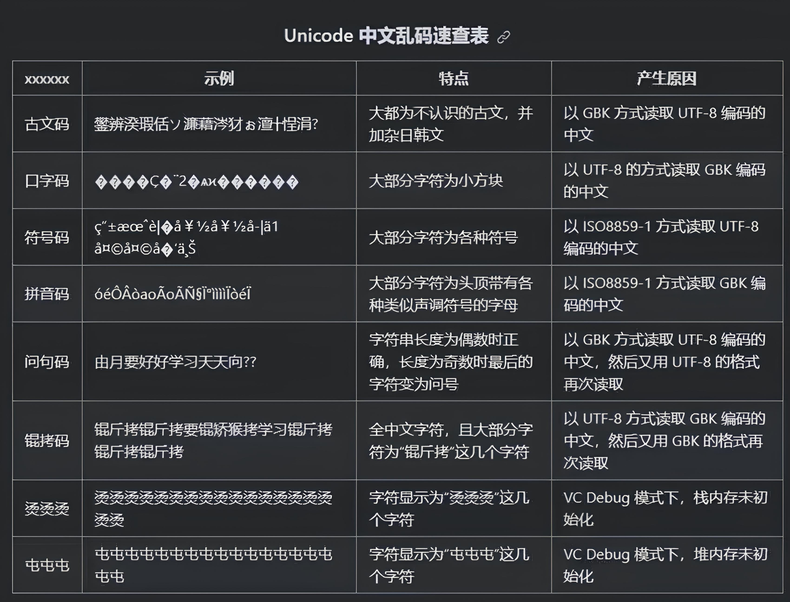
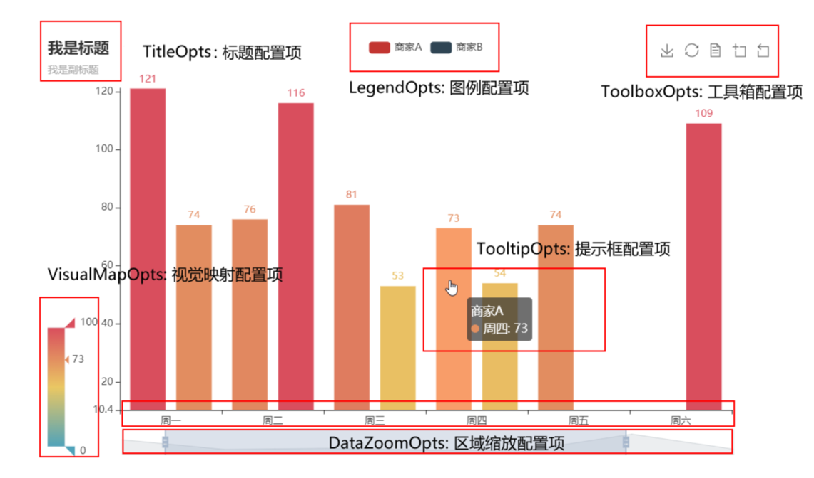
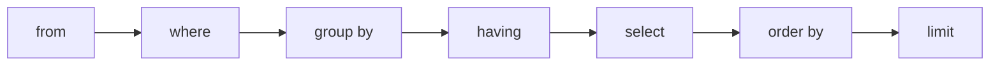
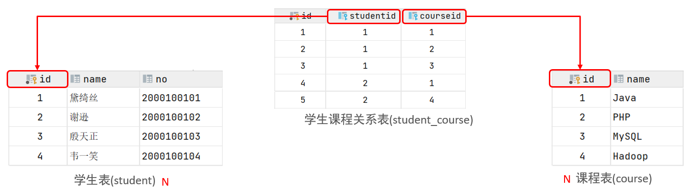

# python 基础

## 1 字面量和变量

字面量：在代码中，被写下来的固定的值（数据），值的常用类型为 整数（int），浮点数（float），字符串（string）

变量：用于存储程序运行时计算结果和值，==没有变量的类型，但存储的值有类型==（与c++，Java不同）

| 类型               | 描述                                                         | 说明                                                |
| ------------------ | ------------------------------------------------------------ | --------------------------------------------------- |
| 数字（Number）     | 整数（int）                                                  | 如：10、-10                                         |
| 数字（Number）     | 浮点数（float）                                              | 如：13.14、-13.14                                   |
| 数字（Number）     | 复数（complex）                                              | 如：4+3j，以j结尾表示复数                           |
| 数字（Number）     | 布尔（bool）                                                 | 表达现实生活中真和假的逻辑，True表示真，False表示假 |
|                    |                                                              |                                                     |
| 字符串（String）   | True本质上是一个数字记作1，False记作0  描述文本的一种数据类型 | 字符串（string）由任意数量的字符组成                |
| 列表（List）       | 有序的可变序列                                               | Python中使用最频繁的数据类型，可有序记录一堆数据    |
| 元组（Tuple）      | 有序的不可变序列                                             | 可有序记录一堆不可变的Python数据集合                |
| 集合（Set）        | 无序不重复集合                                               | 可无序记录一堆不重复的Python数据集合                |
| 字典（Dictionary） | 无序Key-Value集合                                            | 可无序记录一堆Key-Value型的Python数据集合           |


### 1.1 type()

可以使用 `type()` 函数来获取变量中存储的值或单独的值的类型，返回 `type` 类型的值


**例：**

```py
# 定义值的类型并储存
int_value = 1
float_value = 1.0
str_value = "hello"

# 打印值的大小
print(int_value)
print(float_value)
print(str_value)
"""
1
1.0
hello
"""

# 打印值的类型
print(type(int_value))
print(type(float_value))
print(type(str_value))
"""
<class 'int'>
<class 'float'>
<class 'str'>
"""

# 打印 type() 函数的返回类型
print(type(type(int_value)))
"""
<class 'type'>
"""
```


### 1.2 强制类型转换

任何变量都可以通过 `str()` 转换为字符串

只有数字的字符串可以用 `int()`

数字中有小数点的还可以用 `float()` 进行转换


**例：**

```py
# 变量赋值
int_value = 1
float_value = 1.1
str1_value = "1.23"
str2_value = "1"
str3_value = "string"

# int 转 float , string
print(int_value, float(int_value))
print(int_value, str(int_value))
"""
1 1.0
1 1
"""

# float 转 int , string
print(float_value, int(float_value))
print(float_value, str(float_value))
"""
1.1 1
1.1 1.1
"""

# string 转 int , float
print(str1_value, float(str1_value))
print(str2_value, int(str2_value))
print(str2_value, float(str2_value))
"""
1.23 1.23
1 1
1 1.0
"""

# print(str1_value, int(str1_value))
# print(str3_value, float(str3_value))
# print(str3_value, int(str3_value))
```


## 2 运算符

数学运算符

| 运算符 | 描述   | 实例                                                         |
| ------ | ------ | ------------------------------------------------------------ |
| +      | 加     | 两个对象相加  a + b 输出结果  30                             |
| -      | 减     | 得到负数或是一个数减去另一个数  a - b 输出结果  -10          |
| *      | 乘     | 两个数相乘或是返回一个被重复若干次的字符串  a * b 输出结果  200 |
| /      | 除     | b /  a 输出结果 2                                            |
| //     | 取整除 | 返回商的整数部分  9//2 输出结果  4 , 9.0//2.0 输出结果  4.0  |
| %      | 取余   | 返回除法的余数  b % a 输出结果  0                            |
| **     | 指数   | a**b  为10的20次方，  输出结果 100000000000000000000         |


赋值运算符

| **运算符** | **描述**   | **实例**                                                     |
| ---------- | ---------- | ------------------------------------------------------------ |
| =          | 赋值运算符 | 把 =  号右边的结果 赋给 左边的变量，如 num  = 1 + 2 * 3，结果num的值为7 |


**复合赋值运算符**

| **运算符** | **描述**         | **实例**                    |
| ---------- | ---------------- | --------------------------- |
| +=         | 加法赋值运算符   | c  += a 等效于 c =  c + a   |
| -=         | 减法赋值运算符   | c  -= a 等效于 c =  c - a   |
| *=         | 乘法赋值运算符   | c  *= a 等效于 c =  c * a   |
| /=         | 除法赋值运算符   | c  /= a 等效于 c =  c / a   |
| %=         | 取模赋值运算符   | c  %= a 等效于 c =  c % a   |
| **=        | 幂赋值运算符     | c  **= a 等效于 c =  c ** a |
| //=        | 取整除赋值运算符 | c  //= a 等效于 c =  c // a |


**例：**

```py
# 变量赋值
int1 = 5
int2 = 3
float1 = 3.14
float2 = 1.41

# int 之间的运算
print("int1+int2", int1 + int2)
print("int1-int2", int1 - int2)
print("int1*int2", int1 * int2)
print("int1/int2", int1 / int2)
print("int1%int2", int1 % int2)
print("int1//int2", int1 // int2)
print("int1**int2", int1 ** int2)
"""
int1+int2 8
int1-int2 2
int1*int2 15
int1/int2 1.6666666666666667
int1%int2 2
int1//int2 1
int1**int2 125
"""

# float 之间的运算, float 没有 % 运算
print("float1+float2", float1 + float2)
print("float1-float2", float1 - float2)
print("float1*float2", float1 * float2)
print("float1/float2", float1 / float2)
print("float1//float2", float1 // float2)
print("float1**float2", float1 ** float2)
print("float1//float2", float1 // float2)
"""
float1+float2 4.55
float1-float2 1.7300000000000002
float1*float2 4.4274
float1/float2 2.2269503546099294
float1//float2 2.0
float1**float2 5.019619569618424
float1//float2 2.0
"""
# print("float1%float2", float1%float2)
```


## 3 字符串

### 3.1 定义

字符串在Python中有多种定义形式

1. 单引号定义法：`name = '黑马程序员'`
2. 双引号定义法：`name = "黑马程序员"`

3. 三引号定义法：`name = """黑马程序员"""`


注意：

* 三引号定义法，和多行注释的写法一样，同样支持换行操作

    使用变量接收它，它就是字符串；不使用变量接收它，就可以作为多行注释使用

* 单引号中可以使用双引号，双引号中可以使用单引号

    单（双）引号中要使用单（双）引号需要用 `\` 解引用 


**例：**

```py
# 三种字符串
print('string')
print("string")
print("""string""")
print("""
string""")
"""
string
string
string

string
"""

# 在字符串内 包含引号
print('"string"')
print("'string'")
print("\"string\"")
print('\'string\'')
"""
"string"
'string'
"string"
'string'
"""
```


### 3.2 用法

1. 拼接：`str3 = str1 + str2`

    使用 `+` 将两个字符串拼接到一起

2. 占位：`"hello %s" % "world"`

    `int` 占位符为 `%d`；`float` 占位符为 `%f`；`float` 占位符为 `%s`

    控制精度的原理和 `c` 相同

    使用多个占位符的话需要用 `()` 包含在内

3. 格式化：`f"How are {str}?"`

    `{}` 内可以存放任何类型的值，且将其转换为字符串类型


**例：**

```py
# 拼接
str1 = "hello "
str2 = "world!"
str3 = str1 + str2
print(str1)
print(str2)
print(str3)
"""
hello 
world!
hello world!
"""

# 占位
str4 = "%sworld!" % str1
str5 = "hello %s" % str2
print(str4)
print(str5)
print("%s" % str3)
"""
hello world!
hello world!
hello world!
"""

# %d %f
print("%d + %d = %d" % (1, 2, 1 + 2))
print("%f + %f = %f" % (1.1, 2.2, 1.1 + 2.2))
"""
1 + 2 = 3
1.100000 + 2.200000 = 3.300000
"""

# 格式化
str6 = "you"
str7 = "How"
str8 = f"How are {str6}?"
print(f"{str7} are {str6}?")
print(str8)
"""
How are you?
How are you?
"""
```


### 3.3 常用方法

| **操作**                             | **说明**                                                     |
| ------------------------------------ | ------------------------------------------------------------ |
| 字符串[下标]                         | 根据下标索引取出特定位置字符                                 |
| 字符串.index(字符串）                | 查找给定字符的第一个匹配项的下标                             |
| 字符串.replace(字符串1, 字符串2)     | 将字符串内的全部字符串1，替换为字符串2  不会修改原字符串，而是得到一个新的 |
| 字符串.split(字符串)                 | 按照给定字符串，对字符串进行分隔  不会修改原字符串，而是得到一个新的列表 |
| 字符串.strip()  字符串.strip(字符串) | 移除首尾的空格和换行符或指定字符串                           |
| 字符串.count(字符串)                 | 统计字符串内某字符串的出现次数                               |
| len(字符串)                          | 统计字符串的字符个数                                         |


**例：**

```py
# 初始化字符串
my_string = "  Hello, world!  Hello, Python!  "

# 根据下标索引取出特定位置字符
print(my_string[6]) # 获取下标为6的字符  o

# index()：查找给定字符的第一个匹配项的下标
print(my_string.index("Hello")) # 查找第一个"Hello"的位置  2

# replace()：将字符串内的全部字符串1，替换为字符串2
print(my_string.replace("Hello", "Hi")) # 替换 "Hello" 为 "Hi" 
#   Hi, world!  Hi, Python!  

# split()：按照指定字符进行分隔
print(my_string.split(",")) # 按照逗号分隔
# ['  Hello', ' world!  Hello', ' Python!  ']

# strip()：移除首尾的空格和换行符
print(my_string.strip())    # 移除首尾空格
# Hello, world!  Hello, Python!

# count()：统计字符串内某字符串的出现次数
print(my_string.count("Hello")) # 统计"Hello"出现的次数  2

# len()：统计字符串的字符个数
print(len(my_string))   # 获取字符串的长度  33
```

注意：

* 字符串容器可以容纳的类型是单一的，只能是字符串类型
* ==**字符串不可修改**==（与 c++／Java 不同）


## 4 输入输出

### 4.1 print()

`print()` 作用是输出括号内表达式或变量的值


**例：**

```py
int_val = 100
float_val = 3.14
str_val = "hello"
print(int_val)
print(float_val)
print(str_val)
"""
100
3.14
hello
"""

print(100)
print(3.14)
print("hello")
"""
100
3.14
hello
"""
```


### 4.2 input()

`intput()` 作用是从键盘获得一个字符串，括号内的内容会将等同于 `print()` 的输出


**例：**

```py
string_value = input("请输入一个字符串 ")
print(string_value)
"""
请输入一个字符串 hello world
hello world
"""

print(input("请在输入一个字符串 "))
"""
请在输入一个字符串 hello world
hello world
"""
```


## 5 判断和循环

### 5.1 bool

布尔 `bool` 表达现实生活中的逻辑，即真和假

* `True`表示真（c++中是 `true`）
* `False`表示假（c++中是 `false`）

`True` 本质上是一个数字记作 `1`，`False` 记作 `0`


### 5.2 比较运算符

| **运算符** | **描述**                                                     | **示例**                            |
| ---------- | ------------------------------------------------------------ | ----------------------------------- |
| ==         | 判断内容是否相等，满足为True，不满足为False                  | 如 a=3，b=3，则 (a  == b)  为  True |
| !=         | 判断内容是否不相等，满足为True，不满足为False                | 如 a=1，b=3，则 (a  != b) 为  True  |
| >          | 判断运算符左侧内容是否大于右侧  满足为True，不满足为False    | 如 a=7，b=3，则 (a  > b)  为 True   |
| <          | 判断运算符左侧内容是否小于右侧  满足为True，不满足为False    | 如 a=3，b=7，则 (a  < b)  为 True   |
| >=         | 判断运算符左侧内容是否大于等于右侧  满足为True，不满足为False | 如 a=3，b=3，则 (a  >= b) 为  True  |
| <=         | 判断运算符左侧内容是否小于等于右侧  满足为True，不满足为False | 如 a=3，b=3，则 (a  <= b) 为  True  |


### 5.3 if elif else语句

注意事项：

* python 中的 `else if` 被 `elif` 取代，并且不在用 `{}` 表示作用域，==需在前方填充4个空格的缩进（不可省略）==，python通过缩进判断代码块的归属关系
* python 中的判断条件不需要用 `()` 包裹，直接跟在关键字后面，且结束时需要加 `:`

 


**例：**

```py
# 判断语句实现
int_value = 5
if int_value < 0:
    print("int_value 小于 0")
    if int_value % 2 == 0:
        print("int_value 是偶数")
    else:
        print("int_value 是奇数")
elif int_value == 0:
    print("int_value 等于 0")
    print("int_value 是偶数")
else :
    print("int_value 大于 0")
    if int_value % 2 == 0:
        print("int_value 是偶数")
    else:
        print("int_value 是奇数")
```


### 5.4 while循环

和判断语句一样，判断条件不用  `()` 包裹，直接跟在关键字后面，并在结束时加 `:`


**例：**

```py
# while循环实现
i = 1
while i <= 9:
    j = 1
    while j <= i:
        print(f"{j}*{i}={i*j}", end="\t")
        j += 1
    print()
    i += 1
"""
1*1=1	
1*2=2	2*2=4	
1*3=3	2*3=6	3*3=9	
1*4=4	2*4=8	3*4=12	4*4=16	
1*5=5	2*5=10	3*5=15	4*5=20	5*5=25	
1*6=6	2*6=12	3*6=18	4*6=24	5*6=30	6*6=36	
1*7=7	2*7=14	3*7=21	4*7=28	5*7=35	6*7=42	7*7=49	
1*8=8	2*8=16	3*8=24	4*8=32	5*8=40	6*8=48	7*8=56	8*8=64	
1*9=9	2*9=18	3*9=27	4*9=36	5*9=45	6*9=54	7*9=63	8*9=72	9*9=81	
"""
```


### 5.5 for循环

python中的 `for` 循环是一种**轮询**机制，是对一批内容进行**逐个处理**，类似 c++ 中的高级 `for`

语法：

```py
for 临时变量 in 待处理数据集:
	循环满足条件时执行的代码
```

其中的待处理数据集，严格来说，称之为：可迭代类型

可迭代类型指，**其内容可以一个个依次取出的一种类型**，包括：字符串，列表，元组等


**例：**

```py
# for循环实现
name = "hello"
for x in name:
    print(x)
"""
h
e
l
l
o
"""
```

注意：

* `for` 循环无法定义循环条件，只能被动取出数据处理

* `for` 循环中的临时变量，其作用域限定为循环内

    是编程规范的限定，而非强制限定，不遵守也能正常运行，但是不建议这样做

    如需访问临时变量，可以预先在循环外定义它


### 5.6 range()

range语句的作用是获得一个简单的数字序列

构造函数：

* `range(num)` 

    获取一个从0开始，到 `num` 结束的数字序列（不含 `num` 本身）

    如 `range(5)` 取得的数据是：`[0, 1, 2, 3, 4]`

* `range(num1, num2)`

    获得一个从 `num1` 开始，到 `num2` 结束的数字序列（不含 `num2` 本身）

    如，`range(5, 10)` 取得的数据是：`[5, 6, 7, 8, 9]`

* `range(num1, num2, step)`

    获得一个从 `num1` 开始，到 `num2` 结束的数字序列（不含 `num2` 本身）

    数字之间的步长，以 `step` 为准（`step` 默认为1）

    如，`range(5, 10, 2)` 取得的数据是：`[5, 7, 9]`


**例：**

```py
# range实现
for x in range(2, 11, 2):
    print(x)
"""
2
4
6
8
10
"""
```


### 5.7 中断

continue：中断本次循环，直接进入下一次循环

break：直接结束所在循环

和 c++／java 的唯一区别是不用加 `;`


**例：**

```py
# 中断实现
for i in range(1, 7):
    if i == 3:
        continue
    if i == 5:
        break
    print(i)
"""
1
2
4
"""
```


## 6 函数

### 6.1 函数实现

语法：

```py
def 函数名(传入参数1, 传入参数2, 传入参数3...): # python没有函数类型
    函数体
    return 返回值
```

注意：

* 参数不需要，可以省略；返回值不需要，可以省略（返回 `None` 类型）
* 先定义函数（定义在调用上方），后调用函数


**例：**

```py
# 函数案例1
def add(num1, num2):
    return num1 + num2

print(add(1, 2))    # 3

# 函数案例2
def hello():
    print("Hello world!")

print(type(hello()))
"""
Hello world!
<class 'NoneType'>
"""
```


### 6.2 局部变量和全局变量

局部变量：在函数体内部，临时保存数据，即当函数调用完成后，则销毁局部变量

全局变量：指的是在函数体内、外都能生效的变量，使用 `global` 关键字 可以在函数内部声明变量为全局变量


**例：**

```py
# global 的使用

def func():
    global num1, num2
    num1 = int(input("给num1赋值: "))
    num2 = int(input("给num2赋值: "))

func()
print(f"{num1} + {num2} = {num1 + num2}")
"""
给num1赋值: 1
给num2赋值: 2
1 + 2 = 3
"""
```


### 6.3 多个返回值

如果一个函数要有多个返回值，该如何书写代码？


**例：**

```py
def test():
    return 1, 2

x, y = test()
print(x, y)  # 1 2
```


### 6.4 缺省参数

缺省参数也叫默认参数，用于定义函数，为参数提供默认值，调用函数时可不传该默认参数的值

注意：

* 所有位置参数必须出现在默认参数前，包括函数定义和调用
* 函数调用时，如果为缺省参数传值则修改默认参数值，否则使用这个默认值


**例：**

```py
def print_info(name, age, sex='男'):
    print(f"我是{name}, 今年{age}岁, 性别{sex}")

print_info('Tom', 18)
# 我是Tom, 今年18岁, 性别男

print_info('Rose', 22, '武装直升机')
# 我是Rose, 今年22岁, 性别武装直升机
```


### 6.5 位置传递

`*args` 语法用来接收任意数量的位置参数，它将传入的参数以元组的形式储存


例：

```py
def user_info(*args):
    print(args)

user_info('TOM')    # ('TOM',)
user_info('TOM', 18)    # ('TOM', 18)
```

在调用时传入了一个元素 ，这时 python 会将该元素放进一个元组中，元组的格式是 `(元素,)`

也就是一个元素后面会跟一个逗号来表示它是一个单元素元组，而不是一个括号中的普通表达式


### 6.6 关键字传递

参数是 `"键=值"` 形式的形式的情况下, 所有的 `"键=值"` 都会被 `kwargs` 接受, 同时会根据 `"键=值"` 组成字典


**例：**

```py
def user_info(**kwargs):
    print(kwargs)

user_info(name='TOM', age=18, id=110)
# {'name': 'TOM', 'age': 18, 'id': 110}
```


### 6.7 函数作为参数传递

函数本身是可以作为参数，传入另一个函数中进行使用的

将函数传入的作用在于：传入计算逻辑，而非传入数据


**例：**

```py
def add(a, b):
    return a + b

def operate(func, x, y):
    return func(x, y)

print(operate(add, 5, 3))   # 将 add 函数传入 operate 函数中用于计算
```


### 6.8 lambda匿名函数

函数的定义中：

* `def` 关键字，可以定义带有名称的函数

* `lambda` 关键字，可以定义匿名函数（无名称）

有名称的函数，可以基于名称重复使用；**无名称的匿名函数，只可临时使用一次**


匿名函数定义语法：`lambda 传入参数:函数体(一行代码)`

* `lambda` 是关键字，表示定义匿名函数
* 传入参数表示匿名函数的形式参数，如：x，y 表示接收 2 个形式参数
* 函数体，就是函数的执行逻辑，要注意：只能写一行，无法写多行代码


**例：**

```py
# 使用 lambda 表达式定义一个匿名函数，计算两数之和
add = lambda a, b: a + b

# 调用该函数
print(add(5, 3))    # 8
print(add(7, 4))    # 11
```

注意：将 `lambda`  的结果赋给一个变量后，可以重复使用该函数（变量有名称）


## 7 数据容器

数据容器是一种可以存储多个元素的数据类型（数组）


### 7.1 list(列表)

列表内的每一个数据，称之为元素，以 `[]` 作为标识，且列表内每一个元素之间用，逗号隔开

```py
# 字面量
[元素1, 元素2, 元素3, 元素4, ...]
# 定义变量
变量名称 = [元素1, 元素2, 元素3, 元素4, ...]
# 定义空列表
变量名称 = []
变量名称 = list()
```


用法：

* 列表可以一次存储多个数据，且可以为不同的数据类型，支持嵌套

* 列表中的每一个元素，都有其位置下标索引，从前向后的方向，从 `0` 开始，依次递增

    按照下标索引，即可取得对应位置的元素

    可以反向索引，也就是从后向前：从 `-1` 开始，依次递减（`-1` 是最后一个元素，`-2` 是倒数第二个元素，以此类推）


**例：**

```py
list_value = ["str1", 'str2', 3, 4.0, True,[6,7,8]]
print(list_value)
print(type(list_value))
"""
['str1', 'str2', 3, 4.0, True, [6, 7, 8]]
<class 'list'>
"""

# 正序遍历
for item in list_value:
    print(item, type(item))
"""
str1 <class 'str'>
str2 <class 'str'>
3 <class 'int'>
4.0 <class 'float'>
True <class 'bool'>
[6, 7, 8] <class 'list'>
"""

# 倒序遍历
i = -1
while -i <= len(list_value):
    print(list_value[i], type(list_value[i]))
    i = i - 1
"""
[6, 7, 8] <class 'list'>
True <class 'bool'>
4.0 <class 'float'>
3 <class 'int'>
str2 <class 'str'>
str1 <class 'str'>
"""
```


常用方法：（方法即为成员函数）

| **使用方式**            | **作用**                                       |
| ----------------------- | ---------------------------------------------- |
| 列表.append(元素)       | 向列表中追加一个元素                           |
| 列表.extend(容器)       | 将数据容器的内容依次取出，追加到列表尾部       |
| 列表.insert(下标, 元素) | 在指定下标处，插入指定的元素                   |
| del 列表[下标]          | 删除列表指定下标元素                           |
| 列表.pop(下标)          | 删除列表指定下标元素                           |
| 列表.remove(元素)       | 从前向后，删除此元素第一个匹配项               |
| 列表.clear()            | 清空列表                                       |
| 列表.count(元素)        | 统计此元素在列表中出现的次数                   |
| 列表.index(元素)        | 查找指定元素在列表的下标  找不到报错ValueError |
| len(列表)               | 统计容器内有多少元素                           |


例：

```py
# 初始化一个列表
my_list = [1, 2, 3, 4, 5]
print(my_list)	# [1, 2, 3, 4, 5]

# append() 向列表中追加一个元素
my_list.append(6)
print(my_list)	# [1, 2, 3, 4, 5, 6]

# extend() 将另一个容器的内容追加到列表尾部
my_list.extend([7, 8])
print(my_list)	# [1, 2, 3, 4, 5, 6, 7, 8]

# insert() 在指定下标插入一个元素
my_list.insert(3, 99)  # 在下标3插入99
print(my_list)	# [1, 2, 3, 99, 4, 5, 6, 7, 8]

# del 删除指定下标的元素
del my_list[2]  # 删除下标2的元素
print(my_list)	# [1, 2, 99, 4, 5, 6, 7, 8]

# pop() 删除指定下标的元素
print(my_list.pop(4))   # 删除下标4的元素  5
print(my_list)	# [1, 2, 99, 4, 6, 7, 8]

# remove() 删除第一个匹配的指定元素
my_list.remove(99)  # 删除第一个匹配的99
print(my_list)	# [1, 2, 4, 6, 7, 8]

# clear() 清空列表
my_list.clear()
print(my_list)  # []

# count() 统计指定元素在列表中的出现次数
my_list = [1, 2, 2, 3, 3, 3]
count = my_list.count(3)  # 统计3的出现次数
print(count)    # 3

# index() 查找指定元素的下标
index = my_list.index(2)  # 查找左边第一个2的下标
print(index)    # 2

# len() 统计列表中元素的个数
length = len(my_list)
print(length)   # 6
```


### 7.2 tuple(元组)

元组同列表一样，都是可以封装多个、不同类型的元素在内，但元组一旦定义完成，就不可修改

所以，当我们需要在程序内封装数据，又不希望封装的数据被篡改，那么元组就非常合适了


定义元组使用小括号，且使用逗号隔开各个数据，数据可以是不同的数据类型

```py
# 字面量
(元素1, 元素2, 元素3, 元素4, ...)
# 定义变量
变量名称 = (元素1, 元素2, 元素3, 元素4, ...)
# 定义空元组
变量名称 = ()
变量名称 = tuple()
```

注意：当元组只有一个元素时需要在该元素后面加一个 `,`，即 `(元素,)`，来表示它是一个单元素元组


常用方法：

| **方法**  | **作用**                                           |
| --------- | -------------------------------------------------- |
| index()   | 查找某个数据，如果数据存在返回对应的下标，否则报错 |
| count()   | 统计某个数据在当前元组出现的次数                   |
| len(元组) | 统计元组内的元素个数                               |

注意：元组由于不可修改的特性，所以其操作方法非常少


**例：**

```py
# 初始化一个元组
my_tuple = (1, 2, 3, 4, 2, 5, 6, 2)
print(my_tuple) #(1, 2, 3, 4, 2, 5, 6, 2)

# index() 查找指定元素的下标
print(my_tuple.index(3))    # 查找3的下标  2

# count() 统计指定元素出现的次数
print(my_tuple.count(2))    # 统计2的出现次数  3

# len() 统计元组中元素的个数
print(len(my_tuple))    # 8
```


### 7.3 序列和切片

序列是指：内容连续、有序，可使用下标索引的一类数据容器

列表、元组、字符串，均可以可以视为序列

序列支持切片，即：列表、元组、字符串，均支持进行切片操作


**切片**：从一个序列中，取出一个子序列

语法：`序列[起始下标:结束下标:步长]`

表示从序列中，从指定位置开始，依次取出元素，到指定位置结束，得到一个新序列

* 起始下标表示从何处开始，可以留空，留空视作从头开始

    结束下标（不含）表示何处结束，可以留空，留空视作截取到结尾

* 步长表示，依次取元素的间隔（默认为 `1`），步长 `N` 表示，每次跳过 `N-1` 个元素取（`1` 的步长即为取每个元素）

    步长为负数表示，反向取（注意，起始下标和结束下标也要反向标记）

注意：此操作不会影响序列本身，而是会得到一个新的序列（列表、元组、字符串）


**例：**

```py
# 正步长
my_list = [1, 2, 3, 4, 5]
new_list = my_list[1:4]  # 下标1开始，下标4（不含）结束，步长1
print(new_list)  # [2, 3, 4]

my_tuple = (1, 2, 3, 4, 5)
new_tuple = my_tuple[:]  # 从头开始，到最后结束，步长1
print(new_tuple)  # (1, 2, 3, 4, 5)

my_list = [1, 2, 3, 4, 5]
new_list = my_list[::2]  # 从头开始，到最后结束，步长2
print(new_list)  # [1, 3, 5]

my_str = "12345"
new_str = my_str[:4:2]  # 从头开始，到下标4（不含）结束，步长2
print(new_str)  # "13"


# 负步长
my_str = "12345"
new_str = my_str[::-1]  # 从头（最后）开始，到尾结束，步长-1（倒序）
print(new_str)  # "54321"

my_list = [1, 2, 3, 4, 5]
new_list = my_list[3:1:-1]  # 从下标3开始，到下标1（不含）结束，步长-1（倒序）
print(new_list)  # 结果：[4, 3]

my_tuple = (1, 2, 3, 4, 5)
new_tuple = my_tuple[:1:-2]  # 从头（最后）开始，到下标1(不含)结束，步长-2（倒序）
print(new_tuple)  # (5, 3)
```


### 7.4 set(集合)

集合和列表的区别是**不支持元素的重复（自带去重功能）**、且**内容无序**（因为要对元素做去重处理，所以无法保证顺序和创建的时候一致）


定义集合使用大括号 `{}`，且使用逗号隔开各个数据，数据可以是不同的数据类型，和列表一样可以修改元素

```py
# 字面量
{元素1, 元素2, 元素3, 元素4, ...}
# 定义变量
变量名称 = {元素1, 元素2, 元素3, 元素4, ...}
# 定义空集合
变量名称 = {}
变量名称 = set()
```


常用方法：

| 方法                           | 说明                                                        |
| ------------------------------ | ----------------------------------------------------------- |
| 集合.add(元素)                 | 集合内添加一个元素                                          |
| 集合.remove(元素)              | 移除集合内指定的元素                                        |
| 集合.pop()                     | 从集合中随机取出一个元素                                    |
| 集合.clear()                   | 将集合清空                                                  |
| 集合1.difference(集合2)        | 得到一个新集合，内含2个集合的差集  原有的2个集合内容不变    |
| 集合1.difference_update(集合2) | 在集合1中，删除集合2中存在的元素  集合1被修改，集合2不变    |
| 集合1.union(集合2)             | 得到1个新集合，内含2个集合的全部元素  原有的2个集合内容不变 |
| len(集合)                      | 得到一个整数，记录了集合的元素数量                          |


**例：**

```py
# 初始化两个集合
set1 = {1, 2, 3}
set2 = {3, 4, 5}

# add() 向集合添加一个元素
set1.add(6)
print(set1)  # {1, 2, 3, 6}

# remove() 移除集合内指定的元素
set1.remove(2)
print(set1)  # {1, 3, 6}

# pop() 从集合中随机取出一个元素
print(set1.pop())  # 1
print(set1)  # {3, 6}

# clear() 将集合清空
set3 = {7, 8, 9}
set3.clear()
print(set3)  # set()

# difference() 得到两个集合的差集（新集合）
print(set1.difference(set2))  # {6}

# difference_update() 删除集合2中存在的元素，修改集合1
set1.difference_update(set2)
print(set1)  # {6}

# union() 合并两个集合，得到新集合
print(set1.union(set2))  # {3, 4, 5, 6}

# len() 得到集合的元素数量
print(len(set1))  # 1
```

注意：集合不能使用 `[]` 获取元素


### 7.5 dict(字典、映射)

字典的定义，同样使用 `{}`，不过存储的元素是一个个的键值对（c++ 中的 `map` 容器）


语法：

* 使用 `{}` 存储原始，每一个元素是一个键值对
* 每一个键值对包含 `Key` 和 `Value`（用冒号分隔）
* 键值对之间使用 `:` 分隔
* `Key` 和 `Value` 可以是任意类型的数据（`Key` 不可为字典，但 `Value` 可以为字典）
* `Key` 不可重复，重复会对原有数据覆盖

```py
# 定义字典字面量
{key: value, key: value, ..., key: value}
# 定义字典变量
my_dict = {key: value, key: value, ..., key: value}

# 定义空字典
my_dict = {}
my_dict = dict()
```

注意：`dict` 不能通过下标来获得元素，但可以通过 `[]` 用 `Key` 来获得对应元素


常用方法：

| 操作              | 说明                                          |
| ----------------- | --------------------------------------------- |
| 字典[Key]         | 获取指定Key对应的Value值                      |
| 字典[Key] = Value | 添加或更新键值对                              |
| 字典.pop(Key)     | 取出Key对应的Value并在字典内删除此Key的键值对 |
| 字典.clear()      | 清空字典                                      |
| 字典.keys()       | 获取字典的全部Key，可用于for循环遍历字典      |
| len(字典)         | 计算字典内的元素数量                          |


**例：**

```py
# 初始化字典
my_dict = {"a": 1, "b": 2, "c": 3}
print(my_dict)  # {'a': 1, 'b': 2, 'c': 3}

# 字典[Key] = Value 添加或更新键值对
my_dict["d"] = 4  # 添加新键值对
my_dict["b"] = 5  # 更新键值对
print(my_dict)  # {'a': 1, 'b': 5, 'c': 3, 'd': 4}

# 字典[Key] 获取指定Key对应的Value值
print(my_dict["a"]) # 获取键"a"对应的值  1


# pop(Key) 取出Key对应的Value并删除此键值对
print(my_dict.pop("c")) # 删除键"c"对应的键值对，并获取值  3
print(my_dict)  # {'a': 1, 'b': 5, 'd': 4}

# clear() 清空字典
my_dict.clear()
print(my_dict)  # {}

# 字典.keys() 获取字典的全部Key
my_dict = {"x": 10, "y": 20, "z": 30}
print(my_dict.keys())   # 获取所有键
# dict_keys(['x', 'y', 'z'])

# len() 计算字典内的元素数量
print(len(my_dict)) # 计算字典元素个数  3
```


### 7.6 通用方法

通用方法是指列表，元组，集合，字符串，字典都可以使用的方法

| 方法                         | **描述**                                                     |
| ---------------------------- | ------------------------------------------------------------ |
| max()                        | 容器内最大元素                                               |
| min()                        | 容器内最小元素                                               |
| len()                        | 容器元素个数                                                 |
| list()                       | 转换为列表                                                   |
| tuple()                      | 转换为元组                                                   |
| str()                        | 转换为字符串                                                 |
| set()                        | 转换为集合                                                   |
| sorted(序列, [reverse=True]) | 排序，reverse 表示两个数据的比较结果，默认为升序 ( reverse = True表示降序 ) |

注意：`sorted` 函数中 `reverse` 参数不是第二个参数，不能用位置参数，用关键字参数直接指定


**例：**

```py
# 初始化容器
my_list = [5, 3, 9, 1, 7]

# max() 容器内最大元素
print(max(my_list)) # 9

# min() 容器内最小元素
print(min(my_list)) # 1

# len() 容器元素个数
print(len(my_list))# 5

# list() 转换为列表
my_tuple = (8, 4, 6)
print(list(my_tuple))   # [8, 4, 6]

# tuple() 转换为元组
list_from_set = [1, 2, 3]
print(tuple(list_from_set)) # (1, 2, 3)

# str() 转换为字符串
num = 123
print(str(num)) # 123

# set() 转换为集合
list_with_duplicates = [1, 2, 2, 3, 3]
print(set(list_with_duplicates))    # {1, 2, 3}

# sorted() 排序（默认升序）
print(sorted(my_list))  # [1, 3, 5, 7, 9]

# sorted() 排序（降序）
print(sorted(my_list, reverse=True))    # [9, 7, 5, 3, 1]
```


### 7.7 总结

|          | **列表**                         | **元组**                           | **字符串**         | **集合**               | **字典**                                  |
| -------- | -------------------------------- | ---------------------------------- | ------------------ | ---------------------- | ----------------------------------------- |
| 元素数量 | 支持多个                         | 支持多个                           | 支持多个           | 支持多个               | 支持多个                                  |
| 元素类型 | 任意                             | 任意                               | 仅字符             | 任意                   | Key：除字典外任意类型     Value：任意类型 |
| 下标索引 | 支持                             | 支持                               | 支持               | 不支持                 | 不支持                                    |
| 重复元素 | 支持                             | 支持                               | 支持               | 不支持                 | 不支持                                    |
| 可修改性 | 支持                             | 不支持                             | 不支持             | 支持                   | 支持                                      |
| 数据有序 | 是                               | 是                                 | 是                 | 否                     | 否                                        |
| 使用场景 | 可修改、可重复的一批数据记录场景 | 不可修改、可重复的一批数据记录场景 | 一串字符的记录场景 | 不可重复的数据记录场景 | 以Key检索Value的数据记录场景              |


#  python 进阶

## 1 文件操作

### 1.1 文件打开与关闭

编码技术：翻译的规则，记录了如何将内容翻译成二进制，以及如何将二进制翻译回可识别内容


计算机中有许多可用编码：`UTF-8`，`GBK`，`Big5` 等

`UTF-8` 是目前全球通用的编码格式除非有特殊需求，否则，一律以 `UTF-8` 格式进行文件编码即可

 


对文件的基本操作，可以分为三个步骤：打开文件，读写文件，关闭文件


相关方法：

1. 开：

    * `open(name, mode, encoding)`

        name：是要打开的目标文件名的字符串（可以包含文件所在的具体路径）

        mode：设置打开文件的模式（访问模式）：只读、写入、追加等

        | 模式 | 描述                                                         |
        | ---- | ------------------------------------------------------------ |
        | r    | 以只读方式打开文件，文件的指针将会放在文件的开头（这是默认模式 ） |
        | w    | 打开一个文件只用于写入（如果该文件已存在则打开文件，并从开头开始编辑，原有内容会被删除；如果该文件不存在，创建新文件） |
        | a    | 打开一个文件用于追加（如果该文件已存在，新的内容将会被写入到已有内容之后；如果该文件不存在，创建新文件进行写入） |

        encoding：编码格式（推荐使用UTF-8）,`encoding` 的顺序不是第三位，所以不能用位置参数，用关键字参数直接指定

    * `with open` 语法

        在操作完成后自动关闭 `close` 文件，避免遗忘

```py
f = open('python.txt', 'r', encoding="UTF-8")

with open("python.txt", "r") as f:
    f.readlines()
# 通过在 with open 的语句块中对文件进行操作
```

2. 读：

    * read()：`文件对象.read(num)`

        `num` 表示要从文件中读取的数据的长度（单位是字节），如果没有传入num，那么就表示读取文件中所有的数据

    * readlines()：`文件对象.readlines()`

        `readlines` 可以按照行的方式把整个文件中的内容进行一次性读取，并且返回的是一个列表，其中每一行的数据为一个元素

    * 循环读取：

```py
for line in open("python.txt", "r"):
    print(line)

# 每一个line临时变量,就记录了文件的一行数据
```

3. 关：close()：`文件对象.close()`

    注意：关闭文件对象，也就是关闭对文件的占用（如果不调用 `close`，同时程序没有停止运行，那么这个文件将一直被 python 程序占用）


**例：**

```py
with open("python.txt", "r") as f:
    print(f.readlines())
# ['Hello world!\n', 'And hello python!']

f = open('python.txt', 'r', encoding="UTF-8")
print(f.readlines())
# ['Hello world!\n', '\n', 'And hello python!']
f.close()

f = open('python.txt', 'r', encoding="UTF-8")
for line in f:
    print(line)
"""
Hello world!

And hello python!
"""
# Hello world! 与 And hello python! 之间的空行是由 print自带的换行和文本的换行共同作用的
f.close()
```


### 1.2 文件的写入

写入方式：write()：`文件对象.write(写入内容)` （写入内容必须为字符串）


打开方式：

* 写入 `f = open('python.txt', 'w')`

    * 文件如果不存在，使用 `"w"` 模式，会创建新文件

    * 文件如果存在，使用 `"w"` 模式，会将原有内容清空

* 追加 `f = open('python.txt', 'a')`

    * `a` 模式，文件不存在会创建文件
    * `a` 模式，文件存在会在最后，追加写入文件


注意：

* 直接调用 `write`，内容并未真正写入文件，而是会积攒在程序的内存中，称之为缓冲区
* 当调用 `flush` 的时候，内容会真正写入文件
* 这样做是避免频繁的操作硬盘，导致效率下降（攒一堆，一次性写磁盘）


**例：**

```py
f = open('python.txt', 'w')
f.write('Hello world!')
f.flush()
f.close()

f = open('python.txt', 'r')
for line in f:
    print(line)
# Hello world!
f.close()

f = open('python.txt', 'a')
f.write('And hello python!')
# f.write(2025)
f.flush()
f.close()

f = open('python.txt', 'r')
for line in f:
    print(line)
# Hello world!And hello python!
# 不会自动加换行符
f.close()
```


## 2 异常

当检测到一个错误时，python解释器就无法继续执行了，反而出现了一些错误的提示，这就是所谓的**异常**, 也就是我们常说的 `bug`


### 2.1 捕获异常语法

捕获异常：对可能出现的 `bug`，进行提前准备、提前处理

作用：提前假设某处会出现异常，做好提前准备，当真的出现异常的时候，可以有后续手段

语法：

```py
try:
    可能发生错误的代码
except:
    如果出现异常执行的代码
```


其他情况：（为了简洁方便，省略 `try`）

1. 捕获指定异常：`except 异常类型 as e:`

**例：**

```py
try:
    print(name)
except NameError:
    print('name变量名称未定义错误')
```

注意：如果尝试执行的代码的异常类型和要捕获的异常类型不一致，则无法捕获异常


2. 捕获多个异常：`except (异常类型1, 异常类型2):`

    当捕获多个异常时，可以把要捕获的异常类型的名字，放到 `except` 后，并使用元组的方式进行书写

**例：**

```py
try:
    print(1 / 0)
except (NameError, ZeroDivisionError):
    print('0不能做除数!!!')
```


3. 捕获异常并输出描述信息：`except 异常类型 as e:` 或 `except (异常类型1, 异常类型2, ...) as e:`

**例：**

```py
try:
    print(num)
except (NameError, ZeroDivisionError) as e:
    print(e)
# name 'num' is not defined
```


4. 捕获所有异常：`except Exception as e:`

**例：**

```py
try:
    print(1 / 0)
except Exception as e:
    print(e)
# division by zero
```


### 2.2 捕获异常的结构

else ：表示的是如果没有异常要执行的代码

finally ：表示的是无论是否异常都要执行的代码

注意：一般 `try` 下方只放一行尝试执行的代码（可以放多行，但不建议）


**例：**

```py
try:
    f = open('test.txt', 'r')
except Exception as e:
    f = open('test.txt', 'w')
else:
    print('没有任何异常')
finally:
    f.close()
```


### 2.3 异常的传递性

异常的传递性：

当函数 `func01` 中发生异常，并且没有捕获处理这个异常的时候，异常会传递到函数 `func02`

当 `func02` 也没有捕获处理这个异常的时候，`main` 函数会捕获这个异常


注意：当所有函数都没有捕获异常的时候，程序就会报错


## 3 模块和包

模块：是一个 python 文件，以 `.py` 结尾，模块能定义函数，类和变量，模块里也能包含可执行的代码（相当于 c++ 的头文件）


### 3.1 导入

导入语法：`[from 模块名] import [模块 | 类 | 变量 | 函数 |*] [as 别名]`

常用组合形式：

1. `import 模块名` （省略 `from`）

    可以一次导入两个模块 `import 模块名1, 模块名2`

    调用模块功能：`模块名.功能名()`

**例：**

```py
import time  # 导入时间模块

print("开始")
time.sleep(1)  # 让程序睡眠1秒(阻塞)
print("结束")
```


2. `from 模块名 import 类, 变量, 方法等`

    调用模块功能：`功能名()` （相当于设置了命名空间，但可以用 `from` 导入多个模块）

**例：**

```py
from time import sleep  # 导入时间模块中的sleep方法

print("开始")
sleep(1)  # 让程序睡眠1秒(阻塞)
print("结束")
```


3. `from 模块名 import *`

    导入模块中所有的方法，调用方法和上述一样，不需要声明功能所在模块

**例：**

```py
from time import *  # 导入时间模块中的所有方法

print("开始")
sleep(1)  # 让程序睡眠1秒(阻塞)
print("结束")
```


4. `import 模块名 as 别名`／`from 模块名 import 功能名 as 别名`

    给模块或功能起一个其他的名字（相当于 c++ 中的 `define` 或 `&`）

**例：**

```py
# 模块别名
import time as T
T.sleep(2)
print('Hello world!')

# 功能别名
from time import sleep as sl
sl(2)
print('Hello world!')
```


### 3.2 自定义模块

在相同目录下创建一个 `.py` 文件，该文件可以被作为包导入代码中

 


注意：当导入多个模块的时候，且模块内有同名功能时，调用这个同名功能会调用到后面导入的模块功能


内置变量（c++ 中的宏）：

1. `__name__` 

    python 文件被直接运行，`__name__` 的值会被设置为字符串 `"__main__"`

    如果被作为模块导入到另一个脚本中，`__name__` 的值会是该模块的名称

**例：**

```py
import func

print(__name__)
func.my_print()	# 在 func 中使用 print(__name__)
"""
__main__
func
"""
```


2. `__all__`

如果一个模块文件中有 `__all__` 变量，当使用 `from xxx import *` 导入时，只能导入这个列表中的元素

**例：**

```py
"""
__all__ = ['add', 'sub', 'mul']
def add(a, b):
    return int(a + b)
def sub(a, b):
    return int(a - b)
def mul(a, b):
    return int(a * b)
def div(a, b):
    return int(a / b)
"""
from func import *

print(add(3, 2))
print(sub(3, 2))
print(mul(3, 2))
# print(div(3,2))
```


### 3.3 包

包的本质就是一个文件夹，在该文件夹下包含了一个 `__init__.py` 文件，该文件夹可用于包含多个模块文件

当我们的模块文件越来越多时，包可以帮助我们管理这些模块，包的作用就是包含多个模块，但包的本质依然是模块


 


安装第三方包，需要在终端输入 `pip install 包名称`，第三方包可能通过 `pip` 下载后 `pycharm` 无法使用，需要在 `pycharm` 中单独添加


**例：**

```sh
pip install 包名称		# 安装包
pip uninstall 包名称	# 卸载包
```


  


 


导入方式：`import 包名.模块名`
使用方式：`包名.模块名.函数`


**例：**

```py
import my_package.module1
import my_package.module2

"""
def func(a, b):
    return int(a + b)
"""
print(my_package.module1.func(3, 2))  # 5

"""
def func(a, b):
    return int(a - b)
"""
print(my_package.module2.func(3, 2))  # 1
```


包的 `__all__`

必须在 `__init__.py` 文件中添加 `__all__ = []`，控制允许导入的模块列表

注意： `__all__` 针对的是 `from ... import * ` 这种方式的，对 `import xxx` 这种方式无效


**例：**

```py
from my_package import *
"""
__init.py
__all__ = ['module1']
"""

print(module1.func(3, 2))
# print(module2.func(3, 2))
```


## 4 数据可视化

### 4.1 json

`json` 是一种轻量级的数据交互格式，可以按照 `json` 指定的格式去组织和封装数据

`json` 本质上是一个带有特定格式的字符串


主要功能：`json` 就是一种在各个编程语言中流通的数据格式，负责==不同编程语言中的数据传递和交互==


结构：

- `json` 是由键值对组成的对象和由元素组成的数组
- 键名必须是字符串类型，使用双引号包裹
- 键值可以是以下类型之一：字符串、数字、布尔值、数组、对象或 `null`

语法：

- 键名和字符串值都必须用双引号 `"` 括起来
- 键值对之间用冒号 `: ` 分隔
- 每个键值对之间用逗号 `,` 分隔
- 对象用大括号 `{}` 包裹，数组用中括号 `[]` 包裹。
- `json` 中不允许使用多余的逗号（即最后一个元素后面不能有逗号）


**例：**

```json
// 单个对象
{
    "name": "张三",
    "age": 25,
    "isStudent": false,
    "scores": [95, 88, 92],
    "address": {
        "city": "上海",
        "zip": "200000"
    },
    "phone": null
}

// 多个对象
[
    {
        "name": "张三",
        "age": 25,
        "isStudent": false,
        "scores": [95, 88, 92],
        "address": {
            "city": "上海",
            "zip": "200000"
        },
        "phone": null
    },
    {
        "name": "李四",
        "age": 30,
        "isStudent": true,
        "scores": [78, 85, 90],
        "address": {
            "city": "北京",
            "zip": "100000"
        },
        "phone": "123456789"
    }
]
```


### 4.2 数据转换

使用 `json` 模块，进行 `python` 数据和 `json` 数据间的转换

`dumps` 函数：将 `python` 数据转换为 `json` 数据

`loads` 函数：将 `json` 数据转换为 `python` 数据


**例：**

```py
# 导入json模块
import json

# 准备符合格式 (姓名,年龄) json 格式要求的 python 数据
data = [{"name": "老王", "age": 16}, {"name": "张三", "age": 20}]

# 通过 json.dumps(data) 方法把 python 数据转化为 json 数据
data = json.dumps(data)

# 通过 json.loads(data) 方法把json 数据转化为 python 数据
data = json.loads(data)
```


### 4.3 pyecharts

`pyecharts` 模块可以用来对数据进行可视化处理


在终端输入以下指令，安装 `pyecharts`

```sh
pip install pyecharts	# 安装后无法使用去 pycharm 中安装
```


`pyecharts` 模块中有很多的配置选项，常用到 2 个类别的选项：**全局配置选项**和**系列配置选项**


可以使用 `set_global_opts` 方法来配置全局配置选项（例如标题、工具提示、图例、坐标轴等）

```py
图形对象.set_global_opts(
    title_opts=opts.TitleOpts(标题属性),
    tooltip_opts=opts.TooltipOpts(提示框属性),
    legend_opts=opts.LegendOpts(图例属性),
    xaxis_opts=opts.AxisOpts(X 配置),
    yaxis_opts=opts.AxisOpts(Y 配置),
    datazoom_opts=opts.DataZoomOpts(缩放属性)
)
```


 


1. `title_opts` 用于设置图表的标题

    常用属性：

    * `title`：主标题文本
    * `subtitle`：副标题文本
    * `pos_left`，`pos_top`：标题位置（左、上、右、下）
    * `title_textstyle_opts`：标题文字样式（字体、颜色等）

**例**：

```py
title_opts=opts.TitleOpts(
    title="主标题",
    subtitle="副标题",
    pos_left="center"
)
```


2. `tooltip_opts` 用于设置鼠标悬浮时的提示框

    常用属性：

    * `trigger`：触发类型（`'item'`, `'axis'` 等）
    * `formatter`：提示内容格式化（支持字符串或 JavaScript 函数）

**例**：

```py
tooltip_opts=opts.TooltipOpts(
    trigger="axis",
    formatter="{b}: {c}"
)
```


3. `legend_opts` 用于设置图例

    常用属性：

    * `is_show`：是否显示图例
    * `pos_left`，`pos_top`：图例位置
    * `orient`：图例布局方向（`"horizontal"` 或 `"vertical"`）

**例**：


```py
legend_opts=opts.LegendOpts(
    is_show=True,
    pos_left="right",
    orient="vertical"
)
```


4. `xaxis_opts` / `yaxis_opts` 用于设置 X／Y 轴配置
   
    常用属性：
    
    * `type`：轴类型（`'value'`, `'category'`, `'time'`, `'log'`）
    - `name`：坐标轴名称
    - `axislabel_opts`：轴标签样式

**例**：


```py
xaxis_opts=opts.AxisOpts(
    type="category",
    name="X轴名称",
    axislabel_opts=opts.LabelOpts(font_size=12)
)
```


5. `visualmap_opts` 用于设置视觉映射组件（数据颜色渐变）

    常用属性：

    * `type`：视觉映射类型（`'continuous'`, `'piecewise'`）
    - `max`，`min`：映射范围
    - `orient`：映射条方向（`'horizontal'`, `'vertical'`）

**例**：


```py
visualmap_opts=opts.VisualMapOpts(
    type="continuous",
    max=100,
    min=0,
    orient="vertical",
    pos_left="left"
)
```


6. `datazoom_opts` 用于设置数据缩放

    常用属性：

    * `type`：缩放类型（`'inside'`, `'slider'`）
    - `range_start`，`range_end`：默认显示数据范围（百分比）

**例**：

```py
datazoom_opts=opts.DataZoomOpts(
    type_="slider",
    # pyecharts 的最新版本将参数名 type 修改为了 type_,以避免与 Python 的关键字 type 冲突
    range_start=0,
    range_end=50
)
```


**例**：

```py
from pyecharts.charts import Bar
from pyecharts import options as opts

bar = Bar()
bar.add_xaxis(["A", "B", "C"])
bar.add_yaxis("销量", [10, 20, 30])
bar.set_global_opts(
    title_opts=opts.TitleOpts(title="柱状图", subtitle="销售数据"),
    tooltip_opts=opts.TooltipOpts(trigger="axis"),
    legend_opts=opts.LegendOpts(is_show=True, pos_top="10%"),
    xaxis_opts=opts.AxisOpts(name="类别"),
    yaxis_opts=opts.AxisOpts(name="销量"),
    datazoom_opts=opts.DataZoomOpts(type_="slider", range_start=0, range_end=100)
)
bar.render("bar_chart.html")
```

 

注意：`render` 函数，将图形对象转换为 `html` 文件，文件名为括号内的字符串类型参数


### 4.4 数据处理

**例**：

```json
jsonp({"status":0,"msg":"success","data":[{...}]});
```


假设我们从 `txt` 文件中得到了上述文本，文本中开头的 `jsonp_1629350745930_63180(` 和结尾的 `);` 不是 `json` 格式中的内容，需要去掉

可以通过 `replace` 函数和 序列操作来实现


**例**：

```py
f = open("文本.txt", "r", encoding="UTF-8")
data = f.read()

# 去掉不合 JSON 规范的开头,将 "jsonp" 替换为 "" 空内容
data = data.replace("jsonp(", "")

# 去掉不合JSON规范的结尾
data = data[:-2]
```


### 4.5 Line(折线图)

实现折线图可视化需要先导入模块

```py
# 导入折线图模块
from pyecharts.charts import Line

# 导入配置选项模块
import pyecharts.options as opts
# from pyecharts.options import *	不能取别名
```


构建折线对象：`Line(相关配置)`

```py
line = Line()
line = Line(init_opts=opts.InitOpts(width="1300px", height="650px"))
# init_opts 对折线图初始化设置宽高
# 必须先 import pyecharts.options as opts
```


常用函数

| 配置项               | 作用                   | 代码实例                                   |
| -------------------- | ---------------------- | ------------------------------------------ |
| 折线对象.add_xaxis() | 添加x轴数据            | 折线对象.add_xaxis(列表)                   |
|                      |                        |                                            |
| 折线对象.add_yaxis() | 添加y轴数据            | 以下五项是 add_yaxis 中的相关配置          |
| series_name          | 设置图例名称           | series_name="美国确诊人数"                 |
| y_axis               | 输入y轴数据            | y_axis=["列表"]                            |
| symbol_size          | 设置点的大小           | symbol_size=10                             |
| label_opts           | 标签设置项：不显示标签 | label_opts=opts.LabelOpts(is_show=False)   |
| linestyle_opts       | 线条宽度和样式         | linestyle_opts=opts.LineStyleOpts(width=2) |


注意：`from pyecharts import options` 和 `from pyecharts.options import *` 作用不相同

* `from pyecharts import options` 

    将整个 `options` 模块导入为一个对象，需要通过 `options` 模块名来访问其中的类或方法

* `from pyecharts.options import *`

    将 `pyecharts.options` 模块中的所有公共类和方法直接导入到当前命名空间，可以直接使用类或方法的名称，而无需通过模块名引用


**例**：

```py
import json
from pyecharts.charts import Line
from pyecharts.options import *

# 处理数据,数据来自网络
f_us = open("美国.txt", "r", encoding="UTF-8")
us_data = f_us.read()  # 美国的全部内容

f_jp = open("日本.txt", "r", encoding="UTF-8")
jp_data = f_jp.read()  # 日本的全部内容

f_in = open("印度.txt", "r", encoding="UTF-8")
in_data = f_in.read()  # 印度的全部内容

# 去掉不合JSON规范的开头
us_data = us_data.replace("jsonp_1629344292311_69436(", "")
jp_data = jp_data.replace("jsonp_1629350871167_29498(", "")
in_data = in_data.replace("jsonp_1629350745930_63180(", "")

# 去掉不合JSON规范的结尾
us_data = us_data[:-2]
jp_data = jp_data[:-2]
in_data = in_data[:-2]

# JSON转Python字典
us_dict = json.loads(us_data)
jp_dict = json.loads(jp_data)
in_dict = json.loads(in_data)

# 获取trend key
us_trend_data = us_dict['data'][0]['trend']
jp_trend_data = jp_dict['data'][0]['trend']
in_trend_data = in_dict['data'][0]['trend']

# 获取日期数据，用于x轴，取2020年（到314下标结束）
us_x_data = us_trend_data['updateDate'][:314]
jp_x_data = jp_trend_data['updateDate'][:314]
in_x_data = in_trend_data['updateDate'][:314]

# 获取确认数据，用于y轴，取2020年（到314下标结束）
us_y_data = us_trend_data['list'][0]['data'][:314]
jp_y_data = jp_trend_data['list'][0]['data'][:314]
in_y_data = in_trend_data['list'][0]['data'][:314]

# 生成图表
line = Line(init_opts=InitOpts(width="1300px", height="650px"))

# 添加x轴数据
line.add_xaxis(us_x_data)  # x轴是公用的，所以使用一个国家的数据即可
# 添加y轴数据
line.add_yaxis("美国确诊人数", us_y_data, label_opts=LabelOpts(is_show=False))  # 添加美国的y轴数据
line.add_yaxis("日本确诊人数", jp_y_data, label_opts=LabelOpts(is_show=False))  # 添加日本的y轴数据
line.add_yaxis("印度确诊人数", in_y_data, label_opts=LabelOpts(is_show=False))  # 添加印度的y轴数据

# 设置全局选项
line.set_global_opts(
    # 标题设置
    title_opts=TitleOpts(title="2020年美日印三国确诊人数对比折线图", pos_left="center", pos_bottom="1%")
)

# 调用render方法，生成图表
line.render()
# 关闭文件对象
f_us.close()
f_jp.close()
f_in.close()
```


### 4.6 Bar(柱状图)

导入参数

```py
from pyecharts.charts import Bar
from pyecharts.options import *
```


构造函数

```py
bar = Bar()
bar = Bar(init_opts=InitOpts(width="800px", height="400px", theme="dark"))
```


常用函数

| 配置项                   | 作用                                   | 代码实例                               |
| ------------------------ | -------------------------------------- | -------------------------------------- |
| 柱状对象.reversal_axis() | 数值标签在右侧显示                     | 柱状对象.reversal_axis()               |
| 柱状对象.add_xaxis()     | 添加x轴数据                            | 柱状对象.add_xaxis(列表)               |
|                          |                                        |                                        |
| 柱状对象.add_yaxis()     | 添加y轴数据                            | 以下五项是 add_yaxis 中的相关配置      |
| series_name              | 设置图例名称                           | series_name="GDP"                      |
| y_axis                   | 输入y轴数据                            | y_axis=["列表"]                        |
| category_gap             | 柱子间的间距，以百分比或具体像素值表示 | category_gap="50%"                     |
| gap                      | 柱子宽度间的间隔                       | gap="10%"                              |
| label_opts               | 标签显示位置（左右）                   | label_opts=LabelOpts(position="right") |


**例**：

```py
from pyecharts.charts import Bar
from pyecharts.options import LabelOpts

# 使用Bar构建基础柱状图
bar = Bar()

# 添加x轴的数据
bar.add_xaxis(["中国", "美国", "英国"])

# 添加y轴数据
bar.add_yaxis("GDP", [30, 20, 10], label_opts=LabelOpts(position="right"))	# 设置数值标签在右侧

# 反转x和y轴
bar.reversal_axis()

# 绘图
bar.render("基础柱状图.html")
```

 


### 4.7 Timeline(时间线)

时间线就是创建一个一维的x轴，轴上每一个点就是一个图表对象


导入模块

```py
from pyecharts.charts import Timeline
from pyecharts.options import *
```


构造函数

```py
timeline = Timeline()
timeline = Timeline(init_opts=None)	# 图表的初始化配置项
timeline = Timeline({"theme": ThemeType.LIGHT})
# 设置主题颜色,主题也算 init_opts 的一个参数,可以省略 init_opts ,原因未知
```


主题参数

| 编号                     | 颜色   | 备注                       |
| ------------------------ | ------ | -------------------------- |
| ThemeType.WHITE          | 红蓝   | 默认颜色等同于 bar = Bar() |
| ThemeType.LIGHT          | 蓝黄粉 | 高亮颜色                   |
| ThemeType.DARK           | 红蓝   | 黑色背景                   |
| ThemeType.CHALK          | 红蓝绿 | 黑色背景                   |
| ThemeType.ESSOS          | 红黄   | 暖色系                     |
| ThemeType.INFOGRAPHIC    | 红蓝黄 | 偏亮                       |
| ThemeType.MACARONS       | 紫绿   |                            |
| ThemeType.PURPLE_PASSION | 粉紫   | 灰色背景                   |
| ThemeType.ROMA           | 红黑灰 | 偏暗                       |
| ThemeType.ROMANTIC       | 红粉蓝 | 淡黄色背景                 |


`add()` 方法：`timeline.add(chart, time_point, symbol=None)`

用于向时间线图中添加图表对象，每个图表对应时间线上的一个时间点

* `chart`：需要添加的图表对象（例如 `Bar`、`Line`、`Map` 等）

* `time_point`：该图表对应的时间点，可以是字符串（如 `"2023"`）或其他标识

* `symbol`（可选）：时间线上的指示点样式，可以是字符串形式的图标（如 `"circle"`、`"rect"` 等）


**例**：

```py
timeline.add(bar1, "点1")
timeline.add(bar2, "点2")
timeline.add(bar3, "点3")
```


`add_schema()` 方法：

用于配置时间线的全局设置（如播放按钮样式、方向、轮播间隔等）

```py
# 自动播放设置
timeline.add_schema(
    play_interval=2000,     # 播放的间隔时间（单位：毫秒）
    is_timeline_show=True,  # 是否显示时间线控件
    is_auto_play=False,     # 是否自动播放
    is_loop_play=True,      # 是否循环播放
    symbol="circle",        # 时间轴上的节点符号类型
    symbol_size=10,         # 时间轴上的节点大小
    orient="horizontal",    # 时间轴的方向
    pos_bottom="5%",        # 时间轴距离容器底部的位置
    pos_left="center",      # 时间轴居中显示
    label_opts=None,        # 时间点的标签样式设置
)
# 上述全为默认值
```


**例**：

```py
from pyecharts.charts import Bar, Timeline
from pyecharts.options import LabelOpts
from pyecharts.globals import ThemeType

bar1 = Bar()
bar1.add_xaxis(["中国", "美国", "英国"])
bar1.add_yaxis("GDP", [30, 30, 20], label_opts=LabelOpts(position="right"))
bar1.reversal_axis()

bar2 = Bar()
bar2.add_xaxis(["中国", "美国", "英国"])
bar2.add_yaxis("GDP", [50, 50, 50], label_opts=LabelOpts(position="right"))
bar2.reversal_axis()

bar3 = Bar()
bar3.add_xaxis(["中国", "美国", "英国"])
bar3.add_yaxis("GDP", [70, 60, 60], label_opts=LabelOpts(position="right"))
bar3.reversal_axis()

# 构建时间线对象
timeline = Timeline({"theme": ThemeType.LIGHT})
# 在时间线内添加柱状图对象
timeline.add(bar1, "点1")
timeline.add(bar2, "点2")
timeline.add(bar3, "点3")

# 自动播放设置
timeline.add_schema(
    play_interval=1000,
    is_timeline_show=True,
    is_auto_play=True,
    is_loop_play=True
)

# 绘图是用时间线对象绘图，而不是bar对象了
timeline.render("基础时间线柱状图.html")
```

 


## 5 面向对象

在程序中简单使用变量来记录学生信息，记录的格式混乱、不统一

如果程序中也和生活中一样可以设计表格，将设计的表格打印出来，并将打印好的表格供人填写内容，那么数据的组织就非常方便了


在程序中也是可以做到和生活中那样，设计表格、生产表格、填写表格的组织形式的：

* 在程序中设计表格，我们称之为：设计类（class）
* 在程序中打印生产表格，我们称之为：创建对象
* 在程序中填写表格，我们称之为：对象属性赋值


### 5.1 类的语法

类的使用语法：

* `class` 是关键字，表示要定义类了
* 类的属性，即定义在类中的变量（成员变量）
* 类的行为，即定义在类中的函数（成员方法，定义在类内部的函数称之为方法）

```py
class 类名称
    类的属性
    类的行为
```


对象的创建语法：

```py
对象 = 类名称()
```


**例**：

```py
class student:
    name = None
    age = None

    def hello(self):
        print(f"Hi, 我是{self.name}")

stu = student()
stu.name = "Tom"
stu.hello()
# Hi, 我是Tom
```


`self` 关键字：

在类中定义成员方法时候必须填写 `self` 关键字 ，它用来表示类对象自身的意思

当我们使用类对象调用方法的是，`self` 会自动被 python 传入（在方法内部，想要访问类的成员变量，必须使用 `self`）

`self` 关键字尽管在参数列表中，但是传参的时候可以忽略它（相当于 c++ 中的 `this` 关键字）


### 5.2 构造方法

python 类可以使用：`__init__` 方法，称之为构造方法

在创建类对象（构造类）的时候，会自动执行，并将传入参数自动传递给 `__init__` 方法使用

注意：构造方法也是成员方法，不要忘记在参数列表中提供 `self`


**例**：

```py
# 定义一个带有成员方法的类
class Student:
    name = None     # 学生的姓名

    def say_hi(self):
        print(f"大家好呀，我是{self.name}．欢迎大家多多关照")


    def say_hi2(self, msg):
        print(f"大家好，我是：{self.name}．{msg}")


stu = Student()
stu.name = "周杰轮"
stu.say_hi2("哎哟不错哟")

stu2 = Student()
stu2.name = "林俊节"
stu2.say_hi2("小伙子我看好你")
```


### 5.3 内置方法

上文学习的 `__init__ ` 构造方法，是 python 类内置的方法之一

这些内置的类方法，各自有各自特殊的功能，这些内置方法我们称之为：魔术方法


1. `__str__` 方法

当类对象需要被转换为字符串之时，会输出如上结果（内存地址）

内存地址没有多大作用，我们可以通过复写 `__str__` 方法，控制类转换为字符串的行为（及设置直接输出一个对象会输出的内容）


2. `__lt__ ` 方法

直接对 2 个对象进行比较是不可以的，但是在类中实现 `__lt__` 方法，即可同时完成：小于符号 和 大于符号 2种比较

比较大于符号的魔术方法是 `__gt__` 不过，实现了 `__lt__`，`__gt__` 就没必要实现了

传入参数：other，另一个类对象

返回值：`True` 或 `False`（`True` 是 小于，`False` 是大于）


3. `__eq__`

`__eq__`，比较运算符实现方法，不实现 `__eq__` 方法，对象之间可以比较，但是是比较内存地址，即是不同对象 `==` 比较一定是 `False` 结果

实现了 `__eq__` 方法，就可以按照自己的想法来决定 2 个对象是否相等了

传入参数：`other`，另一个类对象

返回值：`True` 或 `False`（`True` 是 等于，`False` 是不等于）


| 方法       | 功能                                           |
| ---------- | ---------------------------------------------- |
| `__init__` | 构造方法，可用于创建类对象的时候设置初始化行为 |
| `__str__`  | 用于实现类对象转字符串的行为                   |
| `__lt__`   | 用于 2 个类对象进行小于或大于比较              |
| `__le__`   | 用于 2 个类对象进行小于等于或大于等于比较      |
| `__eq__`   | 用于 2 个类对象进行相等比较                    |


**例**：

```py
class Student:
    def __init__(self, name, age):
        self.name = name  # 学生姓名
        self.age = age  # 学生年龄

    # __str__
    def __str__(self):
        return f"Student类对象，name:{self.name}, age:{self.age}"

    # __lt__
    def __lt__(self, other):
        return self.age < other.age

    # __le__
    def __le__(self, other):
        return self.age <= other.age

    # __eq__
    def __eq__(self, other):
        return self.age == other.age


stu1 = Student("周杰轮", 31)
stu2 = Student("林俊节", 36)

print(stu1)  # Student类对象，name:周杰轮, age:31
print(stu2)  # Student类对象，name:林俊节, age:36
print(stu1 > stu2)  # False
print(stu1 <= stu2)  # True
print(stu1 == stu2)  # False
```


### 5.4 封装

封装表示的是，将现实世界事物的属性和行为封装到类中，描述为成员变量和成员方法，从而完成程序对现实世界事物的描述

 

现实世界中的事物，有属性和行为，但是不代表这些属性和行为都是开放给用户使用的

既然现实事物有不公开的属性和行为，那么作为现实事物在程序中映射的类，也应该支持


类中提供了私有成员（私有成员变量和私有成员方法），定义私有成员只需要**将变量名和方法名以 `__` 开头**，即可完成私有成员的设置

私有方法无法直接被类对象使用，且私有变量无法赋值，也无法获取值（私有属性不可在类外访问），但可以被其它的成员使用


**例**：

```py
# 定义一个类，内含私有成员变量和私有成员方法
class Phone:
    __current_voltage = 0.5  # 当前手机运行电量

    def __keep_single_core(self):
        print("让CPU以单核模式运行")

    def call_by_5g(self):
        if self.__current_voltage >= 1:
            print("5g通话已开启")
        else:
            self.__keep_single_core()
            print("电量不足，无法使用5g通话，并已设置为单核运行进行省电。")


phone = Phone()
phone.call_by_5g()
"""
CPU以单核模式运行
电量不足，无法使用5g通话，并已设置为单核运行进行省电
"""
```


### 5.5 继承

继承分为：单继承和多继承

继承表示：将从父类那里继承（复制）来成员变量和成员方法（不含私有）


1. 单继承

在类名后的括号内放父类类名：`class 类名 (父类类名)：`


2. 多继承

语法和单继承一样，其他的父类类名跟在第一个父类类名后面并用 `,` 隔开：`class 类名 (父类类名1, 父类类名2, 父类类名3...)：`

多个父类中，如果有同名的成员，那么默认以继承顺序（从左到右）为优先级，先继承的保留，后继承的被覆盖


**例**：

```py
# 演示单继承
class Phone2021:
    IMEI = None     # 序列号
    producer = "ITCAST" # 厂商

    def call_by_4g(self):
        print("手机可以实现4g通话")

class Phone2022(Phone2021):
    face_id = "10001"       # 面部识别ID

    def call_by_5g(self):
        print("2022年新增功能5g通话")


phone = Phone2022()
print(phone.producer)   # ITCAST
phone.call_by_4g()      # 手机可以实现4g通话
phone.call_by_5g()      # 2022年新增功能5g通话

# 演示多继承
class Phone:
    IMEI = None     # 序列号
    producer = "ITCAST" # 厂商

    def call_by_4g(self):
        print("具备4g通话")

class NFCReader:
    nfc_type = "第五代"
    producer = "HM"

    def read_card(self):
        print("具备NFC读卡")

    def write_card(self):
        print("具备NFC写卡")

class RemoteControl:
    rc_type = "红外遥控"

    def control(self):
        print("具备红外遥控")

class MyPhone(Phone, NFCReader, RemoteControl):
    pass

phone = MyPhone()
phone.call_by_4g()  # 具备4g通话
phone.read_card()   # 具备NFC读卡
phone.write_card()  # 具备NFC写卡
phone.control()     # 具备红外遥控
```

注意：`pass` 是占位语句，用来保证函数（方法）或类定义的完整性，表示无内容，空的意思


### 5.6 复写

之前提到的内置方法来自 `object` 数据类型，它是所有其他数据类型的基类（所有类的父类），使用内置方法即为复写 `object` 类的方法

复写：子类继承父类的成员属性和成员方法后，如果对其 “不满意”，那么可以进行复写（重写定义一遍）


如果需要使用被复写的父类的成员，需要特殊的调用方式：

* 调用父类成员

   使用成员变量：`父类名.成员变量`

   使用成员方法：`父类名.成员方法(self)`


* 使用 `super()` 调用父类成员

   使用成员变量：`super().成员变量`

   使用成员方法：`super().成员方法()`


**例**：

```py
class Phone:
    IMEI = None  # 序列号
    producer = "ITCAST"  # 厂商

    def call_by_5g(self):
        print("使用5g网络进行通话")

# 定义子类，复写父类成员
class MyPhone(Phone):
    producer = "ITHEIMA"  # 复写父类的成员属性

    def call_by_5g(self):  # 复写父类的成员方法
        print("开启CPU单核模式，确保通话的时候省电")
        # 方式1
        # print(f"父类的厂商是：{Phone.producer}")
        # Phone.call_by_5g(self)
        # 方式2
        print(f"父类的厂商是：{super().producer}")
        super().call_by_5g()
        print("关闭CPU单核模式，确保性能")

phone = MyPhone()
phone.call_by_5g()
"""
开启CPU单核模式，确保通话的时候省电
父类的厂商是：ITCAST
使用5g网络进行通话
关闭CPU单核模式，确保性能
"""
print(f"我的的厂商是：{phone.producer}")
# 我的的厂商是：ITHEIMA
```


### 5.7 类型注解

类型注解：在代码中涉及数据交互的地方，提供数据类型的注解（显式的说明）

主要功能：

* 帮助第三方IDE工具（如PyCharm）对代码进行类型推断，协助做代码提示

* 帮助开发者自身对变量进行类型注释


支持：

1. 变量的类型注解
    * 方法1： `变量: 类型`
    * 方法2：在注释中进行类型注解 `# type: 类型`

​	**例**：

```py
# 基础数据类型注解
import json
import random

# var_1: int = 10
# var_2: str = "itheima"
# var_3: bool = True
# 类对象类型注解
class Student:
    pass
stu: Student = Student()

# 基础容器类型注解
# my_list: list = [1, 2, 3]
# my_tuple: tuple = (1, 2, 3)
# my_dict: dict = {"itheima": 666}
# 容器类型详细注解
my_list: list[int] = [1, 2, 3]
my_tuple: tuple[int, str, bool] = (1, "itheima", True)
my_dict: dict[str, int] = {"itheima": 666}
# 在注释中进行类型注解
var_1 = random.randint(1, 10)   # type: int
var_2 = json.loads('{"name": "zhangsan"}')  # type: dict[str, str]
def func():
    return 10
var_3 = func()  # type: int
# 类型注解的限制
var_4: int = "itheima"
var_5: str = 123
```

注意：

* 元组类型设置类型详细注解，需要将每一个元素都标记出来

* 字典类型设置类型详细注解，需要 2 个类型，第一个是 `key` 第二个是 `value`

* 为变量设置注解，显示的变量定义，一般无需注解

    一般无法直接看出变量类型之时，会添加变量的类型注解

* ==类型注解仅仅是提示性的，不是决定性的，就算变量值与类型注解不同也不会报错==


2. 函数（方法）形参列表和返回值的类型注解
    * 形参列表：`def 函数方法名(形参名: 类型, 形参名: 类型...):`
    * 返回值的类型注解：`def 函数方法名(形参名: 类型, 形参名: 类型...) -> 返回值类型:`

**例**：

```py
# 对形参进行类型注解
def add(x: int, y: int):
    return x + y

# 对返回值进行类型注解
def func(data: list) -> list:
    return data

print(add(1, 2))           		# 3
print(type(func(1)))            # <class 'int'>
print(type(func([1, 2, 3])))    # <class 'list'>
```

注意：==返回值的类型注解也仅仅是提示性的，不是决定性的==


### 5.8 多态

多态：多种状态，即完成某个行为时，使用不同的对象会得到不同的状态


多态常作用在继承关系上：

函数（方法）形参声明接收父类对象，实际传入父类的子类对象进行工作

以父类做定义声明，以子类做实际工作，用以获得同一行为，不同状态

 


通常父类的该方法，是空实现

 


这种设计的含义是，父类用来确定有哪些方法，具体的方法实现，由子类自行决定 （抽象类，也可以称之为接口）


抽象类：含有抽象方法的类称之为抽象类

抽象方法：方法体是空实现的（pass）称之为抽象方法


抽象类就好比定义一个标准，包含了一些抽象的方法，要求子类必须实现


**例**：

```py
class AC:
    def cool_wind(self):  # 制冷
        pass

    def hot_wind(self):  # 制热
        pass

    def swing_l_r(self):  # 左右摆风
        pass

class Midea_AC(AC):
    def cool_wind(self):
        print("美的空调制冷")

    def hot_wind(self):
        print("美的空调制热")

    def swing_l_r(self):
        print("美的空调左右摆风")

class GREE_AC(AC):
    def cool_wind(self):
        print("格力空调制冷")

    def hot_wind(self):
        print("格力空调制热")

    def swing_l_r(self):
        print("格力空调左右摆风")


def make_cool(ac: AC):
    ac.cool_wind()

midea_ac = Midea_AC()
gree_ac = GREE_AC()

make_cool(midea_ac)  # 美的空调制冷
make_cool(gree_ac)  # 格力空调制冷
```


##  6 拓展

### 6.1 闭包

在函数嵌套的前提下，内部函数使用了外部函数的变量，并且外部函数返回了内部函数，我们把这个使用外部函数变量的内部函数称为闭包


`nonlocal`：

* 声明非局部变量：在内部函数中使用 `nonlocal` 关键字，然后指定要声明为非局部变量的变量名（表面该变量不是内部函数的变量而是修改外部函数的变量）

* 修改非局部变量：使用 `nonlocal` 关键字，可以在内部函数中修改外部函数的变量（在闭包中使用外部函数的值）


**例**：

```py
def account_create(initial_amount=0):
    def atm(num, deposit=True):
        nonlocal initial_amount
        if deposit:
            initial_amount += num
            print(f"存款:+{num}，账户余额:{initial_amount}")
        else:
            initial_amount -= num
            print(f"取款:-{num}，账户余额:{initial_amount}")

    return atm

fn1 = account_create()
fn1(300)
# 存款:+300，账户余额:300
fn1(200)
# 存款:+200，账户余额:500
fn1(300, False)
# 取款:-300，账户余额:200

fn2 = account_create(100)
fn2(300)
# 存款:+300，账户余额:400
fn2(200)
# 存款:+200，账户余额:600
fn2(300, False)
# 取款:-300，账户余额:300
```


`account_create` 是一个定义的函数，返回了一个内部函数 `atm`，`atm` 函数可以访问外部函数 `account_create` 中的变量 `initial_amount`

`fn` 成为一个函数变量，可以通过 `fn(参数)` 的形式调用 `atm` 函数，访问和操作 `account_create` 内部的 `initial_amount` 变量

每个 `account_create` 内部的 `initial_amount` 变量是独立的个体


优点：

* 无需定义全局变量即可实现通过函数，持续的访问、修改某个值

* 闭包使用的变量的所用于在函数内，难以被错误的调用修改

缺点：由于内部函数持续引用外部函数的值，所以会导致这一部分内存空间不被释放，一直占用内存


### 6.2 装饰器

装饰器其实也是一种闭包， 其功能就是在不破坏目标函数原有的代码和功能的前提下，为目标函数增加新功能


**语法糖**是一种让代码更简洁、易读的写法

使用 `@` 语法糖，可以直接在函数定义时应用装饰器，而不需要显式地调用装饰器函数来包装目标函数


**例**：

```py
import random
import time

# 装饰器的一般写法（闭包）
def outer(func):
    def inner():
        print("我睡觉了")
        func()
        print("我起床了")

    return inner

def sleep():
    print("睡眠中......")
    time.sleep(random.randint(1, 5))

fn = outer(sleep)
fn()


# 装饰器的快捷写法（语法糖）
def outer(func):
    def inner():
        print("我睡觉了")
        func()
        print("我起床了")

    return inner

@outer
def sleep():
    print("睡眠中......")
    time.sleep(random.randint(1, 5))

sleep()
```


### 6.3 设计模式

设计模式是一种编程套路，可以极大的方便程序的开发

最常见、最经典的设计模式，就是我们所学习的面向对象了


除了面向对象外，在编程中也有很多既定的套路可以方便开发，我们称之为设计模式：

* **单例、工厂**模式

* 建造者、责任链、状态、备忘录、解释器、访问者、观察者、中介、模板、代理模式等等...


1. 单例模式

该模式的主要目的是确保某一个类只有一个实例存在（需要提供一个访问它的全局访问点）

在整个系统中，某个类只能出现一个实例时，单例对象就能派上用场


**例**：

```py
# single.py
class single:
    pass

single_project = single()	# 在一个文件中定义单例类


# test.py
from single import single_project

s1 = single_project
s2 = single_project		# 在另一个文件中导入对象

print(id(s1))
print(id(s2))
"""
<single.single object at 0x000001E40751D550>
<single.single object at 0x000001E40751D550>
"""
# s1和s2是同一个对象
```

单例模式就是对一个类，只获取其唯一的类实例对象，持续复用它，可以节省内和创建对象的开销


2. 工厂模式

当需要大量创建一个类的实例的时候使用

将从原生的使用类的构造去创建对象的形式，迁移到基于工厂提供的方法去创建对象的形式

优点：

* 大批量创建对象的时候有统一的入口，易于代码维护
* 当发生修改，仅修改工厂类的创建方法即可
* 符合现实世界的模式，即由工厂来制作产品（对象）


**例**：

```py
class Person:
    pass

class Worker(Person):
    pass

class Student(Person):
    pass

class Teacher(Person):
    pass

class Factory:
    def get_person(self, p_type):
        if p_type == 'w':
            return Worker()
        elif p_type == 's':
            return Student()
        else:
            return Teacher()

# 原生类的构造函数构造
worker1 = Worker()
student1 = Student()
teacher1 = Teacher()

# 工厂提供方法构造
pf = Factory()
worker2 = pf.get_person('w')
student2 = pf.get_person('s')
teacher2 = pf.get_person('t')
```


### 6.4 多线程

进程： 就是一个程序，运行在系统之上，那么便称之这个程序为一个运行进程，并分配进程 `ID` 方便系统管理（进程之间是内存隔离的）

线程：线程是归属于进程的，一个进程可以开启多个线程，执行不同的工作，是进程的实际工作最小单位（线程之间是内存共享的）

并行：并行的意思指的是同一时间做不同的工作（进程之间是并行的）


threading模块常用函数：

| 方法                               | 描述                 |
| ---------------------------------- | -------------------- |
| Thread(target, args=(), kwargs={}) | 创建一个新线程       |
| start()                            | 启动线程             |
| join()                             | 等待线程完成         |
| is_alive()                         | 判断线程是否正在运行 |
| setName(name)                      | 设置线程名称         |
| getName()                          | 获取线程名称         |
| current_thread()                   | 获取当前线程         |
| main_thread()                      | 获取主线程对象       |


**例**：

```py
import time
import threading

def sing(msg):
    print(msg)
    time.sleep(1)

def dance(msg):
    print(msg)
    time.sleep(1)

# 创建线程
sing_thread = threading.Thread(target=sing, args=("我要唱歌 哈哈哈", ))
dance_thread = threading.Thread(target=dance, kwargs={'msg': "我在跳舞哦 啦啦啦"})
# target 线程要执行的目标函数
# args 目标函数的位置参数(元组)
# kwargs 目标函数的关键字参数(字典)

if __name__ == '__main__':
# 允许你将 sing 和 dance 函数当作工具函数，在其他地方复用，而不会触发线程启动逻辑

# 启动线程
    sing_thread.start()
    dance_thread.start()

# 等待线程完成
    sing_thread.join()
    print("我停止唱歌了")
    dance_thread.join()
    print("我停止跳舞了")
```


### 6.5 服务端

Socket（简称==套接字==）是进程之间通信一个工具，程之间想要进行网络通信需要 Socket

Socket 负责进程之间的网络数据传输，好比数据的搬运工

 


socket 套接字常用方法

| 类别       | 函数/方法                         | 描述                                                         | 服务端/客户端 |
| ---------- | --------------------------------- | ------------------------------------------------------------ | ------------- |
| 创建与配置 | socket()                          | 创建一个新的套接字对象                                       |               |
|            | bind(address)                     | 将套接字绑定到本地地址和端口                                 | 服务端        |
|            | listen(backlog)                   | 开始监听传入连接，`backlog` 指定排队的最大连接数             | 服务端        |
|            | setsockopt(level, optname, value) | 设置套接字选项，如地址重用或超时时间                         |               |
| 连接与通信 | accept()                          | 阻塞并等待客户端连接，返回 `(client_socket, client_address)` | 服务端        |
|            | connect(address)                  | 主动连接到远程服务器                                         | 客户端        |
|            | send(data)                        | 发送数据到已连接的对端（TCP）                                |               |
|            | recv(buffer_size)                 | 从已连接的对端接收数据                                       |               |
| 工具与信息 | gethostname()                     | 获取当前主机名                                               |               |
|            | getaddrinfo(host, port, ...)      | 获取主机的地址信息，支持 IPv4 和 IPv6                        |               |
| 关闭与清理 | close()                           | 关闭套接字，释放资源                                         |               |
|            | settimeout(timeout)               | 设置套接字的超时时间（秒）                                   |               |


2个进程之间通过 Socket 进行相互通讯，就必须有服务端和客户端

Socket 服务端：等待其它进程的连接、可接受发来的消息、可以回复消息

Socket 客户端：主动连接服务端、可以发送消息、可以接收回复


创建服务端的主要步骤：

1. 创建 `socket` 对象

2. 绑定该 `socket` 对象到指定IP和地址

3. 服务端开始监听端口

4. 接收客户端连接，获得连接对象

5. 客户端连接后，通过 `recv` 方法，接收客户端发送的消息

6. 通过客户端当次连接对象，调用 `send` 方法可以回复消息

7. 客户端连接对象和 `socket` 对象调用 `close` 方法，关闭连接


**例**：

```py
import socket

# 创建Socket对象
socket_server = socket.socket()

# 绑定ip地址和端口
socket_server.bind(("localhost", 8888))

# 监听端口
socket_server.listen(1)
# listen方法内接受一个整数传参数，表示接受的链接数量
# 等待客户端链接

# 获取客户端信息
conn, address = socket_server.accept()
# accept方法返回的是二元元组(链接对象，客户端地址信息)
# 可以通过 变量1, 变量2 = socket_server.accept()的形式，直接接受二元元组内的两个元素
# accept()方法，是阻塞的方法，等待客户端的链接，如果没有链接，就卡在这一行不向下执行了
"""
result: tuple = socket_server.accept()
conn = result[0]
address = result[1]
"""

print(f"接收到了客户端的链接，客户端的信息是：{address}")

while True:
    # 接受客户端信息，要使用客户端和服务端的本次链接对象，而非socket_server对象
    data: str = conn.recv(1024).decode("UTF-8")
    # recv接受的参数是缓冲区大小，一般给1024即可
    # recv方法的返回值是一个字节数组也就是bytes对象，不是字符串，可以通过decode方法通过UTF-8编码，将字节数组转换为字符串对象
    print(f"客户端发来的消息是：{data}")

    # 发送回复消息
    msg = input("请输入你要和客户端回复的消息：")
    if msg == 'exit':
        break
    conn.send(msg.encode("UTF-8"))

# 关闭链接
conn.close()
socket_server.close()
```


### 6.6 客户端

创建客户端的主要步骤：

1. 创建socket对象

2. 连接到服务端

3. 发送消息

4. 接收返回消息

5. 关闭链接


**例**：

```py
import socket

# 创建socket对象
socket_client = socket.socket()

# 连接到服务端
socket_client.connect(("localhost", 8888))

while True:
    # 发送消息
    msg = input("请输入要给服务端发送的消息：")
    if msg == 'exit':
        break
    socket_client.send(msg.encode("UTF-8"))

    # 接收返回消息
    recv_data = socket_client.recv(1024)	# 1024是缓冲区的大小，一般1024即可，同样recv方法是阻塞的
    print(f"服务端回复的消息是：{recv_data.decode('UTF-8')}")

# 关闭链接
socket_client.close()
```


### 6.7 正则表达式

正则表达式（又称规则表达式），是使用单个字符串来描述、匹配某个句法规则的字符串，常被用来检索、替换那些符合某个模式（规则）的文本


比如，验证一个字符串是否是符合条件的电子邮箱地址，只需要配置好正则规则，即可匹配任意邮箱

 `(^[\w-]+(\.[\w-]+)*@[\w-]+(\.[\w-]+)+$)` 即可匹配一个字符串是否是标准邮箱格式


正则匹配的基础方法

1. `match` (匹配规则， 被匹配字符串)

    从被匹配字符串开头进行匹配， 匹配成功返回匹配对象（包含匹配的信息），匹配不成功返回空

2. `search`(匹配规则， 被匹配字符串)

    搜索整个字符串，找出匹配的。从前向后，找到第一个后，就停止，不会继续向后，整个字符串都找不到，返回 `None`

3. `findall`(匹配规则， 被匹配字符串)

    匹配整个字符串，找出全部匹配项，找不到返回空 `list: []`


**例**：

```py
import re

s1 = "python1 python2 python3"
s2 = "1python 2python 3python"

# match 从头匹配
result = re.match("python1", s1)
print(result)           # <re.Match object; span=(0, 7), match='python1'>
print(result.span())    # (0, 7)
print(result.group())   # python1

result = re.match("python1", s2)
print(result)           # None


# search 搜索匹配
result = re.search("python2", s1)
print(result)           # <re.Match object; span=(8, 15), match='python2'>
print(result.span())    # (8, 15)
print(result.group())   # python2

result = re.search("python2", s2)
print(result)           # None


# findall 搜索全部匹配
result = re.findall("python", s1)
print(result)           # ['python', 'python', 'python']

result = re.findall("python", s2)
print(result)           # ['python', 'python', 'python']
```

注意：

`span()` 和 `group()` 是匹配对象 (`Match`) 提供的两个常用方法，用于获取匹配结果的详细信息

* `span()`：

    返回匹配到的子串在原始字符串中的起始和结束位置（以元组形式表示）

     `(start, end)`，`start` 是起始索引，`end` 是结束索引（不包含 `end` 本身）

* `group()`

    返回匹配的子串

    `group(0)`：返回整个匹配到的字符串

    `group(n)`：返回第 `n` 个捕获组的内容（从 1 开始编号）


### 6.8 匹配规则

元字符匹配规则：

| 字符 | 功能                                       |
| ---- | ------------------------------------------ |
| **单字符匹配** |  |
| `.` | 匹配任意 1 个字符（除了 `\n`），匹配点本身 |
| `[]` | 匹配 `[]` 中列举的字符                     |
| `\d` | 匹配数字，即 0-9                           |
| `\D` | 匹配非数字                                 |
| `\s` | 匹配空白字符，即空格、tab 键               |
| `\S` | 匹配非空白                                 |
| `\w` | 匹配单词字符，即 a-z、A-Z、0-9、_          |
| `\W` | 匹配非单词字符                             |
| **数量匹配** |  |
| `*`  | 匹配前一个规则的字符出现 0 至无数次  |
| `+`  | 匹配前一个规则的字符出现 1 至无数次  |
| `?`  | 匹配前一个规则的字符出现 0 次或 1 次 |
| `{m}` | 匹配前一个规则的字符出现 m 次        |
| `{m,}` | 匹配前一个规则的字符出现至少 m 次    |
| `{m,n}` | 匹配前一个规则的字符出现 m 到 n 次   |
| **边界匹配** |  |
| `^`  | 匹配字符串开头           |
| `$`  | 匹配字符串结尾           |
| `\b` | 匹配一个单词的边界       |
| `\B` | 匹配非单词边界           |
| **分组匹配** |  |
| `|` | 匹配左右任意一个表达式 |
| `()` | 将括号中字符作为一个分组 |


正则表达式的字符串前加 `r`（例如 `r"pattern"`），表示这是一个**原始字符串（raw string）**

原始字符串的特点是，字符串中的反斜杠（`\`）不会被转义，而是被当作普通的字符对待


**例**：

```py
'^[0-9a-zA-Z]{6,10}$'
# 匹配账号，只能由字母和数字组成，长度限制6到10位

'^[1-9][0-9]{4,10}$'
# 匹配QQ号，要求纯数字，长度5-11，第一位不为0

r'(^[\w-]+(\.[\w-]+)*@(qq|163|gmail)(\.[\w-]+)+$)'
# 匹配邮箱地址，只允许qq、163、gmail这三种邮箱地址
```


# python SQL

## 0 SQL初识

| 名称           | 全称                                                         | 简称                                 |
| -------------- | ------------------------------------------------------------ | ------------------------------------ |
| 数据库         | 存储数据的仓库，数据是有组织的进行存储                       | DataBase（DB）                       |
| 数据库管理系统 | 操纵和管理数据库的大型软件                                   | DataBase  Management  System（DBMS） |
| SQL            | 操作关系型数据库的编程语言，定义了一套操作关系型数据库统一**标准** | Structured  Query  Language（SQL）   |


目前主流的关系型数据库管理系统的市场占有率排名如下：

* Oracle：大型的收费数据库，Oracle 公司产品，价格昂贵
* MySQL：开源免费的中小型数据库，后来 Sun 公司收购了 MySQL，而 Oracle 又收购了 Sun 公司
    目前 Oracle 推出了收费版本的 MySQL，也提供了免费的社区版本
* SQL Server：Microsoft 公司推出的收费的中型数据库，`C#`、`.net` 等语言常用
* PostgreSQL：开源免费的中小型数据库
* DB2：IBM 公司的大型收费数据库产品
* SQLLite：嵌入式的微型数据库，Android 内置的数据库采用的就是该数据库
* MariaDB：开源免费的中小型数据库，是 MySQL 数据库的另外一个分支、另外一个衍生产品，与 MySQL 数据库有很好的兼容性


不论我们使用的是上面的哪一个关系型数据库，最终在操作时，都是使用SQL语言来进行统一操作

因为我们前面讲到 `SQL` 语言，是操作关系型数据库的==统一标准==


### 0.1 安装 MySQL

MySQL下载地址：https://downloads.mysql.com/archives/installer/


注意：

输入 MySQL 中 root 用户的密码，一定记得记住该密码

 


安装后，在设置中打开 `系统-系统信息-高级系统设置`，修改 `Path` **系统**环境变量

 


MySQL 安装完成之后，在系统启动时，会自动启动MySQL服务，我们无需手动启动了

当然，也可以手动的通过指令启动停止，以管理员身份运行 `cmd`，进入命令行执行如下指令：

``` sh
net start mysql80	# 启动
net stop mysql80 	# 停止
```

注意 ： 上述的 mysql80 是我们在安装 MySQL 时，默认指定的 MySQL的系统服务名，不是固定的，如果未改动，默认就是mysql80


### 0.2 客户端连接

使用系统自带的命令行工具执行指令


在终端中输入以下指令

```sql
mysql [-h 127.0.0.1] [-P 3306] -u root -p
# 参数：
# -h : MySQL服务所在的主机IP
# -P : MySQL服务端口号, 默认3306
# -u : MySQL数据库用户名
# -p ： MySQL数据库用户名对应的密码

mysql -u root -p
```

`[]` 内为可选参数，如果需要连接远程的 MySQL，需要加上这两个参数来指定远程主机IP、端口，如果连接本地的MySQL，则无需指定这两个参数


之后输入正确的密码进入 MySQL

 


### 0.3 关系型数据库

关系型数据库（RDBMS）是建立在关系模型基础上，由多张相互连接的二维表组成的数据库


所谓二维表，指的是由行和列组成的表，如下图（就类似于Excel表格数据，有表头、有列、有行，还可以通过一列关联另外一个表格中的某一列数据）

简单说，基于二维表存储数据的数据库就成为关系型数据库，不是基于二维表存储数据的数据库，就是非关系型数据库


特点：

* 使用表存储数据，格式统一，便于维护
* 使用SQL语言操作，标准统一，使用方便


MySQL 是关系型数据库，是基于二维表进行数据存储的，具体的结构图下：


我们可以通过 MySQL 客户端连接数据库管理系统 DBMS，然后通过 DBMS 操作数据库

可以使用 SQL 语句，通过数据库管理系统操作数据库，以及操作数据库中的表结构及数据

一个数据库服务器中可以创建多个数据库，一个数据库中也可以包含多张表，而一张表中又可以包含多行记录


## 1 SQL语法

SQL 全称 Structured Query Language，结构化查询语言

操作关系型数据库的编程语言，定义了一套操作关系型数据库==统一标准==


### 1.1 语法

统一语法：

* SQL 语句可以单行或多行书写，以分号结尾
* SQL 语句可以使用空格/缩进来增强语句的可读性
* MySQL 数据库的 SQL 语句不区分大小写，关键字建议使用大写
* 注释：
    单行注释：`--` 或 `#` 跟注释内容
    多行注释：`/* 注释内容 */`


SQL语句，根据其功能，主要分为四类：DDL、DML、DQL、DCL

| 分类 | 全称                       | 说明                                                   |
| ---- | -------------------------- | ------------------------------------------------------ |
| DDL  | Data Definition Language   | 数据定义语言，用来定义数据库对象（数据库，表，字段）   |
| DML  | Data Manipulation Language | 数据操作语言，用来对数据库表中的数据进行增删改         |
| DQL  | Data Query Language        | 数据查询语言，用来查询数据库中表的记录                 |
| DCL  | Data Control Language      | 数据控制语言，用来创建数据库用户、控制数据库的访问权限 |


### 1.2 数据类型

MySQL中的数据类型有很多，主要分为三类：数值类型、字符串类型、日期时间类型


1. 数值类型

| 类型        | 大小   | 有符号（signed）范围                                  | 无符号（unsigned）范围                                      | 描述           |
| ----------- | ------ | ----------------------------------------------------- | ----------------------------------------------------------- | -------------- |
| tinyint     | 1byte  | (-128，127)                                           | (0，255)                                                    | 小整数值       |
| smallint    | 2bytes | (-32768，32767)                                       | (0，65535)                                                  | 大整数值       |
| mediumint   | 3bytes | (-8388608，8388607)                                   | (0，16777215)                                               | 大整数值       |
| int/integer | 4bytes | (-2147483648，2147483647)                             | (0，4294967295)                                             | 大整数值       |
| bigint      | 8bytes | (-2^63^，2^63^-1)                                     | (0，2^64^-1)                                                | 极大整数值     |
| flaot       | 4bytes | (-3.402823466 E+38，3.402823466351E+38)               | 0 和  (1.175494351 E-38，3.402823466 E+38)                  | 单精度浮点数值 |
| double      | 8bytes | (-1.7976931348623157 E+308，1.7976931348623157 E+308) | 0 和  (2.2250738585072014 E-308，1.7976931348623157  E+308) | 双精度浮点数值 |

注意：

* 使用无符号数值类型，需要在类型后面加上 `unsigned` 关键字，如 `tinyint unsigned`，有符号类型可以省略 `signed`
* 使用浮点数数值类型，需要在类型后面加上 `(M,D)`，M表示数字总长度，D表示保留小数位数，如 `doule(3,1)`


2. 字符串类型

| 类型       | 大小               | 描述                         |
| ---------- | ------------------ | ---------------------------- |
| char       | 0-255 bytes        | 定长字符串(需要指定长度)     |
| varchar    | 0-65535 bytes      | 变长字符串(需要指定长度)     |
| tinyblob   | 0-255 bytes        | 不超过255个字符的二进制数据  |
| tinytext   | 0-255 bytes        | 短文本字符串                 |
| blob       | 0-65535 bytes      | 二进制形式的长文本数据       |
| text       | 0-65535 bytes      | 长文本数据                   |
| mediumblob | 0-16777215 bytes   | 二进制形式的中等长度文本数据 |
| mediumtext | 0-16777215 bytes   | 中等长度文本数据             |
| longblob   | 0-4294967295 bytes | 二进制形式的极大文本数据     |
| longtext   | 0-4294967295 bytes | 极大文本数据                 |

注意：

* 使用 ` char ` 和 `varchar` 字符串类型时，需要在类型后面加上 `(len)`指定字符串长度，如 `varchar(50)`

* `char` 与 `varchar` 都可以描述字符串

    `char` 是定长字符串，指定长度多长，就占用多少个字符，和字段值的长度无关 

    `varchar` 是变长字符串，指定的长度为最大占用长度（相对来说，`char`的性能会更高些）


3. 日期时间类型

| 类型      | 大小 | 范围                                       | 格式                | 描述                     |
| --------- | ---- | ------------------------------------------ | ------------------- | ------------------------ |
| date      | 3    | 1000-01-01  至 9999-12-31                  | YYYY-MM-DD          | 日期值                   |
| time      | 3    | -838:59:59  至 838:59:59                   | HH:MM:SS            | 时间值或持续时间         |
| year      | 1    | 1901 至 2155                               | YYYY                | 年份值                   |
| datetime  | 8    | 1000-01-01 00:00:00 至 9999-12-31 23:59:59 | YYYY-MM-DD HH:MM:SS | 混合日期和时间值         |
| timestamp | 4    | 1970-01-01 00:00:01 至 2038-01-19 03:14:07 | YYYY-MM-DD HH:MM:SS | 混合日期和时间值，时间戳 |


## 2 DDL 数据定义

### 2.1 数据库操作

1. 查询数据库

```sql
show databases ;		-- 查询所有数据库
select database() ;		-- 查询当前数据库
```


2. 创建数据库

```sql
create database [ if not exists ] 数据库名 [ default charset 字符集 ] [ collate 排序规则 ] ;

#例
create database itcast;		-- 创建一个 itcast 数据库, 使用数据库默认的字符集
create database if not extists itcast;
							-- 通过if not exists 参数来解决数据库已经存在的问题, 数据库不存在, 则创建该数据库, 如果存在, 则不创建
create database itheima default charset utf8mb4;
							-- 创建一个 itheima 数据库, 并且指定字符集
```


3. 删除数据库

```sql
drop database [ if exists ] 数据库名 ;

#例
drop database test;				-- 删除 test 数据库
drop database if exists test;	-- 通过参数 if exists, 如果数据库存在, 再执行删除, 否则不执行删除
```


4. 切换数据库

要操作某一个数据库下的表时，就需要通过该指令，切换到对应的数据库下

```sql
use 数据库名 ;

#例  切换到 sys 这个系统数据库
use sys;
```


### 2.2 表操作

1. 查询表

```sql
show tables;	-- 查询当前数据库所有表
desc 表名 ;	   -- 查看指定表结构
show create table 表名 ;
				-- 查看建表语句
```


2. 创建表

```sql
create table 表名(
    字段1 字段1类型 [comment 字段1注释 ],
    字段2 字段2类型 [comment 字段2注释 ],
    字段3 字段3类型 [comment 字段3注释 ],
    ......
    字段n 字段n类型 [comment 字段n注释 ]	-- 最后一个字段后面没有逗号
) [ COMMENT 表注释 ] ;


#例  创建一个用户表, 每个用户有编号, 姓名, 年龄, 性别这几个属性
create table tb_user(
    id int comment '编号',
    name varchar(50) comment '姓名',
    age int comment '年龄',
    gender varchar(1) comment '性别'
) comment '用户表';
```


3. 删除表

```sql
# 删除表
drop table [ if exists ] 表名;
			-- 可选项 if exists 代表，只有表名存在时才会删除该表，表名不存在，则不执行删除操作

# 清空表(删除指定表后再重新创建, 表中的全部数据都会被删除)
truncate table 表名;
```


### 2.3 字段操作（修改表）

1. 添加字段

```sql
alter table 表名 add 字段名 类型 (长度) [ comment 注释 ] [ 约束 ];

#例  为 emp 表增加一个新的字段 "昵称" 为nickname, 类型为 varchar(20)
alter table emp add nickname varchar(20) comment '昵称';
```


2. 修改数据类型

```sql
alter table 表名 modify 字段名 新数据类型 (长度);
```


3. 修改字段名和字段类型

```sql
alter table 表名 change 旧字段名 新字段名 类型 (长度) [ comment 注释 ] [ 约束 ];

#例 	将 emp 表的 nickname 字段修改为 username, 类型为 varchar(30)
alter table emp change nickname username varchar(30) comment '昵称';
```


4. 删除字段

```sql
alter table 表名 drop 字段名;

#例  将 emp 表的字段 username 删除
alter table emp drop username;
```


5. 修改表名

```sql
alter table 表名 rename to 新表名;

#例  将 emp 表的表名修改为 employee
alter table emp rename to employee;
```


## 3 DML 数据操作

### 3.1 添加数据

1. 给指定字段添加数据

```sql
insert into 表名 (字段名1, 字段名2, ...) values (值1, 值2, ...) ;

#例  指定字段插入数据到 employee 表
insert into employee(id,name,gender,age) values(1,,'Itcast','男',10);
```


2. 给全部字段添加数据

```sql
insert into 表名 values (值1, 值2, ...) ;

#例  全部字段插入数据到 employee 表
insert into employee values(2,'2','张无忌','男',18,'123456789012345670','2005-01-01');
```


3. 批量添加数据

```sql
insert into 表名 (字段名1, 字段名2, ...) values (值1, 值2, ...), (值1, 值2, ...), (值1, 值2, ...) ;
insert into 表名 values (值1, 值2, ...), (值1, 值2, ...), (值1, 值2, ...) ;

#例  批量插入数据到 employee 表
insert into employee values(3,'3','韦一笑','男',38,'123456789012345670','2005-01-01'),(4,'4','赵敏','女',18, '123456789012345670','2005-01-01');
```


### 3.2 修改数据

1. 修改数据

```sql
update 表名 set 字段名1 = 值1 , 字段名2 = 值2 , ....  [ where 条件 ] ;

#例
update employee set name = 'itheima' where id = 1;					# 将id为1的数据的name修改为itheima
update employee set name = '小昭' , gender = '女' where id = 1;	  # 将id为1的数据的name修改为小昭, gender修改为 女
update employee set entrydate = '2008-01-01';						# 将所有的员工入职日期修改为 2008-01-01
```

注意：修改语句的条件可以有，也可以没有，如果没有条件，则会修改整张表的所有数据


2. 删除数据

```sql
delete from 表名 [ where 条件 ] ;

#例
delete from employee where gender = '女';	# 删除gender为女的员工
delete from employee;						 # 删除所有员工
```

注意：

* `delete` 语句的条件可以有，也可以没有，如果没有条件，则会删除整张表的所有数据
* `delete` 语句不能删除某一个字段的值（可以使用UPDATE，将该字段值置为NULL即可）
* 当进行删除全部数据操作时，`datagrip` 会提示我们，询问是否确认删除，我们直接点击 `Execute` 即可


## 4 DQL 数据查询

### 4.1 基础查询

1. 查询字段

```sql
select 字段1, 字段2, 字段3 ... from 表名 ;
select * from 表名 ;

#例
select name,workno,age from emp;	# 查询指定字段
select * from emp;					# 查询字段全部
```

注意 ：`*` 号代表查询所有字段，在实际开发中尽量少用（不直观、影响效率）


2. 查询并设置别名

```sql
select 字段1 [ as 别名1 ] , 字段2 [ as 别名2 1 ] ... from 表名;
select 字段1 [ 别名1 ] , 字段2 [ 别名2 ] ... from 表名;

#例  查询所有员工的工作地址, 起别名
select workaddress as '工作地址' from emp;
select name , workaddress as '工作地址' from emp;
```

注意：起别名可以将查询时的字段改成起的别名，方便查看


3. 查询并去除重复记录

```sql
select distinct 字段列表 from 表名;

#例  查询公司员工的上班地址有哪些, 并不要去掉重复内容
select distinct workaddress '工作地址' from emp;
```


### 4.2 条件查询

常用的比较运算符如下: 

| 比较运算符          | 功能                                             |
| ------------------- | ------------------------------------------------ |
| >                   | 大于                                             |
| >=                  | 大于等于                                         |
| <                   | 小于                                             |
| <=                  | 小于等于                                         |
| =                   | 等于                                             |
| <>  或 !=           | 不等于                                           |
| between ... and ... | 在某个范围之内(含  小、 大值)                    |
| in(...)             | 在 in 之后的列表中的值，多选一                   |
| like 占位符         | 模糊匹配( `_` 匹配单个字符,  `%` 匹配任意个字符) |
| is null             | 判断是否是是null                                 |


常用的逻辑运算符如下:

| 逻辑运算符  | 功能                        |
| ----------- | --------------------------- |
| and 或  &&  | 并且 (多个条件同时成立)     |
| or 或  \|\| | 或者 (多个条件任意一个成立) |
| not 或  !   | 非 , 不是                   |

 

**例：**

```sql
# 查询年龄等于 88 的员工
select * from emp where age = 88;

# 查询年龄不等于 88 的员工信息
select * from emp where age != 88;
select * from emp where age <> 88;

# 查询没有身份证号的员工信息
select * from emp where idcard is null;

# 查询有身份证号的员工信息
select * from emp where idcard is not null;

# 查询年龄在15岁(包含) 到 20岁(包含)之间的员工信息
select * from emp where age >= 15 && age <= 20;
select * from emp where age >= 15 and age <= 20;
select * from emp where age between 15 and 20;

# 查询性别为 女 且年龄小于 25岁的员工信息
select * from emp where gender = '女' and age < 25;

# 查询年龄等于18 或 20 或 40 的员工信息
select * from emp where age = 18 or age = 20 or age =40;
select * from emp where age = 18 || age = 20 || age =40;
select * from emp where age in(18,20,40);

# 查询姓名为两个字的员工信息
select * from emp where name like '__';

# 查询身份证号最后一位是X的员工信息
select * from emp where idcard like '%X';
select * from emp where idcard like '_________________X';
```


### 4.3 聚合函数

将一列数据作为一个整体，进行纵向计算


常见的聚合函数：

| 函数  | 功能     |
| ----- | -------- |
| count | 统计数量 |
| max   | 大值     |
| min   | 小值     |
| avg   | 平均值   |
| sum   | 求和     |


**例：**

```sql
select 聚合函数(字段列表) from 表名 ;

# 统计该企业员工数量
select count(*) from emp; 		-- 统计的是员工数
select count(idcard) from emp; 	-- 统计的是 idcard 字段不为 null 的员工数

# 统计该企业员工的平均年龄
select avg(age) from emp;

# 统计该企业员工的最大/最小年龄
select max(age) from emp;
select min(age) from emp;

# 统计西安地区员工的年龄之和
select sum(age) from emp where workaddress = '西安';
```

注意 : `NULL`  值是不参与所有聚合函数运算的


### 4.4 分组查询

用于将数据按照某些字段进行分组（将该字段的值一样的内容分配到一组），然后对每组数据进行聚合计算


`where` 与 `having` 区别：

* 执行时机不同：`where` 是分组之前进行过滤，不满足 `where` 条件，不参与分组；而 `having` 是分组之后对结果进行过滤
* 判断条件不同：`where`  不能对聚合函数进行判断，而 `having` 可以


**例：**

```sql
select 字段列表 from 表名 [ WHERE 条件 ] group by 分组字段名 [ having 分组后过滤条件 ];

# 根据性别分组, 统计男性员工和女性员工的数量
select gender, count(*) from emp group by gender;

# 根据性别分组, 统计男性员工和女性员工的平均年龄
select gender, avg(age) from emp group by gender;

# 查询年龄小于45的员工, 并根据工作地址分组, 获取员工数量大于等于3的工作地址
select workaddress, count(*) address_count from emp where age < 45 group by workaddress having address_count >= 3;

# 统计各个工作地址上班的男性及女性员工的数量
select workaddress, gender, count(*) '数量' from emp group by gender , workaddress;
```

注意：

* 分组之后，查询的字段一般为聚合函数和分组字段，查询其他字段无任何意义
* 执行顺序: `where` > 聚合函数 > `having `
* 支持多字段分组，具体语法为：`group by columnA,columnB`


### 4.5 排序查询

排序方式：

* ASC：升序(默认值)
* DESC：降序


**例：**

```sql
select 字段列表 from 表名 order by 字段1 排序方式1 , 字段2 排序方式2 ;

# 根据年龄对公司的员工进行升序排序
select * from emp order by age asc;
select * from emp order by age;

# 根据入职时间, 对员工进行降序排序
select * from emp order by entrydate desc;

# 根据年龄对公司的员工进行升序排序, 年龄相同, 再按照入职时间进行降序排序
select * from emp order by age asc , entrydate desc;
```

注意：

* 如果是升序，可以不指定排序方式 `ASC` ;
* 如果是多字段排序，当第一个字段值相同时，才会根据第二个字段进行排序 ;


### 4.6 分页查询

通过选择起始序号和页数，来查询一段指定区间的数据


**例：**

```sql
select 字段列表 from 表名 limit 起始索引, 查询记录数 ;

# 查询第1页员工数据, 每页展示10条记录
select * from emp limit 0,10;
select * from emp limit 10;

# 查询第2页员工数据, 每页展示10条记录 --------> 第二页是从第10条记录开始展示,第一个参数是展示的起始记录序号
select * from emp limit 10,10;
```

注意：

* 起始索引从0开始，起始索引 = （查询页码 - 1）* 每页显示记录数
* 分页查询是数据库的方言，不同的数据库有不同的实现，`MySQL`中是 `LIMIT`
* 如果查询的是第一页数据，起始索引可以省略，直接简写为 `limit 10`


### 4.7 执行顺序

编写顺序：


执行顺序：



先决定查找的逻辑，再去查找，最后决定显示的顺序


## 5 DCL 数据控制

### 5.1 管理用户

1. 查看用户

```sql
select * from mysql.user;
```

通过显示 `mysql` 数据库下的 `user` 表来查看每个用户的权限


2. 创建用户

```sql
create user '用户名'@'主机名' identified by '密码';

#例
create user 'itcast'@'localhost' identified by '123456';	-- 创建用户, 只能够在当前主机访问
create user 'heima'@'%' identified by '123456';				-- 创建用户, 可以在任意主机访问该数据库
```


3. 修改用户密码

```sql
alter user '用户名'@'主机名' identified with mysql_native_password by '新密码' ;

#例
alter user 'heima'@'%' identified with mysql_native_password by '1234';
```


4. 删除用户

```sql
drop user '用户名'@'主机名' ;

#例
drop user 'itcast'@'localhost';
```

注意：

* 在 MySQL 中需要通过 `用户名@主机名` 的方式，来唯一标识一个用户
* 主机名可以使用 `%` 通配，这类SQL开发人员操作的比较少，主要是DBA（ Database Administrator 数据库管理员）使用


### 5.2 管理权限

常用权限：

| 权限                 | 说明               |
| -------------------- | ------------------ |
| all,  all privileges | 所有权限           |
| select               | 查询数据           |
| insert               | 插入数据           |
| update               | 修改数据           |
| delete               | 删除数据           |
| alter                | 修改表             |
| drop                 | 删除数据库/表/视图 |
| create               | 创建数据库/表      |


1. 查询权限

```sql
show grants for '用户名'@'主机名' ;

#例
show grants for 'heima'@'%';
```


2. 授予权限

```sql
grant 权限列表 on 数据库名.表名 to '用户名'@'主机名';

#例  授予用户该数据库所有表的所有操作权限
grant all on itcast.* to 'heima'@'%';
```


3. 撤销权限

```sql
revoke 权限列表 on 数据库名.表名 from '用户名'@'主机名';

#例  撤销用户的该数据库的所有权限
revoke all on itcast.* from 'heima'@'%';
```

注意：

* 多个权限之间，使用逗号分隔
* 授权时， 数据库名和表名可以使用 `*` 进行通配，代表所有


## 6 函数

### 6.1 字符串函数

常用字符串函数：

| 函数                     | 功能                                                      |
| ------------------------ | --------------------------------------------------------- |
| concat(s1,s2,...sn)      | 字符串拼接，将s1，s2，...  sn拼接成一个字符串             |
| lower(str)               | 将字符串str全部转为小写                                   |
| upper(str)               | 将字符串str全部转为大写                                   |
| lpad(str,n,pad)          | 左填充，用字符串pad对str的左边进行填充，达到n个字符串长度 |
| rpad(str,n,pad)          | 右填充，用字符串pad对str的右边进行填充，达到n个字符串长度 |
| trim(str)                | 去掉字符串头部和尾部的空格                                |
| substring(str,start,len) | 返回从字符串str从start位置起的len个长度的字符串           |


**例：**

```sql
# 字符串拼接
select concat('Hello' , ' MySQL');		-- Hello MySQL

# 字符串转小写/大写
select lower('Hello');		-- hello
select upper('Hello');		-- HELLO

#左填充/右填充
select lpad('01', 5, '0');		-- 00001
select rpad('01', 5, '-');		-- 01000

# 去除空格
select trim(' Hello MySQL ');		-- Hello MySQL

# 截取子字符串
select substring('Hello MySQL',1,5);	-- Hello
```


### 6.2 数值函数

常见的数值函数如下：

| 函数       | 功能                               |
| ---------- | ---------------------------------- |
| ceil(x)    | 向上取整                           |
| floar(x)   | 向下取整                           |
| mod(x,y)   | 返回x/y的模                        |
| rand()     | 返回0~1内的随机数                  |
| round(x,y) | 求参数x的四舍五入的值，保留y位小数 |


**例：**

```sql
# 向上/下取整
select ceil(1.1);		-- 2
select floor(1.9);		-- 1

# 取模
select mod(7,4);	-- 3

# 获取随机数
select rand();		-- 0.08378636286015284 (0-1之间)

# 去除空格
select trim(' Hello MySQL ');		-- Hello MySQL

# 四舍五入
select round(2.344,2);	-- 2.3

# 生成一个六位随机验证码
select lpad(round(rand()*1000000 , 0), 6, '0');
```


### 6.3日期函数

常见的日期函：

| 函数                                | 功能                                              |
| ----------------------------------- | ------------------------------------------------- |
| curdate()                           | 返回当前日期                                      |
| curtime()                           | 返回当前时间                                      |
| now()                               | 返回当前日期和时间                                |
| year(date)                          | 获取指定date的年份                                |
| month(date)                         | 获取指定date的月份                                |
| day(date)                           | 获取指定date的日期                                |
| date_add(date,  interval expr type) | 返回一个日期/时间值加上一个时间间隔expr后的时间值 |
| datediff(date1,date2)               | 返回起始时间date1  和  结束时间date2之间的天数    |


**例：**

```sql
# 当前日期/时间/日期和时间
select curdate();
select curtime();
select now();

# 当前年月日
select year(now());
select month(now());
select day(now());

# 增加指定的时间间隔
select date_add(now(), 1 interval 70 year);		-- 70年后的日期和时间

# 去除空格
select trim(' Hello MySQL ');		-- Hello MySQL

# 获取两个日期相差的天数
select datediff('2021-10-01', '2021-12-01');	-- -61, 前面的日期减去后面日期的结果, 可以为负数
```


### 6.4 流程函数

流程函数也是很常用的一类函数，可以在 SQL 语句中实现条件筛选，从而提高语句的效率

| 函数                                                         | 功能                                                         |
| ------------------------------------------------------------ | ------------------------------------------------------------ |
| if(value  , t , f)                                           | 如果 value 为 true，则返回 t，否则返回 f                     |
| ifnull(value1  , value2)                                     | 如果 value1 不为空，返回 value1，否则返回 value2             |
| case when [ val1 ] then [res1] ...  else [ default ] end     | 如果 val1 为 true，返回 res1，...  否则返回 default 默认值   |
| case [ expr ] when [ val1 ] then  [res1]  ... else [ default ] end | 如果 expr 的值等于 val1，返回  res1，...  否则返回 default 默认值 |


**例：**

```sql
# if
select if(false, 'Ok', 'Error');	-- Error

# ifnull
select ifnull('Ok','Default');		-- Ok
select ifnull('','Default');		-- Default
select ifnull(null,'Default');		-- Default
select ifnull(0,1);					-- 0

# case when then else end
select
    name,
    ( case workaddress when '北京' then '一线城市' when '上海' then '一线城市' else '二线城市' end ) as '工作地址'
from emp;	-- 北京, 上海显示一线城市, 其余显示二线城市
```

注意：SQL 中，０不是 false


## 7 约束

约束是作用于表中字段上的规则，用于限制存储在表中的数据，保证数据库中数据的正确、有效性和完整性


### 7.1 约束概念

分类：

| 约束                       | 描述                                                         | 关键字         |
| -------------------------- | ------------------------------------------------------------ | -------------- |
| 非空约束                   | 限制该字段的数据不能为 null                                  | not null       |
| 唯一约束                   | 保证该字段的所有数据都是唯一、不重复的                       | unique         |
| 主键约束                   | 主键是一行数据的唯一标识，要求非空且唯一                     | primary key    |
| 默认约束                   | 保存数据时，如果未指定该字段的值，则采用默认值               | default        |
| 检查约束（8.0.16版本之后） | 保证字段值满足某一个条件                                     | check          |
| 外键约束                   | 用来让两张表的数据之间建立连接，保证数据的一致性和完整性     | foreign key    |
| 递增（常用于主键）         | 不是约束但用法相似，会使该字段的值随着每次插入新记录而自动增加<br/>插入数据时可以忽略该字段，系统默认按照上一个的值递增1，默认起始为1 | auto_increment |

注意：约束是作用于表中字段上的，可以在创建表/修改表的时候添加约束，递增不是约束


**例：**

根据需求，完成表结构的创建，需求如下：

| 字段名 | 字段含义   | 字段类型    | 约束条件                  | 约束关键字                  |
| ------ | ---------- | ----------- | ------------------------- | --------------------------- |
| id     | ID唯一标识 | int         | 主键，并且自动增长        | primary key，auto_increment |
| name   | 姓名       | varchar(10) | 不为空，并且唯一          | not null，unique            |
| age    | 年龄       | int         | 大于0，并且小于等于120    | check                       |
| status | 状态       | char(1)     | 如果没有指定该值，默认为1 | default                     |
| gender | 性别       | char(1)     | 无                        |                             |


```sql
create table user(
    id int auto_increment primary key comment 'ID唯一标识',		-- 递增, 非空, 唯一
    name varchar(10) not null unique comment '姓名' ,			 -- 非空, 唯一
    age int check (age > 0 && age <= 120) comment '年龄' ,	 -- 0 < age <= 120
    status char(1) default '1' comment '状态',				 -- 默认为 1
    gender char(1) comment '性别'
);		-- 创建用户表

insert into user(name,age,status,gender) values ('Tom1',19,'1','男'), ('Tom2',25,'0','男');
insert into user(name,age,status,gender) values ('Tom3',19,'1','男');

insert into user(name,age,status,gender) values (null,19,'1','男');		-- name 不能为空
insert into user(name,age,status,gender) values ('Tom3',19,'1','男');	-- name 不能重复

insert into user(name,age,status,gender) values ('Tom4',80,'1','男');

insert into user(name,age,status,gender) values ('Tom5',-1,'1','男');	-- age 必须大于 0
insert into user(name,age,status,gender) values ('Tom5',121,'1','男');	-- age 必须小于等于 120

insert into user(name,age,gender) values ('Tom5',120,'男');
# 上述插入都没有插入 id, id 自动递增, 分别为 1 2 3 4 5
```


### 7.2 外键约束

外键可以用来让两张表的数据之间建立连接，从而保证数据的一致性和完整性


注意：目前上述两张表，只是在逻辑上存在这样一层关系；在数据库层面，并未建立外键关联，所以是无法保证数据的一致性和完整性的


如果删除部门表中的任意一条数据（以研发部举例）

成功删除研发部之后，部门表不存在 id 为 1 的部门，而在员工表中还有很多的员工，关联的为 id 为 1 的部门

此时就出现了数据的不完整性，而要想解决这个问题就得通过数据库的外键约束


添加外键：

```sql
create table 表名(
    字段名 数据类型,
    ...
    [constraint] [外键名称] foreign key (外键字段名) references 主表 (主表列名)	-- 在创建表时设置外键约束
);

alter table 表名 add constraint 外键名称 foreign key (外键字段名) references 主表 (主表列名) ;	-- 在创建表后设置外键约束
# 外键名称可以用来标识外键约束的名称

#例  为 emp 表的 dept_id 字段添加外键约束, 关联 dept 表的主键 id
alter table emp add constraint fk_emp_dept_id foreign key (dept_id) references dept(id);
```


添加了外键约束之后，我们再到部门表（父表）删除 id 为 1 的记录，此时将会报错，不能删除或更新父表记录，因为存在外键约束


删除外键：

移除两表之间的外键约束，不修改两个表的数据

```sql
alter table 表名 drop foreign key 外键名称;

#例  删除emp表的外键fk_emp_dept_id
alter table emp drop foreign key fk_emp_dept_id;
```


### 7.3 外键的删除/更新行为

添加了外键之后，再删除父表数据时产生的约束行为，我们就称为删除/更新行为


具体的删除/更新行为有以下几种：

| 行为                     | 说明                                                         |
| ------------------------ | ------------------------------------------------------------ |
| no action /<br/>restrict | 当在父表中删除/更新对应记录时，首先检查该记录是否有对应外键，如果有则不允许删除/更新（默认行为） |
| cascade                  | 当在父表中删除/更新对应记录时，首先检查该记录是否有对应外键，如果有，则也删除/更新外键在子表中的记录 |
| set  null                | 当在父表中删除对应记录时，首先检查该记录是否有对应外键，如果有则设置子表中该外键值为null（这就要求该外键允许取null） |
| set  default             | 父表有变更时，子表将外键列设置成一个默认的值  (Innodb不支持) |


```sql
# 语法
alter table 表名 add constraint 外键名称 foreign key (外键字段)
references 主表名 (主表字段名) on update 行为 on delete 行为;

# no action
alter table emp add constraint fk_emp_dept_id foreign key (dept_id)
references dept(id) on update no action on delete no action;
-- 该行为是默认行为, 可以省略行为的标准部分

# cascade
alter table emp add constraint fk_emp_dept_id foreign key (dept_id)
references dept(id) on update cascade on delete cascade;

# set null
alter table emp add constraint fk_emp_dept_id foreign key (dept_id)
references dept(id) on update set null on delete set null;
```


## 8 多表查询

### 8.1 多表关系

项目开发中，在进行数据库表结构设计时，会根据业务需求及业务模块之间的关系，分析并设计表结构

由于业务之间相互关联，所以各个表结构之间也存在着各种联系，基本上分为三种：

* 一对多（多对一）
* 多对多
* 一对一


1. 一对多

* 案例：部门与员工的关系
* 关系：一个部门对应多个员工，一个员工对应一个部门
* 实现：在多的一方建立外键，指向一的一方的主键


2. 多对多

* 案例：学生 与 课程的关系
* 关系：一个学生可以选修多门课程，一门课程也可以供多个学生选择
* 实现：建立第三张中间表，中间表至少包含两个外键，分别关联两方主键




3. 一对一

* 案例：用户 与 用户详情的关系
* 关系：一对一关系，多用于单表拆分，将一张表的基础字段放在一张表中，其他详情字段放在另一张表中，以提升操作效率
* 实现：在任意一方加入外键，关联另外一方的主键，并且设置外键为唯一的（unique）


### 8.2 数据准备

为下面的演示提前准备数据

```sql
-- 创建dept表，并插入数据
create table dept
(
    id   int            comment 'ID'        auto_increment primary key,
    name varchar(50)    comment '部门名称'    not null
) comment '部门表';

insert into dept (id, name)
values
    (1, '研发部'),
    (2, '市场部'),
    (3, '财务部'),
    (4, '销售部'),
    (5, '总经办'),
    (6, '人事部');

-- 创建emp表，并插入数据
create table emp
(
    id        int           comment 'ID'        auto_increment primary key,
    name      varchar(50)   comment '姓名'       not null,
    age       int           comment '年龄',
    job       varchar(20)   comment '职位',
    salary    int           comment '薪资',
    entrydate date          comment '入职时间',
    managerid int           comment '直属领导ID',
    dept_id   int           comment '部门ID'
) comment '员工表';

-- 添加外键
alter table emp add constraint fk_emp_dept_id foreign key (dept_id) references dept (id);

insert into emp (id, name, age, job, salary, entrydate, managerid, dept_id)
values
    (1, '金庸', 66, '总裁', 20000, '2000-01-01', null, 5),
    (2, '张无忌', 20, '项目经理', 12500, '2005-12-05', 1, 1),
    (3, '杨逍', 33, '开发', 8400, '2000-11-03', 2, 1),
    (4, '韦一笑', 48, '开发', 11000, '2002-02-05', 2, 1),
    (5, '常遇春', 43, '开发', 10500, '2004-09-07', 3, 1),
    (6, '小昭', 19, '程序员鼓励师', 6600, '2004-10-12', 2, 1),
    (7, '灭绝', 60, '财务总监', 8500, '2002-09-12', 1, 3),
    (8, '周芷若', 19, '会计', 48000, '2006-06-02', 7, 3),
    (9, '丁敏君', 23, '出纳', 5250, '2009-05-13', 7, 3),
    (10, '赵敏', 20, '市场部总监', 12500, '2004-10-12', 1, 2),
    (11, '鹿杖客', 56, '职员', 3750, '2006-10-03', 10, 2),
    (12, '鹤笔翁', 19, '职员', 3750, '2007-05-09', 10, 2),
    (13, '方东白', 19, '职员', 5500, '2009-02-12', 10, 2),
    (14, '张三丰', 88, '销售总监', 14000, '2004-10-12', 1, 4),
    (15, '俞莲舟', 38, '销售', 4600, '2004-10-12', 14, 4),
    (16, '宋远桥', 40, '销售', 4600, '2004-10-12', 14, 4),
    (17, '陈友谅', 42, null, 2000, '2011-10-12', 1, null);
```

​    


### 8.3 多表查询概述

多表查询就是指从多张表中查询数据

如果要执行多表查询，就只需要使用逗号分隔多张表即可，例如 `select * from emp , dept ;` 查询员工表和部门表的数据


此时，我们看到查询结果中包含了大量的结果集（共有两表数量积条数据），而这其实就是员工表 `emp` 所有的记录与部门表 `dept` 所有记录的所有组合情况

这种现象称之为笛卡尔积，其是指在数学中，==两个集合 A 集合和 B 集合的所有组合情况==


而在多表查询中，我们是需要消除无效的笛卡尔积的，只保留两张表关联部分的数据


我们可以给多表查询加上连接查询的条件即可

```sql
select * from emp , dept where emp.dept_id = dept.id;
```


### 8.4 连接查询


多表查询分类：

* 连接查询

    * 内连接：相当于查询A、B交集部分数据

    * 外连接：

        * 左外连接：查询左表所有数据，以及两张表交集部分数据

        * 右外连接：查询右表所有数据，以及两张表交集部分数据

    * 自连接：当前表与自身的连接查询，自连接必须使用表别名

* 子查询


1. 内连接

```sql
# 隐式内连接
select 字段列表 from 表1 , 表2 where 条件 ... ;

# 显式内连接
select 字段列表 from 表1 [ inner ] join 表2 on 连接条件 ... ;


# 查询每一个员工的姓名, 及关联的部门的名称 (隐式内连接实现)
select emp.name, dept.name from emp, dept where emp.dept_id = dept.id ;
select e.name,d.name from emp e , dept d where e.dept_id = d.id;	-- 为每一张表起别名, 简化SQL编写

# 查询每一个员工的姓名, 及关联的部门的名称 (显式内连接实现)
select emp.name, dept.name from emp join dept on emp.dept_id = dept.id;
select emp.name, dept.name from emp inner join dept on emp.dept_id = dept.id;
select e.name, d.name from emp e join dept d on e.dept_id = d.id;	-- 为每一张表起别名, 简化SQL编写
```

注意：

* 为表起别名：
    ` 表名1 as 别名1, 表名2 as 别名2 ;` 或 ` 表名1 别名1, 表名2 别名2 ;`
* 一旦为表起了别名，就不能再使用表名来指定对应的字段了，此时只能够使用别名来指定字段


2. 外连接

```sql
# 左外连接
select 字段列表 from 表1 left [ outer ] join 1 表2 on 条件 ... ;

# 右外连接
select 字段列表 from 表1 right [ outer ] join 表2 on 条件 ... ;


# 查询员工的所有数据, 和对应的部门信息
select emp.*, dept.name from emp left outer join dept on emp.dept_id = dept.id;
select emp.*, dept.name from emp left join dept on emp.dept_id = dept.id;
select e.*, d.name from emp e left join dept d on e.dept_id = d.id;			-- 为每一张表起别名, 简化SQL编写

# 查询部门的所有数据, 和对应的员工信息
select dept.*, emp.* from emp right outer join dept on emp.dept_id = dept.id;
select d.*, e.* from emp e right outer join dept d on e.dept_id = d.id;		-- 为每一张表起别名, 简化SQL编写
select dept.*, emp.* from dept left outer join emp on emp.dept_id = dept.id;
select d.*, e.* from dept d left outer join emp e on e.dept_id = d.id;		-- 为每一张表起别名, 简化SQL编写
```

注意：

* 左外连接和右外连接是可以相互替换的，只需要调整在连接查询时SQL中，表结构的先后顺序就可以了
* 而我们在日常开发使用时，更偏向于左外连接


3. 自连接

```sql
# 自连接查询
select 字段列表 from 表A 别名A join 表A 别名B on 条件 ... ;

# 联合查询
select 字段列表 from 表A ...
union [ all ]	-- 不添加 all 会去重
select 字段列表 from 表B ....;


# 查询员工及其所属领导的名字
select a.name , b.name from emp a , emp b where a.managerid = b.id;		-- 如果没用领导会跳过
select a.name '员工', b.name '领导' from emp a left join emp b on a.managerid = b.id;	-- 没有领导显示 null

# 将薪资低于 5000 的员工, 和 年龄大于 50 岁的员工全部查询出来
select * from emp where salary < 5000
union
select * from emp where age > 50;
```

注意：

* 在自连接查询中，必须要为表起别名，要不然我们不清楚所指定的条件、返回的字段，到底是哪一张表的字段
* 如果多条查询语句查询出来的结果，字段数量不一致，在进行 `union/union all` 联合查询时，将会报错


### 8.5 子连接

SQL 语句中嵌套 `select` 语句，称为嵌套查询，又称子查询

```sql
select * from t1 where column1 = ( select column1 from t2 );
```

子查询外部的语句可以是 `insert/updata/delete/select` 的任何一个


1. 标量子查询（子查询结果为单个值）

子查询返回的结果是单个值（数字、字符串、日期等），最简单的形式，这种子查询称为标量子查询
常用的操作符：`=`，`<>`，`>`，`>=`，`<`，`<=`


**例：**

```sql
# 查询 "销售部" 的所有员工信息
select id from dept where name = '销售部';		-- 查询 "销售部" 部门ID
select * from emp where dept_id = (select id from dept where name = '销售部');
											  -- 根据 "销售部" 部门ID, 查询员工信息

# 查询在 "方东白" 入职之后的员工信息
select entrydate from emp where name = '方东白';	-- 查询 方东白 的入职日期
select * from emp where entrydate > (select entrydate from emp where name = '方东白');
												  -- 查询指定入职日期之后入职的员工信息
```


2. 列／行子查询（子查询结果为一列／行）

子查询返回的结果是一列／行（可以是多行／列），这种子查询称为列／行子查询


常用的操作符（用法和函数相似）：

| 操作符 | 描述                                        |
| ------ | ------------------------------------------- |
| in     | 在指定的集合范围之内，多选一                |
| not in | 不在指定的集合范围之内                      |
| any    | 子查询返回列表中，有任意一个满足即可        |
| some   | 与 any 等同，使用 some 的地方都可以使用 any |
| all    | 子查询返回列表的所有值都必须满足            |


**例：**

```sql
# 查询 "销售部" 和 "市场部" 的所有员工信息
select id from dept where name = '销售部' or name = '市场部';		-- 查询 "销售部" 和 "市场部" 的部门ID
select * from emp where dept_id in (select id from dept where name = '销售部' or name = '市场部');
																-- 根据部门ID, 查询员工信息

# 查询比 财务部 所有人工资都高的员工信息
select id from dept where name = '财务部';
select salary from emp where dept_id = (select id from dept where name = '财务部');	-- 查询所有财务部人员工资
select * from emp where salary > all ( select salary from emp where dept_id = (select id from dept where name = '财务部');
											  										  -- 比 财务部 所有人工资都高的员工信息

# 查询比研发部其中任意一人工资高的员工信息
select salary from emp where dept_id = (select id from dept where name = '研发部');	-- 查询研发部所有人工资
select * from emp where salary > any ( select salary from emp where dept_id = (select id from dept where name = '研发部') );
																					  -- 比研发部其中任意一人工资高的员工信息

# 查询 "张无忌" 的薪资及直属领导
select salary, managerid from emp where name = '张无忌';	-- 查询 "张无忌" 的薪资及直属领导
select * from emp where (salary,managerid) = (select salary, managerid from emp where name = '张无忌');
                                      					  -- 查询与 "张无忌" 的薪资及直属领导相同的员工信息 ;
```


3. 表子查询（子查询结果为多行多列）

子查询返回的结果是多行多列，这种子查询称为表子查询

常用的操作符：`in`

**例：**

```sql
# 查询与 "鹿杖客" , "宋远桥" 的职位和薪资相同的员工信息
select job, salary from emp where name = '鹿杖客' or name = '宋远桥';		-- 查询 "鹿杖客", "宋远桥" 的职位和薪资
select * from emp where (job,salary) in ( select job, salary from emp where name = '鹿杖客' or name = '宋远桥' );
																		-- 查询与 "鹿杖客", "宋远桥" 的职位和薪资相同的员工信息
# 查询入职日期是 "2006-01-01" 之后的员工信息 , 及其部门信息
select * from emp where entrydate > '2006-01-01';	-- 入职日期是 "2006-01-01" 之后的员工信息
select e.*, d.* from (select * from emp where entrydate > '2006-01-01') e left join dept d on e.dept_id = d.id ;
													-- 查询这部分员工, 对应的部门信息;
```


## 9 事务

事务是一组操作的集合，它是一个不可分割的工作单位

事务会把所有的操作作为一个整体一起向系统提交或撤销操作请求，即这些操作要么同时成功，要么同时失败（类似操作系统中的原子操作）


**例：**

张三给李四转账1000块钱，张三银行账户的钱减少1000，而李四银行账户的钱要增加1000

这一组操作就必须在一个事务的范围内，要么都成功，要么都失败

          


* 正常情况: 转账这个操作，需要分为以下这么三步来完成，三步完成之后，张三减少1000，而李四增加1000，转账成功

* 异常情况: 转账这个操作，也是分为以下这么三步来完成

    在执行第三步是报错了，这样就导致张三减少1000块钱，而李四的金额没变，这样就造成了数据的不一致, 就出现问题了


为了解决上述的问题，就需要通过数据的事务来完成，我们只需要在业务逻辑执行之前开启事务，执行完毕后提交事务

如果执行过程中报错，则回滚事务，把数据恢复到事务开始之前的状态


### 9.1 控制事务

常用的事务控制方式有两种：

1. 关闭自动提交（若报错可以选择回滚，没报错正常提交即可）

```sql
select @@autocommit ;	-- 查看事务提交方式
set @@autocommit = 0 ;	-- 设置事务提交方式
	-- 只影响当前会话, 当会话结束后, 新的会话仍然会使用默认的 autocommit=1

commit;		-- 提交
rollback;	-- 回滚
```


2. 创建事务

```sql
start transaction ;
begin ;		-- 两种都是创建事务的方式

commit;		-- 提交
rollback;	-- 回滚
```

注意：

* 提交事务后数据才会更新
* 回滚事务可以使数据恢复事务开始前，可保证数据的完整性和正确性


**例：**

```sql
-- 开启事务
start transaction;

-- 1. 查询张三余额
select * from account where name = '张三';
    
-- 2. 张三的余额减少1000
update account set money = money - 1000 where name = '张三';

-- 模拟一个异常
异常报错

-- 3. 李四的余额增加1000
update account set money = money + 1000 where name = '李四';

-- 如果正常执行完毕, 则提交事务
commit;

-- 如果执行过程中报错, 则回滚事务
rollback;
```


### 9.2 事务四大特性
1. 原子性（Atomicity）：事务是不可分割的最小操作单元，要么全部成功，要么全部失败
2. 一致性（Consistency）：事务完成时，必须使所有的数据都保持一致状态
3. 隔离性（Isolation）：数据库系统提供的隔离机制，保证事务在不受外部并发操作影响的独立环境下运行
4. 持久性（Durability）：事务一旦提交或回滚，它对数据库中的数据的改变就是永久的


上述就是事务的四大特性，简称 ==ACID==


### 9.3 并发事务问题

并发处理事务时会遇到的问题，面试会考


1. 赃读：一个事务读到另外一个事务还没有提交的数据

例：比如**事务B**读取到了**事务A**未提交的数据


2. 不可重复读：一个事务先后读取同一条记录，但两次读取的数据不同，称之为不可重复读

例：**事务A**两次读取同一条记录，但是读取到的数据却是不一样的，可能是**事务B**在**事务A**读第二次前修改了该数据


3. 幻读：一个事务按照条件查询数据时，没有对应的数据行，但是在插入数据时，又发现这行数据已经存在，好像出现了 "幻影"

例：**事务A**第一次查询数据时没有找到该数据，之后**事务B**添加了该数据，当**事务A**想添加该数据时该数据已经存在

​		由于解决了不可重复读，事务A只能查到和第一次相同的结果即为该数据不存在


### 9.4 事务隔离级别

为了解决并发事务所引发的问题，在数据库中引入了事务隔离级别

主要有以下几种：

| 隔离级别                     | 脏读 | 不可重复读 | 幻读 |
| ---------------------------- | ---- | ---------- | ---- |
| Read uncommitted             | √    | √          | √    |
| Read committed               | ×    | √          | √    |
| Repeatable Read（MySQL默认） | ×    | ×          | √    |
| Serializable                 | ×    | ×          | ×    |


相关指令：

```sql
# 查看事务隔离级别
select @@transaction_isolation;		-- 默认REPEATABLE-READ
# 设置事务隔离级别
set session transaction isolation level 隔离级别;
```

注意：事务隔离级别越高，数据越安全，但是性能越低


## a python和MySQL

### a.1 pymysql

如果想用python来执行SQL从而操作数据库，需要使用第三方库 pymysql 来完成对MySQL数据库的操作


安装 pymysql：

```bash
pip install pymysql

# 如果后续代码报错, 安装cryptography包
pip install cryptography
```


标准格式：

```sql
# 导入输入库模块
from pymysql import Connection

# 获取到MySQL数据库的链接对象
conn = Connection(
    host='localhost',       # 主机名(或IP地址)
    port=3306,              # 端口, 默认3306
    user='root',            # 账户名
    password='2004czy',     # 密码
    database='test',		# 指定数据库
    autocommit=True			# 默认提交
)

# 打印数据库软件信息
print(conn.get_server_info())

"""
  对数据库的操作调用SQL语句
"""

# 关闭到数据库的链接
conn.close()
```


### a.2 执行SQL语句

通过获取游标对象，向数据库发送 SQL 语句并获取执行结果


获取游标：

```sql
# 选择数据库(指定了 database 参数则可以忽略)
conn.select_db('test')

# 创建游标
cursor = conn.cursor()

# 执行 SQL 语句
cursor.execute('DDL,DML,DCL语句')

# 提交更改(指定了 autocommit 为 true 则可以忽略)
conn.commit()

# 关闭游标和连接
cursor.close()
```

注意：一般只有 `DML` 语句需要提交


DQL语句：

```sql
cursor = conn.cursor()

# 执行 SQL 语句
cursor.execute('DQL查询语句')

# 获取查询结果, 并存放到元组
results:tuple = cursor.fetchall()

# 打印查询结果
for r in results:
    print(r)	# 每个 r 就是一行查询结果

cursor.close()
```


## b Spark

不打算学了，毁灭吧！！！


# python AI

本篇使用 charGPT 来举例


## 1 配置环境

### 1.1 获取 API 密钥

获取 chatGPT 的密钥可以在 openAI 的官网获得 [https://platform.openai.com/docs/overview](https://platform.openai.com/docs/overview)


           


记得复制你的 `API key` 为了安全起见，官网不会再次显示，请务必在当时复制

 


### 1.2 配置环境变量

在获取 `API key` 后，将其导入到系统变量中，方便之后读取


在设置中打开 `系统-系统信息-高级系统设置`，并添加新的环境变量（系统变量，不要添加用户变量）

 


变量名填 `OPENAI_API_KEY`，变量值填 刚才复制的 `API key`

 


## 2 使用API

艹，不会用


