# 课程简介

《ROS2理论与实践》系列课程主要由基础篇、核心篇、应用篇、进阶篇以及项目库五部分组成。本阶段为《ROS2理论与实践——核心篇》课程，核心篇课程设计以官方内容为标准，主要介绍ROS2中的通信机制与开发者工具，其中前者是整个ROS2框架中的核心构成，而后者则为开发者能够高效的构建应用程序提供有力支持。本阶段课程目的是帮助大家快速上手ROS2，为后续进阶奠定基础。


1. 课程内容

本阶段教程主要内容如下：

| **章节**                        | **学习内容**                                                 | **学习收获**                                                 |
| :------------------------------ | :----------------------------------------------------------- | :----------------------------------------------------------- |
| 第1章 ROS2概述与环境搭建        | ROS2相关概念以及如何使用VScode搭建集成开发环境。             | 能够了解ROS2，了解工作中常用的模块有哪些，并可以自行搭建对开发者友好的学习、工作环境。 |
| 第2章 ROS2通信机制核心          | ROS2中频繁使用的通信机制（话题、服务、动作、参数）的应用场景以及实现。 | 该部分与工作内容高度契合，可以让开发者根据不同场景、不同需求灵活实现机器人系统中的数据交互。 |
| 第3章 ROS2通信机制补充          | ROS2中一些零散但比较实用的知识点。                           | 避免程序“陷阱”，完善通信机制的应用。                         |
| 第4章 ROS2工具之launch与rosbag2 | launch文件与rosbag2录制、回放话题消息。                      | 通过launch能够为大型项目构建启动文件；通过rosbag2能够复用、生产数据，降低开发成本，提高开发效率，缩短产品落地时间。 |
| 第5章 ROS2工具之坐标变换        | tf坐标变换。                                                 | 通过坐标变换可以确定机器人不同部件或不同机器人之间的位姿关系，无论是单机器人还是多机器人组队都有着广泛应用。 |
| 第6章 ROS2工具之可视化          | rviz2三维可视化工具和URDF机器人建模。                        | 可以创建机器人模型，并可以图形化显示ROS2系统中的抽象数据，让开发者以机器人的视角看世界。 |

每章伊始，都会列出该章的一些代表性案例，大家也可以通过浏览案例来简单了解该章的对应内容。


2. 课程特点

课程中知识点的学习整体是以案例为导向的，每一个知识点基本都会设计一个具体的案例，然后课程遵循**理论**结合**实践**的基本思路来介绍相关内容。

- 在理论部分会介绍该知识点的应用场景、概念以及作用；
- 实践部分则会介绍案例的实现思路、流程以及具体代码实现。


3. 答疑

* 1 学习这套课程需要哪些知识储备？

    **答：**需要提前了解编程语言C++和Python，这两种编程语言是重点，除此之外，还会使用到其他知识点，比如：linux、cmake、xml、yaml等，这部分内容可以现学现用。或者也可以先学习《ROS2理论与实践——基础篇》内容。

* 2 学习这套课程需要学习ROS1吗？

    **答：**不需要。如果有ROS1基础那么更好，如果没有ROS1基础，也不必担心，《ROS2理论与实践》设计的初衷就是面向小白的零基础机器人教程。

* 3 这套课程采用的是ROS2的那个版本？运行在什么操作系统上？

    **答：**课程采用的是ROS2的humble版本。运行在Linux（Ubuntu 22.04）操作系统上。

* 4 这套课程需要使用硬件吗？

    **答：**暂不需要。如果有，那么更好。


4. 参考资料

**ROS2官网链接：**https://www.ros.org/


# 第1章 ROS2概述与环境搭建

ROS是机器人操作系统(Robot Operating System)的英文缩写，是用于构建机器人应用程序的软件开发工具包。自ROS诞生以来，由于其集开源、免费、易用、低耦合、生态丰富......诸多优点于一身，迅速成为机器人行业内最受欢迎的开发框架之一，在学术、民用、商业、军事、航空航天等领域有着广泛的应用，并且随着ROS2对ROS1的全面迭代升级，也使得ROS日趋于完善，可预见的，未来很长一段时间，ROS仍将是机器人开发的中坚力量，而对于ROS自身而言，ROS1会慢慢退出，ROS2则冉冉升起。

本章作为ROS2核心教程的开篇，以ROS2的综述性知识为主，会循序渐进的带领大家认识ROS2、安装ROS2并搭建其集成开发环境，为ROS2的全方位学习做好准备。


<font size=4>**本章概要**</font>

| **章节**                 | **学习内容**                                                 | **学习收获**                                                 |
| :----------------------- | :----------------------------------------------------------- | :----------------------------------------------------------- |
| 1.1 ROS2简介             | ROS2的理论知识，比如：概念、发展历程、组成体系、在机器人领域的应用优势等。 | 可以了解ROS2在机器人领域的地位以及定位。                     |
| 1.2 ROS2安装             | ROS2在Ubuntu操作系统下的安装、测试与基本使用配置。           | 能够独立搭建ROS2的开发、运行环境。                           |
| 1.3 ROS2快速体验         | 介绍如何分别使用C++ 和 Python实现第一个ROS2小程序。          | 能够掌握ROS2程序的编写、编译与执行流程。                     |
| 1.4 ROS2集成开发环境搭建 | 介绍如何使用VSCode搭建ROS2的集成开发环境。                   | 能够独立完成VSCode安装并配置ROS2相关插件，提高程序的开发效率。 |
| 1.5 ROS2体系框架         | ROS2的文件系统以及常用的功能模块。                           | 能够在宏观上建立对ROS2的体系结构的基本认知，大致了解各个模块的应用场景，明确开发过程中的重点工作内容。 |
| 1.6 本章小结             | 知识点汇总。                                                 | 知识点回顾。                                                 |


<font size=4>**案例演示**</font>

**案例1：**ROS2安装完毕后，运行其官方例程：小乌龟。

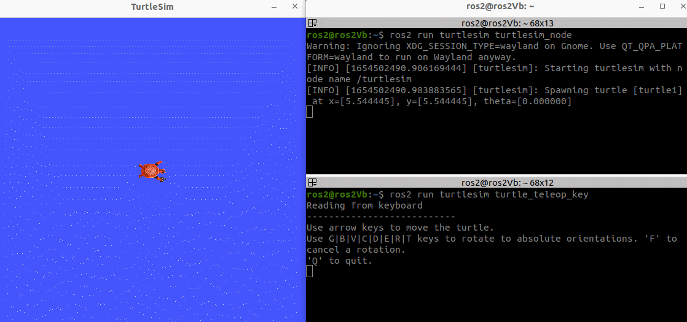


**案例2：**自实现第一个ROS2小程序，在终端输出文本：hello world!。


**案例3：**使用VSCode搭建ROS2集成开发环境，提高开发效率。

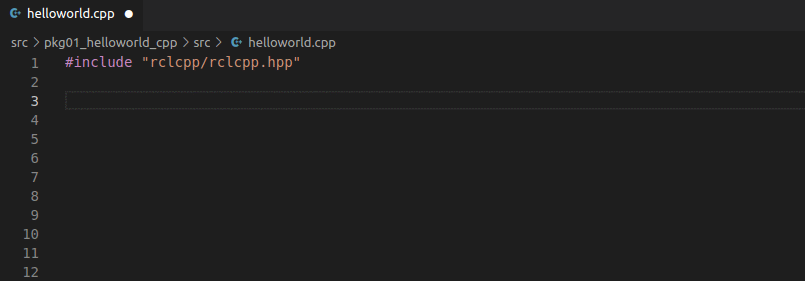


## 1.1 ROS2简介

<font size=4>**场景**</font>

机器人是一种高度复杂的系统性实现，机器人设计包含了机械结构设计、机械加工、硬件设计、嵌入式软件设计、上层软件设计等诸多模块，是各种硬件与软件的有机结合，甚至可以说机器人系统是当今工业体系的集大成者。机器人体系是相当庞大的，其复杂度之高，以至于没有任何个人、组织甚至公司能够独立完成系统性的机器人研发生产任务。

那么问题随之而来：既然机器人实现如此困难，那么我们应该如何开展相关工作呢？

一种合适的策略是——**合作**。让机器人研发者专注于自己擅长的领域，其他模块则直接复用相关领域更专业研发团队的实现，当然自身的研究也可以被他人继续复用_。_这种基于“复用”的分工协作，遵循了**不重复发明轮子**的原则，显然是可以大大提高机器人的研发效率的，尤其是随着机器人硬件越来越丰富，软件库越来越庞大，这种复用性和模块化开发需求也愈发强烈。

在此大背景下，便诞生了ROS。ROS是一套机器人通用软件框架，可以提升功能模块的复用性，并且随着ROS2的推出，ROS日臻完善，是机器人软件开发的不二之选。


<font size=4>**概念**</font>

**ROS（Robot Operating System）**是用于构建机器人应用程序的软件开发工具包。ROS是开源的，它由一组软件库和若干工具组成。

在机器人领域，ROS是一个标准软件平台，这个平台为开发者提供了构建机器人应用程序所需的各个功能模块，并且开发者能够以“可插拔”的方式组织各个功能模块，无论开发者的程序是用于课堂实验、科学研究、原型设计或是最终产品，ROS都提供了一站式的技术支持。

另外需要注意的是，ROS虽然字面意思是机器人操作系统，但是它并非经典意义上的操作系统，更准确的讲ROS是一个 SDK（Software Development Kit）也即软件开发工具包。


<font size=4>**作用**</font>

秉着“不要重复发明轮子”的原则，通过ROS可以复用已有功能并方便快捷的拓展新功能。


### 1.1.1 ROS2发展历程

<font size=4>**1.起源**</font>

**2007**年，一家名为**柳树车库（Willow Garage）**的机器人公司发布了ROS，ROS集开源、免费、高复用、低耦合、工具丰富等等诸多优势于一身，一经推出便迅速吸引了大量的开发者、科研人员、硬件供应商的加入，形成了稳定且多样的机器人生态，水到渠成的ROS也成为了机器人领域的主流软件框架并流行至今。

但是自ROS诞生的十几年来，不管是机器人相关软件、硬件还是ROS社区都发生了天翻地覆的变化，加之ROS1存在一些设计上的先天性缺陷，各种内外因素叠加下，导致ROS1在许多应用场景下都已经显得力不从心了。此背景下，官方于2017正式推出了新一代机器人操作系统——ROS2，ROS2基于全新的设计框架，保留了ROS1的优点并改进其缺陷，ROS2的目标是适应新时代的新需求。


<font size=4>**2.发行版本**</font>

ROS发行版是一组版本化的ROS功能包，它类似于Linux发行版（例如 Ubuntu）。ROS发行版的目的是让开发人员可以在一个相对稳定的代码库上工作，直到新的发行版推出。

以下列表为ROS2各不同发布版本的简单说明。

| **发行版**          | **发布日期**        | **标识**                                     | **停止维护日期** |
| :------------------ | :------------------ | :------------------------------------------- | :--------------- |
| Iron Irwini         | 2023 年 5 月 23 日  | 待定                                         | 2024 年 11 月    |
| Humble Hawksbill    | 2022 年 5 月 23 日  |    | 2027 年 5 月     |
| Galactic Geochelone | 2021 年 5 月 23 日  |    | 2022 年 11 月    |
| Foxy Fitzroy        | 2020 年 6 月 5 日   |      | 2023 年 5 月     |
| Eloquent Elusor     | 2019 年 11 月 22 日 |  | 2020 年 11 月    |
| Dashing Diademata   | 2019 年 5 月 31 日  |   | 2021 年 5 月     |
| Crystal Clemmys     | 2018 年 12 月 14 日 |     | 2019 年 12 月    |
| Bouncy Bolson       | 2018 年 7 月 2 日   |  | 2019 年 7 月     |
| Ardent Apalone      | 2017 年 12 月 8 日  |    | 2018 年 12 月    |
| beta3               | 2017 年 9 月 13 日  |                                              | 2017 年 12 月    |
| beta2               | 2017 年 7 月 5 日   |                                              | 2017 年 9 月     |
| beta1               | 2016 年 12 月 19 日 |                                              | 2017 年 7 月     |
| alpha1 - alpha8     | 2015 年 8 月 31 日  |                                              | 2016 年 12 月    |

**ROS2版本发布特点：**

* 发布版本与Ubuntu版本对应，生命周期也有Ubuntu保持一致，正常情况下偶数年份发布长支持版（5年），奇数年份发布短支持版（2年）；
* 版本名称由形容词+名词的格式组成，这一点与Ubuntu版本名称规则一致；
* 正常情况下，每年的5月23日，世界海龟日发布新版本。

**需要另外说明的是：**

官方于2020年发布了ROS1的最终版本，并将于2025年终止ROS1的维护。而早在2017年就已经推出了ROS2的第一个正式版本，并且随着ROS2的不断完善，于2022年又推出ROS2的第一个5年长支持版。对于ROS而言，这是一个里程碑式的事件，这意味着自此开始，ROS2将全面取代ROS1。


### 1.1.2 ROS2组成体系

整个ROS生态由通信（Plumbing）、工具（Tools）、功能（Capabilities）与社区（Community）四大部分组成。


<font size=4>**通信\(Plumbing\)**</font>

通信是整个ROS系统的核心实现，是ROS内置的一个消息传递系统，通常称之为middleware（中间件）或Plumbing（管道）。

在构建新的应用程序或使用与硬件交互的软件时，如何实现通信是首当其冲的问题，为此ROS提供了专门的消息传递系统，它可以管理不同节点之间的通信细节，提高开发者的工作效率。这套消息传递系统使用了“面向接口”的编程思想，可以通过清晰规范的接口，将不同模块分离，从而也将故障隔离。使得ROS系统更易于维护、扩展性更强且保证了程序的高复用性。

接口规范可以由开发者自行定义。同时为了方便使用，在ROS中也提供了许多标准的接口，这些标准接口有着广泛应用，比如：将雷达或摄像头数据传输到可视化的用户界面或是传输到定位算法模块，都会使用到标准接口。


<font size=4>**工具\(Tools\)**</font>

构建机器人应用程序极具挑战性。开发者除了会遇到一些传统的软件开发问题之外，还需要通过传感器或执行器与物理世界进行异步交互。显而易见的，良好的开发工具可以提高应用程序的开发效率，在ROS中就内置了launch、调试、可视化、绘图、录制回放等一系列工具。这些工具不光可以提高开发效率，还可以在发布产品时直接包含在产品之中。


<font size=4>**功能\(Capabilities\)**</font>

ROS生态系统是机器人软件的聚宝盆。无论开发者需要用于GPS的设备驱动程序、用于四足仿生机器人的步行和平衡控制器，还是用于移动机器人的地图系统，ROS都能满足你的需求。从驱动程序到算法，再到用户界面，ROS都提供了相关实现，开发者只需专注于自身应用程序即可。

ROS的目标是提供一站式的技术支持，降低构建机器人应用程序的门槛。ROS希望任何开发者都可以将自己的“创意”变为现实，而无需了解底层软件和硬件的所有内容。


<font size=4>**社区\(Community\)**</font>

ROS社区规模庞大、多样且全球化，从学生和业余爱好者到跨国公司和政府机构，各行各业的人和组织都在推动着ROS项目的发展。

该项目的社区中心和中立管家是Open Robotics，它托管共享在线服务（例如ROS官网：[https://www.ros.org/](https://www.ros.org/)），创建和管理分发版本（包括您安装的二进制包），并开发和维护大部分ROS核心软件。 Open Robotics还提供与 ROS 相关的工程服务。


### 1.1.3 ROS2优势

<font size=4>**1.ROS与其他机器人软件框架比较**</font>

ROS是构建机器人的最快捷方式！


<font size=4>**1.1 开源**</font>

ROS一直是开源的，并且将永远是开源的，以确保全世界的爱好者、开发人员可以自由、不受限制地访问高质量、一流、功能齐全的机器人SDK。另外官方也在其他开源项目之上构建ROS，ROS会尽可能的利用并遵循开放标准（例如OMG的DDS）。


<font size=4>**1.2 免费**</font>

官方鼓励用户对ROS做出开源贡献，也欢迎提出宝贵意见，但不干涉开发者将ROS集成进非开源软件，不反对将ROS集成进专有产品。


<font size=4>**1.3 多平台支持**</font>

ROS2支持Linux、Windows和macOS以及各种嵌入式平台（通过micro-ROS）并且不同平台都已经通过了官方测试，这意味着通过ROS2可以实现开发、部署后端管理系统和用户界面的无缝衔接。分层支持模型还允许将ROS2移植到诸如实时和嵌入式操作系统等新平台上，以便在获得关注和投资时将ROS2引入和推广到这些新平台中。


<font size=4>**1.4 应用领域广泛**</font>

ROS可以在各种机器人应用中使用，从室内到室外，从家用到汽车，从水下到太空，从消费市场到工业领域，ROS都可以独当一面。


<font size=4>**1.5 全球化社区**</font>

十多年来，ROS项目通过培育由数百万开发人员和用户组成的全球化社区，为机器人技术做出贡献和改进，从而产生了一个庞大的机器人软件生态系统。 ROS由该社区开发并为该社区服务，该社区将成为其未来的管理者。


<font size=4>**1.6 可缩短产品上市时间**</font>

ROS提供了开发机器人应用程序所需的工具、库和功能，使开发者可以将更多的时间花费在与自身业务相关的工作上。由于它还是开源的，所以开发者可以决定何时何处使用ROS，甚至还可以根据自身需求修改ROS。另外ROS是友好的，不具排他性，开发者可以在ROS和其他机器人软件框架之间自由选择，或者也可以将ROS与其他软件框架集成，以取长补短。


<font size=4>**1.7 广泛的行业支持**</font>

业界对ROS的支持非常强大。除了在ROS上开发产品外，来自世界各地的大大小小的公司都在投入资源为ROS做出开源贡献。


<font size=4>**1.8 业界肯定**</font>

整个机器人行业都依赖于ROS。ROS是教授机器人技术的标准，是大多数机器人研究的基础，从单个学生项目到多机构合作再到大型竞赛，ROS都占据着主导地位。世界各地不计其数的机器人内部都运行着ROS，仅在自主移动机器人 \(AMR\) 中，ROS就帮助创造了数十亿美元的价值。


<font size=4>**2.ROS2较之于ROS1的优势**</font>

ROS2是全新一代机器人操作系统，不只是功能增强的ROS1。


<font size=4>**2.1 去中心化**</font>

在ROS1中使用master节点管理调度ROS系统，这存在极大的安全隐患，一旦master节点异常退出，那么会导致整个系统的崩溃。在ROS2中采用了去中心化，各个节点之间无需通过master关联，各个节点都是等态的，可以相互发现彼此。


<font size=4>**2.2 全新通信底层实现**</font>

秉着不重复发明轮子的原则，ROS2不再自实现通信底层，而是直接更换为DDS通信，这使得ROS2较之于ROS1无论是通信的实行性、可靠性还是连续性都有大幅度提升。


<font size=4>**2.3 应用场景更为广泛**</font>

ROS1在设计之初有着天生的硬件优势以及局限性：

* 单机；
* 工作站级的计算资源；
* 无实时性要求（有此类需求也可以以特殊方式满足）；
* 出色的网络连接（有线或近距离高带宽无线）；
* 主要用于学术界；
* 灵活有余而约束不足。

这导致了它的一些先天性缺陷，不能适应新时代的需求，比如：

* 对多机器人编队支持欠佳；
* 小型嵌入式平台不能很好的支持ROS；
* 实时性差；
* ROS之间的数据传输受网络质量影响严重；
* 产品不易落地。

随着ROS2的推出，上述场景的缺陷都得到很大程度的修复。


<font size=4>**2.4 大量采用新技术、新的设计理念**</font>

随着ROS十数年的发展，大量的新技术也产生、改进、成熟并被广泛采用，ROS也开始引入并应用一些新技术，比如：

* DDS（ Data Distribution Service——数据分发服务）；

* Zeroconf；

* ZeroMQ；

* Redis；

* WebSockets。

这些新技术为ROS带来了更多的便利，比如：更少的维护成本，却有着更多的功能拓展，并且随着第三方库的升级而持续受益。

此外，ROS2还重构了API系统，改进了ROS1的API在设计上的不足。


## 1.2 ROS2安装

本节主要介绍如何在Ubuntu 操作系统上安装ROS2，所以在安装之前请先准备好与ROS2版本相匹配的Ubuntu操作系统。


### 1.2.1 安装ROS2

整体而言，ROS2的安装步骤不算复杂，大致步骤如下：

1. 准备1：设置语言环境；
2. 准备2：启动Ubuntu universe存储库；
3. 设置软件源；
4. 安装ROS2；
5. 配置环境。

请注意：虽然安装比较简单，但是安装过程比较耗时，需要耐心等待。


<font size=4>**1.准备1：设置语言环境**</font>

请先检查本地语言环境是否支持UTF-8编码，可调用如下指令检查并设置UTF-8编码：

```sh
locale  # 检查是否支持 UTF-8

sudo apt update && sudo apt install locales
sudo locale-gen en_US en_US.UTF-8
sudo update-locale LC_ALL=en_US.UTF-8 LANG=en_US.UTF-8
export LANG=en_US.UTF-8

locale  # 验证设置是否成果
```

注意：语言环境可以不同，但必须支持UTF-8编码。


<font size=4>**2.准备2：启动Ubuntu universe存储库**</font>

常用的启动Ubuntu universe存储库方式有两种：图形化操作与命令行操作。


<font size=4>**方式1：图形化操作**</font>

请打开软件与更新\(Software & Updates\)窗口，确保启动了universe存储库，以保证可以下载”社区维护的免费和开源软件“，操作示例如下：

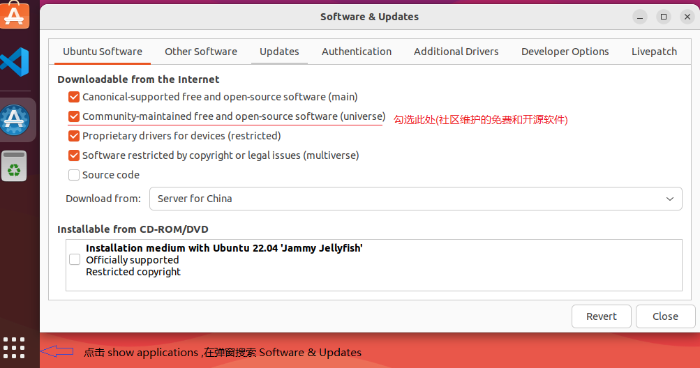


<font size=4>**方式2：命令行操作**</font>

首先，通过如下命令检查是否已经启动了Ubuntu universe存储库：

```sh
apt-cache policy | grep universe
 500 http://us.archive.ubuntu.com/ubuntu jammy/universe amd64 Packages
     release v=22.04,o=Ubuntu,a=jammy,n=jammy,l=Ubuntu,c=universe,b=amd64
```

如果没有如上所示的输出，那么请调用如下命令启动Ubuntu universe存储库：

```sh
sudo apt install software-properties-common
sudo add-apt-repository universe
```


<font size=4>**3.设置软件源**</font>

先将ROS 2 apt存储库添加到系统，用apt授权我们的GPG密钥：

```sh
sudo apt update && sudo apt install curl gnupg lsb-release
sudo curl -sSL https://raw.githubusercontent.com/ros/rosdistro/master/ros.key -o /usr/share/keyrings/ros-archive-keyring.gpg
```

> 提示：如果抛出连接 **raw.githubusercontent.com  **失败的异常信息，解决方式请参考本节最后部分补充2内容。

然后将存储库添加到源列表：

```sh
echo "deb [arch=$(dpkg --print-architecture) signed-by=/usr/share/keyrings/ros-archive-keyring.gpg] http://packages.ros.org/ros2/ubuntu $(source /etc/os-release && echo $UBUNTU_CODENAME) main" | sudo tee /etc/apt/sources.list.d/ros2.list > /dev/null
```


<font size=4>**4.安装ROS2**</font>

首先更新apt存储库缓存：

```sh
sudo apt update
```

然后升级已安装的软件\(ROS2软件包建立在经常更新的Ubuntu系统上，在安装新软件包之前请确保您的系统是最新的\)：

```sh
sudo apt upgrade
```

安装桌面版ROS2\(建议\)，包含：ROS、RViz、示例与教程，安装命令如下：

```sh
sudo apt install ros-humble-desktop
```

或者，也可以安装基础版ROS2，包含：通信库、消息包、命令行工具，但是没有 GUI 工具，安装命令如下：

```sh
sudo apt install ros-humble-ros-base
```


<font size=4>**5.配置环境**</font>

终端下，执行ROS2程序时，需要调用如下命令配置环境：

```sh
source /opt/ros/humble/setup.bash
```

每次新开终端时，都得执行上述命令，或者也可以执行如下命令，将配置环境指令写入 ”~/.bashrc“ 文件，那么每次新启动终端时，不需要在手动配置环境：

```sh
echo "source /opt/ros/humble/setup.bash" >> ~/.bashrc
```

到目前为止，ROS2就已经安装且配置完毕了。

---


<font size=4>**补充1：关于卸载\(谨慎操作\)**</font>

ROS2安装完毕之后，如果想卸载ROS2，可以执行如下命令：

```sh
sudo apt remove ~nros-humble-* && sudo apt autoremove
```

还可以再删除ROS2对应的存储库：

```sh
sudo rm /etc/apt/sources.list.d/ros2.list
sudo apt update
sudo apt autoremove
# Consider upgrading for packages previously shadowed.
sudo apt upgrade
```


<font size=4>**补充2：关于 raw.githubusercontent.com 连接失败的处理**</font>

安装ROS2过程中，执行到步骤3也即设置软件源时，可能会抛出异常。

**异常提示：**curl: \(7\) Failed to connect to raw.githubusercontent.com port 443: 拒绝连接。

**异常原因：**DNS被污染。

**解决思路：**查询错误提示中域名的IP地址，然后修改 /etc/hosts 文件，添加域名与IP映射。

**具体实现：**

1.访问 [https://www.ipaddress.com/](https://www.ipaddress.com/) 并输入域名 **raw.githubusercontent.com**，查询 ip 地址。

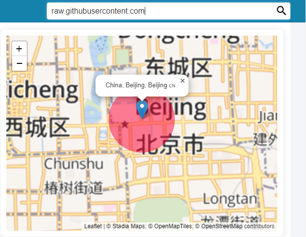

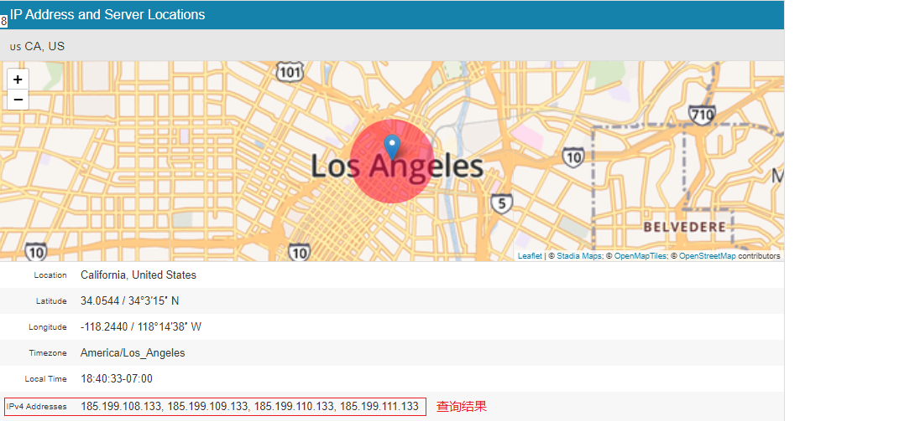

查询到的ip地址可能有多个，记录任意一个地址即可。

2.修改/etc/hosts文件：

```sh
sudo gedit /etc/hosts
```

添加ip和域名映射到hosts文件，保存并退出。

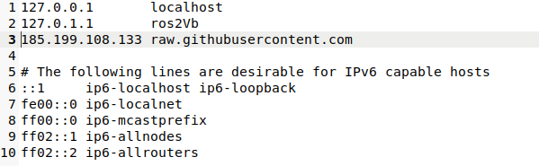

操作完毕后，终端再次运行安装指令即可正常执行


### 1.2.2 测试ROS2

在ROS2中已经内置了一些案例，安装完毕之后，就可以运行这些案例，以测试ROS2的安装与配置是否正常，在此，我们选用ROS2内置的小乌龟案例，具体操作如下。

1.打开两个终端\(可以使用快捷键Ctrl + Alt + T\)；

2.终端1中输入指令：`ros2 run turtlesim turtlesim_node`，执行完毕，会启动一个绘有小乌龟的窗口；

3.终端2中输入指令：`ros2 run turtlesim turtle_teleop_key`，执行完毕，可以在此终端中通过键盘控制乌龟运动。

运行结果示例如下：


注意：在使用键盘控制乌龟运动时，需要保证光标聚焦在终端2中，否则乌龟无响应。


### 1.2.3 安装colcon构建工具

colcon是一个命令行工具，用于改进编译，测试和使用多个软件包的工作流程。它实现过程自动化，处理需求并设置环境以便于使用软件包。ROS2中便是使用colcon作为包构建工具的，但是ROS2中没有默认安装colcon，需要自行安装，安装命令如下：

```sh
sudo apt install python3-colcon-common-extensions
```

安装完colcon之后，就可以在ROS2中编写应用程序了，下一节我们将介绍ROS2版本的HelloWorld实现。


## 1.3 ROS2快速体验

ROS2中涉及的编程语言以C++和Python为主，ROS2中的大多数功能两者都可以实现，在本系列教程中，如无特殊情况，每一个案例也都会分别使用C++和Python两种方案演示。本节我们将介绍一个最基本的案例——ROS2版本的HelloWorld，通过学习本节内容，你可以了解ROS2程序的编写、编译与执行流程。


### 1.3.1 案例简介

<font size=4>**1.需求**</font>

编写ROS2程序，要求程序运行时，可以在终端输出文本"Helo World"。


<font size=4>**2.准备**</font>

无论是使用C++还是Python编写ROS2程序，都需要依赖于工作空间，在此，我们先实现工作空间的创建与编译，打开终端，输入如下指令：

```sh
mkdir -p ws00_helloworld/src #创建工作空间以及子级目录 src，工作空间名称可以自定义
cd ws00_helloworld #进入工作空间
colcon build #编译
```

上述指令执行完毕，将创建ws00\_helloworld目录，且该目录下包含build、install、log、src共四个子级目录。


<font size=4>**3.流程简介**</font>

工作空间创建完毕后，我么可以在工作空间下的src目录中编写C++或Python程序，且两种语言的实现流程大致一致，主要包含如下步骤：

1. 创建功能包；
2. 编辑源文件；
3. 编辑配置文件；
4. 编译；
5. 执行。

下面两节我们会介绍具体的实现细节。


### 1.3.2 HelloWorld（C++）

<font size=4>**1.创建功能包**</font>

终端下，进入ws00\_helloworld/src目录，使用如下指令创建一个C++功能包：

```sh
ros2 pkg create pkg01_helloworld_cpp --build-type ament_cmake --dependencies rclcpp --node-name helloworld
```

执行完毕，在src目录下将生成一个名为pkg01\_helloworld\_cpp的目录，且目录中已经默认生成了一些子级文件与文件夹。


<font size=4>**2.编辑源文件**</font>

进入pkg01\_helloworld\_cpp/src目录，该目录下有一helloworld.cpp文件，修改文件内容如下：

```cpp
#include "rclcpp/rclcpp.hpp"

int main(int argc, char ** argv)
{
  // 初始化 ROS2
  rclcpp::init(argc,argv);
  // 创建节点
  auto node = rclcpp::Node::make_shared("helloworld_node");
  // 输出文本
  RCLCPP_INFO(node->get_logger(),"hello world!");
  // 释放资源
  rclcpp::shutdown();
  return 0;
}
```


<font size=4>**3.编辑配置文件**</font>

在步骤1创建功能包时所使用的指令已经默认生成且配置了配置文件，不过实际应用中经常需要自己编辑配置文件，所以在此对相关内容做简单介绍，所使用的配置文件主要有两个，分别是功能包下的package.xml与CMakeLists.txt。


<font size=4>**3.1 package.xml**</font>

文件内容如下：

```xml
<?xml version="1.0"?>
<?xml-model href="http://download.ros.org/schema/package_format3.xsd" schematypens="http://www.w3.org/2001/XMLSchema"?>
<package format="3">
  <name>pkg01_helloworld_cpp</name>
  <version>0.0.0</version>
  <description>TODO: Package description</description>
  <maintainer email="ros2@todo.todo">ros2</maintainer>
  <license>TODO: License declaration</license>

  <buildtool_depend>ament_cmake</buildtool_depend>

  <!-- 所需要依赖 -->
  <depend>rclcpp</depend>

  <test_depend>ament_lint_auto</test_depend>
  <test_depend>ament_lint_common</test_depend>

  <export>
    <build_type>ament_cmake</build_type>
  </export>
</package>
```

注释部分以后需要根据实际的包依赖进行添加或修改。


<font size=4>**3.2 CMakeLists.txt**</font>

文件内容如下：

```cmake
cmake_minimum_required(VERSION 3.8)
project(pkg01_helloworld_cpp)

if(CMAKE_COMPILER_IS_GNUCXX OR CMAKE_CXX_COMPILER_ID MATCHES "Clang")
  add_compile_options(-Wall -Wextra -Wpedantic)
endif()

# find dependencies
find_package(ament_cmake REQUIRED)
# 引入外部依赖包
find_package(rclcpp REQUIRED)

# 映射源文件与可执行文件
add_executable(helloworld src/helloworld.cpp)
# 设置目标依赖库
ament_target_dependencies(
  helloworld
  "rclcpp"
)
# 定义安装规则
install(TARGETS helloworld
  DESTINATION lib/${PROJECT_NAME})

if(BUILD_TESTING)
  find_package(ament_lint_auto REQUIRED)
  # the following line skips the linter which checks for copyrights
  # comment the line when a copyright and license is added to all source files
  set(ament_cmake_copyright_FOUND TRUE)
  # the following line skips cpplint (only works in a git repo)
  # comment the line when this package is in a git repo and when
  # a copyright and license is added to all source files
  set(ament_cmake_cpplint_FOUND TRUE)
  ament_lint_auto_find_test_dependencies()
endif()

ament_package()
```

中文注释部分以后可能需要根据实际情况修改。


<font size=4>**4.编译**</font>

终端下进入到工作空间，执行如下指令：

```sh
colcon build
```


<font size=4>**5.执行**</font>

终端下进入到工作空间，执行如下指令：

```sh
. install/setup.bash
ros2 run pkg01_helloworld_cpp helloworld
```

程序执行，在终端下将输出文本："hello world!"。


### 1.3.3 HelloWorld（Python）

<font size=4>**1.创建功能包**</font>

终端下，进入ws00\_helloworld/src目录，使用如下指令创建一个python功能包：

```sh
ros2 pkg create pkg02_helloworld_py --build-type ament_python --dependencies rclpy --node-name helloworld
```

执行完毕，在src目录下将生成一个名为pkg02\_helloworld\_py的目录，且目录中已经默认生成了一些子级文件与文件夹。


<font size=4>**2.编辑源文件**</font>

进入pkg02\_helloworld\_py/pkg02\_helloworld\_py目录，该目录下有一helloworld.py文件，修改文件内容如下：

```py
import rclpy

def main():
    # 初始化 ROS2
    rclpy.init()
    # 创建节点
    node = rclpy.create_node("helloworld_py_node")
    # 输出文本
    node.get_logger().info("hello world!")
    # 释放资源
    rclpy.shutdown()


if __name__ == '__main__':
    main()
```


<font size=4>**3.编辑配置文件**</font>

与C++类似的，在步骤1创建功能包时所使用的指令也已经默认生成且配置了配置文件，不过实际应用中经常需要自己编辑配置文件，所以在此对相关内容做简单介绍，所使用的配置文件主要有两个，分别是功能包下的package.xml与setup.py。


<font size=4>**3.1 package.xml**</font>

文件内容如下：

```xml
<?xml version="1.0"?>
<?xml-model href="http://download.ros.org/schema/package_format3.xsd" schematypens="http://www.w3.org/2001/XMLSchema"?>
<package format="3">
  <name>pkg02_helloworld_py</name>
  <version>0.0.0</version>
  <description>TODO: Package description</description>
  <maintainer email="ros2@todo.todo">ros2</maintainer>
  <license>TODO: License declaration</license>

  <!-- 所需要依赖 -->
  <depend>rclpy</depend>

  <test_depend>ament_copyright</test_depend>
  <test_depend>ament_flake8</test_depend>
  <test_depend>ament_pep257</test_depend>
  <test_depend>python3-pytest</test_depend>

  <export>
    <build_type>ament_python</build_type>
  </export>
</package>
```

注释部分以后需要根据实际的包依赖进行添加或修改。


<font size=4>**3.2 setup.py**</font>

文件内容如下：

```py
from setuptools import setup

package_name = 'pkg02_helloworld_py'

setup(
    name=package_name,
    version='0.0.0',
    packages=[package_name],
    data_files=[
        ('share/ament_index/resource_index/packages',
            ['resource/' + package_name]),
        ('share/' + package_name, ['package.xml']),
    ],
    install_requires=['setuptools'],
    zip_safe=True,
    maintainer='ros2',
    maintainer_email='ros2@todo.todo',
    description='TODO: Package description',
    license='TODO: License declaration',
    tests_require=['pytest'],
    entry_points={
        'console_scripts': [
            # 映射源文件与可执行文件
            'helloworld = pkg02_helloworld_py.helloworld:main'
        ],
    },
)
```

注释部分以后可能需要根据实际情况修改。


<font size=4>**4.编译**</font>

终端下进入到工作空间，执行如下指令：

```sh
colcon build
```


<font size=4>**5.执行**</font>

终端下进入到工作空间，执行如下指令：

```sh
. install/setup.bash
ros2 run pkg02_helloworld_py helloworld
```

程序执行，在终端下将输出文本："hello world!"。


### 1.3.4 运行优化

每次终端中执行工作空间下的节点时，都需要调用`. install/setup.bash`指令，使用不便，优化策略是，可以将该指令的调用添加进`~/setup.bash`，操作格式如下：

```sh
echo "source /{工作空间路径}/install/setup.bash" >> ~/.bashrc
```

示例：

```sh
echo "source /home/ros2/ws00_helloworld/install/setup.bash" >> ~/.bashrc
```

以后再启动终端时，无需手动再手动刷新环境变量，使用更方便。


## 1.4 ROS2集成开发环境搭建

和大多数开发环境一样，理论上，在ROS2中，只需要记事本就可以编写基本的ROS2程序，但是工欲善其事必先利其器，为了提高开发效率，可以先安装集成开发工具和使用方便的工具：IDE、终端、git。


### 1.4.1 安装VSCode

VSCode全称Visual Studio Code，是微软推出的一款轻量级代码编辑器，免费、开源而且功能强大。它支持几乎所有主流的程序语言的语法高亮、智能代码补全、自定义热键、括号匹配、代码片段、代码对比Diff、GIT 等特性，支持插件扩展，并针对网页开发和云端应用开发做了优化。软件跨平台支持Win、Mac以及Linux。


<font size=4>**1.下载**</font>

vscode下载：[https://code.visualstudio.com/Download](https://code.visualstudio.com/Download)。

历史版本下载链接：[https://code.visualstudio.com/updates](https://code.visualstudio.com/updates)。


<font size=4>**2.vscode 安装与卸载**</font>

<font size=4>**2.1 安装**</font>

**方式1：**双击安装即可\(或右击选择安装\)；

**方式2：**`sudo dpkg -i xxxx.deb`。


<font size=4>**2.2 卸载**</font>

```sh
sudo dpkg --purge  code
```


<font size=4>**3.VSCode启动**</font>

VSCode启动也比较简单，可以直接在Show Applications\(显示应用程序\) 中搜索VSCode直接启动\(也可以将其添加到收藏夹\)。

或者，也可以在终端下进入需要被打开的目录\(比如：前面创建的ROS2工作空间ws00\_helloworld\)，然后输入命令：`code .`。


<font size=4>**4.VSCode插件**</font>

VSCode支持插件扩展，依赖于VSCode丰富多样的插件，可以大大提高程序开发效率，为了方便ROS2程序开发，我们也需要安装一些插件。

首先点击侧边栏的Extensions\(插件\)选项或者使用快捷键`Ctrl+Shift+X`打开插件窗口，本课程建议安装的插件如下：

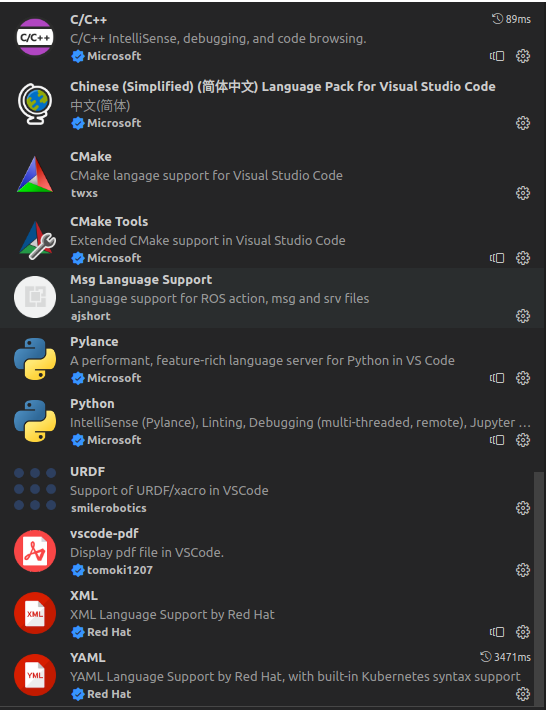

当然，上述只是部分推荐插件，大家可以根据自身需求安装其他扩展。


<font size=4>**5.VSCode配置**</font>

在VSCode中，cpp文件中的 `#include "rclcpp/rclcpp.hpp" `包含语句会抛出异常，这是因为没有设置VSCode配置文件中 includepath属性，可以按照如下步骤解决此问题：

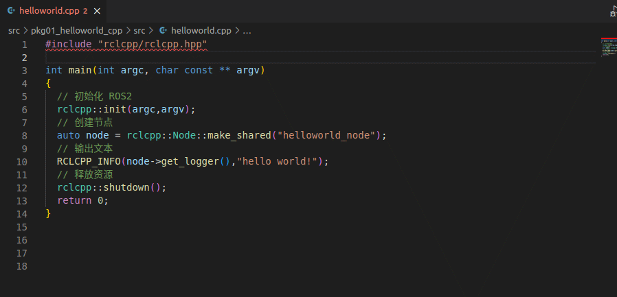

1. 将鼠标移到错误提示语句，此时会出现弹窗；
2. 点击弹窗中的快速修复，会有新的弹窗，再点击`编辑"includePath"设置`；
3. 在新页面中，包含路径属性对应的文本域中，换行输入被包含的路径`/opt/ros/humble/include/**`。

至此，问题修复。

VSCode安装并配置完毕后，大家就可以在其中编写ROS2程序了。当然为了提高编码效率，我们会经常性的使用到一些快捷键，VSCode的快捷键可以在菜单栏的“帮助”中查看。


### 1.4.2 安装终端

在ROS2中，需要频繁的使用到终端，且可能需要同时开启多个窗口，推荐一款较为好用的终端：**Terminator。**效果如下：

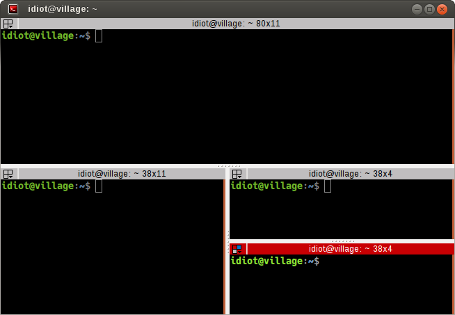


<font size=4>**1.安装**</font>

```sh
sudo apt install terminator
```


<font size=4>**2.启动**</font>

可以直接在Show Applications\(显示应用程序\) 中搜索terminator直接启动\(也可以将其添加到收藏夹\)；或者，也可以直接使用快捷键`Ctrl+Alt+T`启动。


<font size=4>**3.Terminator 常用快捷键**</font>

**第一部份：关于在同一个标签内的操作**

```cpp
Alt+Up                          //移动到上面的终端
Alt+Down                        //移动到下面的终端
Alt+Left                        //移动到左边的终端
Alt+Right                       //移动到右边的终端
Ctrl+Shift+O                    //水平分割终端
Ctrl+Shift+E                    //垂直分割终端
Ctrl+Shift+Right                //在垂直分割的终端中将分割条向右移动
Ctrl+Shift+Left                 //在垂直分割的终端中将分割条向左移动
Ctrl+Shift+Up                   //在水平分割的终端中将分割条向上移动
Ctrl+Shift+Down                 //在水平分割的终端中将分割条向下移动
Ctrl+Shift+S                    //隐藏/显示滚动条
Ctrl+Shift+F                    //搜索
Ctrl+Shift+C                    //复制选中的内容到剪贴板
Ctrl+Shift+V                    //粘贴剪贴板的内容到此处
Ctrl+Shift+W                    //关闭当前终端
Ctrl+Shift+Q                    //退出当前窗口，当前窗口的所有终端都将被关闭
Ctrl+Shift+X                    //最大化显示当前终端
Ctrl+Shift+Z                    //最大化显示当前终端并使字体放大
Ctrl+Shift+N or Ctrl+Tab        //移动到下一个终端
Ctrl+Shift+P or Ctrl+Shift+Tab  //Crtl+Shift+Tab 移动到之前的一个终端
```


**第二部份：有关各个标签之间的操作**

```cpp
F11                             //全屏开关
Ctrl+Shift+T                    //打开一个新的标签
Ctrl+PageDown                   //移动到下一个标签
Ctrl+PageUp                     //移动到上一个标签
Ctrl+Shift+PageDown             //将当前标签与其后一个标签交换位置
Ctrl+Shift+PageUp               //将当前标签与其前一个标签交换位置
Ctrl+Plus (+)                   //增大字体
Ctrl+Minus (-)                  //减小字体
Ctrl+Zero (0)                   //恢复字体到原始大小
Ctrl+Shift+R                    //重置终端状态
Ctrl+Shift+G                    //重置终端状态并clear屏幕
Super+g                         //绑定所有的终端，以便向一个输入能够输入到所有的终端
Super+Shift+G                   //解除绑定
Super+t                         //绑定当前标签的所有终端，向一个终端输入的内容会自动输入到其他终端
Super+Shift+T                   //解除绑定
Ctrl+Shift+I                    //打开一个窗口，新窗口与原来的窗口使用同一个进程
Super+i                         //打开一个新窗口，新窗口与原来的窗口使用不同的进程
```


### 1.4.3 安装git

Git 是一个免费和开源的分布式版本控制系统，旨在高速高效的处理从小型到大型项目的所有内容。在Ubuntu下可以调用如下命令安装git：

```sh
sudo apt install git
```

在本教程中会经常使用`git clone 仓库地址`的方式来将Git仓库拷贝到本地。

关于git工具使用可以在终端下输入：`git --help`查看帮助文档。关于git的其他详细信息请参考：https://git-scm.com/


## 1.5 ROS2体系框架

在**1.1.2 ROS2组成体系**一节中，我们已经简单了解了ROS2的体系框架，并且随着前面介绍了ROS2功能包的编写、编译、执行流程，也对ROS2应用程序的构建有了基本的认识。本节会进一步从微观和宏观两个维度来介绍ROS2的不同部分，以帮助大家了解ROS2的学习、工作内容以及以后可选择的发展方向。

微观上会介绍ROS2的文件系统、ROS2的核心模块（通信与工具），这些都是官方提供的标准内容。宏观上会介绍关于ROS2的技术支持、ROS2的应用方向，这部分则是得益于ROS2的强大社区。


### 1.5.1 ROS2文件系统

立足系统架构，如下图所示，ROS2可以划分为三层：

* **操作系统层（OS Layer）**

    如前所述，ROS虽然称之为机器人操作系统，但实质只是构建机器人应用程序的软件开发工具包，ROS必须依赖于传统意义的操作系统，目前ROS2可以运行在Linux、Windows、Mac或RTOS上。

* **中间层（Middleware Layer）**

    主要由数据分发服务DDS与ROS2封装的关于机器人开发的中间件组成。DDS是一种去中心化的数据通讯方式，ROS2还引入了服务质量管理 （Quality of Service）机制，借助该机制可以保证在某些较差网络环境下也可以具备良好的通讯效果。ROS2中间件则主要由客户端库、DDS抽象层与进程内通讯API构成。

* **应用层（Application Layer）**

    是指开发者构建的应用程序，在应用程序中是以功能包为核心的，在功能包中可以包含源码、数据定义、接口等内容。

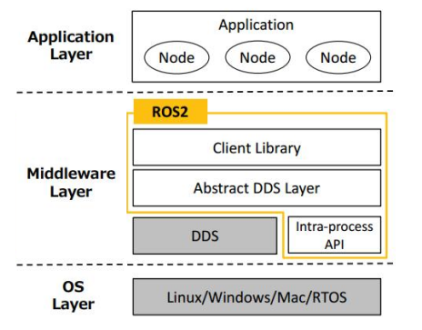

对于一般开发者而言，工作内容主要集中在应用层，开发者一般通过实现具有某一特定功能的功能包来构建机器人应用程序。对应的我们所介绍的ROS2文件系统主要是指在硬盘上以功能包为核心的目录与文件的组织形式。


<font size=4>**1.概览**</font>

功能包是ROS2应用程序的核心，但是功能包不能直接构建，必须依赖于工作空间，一个ROS2工作空间的目录结构如下：

```cpp
WorkSpace --- 自定义的工作空间。
    |--- build：存储中间文件的目录，该目录下会为每一个功能包创建一个单独子目录。
    |--- install：安装目录，该目录下会为每一个功能包创建一个单独子目录。
    |--- log：日志目录，用于存储日志文件。
    |--- src：用于存储功能包源码的目录。
        |-- C++功能包
            |-- package.xml：包信息，比如:包名、版本、作者、依赖项。
            |-- CMakeLists.txt：配置编译规则，比如源文件、依赖项、目标文件。
            |-- src：C++源文件目录。
            |-- include：头文件目录。
            |-- msg：消息接口文件目录。
            |-- srv：服务接口文件目录。
            |-- action：动作接口文件目录。
        |-- Python功能包
            |-- package.xml：包信息，比如:包名、版本、作者、依赖项。
            |-- setup.py：与C++功能包的CMakeLists.txt类似。
            |-- setup.cfg：功能包基本配置文件。
            |-- resource：资源目录。
            |-- test：存储测试相关文件。
            |-- 功能包同名目录：Python源文件目录。
```

另外，无论是Python功能包还是C++功能包，都可以自定义一些配置文件相关的目录。

```cpp
|-- C++或Python功能包
    |-- launch：存储launch文件。
    |-- rviz：存储rviz2配置相关文件。
    |-- urdf：存储机器人建模文件。
    |-- params：存储参数文件。
    |-- world：存储仿真环境相关文件。
    |-- map：存储导航所需地图文件。
    |-- ......
```

上述这些目录也可以定义为其他名称，或者根据需要创建其他一些目录。


<font size=4>**2.源文件说明求**</font>

在**1.3 ROS2快速体验**中，实现第一个ROS2程序时，都需要创建节点，无论是C++实现还是Python实现，都是直接实例化的Node对象。

C++实例化Node示例如下：

```cpp
#include "rclcpp/rclcpp.hpp"

int main(int argc, char ** argv)
{
  rclcpp::init(argc,argv);
  auto node = rclcpp::Node::make_shared("helloworld_node");
  RCLCPP_INFO(node->get_logger(),"hello world!");
  rclcpp::shutdown();
  return 0;
}
```

Python实例化Node示例如下：

```py
import rclpy

def main():
    rclpy.init()
    node = rclpy.create_node("helloworld_py_node")
    node.get_logger().info("hello world!")
    rclpy.shutdown()

if __name__ == '__main__':
    main()
```

但是在ROS2中，上述编码风格是不被推荐的，更推荐以继承Node的方式来创建节点对象。

C++继承Node实现示例如下：

```cpp
#include "rclcpp/rclcpp.hpp"

class MyNode: public rclcpp::Node{
public:
    MyNode():Node("node_name"){
        RCLCPP_INFO(this->get_logger(),"hello world!");
    }

};

int main(int argc, char *argv[])
{
    rclcpp::init(argc,argv);
    auto node = std::make_shared<MyNode>();
    rclcpp::shutdown();
    return 0;
}
```

Python继承Node实现示例如下：

```py
import rclpy
from rclpy.node import Node

class MyNode(Node):
    def __init__(self):
        super().__init__("node_name_py")
        self.get_logger().info("hello world!")
def main():

    rclpy.init()
    node = MyNode() 
    rclpy.shutdown()
```

之所以继承比直接实例化Node更被推荐，是因为继承方式可以在一个进程内组织多个节点，这对于提高节点间的通信效率是很有帮助的，但是直接实例化则与该功能不兼容。


<font size=4>**3.配置文件说明求**</font>

在ROS2功能包中，经常需要开发者编辑一些配置文件以设置功能包的构建信息，功能包类型不同，所需修改的配置文件也有所不同。C++功能包的构建信息主要包含在package.xml与CMakeLists.txt中，Python功能包的构建信息则主要包含在package.xml和setup.py中，接下来我们就简单了解一下这些配置文件。


<font size=4>**3.1 package.xml**</font>

不管是何种类型的功能包，package.xml的格式都是类似的，在该文件中包含了包名、版本、作者、依赖项的信息，package.xml可以为colcon构建工具确定功能包的编译顺序。一个简单的package.xml示例如下：

```xml
<?xml version="1.0"?>
<?xml-model href="http://download.ros.org/schema/package_format3.xsd" schematypens="http://www.w3.org/2001/XMLSchema"?>
<package format="3">
  <name>pkg01_helloworld_cpp</name>
  <version>0.0.0</version>
  <description>TODO: Package description</description>
  <maintainer email="ros2@todo.todo">ros2</maintainer>
  <license>TODO: License declaration</license>

  <buildtool_depend>ament_cmake</buildtool_depend>
  <depend>rclcpp</depend>

  <test_depend>ament_lint_auto</test_depend>
  <test_depend>ament_lint_common</test_depend>

  <export>
    <build_type>ament_cmake</build_type>
  </export>
</package>
```

**1.根标签**

* &lt;package&gt;：该标签为整个xml文件的根标签，format属性用来声明文件的格式版本。

**2.元信息标签**

* &lt;name&gt;：包名；
* &lt;version&gt;：包的版本号；
* &lt;description&gt;：包的描述信息；
* &lt;maintainer&gt;：维护者信息；
* &lt;license&gt;：软件协议；
* &lt;url&gt;：包的介绍网址；
* &lt;author&gt;：包的作者信息。

**3.依赖项**

* &lt;buildtool\_depend&gt;：声明编译工具依赖；
* &lt;build\_depend&gt;：声明编译依赖；
* &lt;build\_export\_depend&gt;：声明根据此包构建库所需依赖；
* &lt;exec\_depend&gt;：声明执行时依赖；
* &lt;depend&gt;：相当于&lt;build\_depend&gt;、&lt;build\_export\_depend&gt;、&lt;exec\_depend&gt;三者的集成；
* &lt;test\_depend&gt;：声明测试依赖；
* &lt;doc\_depend&gt;：声明构建文档依赖。


<font size=4>**3.2 CMakeLists.txt**</font>

C++功能包中需要配置CMakeLists.txt文件，该文件描述了如何构建C++功能包，一个简单的CMakeLists.txt示例如下：

```cmake
# 声明cmake的最低版本
cmake_minimum_required(VERSION 3.8)
# 包名，需要与package.xml中的包名一致
project(pkg01_helloworld_cpp)

if(CMAKE_COMPILER_IS_GNUCXX OR CMAKE_CXX_COMPILER_ID MATCHES "Clang")
  add_compile_options(-Wall -Wextra -Wpedantic)
endif()

# find dependencies
find_package(ament_cmake REQUIRED)
# 引入外部依赖包
find_package(rclcpp REQUIRED)

# 映射源文件与可执行文件
add_executable(helloworld src/helloworld.cpp)
# 设置目标依赖库
ament_target_dependencies(
  helloworld
  "rclcpp"
)
# 定义安装规则
install(TARGETS helloworld
  DESTINATION lib/${PROJECT_NAME})

if(BUILD_TESTING)
  find_package(ament_lint_auto REQUIRED)
  # the following line skips the linter which checks for copyrights
  # comment the line when a copyright and license is added to all source files
  set(ament_cmake_copyright_FOUND TRUE)
  # the following line skips cpplint (only works in a git repo)
  # comment the line when this package is in a git repo and when
  # a copyright and license is added to all source files
  set(ament_cmake_cpplint_FOUND TRUE)
  ament_lint_auto_find_test_dependencies()
endif()

ament_package()
```

在示例中关于文件的使用已经通过注释给出了简短说明，其实关于CMakeLists.txt的配置是比较复杂的，后续随着学习的深入，还会给出更多的补充说明。


<font size=4>**3.3 setup.py**</font>

Python功能包中需要配置setup.py文件，该文件描述了如何构建Python功能包，一个简单的setup.py示例如下：

```py
from setuptools import setup

package_name = 'pkg02_helloworld_py'

setup(
    name=package_name, # 包名
    version='0.0.0',   # 版本
    packages=[package_name], # 功能包列表
    data_files=[ #需要被安装的文件以及安装路径
        ('share/ament_index/resource_index/packages',
            ['resource/' + package_name]),
        ('share/' + package_name, ['package.xml']),
    ],
    install_requires=['setuptools'], # 安装依赖
    zip_safe=True,
    maintainer='ros2', # 维护者
    maintainer_email='ros2@todo.todo', # 维护者 email
    description='TODO: Package description', # 包描述
    license='TODO: License declaration', # 软件协议
    tests_require=['pytest'], # 测试依赖
    entry_points={
        'console_scripts': [
            # 映射源文件与可执行文件
            'helloworld = pkg02_helloworld_py.helloworld:main'
        ],
    },
)
```

使用语法可参考上述示例中的注释。


<font size=4>**4.操作命令**</font>

ROS2的文件系统核心是功能包，我们可以通过编译指令`colcon`和ROS2内置的工具指令`ros2`来实现功能包的创建、编译、查找与执行等相关操作。


<font size=4>**4.1 创建**</font>

新建功能包语法如下：

```sh
ros2 pkg create 包名 --build-type 构建类型 --dependencies 依赖列表 --node-name 可执行程序名称
```

格式解释：

* --build-type：是指功能包的构建类型，有cmake、ament\_cmake、ament\_python三种类型可选；
* --dependencies：所依赖的功能包列表；
* --node-name：可执行程序的名称，会自动生成对应的源文件并生成配置文件。


<font size=4>**4.2 编译**</font>

编译功能包语法如下：

```sh
colcon build
```

或

```sh
colcon build --packages-select 功能包列表
```

前者会构建工作空间下的所有功能包，后者可以构建指定功能包。


<font size=4>**4.3 查找**</font>

在`ros2 pkg`命令下包含了多个查询功能包相关信息的参数。

```sh
ros2 pkg executables [包名] # 输出所有功能包或指定功能包下的可执行程序。
ros2 pkg list # 列出所有功能包
ros2 pkg prefix 包名 # 列出功能包路径
ros2 pkg xml # 输出功能包的package.xml内容
```


<font size=4>**4.4 执行**</font>

执行命令语法如下：

```sh
ros2 run 功能包 可执行程序 参数
```

> _**小提示：**_
>
> 可以通过 `命令 -h` 或 `命令 --help` 来获取命令的帮助文档。


### 1.5.2 ROS2核心模块

通信与工具是ROS2的核心模块，也是我们以后学习和工作的重点所在，本节将会介绍通信和工具中涉及到的一些知识点。

 

<font size=4>**1.通信模块**</font>

通信模块是整个ROS2架构中的重中之重，比如你可能想要了解在ROS2中是如何控制机器人底盘运动的？雷达、摄像头、imu、GPS等这些传感器数据是如何传输到ROS2系统的？人机交互时调用者如何下发指令，机器人又是如何反馈数据的？导航、机械臂等系统性实现不同模块之间是如何交互数据的......等等，其实这些都离不开通信模块。另外，开发者构建应用程序时，通信部分在工作内容中占有相当大的比重。


<font size=4>**2.功能包应用**</font>

功能包的应用主要有三种方式：

 

<font size=4>**2.1二进制安装**</font>

ROS官方或社区提供的功能包可以很方便的通过二进制方式安装，安装命令如下：

```sh
sudo apt install ros-ROS2版本代号-功能包名称
```

> _**小提示：**_
>
> 可以调用 `apt search ros-ROS2版本代号-* | grep -i 关键字` 格式的命令，根据关键字查找所需的功能包。


<font size=4>**2.2源码安装**</font>

也可以直接下载官方、社区或其他第三方提供的源代码，一般我们会从github获取源码，下载命令如下：

```sh
git clone 仓库地址
```

源码下载后，需要自行编译。


<font size=4>**2.3自实现**</font>

开发者按照业务需求自己编写功能包实现。


<font size=4>**3.分布式**</font>

ROS2是一个分布式架构，不同的ROS2设备之间可以方便的实现通信，这在多机器人设备协同中是极其重要的。


<font size=4>**4.终端命令与rqt**</font>

在ROS2中提供了丰富的命令行工具，可以方便的调试程序、提高开发效率。

rqt是一个图形化工具，它的功能与命令行工具类似，但是图形化的交互方式更为友好。

**示例1：**使用命令行工具在turtlesim\_node中生成一只新乌龟。

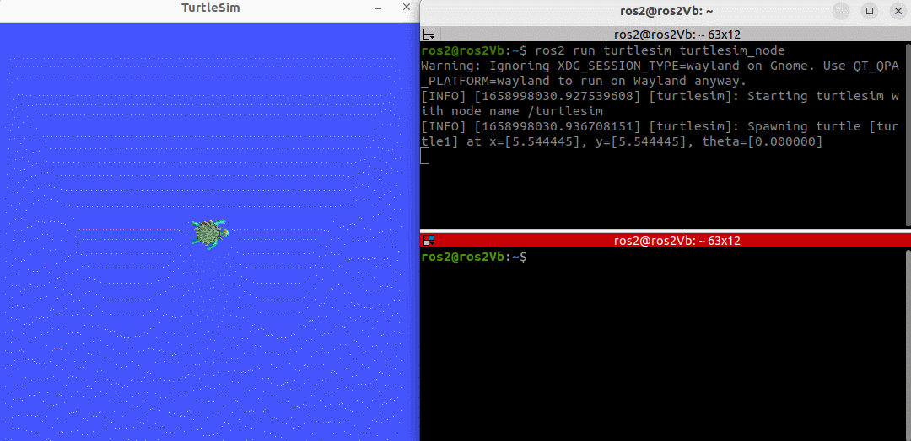

**示例2：**使用rqt在turtlesim\_node中生成一只新乌龟。

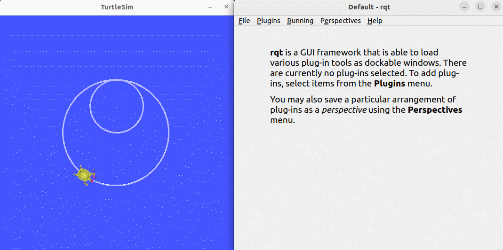


<font size=4>**5.launch文件**</font>

通过launch文件，可以批量的启动ROS2节点，这是在构建大型项目时启动多节点的常用方式。

**示例：**一次性启动多个turtlesim\_node节点。

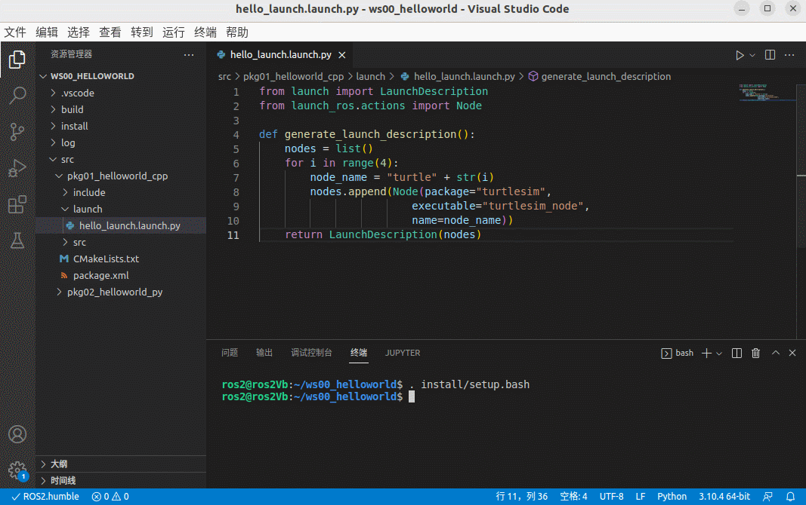


<font size=4>**6.TF坐标变换**</font>

TF坐标变换可以实现机器人不同部件或不同机器人之间的相对位置关系的转换。

**示例1：**发布机器人不同部件之间的坐标系关系。

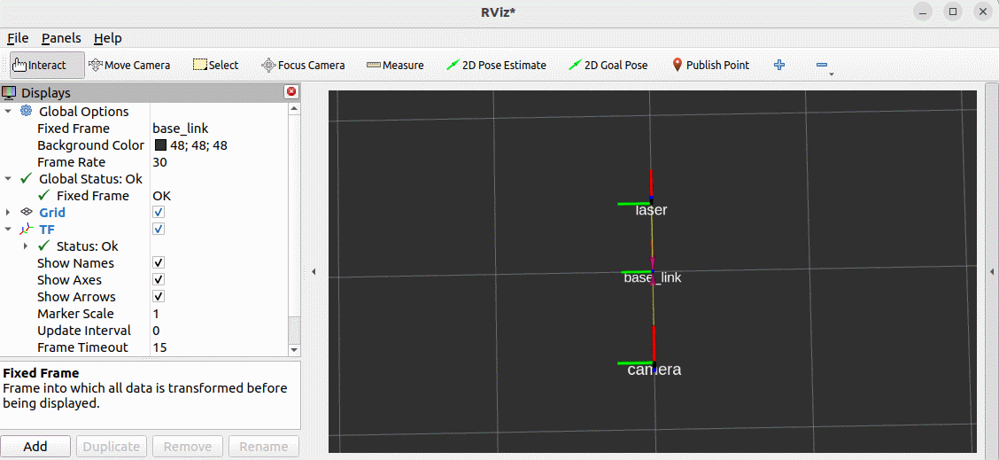

**示例2：**使用turtlesim\_node模拟多机器人编队。

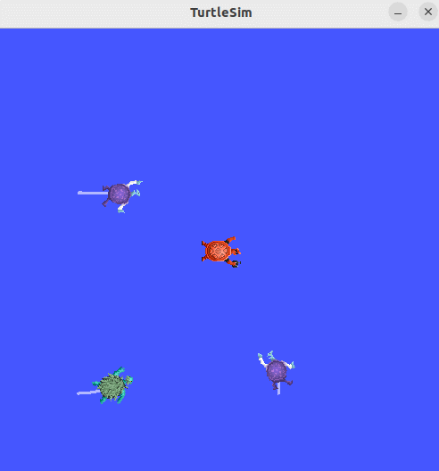


<font size=4>**7.可视化**</font>

ROS2内置了三维可视化工具rviz2，它可以图形化的方式显示机器人模型或显示机器人系统中的一些抽象数据。

**示例1：**显示传感器数据。

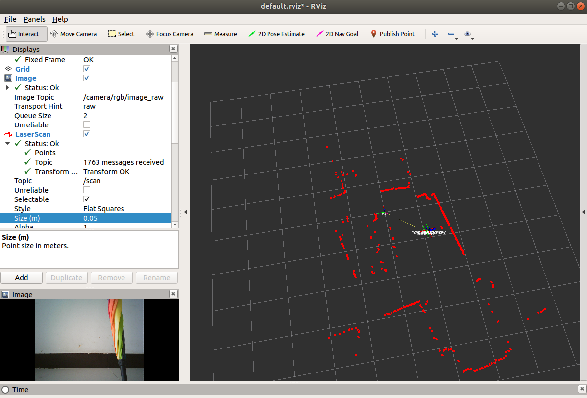

**示例2：**显示机器人模型。

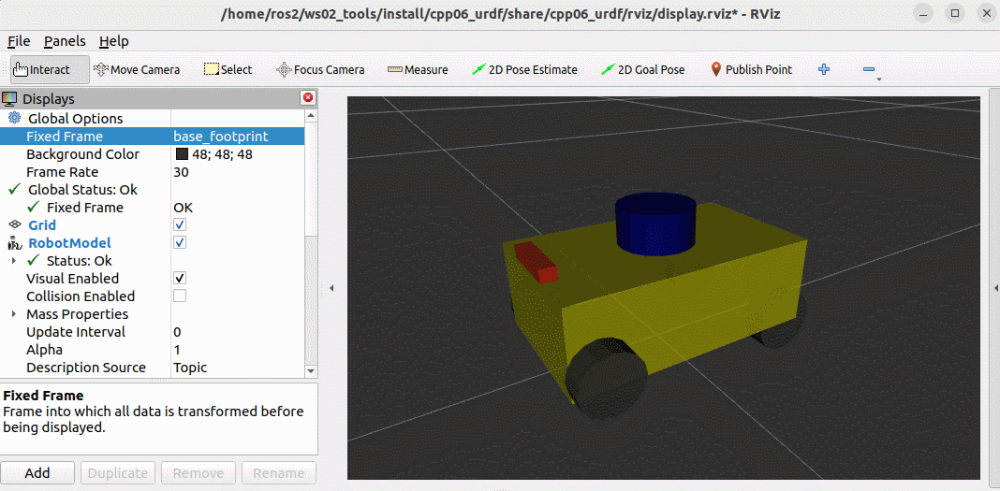


### 1.5.3 ROS2技术支持

ROS社区提供了多种技术支持机制，主要包括：包文档、问答、论坛、包索引以及问题跟踪，每种机制都有自己的用途，合适的选择技术支持机制可以避免问题的重复提问、减少问题解决时间并对新思想的交流很有帮助。


<font size=4>**ROS包文档**</font>

ROS核心包的文档以及包的特定内容托管在[ROS包文档](https://docs.ros.org/)上，可以查找到ROS的官方教程、文档和API文档。


<font size=4>**ROS问答求**</font>

如果在学习和工作中，遇到解决不了的问题，那么可以访问[ROS问答](https://answers.ros.org/questions/)，在ROS问答模块已经涉及到60000多个问题且大部分都给出了答案。开发者可以先搜索遇到的问题，如果该问题尚未提出，那么可以自行发布相关问题（在发布之前请先查看问题发布指南）。


<font size=4>**ROS论坛**</font>

在[ROS论坛](https://discourse.ros.org/)我们可以了解ROS社区的最新动态。请注意：论坛是发布公告、新闻和讨论共同爱好的地方，请不要在此提出技术问题或提交异常报告。


<font size=4>**ROS包索引**</font>

在[ROS包索引](https://index.ros.org/)可以查找特定功能包的信息。


<font size=4>**问题跟踪器**</font>

当用户发现系统BUG或者想请求新功能时，可以在[问题跟踪器](https://github.com/ros2/ros2/issues)上提交报告。如果是报告BUG，那么请务必提供问题的详细描述、问题产生的环境以及可能有助于开发人员重现问题的任何细节，最好能够提供调试回溯。

------

除了上述多种技术支持之外，ROS社区还会举办一年一度的[ROSCon](https://roscon.ros.org/)（ROS开发者大会），ROSCon为所有级别的 ROS 开发人员（从初学者到专家）提供了一个机会，所有的开发者可以建立联系、相互学习、分享想法或是向专家请教。ROSCon一般为期两天，主要包括技术讲座和一些ROS教程，期间将介绍新的工具和库，也会介绍已有的工具和库的深层次知识。

ROS官方的目标是让ROSCon代表整个ROS社区，这个社区是全球性和多样化的。无论你是谁，无论你做什么，无论在哪，只要对ROS感兴趣，那么都希望能够加入ROSCon。尤其鼓励女性、少数派成员和其他不具代表性的群体成员参加ROSCon。


### 1.5.4 ROS2应用方向

许多ROS团队伴随ROS成长到今日，其规模已经发展到足以被认为是独立组织的程度了。在导航、机械臂、无人驾驶、无人机等诸多领域大放异彩，下面列出了其中的一些团队项目，这些项目对我们以后的进阶发展，也提供了指导。

---


<font size=4>**NAV2**</font>

[Nav2](https://navigation.ros.org/)项目继承自ROS Navigation Stack。该项目旨在可以让移动机器人从A点安全的移动到B点。它也可以应用于涉及机器人导航的其他应用，例如跟随动态点。Nav2将用于实现路径规划、运动控制、动态避障和恢复行为等一系列功能。

---


<font size=4>**OpenCV**</font>

[OpenCV](https://opencv.org/)（Open Source Computer Vision Library）是一个开源的计算机视觉和机器学习软件库。OpenCV旨在为计算机视觉应用程序提供通用基础架构，并加速机器感知在商业产品中的使用。OpenCV允许企业轻松地使用和修改代码。

---


<font size=4>**MoveIt**</font>

[MoveIt](https://moveit.ros.org/)是一组ROS软件包， 主要包含运动规划、碰撞检测、运动学、3D感知、操作控制等功能。它可以用于构建机械臂的高级行为。MoveIt现在可以用于市面上的大多数机械臂，并被许多大公司使用。

---


<font size=4>**The Autoware Foundation**</font>

[Autoware Foundation](https://www.autoware.org/)是ROS下属的非营利组织，支持实现自动驾驶的开源项目。Autoware基金会在企业发展和学术研究之间创造协同效应，为每个人提供自动驾驶技术。

---


<font size=4>**F1 Tenth**</font>

[F1 Tenth](https://f1tenth.org/)是将模型车改为无人车的竞速赛事，是一个由研究人员、工程师和自主系统爱好者组成的国际社区。它最初于 2016 年在宾夕法尼亚大学成立，但后来扩展到全球许多其他机构。

---


<font size=4>**microROS**</font>

在基于ROS的机器人应用中，[micro-ROS](https://micro.ros.org/)正在弥合性能有限的微控制器和一般处理器之间的差距。micro-ROS在各种嵌入式硬件上运行，使ROS能直接应用于机器人硬件。

---


<font size=4>**Open Robotics**</font>

[Open Robotics](https://www.openrobotics.org/)与全球ROS社区合作，为机器人创建开放的软件和硬件平台，包括 ROS1、ROS2、Gazebo模拟器和Ignition模拟器。Open Robotics使用这些平台解决一些重要问题，并通过为各种客户组织提供软件和硬件开发服务来帮助其他人做同样的事情。

---


<font size=4>**PX4**</font>

[PX4](https://px4.io/)是一款用于无人机和其他无人驾驶车辆的开源飞行控制软件。该项目为无人机开发人员提供了一套灵活的工具，用于共享技术并为无人机应用程序创建量身定制解决方案。

---


<font size=4>**ROS-Industrial**</font>

[ROS-Industrial](https://rosindustrial.org/)是一个开源项目，将 ROS 软件的高级功能扩展到工业相关硬件和应用程序。


## 1.6 本章小结

本章主要介绍了ROS2的相关概念以及ROS2的环境搭建。

概念相关知识点如下：

* ROS2概念、发展历程、组成体系以及在机器人领域的优势；
* ROS2体系框架：文件系统、核心模块、技术支持、应用方向。

环境搭建相关知识点如下：

* ROS2安装与测试；
* ROS2的“helloworld”实现；
* ROS2集成开发环境搭建；

在概念部分，我们以时间轴为参考介绍了ROS2的发展历程，以空间轴为参考介绍了ROS2的组成体系，又分别在横向和纵向两个维度介绍了ROS2在机器人研发领域的优势。关于ROS2的体系框架则又分别立足微观和宏观的角度介绍了关于ROS2的学习内容，介绍了行业的可发展方向。

在环境搭建部分，则介绍了ROS2的具体安装流程。通过helloworld程序，了解了ROS2程序的编写、编译和执行流程。最后还介绍了如何使用VSCode搭建对开发者友好的集成开发环境。至此，ROS2的大门已经敞开，向着未来扬帆起航吧，good luck！


# 第2章 ROS2通信机制核心

机器人是一种高度复杂的系统性实现，一个完整的机器人应用程序可能由若干功能模块组成，每个功能模块可能又包含若干功能点，在不同功能模块、不同功能点之间需要频繁的进行数据交互。比如以导航中的路径规划模块为例：

> - 路径规划时就需要其他功能模块输入数据，并输出数据以被其他模块调用。
> - 输入的数据有地图服务提供的地图数据、定位模块提供的机器人位姿数据、人机交互模块提供的目标点数据......。
> - 输出的路径信息则被运动控制订阅或是回显在人机交互界面上。

那么这些相对独立的功能模块或功能点之间是如何实现数据交互的呢？在此，我们就需要介绍一下ROS2中的通信机制了。


<font size=4>**本章概览**</font>

| **章节**         | **学习内容**                                 | **学习收获**                                                 |
| :--------------- | :------------------------------------------- | :----------------------------------------------------------- |
| 2.1 通信机制简介 | 通信机制中涉及的术语。                       | 能够理解ROS2通信中的节点、话题、接口等常用术语以及不同通信模型的数据交互流程。 |
| 2.2 话题通信     | 话题通信的概念、作用、应用场景以及编码实现。 | 能够理解话题通信的应用场景，涉及的常用概念(发布方、订阅方、消息接口、话题...)，并可以掌握其实现流程，编写C++和Python代码实现。 |
| 2.3 服务通信     | 服务通信的概念、作用、应用场景以及编码实现。 | 能够理解服务通信的应用场景，涉及的常用概念(服务端、客户端、服务接口、话题...)，并可以掌握其实现流程，编写C++和Python代码实现。 |
| 2.4 动作通信     | 动作通信的概念、作用、应用场景以及编码实现。 | 能够理解动作通信的应用场景，涉及的常用概念(动作服务端、动作客户端、动作接口、话题...)，并可以掌握其实现流程，编写C++和Python代码实现。 |
| 2.5 参数服务     | 参数服务的概念、作用、应用场景以及编码实现。 | 能够理解参数服务的应用场景，并可以掌握其实现流程，编写C++和Python代码实现。 |
| 2.6 本章小结     | 知识点汇总。                                 | 知识点回顾。                                                 |


<font size=4>**案例演示**</font>

**案例1：**话题通信示例——发布订阅简单的文本消息。

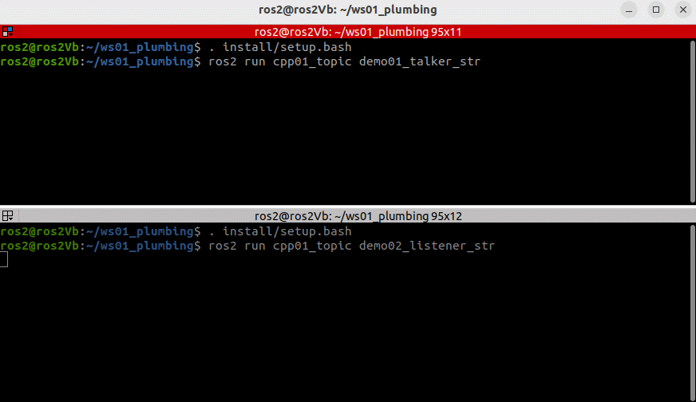


**案例2：**话题通信示例——发布自定义消息。

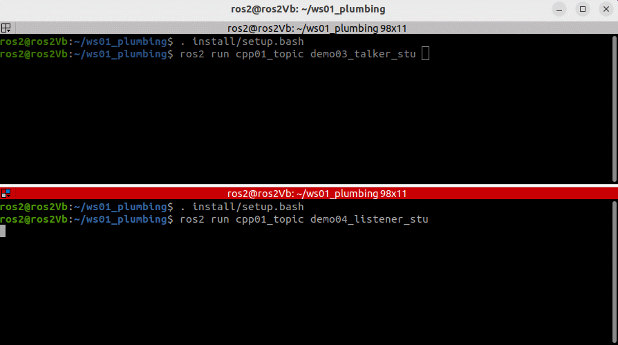


**案例3：**服务通信示例——求和。

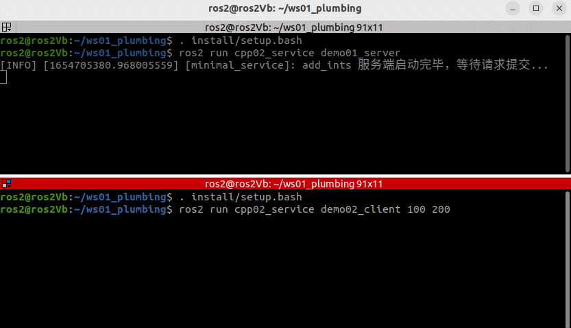


**案例4：**动作通信示例——带有连续反馈的求和。

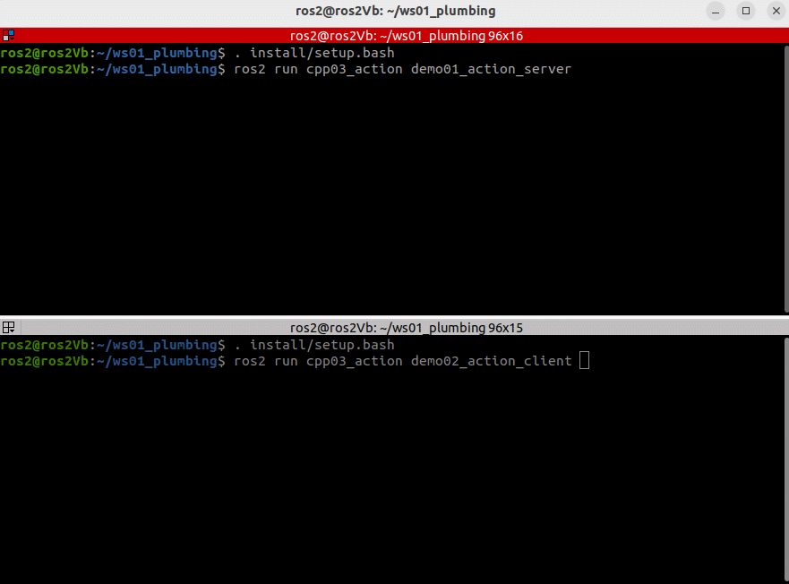


**案例5：**参数操作示例。

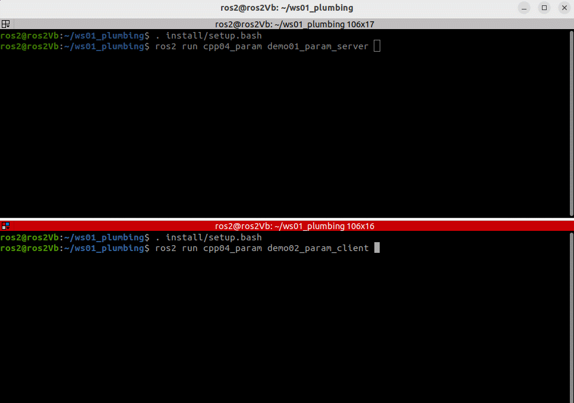


## 2.1 通信机制简介

在ROS2中通信方式虽然有多种，但是不同通信方式的组成要素都是类似的，比如：通信是双方或多方行为、通信时都需要将不同的通信对象关联、都有各自的模型、交互数据时也必然涉及到数据载体等等。本节将会介绍通信中涉及到的一些术语。


<font size=4>**1.节点**</font>

在通信时，不论采用何种方式，通信对象的构建都依赖于节点\(Node\)，在ROS2中，一般情况下每个节点都对应某一单一的功能模块\(例如：雷达驱动节点可能负责发布雷达消息，摄像头驱动节点可能负责发布图像消息\)。一个完整的机器人系统可能由许多协同工作的节点组成，ROS2中的单个可执行文件\(C++程序或Python程序\)可以包含一个或多个节点。


<font size=4>**2.话题**</font>

话题\(Topic\)是一个纽带，具有相同话题的节点可以关联在一起，而这正是通信的前提。并且ROS2是跨语言的，有的节点可能是使用C++实现，有的节点可能是使用Python实现的，但是只要二者使用了相同的话题，就可以实现数据的交互。


<font size=4>**3.通信模型**</font>

不同的通信对象通过话题关联到一起之后，以何种方式实现通信呢？在ROS2中，常用的通信模型有四种：

**1.话题通信：**是一种单向通信模型，在通信双方中，发布方发布数据，订阅方订阅数据，数据流单向的由发布方传输到订阅方。

**2.服务通信：**是一种基于请求响应的通信模型，在通信双方中，客户端发送请求数据到服务端，服务端响应结果给客户端。

**3.动作通信：**是一种带有连续反馈的通信模型，在通信双方中，客户端发送请求数据到服务端，服务端响应结果给客户端，但是在服务端接收到请求到产生最终响应的过程中，会发送连续的反馈信息到客户端。

**4.参数服务：**是一种基于共享的通信模型，在通信双方中，服务端可以设置数据，而客户端可以连接服务端并操作服务端数据。


<font size=4>**4.接口**</font>

在通信过程中，需要传输数据，就必然涉及到数据载体，也即要以特定格式传输数据。在ROS2中，数据载体称之为接口\(interfaces\)。通信时使用的数据载体一般需要使用接口文件定义。常用的接口文件有三种：msg文件、srv文件与action文件。每种文件都可以按照一定格式定义特定数据类型的“变量”。


<font size=4>**4.1 msg文件**</font>

msg文件是用于定义话题通信中数据载体的接口文件，一个典型的 `.msg` 文件示例如下。

```cpp
int64 num1
int64 num2
```

在文件中声明了一些被传输的类似于C++变量的数据。


<font size=4>**4.2 srv文件**</font>

srv文件是用于定义服务通信中数据载体的接口文件，一个典型的 `.srv` 文件示例如下。

```cpp
int64 num1
int64 num2
---
int64 sum
```

文件中声明的数据被`---`分割为两部分，上半部分用于声明请求数据，下半部分用于声明响应数据。


<font size=4>**4.3 action文件**</font>

action文件使用用于定义动作通信中数据载体的接口文件，一个典型的 `.action` 文件示例如下。

```cpp
int64 num
---
int64 sum
---
float64 progress
```

文件中声明的数据被`---`分割为三部分，上半部分用于声明请求数据，中间部分用于声明响应数据，下半部分用于声明连续反馈数据。


<font size=4>**4.4 变量类型**</font>

不管是何种接口文件，在文件中每行声明的数据都由字段类型和字段名称组成，可以使用的字段类型有：

* int8, int16, int32, int64 \(或者无符号类型: uint\*\)

* float32, float64

* string

* time, duration

* 其他msg文件

* 变长数组和定长数组

ROS中还有一种特殊类型：`Header`，标头包含时间戳和ROS2中常用的坐标帧信息。许多接口文件的第一行包含`Header`标头。

另外，需要说明的是：

> 参数通信的数据无需定义接口文件，参数通信时数据会被封装为参数对象，参数客户端和服务端操作的都是参数对象。

本阶段大家对数据载体做简单的了解即可，其具体使用后续章节有详细介绍。

---


<font size=4>**准备工作**</font>

1.请先创建工作空间 `ws01_plumbing`，本章以及第3章代码部分内容存储在该工作空间下。

2.实际应用中一般建议创建专门的接口功能包定义接口文件，当前教程也遵循这一建议，预先创建教程所需使用的接口功能包\(需要注意的是，目前为止无法在Python功能包中定义接口文件\)，终端下进入工作空间的`src`目录，执行如下命令：

```
ros2 pkg create --build-type ament_cmake base_interfaces_demo
```

该功能包将用于保存本章教程中自定义的接口文件。


## 2.2 话题通信

<font size=4>**场景**</font>

话题通信是ROS中使用频率最高的一种通信模式，话题通信是基于**发布订阅**模式的，也即：一个节点发布消息，另一个节点订阅该消息。话题通信的应用场景也极其广泛，比如如下场景：

> 机器人在执行导航功能，使用的传感器是激光雷达，机器人会采集激光雷达感知到的信息并计算，然后生成运动控制信息驱动机器人底盘运动。

在该场景中，就不止一次使用到了话题通信。

* 以激光雷达信息的采集处理为例，在ROS中有一个节点需要时时的发布当前雷达采集到的数据，导航模块中也有节点会订阅并解析雷达数据。
* 再以运动消息的发布为例，导航模块会综合多方面数据实时计算出运动控制信息并发布给底盘驱动模块，底盘驱动有一个节点订阅运动信息并将其转换成控制电机的脉冲信号。

以此类推，像雷达、摄像头、GPS.... 等等一些传感器数据的采集，也都是使用了话题通信，话题通信适用于不断更新的数据传输相关的应用场景。

话题通信是ROS中使用频率最高的一种通信模式，话题通信是基于**发布订阅**模式的，也即：一个节点发布消息，另一个节点订阅该消息。话题通信的应用场景也极其广泛，比如如下场景：

> 机器人在执行导航功能，使用的传感器是激光雷达，机器人会采集激光雷达感知到的信息并计算，然后生成运动控制信息驱动机器人底盘运动。

在该场景中，就不止一次使用到了话题通信。

* 以激光雷达信息的采集处理为例，在ROS中有一个节点需要时时的发布当前雷达采集到的数据，导航模块中也有节点会订阅并解析雷达数据。
* 再以运动消息的发布为例，导航模块会综合多方面数据实时计算出运动控制信息并发布给底盘驱动模块，底盘驱动有一个节点订阅运动信息并将其转换成控制电机的脉冲信号。

以此类推，像雷达、摄像头、GPS.... 等等一些传感器数据的采集，也都是使用了话题通信，话题通信适用于不断更新的数据传输相关的应用场景。


<font size=4>**概念**</font>

话题通信是一种以发布订阅的方式实现不同节点之间数据传输的通信模型。数据发布对象称为发布方，数据订阅对象称之为订阅方，发布方和订阅方通过话题相关联，发布方将消息发布在话题上，订阅方则从该话题订阅消息，消息的流向是单向的。

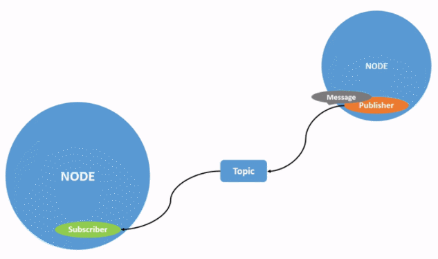

话题通信的发布方与订阅方是一种多对多的关系，也即，同一话题下可以存在多个发布方，也可以存在多个订阅方，这意味着数据会出现交叉传输的情况，当然如果没有订阅方，数据传输也会出现丢失的情况。

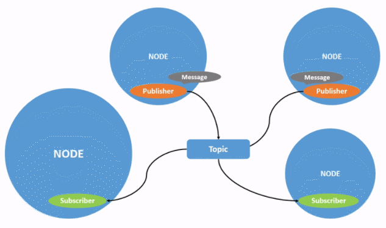


<font size=4>**作用**</font>

话题通信一般应用于不断更新的、少逻辑处理的数据传输场景。


<font size=4>**关于消息接口**</font>

关于消息接口的使用有多种方式：

1. 在ROS2中通过std\_msgs包封装了一些原生的数据类型,比如：String、Int8、Int16、Int32、Int64、Float32、Float64、Char、Bool、Empty.... 这些原生数据类型也可以作为话题通信的载体，不过这些数据一般只包含一个 data 字段，而std\_msgs包中其他的接口文件也比较简单，结构的单一意味着功能上的局限性，当传输一些结构复杂的数据时，就显得力不从心了；
2. 在ROS2中还预定义了许多标准话题消息接口，这在实际工作中有着广泛的应用，比如：sensor\_msgs包中定义了许多关于传感器消息的接口（雷达、摄像头、点云......），geometry\_msgs包中则定义了许多几何消息相关的接口（坐标点、坐标系、速度指令......）；
3. 如果上述接口文件都不能满足我们的需求，那么就可以自定义接口消息；

具体如何选型，大家可以根据具体情况具体分析。


### 2.2.1 案例以及案例分析


<font size=4>**1.案例需求**</font>

**需求1：**编写话题通信实现，发布方以某个频率发布一段文本，订阅方订阅消息，并输出在终端。


**需求2：**编写话题通信实现，发布方以某个频率发布自定义接口消息，订阅方订阅消息，并输出在终端。


<font size=4>**2.案例分析**</font>

在上述案例中，需要关注的要素有三个：

1. 发布方；
2. 订阅方；
3. 消息载体。

案例1和案例2的主要区别在于消息载体，前者可以使用原生的数据类型，后者需要自定义接口消息。


<font size=4>**3.流程简介**</font>

案例2需要先自定义接口消息，除此之外的实现流程与案例1一致，主要步骤如下：

1. 编写发布方实现；
2. 编写订阅方实现；
3. 编辑配置文件；
4. 编译；
5. 执行。

案例我们会采用C++和Python分别实现，二者都遵循上述实现流程。


<font size=4>**4.准备工作**</font>

终端下进入工作空间的src目录，调用如下两条命令分别创建C++功能包和Python功能包。

```sh
ros2 pkg create cpp01_topic --build-type ament_cmake --dependencies rclcpp std_msgs base_interfaces_demo
ros2 pkg create py01_topic --build-type ament_python --dependencies rclpy std_msgs base_interfaces_demo
```


### 2.2.2 话题通信之原生消息（C++）

<font size=4>**1.发布方实现**</font>

功能包cpp01\_topic的src目录下，新建C++文件demo01\_talker\_str.cpp，并编辑文件，输入如下内容：

```cpp
/*  
  需求：以某个固定频率发送文本“hello world!”，文本后缀编号，每发送一条消息，编号递增1。
  步骤：
    1.包含头文件；
    2.初始化 ROS2 客户端；
    3.定义节点类；
      3-1.创建发布方；
      3-2.创建定时器；
      3-3.组织消息并发布。
    4.调用spin函数，并传入节点对象指针；
    5.释放资源。
*/

// 1.包含头文件；
#include "rclcpp/rclcpp.hpp"
#include "std_msgs/msg/string.hpp"

using namespace std::chrono_literals;

// 3.定义节点类；
class MinimalPublisher : public rclcpp::Node
{
  public:
    MinimalPublisher()
    : Node("minimal_publisher"), count_(0)
    {
      // 3-1.创建发布方；
      publisher_ = this->create_publisher<std_msgs::msg::String>("topic", 10);
      // 3-2.创建定时器；
      timer_ = this->create_wall_timer(500ms, std::bind(&MinimalPublisher::timer_callback, this));
    }

  private:
    void timer_callback()
    {
      // 3-3.组织消息并发布。
      auto message = std_msgs::msg::String();
      message.data = "Hello, world! " + std::to_string(count_++);
      RCLCPP_INFO(this->get_logger(), "发布的消息：'%s'", message.data.c_str());
      publisher_->publish(message);
    }
    rclcpp::TimerBase::SharedPtr timer_;
    rclcpp::Publisher<std_msgs::msg::String>::SharedPtr publisher_;
    size_t count_;
};

int main(int argc, char * argv[])
{
  // 2.初始化 ROS2 客户端；
  rclcpp::init(argc, argv);
  // 4.调用spin函数，并传入节点对象指针。
  rclcpp::spin(std::make_shared<MinimalPublisher>());
  // 5.释放资源；
  rclcpp::shutdown();
  return 0;
}
```


<font size=4>**2.订阅方实现**</font>

功能包cpp01\_topic的src目录下，新建C++文件demo02\_listener\_str.cpp，并编辑文件，输入如下内容：

```cpp
/*  
    需求：订阅发布方发布的消息，并输出到终端。
    步骤：
        1.包含头文件；
        2.初始化 ROS2 客户端；
        3.定义节点类；
            3-1.创建订阅方；
            3-2.处理订阅到的消息。
        4.调用spin函数，并传入节点对象指针；
        5.释放资源。
*/

// 1.包含头文件；
#include "rclcpp/rclcpp.hpp"
#include "std_msgs/msg/string.hpp"
using std::placeholders::_1;

// 3.定义节点类；
class MinimalSubscriber : public rclcpp::Node
{
  public:
    MinimalSubscriber()
    : Node("minimal_subscriber")
    {
      // 3-1.创建订阅方；
      subscription_ = this->create_subscription<std_msgs::msg::String>("topic", 10, std::bind(&MinimalSubscriber::topic_callback, this, _1));
    }

  private:
    // 3-2.处理订阅到的消息；
    void topic_callback(const std_msgs::msg::String & msg) const
    {
      RCLCPP_INFO(this->get_logger(), "订阅的消息： '%s'", msg.data.c_str());
    }
    rclcpp::Subscription<std_msgs::msg::String>::SharedPtr subscription_;
};

int main(int argc, char * argv[])
{
  // 2.初始化 ROS2 客户端；
  rclcpp::init(argc, argv);
  // 4.调用spin函数，并传入节点对象指针。
  rclcpp::spin(std::make_shared<MinimalSubscriber>());
  // 5.释放资源；
  rclcpp::shutdown();
  return 0;
}
```


<font size=4>**3.编辑配置文件**</font>

在C++功能包中，配置文件主要关注package.xml与CMakeLists.txt。


<font size=4>**3.1 package.xml**</font>

在创建功能包时，所依赖的功能包已经自动配置了，配置内容如下：

```XML
<depend>rclcpp</depend>
<depend>std_msgs</depend>
<depend>base_interfaces_demo</depend>
```

需要说明的是 `<depend>base_interfaces_demo</depend>` 在本案例中不是必须的。


<font size=4>**3.2 CMakeLists.txt**</font>

CMakeLists.txt中发布和订阅程序核心配置如下：

```cmake
find_package(rclcpp REQUIRED)
find_package(std_msgs REQUIRED)
find_package(base_interfaces_demo REQUIRED)

add_executable(demo01_talker_str src/demo01_talker_str.cpp)
ament_target_dependencies(
  demo01_talker_str
  "rclcpp"
  "std_msgs"
)

add_executable(demo02_listener_str src/demo02_listener_str.cpp)
ament_target_dependencies(
  demo02_listener_str
  "rclcpp"
  "std_msgs"
)

install(TARGETS 
  demo01_talker_str
  demo02_listener_str
  DESTINATION lib/${PROJECT_NAME})
```


<font size=4>**4.编译**</font>

终端中进入当前工作空间，编译功能包：

```sh
colcon build --packages-select cpp01_topic
```


<font size=4>**5.执行**</font>

当前工作空间下，启动两个终端，终端1执行发布程序，终端2执行订阅程序。

终端1输入如下指令：

```sh
. install/setup.bash
ros2 run cpp01_topic demo01_talker_str
```

终端2输入如下指令：

```sh
. install/setup.bash 
ros2 run cpp01_topic demo02_listener_str
```

最终运行结果与案例1类似。


### 2.2.3 话题通信之原生消息（Python）

<font size=4>**1.发布方实现**</font>

功能包py01_topic的py01_topic目录下，新建Python文件demo01_talker_str_py.py，并编辑文件，输入如下内容：

```py
"""  
    需求：以某个固定频率发送文本“hello world!”，文本后缀编号，每发送一条消息，编号递增1。
    步骤：
        1.导包；
        2.初始化 ROS2 客户端；
        3.定义节点类；
            3-1.创建发布方；
            3-2.创建定时器；
            3-3.组织消息并发布。
        4.调用spin函数，并传入节点对象；
        5.释放资源。
"""
# 1.导包；
import rclpy
from rclpy.node import Node
from std_msgs.msg import String


# 3.定义节点类；
class MinimalPublisher(Node):

    def __init__(self):
        super().__init__('minimal_publisher_py')
        # 3-1.创建发布方；
        self.publisher_ = self.create_publisher(String, 'topic', 10)
        # 3-2.创建定时器；
        timer_period = 0.5 
        self.timer = self.create_timer(timer_period, self.timer_callback)
        self.i = 0

    # 3-3.组织消息并发布。
    def timer_callback(self):
        msg = String()
        msg.data = 'Hello World(py): %d' % self.i
        self.publisher_.publish(msg)
        self.get_logger().info('发布的消息: "%s"' % msg.data)
        self.i += 1


def main(args=None):
    # 2.初始化 ROS2 客户端；
    rclpy.init(args=args)
    # 4.调用spin函数，并传入节点对象；
    minimal_publisher = MinimalPublisher()
    rclpy.spin(minimal_publisher)
    # 5.释放资源。
    rclpy.shutdown()


if __name__ == '__main__':
    main()
```


<font size=4>**2.订阅方实现**</font>

功能包py01_topic的py01_topic目录下，新建Python文件demo02_listener_str_py.py，并编辑文件，输入如下内容：

```py
"""  
    需求：订阅发布方发布的消息，并输出到终端。
    步骤：
        1.导包；
        2.初始化 ROS2 客户端；
        3.定义节点类；
            3-1.创建订阅方；
            3-2.处理订阅到的消息。
        4.调用spin函数，并传入节点对象；
        5.释放资源。
"""

# 1.导包；
import rclpy
from rclpy.node import Node
from std_msgs.msg import String


# 3.定义节点类；
class MinimalSubscriber(Node):

    def __init__(self):
        super().__init__('minimal_subscriber_py')
        # 3-1.创建订阅方；
        self.subscription = self.create_subscription(
            String,
            'topic',
            self.listener_callback,
            10)
        self.subscription  

    # 3-2.处理订阅到的消息。
    def listener_callback(self, msg):
        self.get_logger().info('订阅的消息: "%s"' % msg.data)


def main(args=None):
    # 2.初始化 ROS2 客户端；
    rclpy.init(args=args)

    # 4.调用spin函数，并传入节点对象；
    minimal_subscriber = MinimalSubscriber()
    rclpy.spin(minimal_subscriber)

    # 5.释放资源。
    rclpy.shutdown()


if __name__ == '__main__':
    main()
```


<font size=4>**3.编辑配置文件**</font>

在Python功能包中，配置文件主要关注package.xml与setup.py。


<font size=4>**3.1 package.xml**</font>

在创建功能包时，所依赖的功能包已经自动配置了，配置内容如下：

```XML
<depend>rclcpp</depend>
<depend>std_msgs</depend>
<depend>base_interfaces_demo</depend>
```

需要说明的是和上一节C++实现一样`<depend>base_interfaces_demo</depend>`在本案例中不是必须的。


<font size=4>**3.2 setup.py**</font>

`entry_points` 字段的 `console_scripts `中添加如下内容：

```py
entry_points={
    'console_scripts': [
        'demo01_talker_str_py = py01_topic.demo01_talker_str_py:main',
        'demo02_listener_str_py = py01_topic.demo02_listener_str_py:main'
    ],
},
```


<font size=4>**4.编译**</font>

终端中进入当前工作空间，编译功能包：

```sh
colcon build --packages-select py01_topic
```


<font size=4>**5.执行**</font>

当前工作空间下，启动两个终端，终端1执行发布程序，终端2执行订阅程序。

终端1输入如下指令：

```sh
. install/setup.bash
ros2 run py01_topic demo01_talker_str_py
```

终端2输入如下指令：

```sh
. install/setup.bash 
ros2 run py01_topic demo02_listener_str_py
```

最终运行结果与案例1类似。


### 2.2.4 话题通信自定义接口消息

自定义接口消息的流程与在功能包中编写可执行程序的流程类似，主要步骤如下：

1. 创建并编辑 `.msg`文件；
2. 编辑配置文件；
3. 编译；
4. 测试。

接下来，我们可以参考案例2编译一个msg文件，该文件中包含学生的姓名、年龄、身高等字段。


<font size=4>**1.创建并编辑 .msg 文件**</font>

功能包base\_interfaces\_demo下新建 msg 文件夹，msg文件夹下新建Student.msg文件，文件中输入如下内容：

```cpp
string   name
int32    age
float64  height
```


<font size=4>**2.编辑配置文件**</font>

<font size=4>**2.1 package.xml文件**</font>

在package.xml中需要添加一些依赖包，具体内容如下：

```xml
<build_depend>rosidl_default_generators</build_depend>
<exec_depend>rosidl_default_runtime</exec_depend>
<member_of_group>rosidl_interface_packages</member_of_group>
```


<font size=4>**2.2 CMakeLists.txt文件**</font>

为了将`.msg`文件转换成对应的C++和Python代码，还需要在CMakeLists.txt中添加如下配置：

```cmake
find_package(rosidl_default_generators REQUIRED)

rosidl_generate_interfaces(${PROJECT_NAME}
  "msg/Student.msg"
)
```


<font size=4>**3.编译**</font>

终端中进入当前工作空间，编译功能包：

```sh
colcon build --packages-select base_interfaces_demo
```


<font size=4>**4.测试**</font>

编译完成之后，在工作空间下的install目录下将生成`Student.msg`文件对应的C++和Python文件，我们也可以在终端下进入工作空间，通过如下命令查看文件定义以及编译是否正常：

```sh
. install/setup.bash
ros2 interface show base_interfaces_demo/msg/Student
```

正常情况下，终端将会输出与`Student.msg`文件一致的内容。

---


### 2.2.5 话题通信之自定义消息（C++）

**准备**

> C++文件中包含自定义消息相关头文件时，可能会抛出异常，可以配置VSCode中c\_cpp\_properties.json文件，在文件中的 includePath属性下添加一行："${workspaceFolder}/install/base\_interfaces\_demo/include/\*\*"
>
> 添加完毕后，包含相关头文件时，就不会抛出异常了，其他接口文件或接口包的使用也与此同理。


<font size=4>**1.发布方实现**</font>

功能包cpp01\_topic的src目录下，新建C++文件demo01\_talker\_stu.cpp，并编辑文件，输入如下内容：

```cpp
/*  
  需求：以某个固定频率发送文本学生信息，包含学生的姓名、年龄、身高等数据。
*/

// 1.包含头文件；
#include "rclcpp/rclcpp.hpp"
#include "base_interfaces_demo/msg/student.hpp"

using namespace std::chrono_literals;
using base_interfaces_demo::msg::Student;
// 3.定义节点类；
class MinimalPublisher : public rclcpp::Node
{
  public:
    MinimalPublisher()
    : Node("student_publisher"), count_(0)
    {
      // 3-1.创建发布方；
      publisher_ = this->create_publisher<Student>("topic_stu", 10);
      // 3-2.创建定时器；
      timer_ = this->create_wall_timer(500ms, std::bind(&MinimalPublisher::timer_callback, this));
    }

  private:
    void timer_callback()
    {
      // 3-3.组织消息并发布。
      auto stu = Student();
      stu.name = "张三";
      stu.age = count_++;
      stu.height = 1.65;
      RCLCPP_INFO(this->get_logger(), "学生信息:name=%s,age=%d,height=%.2f", stu.name.c_str(),stu.age,stu.height);
      publisher_->publish(stu);

    }
    rclcpp::TimerBase::SharedPtr timer_;
    rclcpp::Publisher<Student>::SharedPtr publisher_;
    size_t count_;
};

int main(int argc, char * argv[])
{
  // 2.初始化 ROS2 客户端；
  rclcpp::init(argc, argv);
  // 4.调用spin函数，并传入节点对象指针。
  rclcpp::spin(std::make_shared<MinimalPublisher>());
  // 5.释放资源；
  rclcpp::shutdown();
  return 0;
}
```


<font size=4>**2.订阅方实现**</font>

功能包cpp01\_topic的src目录下，新建C++文件demo04\_listener\_stu.cpp，并编辑文件，输入如下内容：

```cpp
/*  
    需求：订阅发布方发布的学生消息，并输出到终端。
*/

// 1.包含头文件；
#include "rclcpp/rclcpp.hpp"
#include "base_interfaces_demo/msg/student.hpp"

using std::placeholders::_1;
using base_interfaces_demo::msg::Student;
// 3.定义节点类；
class MinimalSubscriber : public rclcpp::Node
{
  public:
    MinimalSubscriber()
    : Node("student_subscriber")
    {
      // 3-1.创建订阅方；
      subscription_ = this->create_subscription<Student>("topic_stu", 10, std::bind(&MinimalSubscriber::topic_callback, this, _1));
    }

  private:
    // 3-2.处理订阅到的消息；
    void topic_callback(const Student & msg) const
    {
      RCLCPP_INFO(this->get_logger(), "订阅的学生消息：name=%s,age=%d,height=%.2f", msg.name.c_str(),msg.age, msg.height);
    }
    rclcpp::Subscription<Student>::SharedPtr subscription_;
};

int main(int argc, char * argv[])
{
  // 2.初始化 ROS2 客户端；
  rclcpp::init(argc, argv);
  // 4.调用spin函数，并传入节点对象指针。
  rclcpp::spin(std::make_shared<MinimalSubscriber>());
  // 5.释放资源；
  rclcpp::shutdown();
  return 0;
}
```


<font size=4>**3.编辑配置文件**</font>

package.xml无需修改，CMakeLists.txt文件需要添加如下内容：

```cmake
add_executable(demo03_talker_stu src/demo03_talker_stu.cpp)
ament_target_dependencies(
  demo03_talker_stu
  "rclcpp"
  "std_msgs"
  "base_interfaces_demo"
)

add_executable(demo04_listener_stu src/demo04_listener_stu.cpp)
ament_target_dependencies(
  demo04_listener_stu
  "rclcpp"
  "std_msgs"
  "base_interfaces_demo"
)
```

文件中install修改为如下内容：

```cmake
install(TARGETS 
  demo01_talker_str
  demo02_listener_str
  demo03_talker_stu
  demo04_listener_stu
  DESTINATION lib/${PROJECT_NAME})
```


<font size=4>**4.编译**</font>

终端中进入当前工作空间，编译功能包：

```sh
colcon build --packages-select cpp01_topic
```


<font size=4>**5.执行**</font>

当前工作空间下，启动两个终端，终端1执行发布程序，终端2执行订阅程序。

终端1输入如下指令：

```sh
. install/setup.bash
ros2 run cpp01_topic demo03_talker_stu
```

终端2输入如下指令：

```sh
. install/setup.bash 
ros2 run cpp01_topic demo04_listener_stu
```

最终运行结果与案例2类似。

---


### 2.2.6 话题通信之自定义消息（Python）

**准备**

> Python文件中导入自定义消息相关的包时，为了方便使用，可以配置VSCode中settings.json文件，在文件中的python.autoComplete.extraPaths和python.analysis.extraPaths属性下添加一行："${workspaceFolder}/install/base\_interfaces\_demo/local/lib/python3.10/dist-packages"
>
> 添加完毕后，代码可以高亮显示且可以自动补齐，其他接口文件或接口包的使用也与此同理。

 

<font size=4>**1.发布方实现**</font>

功能包py01\_topic的py01\_topic目录下，新建Python文件demo03\_talker\_stu\_py.py，并编辑文件，输入如下内容：

```py
"""  
    需求：以某个固定频率发送文本学生信息，包含学生的姓名、年龄、身高等数据。
"""
# 1.导包；
import rclpy
from rclpy.node import Node
from base_interfaces_demo.msg import Student

# 3.定义节点类；
class MinimalPublisher(Node):

    def __init__(self):
        super().__init__('stu_publisher_py')
        # 3-1.创建发布方；
        self.publisher_ = self.create_publisher(Student, 'topic_stu', 10)
        # 3-2.创建定时器；
        timer_period = 0.5 
        self.timer = self.create_timer(timer_period, self.timer_callback)
        self.i = 0

    # 3-3.组织消息并发布。
    def timer_callback(self):
        stu = Student()
        stu.name = "李四"
        stu.age = self.i
        stu.height = 1.70
        self.publisher_.publish(stu)
        self.get_logger().info('发布的学生消息(py): name=%s,age=%d,height=%.2f' % (stu.name, stu.age, stu.height))
        self.i += 1


def main(args=None):
    # 2.初始化 ROS2 客户端；
    rclpy.init(args=args)
    # 4.调用spin函数，并传入节点对象；
    minimal_publisher = MinimalPublisher()
    rclpy.spin(minimal_publisher)
    # 5.释放资源。
    rclpy.shutdown()


if __name__ == '__main__':
    main()
```


<font size=4>**2.订阅方实现**</font>

功能包py01\_topic的py01\_topic目录下，新建Python文件demo04\_listener\_stu\_py.py，并编辑文件，输入如下内容：

```py
"""  
    需求：订阅发布方发布的学生消息，并输出到终端。
"""

# 1.导包；
import rclpy
from rclpy.node import Node
from base_interfaces_demo.msg import Student

# 3.定义节点类；
class MinimalSubscriber(Node):

    def __init__(self):
        super().__init__('stu_subscriber_py')
        # 3-1.创建订阅方；
        self.subscription = self.create_subscription(
            Student,
            'topic_stu',
            self.listener_callback,
            10)
        self.subscription  

    # 3-2.处理订阅到的消息。
    def listener_callback(self, stu):
        self.get_logger().info('订阅的消息(py): name=%s,age=%d,height=%.2f' % (stu.name, stu.age, stu.height))


def main(args=None):
    # 2.初始化 ROS2 客户端；
    rclpy.init(args=args)

    # 4.调用spin函数，并传入节点对象；
    minimal_subscriber = MinimalSubscriber()
    rclpy.spin(minimal_subscriber)

    # 5.释放资源。
    rclpy.shutdown()


if __name__ == '__main__':
    main()
```


<font size=4>**3.编辑配置文件**</font>

package.xml无需修改，需要修改setup.py文件，`entry_points`字段的`console_scripts`中修改为如下内容：

```py
entry_points={
    'console_scripts': [
        'demo01_talker_str_py = py01_topic.demo01_talker_str_py:main',
        'demo02_listener_str_py = py01_topic.demo02_listener_str_py:main',
        'demo03_talker_stu_py = py01_topic.demo03_talker_stu_py:main',
        'demo04_listener_stu_py = py01_topic.demo04_listener_stu_py:main'
    ],
},
```


<font size=4>**4.编译**</font>

终端中进入当前工作空间，编译功能包：

```sh
colcon build --packages-select py01_topic
```


<font size=4>**5.执行**</font>

当前工作空间下，启动两个终端，终端1执行发布程序，终端2执行订阅程序。

终端1输入如下指令：

```sh
. install/setup.bash
ros2 run py01_topic demo03_talker_stu_py
```

终端2输入如下指令：

```sh
. install/setup.bash 
ros2 run py01_topic demo04_listener_stu_py
```

最终运行结果与案例2类似。

---


## 2.3 服务通信

<font size=4>**场景**</font>

服务通信也是ROS中一种极其常用的通信模式，服务通信是基于**请求响应**模式的，是一种应答机制。也即：一个节点A向另一个节点B发送请求，B接收处理请求并产生响应结果返回给A。比如如下场景：

> 机器人巡逻过程中，控制系统分析传感器数据发现可疑物体或人... 此时需要拍摄照片并留存。

在上述场景中，就使用到了服务通信。

* 数据分析节点A需要向相机相关节点B发送图片存储请求，节点B处理请求，并返回处理结果。

与上述应用类似的，服务通信更适用于对实时性有要求、具有一定逻辑处理的应用场景。


<font size=4>**概念**</font>

服务通信是以请求响应的方式实现不同节点之间数据传输的通信模式。发送请求数据的对象称为客户端，接收请求并发送响应的对象称之为服务端，同话题通信一样，客户端和服务端也通过话题相关联，不同的是服务通信的数据传输是双向交互式的。

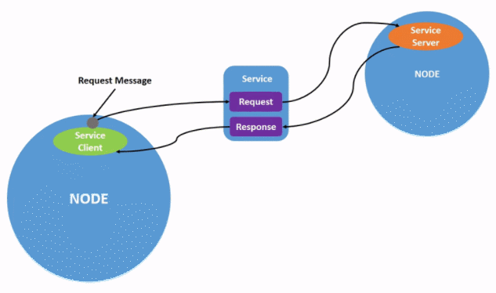

服务通信中，服务端与客户端是一对多的关系，也即，同一服务话题下，存在多个客户端，每个客户端都可以向服务端发送请求。

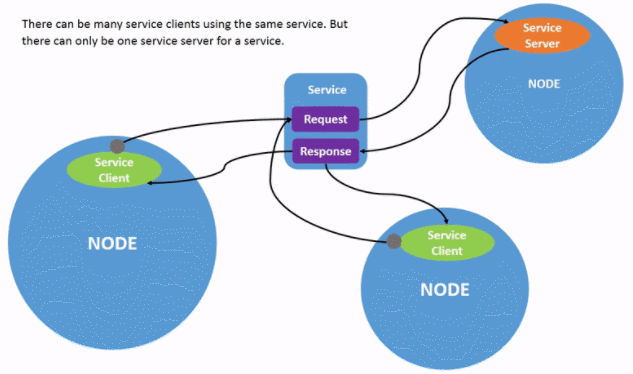


<font size=4>**作用**</font>

用于偶然的、对实时性有要求、有一定逻辑处理需求的数据传输场景。


### 2.3.1 案例以及案例分析

<font size=4>**1.案例需求**</font>

**需求：**编写服务通信，客户端可以提交两个整数到服务端，服务端接收请求并解析两个整数求和，然后将结果响应回客户端。


<font size=4>**2.案例分析**</font>

在上述案例中，需要关注的要素有三个：

1. 客户端；
2. 服务端；
3. 消息载体。


<font size=4>**3.流程简介**</font>

案例实现前需要先自定义服务接口，接口准备完毕后，服务实现主要步骤如下：

1. 编写服务端实现；
2. 编写客户端实现；
3. 编辑配置文件；
4. 编译；
5. 执行。

案例我们会采用C++和Python分别实现，二者都遵循上述实现流程。


<font size=4>**4.准备工作**</font>

终端下进入工作空间的src目录，调用如下两条命令分别创建C++功能包和Python功能包。

```
ros2 pkg create cpp02_service --build-type ament_cmake --dependencies rclcpp base_interfaces_demo
ros2 pkg create py02_service --build-type ament_python --dependencies rclpy base_interfaces_demo
```


### 2.3.2 服务通信接口消息

定义服务接口消息与定义话题接口消息流程类似，主要步骤如下：

1. 创建并编辑 `.srv `文件；
2. 编辑配置文件；
3. 编译；
4. 测试。

接下来，我们可以参考案例编写一个srv文件，该文件中包含请求数据\(两个整型字段\)与响应数据\(一个整型字段\)。


<font size=4>**1.创建并编辑 .srv 文件**</font>

功能包base\_interfaces\_demo下新建srv文件夹，srv文件夹下新建AddInts.srv文件，文件中输入如下内容：

```cpp
int32 num1
int32 num2
---
int32 sum
```


<font size=4>**2.编辑配置文件**</font>

<font size=4>**2.1 package.xml 文件**</font>

srv文件与msg文件的包依赖一致，如果你是新建的功能包添加srv文件，那么直接参考定义msg文件时package.xml 配置即可。由于我们使用的是base\_interfaces\_demo该包已经为msg文件配置过了依赖包，所以package.xml不需要做修改。


<font size=4>**2.2 CMakeLists.txt 文件**</font>

如果是新建的功能包，与之前定义msg文件同理，为了将 `.srv` 文件转换成对应的C++和Python代码，还需要在CMakeLists.txt中添加如下配置：

```cmake
find_package(rosidl_default_generators REQUIRED)

rosidl_generate_interfaces(${PROJECT_NAME}
  "srv/AddInts.srv"
)
```

不过，我们当前使用的base\_interfaces\_demo包，那么你只需要修改rosidl\_generate\_interfaces函数即可，修改后的内容如下：

```cmake
rosidl_generate_interfaces(${PROJECT_NAME}
  "msg/Student.msg"
  "srv/AddInts.srv"
)
```


<font size=4>**3.编译**</font>

终端中进入当前工作空间，编译功能包：

```sh
colcon build --packages-select base_interfaces_demo
```


<font size=4>**4.测试**</font>

编译完成之后，在工作空间下的 install 目录下将生成`AddInts.srv`文件对应的C++和Python文件，我们也可以在终端下进入工作空间，通过如下命令查看文件定义以及编译是否正常：

```sh
. install/setup.bash
ros2 interface show base_interfaces_demo/srv/AddInts
```

正常情况下，终端将会输出与`AddInts.srv`文件一致的内容。


### 2.3.3 服务通信（C++）

<font size=4>**1.服务端实现**</font>

功能包cpp02\_service的src目录下，新建C++文件demo01\_server.cpp，并编辑文件，输入如下内容：

```cpp
/*  
  需求：编写服务端，接收客户端发送请求，提取其中两个整型数据，相加后将结果响应回客户端。
  步骤：
    1.包含头文件；
    2.初始化 ROS2 客户端；
    3.定义节点类；
      3-1.创建服务端；
      3-2.处理请求数据并响应结果。
    4.调用spin函数，并传入节点对象指针；
    5.释放资源。
*/

// 1.包含头文件；
#include "rclcpp/rclcpp.hpp"
#include "base_interfaces_demo/srv/add_ints.hpp"

using base_interfaces_demo::srv::AddInts;

using std::placeholders::_1;
using std::placeholders::_2;

// 3.定义节点类；
class MinimalService: public rclcpp::Node{
  public:
    MinimalService():Node("minimal_service"){
      // 3-1.创建服务端；
      server = this->create_service<AddInts>("add_ints",std::bind(&MinimalService::add, this, _1, _2));
      RCLCPP_INFO(this->get_logger(),"add_ints 服务端启动完毕，等待请求提交...");
    }
  private:
    rclcpp::Service<AddInts>::SharedPtr server;
    // 3-2.处理请求数据并响应结果。
    void add(const AddInts::Request::SharedPtr req,const AddInts::Response::SharedPtr res){
      res->sum = req->num1 + req->num2;
      RCLCPP_INFO(this->get_logger(),"请求数据:(%d,%d),响应结果:%d", req->num1, req->num2, res->sum);
    }
};

int main(int argc, char const *argv[])
{
  // 2.初始化 ROS2 客户端；
  rclcpp::init(argc,argv);

  // 4.调用spin函数，并传入节点对象指针；
  auto server = std::make_shared<MinimalService>();
  rclcpp::spin(server);

  // 5.释放资源。
  rclcpp::shutdown();
  return 0;
}
```


<font size=4>**2.客户端实现**</font>

功能包cpp02\_service的src目录下，新建C++文件demo02\_client.cpp，并编辑文件，输入如下内容：

```cpp
/*  
  需求：编写客户端，发送两个整型变量作为请求数据，并处理响应结果。
  步骤：
    1.包含头文件；
    2.初始化 ROS2 客户端；
    3.定义节点类；
      3-1.创建客户端；
      3-2.等待服务连接；
      3-3.组织请求数据并发送；
    4.创建对象指针调用其功能,并处理响应；
    5.释放资源。

*/
// 1.包含头文件；
#include "rclcpp/rclcpp.hpp"
#include "base_interfaces_demo/srv/add_ints.hpp"

using base_interfaces_demo::srv::AddInts;
using namespace std::chrono_literals;

// 3.定义节点类；
class MinimalClient: public rclcpp::Node{
  public:
    MinimalClient():Node("minimal_client"){
      // 3-1.创建客户端；
      client = this->create_client<AddInts>("add_ints");
      RCLCPP_INFO(this->get_logger(),"客户端创建，等待连接服务端！");
    }
    // 3-2.等待服务连接；
    bool connect_server(){
      while (!client->wait_for_service(1s))
      {
        if (!rclcpp::ok())
        {
          RCLCPP_INFO(rclcpp::get_logger("rclcpp"),"强制退出！");
          return false;
        }

        RCLCPP_INFO(this->get_logger(),"服务连接中，请稍候...");
      }
      return true;
    }
    // 3-3.组织请求数据并发送；
    rclcpp::Client<AddInts>::FutureAndRequestId send_request(int32_t num1, int32_t num2){
      auto request = std::make_shared<AddInts::Request>();
      request->num1 = num1;
      request->num2 = num2;
      return client->async_send_request(request);
    }


  private:
    rclcpp::Client<AddInts>::SharedPtr client;
};

int main(int argc, char ** argv)
{
  if (argc != 3){
    RCLCPP_INFO(rclcpp::get_logger("rclcpp"),"请提交两个整型数据！");
    return 1;
  }

  // 2.初始化 ROS2 客户端；
  rclcpp::init(argc,argv);

  // 4.创建对象指针并调用其功能；
  auto client = std::make_shared<MinimalClient>();
  bool flag = client->connect_server();
  if (!flag)
  {
    RCLCPP_INFO(rclcpp::get_logger("rclcpp"),"服务连接失败！");
    return 0;
  }

  auto response = client->send_request(atoi(argv[1]),atoi(argv[2]));

  // 处理响应
  if (rclcpp::spin_until_future_complete(client,response) == rclcpp::FutureReturnCode::SUCCESS)
  {
    RCLCPP_INFO(client->get_logger(),"请求正常处理");
    RCLCPP_INFO(client->get_logger(),"响应结果:%d!", response.get()->sum);

  } else {
    RCLCPP_INFO(client->get_logger(),"请求异常");
  }

  // 5.释放资源。
  rclcpp::shutdown();
  return 0;
}
```


<font size=4>**3.编辑配置文件**</font>

<font size=4>**3.1 packages.xml**</font>

在创建功能包时，所依赖的功能包已经自动配置了，配置内容如下：

```xml
<depend>rclcpp</depend>
<depend>base_interfaces_demo</depend>
```


<font size=4>**3.2 CMakeLists.txt**</font>

CMakeLists.txt 中服务端和客户端程序核心配置如下：

```cmake
find_package(ament_cmake REQUIRED)
find_package(rclcpp REQUIRED)
find_package(base_interfaces_demo REQUIRED)

add_executable(demo01_server src/demo01_server.cpp)
ament_target_dependencies(
  demo01_server
  "rclcpp"
  "base_interfaces_demo"
)
add_executable(demo02_client src/demo02_client.cpp)
ament_target_dependencies(
  demo02_client
  "rclcpp"
  "base_interfaces_demo"
)

install(TARGETS 
  demo01_server
  demo02_client
  DESTINATION lib/${PROJECT_NAME})
```


<font size=4>**4.编译**</font>

终端中进入当前工作空间，编译功能包：

```sh
colcon build --packages-select cpp02_service
```


<font size=4>**5.执行**</font>

当前工作空间下，启动两个终端，终端1执行服务端程序，终端2执行客户端程序。

终端1输入如下指令：

```sh
. install/setup.bash
ros2 run cpp02_service demo01_server
```

终端2输入如下指令：

```sh
. install/setup.bash
ros2 run cpp02_service demo02_client 100 200
```

最终运行结果与案例类似。


### 2.3.4 服务通信（Python）

<font size=4>**1.服务端实现**</font>

功能包py02\_service的py02\_service目录下，新建Python文件demo01\_server\_py.py，并编辑文件，输入如下内容：

```py
"""  
    需求：编写服务端，接收客户端发送请求，提取其中两个整型数据，相加后将结果响应回客户端。
    步骤：
        1.导包；
        2.初始化 ROS2 客户端；
        3.定义节点类；
            3-1.创建服务端；
            3-2.处理请求数据并响应结果。
        4.调用spin函数，并传入节点对象；
        5.释放资源。

"""

# 1.导包；
import rclpy
from rclpy.node import Node
from base_interfaces_demo.srv import AddInts

# 3.定义节点类；
class MinimalService(Node):

    def __init__(self):
        super().__init__('minimal_service_py')
        # 3-1.创建服务端；
        self.srv = self.create_service(AddInts, 'add_ints', self.add_two_ints_callback)
        self.get_logger().info("服务端启动！")

    # 3-2.处理请求数据并响应结果。
    def add_two_ints_callback(self, request, response):
        response.sum = request.num1 + request.num2
        self.get_logger().info('请求数据:(%d,%d),响应结果:%d' % (request.num1, request.num2, response.sum))
        return response


def main():
    # 2.初始化 ROS2 客户端；
    rclpy.init()
    # 4.调用spin函数，并传入节点对象；
    minimal_service = MinimalService()
    rclpy.spin(minimal_service)
    # 5.释放资源。
    rclpy.shutdown()


if __name__ == '__main__':
    main()
```


<font size=4>**2.客户端实现**</font>

功能包py02\_service的py02\_service目录下，新建Python文件demo02\_client\_py.py，并编辑文件，输入如下内容：

```py
"""  
    需求：编写客户端，发送两个整型变量作为请求数据，并处理响应结果。
    步骤：
        1.导包；
        2.初始化 ROS2 客户端；
        3.定义节点类；
            3-1.创建客户端；
            3-2.等待服务连接；
            3-3.组织请求数据并发送；
        4.创建对象调用其功能，处理响应结果；
        5.释放资源。

"""
# 1.导包；
import sys
import rclpy
from rclpy.node import Node
from base_interfaces_demo.srv import AddInts

# 3.定义节点类；
class MinimalClient(Node):

    def __init__(self):
        super().__init__('minimal_client_py')
        # 3-1.创建客户端；
        self.cli = self.create_client(AddInts, 'add_ints')
        # 3-2.等待服务连接；
        while not self.cli.wait_for_service(timeout_sec=1.0):
            self.get_logger().info('服务连接中，请稍候...')
        self.req = AddInts.Request()

    # 3-3.组织请求数据并发送；
    def send_request(self):
        self.req.num1 = int(sys.argv[1])
        self.req.num2 = int(sys.argv[2])
        self.future = self.cli.call_async(self.req)


def main():
    # 2.初始化 ROS2 客户端；
    rclpy.init()

    # 4.创建对象并调用其功能；
    minimal_client = MinimalClient()
    minimal_client.send_request()

    # 处理响应
    rclpy.spin_until_future_complete(minimal_client,minimal_client.future)
    try:
        response = minimal_client.future.result()
    except Exception as e:
        minimal_client.get_logger().info(
            '服务请求失败： %r' % (e,))
    else:
        minimal_client.get_logger().info(
            '响应结果： %d + %d = %d' %
            (minimal_client.req.num1, minimal_client.req.num2, response.sum))

    # 5.释放资源。
    rclpy.shutdown()


if __name__ == '__main__':
    main()
```


<font size=4>**3.编辑配置文件**</font>

<font size=4>**3.1 package.xml**</font>

在创建功能包时，所依赖的功能包已经自动配置了，配置内容如下：

```xml
<depend>rclpy</depend>
<depend>base_interfaces_demo</depend>
```


<font size=4>**3.2 setup.py**</font>

`entry_points`字段的 `console_scripts` 中添加如下内容：

```py
entry_points={
    'console_scripts': [
        'demo01_server_py = py02_service.demo01_server_py:main',
        'demo02_client_py = py02_service.demo02_client_py:main'
    ],
},
```


<font size=4>**4.编译**</font>

终端中进入当前工作空间，编译功能包：

```sh
colcon build --packages-select py02_service
```


<font size=4>**5.执行**</font>

当前工作空间下，启动两个终端，终端1执行服务端程序，终端2执行客户端程序。

终端1输入如下指令：

```sh
. install/setup.bash
ros2 run py02_service demo01_server_py
```

终端2输入如下指令：

```sh
. install/setup.bash
ros2 run py02_service demo02_client_py 100 200
```

最终运行结果与案例类似。


## 2.4 动作通信

<font size=4>**场景**</font>

关于action通信，我们先从之前导航中的应用场景开始介绍，描述如下：

> 机器人导航到某个目标点,此过程需要一个节点A发布目标信息，然后一个节点B接收到请求并控制移动，最终响应目标达成状态信息。

乍一看，这好像是服务通信实现，因为需求中要A发送目标，B执行并返回结果，这是一个典型的基于请求响应的应答模式，不过，如果只是使用基本的服务通信实现，存在一个问题：**导航是一个过程，是耗时操作，如果使用服务通信，那么只有在导航结束时，才会产生响应结果，而在导航过程中，节点A是不会获取到任何反馈的，从而可能出现程序"假死"的现象，过程的不可控意味着不良的用户体验，以及逻辑处理的缺陷\(比如:导航中止的需求无法实现\)。**更合理的方案应该是:导航过程中，可以连续反馈当前机器人状态信息，当导航终止时，再返回最终的执行结果。在ROS中，该实现策略称之为：**action 通信**。


<font size=4>**概念**</font>

动作通信适用于长时间运行的任务。就结构而言动作通信由目标、反馈和结果三部分组成；就功能而言动作通信类似于服务通信，动作客户端可以发送请求到动作服务端，并接收动作服务端响应的最终结果，不过动作通信可以在请求响应过程中获取连续反馈，并且也可以向动作服务端发送任务取消请求；就底层实现而言动作通信是建立在话题通信和服务通信之上的，目标发送实现是对服务通信的封装，结果的获取也是对服务通信的封装，而连续反馈则是对话题通信的封装。

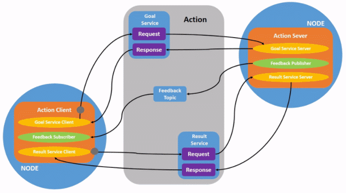


<font size=4>**作用**</font>

一般适用于耗时的请求响应场景，用以获取连续的状态反馈。


### 2.4.1 案例以及案例分析

<font size=4>**1.案例需求**</font>

**需求：**编写动作通信，动作客户端提交一个整型数据N，动作服务端接收请求数据并累加1-N之间的所有整数，将最终结果返回给动作客户端，且每累加一次都需要计算当前运算进度并反馈给动作客户端。


<font size=4>**2.案例分析**</font>

在上述案例中，需要关注的要素有三个：

1. 动作客户端；
2. 动作服务端；
3. 消息载体。


<font size=4>**3.流程简介**</font>

案例实现前需要先自定义动作接口，接口准备完毕后，动作通信实现主要步骤如下：

1. 编写动作服务端实现；
2. 编写动作客户端实现；
3. 编辑配置文件；
4. 编译；
5. 执行。

案例我们会采用C++和Python分别实现，二者都遵循上述实现流程。


<font size=4>**4.准备工作**</font>

终端下进入工作空间的src目录，调用如下两条命令分别创建C++功能包和Python功能包。

```sh
ros2 pkg create cpp03_action --build-type ament_cmake --dependencies rclcpp rclcpp_action base_interfaces_demo
ros2 pkg create py03_action --build-type ament_python --dependencies rclpy base_interfaces_demo
```


### 2.4.2 动作通信接口消息

定义动作接口消息与定义话题或服务接口消息流程类似，主要步骤如下：

1. 创建并编辑`.action`文件；
2. 编辑配置文件；
3. 编译；
4. 测试。

接下来，我们可以参考案例编写一个action文件，该文件中包含请求数据\(一个整型字段\)、响应数据\(一个整型字段\)和连续反馈数据\(一个浮点型字段\)。


<font size=4>**1.创建并编辑 .action 文件**</font>

功能包base\_interfaces\_demo下新建action文件夹，action文件夹下新建Progress.action文件，文件中输入如下内容：

```cpp
int64 num
---
int64 sum
---
float64 progress
```


<font size=4>**2.编辑配置文件**</font>

<font size=4>**2.1 package.xml**</font>

如果单独构建action功能包，需要在package.xml中需要添加一些依赖包，具体内容如下：

```xml
<buildtool_depend>rosidl_default_generators</buildtool_depend>
<depend>action_msgs</depend>
<member_of_group>rosidl_interface_packages</member_of_group>
```

当前使用的是 base\_interfaces\_demo 功能包，已经为 msg 、srv 文件添加过了一些依赖，所以 package.xml 中添加如下内容即可：

```xml
<buildtool_depend>rosidl_default_generators</buildtool_depend>
<depend>action_msgs</depend>
```


<font size=4>**2.2 CMakeLists.txt**</font>

如果是新建的功能包，与之前定义msg、srv文件同理，为了将 `.action` 文件转换成对应的C++和Python代码，还需要在CMakeLists.txt 中添加如下配置：

```cmake
find_package(rosidl_default_generators REQUIRED)

rosidl_generate_interfaces(${PROJECT_NAME}
  "action/Progress.action"
)
```

不过，我们当前使用的base\_interfaces\_demo包，那么只需要修改rosidl\_generate\_interfaces函数即可，修改后的内容如下：

```cmake
rosidl_generate_interfaces(${PROJECT_NAME}
  "msg/Student.msg"
  "srv/AddInts.srv"
  "action/Progress.action"
)
```


<font size=4>**3.编译**</font>

终端中进入当前工作空间，编译功能包：

```sh
colcon build --packages-select base_interfaces_demo
```


<font size=4>**4.测试**</font>

编译完成之后，在工作空间下的 install 目录下将生成`Progress.action`文件对应的C++和Python文件，我们也可以在终端下进入工作空间，通过如下命令查看文件定义以及编译是否正常：

```sh
. install/setup.bash
ros2 interface show base_interfaces_demo/action/Progress
```

正常情况下，终端将会输出与`Progress.action`文件一致的内容。


### 2.4.3 动作通信（C++）

<font size=4>**1.动作服务端实现**</font>

功能包cpp03\_action的src目录下，新建C++文件demo01\_action\_server.cpp，并编辑文件，输入如下内容：

```cpp
/*  
  需求：编写动作服务端实习，可以提取客户端请求提交的整型数据，并累加从1到该数据之间的所有整数以求和，
       每累加一次都计算当前运算进度并连续反馈回客户端，最后，在将求和结果返回给客户端。
  步骤：
    1.包含头文件；
    2.初始化 ROS2 客户端；
    3.定义节点类；
      3-1.创建动作服务端；
      3-2.处理请求数据；
      3-3.处理取消任务请求；
      3-4.生成连续反馈。
    4.调用spin函数，并传入节点对象指针；
    5.释放资源。

*/
// 1.包含头文件；
#include "rclcpp/rclcpp.hpp"
#include "rclcpp_action/rclcpp_action.hpp"
#include "base_interfaces_demo/action/progress.hpp"

using namespace std::placeholders;
using base_interfaces_demo::action::Progress;
using GoalHandleProgress = rclcpp_action::ServerGoalHandle<Progress>;

// 3.定义节点类；
class MinimalActionServer : public rclcpp::Node
{
public:

  explicit MinimalActionServer(const rclcpp::NodeOptions & options = rclcpp::NodeOptions())
  : Node("minimal_action_server", options)
  {
    // 3-1.创建动作服务端；
    this->action_server_ = rclcpp_action::create_server<Progress>(
      this,
      "get_sum",
      std::bind(&MinimalActionServer::handle_goal, this, _1, _2),
      std::bind(&MinimalActionServer::handle_cancel, this, _1),
      std::bind(&MinimalActionServer::handle_accepted, this, _1));
    RCLCPP_INFO(this->get_logger(),"动作服务端创建，等待请求...");
  }

private:
  rclcpp_action::Server<Progress>::SharedPtr action_server_;

  // 3-2.处理请求数据；
  rclcpp_action::GoalResponse handle_goal(const rclcpp_action::GoalUUID & uuid,std::shared_ptr<const Progress::Goal> goal)
  {
    (void)uuid;
    RCLCPP_INFO(this->get_logger(), "接收到动作客户端请求，请求数字为 %ld", goal->num);
    if (goal->num < 1) {
      return rclcpp_action::GoalResponse::REJECT;
    }
    return rclcpp_action::GoalResponse::ACCEPT_AND_EXECUTE;
  }

  // 3-3.处理取消任务请求；
  rclcpp_action::CancelResponse handle_cancel(
    const std::shared_ptr<GoalHandleProgress> goal_handle)
  {
    (void)goal_handle;
    RCLCPP_INFO(this->get_logger(), "接收到任务取消请求");
    return rclcpp_action::CancelResponse::ACCEPT;
  }

  void execute(const std::shared_ptr<GoalHandleProgress> goal_handle)
  {
    RCLCPP_INFO(this->get_logger(), "开始执行任务");
    rclcpp::Rate loop_rate(10.0);
    const auto goal = goal_handle->get_goal();
    auto feedback = std::make_shared<Progress::Feedback>();
    auto result = std::make_shared<Progress::Result>();
    int64_t sum= 0;
    for (int i = 1; (i <= goal->num) && rclcpp::ok(); i++) {
      sum += i;
      // Check if there is a cancel request
      if (goal_handle->is_canceling()) {
        result->sum = sum;
        goal_handle->canceled(result);
        RCLCPP_INFO(this->get_logger(), "任务取消");
        return;
      }
      feedback->progress = (double_t)i / goal->num;
      goal_handle->publish_feedback(feedback);
      RCLCPP_INFO(this->get_logger(), "连续反馈中，进度：%.2f", feedback->progress);

      loop_rate.sleep();
    }

    if (rclcpp::ok()) {
      result->sum = sum;
      goal_handle->succeed(result);
      RCLCPP_INFO(this->get_logger(), "任务完成！");
    }
  }

  // 3-4.生成连续反馈。
  void handle_accepted(const std::shared_ptr<GoalHandleProgress> goal_handle)
  {
    std::thread{std::bind(&MinimalActionServer::execute, this, _1), goal_handle}.detach();
  }
}; 

int main(int argc, char ** argv)
{
  // 2.初始化 ROS2 客户端；
  rclcpp::init(argc, argv);
  // 4.调用spin函数，并传入节点对象指针；
  auto action_server = std::make_shared<MinimalActionServer>();
  rclcpp::spin(action_server);
  // 5.释放资源。
  rclcpp::shutdown();
  return 0;
}
```


<font size=4>**2.动作客户端实现**</font>

功能包cpp03\_action的src目录下，新建C++文件demo02\_action\_client.cpp，并编辑文件，输入如下内容：

```cpp
/*  
  需求：编写动作客户端实现，可以提交一个整型数据到服务端，并处理服务端的连续反馈以及最终返回结果。
  步骤：
    1.包含头文件；
    2.初始化 ROS2 客户端；
    3.定义节点类；
      3-1.创建动作客户端；
      3-2.发送请求；
      3-3.处理目标发送后的反馈；
      3-4.处理连续反馈；
      3-5.处理最终响应。
    4.调用spin函数，并传入节点对象指针；
    5.释放资源。
*/
// 1.包含头文件；
#include "rclcpp/rclcpp.hpp"
#include "rclcpp_action/rclcpp_action.hpp"
#include "base_interfaces_demo/action/progress.hpp"

using base_interfaces_demo::action::Progress;
using GoalHandleProgress = rclcpp_action::ClientGoalHandle<Progress>;
using namespace std::placeholders;

// 3.定义节点类；
class MinimalActionClient : public rclcpp::Node
{
public:

  explicit MinimalActionClient(const rclcpp::NodeOptions & node_options = rclcpp::NodeOptions())
  : Node("minimal_action_client", node_options)
  {
    // 3-1.创建动作客户端；
    this->client_ptr_ = rclcpp_action::create_client<Progress>(this,"get_sum");
  }

  // 3-2.发送请求；
  void send_goal(int64_t num)
  {

    if (!this->client_ptr_) {
      RCLCPP_ERROR(this->get_logger(), "动作客户端未被初始化。");
    }

    if (!this->client_ptr_->wait_for_action_server(std::chrono::seconds(10))) {
      RCLCPP_ERROR(this->get_logger(), "服务连接失败！");
      return;
    }

    auto goal_msg = Progress::Goal();
    goal_msg.num = num;
    RCLCPP_INFO(this->get_logger(), "发送请求数据！");

    auto send_goal_options = rclcpp_action::Client<Progress>::SendGoalOptions();
    send_goal_options.goal_response_callback =std::bind(&MinimalActionClient::goal_response_callback, this, _1);
    send_goal_options.feedback_callback =std::bind(&MinimalActionClient::feedback_callback, this, _1, _2);
    send_goal_options.result_callback =std::bind(&MinimalActionClient::result_callback, this, _1);
    auto goal_handle_future = this->client_ptr_->async_send_goal(goal_msg, send_goal_options);
  }

private:
  rclcpp_action::Client<Progress>::SharedPtr client_ptr_;

  // 3-3.处理目标发送后的反馈；
  void goal_response_callback(GoalHandleProgress::SharedPtr goal_handle)
  {
    if (!goal_handle) {
      RCLCPP_ERROR(this->get_logger(), "目标请求被服务器拒绝！");
    } else {
      RCLCPP_INFO(this->get_logger(), "目标被接收，等待结果中");
    }
  }

  // 3-4.处理连续反馈；
  void feedback_callback(GoalHandleProgress::SharedPtr,const std::shared_ptr<const Progress::Feedback> feedback)
  {
    int32_t progress = (int32_t)(feedback->progress * 100);
    RCLCPP_INFO(this->get_logger(), "当前进度: %d%%", progress);
  }

  // 3-5.处理最终响应。
  void result_callback(const GoalHandleProgress::WrappedResult & result)
  {
    switch (result.code) {
      case rclcpp_action::ResultCode::SUCCEEDED:
        break;
      case rclcpp_action::ResultCode::ABORTED:
        RCLCPP_ERROR(this->get_logger(), "任务被中止");
        return;
      case rclcpp_action::ResultCode::CANCELED:
        RCLCPP_ERROR(this->get_logger(), "任务被取消");
        return;
      default:
        RCLCPP_ERROR(this->get_logger(), "未知异常");
        return;
    }

    RCLCPP_INFO(this->get_logger(), "任务执行完毕，最终结果: %ld", result.result->sum);
  }
}; 

int main(int argc, char ** argv)
{
  // 2.初始化 ROS2 客户端；
  rclcpp::init(argc, argv);

  // 4.调用spin函数，并传入节点对象指针；
  auto action_client = std::make_shared<MinimalActionClient>();
  action_client->send_goal(10);
  rclcpp::spin(action_client);
  // 5.释放资源。
  rclcpp::shutdown();
  return 0;
}
```


<font size=4>**3.编辑配置文件**</font>

<font size=4>**3.1 packages.xml**</font>

在创建功能包时，所依赖的功能包已经自动配置了，配置内容如下：

```xml
<depend>rclcpp</depend>
<depend>rclcpp_action</depend>
<depend>base_interfaces_demo</depend>
```


<font size=4>**3.2 CMakeLists.txt**</font>

CMakeLists.txt中服务端和客户端程序核心配置如下：

```cmake
find_package(rclcpp REQUIRED)
find_package(rclcpp_action REQUIRED)
find_package(base_interfaces_demo REQUIRED)

add_executable(demo01_action_server src/demo01_action_server.cpp)
ament_target_dependencies(
  demo01_action_server
  "rclcpp"
  "rclcpp_action"
  "base_interfaces_demo"
)

add_executable(demo02_action_client src/demo02_action_client.cpp)
ament_target_dependencies(
  demo02_action_client
  "rclcpp"
  "rclcpp_action"
  "base_interfaces_demo"
)

install(TARGETS 
  demo01_action_server
  demo02_action_client
  DESTINATION lib/${PROJECT_NAME})
```


<font size=4>**4.编译**</font>

终端中进入当前工作空间，编译功能包：

```sh
colcon build --packages-select cpp03_action
```


<font size=4>**5.执行**</font>

当前工作空间下，启动两个终端，终端1执行动作服务端程序，终端2执行动作客户端程序。

终端1输入如下指令：

```sh
. install/setup.bash
ros2 run cpp03_action demo01_action_server
```

终端2输入如下指令：

```sh
. install/setup.bash
ros2 run cpp03_action demo02_action_client
```

最终运行结果与案例类似。


### 2.4.4 动作通信（Python）

<font size=4>**1.动作服务端实现**</font>

功能包py03\_action的py03\_action目录下，新建Python文件demo01\_action\_server\_py.py，并编辑文件，输入如下内容：

```py
"""  
    需求：编写动作服务端实习，可以提取客户端请求提交的整型数据，并累加从1到该数据之间的所有整数以求和，
       每累加一次都计算当前运算进度并连续反馈回客户端，最后，在将求和结果返回给客户端。
    步骤：
        1.导包；
        2.初始化 ROS2 客户端；
        3.定义节点类；
            3-1.创建动作服务端；
            3-2.生成连续反馈；
            3-3.生成最终响应。
        4.调用spin函数，并传入节点对象；
        5.释放资源。
"""

# 1.导包；
import time
import rclpy
from rclpy.action import ActionServer
from rclpy.node import Node

from base_interfaces_demo.action import Progress

# 3.定义节点类；
class ProgressActionServer(Node):

    def __init__(self):
        super().__init__('progress_action_server')
        # 3-1.创建动作服务端；
        self._action_server = ActionServer(
            self,
            Progress,
            'get_sum',
            self.execute_callback)
        self.get_logger().info('动作服务已经启动！')

    def execute_callback(self, goal_handle):
        self.get_logger().info('开始执行任务....')


        # 3-2.生成连续反馈；
        feedback_msg = Progress.Feedback()

        sum = 0
        for i in range(1, goal_handle.request.num + 1):
            sum += i
            feedback_msg.progress = i / goal_handle.request.num
            self.get_logger().info('连续反馈: %.2f' % feedback_msg.progress)
            goal_handle.publish_feedback(feedback_msg)
            time.sleep(1)

        # 3-3.生成最终响应。
        goal_handle.succeed()
        result = Progress.Result()
        result.sum = sum
        self.get_logger().info('任务完成！')

        return result


def main(args=None):

    # 2.初始化 ROS2 客户端；
    rclpy.init(args=args)

    # 4.调用spin函数，并传入节点对象；
    Progress_action_server = ProgressActionServer()
    rclpy.spin(Progress_action_server)

    # 5.释放资源。
    rclpy.shutdown()

if __name__ == '__main__':
    main()
```


<font size=4>**2.动作客户端实现**</font>

功能包py03\_action的py03\_action目录下，新建Python文件demo02\_action\_client\_py.py，并编辑文件，输入如下内容：

```py
"""  
    需求：编写动作客户端实现，可以提交一个整型数据到服务端，并处理服务端的连续反馈以及最终返回结果。
    步骤：
        1.导包；
        2.初始化 ROS2 客户端；
        3.定义节点类；
            3-1.创建动作客户端；
            3-2.发送请求；
            3-3.处理目标发送后的反馈；
            3-4.处理连续反馈；
            3-5.处理最终响应。
        4.调用spin函数，并传入节点对象；
        5.释放资源。

"""
# 1.导包；
import rclpy
from rclpy.action import ActionClient
from rclpy.node import Node
from base_interfaces_demo.action import Progress

# 3.定义节点类；
class ProgressActionClient(Node):

    def __init__(self):
        super().__init__('progress_action_client')
        # 3-1.创建动作客户端；
        self._action_client = ActionClient(self, Progress, 'get_sum')

    def send_goal(self, num):
        # 3-2.发送请求；
        goal_msg = Progress.Goal()
        goal_msg.num = num
        self._action_client.wait_for_server()
        self._send_goal_future = self._action_client.send_goal_async(goal_msg, feedback_callback=self.feedback_callback)
        self._send_goal_future.add_done_callback(self.goal_response_callback)

    def goal_response_callback(self, future):
        # 3-3.处理目标发送后的反馈；
        goal_handle = future.result()
        if not goal_handle.accepted:
            self.get_logger().info('请求被拒绝')
            return

        self.get_logger().info('请求被接收，开始执行任务！')

        self._get_result_future = goal_handle.get_result_async()
        self._get_result_future.add_done_callback(self.get_result_callback)

    # 3-5.处理最终响应。
    def get_result_callback(self, future):
        result = future.result().result
        self.get_logger().info('最终计算结果：sum = %d' % result.sum)
        # 5.释放资源。
        rclpy.shutdown()

    # 3-4.处理连续反馈；
    def feedback_callback(self, feedback_msg):
        feedback = (int)(feedback_msg.feedback.progress * 100)
        self.get_logger().info('当前进度: %d%%' % feedback)


def main(args=None):

    # 2.初始化 ROS2 客户端；
    rclpy.init(args=args)
    # 4.调用spin函数，并传入节点对象；

    action_client = ProgressActionClient()
    action_client.send_goal(10)
    rclpy.spin(action_client)

    # rclpy.shutdown()


if __name__ == '__main__':
    main()
```


<font size=4>**3.编辑配置文件**</font>

<font size=4>**3.1 package.xml**</font>

在创建功能包时，所依赖的功能包已经自动配置了，配置内容如下：

```xml
<depend>rclpy</depend>
<depend>base_interfaces_demo</depend>
```


<font size=4>**3.2 setup.py**</font>

`entry_points` 字段的 `console_scripts` 中添加如下内容：

```py
entry_points={
    'console_scripts': [
        'demo01_action_server_py = py03_action.demo01_action_server_py:main',
        'demo02_action_client_py = py03_action.demo02_action_client_py:main'
    ],
},
```


<font size=4>**4.编译览**</font>

终端中进入当前工作空间，编译功能包：

```sh
colcon build --packages-select py03_action
```


<font size=4>**5.执行**</font>

当前工作空间下，启动两个终端，终端1执行动作服务端程序，终端2执行动作客户端程序。

终端1输入如下指令：

```sh
. install/setup.bash
ros2 run py03_action demo01_action_server_py
```

终端2输入如下指令：

```sh
. install/setup.bash
ros2 run py03_action demo02_action_client_py
```

最终运行结果与案例类似。


## 2.5 参数服务

<font size=4>**场景**</font>

在机器人系统中不同的功能模块可能会使用到一些相同的数据，比如：

> 导航实现时，会进行路径规划，路径规划主要包含， 全局路径规划和本地路径规划，所谓全局路径规划就是设计一个从出发点到目标点的大致路径，而本地路径规划，则是根据车辆当前路况生成实时的行进路径。两种路径规划实现，都会使用到车辆的尺寸数据——长度、宽度、高度等。那么这些通用数据在程序中应该如何存储、调用呢？

上述场景中，就可以使用参数服务实现，在一个节点下保存车辆尺寸数据，其他节点可以访问该节点并操作这些数据。


<font size=4>**概念**</font>

参数服务是以共享的方式实现不同节点之间数据交互的一种通信模式。保存参数的节点称之为参数服务端，调用参数的节点称之为参数客户端。参数客户端与参数服务端的交互是基于请求响应的，且参数通信的实现本质上对服务通信的进一步封装。


<font size=4>**作用**</font>

参数服务保存的数据类似于编程中“全局变量”的概念，可以在不同的节点之间共享数据。


### 2.5.1 案例以及案例分析

<font size=4>**1.案例需求**</font>

**需求：**在参数服务端设置一些参数，参数客户端访问服务端并操作这些参数。


<font size=4>**2.案例分析**</font>

在上述案例中，需要关注的要素有三个：

1. 参数客户端；
2. 参数服务端；
3. 参数。


<font size=4>**3.流程简介**</font>

案例实现前需要先了解ROS2中参数的相关API，无论是客户端还是服务端都会使用到参数，而参数服务案例实现主要步骤如下：

1. 编写参数服务端实现；
2. 编写参数客户端实现；
3. 编辑配置文件；
4. 编译；
5. 执行。

案例我们会采用C++和Python分别实现，二者都遵循上述实现流程。


<font size=4>**4.准备工作**</font>

终端下进入工作空间的src目录，调用如下两条命令分别创建C++功能包和Python功能包。

```sh
ros2 pkg create cpp04_param --build-type ament_cmake --dependencies rclcpp
ros2 pkg create py04_param --build-type ament_python --dependencies rclpy
```


### 2.5.2 参数数据类型

在ROS2中，参数由键、值和描述符三部分组成，其中键是字符串类型，值可以是bool、int64、float64、string、byte\[\]、bool\[\]、int64\[\]、float64\[\]、string\[\]中的任一类型，描述符默认情况下为空，但是可以设置参数描述、参数数据类型、取值范围或其他约束等信息。

为了方便操作，参数被封装为了相关类，其中C++客户端对应的类是`rclcpp::Parameter`，Python客户端对应的类是`rclpy.Parameter`。借助于相关API，我们可以实现参数对象创建以及参数属性解析等操作。以下代码提供了参数相关API基本使用的示例。

**C++示例：**

```cpp
...
// 创建参数对象
rclcpp::Parameter p1("car_name","Tiger"); //参数值为字符串类型
rclcpp::Parameter p2("width",0.15); //参数值为浮点类型
rclcpp::Parameter p3("wheels",2); //参数值为整型

// 获取参数值并转换成相应的数据类型
RCLCPP_INFO(rclcpp::get_logger("rclcpp"),"car_name = %s", p1.as_string().c_str());
RCLCPP_INFO(rclcpp::get_logger("rclcpp"),"width = %.2f", p2.as_double());
RCLCPP_INFO(rclcpp::get_logger("rclcpp"),"wheels = %ld", p3.as_int());

// 获取参数的键
RCLCPP_INFO(rclcpp::get_logger("rclcpp"),"p1 name = %s", p1.get_name().c_str());
// 获取参数数据类型
RCLCPP_INFO(rclcpp::get_logger("rclcpp"),"p1 type_name = %s", p1.get_type_name().c_str());
// 将参数值转换成字符串类型
RCLCPP_INFO(rclcpp::get_logger("rclcpp"),"p1 value_to_msg = %s", p1.value_to_string().c_str());
...
```


**Python示例：**

```py
# 创建参数对象
p1 = rclpy.Parameter("car_name",value="Horse")
p2 = rclpy.Parameter("length",value=0.5)
p3 = rclpy.Parameter("wheels",value=4)

# 获取参数值
get_logger("rclpy").info("car_name = %s" % p1.value)
get_logger("rclpy").info("length = %.2f" % p2.value)
get_logger("rclpy").info("wheels = %d" % p3.value)

# 获取参数键
get_logger("rclpy").info("p1 name = %s" % p1.name)
```

关于参数具体的API使用，在后续案例中会有介绍。


### 2.5.3 参数服务（C++）

<font size=4>**1.参数服务端**</font>

功能包cpp04\_param的src目录下，新建C++文件demo01\_param\_server.cpp，并编辑文件，输入如下内容：

```cpp
/*
    需求：编写参数服务端，设置并操作参数。
    步骤：
        1.包含头文件；
        2.初始化 ROS2 客户端；
        3.定义节点类；
            3-1.声明参数；
            3-2.查询参数；
            3-3.修改参数；
            3-4.删除参数。
        4.创建节点对象指针，调用参数操作函数，并传递给spin函数；
        5.释放资源。

*/

// 1.包含头文件；
#include "rclcpp/rclcpp.hpp"

// 3.定义节点类；
class MinimalParamServer: public rclcpp::Node{
    public:
        MinimalParamServer():Node("minimal_param_server",rclcpp::NodeOptions()
                .allow_undeclared_parameters(true)
                ){       
        }
        // 3-1.声明参数；
        void declare_param(){
            // 声明参数并设置默认值
            this->declare_parameter("car_type","Tiger"); 
            this->declare_parameter("height",1.50); 
            this->declare_parameter("wheels",4);   
            // 需要设置 rclcpp::NodeOptions().allow_undeclared_parameters(true),否则非法 
            this->set_parameter(rclcpp::Parameter("undcl_test",100));
        }
        // 3-2.查询参数
        void get_param(){
            RCLCPP_INFO(this->get_logger(),"------------------查----------------");
            // 获取指定
            rclcpp::Parameter car_type = this->get_parameter("car_type");
            RCLCPP_INFO(this->get_logger(),"car_type:%s",car_type.as_string().c_str());
            RCLCPP_INFO(this->get_logger(),"height:%.2f",this->get_parameter("height").as_double());
            RCLCPP_INFO(this->get_logger(),"wheels:%ld",this->get_parameter("wheels").as_int());
            RCLCPP_INFO(this->get_logger(),"undcl_test:%ld",this->get_parameter("undcl_test").as_int());
            // 判断包含
            RCLCPP_INFO(this->get_logger(),"包含car_type? %d",this->has_parameter("car_type"));
            RCLCPP_INFO(this->get_logger(),"包含car_typesxxxx? %d",this->has_parameter("car_typexxxx"));
            // 获取所有
            auto params = this->get_parameters({"car_type","height","wheels"});
            for (auto &param : params)
            {
                RCLCPP_INFO(this->get_logger(),"name = %s, value = %s", param.get_name().c_str(), param.value_to_string().c_str());

            }
        }
        // 3-3.修改参数
        void update_param(){
            RCLCPP_INFO(this->get_logger(),"------------------改----------------");
            this->set_parameter(rclcpp::Parameter("height",1.75));
            RCLCPP_INFO(this->get_logger(),"height:%.2f",this->get_parameter("height").as_double());
        }
        // 3-4.删除参数
        void del_param(){
            RCLCPP_INFO(this->get_logger(),"------------------删----------------");
            // this->undeclare_parameter("car_type");
            // RCLCPP_INFO(this->get_logger(),"删除操作后，car_type还存在马? %d",this->has_parameter("car_type"));
            RCLCPP_INFO(this->get_logger(),"删除操作前，undcl_test存在马? %d",this->has_parameter("undcl_test"));
            this->undeclare_parameter("undcl_test");
            RCLCPP_INFO(this->get_logger(),"删除操作前，undcl_test存在马? %d",this->has_parameter("undcl_test"));
        }
};

int main(int argc, char ** argv)
{
    // 2.初始化 ROS2 客户端；
    rclcpp::init(argc,argv);

    // 4.创建节点对象指针，调用参数操作函数，并传递给spin函数；
    auto paramServer= std::make_shared<MinimalParamServer>();
    paramServer->declare_param();
    paramServer->get_param();
    paramServer->update_param();
    paramServer->del_param();
    rclcpp::spin(paramServer);

    // 5.释放资源。
    rclcpp::shutdown();
    return 0;
}
```


<font size=4>**2.参数客户端**</font>

功能包cpp04\_param的src目录下，新建C++文件demo02\_param\_client.cpp，并编辑文件，输入如下内容：

```cpp
/*
    需求：编写参数客户端，获取或修改服务端参数。
    步骤：
        1.包含头文件；
        2.初始化 ROS2 客户端；
        3.定义节点类；
            3-1.查询参数；
            3-2.修改参数；
        4.创建节点对象指针，调用参数操作函数；
        5.释放资源。
*/

// 1.包含头文件；
#include "rclcpp/rclcpp.hpp"

using namespace std::chrono_literals;

// 3.定义节点类；
class MinimalParamClient: public rclcpp::Node {
    public:
        MinimalParamClient():Node("paramDemoClient_node"){
            paramClient = std::make_shared<rclcpp::SyncParametersClient>(this,"minimal_param_server");
        }
        bool connect_server(){
            // 等待服务连接
            while (!paramClient->wait_for_service(1s))
            {
                if (!rclcpp::ok())
                {
                   return false;
                }  
                RCLCPP_INFO(this->get_logger(),"服务未连接");
            }

            return true;

        }

        // 3-1.查询参数；
        void get_param(){
            RCLCPP_INFO(this->get_logger(),"-----------参数客户端查询参数-----------");
            double height = paramClient->get_parameter<double>("height");
            RCLCPP_INFO(this->get_logger(),"height = %.2f", height);
            RCLCPP_INFO(this->get_logger(),"car_type 存在吗？%d", paramClient->has_parameter("car_type"));
            auto params = paramClient->get_parameters({"car_type","height","wheels"});
            for (auto &param : params)
            {
                RCLCPP_INFO(this->get_logger(),"%s = %s", param.get_name().c_str(),param.value_to_string().c_str());
            }


        }
        // 3-2.修改参数；
        void update_param(){
            RCLCPP_INFO(this->get_logger(),"-----------参数客户端修改参数-----------");
            paramClient->set_parameters({rclcpp::Parameter("car_type","Mouse"),
            rclcpp::Parameter("height",2.0),
            //这是服务端不存在的参数，只有服务端设置了rclcpp::NodeOptions().allow_undeclared_parameters(true)时，
            // 这个参数才会被成功设置。
            rclcpp::Parameter("width",0.15),
            rclcpp::Parameter("wheels",6)});
        }

    private:
        rclcpp::SyncParametersClient::SharedPtr paramClient;
};

int main(int argc, char const *argv[])
{
    // 2.初始化 ROS2 客户端；
    rclcpp::init(argc,argv);

    // 4.创建节点对象指针，调用参数操作函数；
    auto paramClient = std::make_shared<MinimalParamClient>();
    bool flag = paramClient->connect_server();
    if(!flag){
        return 0;
    }
    paramClient->get_param();
    paramClient->update_param();
    paramClient->get_param();

    // 5.释放资源。
    rclcpp::shutdown();
    return 0;
}
```


<font size=4>**3.编辑配置文件**</font>

<font size=4>**3.1 packages.xml**</font>

在创建功能包时，所依赖的功能包已经自动配置了，配置内容如下：

```xml
<depend>rclcpp</depend>
```


<font size=4>**3.2 CMakeLists.txt**</font>

CMakeLists.txt中参数服务端和参数客户端程序核心配置如下：

```cmake
find_package(rclcpp REQUIRED)

add_executable(demo01_param_server src/demo01_param_server.cpp)
ament_target_dependencies(
  demo01_param_server
  "rclcpp"
)
add_executable(demo02_param_client src/demo02_param_client.cpp)
ament_target_dependencies(
  demo02_param_client
  "rclcpp"
)

install(TARGETS 
  demo01_param_server
  demo02_param_client
  DESTINATION lib/${PROJECT_NAME})
```


<font size=4>**4.编译**</font>

终端中进入当前工作空间，编译功能包：

```sh
colcon build --packages-select cpp04_param
```


<font size=4>**5.执行**</font>

当前工作空间下，启动两个终端，终端1执行参数服务端程序，终端2执行参数客户端程序。

终端1输入如下指令：

```sh
. install/setup.bash
ros2 run cpp04_param demo01_param_server
```

终端2输入如下指令：

```sh
. install/setup.bash
ros2 run cpp04_param demo02_param_client
```

最终运行结果与案例类似。


### 2.5.4 参数服务（Python）

<font size=4>**1.参数服务端**</font>

功能包py04\_param的py04\_param目录下，新建Python文件demo01\_param\_server\_py.py，并编辑文件，输入如下内容：

```py
"""  
    需求：编写参数服务端，设置并操作参数。
    步骤：
        1.导包；
        2.初始化 ROS2 客户端；
        3.定义节点类；
            3-1.声明参数；
            3-2.查询参数；
            3-3.修改参数；
            3-4.删除参数。
        4.创建节点对象，调用参数操作函数，并传递给spin函数；
        5.释放资源。

"""
# 1.导包；
import rclpy
from rclpy.node import Node

# 3.定义节点类；
class MinimalParamServer(Node):
    def __init__(self):
        super().__init__("minimal_param_server",allow_undeclared_parameters=True)
        self.get_logger().info("参数演示")

    # 3-1.声明参数；
    def declare_param(self):
        self.declare_parameter("car_type","Tiger")
        self.declare_parameter("height",1.50)
        self.declare_parameter("wheels",4)
        self.p1 = rclpy.Parameter("car_type",value = "Mouse")
        self.p2 = rclpy.Parameter("undcl_test",value = 100)
        self.set_parameters([self.p1,self.p2])

    # 3-2.查询参数；
    def get_param(self):
        self.get_logger().info("--------------查-------------")
        # 判断包含
        self.get_logger().info("包含 car_type 吗？%d" % self.has_parameter("car_type"))
        self.get_logger().info("包含 width 吗？%d" % self.has_parameter("width"))
        # 获取指定
        car_type = self.get_parameter("car_type")
        self.get_logger().info("%s = %s " % (car_type.name, car_type.value))
        # 获取所有
        params = self.get_parameters(["car_type","height","wheels"])
        self.get_logger().info("解析所有参数:")
        for param in params:
            self.get_logger().info("%s ---> %s" % (param.name, param.value))

    # 3-3.修改参数；
    def update_param(self):
        self.get_logger().info("--------------改-------------")
        self.set_parameters([rclpy.Parameter("car_type",value = "horse")])
        param = self.get_parameter("car_type")
        self.get_logger().info("修改后: car_type = %s" %param.value)

    # 3-4.删除参数。
    def del_param(self):
        self.get_logger().info("--------------删-------------")
        self.get_logger().info("删除操作前包含 car_type 吗？%d" % self.has_parameter("car_type"))
        self.undeclare_parameter("car_type")
        self.get_logger().info("删除操作后包含 car_type 吗？%d" % self.has_parameter("car_type"))


def main():
    # 2.初始化 ROS2 客户端；
    rclpy.init()

    # 4.创建节点对象，调用参数操作函数，并传递给spin函数；
    param_server = MinimalParamServer()
    param_server.declare_param()
    param_server.get_param()
    param_server.update_param()
    param_server.del_param()

    rclpy.spin(param_server)

    # 5.释放资源。
    rclpy.shutdown()


if __name__ == "__main__":
    main()
```


<font size=4>**2.参数客户端**</font>

ROS2的Python客户端暂时没有提供参数客户端专用的API，但是参数服务的底层是基于服务通信的，所以可以通过服务通信操作参数服务端的参数。


<font size=4>**3.编辑配置文件**</font>

<font size=4>**3.1 package.xml**</font>

在创建功能包时，所依赖的功能包已经自动配置了，配置内容如下：

```xml
<depend>rclpy</depend>
```


<font size=4>**3.2 setup.py**</font>

`entry_points` 字段的 `console_scripts` 中添加如下内容：

```py
entry_points={
    'console_scripts': [
        'demo01_param_server_py = py04_param.demo01_param_server_py:main'
    ],
},
```


<font size=4>**4.编译**</font>

终端中进入当前工作空间，编译功能包：

```sh
colcon build --packages-select py04_param
```


<font size=4>**5.执行**</font>

当前工作空间下，启动两个终端，终端1执行参数服务端程序，终端2执行参数客户端程序\(使用2.5.3中的C++实现\)。

终端1输入如下指令：

```sh
. install/setup.bash
ros2 run py04_param demo01_param_server_py
```

终端2输入如下指令：

```sh
. install/setup.bash
ros2 run cpp04_param demo02_param_client
```

最终运行结果与案例类似。

---

**资料：**

以服务通信方式操作参数服务端示例代码：

```py
# 1.导包
import rclpy
from rclpy.node import Node
from rcl_interfaces.srv import ListParameters
from rcl_interfaces.srv import GetParameters
from rcl_interfaces.srv import SetParameters
from rcl_interfaces.msg import ParameterType
from rcl_interfaces.msg import Parameter
from rcl_interfaces.msg import ParameterValue
from ros2param.api import get_parameter_value

class MinimalParamClient(Node):

    def __init__(self):
        super().__init__('minimal_param_client_py')

    def list_params(self):
        # 3-1.创建客户端；
        cli_list = self.create_client(ListParameters, '/minimal_param_server/list_parameters')
        # 3-2.等待服务连接；
        while not cli_list.wait_for_service(timeout_sec=1.0):
            self.get_logger().info('列出参数服务连接中，请稍候...')
        req = ListParameters.Request()
        future = cli_list.call_async(req)
        rclpy.spin_until_future_complete(self,future)
        return future.result()

    def get_params(self,names):
        # 3-1.创建客户端；
        cli_get = self.create_client(GetParameters, '/minimal_param_server/get_parameters')
        # 3-2.等待服务连接；
        while not cli_get.wait_for_service(timeout_sec=1.0):
            self.get_logger().info('列出参数服务连接中，请稍候...')
        req = GetParameters.Request()
        req.names = names
        future = cli_get.call_async(req)
        rclpy.spin_until_future_complete(self,future)
        return future.result()

    def set_params(self):
        # 3-1.创建客户端；
        cli_set = self.create_client(SetParameters, '/minimal_param_server/set_parameters')
        # 3-2.等待服务连接；
        while not cli_set.wait_for_service(timeout_sec=1.0):
            self.get_logger().info('列出参数服务连接中，请稍候...')

        req = SetParameters.Request()

        p1 = Parameter()
        p1.name = "car_type"

        # v1 = ParameterValue()
        # v1.type = ParameterType.PARAMETER_STRING
        # v1.string_value = "Pig"
        # p1.value = v1
        p1.value = get_parameter_value(string_value="Pig")

        p2 = Parameter()
        p2.name = "height"

        v2 = ParameterValue()
        v2.type = ParameterType.PARAMETER_DOUBLE
        v2.double_value = 0.3
        p2.value = v2
        # p2.value = get_parameter_value(string_value="0.3")

        req.parameters = [p1, p2]
        future = cli_set.call_async(req)
        rclpy.spin_until_future_complete(self,future)
        return future.result()

def main():
    # 2.初始化 ROS2 客户端；
    rclpy.init()
    # 4.创建对象并调用其功能；
    client = MinimalParamClient()

    # 获取参数列表
    client.get_logger().info("---------获取参数列表---------")
    response = client.list_params()
    for name in response.result.names:
        client.get_logger().info(name)

    client.get_logger().info("---------获取参数---------")
    names = ["height","car_type"]
    response = client.get_params(names)
    # print(response.values)
    for v in response.values:
        if v.type == ParameterType.PARAMETER_STRING:
            client.get_logger().info("字符串值:%s" % v.string_value)
        elif v.type == ParameterType.PARAMETER_DOUBLE:
            client.get_logger().info("浮点值:%.2f" % v.double_value)

    client.get_logger().info("---------设置参数---------")
    response = client.set_params()
    results = response.results
    client.get_logger().info("设置了%d个参数" % len(results))
    for result in results:
        if not result.successful:
            client.get_logger().info("参数设置失败")
    rclpy.shutdown()

if __name__ == "__main__":
    main()
```


## 2.6 本章小结

本章主要介绍了ROS2中常用的四种通信机制：

* 话题通信；
* 服务通信；
* 动作通信；
* 参数服务。

无论何种通信机制，他们的实现框架都是类似的。比如：通信必然涉及到双方，双方需要通过“话题”关联，通信还都必然涉及到数据，一般可以通过接口文件来定义数据格式（参数服务是通过参数类封装数据）。

不同的通信机制其实现模型也存在明显差异。话题通信是基于广播的单向数据交互模式；服务通信是基于请求响应的问答式交数据互模式；动作通信则是在请求响应的过程中又包含连续反馈的数据交互模式；参数服务是基于服务通信的，可以在不同节点间实现数据共享。实现模型的差异也决定着他们有着不同的应用场景，大家可以根据自己的实际需求灵活选择。


# 第3章 ROS2通信机制补充

第2章介绍了ROS2通信机制的核心内容，核心内容更偏向于粗粒度框架的介绍。本章主要介绍关于通信机制的补充内容，比如：分布式框架搭建、重名问题处理、常用API、通信机制工具等等，这些补充内容的知识点比较零散但是每个知识点都不复杂，另外，本章最后还会通过若干练习来强化对ROS2通信机制的认识。


<font size=4>**本章概览**</font>

| **章节**         | **学习内容**                               | **学习收获**                                         |
| :--------------- | :----------------------------------------- | :--------------------------------------------------- |
| 3.1 分布式       | 分布式通信的概念、应用场景以及通信规则。   | 能够独立搭建分布式通信框架。                         |
| 3.2 工作空间覆盖 | 不同工作空间功能包重名时可能会出现的问题。 | 以后要尽力避免功能包重名的情况。                     |
| 3.3 元功能包     | 元功能包的概念、应用场景以及创建规则。     | 能够自定义元功能包。                                 |
| 3.4 节点重名     | 节点重名时遇到的问题以及处理方式。         | 可以以合适的方式解决节点重名问题。                   |
| 3.5 话题重名     | 话题重名时遇到的问题以及处理方式。         | 可以以合适的方式解决话题重名问题。                   |
| 3.6 时间相关API  | 时间相关API，比如：Rate、Time、Duration。  | 能够掌握时间类API的使用。                            |
| 3.7 通信机制工具 | 通信中常用的命令工具以及rqt工具箱。        | 能够掌握通信工具的使用，从而提高程序的开发调试效率。 |
| 3.8 通信机制实操 | 不同通信机制的相关练习。                   | 强化对ROS2通信机制的认识。                           |
| 3.9 本章小结     | 知识点汇总。                               | 知识点回顾。                                         |


<font size=4>**案例演示**</font>

**案例1：**双向奔赴的小乌龟。

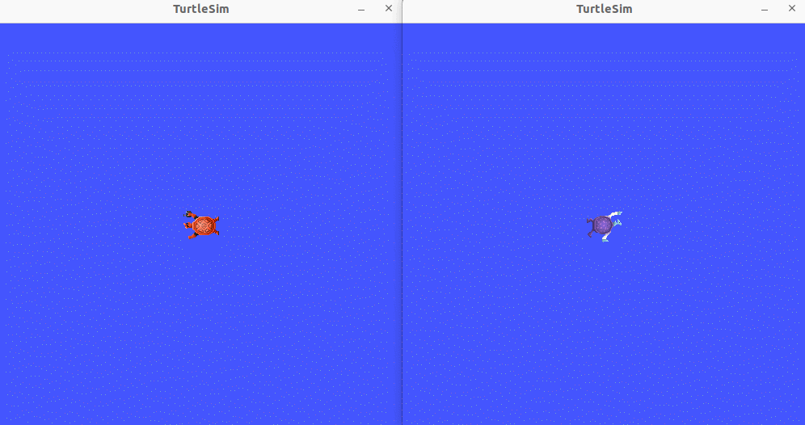


**案例2：**生成一只新的乌龟，并计算与原生乌龟的距离。

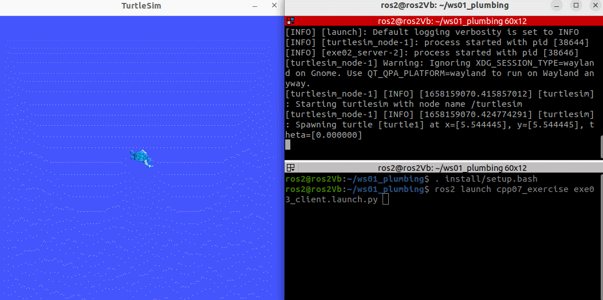


**案例3：**生成一只新的乌龟作为“目标点”，原生乌龟可以运动至该目标点。

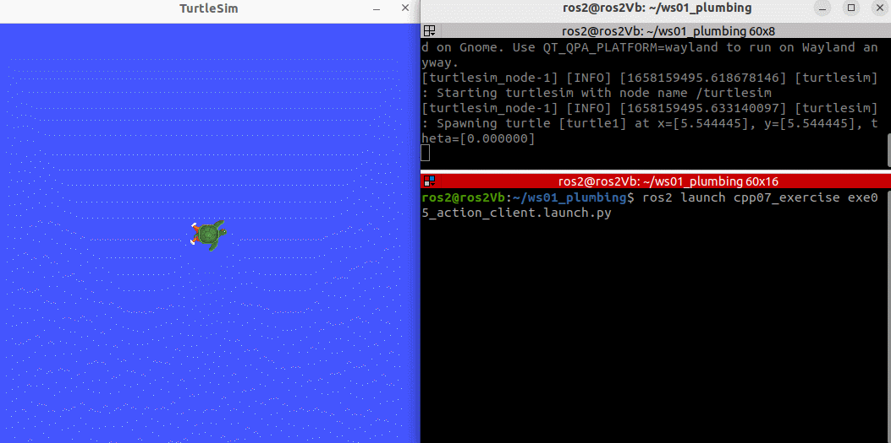


**案例4：**动态修改乌龟窗口的背景颜色。

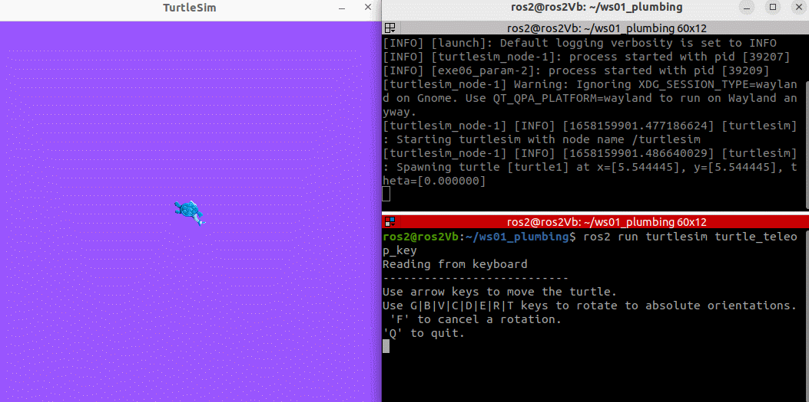


## 3.1 分布式

<font size=4>**场景**</font>

在许多机器人相关的应用场景中都涉及到多台ROS2设备协作，比如：无人车编队、无人机编队、远程控制等等，那么不同的ROS2设备之间是如何实现通信的呢？


<font size=4>**概念**</font>

分布式通信是指可以通过网络在不同主机之间实现数据交互的一种通信策略。

ROS2本身是一个分布式通信框架，可以很方便的实现不同设备之间的通信，ROS2所基于的中间件是DDS，当处于同一网络中时，通过DDS的域ID机制\(ROS\_DOMAIN\_ID\)可以实现分布式通信，大致流程是：在启动节点之前，可以设置域ID的值，不同节点如果域ID相同，那么可以自由发现并通信，反之，如果域ID值不同，则不能实现。默认情况下，所有节点启动时所使用的域ID为0，换言之，只要保证在同一网络，你不需要做任何配置，不同ROS2设备上的不同节点即可实现分布式通信。


<font size=4>**作用**</font>

分布式通信的应用场景是较为广泛的，如上所述：机器人编队时，机器人可能需要获取周边机器人的速度、位置、运行轨迹的相关信息，远程控制时，则可能需要控制端获取机器人采集的环境信息并下发控制指令...... 这些数据的交互都依赖于分布式通信。


<font size=4>**实现**</font>

多机通信时，可以通过域ID对节点进行分组，组内的节点之间可以自由通信，不同组之间的节点则不可通信。如果所有节点都属于同一组，那么直接使用默认域ID即可，如果要将不同节点划分为多个组，那么可以在终端中启动节点前设置该节点的域ID\(比如设置为6\)，具体执行命令为：

```sh
export ROS_DOMAIN_ID=6
```

上述指令执行后，该节点将被划分到ID为6的域内。

如果要为当前设备下的所有节点设置统一的域ID，那么可以执行如下指令：

```sh
echo "export ROS_DOMAIN_ID=6" >> ~/.bashrc
```

执行完毕后再重新启动终端，运行的所有节点将自动被划分到ID为6的域内。

#演示

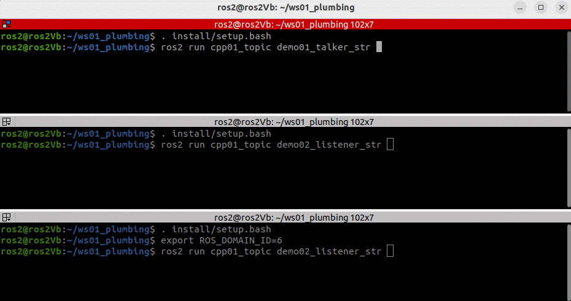


<font size=4>**注意**</font>

在设置ROS\_DOMAIN\_ID的值时并不是随意的，也是有一定约束的：

1. 建议ROS\_DOMAIN\_ID的取值在\[0,101\] 之间，包含0和101；
2. 每个域ID内的节点总数是有限制的，需要小于等于120个；
3. 如果域ID为101，那么该域的节点总数需要小于等于54个。

---


<font size=4>**DDS 域 ID 值的计算规则**</font>

域ID值的相关计算规则如下：

1. DDS是基于TCP/IP或UDP/IP网络通信协议的，网络通信时需要指定端口号，端口号由2个字节的无符号整数表示，其取值范围在\[0,65535\]之间；
2. 端口号的分配也是有其规则的，并非可以任意使用的，根据DDS协议规定以7400作为起始端口，也即可用端口为\[7400,65535\]，又已知按照DDS协议默认情况下，每个域ID占用250个端口，那么域ID的个数为：\(65535-7400\)/250 = 232\(个\)，对应的其取值范围为\[0,231\]；
3. 操作系统还会设置一些预留端口，在DDS中使用端口时，还需要避开这些预留端口，以免使用中产生冲突，不同的操作系统预留端口又有所差异，其最终结果是，在Linux下，可用的域ID为\[0,101\]与\[215-231\]，在Windows和Mac中可用的域ID为\[0,166\]，综上，为了兼容多平台，建议域ID在\[0,101\] 范围内取值。
4. 每个域ID默认占用250个端口，且每个ROS2节点需要占用两个端口，另外，按照DDS协议每个域ID的端口段内，第1、2个端口是Discovery Multicast端口与User Multicast端口，从第11、12个端口开始是域内第一个节点的Discovery Unicast端口与User Unicast，后续节点所占用端口依次顺延，那么一个域ID中的最大节点个数为：\(250-10\)/2 = 120\(个\)；
5. 特殊情况：域ID值为101时，其后半段端口属于操作系统的预留端口，其节点最大个数为54个。

上述计算规则了解即可。

附：

```cpp
域 ID 与节点所占用端口示意

Domain ID:      0
Participant ID: 0

Discovery Multicast Port: 7400
User Multicast Port:      7401
Discovery Unicast Port:   7410
User Unicast Port:        7411

---

Domain ID:      1
Participant ID: 2
Discovery Multicast Port: 7650
User Multicast Port:      7651
Discovery Unicast Port:   7664
User Unicast Port:        7665
```


## 3.2 工作空间覆盖

<font size=4>**场景**</font>

同一工作空间下不允许出现功能包重名的情况，但是当存在多个工作空间时，不同工作空间下的功能包是可以重名的，那么当功能包重名时，会调用哪一个呢？

> 比如：自定义工作空间A存在功能包turtlesim，自定义工作空间B也存在功能包turtlesim，当然系统自带工作空间也存在turtlesim，如果调用turtlesim包，会调用哪个工作空间中的呢？


<font size=4>**概念**</font>

所谓工作空间覆盖，是指不同工作空间存在重名功能包时，重名功能包的调用会产生覆盖的情况。


<font size=4>**作用**</font>

没什么用，这种情况是需要极力避免出现的。


<font size=4>**演示**</font>

1.分别在不同的工作空间下创建turtlesim功能包。

终端下进入ws00\_helloworld的src目录，新建功能包：

```sh
ros2 pkg create turtlesim --node-name turtlesim_node
```

为了方便查看演示结果，将默认生成的 turtlesim\_node.cpp 中的打印内容修改为：`ws00_helloworld turtlesim\n`

终端下进入ws01\_plumbing的src目录，新建功能包：

```sh
ros2 pkg create turtlesim --node-name turtlesim_node
```

为了方便查看演示结果，将默认生成的 turtlesim\_node.cpp 中的打印内容修改为：`ws01_plumbing turtlesim\n`

2.在 ~/.bashrc 文件下追加如下内容：

```sh
source /home/ros2/ws00_helloworld/install/setup.bash
source /home/ros2/ws01_plumbing/install/setup.bash
```

修改完毕后，保存并关闭文件。

3.新建终端，输入如下指令：

```sh
ros2 run turtlesim turtlesim_node
```

输出结果为：`ws01_plumbing turtlesim`，也即执行的是 ws01\_plumbing 功能包下的 turtlesim，而 ws00\_helloworld 下的 turtlesim 与内置的 turtlesim 被覆盖了。


<font size=4>**原因**</font>

这与~/.bashrc中不同工作空间的setup.bash文件的加载顺序有关：

1.ROS2 会解析 ~/.bashrc 文件，并生成全局环境变量 AMENT\_PREFIX\_PATH 与 PYTHONPATH，两个环境变量取值分别对应了 ROS2 中 C++ 和 Python 功能包，环境变量的值由功能包名称组成；

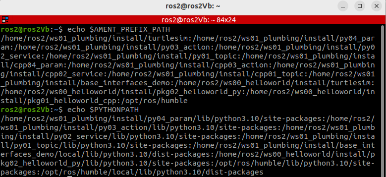

2.两个变量的值的设置与 ~/.bashrc 中的 setup.bash 的配置顺序有关，对于自定义的工作空间而言，后配置的优先级更高，主要表现在后配置的工作空间的功能包在环境变量值组成的前部，而前配置工作空间的功能包在环境变量值组成的后部分，如果更改两个自定义工作空间在 ~/.bashrc 中的配置顺序，那么变量值也将相应更改，但是 ROS2 系统工作空间的配置始终处于最后。

3.调用功能包时，会按照 AMENT\_PREFIX\_PATH 或 PYTHONPATH 中包配置顺序从前往后依次查找相关功能包，查找到功能包时会停止搜索，也即配置在前的会优先执行。


<font size=4>**隐患**</font>

前面提到，工作空间覆盖的情况是需要极力避免出现的，因为导致一些安全隐患：

1. 可能会出现功能包调用混乱，出现实际调用与预期调用结果不符的情况；
2. 即便可以通过 ~/.bashrc 来配置不同工作空间的优先级，但是经过测试，修改 ~/.bashrc 文件之后不一定马上生效，还需要删除工作空间下build与install目录重新编译，才能生效，这个过程繁琐且有不确定性。

综上，在实际工作中，需要制定明确的包命名规范，避免包重名情况。


## 3.3 元功能包

<font size=4>**场景**</font>

> 完成一个系统性的功能，可能涉及到多个功能包，比如实现了机器人导航模块，该模块下有地图、定位、路径规划...等不同的子级功能包。那么调用者安装该模块时，需要逐一的安装每一个功能包吗？

显而易见的，逐一安装功能包的效率低下，在ROS2中，提供了一种方式可以将不同的功能包打包成一个功能包，当安装某个功能模块时，直接调用打包后的功能包即可，该包又称之为元功能包\(metapackage\)。


<font size=4>**概念**</font>

MetaPackage是Linux的一个文件管理系统的概念。是 ROS2 中的一个虚包，里面没有实质性的内容，但是它依赖了其他的软件包，通过这种方法可以把其他包组合起来，我们可以认为它是一本书的目录索引，告诉我们这个包集合中有哪些子包，并且该去哪里下载。

例如：

* sudo apt install ros-&lt;ros2-distro&gt;-desktop 命令安装 ros2 时就使用了元功能包，该元功能包依赖于 ROS2 中的其他一些功能包，安装该包时会一并安装依赖。


<font size=4>**作用**</font>

方便用户的安装，我们只需要这一个包就可以把其他相关的软件包组织到一起安装了。


<font size=4>**实现**</font>

1.新建一个功能包

```sh
ros2 pkg create tutorails_plumbing
```

2.修改 package.xml 文件，添加执行时所依赖的包：

```xml
<?xml version="1.0"?>
<?xml-model href="http://download.ros.org/schema/package_format3.xsd" schematypens="http://www.w3.org/2001/XMLSchema"?>
<package format="3">
  <name>tutorails_plumbing</name>
  <version>0.0.0</version>
  <description>TODO: Package description</description>
  <maintainer email="ros2@todo.todo">ros2</maintainer>
  <license>TODO: License declaration</license>

  <buildtool_depend>ament_cmake</buildtool_depend>

  <exec_depend>base_interfaces_demo</exec_depend>
  <exec_depend>cpp01_topic</exec_depend>
  <exec_depend>cpp02_service</exec_depend>
  <exec_depend>cpp03_action</exec_depend>
  <exec_depend>cpp04_param</exec_depend>
  <exec_depend>py01_topic</exec_depend>
  <exec_depend>py02_service</exec_depend>
  <exec_depend>py03_action</exec_depend>
  <exec_depend>py04_param</exec_depend>


  <export>
    <build_type>ament_cmake</build_type>
  </export>
</package>
```

3.文件CMakeLists.txt内容如下:

```cmake
cmake_minimum_required(VERSION 3.8)
project(tutorails_plumbing)

if(CMAKE_COMPILER_IS_GNUCXX OR CMAKE_CXX_COMPILER_ID MATCHES "Clang")
  add_compile_options(-Wall -Wextra -Wpedantic)
endif()

find_package(ament_cmake REQUIRED)

ament_package()
```


## 3.4 节点重名

<font size=4>**问题描述**</font>

在 ROS2 中不同的节点可以有相同的节点名称，比如可以启动多个 turtlesim\_node 节点，这些节点的名称都是 turtlesim。节点重名虽然是被允许的，但是开发者应该主动避免这种情况，因为节点重名时可能会导致操作上的混淆，仍以启动了多个 turtlesim\_node 节点为例，当使用计算图\(rqt\_graph\)查看节点运行状态时，由于他们的节点名称一致，那么虽然实际有多个节点，但是在计算图上显示一个。并且节点名称也会和话题名称、服务名称、动作名称、参数等产生关联，届时也可能会导致通信逻辑上的混乱。

那么在 ROS2 中如何避免节点重名呢？


<font size=4>**解决思路**</font>

避免重名问题，一般有两种策略：

1. **名称重映射**，也即为节点起别名；
2. **命名空间**，是为节点名称添加前缀，可以有多级，格式：/xxx/yyy/zzz。

这也是在 ROS2 中解决重名问题的常用策略。


<font size=4>**解决方案**</font>

上述两种策略的实现途径主要有如下三种：

1. ros2 run 命令实现；
2. launch 文件实现；
3. 编码实现。

本节将逐一演示上述三种方案的实现语法。


### 3.4.1 ros2 run设置节点名称

<font size=4>**1.ros2 run设置命名空间**</font>

<font size=4>**1.1 设置命名空间演示**</font>

**语法：**ros2 run 包名 节点名 --ros-args --remap \_\_ns:=命名空间

**示例：**

```sh
ros2 run turtlesim turtlesim_node --ros-args --remap __ns:=/t1
```


<font size=4>**1.2 运行结果**</font>

使用`ros2 node list`查看节点信息，显示结果：

```sh
/t1/turtlesim
```


<font size=4>**2.ros2 run名称重映射**</font>

<font size=4>**2.1 为节点起别名**</font>

**语法：** ros2 run 包名 节点名 --ros-args --remap \_\_name:=新名称

或

ros2 run 包名 节点名 --ros-args --remap \_\_node:=新名称

**示例：**

```sh
ros2 run turtlesim turtlesim_node --ros-args --remap __name:=turtle1
```


<font size=4>**2.2运行结果**</font>

使用`ros2 node list`查看节点信息，显示结果：

```sh
/turtle1
```


<font size=4>**3.ros2 run命名空间与名称重映射叠加**</font>

<font size=4>**3.1 设置命名空间同时名称重映射**</font>

语法: ros2 run 包名 节点名 --ros-args --remap \_\_ns:=新名称 --remap \_\_name:=新名称

```sh
ros2 run turtlesim turtlesim_node --ros-args --remap __ns:=/t1 --remap __name:=turtle1
```


<font size=4>**3.2运行结果**</font>

使用`ros2 node list`查看节点信息，显示结果：

```sh
/t1/turtle1
```


### 3.4.2 launch设置节点名称

在ROS2中launch文件可以由Python、XML或YAML三种语言编写（关于launch文件的基本使用可以参考**4.1 启动文件launch简介**），每种实现方式都可以设置节点的命名空间或为节点起别名。


<font size=4>**1.Python方式实现的launch文件设置命名空间与名称重映射**</font>

在 Python 方式实现的 launch 文件中，可以通过类 `launch_ros.actions.Node`来创建被启动的节点对象，在对象的构造函数中提供了 name 和 namespace 参数来设置节点的名称与命名空间，使用示例如下：

```py
from launch import LaunchDescription
from launch_ros.actions import Node

def generate_launch_description():

    return LaunchDescription([
        Node(package="turtlesim",executable="turtlesim_node",name="turtle1"),
        Node(package="turtlesim",executable="turtlesim_node",namespace="t1"),
        Node(package="turtlesim",executable="turtlesim_node",namespace="t1", name="turtle1")
    ])
```


<font size=4>**2.XML方式实现的launch文件设置命名空间与名称重映射**</font>

在 XML 方式实现的 launch 文件中，可以通过 node 标签中 name 和 namespace 属性来设置节点的名称与命名空间，使用示例如下：

```XML
<launch>
    <node pkg="turtlesim" exec="turtlesim_node" name="turtle1" />
    <node pkg="turtlesim" exec="turtlesim_node" namespace="t1" />
    <node pkg="turtlesim" exec="turtlesim_node" namespace="t1" name="turtle1" />
</launch>
```


<font size=4>**3.YAML方式实现的launch文件设置命名空间与名称重映射**</font>

在 YAML 方式实现的 launch 文件中，可以通过 node 属性中 name 和 namespace 属性来设置节点的名称与命名空间，使用示例如下：

```yaml
launch:
- node:
    pkg: turtlesim
    exec: turtlesim_node
    name: turtle1
- node:
    pkg: turtlesim
    exec: turtlesim_node
    namespace: t1
- node:
    pkg: turtlesim
    exec: turtlesim_node
    namespace: t1
    name: turtle1
```


<font size=4>**4.测试**</font>

上述三种方式在设置命名空间与名称重映射时虽然语法不同，但是实现功能类似，都是启动了三个 turtlesim\_node 节点，第一个节点设置了节点名称，第二个节点设置了命名空间，第三个节点既设置了命名空间又设置了节点名称，分别执行三个launch文件，然后使用`ros2 node list`查看节点信息，显示结果都如下所示：

```sh
/t1/turtl1
/t1/turtlesim
/turtle1
```


### 3.4.3 编码设置节点名称

在 rclcpp 和 rclpy 中，节点类的构造函数中，都分别提供了设置节点名称与命名空间的参数。


<font size=4>**1.rclcpp中的相关API**</font>

rclcpp中节点类的构造函数如下：

```cpp
Node (const std::string &node_name, const NodeOptions &options=NodeOptions())
Node (const std::string &node_name, const std::string &namespace_, const NodeOptions &options=NodeOptions())
```

构造函数1中可以直接通过node\_name设置节点名称，构造函数2既可以通过node\_name设置节点名称也可以通过namespace\_设置命名空间。


<font size=4>**2.rclpy中的相关API**</font>

rclpy中节点类的构造函数如下：

```py
Node(node_name, *,
   context=None,
   cli_args=None,
   namespace=None, 
   use_global_arguments=True, 
   enable_rosout=True, 
   start_parameter_services=True, 
   parameter_overrides=None, 
   allow_undeclared_parameters=False, 
   automatically_declare_parameters_from_overrides=False)
```

构造函数中可以使用node\_name设置节点名称，namespace设置命名空间。


## 3.5 话题重名

<font size=4>**问题描述**</font>

节点名称可能出现重名的情况，同理话题名称也可能重名，不过与节点重名不同的是，有些场景下需要避免话题重名的情况，但有些场景下又需要将不同的不同的话题名称修改为相同。

> 在 ROS2 不同的节点之间通信都依赖于话题，话题名称也可能出现重名的情况，话题重名时，系统虽然不会抛出异常，但是通过相同话题名称关联到一起的节点可能并不属于同一通信逻辑，从而导致通信错乱，甚至出现异常。这种情况下可能就需要将相同的话题名称设置为不同。
>
> 又或者，两个节点是属于同一通信逻辑的，但是节点之间话题名称不同，导致通信失败。这种情况下就需要将两个节点的话题名称由不同修改为相同。

那么如何修改话题名称呢？


<font size=4>**解决思路**</font>

与节点重名的解决思路类似的，为了避免话题重名问题，一般有两种策略：

1. **名称重映射**，也即为话题名称起别名；
2. **命名空间**，是为话题名称添加前缀，可以有多级，格式：/xxx/yyy/zzz。

需要注意的是，通过命名空间设置话题名称时，需要保证话题是非全局话题。


<font size=4>**解决方案**</font>

与节点重名解决方案类似的，修改话题名称的方式主要有如下三种：

1. ros2 run 命令实现；
2. launch 文件实现；
3. 编码实现。

本节将逐一演示上述三种方案的实现语法。


### 3.5.1 ros2 run 修改话题名称

<font size=4>**1.ros2 run设置命名空间**</font>

该实现与**3.4.1 ros2 run设置节点名称**中演示的语法使用一致。


<font size=4>**1.1 设置命名空间演示**</font>

**语法：**ros2 run 包名 节点名 --ros-args --remap \_\_ns:=命名空间

**示例：**

```sh
ros2 run turtlesim turtlesim_node --ros-args --remap __ns:=/t1
```


<font size=4>**1.2 运行结果**</font>

使用`ros2 topic list`查看节点信息，显示结果：

```sh
/t1/turtle1/cmd_vel
/t1/turtle1/color_sensor
/t1/turtle1/pose
```

节点下的话题已经添加了命名空间前缀。


<font size=4>**2.ros2 run话题名称重映射**</font>

<font size=4>**2.1 为话题起别**</font>

**语法：** ros2 run 包名 节点名 --ros-args --remap 原话题名称:=新话题名称

**示例：**

```sh
ros2 run turtlesim turtlesim_node --ros-args --remap /turtle1/cmd_vel:=/cmd_vel
```


<font size=4>**2.2 运行结果**</font>

使用 `ros2 topic list` 查看节点信息，显示结果：

```sh
/cmd_vel
/turtle1/color_sensor
/turtle1/pose
```

节点下的话题/turtle1/cmd\_vel已经被修改为了/cmd\_vel。

**注意：**

当为节点添加命名空间时，节点下的所有非全局话题都会前缀命名空间，而重映射的方式只是修改指定话题。


### 3.5.2 launch 文件修改话题名称

<font size=4>**1.Python方式实现的launch文件修改话题名称**</font>

在 Python 方式实现的 launch 文件中，可以通过类 `launch_ros.actions.Node`的构造函数中的参数 remappings 修改话题名称，使用示例如下：

```py
from launch import LaunchDescription
from launch_ros.actions import Node

def generate_launch_description():

    return LaunchDescription([
        Node(package="turtlesim",executable="turtlesim_node",namespace="t1"),
        Node(package="turtlesim",
            executable="turtlesim_node",
            remappings=[("/turtle1/cmd_vel","/cmd_vel")]
        )

    ])
```


<font size=4>**2.XML方式实现的launch文件修改话题名称**</font>

在 XML 方式实现的 launch 文件中，可以通过 node 标签的子标签 remap（属性from取值为被修改的话题名称，属性to的取值为修改后的话题名称） 修改话题名称，使用示例如下：

```xml
<launch>
    <node pkg="turtlesim" exec="turtlesim_node" namespace="t1" />
    <node pkg="turtlesim" exec="turtlesim_node">
        <remap from="/turtle1/cmd_vel" to="/cmd_vel" />
    </node>
</launch>
```


<font size=4>**3.YAML方式实现的launch文件修改话题名称**</font>

在 YAML 方式实现的 launch 文件中，可以通过 node 属性中 remap（属性from取值为被修改的话题名称，属性to的取值为修改后的话题名称） 修改话题名称，使用示例如下：

```yaml
launch:
- node:
    pkg: turtlesim
    exec: turtlesim_node
    namespace: t1
- node:
    pkg: turtlesim
    exec: turtlesim_node
    remap:
    -
        from: "/turtle1/cmd_vel"
        to: "/cmd_vel"
```


<font size=4>**4.测试**</font>

上述三种方式在修改话题名称时虽然语法不同，但是实现功能类似，都是启动了两个`turtlesim_node`节点，一个节点添加了命名空间，另一个节点将话题从`/turtle1/cmd_vel`映射到了`/cmd_vel`。使用`ros2 topic list`查看节点信息，显示结果：

添加命名空间的节点对应的话题为：

```
/t1/turtle1/cmd_vel
/t1/turtle1/color_sensor
/t1/turtle1/pose
```

重映射的节点对应的话题为：

```
/cmd_vel
/turtle1/color_sensor
/turtle1/pose
```


### 3.5.3 编码设置话题名称

<font size=4>**话题分类**</font>

话题的名称的设置是与节点的命名空间、节点的名称有一定关系的，话题名称大致可以分为三种类型:

* 全局话题\(话题参考ROS系统，与节点命名空间平级\)；
* 相对话题\(话题参考的是节点的命名空间，与节点名称平级\)；
* 私有话题\(话题参考节点名称，是节点名称的子级\)。

总之，以编码方式设置话题名称是比较灵活的。本节将介绍如何在 rclcpp 和 rclpy 中分别设置不同类型的话题。


<font size=4>**准备**</font>

请先分别创建 C++ 与 Python 相关的功能包以及节点，且假定在创建节点时，使用的命名空间为 xxx，节点名称为 yyy。


<font size=4>**话题设置**</font>

<font size=4>**1.1 全局话题**</font>

**格式：**定义时以`/`开头的名称，和命名空间、节点名称无关。

**rclcpp示例：**`publisher_ = this->create_publisher<std_msgs::msg::String>("/topic/chatter", 10);`

**rclpy示例：**`self.publisher_ = self.create_publisher(String, '/topic/chatter', 10)`

**话题：**话题名称为 /topic/chatter，与命名空间 xxx 以及节点名称 yyy 无关。


<font size=4>**1.2相对话题**</font>

**格式：**非`/`开头的名称，参考命名空间设置话题名称，和节点名称无关。

**rclcpp示例：**`publisher_ = this->create_publisher<std_msgs::msg::String>("topic/chatter", 10);`

**rclpy示例：**`self.publisher_ = self.create_publisher(String, 'topic/chatter', 10)`

**话题：**话题名称为 /xxx/topic/chatter，与命名空间 xxx 有关，与节点名称 yyy 无关。


<font size=4>**1.3 私有话题**</font>

**格式：**定义时以`~/`开头的名称，和命名空间、节点名称都有关系。

**rclcpp示例：**`publisher_ = this->create_publisher<std_msgs::msg::String>("~/topic/chatter", 10);`

**rclpy示例：**`self.publisher_ = self.create_publisher(String, '~/topic/chatter', 10)`

**话题：**话题名称为 /xxx/yyy/topic/chatter，使用命名空间 xxx 以及节点名称 yyy 作为话题名称前缀。

综上，话题名称设置规则在rclcpp与rclpy中基本一致，且上述规则也同样适用于ros2 run指令与launch文件。


## 3.6 时间相关API

在前面案例中我们已经使用了 ROS2 中的诸多 API，本节主要介绍另一类比较常见的API：时间相关API。


### 3.6.1 Rate

第2章话题通信案例中，要求话题发布方按照一定的频率发布消息，我们实现时是通过定时器来控制发布频率的，其实，除了定时器之外，ROS2 中还提供了 Rate 类，通过该类对象也可以控制程序的运行频率。


<font size=4>**1.rclcpp 中的 Rate**</font>

**示例：**周期性输出一段文本。

```cpp
#include "rclcpp/rclcpp.hpp"

using namespace std::chrono_literals;

int main(int argc, char ** argv)
{
  rclcpp::init(argc,argv);
  auto node = rclcpp::Node::make_shared("rate_demo");
  // rclcpp::Rate rate(1000ms); // 创建 Rate 对象方式1
  rclcpp::Rate rate(1.0); // 创建 Rate 对象方式2
  while (rclcpp::ok())
  {
    RCLCPP_INFO(node->get_logger(),"hello rate");
    // 休眠
    rate.sleep();
  }

  rclcpp::shutdown();
  return 0;
}
```


<font size=4>**2.rclpy 中的 Rate**</font>

rclpy 中的 Rate 对象可以通过节点创建，Rate 对象的 sleep\(\) 函数需要在子线程中执行，否咋会阻塞程序。

**示例：**周期性输出一段文本。

```py
import rclpy
import threading
from rclpy.timer import Rate

rate = None
node = None

def do_some():
    global rate
    global node
    while rclpy.ok():
        node.get_logger().info("hello ---------")
        # 休眠
        rate.sleep()

def main():
    global rate
    global node
    rclpy.init()    
    node = rclpy.create_node("rate_demo")
    # 创建 Rate 对象
    rate = node.create_rate(1.0)
    
    # 创建子线程
    thread = threading.Thread(target=do_some)
    thread.start()

    rclpy.shutdown()

if __name__ == "__main__":
    main()
```


### 3.6.2 Time

<font size=4>**1.rclcpp 中的 Time**</font>

**示例：**创建 Time 对象，并调用其函数。

```cpp
#include "rclcpp/rclcpp.hpp"

int main(int argc, char const *argv[])
{
    rclcpp::init(argc,argv);
    auto node = rclcpp::Node::make_shared("time_demo");

    // 创建 Time 对象
    rclcpp::Time t1(10500000000L);
    rclcpp::Time t2(2,1000000000L);
    // 通过节点获取当前时刻。
    // rclcpp::Time roght_now = node->get_clock()->now();
    rclcpp::Time roght_now = node->now();
    RCLCPP_INFO(node->get_logger(),"s = %.2f, ns = %ld",t1.seconds(),t1.nanoseconds());
    RCLCPP_INFO(node->get_logger(),"s = %.2f, ns = %ld",t2.seconds(),t2.nanoseconds());
    RCLCPP_INFO(node->get_logger(),"s = %.2f, ns = %ld",roght_now.seconds(),roght_now.nanoseconds());

    rclcpp::shutdown();

    return 0;
}
```


<font size=4>**2.rclpy 中的 Time**</font>

**示例：**创建 Time 对象，并调用其函数。

```py
import rclpy
from rclpy.time import Time
def main():
    rclpy.init()
    node = rclpy.create_node("time_demo")
    # 创建 Time 对象
    right_now = node.get_clock().now()
    t1 = Time(seconds=10,nanoseconds=500000000)

    node.get_logger().info("s = %.2f, ns = %d" % (right_now.seconds_nanoseconds()[0], right_now.seconds_nanoseconds()[1]))
    node.get_logger().info("s = %.2f, ns = %d" % (t1.seconds_nanoseconds()[0], t1.seconds_nanoseconds()[1]))
    node.get_logger().info("ns = %d" % right_now.nanoseconds)
    node.get_logger().info("ns = %d" % t1.nanoseconds)
    rclpy.shutdown()

if __name__ == "__main__":
    main()
```


### 3.6.3 Duration

<font size=4>**1.rclcpp 中的 Duration**</font>

**示例：**创建 Duration 对象，并调用其函数。

```cpp
#include "rclcpp/rclcpp.hpp"

using namespace std::chrono_literals;

int main(int argc, char const *argv[])
{
    rclcpp::init(argc,argv);
    auto node = rclcpp::Node::make_shared("duration_node");

    // 创建 Duration 对象
    rclcpp::Duration du1(1s);
    rclcpp::Duration du2(2,500000000);

    RCLCPP_INFO(node->get_logger(),"s = %.2f, ns = %ld", du2.seconds(),du2.nanoseconds());

    rclcpp::shutdown();
    return 0;
}
```


<font size=4>**2.rclpy 中的 Duration**</font>

**示例：**创建 Duration 对象，并调用其函数。

```py
import rclpy
from rclpy.duration import Duration

def main():
    rclpy.init()    

    node = rclpy.create_node("duration_demo")
    du1 = Duration(seconds = 2,nanoseconds = 500000000)
    node.get_logger().info("ns = %d" % du1.nanoseconds)

    rclpy.shutdown()

if __name__ == "__main__":

    main()
```


### 3.6.4 Time 与 Duration 运算

<font size=4>**1.rclcpp 中的运算**</font>

**示例：**Time 以及 Duration 的相关运算。

```cpp
#include "rclcpp/rclcpp.hpp"

int main(int argc, char const *argv[])
{
    rclcpp::init(argc,argv);
    auto node = rclcpp::Node::make_shared("time_opt_demo");

    rclcpp::Time t1(1,500000000);
    rclcpp::Time t2(10,0);

    rclcpp::Duration du1(3,0);
    rclcpp::Duration du2(5,0);

    // 比较
    RCLCPP_INFO(node->get_logger(),"t1 >= t2 ? %d",t1 >= t2);
    RCLCPP_INFO(node->get_logger(),"t1 < t2 ? %d",t1 < t2);
    // 数学运算
    rclcpp::Time t3 = t2 + du1;
    rclcpp::Time t4 = t1 - du1;
    rclcpp::Duration du3 = t2 - t1;

    RCLCPP_INFO(node->get_logger(), "t3 = %.2f",t3.seconds());  
    RCLCPP_INFO(node->get_logger(), "t4 = %.2f",t4.seconds()); 
    RCLCPP_INFO(node->get_logger(), "du3 = %.2f",du3.seconds()); 

    RCLCPP_INFO(node->get_logger(),"--------------------------------------");
    // 比较
    RCLCPP_INFO(node->get_logger(),"du1 >= du2 ? %d", du1 >= du2);
    RCLCPP_INFO(node->get_logger(),"du1 < du2 ? %d", du1 < du2);
    // 数学运算
    rclcpp::Duration du4 = du1 * 3.0;
    rclcpp::Duration du5 = du1 + du2;
    rclcpp::Duration du6 = du1 - du2;

    RCLCPP_INFO(node->get_logger(), "du4 = %.2f",du4.seconds()); 
    RCLCPP_INFO(node->get_logger(), "du5 = %.2f",du5.seconds()); 
    RCLCPP_INFO(node->get_logger(), "du6 = %.2f",du6.seconds()); 

    rclcpp::shutdown();
    return 0;
}
```


<font size=4>**2.rclpy 中的运算**</font>

**示例：**Time 以及 Duration 的相关运算。

```py
import rclpy
from rclpy.time import Time
from rclpy.duration import Duration

def main():
    rclpy.init()
    node = rclpy.create_node("time_opt_node")
    t1 = Time(seconds=10)
    t2 = Time(seconds=4)

    du1 = Duration(seconds=3)
    du2 = Duration(seconds=5)

    # 比较
    node.get_logger().info("t1 >= t2 ? %d" % (t1 >= t2))
    node.get_logger().info("t1 < t2 ? %d" % (t1 < t2))
    # 数学运算
    t3 = t1 + du1
    t4 = t1 - t2    
    t5 = t1 - du1

    node.get_logger().info("t3 = %d" % t3.nanoseconds)
    node.get_logger().info("t4 = %d" % t4.nanoseconds)
    node.get_logger().info("t5 = %d" % t5.nanoseconds)

    # 比较
    node.get_logger().info("-" * 80)
    node.get_logger().info("du1 >= du2 ? %d" % (du1 >= du2))
    node.get_logger().info("du1 < du2 ? %d" % (du1 < du2))

    rclpy.shutdown()

if __name__ == "__main__":
    main()
```


## 3.7 通信机制工具

<font size=4>**场景**</font>

上一章内容，我们学习了ROS2中的多种通信机制，了解了不同通信模型的实现流程、相关API以及各自的特点，接下来我们再介绍一些实际开发当中可能会遇到的一些问题：

> 1.一个完整的机器人系统启动之后，其组成是比较复杂的，可能包含十几个、几十个甚至上百个节点，不同的节点可能又包含一个或多个通信对象\(话题发布方、话题订阅方、服务端、客户端、动作服务端、动作客户端、参数服务端、参数客户端\)，通信时还需要使用到各种各样的msg、srv或action接口消息，那么在开发过程中，如何才能方便的获取这些节点、话题、服务、动作、参数以及接口相关的信息呢？  
> 2.编写通信实现，通信至少涉及到双方，一方编写完毕后，如何验证程序是否可以正常运行呢？  
> 3.话题通信过程中，发布方程序中设置了消息的发布频率，如何判断实际运行中的发布频率是否和设置的频率一致呢？  
> ......

在ROS2中提供了一些工具，可以方便快捷的解决上述问题，本部分内容就主要介绍这些工具的使用。


<font size=4>**概念**</font>

在ROS2中，通信机制相关的工具有两种类型，分别是命令行工具和图形化工具（rqt），前者是一系列终端命令的集合，后者则是ROS2基于QT框架，针对机器人开发的一系列可视化工具的集合。


<font size=4>**作用**</font>

可以方便的实现程序调试，提高开发效率，优化用户体验。


### 3.7.1 命令工具

ROS2中常用的命令如下：

* **ros2 node**：节点相关命令行工具
* **ros2 interface**：接口\(msg、srv、action\)消息相关的命令行工具
* **ros2 topic**：话题通信相关的命令行工具
* **ros2 service**：服务通信相关的命令行工具
* **ros2 action**：动作通信相关的命令行工具
* **ros2 param**：参数服务相关的命令行工具

关于命令的使用一般都会提供帮助文档，帮助文档的获取方式如下：

* 可以通过 `命令 -h` 或 `命令 --help` 的方式查看命令帮助文档，比如：`ros2 node -h` 或 `ros2 node --help`。

* 命令下参数的使用也可以通过 `命令 参数 -h` 或 `命令 参数 --help` 的方式查看帮助文档，比如：`ros2 node list -h` 或 `ros2 node list --help`。


<font size=4>**1.ros2 node**</font>

ros2 node的基本使用语法如下：

```
info  输出节点信息
list  输出运行中的节点的列表
```


<font size=4>**2.ros2 interace**</font>

ros2 interace的基本使用语法如下：

```
list      输出所有可用的接口消息
package   输出指定功能包下的
packages  输出包含接口消息的功能包
proto     输出接口消息原型
show      输出接口消息定义格式
```


<font size=4>**3.ros2 topic**</font>

ros2 topic的基本使用语法如下：

```
bw       输出话题消息传输占用的带宽
delay    输出带有 header 的话题延迟
echo     输出某个话题下的消息
find     根据类型查找话题
hz       输出消息发布频率
info     输出话题相关信息
list     输出运行中的话题列表
pub      向指定话题发布消息
type     输出话题使用的接口类型
```


<font size=4>**4.ros2 service**</font>

ros2 service的基本使用语法如下：

```
call  向某个服务发送请求
find  根据类型查找服务
list  输出运行中的服务列表
type  输出服务使用的接口类型
```


<font size=4>**5.ros2 action**</font>

ros2 action的基本使用语法如下：

```
info       输出指定动作的相关信息
list       输出运行中的动作的列表
send_goal  向指定动作发送请求
```


<font size=4>**6.ros2 param**</font>

ros2 param的基本使用语法如下：

```
delete    删除参数
describe  输出参数的描述信息
dump      将节点参数写入到磁盘文件
get       获取某个参数
list      输出可用的参数的列表
load      从磁盘文件加载参数到节点
set       设置参数
```


### 3.7.2 rqt工具箱

本节主要介绍ROS2中rqt工具箱的使用，比如：rqt的安装、启动与插件使用等。


<font size=4>**1.安装**</font>

* 一般只要安装的是desktop版本就会默认安装rqt工具箱；

* 如果需要安装可以以如下方式安装

    ```sh
    sudo apt install ros-humble-rqt*
    ```


<font size=4>**2.启动**</font>

常用的 `rqt `启动命令有：

* 方式1：`rqt`

* 方式2：`ros2 run rqt_gui rqt_gui`


<font size=4>**3.插件使用**</font>

启动rqt之后，可以通过plugins添加所需的插件：

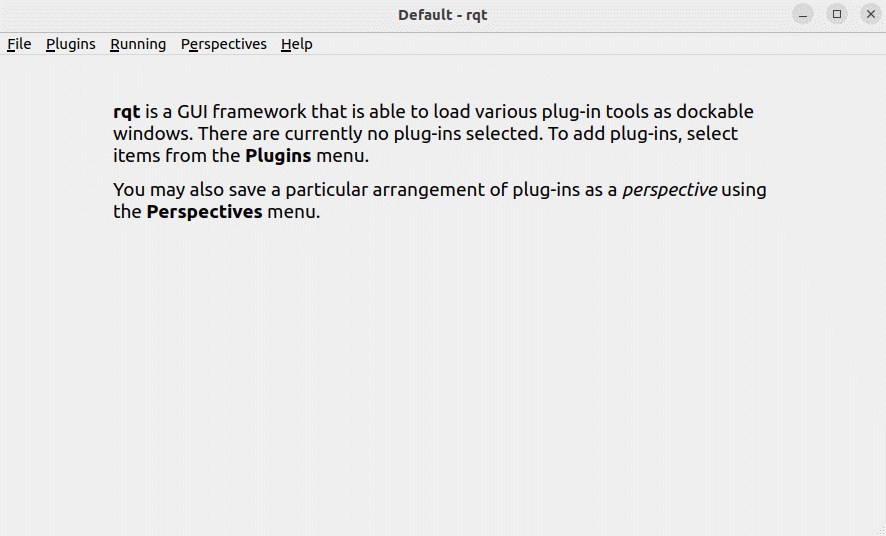

在plugins中包含了话题、服务、动作、参数、日志等等相关的插件，我们可以按需选用，方便的实现ROS2程序调试。使用示例如下。


<font size=4>**1.topic 插件**</font>

添加topic插件并发送速度指令控制乌龟运动。

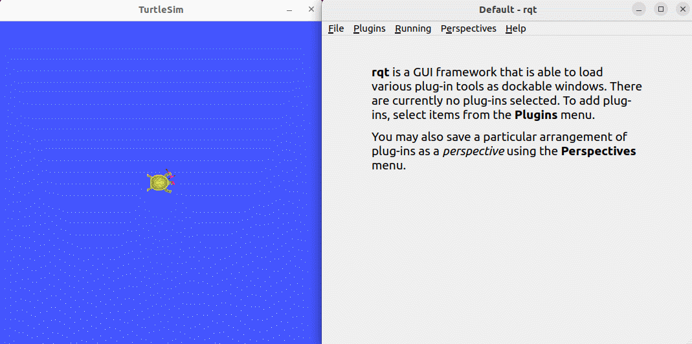


<font size=4>**2.service插件**</font>

添加 service 插件并发送请求，在制定位置生成一只乌龟。


<font size=4>**3.参数插件**</font>

通过参数插件动态修改乌龟窗体背景颜色。

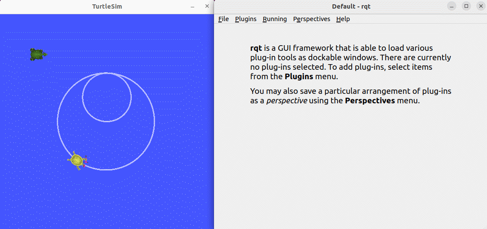


## 3.8 通信机制实操

本节主要介绍通信机制相关的一些练习，这些练习基于turtlesim功能包，练习类型覆盖了话题、服务、动作、参数这四种通信机制。

准备

终端下进入工作空间的src目录，调用如下命令创建C++功能包。

```sh
ros2 pkg create cpp07_exercise --build-type ament_cmake --dependencies rclcpp turtlesim base_interfaces_demo geometry_msgs rclcpp_action
```

功能包下新建launch目录以备用。


### 3.8.1 话题通信案例分析

<font size=4>**1.案例需求**</font>

**需求：**启动两个turtlesim\_node节点，节点2中的乌龟自动调头180°，我们可以通过键盘控制节点1中的乌龟运动，但是不能控制节点2的乌龟，需要自实现功能：可以根据乌龟1的速度生成并发布控制乌龟2运动的速度指令，最终两只乌龟做镜像运动。


<font size=4>**2.案例分析**</font>

在上述案例中，主要需要关注的问题有三个：

1. 如何创建两个turtlesim\_node节点，且需要具有不同的节点名称、话题名称。
2. 如何控制乌龟掉头？
3. 核心实现是如何订阅乌龟1的速度并生成发布控制乌龟2运动的速度指令的？

思路：

1. 问题1我们可以通过为turtlesim\_node设置namespace解决；
2. 问题2可以通过调用turtlesim\_node内置的action功能来实现乌龟航向的设置；
3. 问题3是整个案例的核心，需要编码实现，需要订阅乌龟1的位姿相关话题来获取乌龟1的速度，并且按照“镜像运动”的需求生成乌龟2的速度指令，并且该节点需要在掉头完毕后启动。
4. 最后，整个案例涉及到多个节点，我们可以通过launch文件集成这些节点。


<font size=4>**3.流程简介**</font>

主要步骤如下：

1. 编写速度订阅与发布实现；
2. 编写launch文件集成多个节点；
3. 编辑配置文件；
4. 编译；
5. 执行。


### 3.8.2 话题通信实现

<font size=4>**1.速度订阅与发布**</font>

功能包cpp07\_exercise的src目录下，新建C++文件exe01\_pub\_sub.cpp，并编辑文件，输入如下内容：

```cpp
/*
   需求：订阅窗口1中的乌龟速度，然后生成控制窗口2乌龟运动的指令并发布。
   步骤：
       1.包含头文件；
       2.初始化 ROS2 客户端；
       3.定义节点类；
          3-1.创建控制第二个窗体乌龟运动的发布方；
          3-2.创建订阅第一个窗体乌龟pose的订阅方；
          3-3.根据订阅的乌龟的速度生成控制窗口2乌龟运动的速度消息并发布。
       4.调用spin函数，并传入节点对象指针；
       5.释放资源。
*/
// 1.包含头文件；
#include <rclcpp/rclcpp.hpp>
#include <turtlesim/msg/pose.hpp>
#include <geometry_msgs/msg/twist.hpp>
// 3.定义节点类；
class ExePubSub : public rclcpp::Node
{
public:
  ExePubSub() : rclcpp::Node("demo01_pub_sub")
  {
    // 3-1.创建控制第二个窗体乌龟运动的发布方；
    twist_pub_ = this->create_publisher<geometry_msgs::msg::Twist>("/t2/turtle1/cmd_vel", 1);
    // 3-2.创建订阅第一个窗体乌龟pose的订阅方；
    pose_sub_ = this->create_subscription<turtlesim::msg::Pose>(
      "/turtle1/pose", 1, std::bind(&ExePubSub::poseCallback, this, std::placeholders::_1));
  }

private:
  // 3-3.根据订阅的乌龟的速度生成控制窗口2乌龟运动的速度消息并发布。
  void poseCallback(const turtlesim::msg::Pose::ConstSharedPtr pose)
  {
    geometry_msgs::msg::Twist twist;
    twist.angular.z = -(pose->angular_velocity); //角速度取反
    twist.linear.x = pose->linear_velocity; //线速度不变
    twist_pub_->publish(twist);
  }

  rclcpp::Publisher<geometry_msgs::msg::Twist>::SharedPtr twist_pub_;
  rclcpp::Subscription<turtlesim::msg::Pose>::SharedPtr pose_sub_;
};

int main(int argc, char** argv)
{
  // 2.初始化 ROS2 客户端；
  rclcpp::init(argc, argv);
  // 4.调用spin函数，并传入节点对象指针；
  rclcpp::spin(std::make_shared<ExePubSub>());
  // 5.释放资源。
  rclcpp::shutdown();
}
```


<font size=4>**2.launch文件**</font>

功能包cpp07\_exercise的launch目录下，新建launch文件exe01\_pub\_sub.launch.py，并编辑文件，输入如下内容：

```py
from launch import LaunchDescription
from launch_ros.actions import Node
from launch.actions import ExecuteProcess,RegisterEventHandler
from launch.event_handlers import OnProcessExit

def generate_launch_description():
    # 1.创建两个 turtlesim_node 节点
    t1 = Node(package="turtlesim",executable="turtlesim_node")
    t2 = Node(package="turtlesim",executable="turtlesim_node",namespace="t2")
    # 2.让第二只乌龟掉头
    rotate = ExecuteProcess(
        cmd=["ros2 action send_goal /t2/turtle1/rotate_absolute turtlesim/action/RotateAbsolute \"{'theta': 3.14}\""],
        output="both",
        shell=True
    )
    # 3.自实现的订阅发布实现
    pub_sub = Node(package="cpp07_exercise",executable="exe01_pub_sub")
    # 4.乌龟掉头完毕后，开始执行步骤3
    rotate_exit_event = RegisterEventHandler(
        event_handler=OnProcessExit(
            target_action=rotate,
            on_exit=pub_sub
        )
    )
    return LaunchDescription([t1,t2,rotate,rotate_exit_event])
```


<font size=4>**3.编辑配置文件**</font>

<font size=4>**3.1 package.xml**</font>

在创建功能包时，所依赖的功能包已经自动配置了，配置内容如下：

```XML
<depend>rclcpp</depend>
<depend>turtlesim</depend>
<depend>base_interfaces_demo</depend>
<depend>geometry_msgs</depend>
<depend>rclcpp_action</depend>
```


<font size=4>**3.2 CMakeLists.txt**</font>

CMakeLists.txt 中发布和订阅程序核心配置如下：

```cmake
# find dependencies
find_package(ament_cmake REQUIRED)
find_package(rclcpp REQUIRED)
find_package(turtlesim REQUIRED)
find_package(base_interfaces_demo REQUIRED)
find_package(geometry_msgs REQUIRED)
find_package(rclcpp_action REQUIRED)

add_executable(exe01_pub_sub src/exe01_pub_sub.cpp)
ament_target_dependencies(
  exe01_pub_sub
  "rclcpp"
  "turtlesim"
  "geometry_msgs"
)
install(TARGETS 
  exe01_pub_sub
  DESTINATION lib/${PROJECT_NAME})

install(DIRECTORY launch DESTINATION share/${PROJECT_NAME})
```


<font size=4>**4.编译**</font>

终端中进入当前工作空间，编译功能包：

```sh
colcon build --packages-select cpp07_exercise
```


<font size=4>**5.执行**</font>

当前工作空间下，启动终端输入如下指令：

```sh
. install/setup.bash
ros2 launch cpp07_exercise exe01_pub_sub.launch.py
```

指令执行后，将生成两个turtlesim\_node节点对应的窗口，并且其中一个窗口的乌龟开始调头。

再启动一个终端，输入如下指令：

```sh
ros2 run turtlesim turtle_teleop_key
```

待乌龟调头完毕，就可以通过键盘控制乌龟运动了，最终运行结果与演示案例类似。


### 3.8.3 服务通信案例分析

<font size=4>**1.案例需求**</font>

**需求：**在turtlesim\_node节点的窗体中在指定位置生成一只新乌龟并可以输出两只乌龟之间的直线距离。


<font size=4>**2.案例分析**</font>

在上述案例中，需要关注的问题有两个：

1. 如何在指定位置生成一只新乌龟？
2. 计算两只乌龟的距离应该使用何种通信模式又如何实现？

思路：

1. 问题1可以通过调用turtlesim\_node内置的名称为/spawn的服务功能来实现新乌龟的创建；
2. 问题2可以通过服务通信来实现，客户端发送新生成的乌龟的位姿到服务端，服务端根据该坐标以及原生乌龟的坐标计算距离并响应。当然如果使用服务通信，还需要自定义服务接口。
3. 最后，整个案例涉及到多个节点，我们可以通过launch文件集成这些节点。


<font size=4>**3.流程简介**</font>

主要步骤如下：

1. 编写服务接口文件；
2. 编写服务端实现；
3. 编写客户端实现；
4. 编写launch文件；
5. 编辑配置文件；
6. 编译；
7. 执行。


### 3.8.4 服务通信实现

<font size=4>**1.服务接口文件**</font>

功能包base\_interfaces\_demo的srv目录下，新建srv文件Distance.srv，并编辑文件，输入如下内容：

```
float32 x
float32 y
float32 theta
---
float32 distance
```


<font size=4>**2.服务端实现**</font>

功能包cpp07\_exercise的src目录下，新建C++文件exe02\_server.cpp，并编辑文件，输入如下内容：

```cpp
/*
   需求：处理请求发送的目标点，计算乌龟与目标点之间的直线距离。
   步骤：
       1.包含头文件；
       2.初始化 ROS2 客户端；
       3.定义节点类；
            3-1.创建乌龟姿态订阅方，回调函数中获取x坐标与y坐标；
            3-2.创建服务端；
            3-3.解析目标值，计算距离并反馈结果。
       4.调用spin函数，并传入节点对象指针；
       5.释放资源。
*/
// 1.包含头文件；
#include "rclcpp/rclcpp.hpp"
#include "base_interfaces_demo/srv/distance.hpp"
#include "turtlesim/msg/pose.hpp"
#include "turtlesim/srv/spawn.hpp"

using namespace std::chrono_literals;
// 3.定义节点类；
class ExeDistanceServer: public rclcpp::Node {
public:
    ExeDistanceServer():Node("exe_distance_server"),turtle1_x(0.0),turtle1_y(0.0){
        // 3-1.创建乌龟姿态订阅方，回调函数中获取x坐标与y坐标；
        pose_sub = this->create_subscription<turtlesim::msg::Pose>("/turtle1/pose",10,std::bind(&ExeDistanceServer::poseCallBack, this, std::placeholders::_1));
        // 3-2.创建服务端；
        distance_server = this->create_service<base_interfaces_demo::srv::Distance>("distance",std::bind(&ExeDistanceServer::distanceCallBack, this, std::placeholders::_1, std::placeholders::_2));
    }
private:
    void poseCallBack(const turtlesim::msg::Pose::SharedPtr pose){
        turtle1_x = pose->x;
        turtle1_y = pose->y;
    }
    // 3-3.解析目标值，计算距离并反馈结果。
    void distanceCallBack(const base_interfaces_demo::srv::Distance_Request::SharedPtr request,
                    base_interfaces_demo::srv::Distance_Response::SharedPtr response
    ){
        // 解析目标值
        float goal_x = request->x;
        float goal_y = request->y;

        // 距离计算
        float x = goal_x - turtle1_x;
        float y = goal_y - turtle1_y;
        // 将结果设置到响应
        response->distance = std::sqrt(x * x + y * y);
        RCLCPP_INFO(this->get_logger(),"目标坐标:(%.2f,%.2f),距离:%.2f",goal_x,goal_y,response->distance);

    }
    rclcpp::Subscription<turtlesim::msg::Pose>::SharedPtr pose_sub;
    rclcpp::Service<base_interfaces_demo::srv::Distance>::SharedPtr distance_server;
    float turtle1_x;
    float turtle1_y;


};

int main(int argc, char const *argv[])
{
    // 2.初始化 ROS2 客户端；
    rclcpp::init(argc,argv);
    // 4.调用spin函数，并传入节点对象指针；
    rclcpp::spin(std::make_shared<ExeDistanceServer>());
    // 5.释放资源。
    rclcpp::shutdown();
    return 0;
}
```


<font size=4>**3.客户端实现**</font>

功能包cpp07\_exercise的src目录下，新建C++文件exe03\_client.cpp，并编辑文件，输入如下内容：

```cpp
/*
   需求：发布目标点的坐标，接收并处理服务端反馈的结果。
   步骤：
       1.包含头文件；
       2.初始化 ROS2 客户端；
       3.定义节点类；
            3-1.创建客户端；
            3-2.连接服务；
            3-3.发送请求。
       4.调用对象服务连接、发送请求、处理响应相关函数；
       5.释放资源。
*/
// 1.包含头文件；
#include "rclcpp/rclcpp.hpp"
#include "base_interfaces_demo/srv/distance.hpp"
#include "turtlesim/srv/spawn.hpp"

using namespace std::chrono_literals;

// 3.定义节点类；
class ExeDistanceClient: public rclcpp::Node {
public:
    ExeDistanceClient():Node("exe_distance_client"){
        // 3-1.创建客户端；
        distance_client = this->create_client<base_interfaces_demo::srv::Distance>("distance");
    }   
    // 3-2.连接服务；
    bool connect_server(){
      while (!distance_client->wait_for_service(1s))
      {
        if (!rclcpp::ok())
        {
          RCLCPP_INFO(this->get_logger(),"客户端退出！");
          return false;
        }

        RCLCPP_INFO(this->get_logger(),"服务连接中，请稍候...");
      }
      return true;
    }
    // 3-3.发送请求。
    rclcpp::Client<base_interfaces_demo::srv::Distance>::FutureAndRequestId send_distance(float x,float y,float theta){
        auto distance_request = std::make_shared<base_interfaces_demo::srv::Distance::Request>();
        distance_request->x = x;
        distance_request->y = y;
        distance_request->theta = theta;
        return distance_client->async_send_request(distance_request);
    }
private:
    rclcpp::Client<base_interfaces_demo::srv::Distance>::SharedPtr distance_client;
};
int main(int argc, char const *argv[])
{
    // 2.初始化 ROS2 客户端；
    rclcpp::init(argc,argv);
    // 4.调用对象服务连接、发送请求、处理响应相关函数；
    auto client = std::make_shared<ExeDistanceClient>();
    // 处理传入的参数
    if (argc != 5)
    {
        RCLCPP_INFO(client->get_logger(),"请传入目标的位姿参数:(x,y,theta)");
        return 1;
    }

    float x = atof(argv[1]);
    float y = atof(argv[2]);
    float theta = atof(argv[3]);
    // 服务连接
    bool flag = client->connect_server();
    if (!flag)
    {
        RCLCPP_INFO(client->get_logger(),"服务连接失败!");
        return 1;
    }
    // 发送请求
    auto distance_future = client->send_distance(x, y, theta);
    // 处理响应
    if(rclcpp::spin_until_future_complete(client,distance_future) == rclcpp::FutureReturnCode::SUCCESS){
        RCLCPP_INFO(client->get_logger(),"两只乌龟相距%.2f米。",distance_future.get()->distance);
    } else {
        RCLCPP_INFO(client->get_logger(),"获取距离服务失败!");
    }
    // 5.释放资源。
    rclcpp::shutdown();
    return 0;
}
```


<font size=4>**4.launch文件**</font>

该案例需要分别为服务端和客户端创建launch文件。

功能包cpp07\_exercise的launch目录下，首先新建服务端launch文件exe02\_server.launch.py，编辑文件，输入如下内容：

```py
from launch import LaunchDescription
from launch_ros.actions import Node

def generate_launch_description():
    # 创建turtlesim_node节点
    turtle = Node(package="turtlesim",executable="turtlesim_node")
    # 创建测距服务端节点
    server = Node(package="cpp07_exercise",executable="exe02_server")

    return LaunchDescription([turtle,server])
```

然后新建客户端launch文件exe03\_client.launch.py，编辑文件，输入如下内容：

```py
from launch import LaunchDescription
from launch_ros.actions import Node
from launch.actions import ExecuteProcess

def generate_launch_description():
    # 设置目标点的坐标，以及目标点乌龟的名称
    x = 8.54
    y = 9.54
    theta = 0.0
    name = "t2"
    # 生成新的乌龟
    spawn = ExecuteProcess(
        cmd=["ros2 service call /spawn turtlesim/srv/Spawn \"{'x': "
                + str(x) + ",'y': " + str(y) + ",'theta': " + str(theta) + ",'name': '" + name + "'}\""],
        # output="both",
        shell=True
    )
    # 创建客户端节点
    client = Node(package="cpp07_exercise",
                executable="exe03_client",
                arguments=[str(x),str(y),str(theta)])
    return LaunchDescription([spawn,client])
```


<font size=4>**5.编辑配置文件**</font>

此处需要编辑base\_interfaces\_demo和cpp07\_exercise两个功能包下的配置文件。


<font size=4>**5.1 base_interfaces_demo下的CMakeLists.txtt**</font>

鉴于功能包base\_interfaces\_demo的基础配置以及设置过了，所以只需要修改CMakeLists.txt中的rosidl\_generate\_interfaces 函数即可，修改后的内容如下：

```cmake
rosidl_generate_interfaces(${PROJECT_NAME}
  "msg/Student.msg"
  "srv/AddInts.srv"
  "srv/Distance.srv"
  "action/Progress.action"
)
```


<font size=4>**5.2 cpp07_exercise下的CMakeLists.txt**</font>

CMakeLists.txt 文件需要添加如下内容：

```cmake
add_executable(exe02_server src/exe02_server.cpp)
ament_target_dependencies(
  exe02_server
  "rclcpp"
  "turtlesim"
  "base_interfaces_demo"
  "geometry_msgs"
)
add_executable(exe03_client src/exe03_client.cpp)
ament_target_dependencies(
  exe03_client
  "rclcpp"
  "turtlesim"
  "base_interfaces_demo"
  "geometry_msgs"
)
```

文件中 install 修改为如下内容：

```cmake
install(TARGETS 
  exe01_pub_sub
  exe02_server
  exe03_client
  DESTINATION lib/${PROJECT_NAME})
```


<font size=4>**6.编译**</font>

终端中进入当前工作空间，编译功能包：

```sh
colcon build --packages-select base_interfaces_demo cpp07_exercise
```


<font size=4>**7.执行**</font>

当前工作空间下，启动两个终端。

终端1输入如下指令：

```
. install/setup.bash
ros2 launch cpp07_exercise exe02_server.launch.py
```

指令执行后，将生成turtlesim\_node节点对应的窗口，并且会启动自定义的测距服务端。

终端2输入如下指令：

```
. install/setup.bash
ros2 launch cpp07_exercise exe03_client.launch.py
```

指令执行后，会生成一只新的乌龟，并且输出两只乌龟的直线距离，最终运行结果与演示案例类似。


### 3.8.5 动作通信案例分析

<font size=4>**1.案例需求**</font>

**需求：**处理请求发送的目标点，控制乌龟向该目标点运动，并连续反馈乌龟与目标点之间的剩余距离。


<font size=4>**2.案例分析**</font>

在上述案例与服务通信案例类似，需要关注的问题有两个：

1. 如何在指定位置生成一只新乌龟？
2. 控制原生乌龟向目标乌龟运动并连续反馈剩余距离应该使用何种通信模式又如何实现？

思路：

1. 问题1可以通过调用turtlesim\_node内置的名称为/spawn的服务功能来实现新乌龟的创建；
2. 问题2可以通过动作通信来实现，动作客户端发送新生成的乌龟的位姿到动作服务端，服务端根据该坐标以及原生乌龟的坐标计计算出二者距离，计算速度并控制原生乌龟运动。当然如果使用动作通信，还需要自定义动作接口。
3. 最后，整个案例涉及到多个节点，我们可以通过launch文件集成这些节点。


<font size=4>**3.流程简介**</font>

主要步骤如下：

1. 编写动作接口文件；
2. 编写动作服务端实现；
3. 编写动作客户端实现；
4. 编写launch文件；
5. 编辑配置文件；
6. 编译；
7. 执行。


### 3.8.6 动作通信实现

<font size=4>**1.动作接口文件**</font>

功能包base\_interfaces\_demo的action目录下，新建action文件Nav.action，并编辑文件，输入如下内容：

```cpp
float32 goal_x
float32 goal_y
float32 goal_theta
---
float32 turtle_x
float32 turtle_y
float32 turtle_theta
---
float32 distance
```


<font size=4>**2.动作服务端实现**</font>

功能包cpp07\_exercise的src目录下，新建C++文件exe04\_action\_server.cpp，并编辑文件，输入如下内容：

```cpp
/*
   需求：处理请求发送的目标点，控制乌龟向该目标点运动，并连续反馈乌龟与目标点之间的剩余距离。
   步骤：
       1.包含头文件；
       2.初始化 ROS2 客户端；
       3.定义节点类；
            3-1.创建原生乌龟位姿订阅方，回调函数中获取乌龟位姿；
            3-2.创建原生乌龟速度发布方；
            3-3.创建动作服务端；
            3-4.解析动作客户端发送的请求；
            3-5.处理动作客户端发送的取消请求；
            3-6.创建新线程处理请求；
            3-7.新线程产生连续反馈并响应最终结果。
       4.调用spin函数，并传入节点对象指针；
       5.释放资源。
*/
// 1.包含头文件； 
#include "rclcpp/rclcpp.hpp"
#include "rclcpp_action/rclcpp_action.hpp"
#include "base_interfaces_demo/action/nav.hpp"
#include "turtlesim/msg/pose.hpp"
#include "geometry_msgs/msg/twist.hpp"

using base_interfaces_demo::action::Nav;
using namespace std::placeholders;

// 3.定义节点类；
class ExeNavActionServer: public rclcpp::Node {
public:
    ExeNavActionServer(const rclcpp::NodeOptions & options = rclcpp::NodeOptions()):
        Node("exe_nav_action_server",options){
        // 3-1.创建原生乌龟位姿订阅方，回调函数中获取乌龟位姿；
        pose_sub = this->create_subscription<turtlesim::msg::Pose>("/turtle1/pose",10,std::bind(&ExeNavActionServer::poseCallBack, this, std::placeholders::_1));
        // 3-2.创建原生乌龟速度发布方；
        cmd_vel_pub = this->create_publisher<geometry_msgs::msg::Twist>("/turtle1/cmd_vel",10);
        // 3-3.创建动作服务端；
        nav_action_server = rclcpp_action::create_server<Nav>(
            this,
            "nav",
            std::bind(&ExeNavActionServer::handle_goal,this,_1,_2),
            std::bind(&ExeNavActionServer::handle_cancel,this,_1),
            std::bind(&ExeNavActionServer::handle_accepted,this,_1)
            );

    }
private:
    turtlesim::msg::Pose::SharedPtr turtle1_pose = nullptr;
    rclcpp::Subscription<turtlesim::msg::Pose>::SharedPtr pose_sub;
    rclcpp_action::Server<Nav>::SharedPtr nav_action_server;
    rclcpp::Publisher<geometry_msgs::msg::Twist>::SharedPtr cmd_vel_pub;
    void poseCallBack(const turtlesim::msg::Pose::SharedPtr pose){
        turtle1_pose = pose;
    }
    // 3-4.解析动作客户端发送的请求；
    rclcpp_action::GoalResponse handle_goal(const rclcpp_action::GoalUUID & goal_uuid, std::shared_ptr<const Nav::Goal> goal){
        (void)goal_uuid;
        RCLCPP_INFO(this->get_logger(),"请求坐标:(%.2f,%.2f),航向:%.2f", goal->goal_x,goal->goal_y,goal->goal_theta);
        if (goal->goal_x < 0 || goal->goal_x > 11.1 || goal->goal_y < 0 || goal->goal_y > 11.1)
        {
            return rclcpp_action::GoalResponse::REJECT;
        }

        return rclcpp_action::GoalResponse::ACCEPT_AND_EXECUTE;
    }
    // 3-5.处理动作客户端发送的取消请求；
    rclcpp_action::CancelResponse handle_cancel(std::shared_ptr<rclcpp_action::ServerGoalHandle<Nav>> goal_handle){
        (void)goal_handle;
        RCLCPP_INFO(this->get_logger(),"任务取消!");
        return rclcpp_action::CancelResponse::ACCEPT;
    }
    // 3-7.新线程产生连续反馈并响应最终结果。
    void execute(std::shared_ptr<rclcpp_action::ServerGoalHandle<Nav>> goal_handle){
        RCLCPP_INFO(this->get_logger(),"开始执行任务......");
        // 解析目标值
        float goal_x = goal_handle->get_goal()->goal_x;
        float goal_y = goal_handle->get_goal()->goal_y;
        // 创建连续反馈对象指针；
        auto feedback = std::make_shared<Nav::Feedback>();
        // 创建最终结果对象指针；
        auto result = std::make_shared<Nav::Result>();

        rclcpp::Rate rate(1.0);
        while (true)
        {
            // 任务执行中，关于客户端发送取消请求的处理；
            if(goal_handle->is_canceling()){
                goal_handle->canceled(result);
                return;
            }
            // 解析原生乌龟位姿数据；
            float turtle1_x = turtle1_pose->x;
            float turtle1_y = turtle1_pose->y;
            float turtle1_theta = turtle1_pose->theta;
            // 计算原生乌龟与目标乌龟的x向以及y向距离；
            float x_distance = goal_x - turtle1_x;
            float y_distance = goal_y - turtle1_y;


            // 计算速度
            geometry_msgs::msg::Twist twist;
            double scale = 0.5;
            twist.linear.x = scale * x_distance;
            twist.linear.y = scale * y_distance;
            cmd_vel_pub->publish(twist);
            // 计算剩余距离
            float distance = sqrt(pow(x_distance,2) + pow(y_distance,2));

            // 当两龟距离小于0.15米时，将当前乌龟位姿设置进result并退出循环
            if (distance < 0.15)
            {   
                //将当前乌龟坐标赋值给 result
                result->turtle_x = turtle1_x;
                result->turtle_y = turtle1_y;
                result->turtle_theta = turtle1_theta;
                break;
            }
            // 为feedback设置数据并发布
            feedback->distance = distance;
            goal_handle->publish_feedback(feedback);

            rate.sleep();
        }
        // 设置最终响应结果
        if (rclcpp::ok())
        {
            goal_handle->succeed(result);
            RCLCPP_INFO(this->get_logger(),"任务结束!");
        }


    }
    // 3-6.创建新线程处理请求；
    void handle_accepted(std::shared_ptr<rclcpp_action::ServerGoalHandle<Nav>> goal_handle){
        std::thread{std::bind(&ExeNavActionServer::execute,this,_1),goal_handle}.detach();
    }


};

int main(int argc, char const *argv[])
{
    // 2.初始化 ROS2 客户端；
    rclcpp::init(argc,argv);
    // 4.调用spin函数，并传入节点对象指针；
    rclcpp::spin(std::make_shared<ExeNavActionServer>());
    // 5.释放资源。
    rclcpp::shutdown();
    return 0;
}
```


<font size=4>**3.动作客户端实现**</font>

功能包cpp07\_exercise的src目录下，新建C++文件exe05\_action\_client.cpp，并编辑文件，输入如下内容：

```cpp
/*
   需求：向动作服务端发送目标点数据，并处理服务端的响应数据。
   步骤：
       1.包含头文件；
       2.初始化 ROS2 客户端；
       3.定义节点类；
            3-1.创建动作客户端；
            3-2.发送请求数据，并处理服务端响应；
            3-3.处理目标响应；
            3-4.处理响应的连续反馈；
            3-5.处理最终响应。
       4.调用spin函数，并传入节点对象指针；
       5.释放资源。
*/
// 1.包含头文件；
#include "rclcpp/rclcpp.hpp"
#include "rclcpp_action/rclcpp_action.hpp"
#include "base_interfaces_demo/action/nav.hpp"
#include "turtlesim/srv/spawn.hpp"

using base_interfaces_demo::action::Nav;
using namespace std::chrono_literals;
using namespace std::placeholders;

// 3.定义节点类；
class ExeNavActionClient: public rclcpp::Node{
public:
    ExeNavActionClient(const rclcpp::NodeOptions & options = rclcpp::NodeOptions())
    :Node("exe_nav_action_client",options){
        // 3-1.创建动作客户端；
        nav_client = rclcpp_action::create_client<Nav>(this,"nav");
    }
    // 3-2.发送请求数据，并处理服务端响应；
    void send_goal(float x, float y, float theta){
        // 连接动作服务端，如果超时（5s），那么直接退出。
        if (!nav_client->wait_for_action_server(5s))
        {
            RCLCPP_ERROR(this->get_logger(),"服务连接失败!");
            return;
        }
        // 组织请求数据
        auto goal_msg = Nav::Goal();
        goal_msg.goal_x = x;
        goal_msg.goal_y = y;
        goal_msg.goal_theta = theta;
        //const rclcpp_action::Client<base_interfaces_demo::action::Nav>::SendGoalOptions &options
        rclcpp_action::Client<Nav>::SendGoalOptions options;
        options.goal_response_callback = std::bind(&ExeNavActionClient::goal_response_callback, this, _1);
        options.feedback_callback = std::bind(&ExeNavActionClient::feedback_callback, this, _1, _2);
        options.result_callback = std::bind(&ExeNavActionClient::result_callback, this, _1);
        // 发送
        nav_client->async_send_goal(goal_msg,options);

    }
private:
    rclcpp_action::Client<Nav>::SharedPtr nav_client;
    // 3-3.处理目标响应；
    void goal_response_callback(rclcpp_action::ClientGoalHandle<Nav>::SharedPtr goal_handle){
        if(!goal_handle){
            RCLCPP_ERROR(this->get_logger(),"目标请求被服务器拒绝");
        } else {
            RCLCPP_INFO(this->get_logger(),"目标请求被接收!");
        }
    }
    // 3-4.处理响应的连续反馈；
    void feedback_callback(rclcpp_action::ClientGoalHandle<Nav>::SharedPtr goal_handle, 
        const std::shared_ptr<const Nav::Feedback> feedback){
        (void)goal_handle;
        RCLCPP_INFO(this->get_logger(),"距离目标点还有 %.2f 米。",feedback->distance);
    }
    // 3-5.处理最终响应。
    void result_callback(const rclcpp_action::ClientGoalHandle<Nav>::WrappedResult & result){
        switch (result.code){
        case rclcpp_action::ResultCode::SUCCEEDED :
            RCLCPP_INFO(this->get_logger(),
                "乌龟最终坐标:(%.2f,%.2f),航向:%.2f",
                            result.result->turtle_x,
                            result.result->turtle_y,
                            result.result->turtle_theta
                            );
            break;
        case rclcpp_action::ResultCode::CANCELED:
            RCLCPP_ERROR(this->get_logger(),"任务被取消");
            break;      
        case rclcpp_action::ResultCode::ABORTED:
            RCLCPP_ERROR(this->get_logger(),"任务被中止");
            break;   
        default:
            RCLCPP_ERROR(this->get_logger(),"未知异常");
            break;
        }
        // rclcpp::shutdown();
    }
};

int main(int argc, char const *argv[])
{
    // 2.初始化 ROS2 客户端；
    rclcpp::init(argc,argv);
    // 4.调用spin函数，并传入节点对象指针；
    auto client = std::make_shared<ExeNavActionClient>();

    if (argc != 5)
    {
        RCLCPP_INFO(client->get_logger(),"请传入目标的位姿参数:(x,y,theta)");
        return 1;
    }
    // 发送目标点
    client->send_goal(atof(argv[1]), atof(argv[2]), atof(argv[3]));
    rclcpp::spin(client);
    // 5.释放资源。
    rclcpp::shutdown();
    return 0;
}
```


<font size=4>**4.launch文件**</font>

该案例需要分别为动作服务端和动作客户端创建launch文件。

功能包cpp07\_exercise的launch目录下，首先新建动作服务端launch文件exe04\_action\_server.launch.py，编辑文件，输入如下内容：

```py
from launch import LaunchDescription
from launch_ros.actions import Node

def generate_launch_description():
    # 创建turtlesim_node节点
    turtle = Node(package="turtlesim",executable="turtlesim_node")
    # 创建动作服务端节点
    server = Node(package="cpp07_exercise",executable="exe04_action_server")

    return LaunchDescription([turtle,server])
```

然后新建动作客户端launch文件exe05\_action\_client.launch.py，编辑文件，输入如下内容：

```py
from launch import LaunchDescription
from launch_ros.actions import Node
from launch.actions import ExecuteProcess

def generate_launch_description():
    # 设置目标点的坐标，以及目标点乌龟的名称
    x = 8.54
    y = 9.54
    theta = 0.0
    name = "t3"
    # 生成新的乌龟
    spawn = ExecuteProcess(
        cmd=["ros2 service call /spawn turtlesim/srv/Spawn \"{'x': "
                + str(x) + ",'y': " + str(y) + ",'theta': " + str(theta) + ",'name': '" + name + "'}\""],
        # output="both",
        shell=True
    )
    # 创建动作客户端节点
    client = Node(package="cpp07_exercise",
                executable="exe05_action_client",
                arguments=[str(x),str(y),str(theta)])
    return LaunchDescription([spawn,client])
```


<font size=4>**5.编辑配置文件**</font>

此处需要编辑base\_interfaces\_demo和cpp07\_exercise两个功能包下的配置文件。


<font size=4>**5.1 base_interfaces_demo下的CMakeLists.txt**</font>

和前面服务通信一样，只需要修改CMakeLists.txt中的rosidl\_generate\_interfaces 函数即可，修改后的内容如下：

```cmake
rosidl_generate_interfaces(${PROJECT_NAME}
  "msg/Student.msg"
  "srv/AddInts.srv"
  "srv/Distance.srv"
  "action/Progress.action"
  "action/Nav.action"
)
```


<font size=4>**5.2 cpp07_exercise下的CMakeLists.txt**</font>

CMakeLists.txt 文件需要添加如下内容：

```cmake
add_executable(exe04_action_server src/exe04_action_server.cpp)
ament_target_dependencies(
  exe04_action_server
  "rclcpp"
  "turtlesim"
  "base_interfaces_demo"
  "geometry_msgs"
  "rclcpp_action"
)

add_executable(exe05_action_client src/exe05_action_client.cpp)
ament_target_dependencies(
  exe05_action_client
  "rclcpp"
  "turtlesim"
  "base_interfaces_demo"
  "geometry_msgs"
  "rclcpp_action"
)
```

文件中 install 修改为如下内容：

```cmake
install(TARGETS 
  exe01_pub_sub
  exe02_server
  exe03_client
  exe04_action_server
  exe05_action_client  
  DESTINATION lib/${PROJECT_NAME})
```


<font size=4>**6.编译**</font>

终端中进入当前工作空间，编译功能包：

```sh
colcon build --packages-select base_interfaces_demo cpp07_exercise
```


<font size=4>**7.执行**</font>

当前工作空间下，启动两个终端。

终端1输入如下指令：

```sh
. install/setup.bash
ros2 launch cpp07_exercise exe04_action_server.launch.py
```

指令执行后，将生成turtlesim\_node节点对应的窗口，并且会启动乌龟导航的动作服务端。

终端2输入如下指令：

```sh
. install/setup.bash
ros2 launch cpp07_exercise exe05_action_client.launch.py
```

指令执行后，会生成一只新的乌龟，并且原生乌龟会以新乌龟为目标点向其运动，运动过程中，动作客户端会接收服务端连续反馈的剩余距离消息，最终运行结果与演示案例类似。


### 3.8.7 参数服务案例分析

<font size=4>**1.案例需求**</font>

**需求：**动态修改乌龟窗口的背景颜色。


<font size=4>**2.案例分析**</font>

在上述案例中，只需要修改背景色相关参数即可。


<font size=4>**3.流程简介**</font>

主要步骤如下：

1. 编写参数客户端实现；
2. 编写launch文件；
3. 编辑配置文件；
4. 编译；
5. 执行。


### 3.8.8 参数服务实现

<font size=4>**1.参数客户端实现**</font>

功能包cpp07\_exercise的src目录下，新建C++文件exe06\_param.cpp，并编辑文件，输入如下内容：

```cpp
/*
   需求：修改turtlesim_node的背景颜色。
   步骤：
       1.包含头文件；
       2.初始化 ROS2 客户端；
       3.定义节点类；
            3-1.创建参数客户端；
            3-2.连接参数服务端；
            3-3.更新参数。
       4.创建对象指针,并调用其函数；
       5.释放资源。
*/
// 1.包含头文件；
#include "rclcpp/rclcpp.hpp"

using namespace std::chrono_literals;
// 3.定义节点类；
class ExeParamClient: public rclcpp::Node{
public:
    ExeParamClient():Node("exe_param_client"),red(0){
        // 3-1.创建参数客户端；
        param_client = std::make_shared<rclcpp::SyncParametersClient>(this,"/turtlesim");
    }
    // 3-2.连接参数服务端；
    bool connect_server(){
        while (!param_client->wait_for_service(1s))
        {
            if (!rclcpp::ok())
            {
                RCLCPP_INFO(this->get_logger(),"终端退出!");
                return false;
            }

            RCLCPP_INFO(this->get_logger(),"参数服务连接中，请稍等......");
        }
        return true;
    }
    // 3-3.更新参数。
    void update_param(){
        red = param_client->get_parameter<int32_t>("background_r");
        rclcpp::Rate rate(30.0);
        int i = red;
        while (rclcpp::ok())
        {
            i < 255 ? red += 5 : red -= 5;
            i += 5;
            if(i >= 510) i = 0;

            // RCLCPP_INFO(this->get_logger(),"red = %d", red);
            param_client->set_parameters({rclcpp::Parameter("background_r",red)});
            rate.sleep();
        }

    }
private:
    rclcpp::SyncParametersClient::SharedPtr param_client;
    int32_t red;
};

int main(int argc, char const *argv[])
{
    // 2.初始化 ROS2 客户端；
    rclcpp::init(argc,argv);

    // 4.创建对象指针,并调用其函数；
    auto param_client = std::make_shared<ExeParamClient>();
    if(!param_client->connect_server()) return 1;
    param_client->update_param();

    // rclcpp::spin(param_client);
    // 5.释放资源。
    rclcpp::shutdown();
    return 0;
}
```


<font size=4>**2.launch文件**</font>

功能包cpp07\_exercise的launch目录下，新建launch文件exe06\_param.launch.py，并编辑文件，输入如下内容：

```py
from launch import LaunchDescription
from launch_ros.actions import Node

def generate_launch_description():
    # 创建turtlesim_node节点
    turtle = Node(package="turtlesim",executable="turtlesim_node")
    # 创建背景色修改节点
    param = Node(package="cpp07_exercise",executable="exe06_param")

    return LaunchDescription([turtle,param])
```


<font size=4>**3.编辑配置文件**</font>

package.xml 无需修改，CMakeLists.txt 文件需要添加如下内容：

```cmake
add_executable(exe06_param src/exe06_param.cpp)
ament_target_dependencies(
  exe06_param
  "rclcpp"
  "turtlesim"
)
```

文件中 install 修改为如下内容：

```cmake
install(TARGETS 
  exe01_pub_sub
  exe02_server
  exe03_client
  exe04_action_server
  exe05_action_client
  exe06_param
  DESTINATION lib/${PROJECT_NAME})
```


<font size=4>**4.编译**</font>

终端中进入当前工作空间，编译功能包：

```sh
colcon build --packages-select cpp07_exercise
```


<font size=4>**5.执行**</font>

当前工作空间下，启动终端输入如下指令：

```
. install/setup.bash
ros2 launch cpp07_exercise exe06_param.launch.py
```

指令执行后，将生成turtlesim\_node节点对应的窗口，窗口背景色会动态改变，最终运行结果与演示案例类似。


## 3.9 本章小结

本章主要介绍了通信机制相关的一些补充内容，相关知识点如下：

* 分布式环境搭建；
* 各种重名问题（包重名、节点重名、话题重名）；
* 元功能包；
* 时间相关API；
* 通信机制常用工具；

ROS2中的分布式环境搭建极其便捷，只需要保证不同的ROS2设备在同一网络下，默认不同设备之间即可正常通信；关于重名问题，不同工作空间下功能包重名应该是尽力避免重名的，节点重名与话题重名的问题则可以通过两种策略、三种途径解决；元功能包是一个特殊的功能包，相当于是一个包目录索引，可以将具有内在关联的功能包关联到一起；时间相关的API则介绍了在ROS2中一些常用的定时器、频率控制和持续时间相关的一些API，这些API都是经常使用的；通信机制工具主要介绍了通信相关的命令行工具以及图形化的rqt工具箱，通过这些工具可以提高开发者的开发、调试效率。

