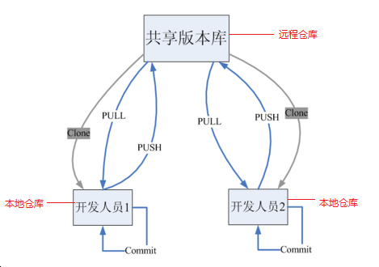
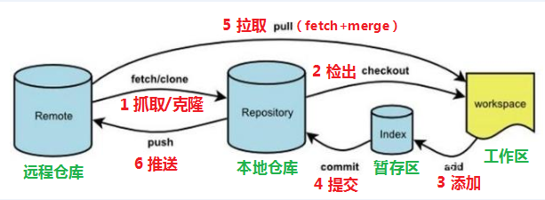
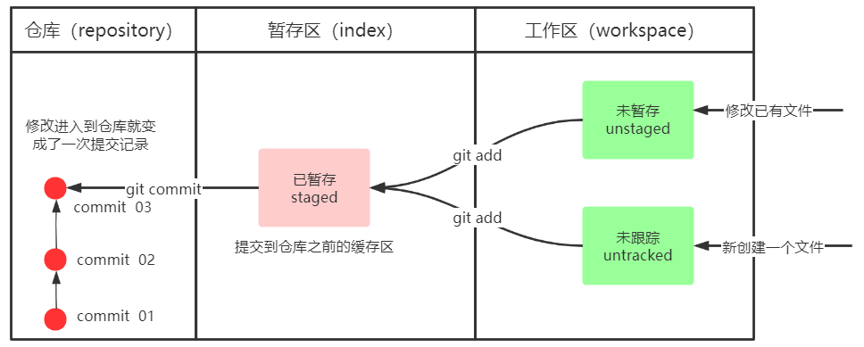
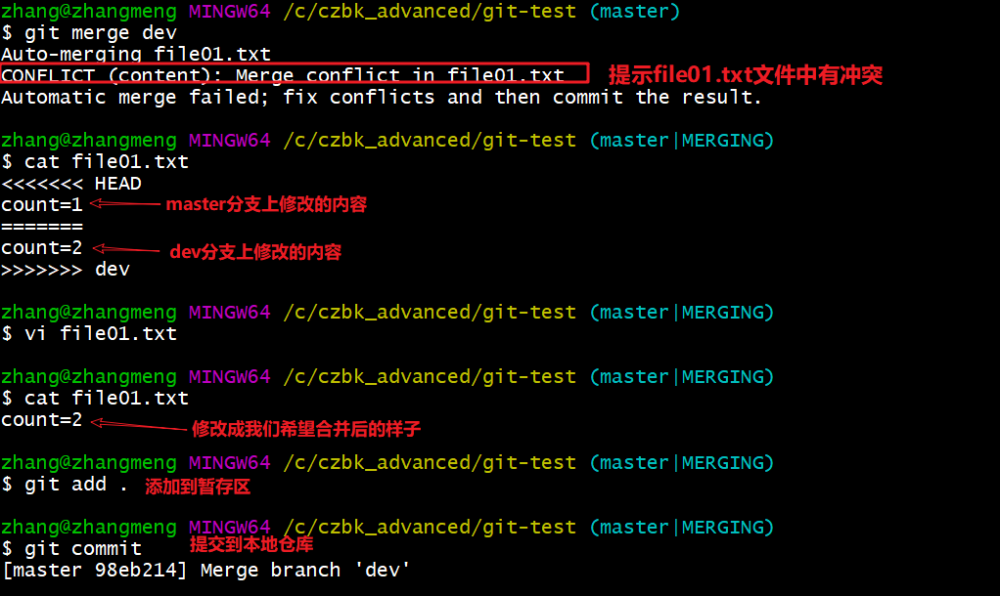
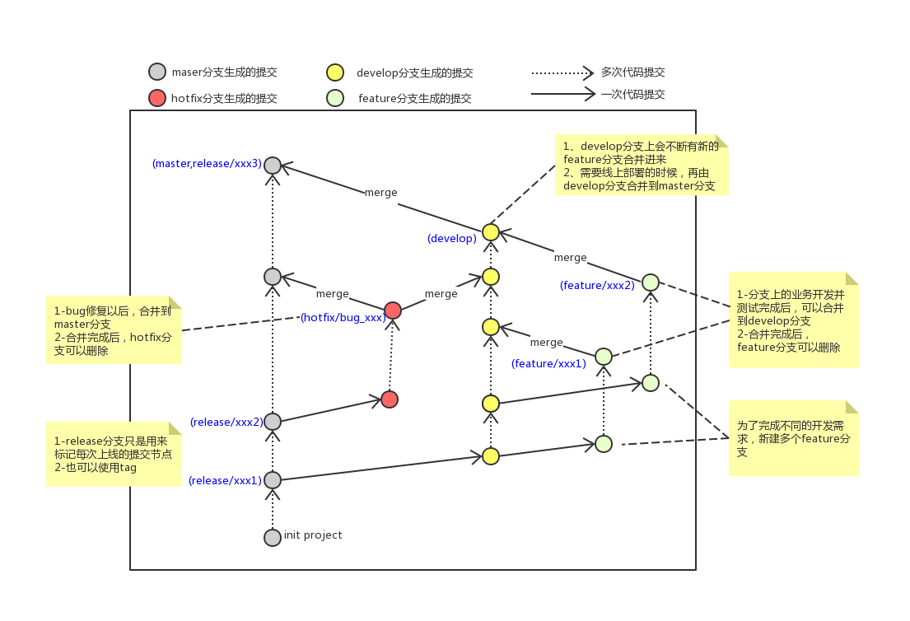
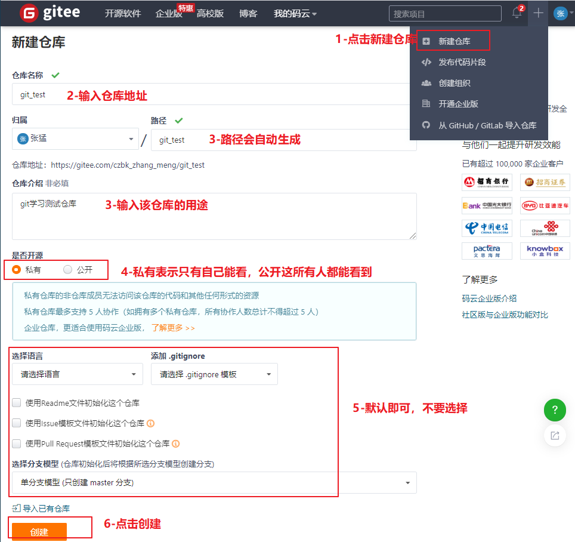
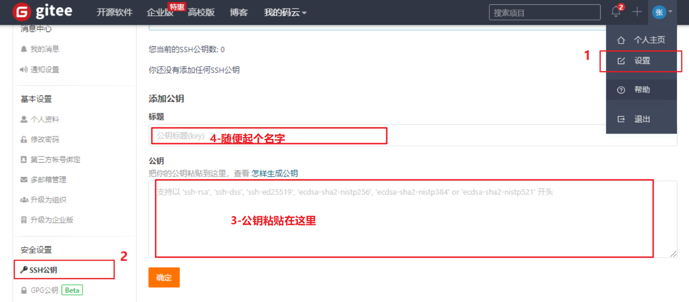
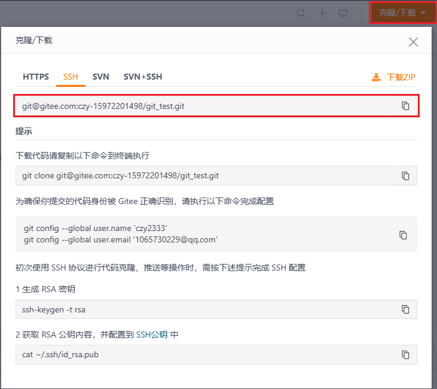
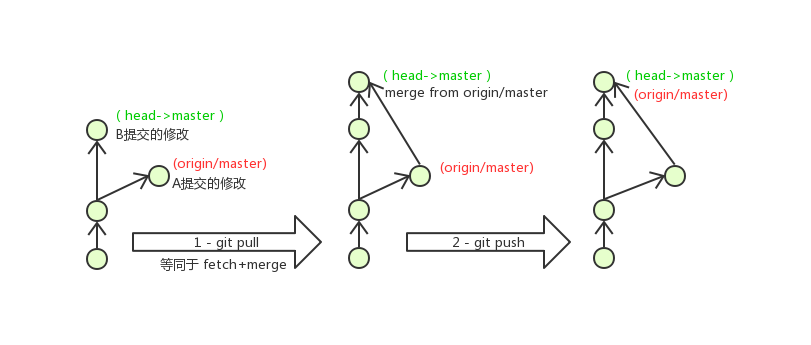

# Git

## 1 概述

git 是一个开源的分布式版本控制系统，可以有效、高速地处理从很小到非常大的项目版本管理




git 的工作流程：



1. clone：从远程仓库中==克隆==代码到本地仓库
2. checkout：从本地仓库中==检出==一个仓库分支然后进行修订
3. add：在提交前先将代码==提交==到暂存区
4. commit：==提交==到本地仓库，本地仓库中保存修改的各个历史版本
5. fetch：从远程库，==抓取==到本地仓库，不进行任何的合并动作，一般操作比较少
6. pull：从远程库==拉取==到本地库，自动进行合并（merge），然后放到到工作区，相当于 `fetch+merge`
7. push：修改完成后，需要和团队成员共享代码时，将代码==推送==到远程仓库


## 2 下载与配置

下载地址：

[https://git-scm.com/download](https://git-scm.com/download) 


基本配置：
1. 打开Git Bash

2. 设置用户信息

```sh
# 设置用户名和邮箱
git config --global user.name "xxxx"
git config --global user.email "xxx@xxx.xxx"

# 查看配置信息
git config --global user.name
git config --global user.email
```


常用指令配置别名：

```sh
# 创建.bashrc
touch ~/.bashrc

# 在.bashrc中加入以下内容
alias git-log='git log --pretty=oneline --all --graph --abbrev-commit'	#用于输出git提交日志
alias ll='ls -al'	#用于输出当前目录所有文件及基本信息

# 执行.bashrc
source ~/.bashrc
```

注意：

`.bashrc` 是 home 目录下的一个 shell 文件，用于储存用户的个性化设置（若是 Windows 系统则在 `C:\Users\用户名` 下）


防止乱码：

```sh
# 输出文件路径使用原始字符
git config --global core.quotepath false

# C:\Program Files\Git\etc\bash.bashrc 文件最后加入下面两行
export LANG="zh_CN.UTF-8"
export LC_ALL="zh_CN.UTF-8"
```


## 3 本地操作

1. 将当前目录下初始化为本地 Git 仓库

```sh
git init
```





2. 查看暂存区、工作区的修改的状态

```sh
git status
```


3. 提交工作区到暂存区

```sh
git add 单个文件名	# 提交单个文件
git add 通配符		 # 提交所有匹配的文件

# 例
git add hello.cpp	# 提交一个文件
git add *.txt		# 提交所有 txt 文件
git add log*.txt	# 提交所有 log 开头的 txt 文件
git add docs/		# 提交所有 /docs 目录下的文件
git add .			# 提交所有且包括隐藏文件
git add *			# 提交所有不包括隐藏文件
```


4. 提交暂存区到本地仓库

```sh
git commit -m '注释内容'
```


5. 查看提交日志

```sh
git log [option]	# option 为可选参数
git-log		# 已经在配置中设置了可选参数
```


6. 版本回退（切换到其他版本）

```sh
git reset --hard commitID
# commitID 可以使用 git-log 或 git log 指令查看

# 查看已经删除的记录
git reflog
```

注意：`commitID` 可以选40个字符的或7个字符的


## 4 分支合并

分支的作用：可以把你的工作从开发主线上分离开来进行重大的 Bug 修改、开发新的功能，以免影响开发主线


分支操作：

```sh
# 查看本地分支
git branch
# 创建本地分支
git branch 分支名

# 切换分支
git checkout 分支名
# 创建并切换分支
git checkout -b 分支名

# 合并分支
# 将另一个分支上的提交合并到所在分支
git merge 分支名称

# 删除分支
# 不能删除当前分支, 只能删除其他分支
git branch -d 分支名	# 会检查分支是否已被合并
git branch -D 分支名	# 不做任何检查, 强制删除
```


解决冲突：

当两个分支上对文件的修改可能会存在冲突，例如同时修改了同一个文件的同一行，这时就需要手动解决冲突

1. 打开冲突文件自己修改冲突内容
2. 将解决完冲突的文件加入暂存区，并提交到仓库

注意：git 会以你自己修改的内容为主（有冲突就自己重写）





常见分支：

* `master`

    线上分支，主分支，中小规模项目作为线上运行的应用对应的分支；

* `develop`

    是从master创建的分支，一般作为开发部门的主要开发分支

    阶段开发完成后，需要是合并到master分支，准备上线

* `feature/xxxx`

    从develop创建的分支，一般是同期并行开发，但不同期上线时创建的分支

    分支上的研发任务完成后合并到develop分支

* `hotfix/xxxx`

    从master派生的分支，一般作为线上bug修复使用

    修复完成后需要合并到master、test、develop分支

* 其他分支，在此不再详述，例如`test`（用于代码测试）、`pre`（预上线分支）等等




## 5 远程仓库配置

以 gitee 为例：

1. 注册码云
2. 创建远程仓库

 


3. 配置SSH公钥

```sh
# 生成SSH公钥
# 如果公钥已经存在, 则自动覆盖
ssh-keygen -t rsa

# 获取公钥
cat ~/.ssh/id_rsa.pub

# 将公钥连接到gitee账户

# 验证是否配置成功
ssh -T git@gitee.com
```


 


## 6 远程仓库操作

1. 添加远程仓库：

此操作是先初始化本地库，然后与已创建的远程库进行对接

```sh
git remote add <远端名称> <仓库路径>
```

远端名称，默认是 `origin`，取决于远端服务器设置

仓库路径，从远端服务器获取此URL（直接复制远程仓库的网址）

 


2. 查看远程仓库

```sh
git remote
```


3. 推送到远程仓库

```sh
git push [-f] [--set-upstream] [远端名称 [本地分支名][:远端分支名] ]
# -f 表示强制覆盖
# --set-upstream 推送到远端的同时并建立起和远端分支的关联关系

# 远程分支名和本地分支名称相同, 则可以只写本地分支
git push origin master

# 建立两个分支的关联
git push --set-upstream origin master:master	# 分支名相同可以省略
git push --set-upstream origin master

# 若当前分支已经和远端分支关联, 则可以省略分支名和远端名
git push
```


4. 查看关联关系

```sh
git branch -vv
```


5. 仓库克隆

```sh
git clone <仓库路径> [本地目录]		# 本地目录可以省略, 会自动生成一个目录
```


6. 抓取和拉取

```sh
# 抓取
# 抓取指令就是将仓库里的更新都抓取到本地, 不会进行合并
git fetch [remote name] [branch name]

# 拉取
# 拉取指令就是将远端仓库的修改拉到本地并自动进行合并, 等同于fetch+merge
git pull [remote name] [branch name]
```

注意：

* 如果抓取和拉取不指定远端名称和分支名，则抓取所有分支

* 若在一段时间，A、B用户修改了同一个文件，且修改了同一行位置的代码，此时会发生合并冲突

    A用户在本地修改代码后优先推送到远程仓库，此时B用户在本地修订代码，提交到本地仓库后，也需要推送到远程仓库

    此时B用户晚于A用户，故需要先拉取远程仓库的提交，经过合并后才能推送到远端分支


