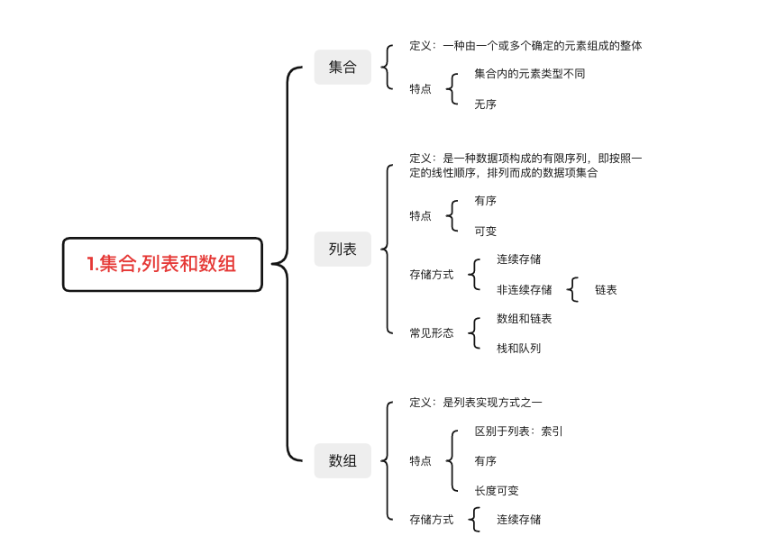

# 0 顺序表

## 0.0 集合,列表和数组


本文中介绍的概念为适用于所有编程语言的抽象理论，具体实现会由编程语言的不同而稍有差别

具体介绍数组之前，我们先来了解一下集合、列表和数组的概念之间的差别


### 0.0.0 集合
集合一般被定义为：由一个或多个确定的元素所构成的整体

通俗来讲，集合就是将一组事物组合在一起


你可以将力扣的题库看作一个集合：


也可以将力扣商店里的礼品看作一个集合：


甚至可以将桌面上的物品当作一个集合


集合有什么特性呢？

*   首先，**集合里的元素类型不一定相同**

    你可以将商品看作一个集合，也可以将整个商店看作一个集合，这个商店中有人或者其他物品也没有关系

*   其次，**集合里的元素没有顺序**

     我们不会这样讲：我想要集合中的第三个元素，因为集合是没有顺序的

    

事实上，这样的集合并不直接存在于编程语言中

然而，实际编程语言中的很多数据结构，就是在集合的基础上添加了一些规则形成的

 


### 0.0.1 列表
列表（又称线性列表）的定义为：

是一种数据项构成的有限序列，即按照一定的线性顺序，排列而成的数据项的集合

列表的概念是在集合的特征上形成的，它具有顺序，且长度是可变的。你可以把它看作一张购物清单：


在这张清单中：

*   购物清单中的条目代表的类型可能不同，但是按照一定顺序进行了排列

*   购物清单的长度是可变的，你可以向购物清单中增加、删除条目

在编程语言中，列表最常见的表现形式有数组和链表，而我们熟悉的栈和队列则是两种特殊类型的列表

除此之外，向列表中添加、删除元素的具体实现方式会根据编程语言的不同而有所区分


### 0.0.2 数组
数组是列表的实现方式之一，也是面试中经常涉及到的数据结构

正如前面提到的，数组是列表的实现方式，它具有列表的特征，同时也具有自己的一些特征

然而，在具体的编程语言中，数组这个数据结构的实现方式具有一定差别

比如 C++ 和 Java 中，数组中的元素类型必须保持一致，而 Python 中则可以不同，Python 中的数组叫做 list，具有更多的高级功能


那么如何从宏观上区分列表和数组呢？

这里有一个重要的概念：**索引**。

首先，数组会用一些名为 索引 的数字来标识每项数据在数组中的位置，且在大多数编程语言中，索引是从 0 算起的

我们可以根据数组中的索引，快速访问数组中的元素


而列表中没有索引，这是数组与列表最大的不同点

其次，数组中的元素在内存中是连续存储的，且每个元素占用相同大小的内存

 


相反，列表中的元素在内存中可能彼此相邻，也可能不相邻。比如列表的另一种实现方式——链表，它的元素在内存中则不一定是连续的




## 0.1 数组的操作

### 0.1.0 读取元素
读取数组中的元素，是通过访问索引的方式来读取的，索引一般从 0 开始

在计算机中，内存可以看成一些已经排列好的格子，每个格子对应一个内存地址。一般情况下，数据会分散地存储在不同的格子中


而对于数组，计算机会在内存中为其申请一段 连续 的空间，并且会记下索引为 0 处的内存地址

以数组 ` ["C", "O", "D", "E", "R"]` 为例，它的各元素对应的索引及内存地址如下图所示


假如我们想要访问索引为` 2`处的元素 `"D"` 时，计算机会进行以下计算：

找到该数组的索引`0`的内存地址：`2008`；

将内存地址加上索引值，作为目标元素的地址，即 `2008 + 2 = 2010` ，对应的元素为 `"D"` ，这时便找到了目标元素

我们知道，计算内存地址这个过程是很快的，而我们一旦知道了内存地址就可以立即访问到该元素

因此它的时间复杂度是常数级别，为 `O(1)`

 

### 0.1.0查找元素

假如我们对数组中包含哪些元素并不了解，只是想知道其中是否含有元素 `"E"` ，数组会如何查找元素 `"E" ` 呢？

与读取元素类似，由于我们只保存了索引为 0 处的内存地址，因此在查找元素时，只需从数组开头逐步向后查找就可以了

如果数组中的某个元素为目标元素，则停止查找；否则继续搜索直到到达数组的末尾


我们发现，最坏情况下，搜索的元素为 `"R"` ，或者数组中不包含目标元素时，我们需要查找 `n` 次，`n` 为数组的长度

因此查找元素的时间复杂度为 `O(N)`

 

### 0.1.2 插入元素
假如我们想在原有的数组中再插入一个元素 `"S" `呢？

如果要将该元素插入到数组的末尾，只需要一步。即计算机通过数组的长度和位置计算出即将插入元素的内存地址，然后将该元素插入到指定位置即可


然而，如果要将该元素插入到数组中的其他位置，则会有所区别，这时我们首先需要为该元素所要插入的位置**腾出**空间，然后进行插入操作

比如，我们想要在索引`2`处插入 `"S"`


我们发现，如果需要频繁地对数组元素进行插入操作，会造成时间的浪费

事实上，另一种数据结构，即链表可以有效解决这个问题，我们将在另外的卡片中进行学习。

 

### 0.1.3 删除元素
删除元素与插入元素的操作类似，当我们删除掉数组中的某个元素后，数组中会留下**空缺**的位置，而数组中的元素在内存中是连续的，这就使得后面的元素需对该位置进行**填补**操作。

以删除索引 1 中的元素 `"O"` 为例，具体过程如图所示。


当数组的长度为 n 时，最坏情况下，我们删除第一个元素，共需要的步骤数为 `1 + (n - 1) = n` 步

其中，`1` 为删除操作，`n - 1` 为移动其余元素的步骤数

删除操作具有线性时间复杂度，即时间复杂度为 O(N)


## 0.2 二维数组

二维数组是一种结构较为特殊的数组，只是将数组中的每个元素变成了一维数组


所以二维数组的本质上仍然是一个一维数组，内部的一维数组仍然从索引 `0` 开始，我们可以将它看作一个矩阵，并处理矩阵的相关问题。

 

示例 :
类似一维数组，对于一个二维数组 `A = [[1, 2, 3, 4],[2, 4, 5, 6],[1, 4, 6, 8]]`

计算机同样会在内存中申请一段**连续**的空间，并记录第一行数组的索引位置

即 `A[0][0]` 的内存地址，它的索引与内存地址的关系如下图所示


注意，实际数组中的元素由于类型的不同会占用不同的字节数，因此每个方格地址之间的差值可能不为 1

实际题目中，往往使用二维数组处理矩阵类相关问题，包括矩阵旋转、对角线遍历，以及对子矩阵的操作等


## 0.3 字符串

### 0.3.0 为何单独讨论字符串?

我们知道，字符串与数组有很多相似之处，比如使用 **名称[下标]** 来得到一个字符

那么我们为什么要单独讨论字符串呢？


原因主要有：

*   1.字符串的基本操作对象通常是 **字符串整体或者其子串**

    例如有这样一个字符串序列：`I like leetcode` 现在你想把这句话反向输出 :

    * 可能会变成这样：`edocteel ekil I`

	    这是我们想要的结果吗？你可能会回答不是，因为它没有任何意义。我们通常希望单词仍然维持原来的顺序
	
	* 这样反向输出之后就是：`Leetcode like I`
	
	    这样的结果对于我们来讲是不是更满意呢？维持单词本身的顺序使得我们方便进行更多操作，这里的每个单词就叫做字符串的「子串」

通常，我们的操作对象更多情况下是这些子串


*   2.字符串操作比其他数据类型更复杂（例如比较、连接操作）

    对于不同的编程语言，字符串的某些操作会有所不同

    下面我们将从字符串的「比较」和「连接」操作两个方面分别进行讲解

 

### 0.3.1 比较函数
字符串有它自己的比较函数（我们将在下面的代码中向你展示比较函数的用法）

然而，存在这样一个问题：

我们可以用 `“==”` 来比较两个字符串吗？

这取决于下面这个问题的答案：

我们使用的语言是否支持运算符重载？

*   如果答案是 `yes` （例如 C++、Python）

    我们可以使用 == 来比较两个字符串；

*   如果答案是 `no` （例如 Java），我们可能无法使用 == 来比较两个字符串

    当我们使用 `==` 时，它实际上会比较这两个对象是否是同一个对象


你可以运行下面的例子来比较结果：

*   c++

```c++
#include <iostream>

int main() {
    string s1 = "Hello World";
    cout << "s1 is \"Hello World\"" << endl;
    string s2 = s1;
    cout << "s2 is initialized by s1" << endl;
    string s3(s1);
    cout << "s3 is initialized by s1" << endl;
    // compare by '=='
    cout << "Compared by '==':" << endl;
    cout << "s1 and \"Hello World\": " << (s1 == "Hello World") << endl;
    cout << "s1 and s2: " << (s1 == s2) << endl;
    cout << "s1 and s3: " << (s1 == s3) << endl;
    // compare by 'compare'
    cout << "Compared by 'compare':" << endl;
    cout << "s1 and \"Hello World\": " << !s1.compare("Hello World") << endl;
    cout << "s1 and s2: " << !s1.compare(s2) << endl;
    cout << "s1 and s3: " << !s1.compare(s3) << endl;
}
```


*   Java

```java
// "static void main" must be defined in a public class.
public class Main {
    public static void main(String[] args) {
        // initialize
        String s1 = "Hello World";
        System.out.println("s1 is \"" + s1 + "\"");
        String s2 = s1;
        System.out.println("s2 is another reference to s1.");
        String s3 = new String(s1);
        System.out.println("s3 is a copy of s1.");
        // compare using '=='
        System.out.println("Compared by '==':");
        // true since string is immutable and s1 is binded to "Hello World"
        System.out.println("s1 and \"Hello World\": " + (s1 == "Hello World"));
        // true since s1 and s2 is the reference of the same object
        System.out.println("s1 and s2: " + (s1 == s2));
        // false since s3 is refered to another new object
        System.out.println("s1 and s3: " + (s1 == s3));
        // compare using 'equals'
        System.out.println("Compared by 'equals':");
        System.out.println("s1 and \"Hello World\": " + s1.equals("Hello World"));
        System.out.println("s1 and s2: " + s1.equals(s2));
        System.out.println("s1 and s3: " + s1.equals(s3));
        // compare using 'compareTo'
        System.out.println("Compared by 'compareTo':");
        System.out.println("s1 and \"Hello World\": " + (s1.compareTo("Hello World") == 0));
        System.out.println("s1 and s2: " + (s1.compareTo(s2) == 0));
        System.out.println("s1 and s3: " + (s1.compareTo(s3) == 0));
    }
}
```


 


### 0.3.2 连接操作
对于不同的编程语言中，字符串可能是可变的，也可能是不可变的。不可变意味着一旦字符串被初始化，你就无法改变它的内容

*   在某些语言（如 C ++）中，字符串是可变的。 也就是说，你可以像在数组中那样修改字符串

*   在其他一些语言（如 Java、Python）中，字符串是不可变的

    你可以通过测试修改操作来确定你喜欢的语言中的字符串是否可变


在 字符串不可变 的语言中，进行字符串的连接操作则会带来一些问题

显然，不可变字符串无法被修改。哪怕你只是想修改其中的一个字符，也必须创建一个新的字符串


我们以 Java 为例，来看一个在 for 循环中重复进行字符串连接的例子：

*   c++

```c++
#include <iostream>

int main() {
    string s = "";
    int n = 10000;
    for (int i = 0; i < n; i++) {
        s += "hello";
    }
}
```


*   Java

```java
// "static void main" must be defined in a public class.
public class Main {
    public static void main(String[] args) {
        String s = "";
        int n = 10000;
        for (int i = 0; i < n; i++) {
            s += "hello";
        }
    }
}
```


我们发现在 C++ 中，进行字符串连接并没有明显的性能影响

然而，对于 Java来说，由于字符串是不可变的，因此在连接时首先为新字符串分配足够的空间，复制旧字符串中的内容并附加到新字符串

因此，总时间复杂度将是：
`5+5×2+5×3+…+5×n=5×(1+2+3+…+n) = 5×n×(n+1)/2 `

即	O( n² )

针对 Java 中出现的此问题，我们提供了以下解决方案：

*   如果你确实希望你的字符串是可变的，则可以使用 toCharArray 将其转换为字符数组

*   如果你经常必须连接字符串，最好使用一些其他的数据结构，如 StringBuilder 


## 0.4 双指针

### 0.4.1 头尾指针

在上一章中，我们通过迭代数组来解决一些问题

通常，我们只需要一个指针进行迭代，即从数组中的第一个元素开始，最后一个元素结束

然而，有时我们会使用两个指针进行迭代


**示例**

让我们从一个经典问题 **反转数组中的元素** 开始：

比如数组为 `['l', 'e', 'e', 't', 'c', 'o', 'd', 'e']`，反转之后变为 `['e', 'd', 'o', 'c', 't', 'e', 'e', 'l']`

使用双指针

*   首先	分别将两个指针分别指向数组的开头及末尾
*   然后	将其指向的元素进行交换，再将指针向中间移动一步，继续交换，直到这两个指针相遇


**小结**
如果想要从两端向中间迭代数组，这时你可以使用双指针技巧：

一个指针从头部开始，而另一个指针从尾部开始


### 0.4.2 快慢指针

有时，我们可以使用两个不同步的指针来解决问题，即快慢指针

与情景一不同的是，两个指针的运动方向是相同的，而非相反

 

**示例**

让我们从一个经典问题开始：

>给你一个数组 nums 和一个值 val
>
>你需要 **原地** 移除所有数值等于 val 的元素，并返回移除后数组的新长度

如果我们没有空间复杂度上的限制，那就更容易了

我们可以初始化一个新的数组来存储答案

如果元素不等于给定的目标值，则迭代原始数组并将元素添加到新的数组中


实际上，它相当于使用了两个指针，一个用于原始数组的迭代，另一个总是指向新数组的最后一个位置


**考虑空间限制**

如果我们不使用额外的数组，只是在原数组上进行操作呢？

此时，我们就可以采用快慢指针的思想：

*   初始化一个快指针 `fast` 和一个慢指针 `slow`，`fast` 每次移动一步，而 `slow` 只当 `fast` 指向的值不等于 val 时才移动一步


**小结** 

这是你需要使用双指针技巧的另一种非常常见的情况：

同时有一个慢指针和一个快指针


解决这类问题的关键是:

确定两个指针的移动策略。

与前一个场景类似，你有时可能需要在使用双指针技巧之前对数组进行排序，也可能需要运用贪心法则来决定你的运动策略


# 1 链表

*   链表是一种通过指针串联在一起的线性结构
*   每一个节点由两部分组成，一个是数据域一个是指针域（存放指向下一个节点的指针）
*   最后一个节点的指针域指向 NULL（空指针的意思）
*   链表的入口节点称为链表的头结点也就是head

如图所示： 

## 1.0 类型

接下来说一下链表的几种类型:

### 1.0.0 单链表

刚刚说的就是单链表。


### 1.0.1 双链表

单链表中的指针域只能指向节点的下一个节点。

双链表：每一个节点有两个指针域，一个指向下一个节点，一个指向上一个节点。

双链表 既可以向前查询也可以向后查询。

如图所示： 


### 1.0.2 循环链表

循环链表，顾名思义，就是链表首尾相连。

循环链表可以用来解决约瑟夫环问题。


## 1.1 存储方式

了解完链表的类型，再来说一说链表在内存中的存储方式。

数组是在内存中是连续分布的，但是链表在内存中可不是连续分布的。

链表是通过指针域的指针链接在内存中各个节点。

所以链表中的节点在内存中不是连续分布的 ，而是散乱分布在内存中的某地址上，分配机制取决于操作系统的内存管理。

如图所示：


这个链表起始节点为2， 终止节点为7， 各个节点分布在内存的不同地址空间上，通过指针串联在一起。


## 1.2 定义

链表节点的定义，很多同学在面试的时候都写不好。

这是因为平时在刷leetcode的时候，链表的节点都默认定义好了，直接用就行了，所以同学们都没有注意到链表的节点是如何定义的。

而在面试的时候，一旦要自己手写链表，就写的错漏百出。

这里我给出C/C++的定义链表节点方式，如下所示：

```cpp
// 单链表
struct ListNode
{
    int val;  									// 节点上存储的元素
    ListNode *next;  							// 指向下一个节点的指针
    ListNode(int x) : val(x), next(NULL) {}  	// 节点的构造函数
};
```

有同学说了，我不定义构造函数行不行，答案是可以的，C++默认生成一个构造函数。

但是这个构造函数不会初始化任何成员变量，下面我来举两个例子：

通过自己定义构造函数初始化节点：

```cpp
ListNode* head = new ListNode(5);
```

使用默认构造函数初始化节点：

```c++
ListNode* head = new ListNode();
head->val = 5;
```

所以如果不定义构造函数使用默认构造函数的话，在初始化的时候就不能直接给变量赋值！


## 1.3 操作

### 1.3.0 查找结点


### 1.3.1 删除节点

删除D节点，如图所示：


只要将C节点的next指针 指向E节点就可以了。

那有同学说了，D节点不是依然存留在内存里么？只不过是没有在这个链表里而已。

是这样的，所以在C++里最好是再手动释放这个D节点，释放这块内存。

其他语言例如Java、Python，就有自己的内存回收机制，就不用自己手动释放了。


### 1.3.2 添加节点

如图所示：


可以看出链表的增添和删除都是O(1)操作，也不会影响到其他节点。

但是要注意，要是删除第五个节点，需要从头节点查找到第四个节点通过next指针进行删除操作，查找的时间复杂度是O(n)。


## 1.4 性能分析

再把链表的特性和数组的特性进行一个对比，如图所示：


数组在定义的时候，长度就是固定的，如果想改动数组的长度，就需要重新定义一个新的数组。

链表的长度可以是不固定的，并且可以动态增删， 适合数据量不固定，频繁增删，较少查询的场景。


# 2 树

# 3 图


# 4 基础算法

## 4.0 交换算法

```c++
void swap(int &a, int &b)
{
    int tem;
    tem = a;
    a = b;
    b = tem;
}
```


## 4.1 最大公约数

*   A，B之间的大小无关紧要，若  B  比  A  小，一轮循环后将调换两者的值

```c++
int divisor(int A, int B)
{
    unsigned int tem;
    while (A != 0)
    {
        tem = B % A;
        B = A;
        A = tem;
    }
    return B;
}
```


## 4.2 打印阶乘

*   最多打印位数为3000的阶乘

```c++
void Print_Factorial ( const int N )
{
	if(N>0)
	{
		int fact[3000]={1,0};
		int i,j,k,tem,imp;
		for(i=1;i<=N;i++)
		{
			for(imp=j=k=0;j<3000;j++,k=0)
			{
				tem=fact[j]*i+imp;
				fact[j]=tem%10;
				if(fact[j]>9)
				{
					k=fact[j]/10;
					fact[j]%=10;
				}
				imp=tem/10+k;
			}
		}
		i=2999;
		while(fact[i]==0)
			i--;
		for(j=i;j>=0;j--)
			printf("%d",fact[j]);
	}
	else if(N==0)
		printf("1");
	else
		printf("Invalid input");
	printf("\n");
	return ;
}
```


# 5 排序

## 5.0 简单排序	(选择排序)

*   每轮循环找到最大或最小的元素移到正确位置

*   时间复杂度	O( n² )

    **非**	稳定排序

```c++
void select_sort(int arr[], int n)
{
	int i, j, min;
	for (i = 0; i < n; i++)		//每轮找到最小或最大的元素放到相应的位置
	{
		min = i;
		for (j = i; j < n; j++)
		{
			if (arr[j] < arr[min])
				min = j;
		}
		swap(&arr[i], &arr[min]);
	}
}
```


## 5.1 堆排序 	(选择排序)

*   通过建立大顶堆或者小根堆，将堆顶的元素移到正确位置后，再建立新的堆

*   时间复杂度	O( n log~2~ n )

    **非**	稳定排序

```c++
void heap_sort(int arr[], int n)
{
	int i;
	for (i = n / 2 - 1; i >= 0; i--)	//从最后一个元素的父结点开始建堆
		heap_recur(arr, n, i);
	for (i = n - 1; i > 0; i--)		//将堆顶的最大元素移置队尾,并重新维护堆的结构
	{
        swap(&arr[0], &arr[i]);
		heap_recur(arr, i, 0);
	}
}

void heap_recur(int arr[], int n, int pa)
{
	int i, left, right;
	i = pa, left = 2 * pa + 1, right = 2 * (pa + 1);
	if (left < n && arr[left] > arr[i])		//虽然在建堆时不会出现左结点为空,但循环排序时会对最后一个元素堆的结构维护,最后一个元素没有任何结点
		i = left;
	if (right < n && arr[right] > arr[i])
		i = right;
	if (i != pa)
	{
        swap(&arr[i], &arr[pa]);
		heap_recur(arr, n, i);
	}
}
```


## 5.2 直插排序	(插入排序)

*   通过顺序查找，找到指针所指元素在已排序的顺序序列中的位置

*   时间复杂度	O( n² )

    **是**	稳定排序

```c++
void insert_sort(int arr[], int n)
{
	int i, j, key;
	for (i = 1; i < n; i++)
	{
		if (arr[i] < arr[i - 1])	//查看关键字是否比有序元素中最大的小,并决定是否进行插入排序
		{
			key = arr[i];
			j = i;
			while (key < arr[j - 1] && j>0)	//将所有元素往后移,直到找到一个比该关键字小的元素
			{
				arr[j] = arr[j - 1];
				j--;
			}
			arr[j] = key;		//将该关键字填入该空缺
		}
	}
}
```


## 5.3 折半排序	(插入排序)

*   通过二分查找，找到指针所指元素在已排序的顺序序列中的位置

*   时间复杂度	O( n² )

    **非**	稳定排序

```c++
void half_sort(int arr[], int n)
{
	int i, j, key;
	int low, high, mid = 0;
	for (i = 1; i < n; i++)
	{
		if (arr[i] < arr[i - 1])
		{
			key = arr[i];
			low = 0;
			high = i - 1;	 //对有序元素进行二分查找来找到需要插入的位置
			while (low <= high)		//最后直到 high == low - 1
			{
				mid = (low + high) / 2;
				if (key < arr[mid])
					high = mid - 1;
				else
					low = mid + 1;
			}
			for (j = i - 1; j > high; j--)
				arr[j + 1] = arr[j];
			arr[low] = key;		//二分查找后, high 为插入位置的前一个索引,故插入位置为low 或者 high + 1
		}
	}
}
```


## 5.4 希尔排序	(插入排序)

*   通过设置一个增量，来对处于该增量上的元素插入排序，并逐渐缩小增量直到增量小于1

*   时间复杂度	O( n² ) ≈ O ( n^1.3^ )

    **非**	稳定排序

```c++
void shell_sort(int arr[], int n)
{
	int i, j, key, len;
	for (len = n / 2; len > 0; l /= 2)	 //确定初始增量长度为元素个数的一半,然后逐渐减小
	{
		for (i = len; i < n; i++)	//从下标为 len 的元素开始,以 len 个元素为间隔,往前进行插入排序
		{
			key = arr[i];
			if (k < arr[i - l])
			{
				for (j = i; j >= len && key < arr[j - l]; j -= len)
					arr[j] = arr[j - l];
				arr[j] = key;
			}
		}
	}
}
```


## 5.5 冒泡排序	(交换排序) 

*   通过每轮循环，将比上一个元素更大的元素往末端移动

*   时间复杂度	O( n² )

    **是**	稳定排序

```c++
void bubble_sort(int arr[], int n)
{
	int i, j;
	for (i = 0; i < n - 1; i++)		//指针可以访问指向元素和下一个元素,故不需要达到最后一个下标也可以访问最后一个元素
	{
		for (j = 0; j < n - 1 - i; j++)
			if (arr[j] > arr[j + 1])
				swap(&arr[j], &arr[j + 1]);
	}
}
```


## 5.6 快速排序	(交换排序)

*   通过递归，将比指针大的元素移到指针后方，比指针小的元素移到指针前方，,再对前后进行快排

*   时间复杂度	O( n log~2~ n )

    空间复杂度	O( log~2~ n )

    **非**	稳定排序

```c++
void quick_sort(int arr[], int n)
{
	quick_recur(arr, 0, n - 1);	//传入的是数组元素的索引,故传入第一个元素下标 0 和最后一一个元素下标 n - 1
}

void quick_recur(int arr[], int start, int end)
{
	if (start < end)	//如果每个子表的元素数量大于一个,则进行递归
	{
		int i = start, j = end;
		int tem = arr[start];	//将子表的第一个元素作为基准,开始排序
		while (i != j)	//当两个指针重合时结束
		{
			while (j > i && arr[j] >= tem)	//从后往前找到比基准小的元素
				j--;
			arr[i] = arr[j];	//将找到的元素移到上一个找到的比基准大的元素的位置(或基准的初始位置)
			while (j > i && arr[i] <= tem)	//从前往后找到比基准大的元素
				i++;
			arr[j] = arr[i];	//将找到的元素移到上一个找到的比基准大小的元素的位置
		}
		arr[i] = tem;	//将最后结束的位置放放基准元素,并开始递归
		quick_recur(arr, start, i - 1);
		quick_recur(arr, i + 1, end);
	}
}
```


## 5.7 基数排序	(非比较排序)

*   以元素每个进制位上的数字为大小进行排序，在每个进制位都排序后，排序结束

*   时间复杂度	O( n ) = O( d*(n+r) )	d为最高位数，r为进制数

    空间复杂度	O( n ) = O( n+r )

    **是**	稳定排序

```c++
void radix_sort(int arr[], int n)
{
	int i, max, exc;
	int* cout = new int[10];	//存放不同余数个数的数组,避免使用链表
	int* tem = new int[n];		//临时数组,存放临时数据
	for (i = 1, max = 0; i < n ; i++)	//找最大数,用于判断最大位数
		if (arr[i] > max)
			max = arr[i];
	for (exc = 1; max / exc > 0; exc *= 10)
	{
		memset(cout, 0, sizeof(int) * 10);	 //将余数重置
		for (i = 0; i < n; i++)
			cout[(arr[i] / exc) % 10]++;
		for (i = 1, cout[0]--; i < 10; i++)		// cout[0] - 1 将余数个数转换位数组索引
			cout[i] += cout[i - 1];
		for (i = n - 1; i >= 0; cout[(arr[i--] / exc) % 10]--)	//用索引递减的方式存储,为了避免高位相同低位递减,从最后一个元素往前排序
			tem[cout[(arr[i] / exc) % 10]] = arr[i];
		for (i = 0; i < n; i++)
			arr[i] = tem[i];
	}
	delete[] cout;
	delete[] tem;
}
```


## 5.8 计数排序	(非比较排序)

*   根据数组最大值和最小值来来统计各个元素出现的次数进行排序

*   时间复杂度	O( n ) = O( n+k )	k为最大元素和最小元素之间的差

    空间复杂度	O( 1 ) = O( k )

    **是**	稳定排序

```c++
void count_sort(int arr[], int n)
{
	int i, j;
	int min, max, tem;
	min = max = arr[0];
	for (i = 1; i < n; i++)		//寻找数组中的最大值和最小值
	{
		if (arr[i] > max)
			max = arr[i];
		else if (arr[i] < min)
			min = arr[i];
	}
	int* num = new int[max - min + 1];
	memset(num, 0, sizeof(int) * (max - min + 1));	 //所有元素初始化
	for (i = 0; i < n; i++)		//统计每个元素出现的次数 
		num[arr[i] - min]++;
	i = j = 0;
	while (i < n)
	{
		if (num[j] == 0)
		{
			j++;
			tem = min + j;
		}
		else
		{
			arr[i++] = min + j;
			num[j]--;
		}
	}
	delete[] num;
}
```


## 5.9 归并排序	(分治法排序)

*   将数组拆分为多个一个元素的数组，通过递归让相邻且有序的两个数组进行排序，得到更大的有序数组

*   时间复杂度	O( n log~2~ n )

    空间复杂度	O( n )

    **是**	稳定排序

```c++
void merge_sort(int arr[], int n)
{
	int* tem = new int[n];	  //分配一个临时数组来存放数据 
	if (tem)
		merge_split(arr, tem, 0, n - 1);		//通过递归将数组中的所有元素划分为一个个单独的单元 
	free(tem);
}

void merge_split(int arr[], int tem[], int left, int right)
{
	if (left < right)
	{
		int i, j, k;
		int mid = (left + right) / 2;	//将数组分为两个更小的数组,为二路归并排序,此方法非唯一
		merge_split(arr, tem, left, mid);
		merge_split(arr, tem, mid + 1, right);
		i = k = left, j = mid + 1;
		while (i <= mid && j <= right)
		{
			if (arr[i] <= arr[j])
				tem[k++] = arr[i++];
			else
				tem[k++] = arr[j++];
		}
		while (i <= mid)
			tem[k++] = arr[i++];
		while (j <= right)
			tem[k++] = arr[j++];
		while (left <= right)
		{
			arr[left] = tem[left];
			left++;
		}
	}
}
```


# 6 查找

## 6.0 顺序查找	(静态查找)

*   从顺序表的一端顺序扫描，依次与关键字比较

*   时间复杂度	O( n )

*   ASL~succ~    = ( n +1 ) / 2

    ASL~unsucc~ = n

```c++
int seq_search(int arr[], int n, int key)
{
    for (int i = 0; i < n; i++)
    {
        if (key == arr[i])
            return i;
    }
    return -1;
}
```


## 6.1 二分查找	(静态查找)

*   对有序的顺序表的中位数进行比较，根据比较结构再去中位数的前面或后面查找

*   时间复杂度	O( n )

*   ASL~succ~    = log~2~ n

    ASL~unsucc~ = log~2~ ( n + 1)

```c++
int bin_search(int arr[], int n, int key)
{
    int low, high, mid;
    low = 0, high = n - 1;
    while (low <= high)
    {
        mid = (low + high) / 2;
        if (key == arr[mid])
            return mid;
        else if (key < arr[mid])
            high = mid - 1;
        else if (key > arr[mid])
            low = mid + 1;
    }
    return -1;
}
```


## 6.2 索引查找	(静态查找)

```c++

```


## 6.3 分块查找	(静态查找)

```c++

```


# 7 字符串匹配

## 7.0 朴素匹配	(Brute-Force)

*   通过暴力的方式来匹配字符串

*   时间复杂度	O( nm )	m为模式串长度


```c++
int brute_force(string s, string t)
{
    int i, j;
    bool flag;
    for (i = 0; s[i]; i++)
    {
        flag = true;
        for (j = 0; t[j]; j++)
        {
            if (s[i + j] == t[j])
                continue;
            flag = false;
            break;
        }
        if (flag)
            return i;
    }
    return -1;
}
```


## 7.1 哈希匹配	(Rabin-Karp)

```c++

```


## 7.2 KMP算法

*   若模式串中的某个字符与文本串匹配失败

    寻找到该字符  **之前**  子串的  **最大  公共  前后缀**

    文本串往后移一个字符，模式串只用恢复到后缀第一个字符即可

*   我们需要一个  next  数组储存每个字符之前的字串的最大公共前后缀的下标

    首相让  next [ 0 ]  等于  - 1  表示第一个元素没有前缀

    求  next  数组需要两个指针，分别用来指前缀和后缀的最后一个字符的下标

    第一个字符没有公共前后缀，前缀指针  i  初始化为  - 1，后缀指针  j  初始化为  0

```c++
void get_next(string str, int* next, int n)
{
    int i, j, k;
    i = next[0] = -1;
    j = 0, k = n - 1;	//k为最后一个元素的下标

    while (j < k)
    {
        if (i == -1 || str[i] == str[j])	//i为 -1代表前缀指针指向了第一个字符
            str[++j] = ++i;					//前缀最后一个元素的和后缀最后一个元素相等时,给下一个下标的next数组附上前缀的下一个下标
        else
            i = next[i];	//不相等的话,根据已求的next数组根据前后缀将前缀指针向前移
    }
}
```


*   通过  get_next  函数给  next  数组赋值

    设置两指针指向文本串和模式串，若指向模式串的指针  j  遍历了整个模式串，则匹配成功

    返回值为遍历完模式串后，文本串指针  i  所指位置的前  len2  个位置的下标

*   时间复杂度	O( n+m )	m为模式串长度

    空间复杂度	O( m )


```c++
int KMP(string base, string seek)
{
    int i, j;
    int len1, len2;
    i = j = 0;
    len1 = base.length(), len2 = seek.length();
    int* next = new int(len2);
    memset(next, 0, sizeof(int) * len2);
    get_next(seek, next, len2);
    while (i < len1 && j < len2)
    {
        if (j == -1 || base[i] == seek[j])
            i++, j++;
        else
            j = next[j];
    }
    if (j >= len2)		//j 指针是从下标 0 开始移动的,若指针 j == len2 代表指针遍历完了整个模式串
        return i - len2;
    else
        return -1;
}
```


## 7.3 KMP进阶

```c++

```


## 7.4 Sunday算法